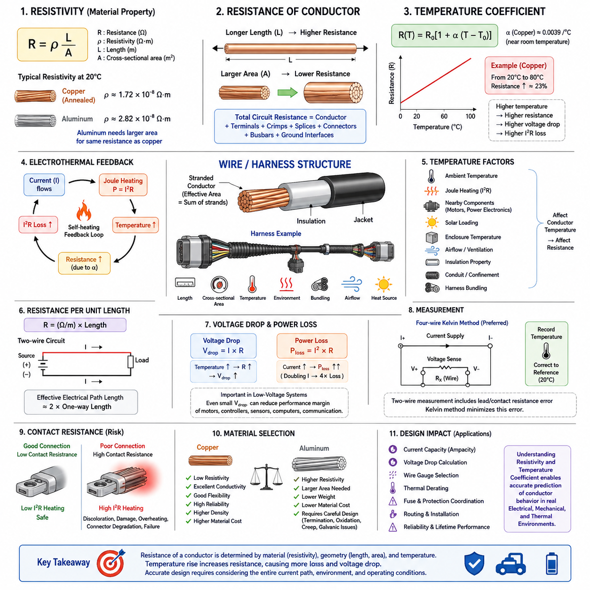
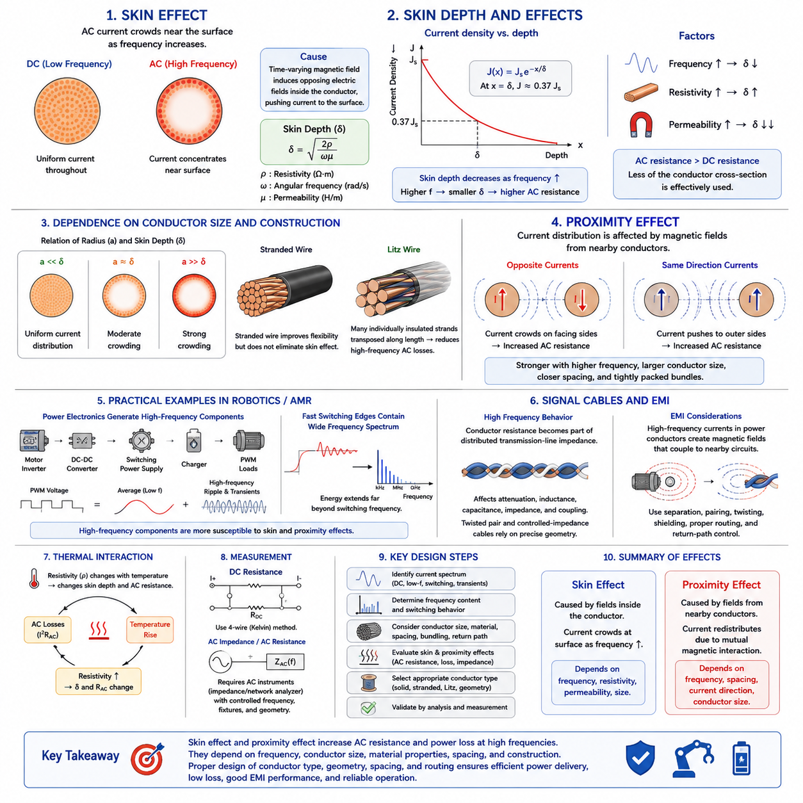
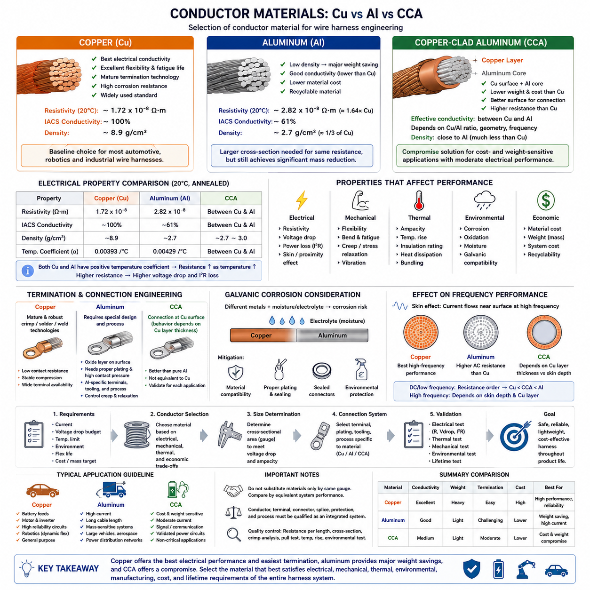
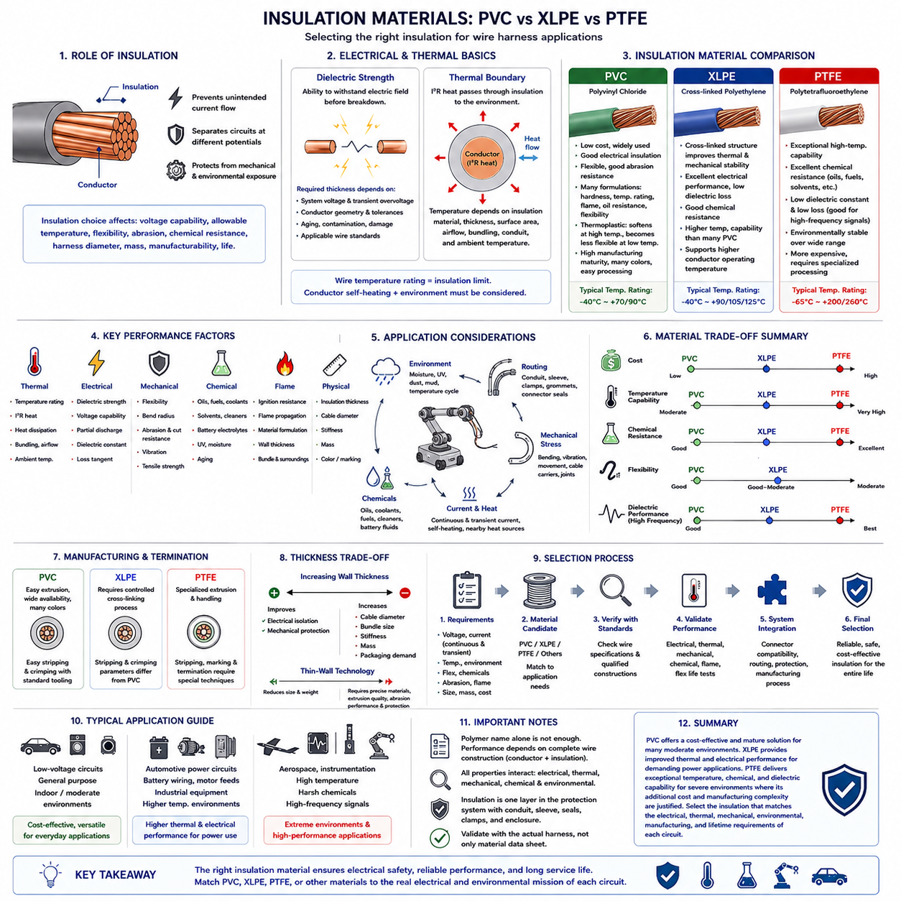
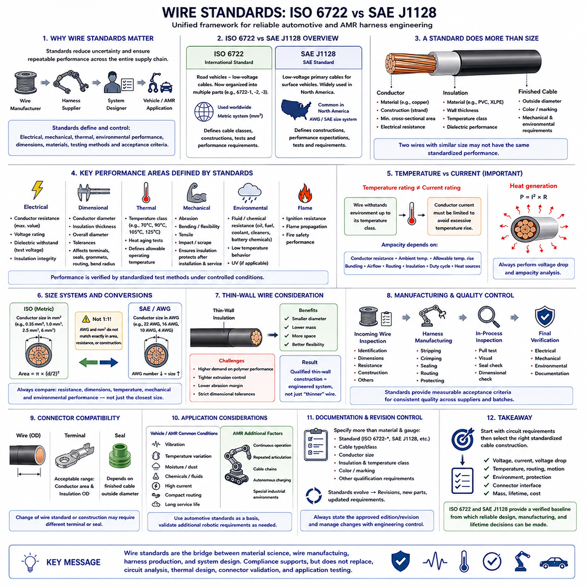

**Volume 02. Wire Harness Engineering**

# Chapter 01. Wire Physics

## 01.01. Resistivity and Temperature Coefficient

{width="7.268055555555556in" height="7.268055555555556in"}

전기 비저항(Electrical Resistivity)은 도체 재료가 전하(Electric Charge)의 이동을 방해하는 고유한 정도를 나타낸다. 와이어(Wire)의 물리적 치수에 따라 달라지는 저항(Resistance)과 달리, 비저항(Resistivity)은 주로 재료 자체의 특성이다. 균일한 도체에서 저항은 R = ρL/A로 표현되며, 여기서 ρ는 비저항(Resistivity), L은 도체 길이(Conductor Length), A는 단면적(Cross-sectional Area)을 의미한다.

이 관계는 모든 도체가 전원(Power Source)과 연결된 부하(Load) 사이에서 전기적 손실(Electrical Loss)을 발생시키기 때문에 와이어 하네스 엔지니어링(Wire Harness Engineering)의 기본 원리가 된다. 도체 길이가 증가하면 저항은 비례하여 증가하고, 도체 단면적이 증가하면 저항은 감소한다. 따라서 긴 하네스 분기(Harness Branch)나 고전류 회로(High-current Circuit)에서는 허용 가능한 전압 강하(Voltage Drop)와 열 성능(Thermal Performance)을 유지하기 위해 일반적으로 더 큰 도체가 필요하다.

구리(Copper)는 상대적으로 낮은 비저항과 우수한 기계적 유연성(Mechanical Flexibility), 제조성(Manufacturability), 접속 신뢰성(Connection Reliability)을 함께 제공하기 때문에 전기 하네스에 널리 사용된다. 약 20°C에서 어닐링 구리(Annealed Copper)의 비저항은 약 1.72 × 10⁻⁸ Ω·m이다. 알루미늄(Aluminum)은 비저항이 더 높으므로 구리 도체와 유사한 전기 저항을 얻으려면 일반적으로 더 큰 단면적이 필요하다.

저항 계산에서는 도체 비저항(Conductor Resistivity)과 실제 와이어 어셈블리(Wire Assembly)의 저항을 구분해야 한다. 도체 자체의 비저항이 매우 우수하더라도 전체 회로에는 터미널(Terminal), 크림프(Crimp), 스플라이스(Splice), 커넥터(Connector), 버스바(Busbar), 접지 인터페이스(Grounding Interface) 등에서 추가 저항이 발생할 수 있다. 따라서 하네스 분석은 도체 저항에서 시작하지만 궁극적으로 전원에서 부하와 귀환 경로(Return Path)에 이르는 전체 전류 경로(Current Path)를 고려해야 한다.

온도(Temperature)는 도체 저항에 상당한 영향을 미친다. 구리와 알루미늄 같은 일반적인 금속 도체에서는 온도가 상승하면 격자 진동(Lattice Vibration)이 증가하여 전자의 이동을 방해하기 때문에 일반적으로 저항이 증가한다. 적절한 온도 범위에서는 이러한 특성을 R(T) = R₀[1 + α(T − T₀)]로 근사할 수 있으며, 여기서 α는 저항 온도 계수(Temperature Coefficient of Resistance)를 의미한다.

실온 부근에서 구리의 온도 계수(Temperature Coefficient)는 약 0.0039/°C이다. 이는 기준 온도보다 상당히 높은 온도에서 동작하는 구리 도체의 저항이 실온 조건에서 계산된 값보다 눈에 띄게 증가할 수 있음을 의미한다. 따라서 공칭 20°C 저항만을 기준으로 설계한 하네스는 고온 동작 중 발생하는 실제 전압 강하와 도체 전력 손실(Conductor Power Loss)을 과소평가할 수 있다.

온도 계수는 중요한 전기-열 피드백(Electrothermal Feedback) 메커니즘을 형성한다. 도체를 흐르는 전류는 P = I²R에 따라 줄 가열(Joule Heating)을 발생시킨다. 도체 온도가 상승하면 저항도 증가하며, 전류가 거의 일정하게 유지되는 경우 I²R 손실이 더욱 증가할 수 있다. 따라서 최종 동작 온도(Operating Temperature)는 전기적 열 발생(Electrical Heat Generation)과 와이어가 주변으로 열을 방출하는 능력에 의해 함께 결정된다.

주변 온도(Ambient Temperature)는 도체 온도를 결정하는 하나의 요소일 뿐이다. 내부 줄 가열, 인접한 모터(Motor) 또는 전력 전자 장치(Power Electronics), 태양 복사열(Solar Loading), 인클로저 온도(Enclosure Temperature), 공기 흐름(Airflow), 절연 특성(Insulation Properties), 전선관 설치(Conduit Installation), 하네스 번들링(Harness Bundling) 등이 모두 열적 조건에 영향을 줄 수 있다. 따라서 고온 영역을 통과하는 와이어는 냉각되고 환기가 잘되는 환경의 동일한 와이어와 상당히 다른 저항을 나타낼 수 있다.

연선 도체(Stranded Conductor)의 전기적 단면적은 절연된 와이어의 외경이 아니라 개별 소선(Strand)의 금속 단면적을 합한 값에 해당한다. 연선 구조(Strand Construction)는 유연성과 피로 특성(Fatigue Behavior)에 큰 영향을 주며, 전체 도전 면적(Conductive Area)은 주로 직류 저항(DC Resistance)을 결정한다. 제조 공차(Manufacturing Tolerance), 소선 직경, 재료 순도(Material Purity), 도체 가공 과정 등에 의해 실제 측정 저항이 이상적인 이론값과 달라질 수도 있다.

와이어 저항은 일반적으로 Ω/km 또는 mΩ/m와 같은 단위 길이당 저항(Resistance per Unit Length)으로 표시된다. 이러한 표현은 배선 경로 길이(Routing Length)를 이용하여 회로 저항을 직접 추정할 수 있기 때문에 하네스 설계에 편리하다. 2선식 전력 회로(Two-wire Power Circuit)에서는 공급 도체와 귀환 도체가 모두 전압 강하에 기여하므로 유효 전기 경로 길이(Effective Electrical Path Length)는 전원과 부하 사이의 편도 물리적 거리보다 약 두 배가 될 수 있다.

전압 강하(Voltage Drop)는 옴의 법칙(Ohm\'s Law)에 따라 Vdrop = IR로 계산된다. 도체 저항은 온도 상승에 따라 증가하므로 전압 강하 역시 온도 의존적(Temperature-dependent)이다. 이는 작은 절대 전압 손실도 전체 공급 전압의 상당한 비율을 차지할 수 있는 저전압 시스템(Low-voltage System)에서 특히 중요하며, 모터, 제어기(Controller), 센서(Sensor), 컴퓨터 또는 통신 장비(Communication Equipment)의 동작 마진(Operating Margin)을 감소시킬 수 있다.

저항성 전력 손실(Resistive Power Dissipation)은 P = I²R로 계산되므로 하네스 열 설계에서 전류는 특히 중요한 요소이다. 저항이 일정한 경우 전류가 두 배가 되면 저항성 발열은 약 네 배가 된다. 따라서 도체 선정(Conductor Selection)은 와이어가 특정 전류를 물리적으로 전달할 수 있는지만을 기준으로 할 수 없으며, 전압 강하 제한, 절연체 온도 허용 능력(Insulation Temperature Capability), 설치 환경, 예상 듀티 사이클(Duty Cycle)을 함께 고려해야 한다.

이동 로봇(Mobile Robot)과 자율이동로봇(AMR)에서는 운전 상태에 따라 도체 온도가 크게 변화할 수 있다. 가속, 경사로 주행, 회전, 페이로드(Payload) 운송 또는 휠 스톨(Wheel Stall) 중 높은 추진 전류(Propulsion Current)가 케이블 발열을 일시적으로 증가시키는 반면, 유휴 구간(Idle Period)에서는 냉각이 이루어진다. 따라서 배터리 전압(Battery Voltage), 모터 제어기 전류 요구량, 케이블 길이, 도체 온도는 서로 독립된 설계 변수가 아니라 동적으로 상호작용한다.

최악 조건 회로 성능(Worst-case Circuit Performance)을 추정할 때 온도 보정(Temperature Correction)은 특히 중요하다. 실용적인 계산에서는 먼저 비저항, 길이, 단면적을 이용하여 기준 온도에서의 저항을 구한 다음 예상 동작 온도에 맞게 해당 저항을 보정할 수 있다. 이후 보정된 저항값을 전압 강하 및 I²R 손실 계산에 적용함으로써 실제 설치된 하네스의 동작을 더욱 현실적으로 표현할 수 있다.

예를 들어 구리 도체의 온도가 20°C에서 80°C로 상승하면 선형 온도 계수 근사(Linear Temperature-coefficient Approximation)를 적용했을 때 저항은 약 23% 증가한다. 따라서 실온에서 충분한 설계 여유를 보이는 회로도 지속적인 고전류 운전 조건에서는 전압 강하 또는 열적 한계(Thermal Limit)에 근접할 수 있다. 이는 실온 저항만으로는 견고한 하네스 사이징(Harness Sizing)을 수행하기에 충분하지 않다는 것을 보여준다.

선형 온도 모델(Linear Temperature Model)은 공학적 계산에 유용하지만 모든 조건에서 정확한 모델로 해석해서는 안 된다. 온도 계수는 재료 조성(Material Composition), 기준 온도, 순도, 동작 온도 범위에 따라 달라질 수 있다. 온도 변화 범위가 크거나 높은 정확도가 필요한 분석에서는 단순한 일정 온도 계수보다 제조사 저항 데이터, 표준화된 도체 사양(Standardized Conductor Specification), 또는 실험적으로 측정한 저항-온도 특성(Resistance-versus-temperature Characteristic)을 사용하는 것이 바람직하다.

측정(Measurement)은 이론적인 비저항과 실제 하네스 성능을 연결하는 중요한 과정이다. 전력 와이어의 저항은 수 밀리옴(Milliohm)에 불과할 수 있기 때문에 일반적인 2선식 저항 측정(Two-wire Resistance Measurement)에는 측정 리드선과 접촉 저항으로 인한 상당한 오차가 포함될 수 있다. 정밀한 저저항 특성 평가에는 별도의 전류 경로와 전압 측정 경로를 사용하여 리드선 및 프로브 접촉 저항의 영향을 줄이는 4선식 켈빈 측정(Four-wire Kelvin Measurement)이 적합하다.

저항을 측정할 때는 도체 온도도 함께 기록해야 한다. 차가운 상태의 와이어에서 측정한 저항값을 20°C 기준 사양과 직접 비교하면 도체가 정상임에도 차이가 있는 것처럼 보일 수 있다. 측정값을 동일한 기준 온도로 보정하면 생산 샘플(Production Sample), 공급업체 사양(Supplier Specification), 프로토타입(Prototype), 필드 회수 하네스(Field-return Harness) 사이에서 의미 있는 비교가 가능하다.

접촉 저항(Contact Resistance)은 벌크 도체 저항(Bulk Conductor Resistance)과 개념적으로 구분해야 한다. 긴 와이어에서는 재료 특성과 형상에 따라 전체 길이에 걸쳐 저항이 누적되는 반면, 불량하게 크림핑된 터미널(Poorly Crimped Terminal)은 매우 짧은 구간에서 국부적인 저항을 발생시킬 수 있다. 이러한 집중 저항(Localized Resistance)은 작은 영역에서 I²R 발열을 발생시켜 터미널 변색, 절연 손상, 커넥터 열화(Connector Degradation), 점진적인 열 고장(Thermal Failure)을 일으킬 수 있기 때문에 특히 위험하다.

따라서 재료 선정(Material Selection)은 단순히 공칭 비저항만을 비교하는 문제가 아니다. 구리는 우수한 전도성(Conductivity)을 제공하지만 상대적으로 밀도가 높고 재료 비용이 높은 반면, 알루미늄은 질량을 줄일 수 있지만 더 큰 단면적이 필요하며 단말 접속 기술(Termination Technology), 산화(Oxidation), 크리프(Creep), 갈바닉 적합성(Galvanic Compatibility)을 신중하게 고려해야 한다. 이러한 절충 관계(Trade-off)는 하네스 전류, 길이, 차량 전체 케이블 질량이 증가할수록 더욱 중요해진다.

비저항(Resistivity)과 온도 계수(Temperature Coefficient)는 궁극적으로 전류 용량(Current Capacity), 전압 강하(Voltage Drop), 와이어 게이지 선정(Wire Gauge Selection), 열적 디레이팅(Thermal Derating), 퓨즈 협조(Fuse Coordination), 배선 경로 설계(Routing), 보호 설계(Protection)와 같은 후속 하네스 엔지니어링 의사결정의 물리적 기반을 형성한다. 이러한 특성을 이해하면 설계자는 단순한 공칭 실험실 조건뿐만 아니라 시스템의 전체 운용 과정에서 발생하는 전기적, 기계적, 열적 환경을 고려하여 도체의 실제 거동을 예측할 수 있다.

## 01.02. Skin Effect and Proximity Effect

{width="7.268055555555556in" height="7.268055555555556in"}

표피 효과(Skin Effect)는 주파수(Frequency)가 증가함에 따라 교류 전류(Alternating Current)가 도체(Conductor)의 바깥쪽 표면으로 점차 집중되는 현상이다. 직류(Direct Current)의 경우 일반적인 조건에서 전류 밀도(Current Density)는 도체 단면 전체에 거의 균일하게 분포한다. 그러나 교류에서는 시간에 따라 변화하는 자기장(Time-varying Magnetic Field)이 내부 전자기 효과(Electromagnetic Effect)를 유도하여 전류 분포를 변화시키고 도체 중심부의 활용도를 감소시킨다.

표피 효과의 물리적 원인은 도체 내부에서 발생하는 전자기 유도(Electromagnetic Induction)이다. 교류 전류는 변화하는 자기장을 생성하고, 이 자기장은 다시 전자기 원리에 따라 전류 분포의 변화를 방해하는 유도 전기장(Induced Electric Field)을 발생시킨다. 이러한 반대 작용은 도체 내부에서 더 강하게 나타나므로 주파수가 증가할수록 전체 전류 중 더 많은 부분이 도체 표면 근처를 흐르게 된다.

표피 깊이(Skin Depth)는 교류 전류가 도체 내부로 얼마나 깊게 침투하는지를 나타내는 편리한 척도이다. 일반적으로 δ로 표현하며 δ = √(2ρ/ωμ)로 근사할 수 있다. 여기서 ρ는 비저항(Resistivity), ω는 각주파수(Angular Frequency), μ는 투자율(Magnetic Permeability)을 의미한다. 전류 밀도는 깊이에 따라 대략 지수적으로 감소하며, 한 표피 깊이에서는 표면값의 약 37%까지 감소한다.

표피 깊이 관계식은 주파수, 재료의 비저항, 투자율이 표피 효과의 정도를 결정한다는 것을 보여준다. 주파수가 증가하면 표피 깊이는 감소하며, 비저항이 증가하면 표피 깊이는 증가하는 경향이 있다. 높은 투자율을 가진 재료에서는 표피 깊이가 훨씬 작아질 수 있다. 따라서 고주파에서의 도체 거동은 직류 저항(DC Resistance)과 기하학적 단면적(Geometric Cross-sectional Area)만으로 평가할 수 없다.

구리(Copper)의 표피 깊이는 낮은 주파수에서 상대적으로 크며 주파수가 증가할수록 점차 작아진다. 일반적인 직류 전력 분배(DC Power Distribution) 또는 매우 낮은 주파수 동작에서는 보통의 하네스 와이어 크기에 대해 이러한 효과를 대부분 무시할 수 있다. 그러나 킬로헤르츠(Kilohertz), 특히 메가헤르츠(Megahertz) 영역에서는 전류가 도체 표면 근처에 점점 집중되면서 유효 교류 저항(Effective AC Resistance)이 직류 저항보다 증가할 수 있다.

교류 저항(AC Resistance)이 증가하는 이유는 도체의 전체 물리적 단면이 더 이상 전류 전도에 균등하게 사용되지 않기 때문이다. 도체에 포함된 금속의 양은 동일하지만 중심부는 외곽 영역보다 적은 전류를 전달하게 된다. 따라서 유효 도전 면적(Effective Conducting Area)이 감소하고 저항성 손실(Resistive Loss)이 증가한다. 이러한 직류 저항과 주파수 의존적 교류 저항(Frequency-dependent AC Resistance)의 차이는 고주파 전력 및 신호 응용에서 중요해진다.

도체 직경(Conductor Diameter)은 표피 효과가 실제로 얼마나 중요한지를 크게 좌우한다. 도체 반경이 표피 깊이보다 훨씬 작으면 전류 분포는 비교적 균일하게 유지된다. 도체 치수가 표피 깊이와 비슷하거나 그보다 커지면 전류 집중(Current Crowding)이 중요해진다. 따라서 고주파 전류를 전달하는 대형 도체는 직류 저항이 매우 낮더라도 상당한 교류 저항을 나타낼 수 있다.

연선(Stranded Wire)은 기계적 유연성(Mechanical Flexibility)을 향상시키지만 표피 효과를 자동으로 제거하지는 않는다. 일반적인 소선(Strand)이 길이 방향을 따라 서로 전기적으로 연결되어 있다면 전체 번들(Bundle)은 전자기적으로 하나의 더 큰 도체처럼 동작할 수 있다. 리츠선(Litz Wire)은 서로 개별적으로 절연된 다수의 소선을 사용하고 각 소선이 전체 번들 내에서 길이 방향을 따라 서로 다른 위치를 차지하도록 배치하여 이러한 문제를 줄인다.

리츠선 구조(Litz-wire Construction)는 각 소선의 직경을 표피 깊이와 관련하여 선정함으로써 고주파 손실(High-frequency Loss)을 감소시킬 수 있다. 소선의 전위 배치(Transposition)는 각 소선이 자기장에 노출되는 정도를 균등하게 하고 불균일한 전류 분포를 감소시키는 데 도움이 된다. 이러한 구조는 변압기(Transformer), 인덕터(Inductor), 무선 전력 시스템(Wireless-power System), 고주파 컨버터(High-frequency Converter) 등 일반 연선에서 과도한 교류 손실이 발생할 수 있는 응용 분야에서 유용하다.

근접 효과(Proximity Effect)는 표피 효과와 관련되어 있지만 주로 인접한 도체가 생성하는 자기장으로 인해 발생한다. 서로 가까이 배치된 도체에 교류 전류가 흐르면 한 도체에서 발생한 자기장이 다른 도체의 전류 분포에 영향을 미친다. 그 결과 전류가 각 도체의 표면에 대칭적으로 분포하지 않고 도체 간격과 전류 방향에 따라 특정 영역으로 집중될 수 있다.

서로 가까운 두 도체에 반대 방향의 전류가 흐르는 경우, 일반적인 공급 경로(Supply Path)와 귀환 경로(Return Path)에서 볼 수 있듯이 전자기적 상호작용(Electromagnetic Interaction)에 의해 전류가 특정한 마주 보는 영역으로 집중될 수 있다. 동일한 방향으로 전류가 흐르는 도체에서는 재분포 패턴이 달라진다. 두 경우 모두 불균일한 전류 밀도는 유효 도전 면적을 감소시키고 직류 저항만으로 예측한 값보다 교류 저항을 증가시킨다.

근접 효과는 주파수가 증가할수록 자기장이 더 빠르게 변화하고 더 강한 전류 재분포를 유도하기 때문에 더욱 커진다. 또한 도체 사이의 거리가 가까울수록, 도체 치수가 표피 깊이에 비해 클수록, 또는 많은 전류 전달 도체(Current-carrying Conductor)가 조밀하게 배치될수록 더욱 중요해진다. 따라서 모든 와이어가 동일한 도체 재료와 게이지(Gauge)를 사용하더라도 하네스 형상(Harness Geometry)에 따라 고주파 전기 손실이 달라질 수 있다.

번들 도체(Bundled Conductor)는 이러한 현상을 보여주는 중요한 실제 사례이다. 조밀하게 묶인 번들은 열 방출 제한으로 발생하는 일반적인 열적 디레이팅(Thermal Derating)뿐만 아니라 인접 와이어 사이의 전자기적 상호작용도 경험할 수 있다. 이 두 현상은 서로 다른 물리적 메커니즘으로, 열적 번들링(Thermal Bundling)은 열전달을 통해 도체 온도와 저항에 영향을 주는 반면 근접 효과는 전자기 결합(Electromagnetic Coupling)을 통해 교류 전류 분포 자체를 직접 변화시킨다.

로보틱스(Robotics)와 자율이동로봇(AMR) 하네스에서는 대부분의 배터리 및 저주파 전력 회로가 심각한 표피 효과보다는 직류 저항, 전압 강하(Voltage Drop), 열 부하(Thermal Loading), 과도 전류(Transient Current) 요구 조건의 영향을 더 크게 받는다. 그러나 현대의 전력 전자 장치(Power Electronics)는 훨씬 높은 주파수의 스위칭 성분을 발생시킨다. 모터 인버터(Motor Inverter), DC-DC 컨버터(DC-DC Converter), 스위칭 전원 공급 장치(Switching Power Supply), 충전기(Charger), PWM 제어 부하(PWM-controlled Load)는 저주파 전력 도체에 상당한 고주파 전류 성분을 발생시킬 수 있다.

펄스 폭 변조(Pulse-width Modulation)는 기본적인 전기적 동작과 고주파 전류 성분을 구분해야 하는 중요한 사례이다. 모터가 느리게 회전하더라도 인버터는 수 킬로헤르츠 또는 그 이상의 주파수로 스위칭할 수 있다. 따라서 하네스에는 직류 또는 저주파 평균 전류와 함께 스위칭 리플(Switching Ripple) 및 빠른 과도 성분(Fast Transient Component)이 흐를 수 있으며, 이러한 고주파 성분은 평균 전류보다 표피 효과와 근접 효과의 영향을 더 크게 받는다.

빠른 스위칭 에지(Fast Switching Edge)는 공칭 스위칭 주파수보다 훨씬 높은 영역까지 확장되는 주파수 성분을 포함한다. 따라서 전자기 적합성(Electromagnetic Compatibility)과 관련된 도체의 거동은 모터 속도나 PWM 주파수만으로 예상되는 것보다 훨씬 높은 주파수를 포함할 수 있다. 표피 효과와 근접 효과는 도체 임피던스(Conductor Impedance), 전력 손실, 공통 모드(Common-mode) 및 차동 모드(Differential-mode) 전류 경로, 접지 및 차폐 구성의 효과에 영향을 줄 수 있다.

신호 케이블(Signal Cable)은 다소 다른 관점에서 해석해야 한다. 고주파에서는 도체 저항이 단순한 직류 전압 강하를 발생시키는 요소가 아니라 분포 정수 전송선 임피던스(Distributed Transmission-line Impedance)의 일부가 된다. 표피 효과는 주파수 의존적 감쇠(Frequency-dependent Attenuation)에 기여하며, 도체 형상과 근접 관계는 인덕턴스(Inductance), 커패시턴스(Capacitance), 임피던스(Impedance), 결합(Coupling)에 영향을 미친다. 따라서 트위스티드 페어(Twisted Pair)와 제어 임피던스 케이블(Controlled-impedance Cable)은 정밀하게 정의된 도체 형상을 사용한다.

근접 효과와 전자기 간섭(Electromagnetic Interference)의 관계는 전력 배선과 신호 배선이 제한된 패키징 공간(Packaging Space)을 공유할 때 특히 중요하다. 모터 상(Motor Phase)이나 스위칭 전력 도체의 고주파 전류는 변화하는 자기장을 생성하여 인접 회로에 결합될 수 있다. 따라서 이격 거리(Separation Distance), 도체 페어링(Conductor Pairing), 트위스팅(Twisting), 차폐(Shielding), 배선 경로(Routing), 귀환 경로 제어(Return-path Control)는 신호 무결성뿐만 아니라 전자기적 상호작용을 제어하는 데에도 중요하다.

비저항이 표피 깊이 방정식에 직접 포함되기 때문에 온도(Temperature) 역시 중요한 요소이다. 도체 온도가 변하면 재료의 비저항도 변화하며, 이에 따라 표피 깊이와 교류 저항이 조금씩 변한다. 동시에 교류 손실 자체도 추가적인 열을 발생시킨다. 따라서 실제 고주파 도체 분석에서는 주파수 의존적 저항과 온도 의존적 재료 특성이 서로 영향을 주는 전기-열적 관점(Electrothermal View)이 필요할 수 있다.

고주파 도체 특성의 측정은 단순한 직류 저항 측정과 다르다. 4선식 켈빈 방법(Four-wire Kelvin Method)은 낮은 직류 저항을 측정하는 데 효과적이지만, 교류 임피던스(AC Impedance)를 측정하려면 주파수, 측정 픽스처의 기생 성분(Fixture Parasitics), 접촉 임피던스(Contact Impedance), 도체 형상을 제어할 수 있는 계측기와 시험 구성이 필요하다. 주파수 의존적 도체 성능을 정확하게 평가해야 하는 경우 임피던스 분석기(Impedance Analyzer), 네트워크 분석기(Network Analyzer), 또는 전문적인 교류 저항 측정 방법을 사용할 수 있다.

따라서 공학적 분석에서는 회로를 단순히 직류 또는 교류라고 분류하기보다 실제 전류 스펙트럼(Current Spectrum)을 먼저 파악해야 한다. 배터리 케이블에도 상당한 스위칭 리플이 흐를 수 있으며, 모터 상 도체에는 복잡한 PWM 파형이 존재할 수 있다. 도체 치수, 주파수 성분, 재료 특성, 간격, 번들링, 귀환 경로 형상을 파악하면 직류 저항만으로 충분한지 또는 교류 효과까지 고려해야 하는지를 판단할 수 있다.

표피 효과(Skin Effect)와 근접 효과(Proximity Effect)는 기본적인 와이어 물리학(Wire Physics)을 정적인 저항 개념에서 주파수 의존적 도체 거동(Frequency-dependent Conductor Behavior)으로 확장한다. 표피 효과는 도체 자체에서 발생하는 전자기장에 의해 전류가 재분포되는 현상이며, 근접 효과는 인접 도체가 생성하는 전자기장에 의해 그 분포가 변화하는 현상이다. 이 두 효과는 하네스 시스템에 더욱 빠른 전력 전자 장치와 통신 인터페이스(Communication Interface)가 적용될수록 도체 형상, 간격, 주파수, 전자기 환경이 중요해지는 이유를 설명한다.

## 01.03. Conductor Materials (Cu, Al, CCA)

{width="7.268055555555556in" height="7.268055555555556in"}

구리(Copper)는 전기 전도성(Electrical Conductivity), 기계적 유연성(Mechanical Flexibility), 단말 접속 신뢰성(Termination Reliability), 내식성(Corrosion Resistance), 제조 기술 성숙도(Manufacturing Maturity) 사이에서 효과적인 균형을 제공하기 때문에 와이어 하네스 엔지니어링(Wire-harness Engineering)에서 가장 널리 사용되는 도체 재료이다. 알루미늄(Aluminum)은 더 높은 전기 비저항과 까다로운 접속 설계를 감수하는 대신 상당한 질량 감소를 제공하며, 구리 피복 알루미늄(Copper-clad Aluminum)은 특정 응용 분야에서 두 재료의 특성을 결합한다.

구리의 비저항(Resistivity)은 어닐링된 재료(Annealed Material)를 기준으로 20°C에서 약 1.72 × 10⁻⁸ Ω·m이며, 대규모 전기 배선에 실용적으로 사용되는 금속 중 가장 높은 수준의 전도성을 제공한다. 높은 전도성으로 인해 필요한 전류를 비교적 작은 도체 단면적(Conductor Cross-sectional Area)으로 전달할 수 있으며, 전압 강하(Voltage Drop)와 저항성 발열(Resistive Heating)을 줄이는 동시에 고밀도 하네스 어셈블리(Harness Assembly)의 패키징을 단순화할 수 있다.

전기 전도성은 흔히 국제 어닐링 구리 표준(International Annealed Copper Standard, IACS)을 기준으로 표현된다. 어닐링 구리(Annealed Copper)는 약 100% IACS 전도성을 나타내지만 특정 구리 합금(Copper Alloy)과 가공 조건에 따라 다른 값을 가질 수 있다. 이러한 기준은 전도성이 낮아질수록 저항, 전압 강하, 발열, 그리고 회로에 필요한 단면적에 직접적인 영향을 주기 때문에 도체 재료를 비교하는 편리한 기준을 제공한다.

구리는 유연한 하네스 응용에서도 우수한 기계적 성능을 제공한다. 소선 구조(Strand Construction), 굽힘 반경(Bend Radius), 배선 경로(Routing)를 적절하게 설계하면 미세 연선 구리 도체(Fine-stranded Copper Conductor)는 단선 도체(Solid Conductor)보다 반복적인 굽힘을 훨씬 효과적으로 견딜 수 있다. 이러한 특성은 로봇(Robot), 자율이동로봇(AMR), 매니퓰레이터(Manipulator), 조향 모듈(Steering Module), 서비스 루프(Service Loop), 관절부 등 진동이나 반복 운동이 발생하는 시스템에서 특히 중요하다.

단말 접속 기술(Termination Technology) 역시 구리의 주요 장점이다. 자동차 및 산업용 크림프 시스템(Crimp System)은 수십 년 동안 구리 도체에 최적화되어 왔으며, 적절한 터미널(Terminal), 공구(Tooling), 공정 관리(Process Control)를 적용하면 안정적인 기계적 압착과 낮은 전기 접촉 저항(Contact Resistance)을 얻을 수 있다. 또한 구리는 전기 시스템에서 사용되는 다양한 납땜(Soldering), 용접(Welding), 초음파 접합(Ultrasonic Joining), 버스바(Busbar), 커넥터 기술과도 높은 호환성을 갖는다.

그러나 구리에도 단점은 존재한다. 밀도는 약 8.9 g/cm³로 높기 때문에 대형 구리 하네스는 차량이나 로봇 전체 질량에서 상당한 비중을 차지할 수 있다. 또한 구리 가격은 하네스 비용에서 중요한 요소가 될 수 있다. 따라서 전력 수준과 케이블 길이가 증가하면 설계자는 특히 대형 차량, 배터리 시스템(Battery System), 항공우주 플랫폼(Aerospace Platform), 고전류 전력 분배망(High-current Power Distribution Network)에서 더 가벼운 도체 기술을 검토할 수 있다.

알루미늄의 밀도는 약 2.7 g/cm³로 구리의 약 3분의 1에 불과하기 때문에 하네스 질량을 크게 줄일 수 있는 가능성을 제공한다. 그러나 20°C에서 전기 비저항은 약 2.82 × 10⁻⁸ Ω·m로 구리보다 상당히 높다. 따라서 동일한 수준의 전기 저항을 얻으려면 알루미늄 도체는 구리 도체보다 더 큰 단면적을 필요로 한다.

알루미늄은 필요한 단면적이 증가하더라도 밀도가 구리보다 훨씬 낮기 때문에 질량 측면의 장점을 유지할 수 있다. 따라서 적절하게 설계된 알루미늄 도체는 허용 가능한 전기 저항을 유지하면서 상당한 중량 절감(Weight Saving)을 제공할 수 있다. 반면 도체 직경이 증가하므로 하네스 패키징(Harness Packaging), 커넥터 치수, 굽힘 반경, 배선 공간, 전선관(Conduit) 크기, 주변 구조물과의 최소 이격 거리 등에 영향을 줄 수 있다.

알루미늄 단말 접속(Aluminum Termination)은 일반적인 구리 단말 접속보다 세심한 엔지니어링이 필요하다. 알루미늄은 자연적으로 얇은 산화막(Oxide Layer)을 형성하며 이 산화막의 전기적 특성은 내부 금속과 다르다. 따라서 신뢰성 있는 접속은 구리용 단말 공정을 그대로 적용하는 것이 아니라 알루미늄 도체에 맞게 설계된 터미널 재료, 도금(Plating), 접촉 압력(Contact Pressure), 크림프 형상(Crimp Geometry), 표면 처리(Surface Preparation), 접합 공정에 의존한다.

기계적 거동(Mechanical Behavior)도 고려해야 한다. 알루미늄은 일반적으로 전기적 접속부에서 구리보다 크리프(Creep), 응력 완화(Stress Relaxation), 특정 피로 메커니즘(Fatigue Mechanism)에 더 민감하다. 초기에는 충분한 접촉 압력을 제공하는 접속이라도 단말 설계에서 온도 사이클링(Temperature Cycling)과 사용 수명 동안의 재료 거동을 고려하지 않으면 성능이 저하될 수 있다. 따라서 검증된 알루미늄 전용 터미널과 제어된 제조 공정이 필수적이다.

갈바닉 부식(Galvanic Corrosion)은 습기나 전해질(Electrolyte)이 존재하는 환경에서 알루미늄이 서로 다른 금속과 전기적으로 접속될 때 고려해야 하는 또 다른 중요한 문제이다. 구리-알루미늄 인터페이스(Copper-aluminum Interface)에는 재료 적합성(Material Compatibility), 도금, 밀봉(Sealing), 환경 보호(Environmental Protection)가 신중하게 적용되어야 한다. 실외 로봇, 충전 인터페이스(Charging Interface), 배터리 구획 또는 습윤 환경에서는 장기간 저항 안정성을 위해 커넥터 밀봉과 부식 방지 전략이 특히 중요하다.

일반적으로 CCA로 약칭되는 구리 피복 알루미늄(Copper-clad Aluminum)은 알루미늄 코어(Aluminum Core)의 외부를 구리층(Copper Layer)으로 덮은 구조이다. 이 개념은 알루미늄의 낮은 밀도와 낮은 재료 비용을 구리의 일부 표면 특성과 결합하는 것을 목표로 한다. 전기적 접촉은 도체 표면에서 이루어지므로 외부 구리층은 일부 접속 공정과의 호환성을 향상시킬 수 있으며, 내부 알루미늄 코어는 전체 도체 질량을 감소시킨다.

CCA는 동일한 공칭 단면적을 가진 순수 구리(Solid Copper)와 전기적으로 동등하다고 간주해서는 안 된다. 유효 전도성(Effective Conductivity)은 구리와 알루미늄의 비율, 제조 공정, 도체 형상, 동작 주파수에 따라 달라진다. 직류 및 저주파 전력 회로에서 CCA 도체는 일반적으로 동일한 단면적의 구리 도체보다 높은 저항을 가지므로 동일한 전압 강하 및 열적 요구 조건을 충족하려면 더 큰 게이지(Gauge)가 필요할 수 있다.

고주파에서는 표피 효과(Skin Effect)로 인해 전류가 도체 표면으로 점점 집중된다. CCA는 전도성이 더 높은 구리를 알루미늄 코어의 외부에 배치하기 때문에 고주파 특성이 균질한 알루미늄 도체(Homogeneous Aluminum Conductor)와 다르게 나타날 수 있다. 그러나 실제 성능은 표피 깊이(Skin Depth)에 대한 구리층 두께의 비율에 크게 의존하므로 단순히 CCA라는 명칭만으로 성능을 가정해서는 안 된다.

CCA는 질량과 비용이 중요하지만 구리의 최대 전도성이 반드시 필요하지 않은 응용에서 유용한 절충안(Compromise)을 제공할 수 있다. 통신 케이블(Communication Cable), 일부 신호 배선(Signal Wiring), 특정 전력 응용 등에 사용될 수 있다. 그러나 안전 필수(Safety-critical), 고전류, 반복 굽힘(Repetitive-flex), 가혹 환경 로봇 회로에서는 단순히 중량이나 가격만으로 선정하지 않고 전기적, 기계적, 열적, 단말 접속, 수명 요구 조건에 대해 도체 구조를 검증해야 한다.

도체 재료는 온도 의존적 저항(Temperature-dependent Resistance)에도 영향을 준다. 구리와 알루미늄은 모두 양의 온도 계수(Positive Temperature Coefficient)를 가지므로 동작 온도가 상승하면 저항도 증가한다. 따라서 재료 비교는 공칭 20°C 기준 조건만이 아니라 실제 예상 동작 온도에서 수행해야 한다. 저항 증가는 전압 강하와 I²R 손실을 증가시키며 전체 하네스의 열적 평형(Thermal Equilibrium)에도 영향을 줄 수 있다.

전류 용량(Current Capacity)은 전도성만으로 결정할 수 없다. 허용 전류(Ampacity)는 도체 단면적, 절연체 온도 등급(Insulation Temperature Rating), 주변 온도(Ambient Temperature), 번들링(Bundling), 배선 경로, 공기 흐름(Airflow), 전선관 또는 슬리브(Sleeve) 설치, 듀티 사이클(Duty Cycle), 허용 온도 상승(Allowable Temperature Rise)에 따라 결정된다. 더 큰 알루미늄 또는 CCA 도체가 적절한 저항을 확보하더라도 서로 다른 직경과 열 환경으로 인해 구리 회로와 다른 설치 특성을 나타낼 수 있다.

기계적 유연성 역시 기본 재료만으로 결정되지 않는다. 소선 수(Strand Count), 개별 소선 직경, 도체 꼬임(Conductor Lay), 절연 구조(Insulation Construction), 굽힘 반경, 인장 하중(Tensile Loading), 진동, 반복 굽힘 요구 조건 등이 모두 하네스 내구성(Harness Durability)에 영향을 준다. 미세 연선 구리는 동적 로봇 배선(Dynamic Robotic Wiring)에 여전히 유리하며, 대체 도체 구조는 움직이는 하네스 구간에 적용하기 전에 응용별 굽힘 및 피로 검증이 필요하다.

재료 선택(Material Choice)은 커넥터 엔지니어링(Connector Engineering)에도 연쇄적으로 영향을 미친다. 구리에서 알루미늄 또는 CCA로 변경하면 서로 다른 터미널 배럴(Terminal Barrel), 크림프 치수, 도금 시스템, 밀봉 방법, 스트레인 릴리프(Strain Relief), 검사 기준(Inspection Criteria), 공정 파라미터(Process Parameter)가 필요할 수 있다. 따라서 도체는 하네스의 다른 구성 요소와 독립적으로 대체할 수 없으며 와이어, 터미널, 커넥터, 스플라이스(Splice), 보호 장치, 제조 공정을 통합된 접속 시스템(Integrated Connection System)으로 검증해야 한다.

도체의 외관만으로는 전기적 성능을 신뢰성 있게 판단하기 어려울 수 있기 때문에 품질 관리(Quality Control)는 특히 중요하다. 단위 길이당 저항(Resistance per Unit Length) 측정, 도체 단면 검사(Conductor Cross-section Inspection), 재료 확인(Material Verification), 크림프 단면 분석(Crimp Cross-section Analysis), 인장력 시험(Pull-force Testing), 온도 상승 시험(Temperature-rise Testing), 환경 검증(Environmental Validation)을 통해 제조된 하네스가 의도한 요구 조건을 충족하는지 확인할 수 있다. 공급업체 사양에도 단순한 공칭 게이지만이 아니라 도체 재료를 명확하게 표시해야 한다.

자율이동로봇(AMR)의 전력 분배(Power Distribution)에서는 구리가 예측 가능한 전기적 특성과 접속 특성을 제공하기 때문에 일반적으로 배터리 전원선(Battery Feed), 모터 제어기 회로(Motor-controller Circuit), 컴퓨팅 전원(Computing Power), 센서, 통신 배선의 기본적인 기준 재료가 된다. 전류, 케이블 길이, 전체 하네스 질량이 증가할수록 알루미늄의 장점이 커지며, CCA는 전기적·기계적 한계가 해당 회로 요구 조건과 양립할 수 있는 경우 선택적으로 고려할 수 있다.

대형 로봇 플랫폼(Robotic Platform), 자율주행차(Autonomous Vehicle), 모바일 매니퓰레이터(Mobile Manipulator), 미래의 고출력 시스템(High-power System)에서는 도체 선정이 점차 시스템 수준 최적화(System-level Optimization) 문제가 된다. 구리는 도체 저항을 최소화하고 단말 접속을 단순화하며, 알루미늄은 질량을 최소화하고, CCA는 그 중간의 설계 영역을 제공할 수 있다. 따라서 적합한 재료는 전류, 길이, 전압 강하 예산(Voltage-drop Budget), 열 환경, 패키징 체적(Packaging Volume), 운동 조건, 수명, 비용, 서비스 환경에 따라 결정된다.

구리, 알루미늄, 구리 피복 알루미늄은 궁극적으로 동일한 공칭 게이지가 아니라 동등한 시스템 성능(Equivalent System Performance)을 기준으로 비교해야 한다. 올바른 질문은 단순히 어떤 재료의 비저항이 가장 낮은지가 아니라, 제품의 전체 수명 동안 전기적, 열적, 기계적, 환경적, 제조적, 신뢰성 및 질량 요구 조건을 만족할 수 있는 도체 크기와 접속 시스템이 무엇인지에 관한 것이다. 이러한 접근 방법은 이후의 전류 용량(Current Capacity)과 와이어 게이지 선정(Wire-gauge Selection)을 위한 합리적인 기반을 제공한다.

## 01.04. Insulation Materials (PVC, XLPE, PTFE)

{width="7.268055555555556in" height="7.268055555555556in"}

전기 절연(Electrical Insulation)은 도체(Conductor)를 둘러싸면서 의도하지 않은 전류 흐름을 방지하고, 서로 다른 전위(Electrical Potential)를 가진 회로를 분리하며, 도체를 기계적·환경적 노출로부터 보호하는 재료이다. 와이어 하네스 엔지니어링(Wire-harness Engineering)에서 절연재 선택은 전압 허용 능력, 허용 도체 온도, 유연성, 내마모성(Abrasion Resistance), 내화학성(Chemical Durability), 하네스 직경, 질량, 제조성, 사용 수명에 직접적인 영향을 미친다.

절연 시스템(Insulation System)은 의도된 동작 환경 전체에서 충분한 유전 강도(Dielectric Strength)를 유지해야 한다. 유전 강도는 재료가 전기적 절연 파괴(Electrical Breakdown)가 발생하기 전에 견딜 수 있는 전기장 수준을 나타낸다. 따라서 필요한 절연 두께는 공칭 시스템 전압뿐만 아니라 과도 과전압(Transient Overvoltage), 도체 형상, 제조 공차, 노화(Aging), 오염, 기계적 손상, 적용되는 와이어 표준(Wire Standard)에 따라 결정된다.

절연재는 도체 주변에 중요한 열적 경계(Thermal Boundary)를 형성한다. 도체를 흐르는 전류는 I²R 열을 발생시키며, 이 열은 주변 환경으로 전달되기 전에 절연재를 통과해야 한다. 따라서 절연재의 종류와 두께, 표면적, 공기 흐름(Airflow), 번들링(Bundling) 조건, 전선관(Conduit), 주변 온도(Ambient Temperature)는 도체 온도에 영향을 미치며 와이어가 안전하게 연속적으로 전달할 수 있는 전류를 결정한다.

와이어의 온도 등급(Temperature Rating)을 단순히 주변 환경의 온도 한계로 해석해서는 안 된다. 일반적으로 이는 해당 와이어 구조와 표준에 의해 정의된 재료 또는 도체의 최대 허용 동작 조건(Maximum Permitted Operating Condition)을 의미한다. 따라서 연속 및 과도 전류 조건에서 절연재가 허용 동작 범위 내에 유지되는지를 평가할 때는 도체의 자체 발열(Self-heating)을 환경적인 열 부하(Environmental Thermal Loading)에 추가하여 고려해야 한다.

일반적으로 PVC로 약칭되는 폴리염화비닐(Polyvinyl Chloride)은 비교적 낮은 비용과 실용적인 전기 절연 성능, 유연성, 내마모성, 용이한 제조성을 함께 제공하기 때문에 가장 널리 사용되는 절연재 중 하나이다. 다양한 배합(Formulation)을 통해 경도, 온도 허용 능력, 난연 특성(Flame Behavior), 내유성(Oil Resistance), 유연성을 조정할 수 있어 다양한 저전압 자동차, 산업 장비, 가전제품 및 범용 하네스에 적합하다.

PVC는 열가소성 재료(Thermoplastic Material)이므로 온도가 상승함에 따라 기계적 특성이 변화하고 충분히 높은 열에 노출되면 연화(Softening)될 수 있다. 이러한 특성은 모터, 전력 전자 장치(Power Electronics), 배터리, 히터(Heater) 및 기타 고온 부품 주변에서 반드시 고려해야 한다. 장기간 높은 온도에 노출되면 노화가 가속되고 기계적 성능이 저하될 수 있으며, 매우 낮은 온도에서는 특정 배합에 따라 유연성이 감소할 수 있다.

PVC의 주요 장점 중 하나는 높은 제조 기술 성숙도(Manufacturing Maturity)이다. 구리 도체 주변에 효율적으로 압출(Extrusion)할 수 있으며 다양한 색상, 벽 두께(Wall Thickness), 재료 배합으로 생산할 수 있다. 이를 통해 대량 하네스 생산, 회로 식별(Circuit Identification), 스트리핑(Stripping), 크림핑(Crimping), 자동화 가공을 지원할 수 있다. 그러나 PVC 와이어의 정확한 성능은 배합에 크게 의존하므로 단순히 PVC라는 재료 명칭만으로 공학적 성능을 정의할 수는 없다.

가교 폴리에틸렌(Cross-linked Polyethylene, XLPE)은 폴리에틸렌 기반 고분자(Polyethylene-based Polymer)의 분자 구조를 가교(Cross-linking)하여 열적·기계적 안정성을 향상시킨 재료이다. 가교 구조는 고분자 사슬(Polymer Chain)의 움직임을 제한하여 일반적인 열가소성 폴리에틸렌이 크게 연화되는 온도에서도 유용한 물성을 유지할 수 있도록 한다. 따라서 XLPE는 높은 열적 성능과 견고한 전기적 성능이 요구되는 분야에서 널리 사용된다.

XLPE는 일반적으로 우수한 전기 절연 특성, 비교적 낮은 유전 손실(Dielectric Loss), 우수한 내화학성, 그리고 많은 기존 PVC 배합보다 높은 온도 허용 능력을 제공한다. 이러한 특성으로 인해 자동차 전력 회로(Automotive Power Circuit), 배터리 배선(Battery Wiring), 모터 전원선(Motor Feed), 산업 장비 및 도체가 지속적인 전류 부하나 높은 주변 온도에 노출될 수 있는 응용 분야에 적합하다.

XLPE의 향상된 열적 성능은 더 높은 도체 동작 온도(Conductor Operating Temperature)를 지원할 수 있지만, 이것이 동일한 와이어 게이지(Wire Gauge)에서 원하는 만큼 전류를 증가시켜도 안전하다는 의미는 아니다. 허용 전류(Ampacity)는 여전히 발열과 방열(Heat Dissipation)에 의해 결정된다. 따라서 번들링, 주변 온도, 배선 경로(Routing), 인클로저(Enclosure) 조건, 인접 열원, 도체 크기, 커넥터 한계를 절연재 온도 등급과 함께 평가해야 한다.

가교 구조는 제조 및 재활용 특성에도 영향을 미친다. 반복적으로 연화하고 다시 용융할 수 있는 일반적인 열가소성 재료와 달리 가교 재료는 단순히 기존의 용융 상태로 돌아가지 않는 네트워크 구조(Network Structure)를 형성한다. 따라서 가공, 스트리핑, 단말 접속(Termination), 수리, 수명 종료(End-of-life) 처리 방식이 PVC와 달라질 수 있으며, 제조 파라미터는 특정 XLPE 와이어 구조에 맞게 설정되어야 한다.

일반적으로 PTFE로 알려진 폴리테트라플루오로에틸렌(Polytetrafluoroethylene)은 뛰어난 온도 허용 능력, 내화학성, 유전 성능(Dielectric Performance), 환경 안정성(Environmental Stability)으로 평가되는 불소수지 절연재(Fluoropolymer Insulation Material)이다. PTFE는 많은 일반 고분자 절연재가 사용되기 어려운 환경에서도 동작할 수 있어 항공우주, 고온 산업 장비, 계측 장비(Instrumentation), 특수 로보틱스 및 가혹한 전기 시스템에 특히 적합하다.

PTFE는 다양한 화학물질, 오일, 연료, 용제(Solvent), 환경 오염물질에 대해 매우 높은 내성을 갖는다. 이러한 화학적 불활성(Chemical Inertness)은 하네스가 공격적인 유체나 예측하기 어려운 오염에 노출되는 영역을 통과할 때 유리하다. 또한 PTFE는 넓은 온도 범위에서 유용한 전기적 특성을 유지하므로 심한 환경 변화에서도 안정적인 절연 성능이 요구되는 응용 분야를 지원한다.

PTFE의 또 다른 중요한 특성은 많은 일반 절연재에 비해 낮은 유전율(Dielectric Constant)과 낮은 유전 손실이다. 이러한 특성은 절연재가 케이블의 커패시턴스(Capacitance), 특성 임피던스(Characteristic Impedance), 전파 특성(Propagation Behavior), 유전 손실에 직접 관여하는 고주파 신호 및 통신 케이블에서 유리할 수 있다. 따라서 이러한 회로에서 절연재 선택은 단순한 전기적 격리를 넘어 신호 무결성 설계(Signal-integrity Design)의 일부가 된다.

그러나 PTFE에도 실용적인 절충 관계(Trade-off)가 존재한다. 일반적인 PVC와 많은 XLPE 구조보다 가격이 높으며, 가공 특성 때문에 전문적인 제조 기술이 필요하다. 또한 표면의 기계적 특성이 스트리핑, 단말 접속, 마킹(Marking), 클램핑(Clamping), 하네스 조립에 영향을 줄 수 있다. 따라서 모든 회로에 PTFE를 적용하면 유용한 시스템 수준의 이점 없이 비용과 제조 복잡성만 증가할 수 있다.

로봇 하네스에서는 유전 특성만큼 기계적 특성(Mechanical Properties)도 중요하다. 절연재는 도체가 노출되지 않도록 굽힘, 진동, 마모, 클램프 압력, 날카로운 모서리와의 접촉, 설치 과정에서 발생하는 힘, 유지보수 작업을 견뎌야 한다. 온도 성능이 뛰어난 재료라도 전체 와이어 구조가 요구되는 반복 굽힘 사이클(Repetitive-flex Cycle)과 최소 굽힘 반경(Minimum Bend Radius)을 견디지 못한다면 움직이는 하네스에는 적합하지 않을 수 있다.

절연재 두께(Insulation Thickness) 역시 시스템 수준의 절충 관계를 만든다. 벽 두께를 증가시키면 기계적 보호와 전기적 절연을 향상시킬 수 있지만 케이블 직경, 번들 크기, 강성(Stiffness), 질량, 패키징 요구량도 증가한다. 박벽 와이어 기술(Thin-wall Wire Technology)은 하네스 체적과 무게를 줄일 수 있지만 재료, 압출 품질, 내마모 성능, 제조 공차를 정밀하게 관리하고 기계적 손상으로부터 적절하게 보호해야 한다.

화학적 적합성(Chemical Compatibility)은 단순히 내유성 같은 일반적인 설명이 아니라 실제 동작 환경을 기준으로 평가해야 한다. 로봇 하네스는 윤활유(Lubricant), 유압 유체(Hydraulic Fluid), 세정제, 배터리 전해질(Battery Electrolyte), 냉각수(Coolant), 접착제, 페인트, 연료 또는 실외 오염물질에 노출될 수 있다. 온도와 기계적 응력은 화학적 열화를 가속할 수 있으므로 복합적인 환경 노출은 개별 실험실 시험보다 더욱 가혹할 수 있다.

난연 특성(Flame Behavior) 역시 중요한 절연재 특성이다. 전기적 고장, 도체 과부하, 불량 터미널, 인접한 고온 부품은 절연재를 비정상적인 열적 조건에 노출시킬 수 있다. 응용 분야와 관련 표준에 따라 절연재에는 점화에 대한 저항 또는 화염 전파(Flame Propagation)를 제한하는 성능이 요구될 수 있다. 재료 배합, 벽 두께, 번들 구성, 주변 부품, 보호 슬리브(Protective Sleeve)는 최종적인 화재 거동에 영향을 준다.

실외 자율이동로봇(Outdoor AMR)과 모바일 로봇(Mobile Robot)에서는 절연재가 추가적으로 습기, 자외선(Ultraviolet Radiation), 온도 사이클링, 먼지, 진흙, 도로 오염물질, 반복적인 기계 진동에 노출될 수 있다. 따라서 와이어 절연재는 주름관(Corrugated Conduit), 편조 슬리브(Braided Sleeve), 테이프, 그로밋(Grommet), 클램프, 커넥터 씰(Connector Seal), 인클로저 보호와 함께 고려해야 한다. 절연재는 유일한 환경 보호막이 아니라 전체 하네스 보호 아키텍처(Harness Protection Architecture)를 구성하는 하나의 계층이다.

동적 로봇 응용(Dynamic Robotic Application)은 조향 어셈블리(Steering Assembly), 서스펜션 움직임, 매니퓰레이터, 관절, 케이블 캐리어(Cable Carrier), 이동형 드라이브 모듈(Moving Drive Module) 주변에서 특히 까다로운 요구 조건을 발생시킨다. 미세 연선 도체(Fine-stranded Conductor)는 도체 유연성을 향상시키며, 절연재는 균열, 과도한 경화(Hardening), 도체와의 분리 없이 반복 변형을 수용해야 한다. 따라서 굽힘 수명 성능(Flex-life Performance)은 고분자 종류만으로 추정하지 않고 완전한 와이어 구조를 대상으로 검증해야 한다.

따라서 PVC, XLPE, PTFE를 단일한 척도에서 열등한 재료에서 우수한 재료 순으로 평가해서는 안 된다. PVC는 많은 중간 수준의 환경에서 비용 효율적이고 제조 기술이 성숙한 솔루션을 제공한다. XLPE는 까다로운 전력 응용을 위한 향상된 열적·전기적 성능을 제공하며, PTFE는 가혹한 환경에서 추가적인 비용과 제조 복잡성을 정당화할 수 있을 때 뛰어난 온도, 화학적, 유전 성능을 제공한다.

최종적인 절연재 선정(Insulation Selection)은 시스템 전압, 연속 및 과도 전류, 예상 도체 온도, 주변 온도, 배선 환경, 굽힘 요구 조건, 화학물질 노출, 마모 위험, 난연 요구 조건, 케이블 직경, 질량, 제조 공정, 커넥터 호환성, 수명, 비용에서 시작해야 한다. 이후 적용 가능한 와이어 사양(Wire Specification)을 통해 단순히 고분자 재료 이름에 의존하는 것이 아니라 요구 조건을 충족하는 검증된 와이어 구조를 결정해야 한다.

궁극적으로 절연재(Insulation Material)는 전체 하네스의 전기-열적(Electrothermal), 기계적, 환경적 설계를 구성하는 중요한 요소이다. 도체는 기본적인 전기 저항을 결정하는 반면 절연재는 열전달(Heat Transfer), 유전 절연(Dielectric Isolation), 물리적 보호, 장기 내구성(Lifetime Durability)에 큰 영향을 미친다. 따라서 PVC, XLPE, PTFE 또는 다른 재료의 선택은 각 회로가 실제로 수행해야 하는 전기적·환경적 임무에 전체 와이어 구조를 적합시키는 과정으로 이루어져야 한다.

## 01.05. Wire Standards (ISO 6722, SAE J1128)

{width="7.268055555555556in" height="7.268055555555556in"}

와이어 표준(Wire Standards)은 도체 구조(Conductor Construction), 절연 성능(Insulation Performance), 치수 한계(Dimensional Limits), 환경 내구성(Environmental Durability), 검증 방법(Verification Methods)을 규정하기 위한 통제된 엔지니어링 프레임워크(Engineering Framework)를 제공한다. 자동차 및 모바일 로봇 하네스에서 표준은 단순히 구리 와이어나 PVC 절연 케이블과 같은 일반적인 표현에 의존하지 않고 반복 가능한 요구 조건을 정의함으로써 와이어 제조업체, 하네스 공급업체, 시스템 설계자 사이의 불확실성을 줄인다.

ISO 6722는 역사적으로 저전압 도로 차량 케이블(Low-voltage Road-vehicle Cable)을 위한 가장 중요한 국제 표준 중 하나이다. 이 표준은 자동차용 와이어가 허용 가능한 전기적, 기계적, 열적, 환경적 성능을 유지하도록 하기 위한 요구 조건과 시험 방법을 규정한다. 현대의 ISO 케이블 요구 조건은 여러 파트(Part)와 관련 표준으로 발전해 왔으므로 엔지니어는 프로젝트에 적용되는 정확한 문서, 파트, 개정판(Revision), 케이블 등급(Cable Class)을 항상 확인해야 한다.

SAE J1128은 지상 차량(Surface Vehicle)에 사용되는 저전압 1차 케이블(Low-voltage Primary Cable)을 위한 또 하나의 널리 알려진 프레임워크를 제공한다. 이 표준은 전통적으로 북미 자동차 엔지니어링에서 중요하게 사용되어 왔으며 차량 배선에 적합한 케이블 구조와 성능 요구 조건을 정의한다. 따라서 ISO와 SAE 규격은 유사한 공학적 목표를 가지지만 분류, 치수, 용어, 인증 세부 조건이 서로 호환된다고 가정해서는 안 된다.

와이어 표준은 단순히 도체 크기만을 규정하는 것이 아니다. 도체 재료와 구조, 공칭 또는 최소 단면적(Cross-sectional Area), 소선 구성(Strand Configuration), 절연 치수, 외경(Outside Diameter), 전기 저항(Electrical Resistance), 온도 허용 능력, 기계적 성능, 요구 시험 조건 등을 정의할 수 있다. 따라서 상업적으로 유사한 크기로 표시된 두 와이어가 반드시 동일한 표준화 성능(Standardized Performance)을 제공하는 것은 아니다.

도체 저항(Conductor Resistance)은 전압 강하(Voltage Drop)와 I²R 발열에 직접적인 영향을 주기 때문에 특히 중요한 관리 파라미터이다. 표준에서는 정의된 기준 조건에서 최대 저항값을 규정할 수 있으므로 설계자는 단순히 공칭 도체 단면적에 의존하지 않고 실제 전기적 성능을 검증할 수 있다. 이는 서로 다른 연선 구조(Strand Construction), 도체 공차, 재료 가공 방식, 공급업체 제조 방법을 비교할 때 중요하다.

치수 요구 조건(Dimensional Requirements)은 하네스 통합(Harness Integration)에서도 동일하게 중요하다. 도체 직경, 절연 벽 두께(Insulation Wall Thickness), 완성된 케이블 외경은 터미널 선정(Terminal Selection), 와이어 씰(Wire Seal), 커넥터 캐비티(Connector Cavity), 그로밋(Grommet), 전선관 충전율(Conduit Fill), 번들 직경, 최소 굽힘 반경(Minimum Bend Radius), 배선 공간에 영향을 준다. 따라서 전기적으로 동등해 보이는 와이어 대체품도 치수 범위가 검증된 구조와 다르면 기계적 또는 제조상의 문제를 발생시킬 수 있다.

온도 분류(Temperature Classification)는 자동차용 와이어 규격의 또 다른 핵심 요소이다. 서로 다른 케이블 구조는 절연재와 전체 와이어 구조의 성능에 따라 서로 다른 동작 온도 범위를 갖도록 설계된다. 모터, 인버터(Inverter), 배터리, 전력 컨버터(Power Converter), 제동 시스템 또는 기타 열원 주변에서는 더 높은 온도 허용 능력이 필요할 수 있지만, 규정된 온도 등급은 정확하게 적용되는 표준에 따라 해석해야 한다.

온도 등급만으로 허용 전류(Allowable Current)를 결정할 수는 없다. 표준을 만족하는 와이어라도 설치 조건에 비해 도체 전류가 지나치게 높으면 과도하게 가열될 수 있다. 따라서 허용 전류(Current Capacity)는 재료 이름에서 직접 읽어내는 것이 아니라 도체 저항, 주변 온도(Ambient Temperature), 허용 온도 상승(Allowable Temperature Rise), 번들링(Bundling), 공기 흐름(Airflow), 배선 경로(Routing), 절연 성능, 듀티 사이클(Duty Cycle), 인접 열원을 종합하여 결정해야 한다.

기계적 시험(Mechanical Testing)은 제조, 설치 및 사용 환경에 노출된 이후에도 절연재가 도체를 계속 보호할 수 있는지를 확인하는 데 도움이 된다. 적용되는 규격과 와이어 구조에 따라 내마모성(Abrasion), 굽힘(Bending), 유연성(Flexibility), 인장 거동(Tensile Behavior), 충격(Impact), 긁힘(Scraping) 또는 기타 형태의 기계적 응력을 평가할 수 있다. 이러한 시험은 진동, 조립 하중, 클램프, 모서리, 반복적인 유지보수에 노출되는 차량 및 로봇 하네스에서 특히 중요하다.

열 노화 시험(Thermal Aging Test)은 높은 온도에 제어된 조건으로 노출한 후에도 와이어가 허용 가능한 특성을 유지하는지를 평가한다. 고분자 절연재(Polymer Insulation)는 노화가 진행되면서 경화, 연화, 수축, 균열, 변색 또는 기계적 강도 저하가 발생할 수 있다. 가속 열 시험(Accelerated Thermal Testing)은 이러한 영향을 평가하기 위한 표준화된 방법을 제공하지만, 시험을 통과했다고 해서 실제 설치된 하네스의 온도 프로파일과 수명을 별도로 고려할 필요가 없어지는 것은 아니다.

저온 거동(Low-temperature Behavior) 역시 중요하다. 실온에서 우수한 성능을 나타내는 절연재도 낮은 온도에서는 상당히 단단해지거나 취성(Brittleness)이 증가할 수 있다. 표준화된 저온 시험을 통해 케이블이 낮은 온도에 노출된 이후에도 기계적으로 적합한지를 평가할 수 있다. 겨울 환경에서 보관되거나 운용되는 실외 자율이동로봇(Outdoor AMR), 자율주행차(Autonomous Vehicle), 산업용 모바일 로봇은 이러한 특성을 특히 중요하게 고려해야 한다.

화학물질 및 유체 저항성(Chemical and Fluid Resistance)은 자동차와 로봇 설치 환경에서 중요한 요소가 될 수 있다. 하네스는 오일, 연료, 윤활유(Lubricant), 냉각수(Coolant), 세정제, 배터리 관련 화학물질 및 기타 오염물질에 노출될 수 있다. 적용 가능한 와이어 표준은 통제된 노출 및 평가 방법을 제공할 수 있으므로, 일반적인 고분자 재료 명칭이 모든 유체와의 적합성을 보장한다고 가정하지 않고 기능을 유지할 수 있는 절연 구조를 선정할 수 있다.

난연 성능(Flame Performance) 역시 차량용 케이블 인증 프레임워크에서 일반적으로 다루는 특성이다. 전기적 고장이나 외부 열원으로 인해 하네스가 점화 조건에 노출될 수 있으므로 화염 전파(Flame Propagation)에 대한 저항성이 중요하다. 표준화된 난연 시험은 반복 가능한 비교 조건을 제공하지만, 이를 설치된 전체 하네스나 차량 어셈블리(Vehicle Assembly)가 가능한 모든 고장 조건에서 화재로부터 안전하다는 증거로 해석해서는 안 된다.

내전압 시험(Electrical Withstand Testing)은 절연 장벽(Insulation Barrier)의 건전성을 검증한다. 와이어 규격에 따라 정해진 전압이나 기타 전기적 조건을 적용하여 절연 결함 또는 불충분한 유전 성능(Dielectric Performance)을 검출할 수 있다. 절연층이 외관상 정상으로 보이더라도 규정된 조건에서 필요한 전기적 절연을 제공하지 못할 수 있으므로 전기적 인증은 치수 및 기계적 시험을 보완한다.

ISO와 SAE 와이어 계열은 도체 크기와 케이블 구조를 식별하기 위해 서로 다른 규칙을 사용할 수 있다. ISO 중심의 엔지니어링에서는 일반적으로 mm²로 표현되는 미터법 도체 단면적(Metric Conductor Cross-sectional Area)을 사용하는 반면, 북미에서는 AWG 또는 SAE 케이블 명칭을 자주 사용한다. 공칭 AWG와 미터법 크기가 도체 단면적, 저항 또는 표준화된 구조에서 항상 정확히 일치하는 것은 아니므로 직접 변환할 때 주의해야 한다.

이러한 차이는 하나의 표준 체계에 따라 지정된 와이어를 다른 표준에 따라 인증된 제품으로 대체할 때 중요해진다. 숫자상 가장 가까운 AWG 또는 mm² 크기를 선택한다고 해서 동등성이 입증되는 것은 아니다. 대체를 승인하기 전에 도체 저항, 사용 가능한 온도 범위, 절연 두께, 외경, 기계적 시험, 환경 성능, 터미널 호환성(Terminal Compatibility), 프로젝트별 인증 요구 조건을 비교해야 한다.

박벽 자동차용 와이어(Thin-wall Automotive Wire)는 표준과 세부적인 와이어 구조가 중요한 이유를 보여주는 대표적인 사례이다. 절연 두께를 줄이면 하네스 직경, 질량, 패키징 체적(Packaging Volume)을 감소시킬 수 있어 고밀도로 구성된 차량과 로봇에서 유리하다. 그러나 얇은 절연재는 고분자 성능, 압출 공정 관리(Extrusion Control), 내마모성, 치수 공차, 제조 품질에 더 높은 수준의 요구 조건을 부과한다. 따라서 인증된 박벽 구조는 단순히 기존 와이어의 절연을 얇게 만든 것이 아니라 하나의 공학적으로 설계된 시스템으로 취급해야 한다.

표준은 측정 가능한 합격 기준(Acceptance Criteria)을 제공함으로써 제조 품질 관리(Manufacturing Quality Control)도 지원한다. 입고되는 와이어는 식별 정보, 치수, 도체 저항, 구조 및 기타 규정된 특성을 검사할 수 있다. 이후 하네스 제조업체는 검증된 케이블 구조를 기준으로 스트리핑(Stripping), 크림핑(Crimping), 밀봉(Sealing), 배선, 검사 공정을 관리할 수 있어 프로토타입, 생산 배치(Production Batch), 교체 부품, 여러 공급업체 사이의 일관성을 향상시킬 수 있다.

커넥터 호환성(Connector Compatibility)은 선택된 표준 와이어와 함께 평가해야 한다. 터미널은 일반적으로 정해진 도체 단면적과 절연 직경 범위를 수용하도록 설계되며, 케이블 씰(Cable Seal)은 완성된 와이어 외경에 크게 의존한다. 따라서 전기적 도체 크기가 비슷하더라도 한 와이어 계열에서 다른 계열로 변경하면 다른 터미널이나 씰이 필요할 수 있다. 각각의 부품을 독립적으로 검증하기보다는 전체 와이어-터미널-씰 조합(Wire-terminal-seal Combination)을 검증해야 한다.

로봇 시스템(Robotic System)에서는 자율이동로봇이 진동, 온도 변화, 제한된 배선 공간, 고전류 전력 분배, 장기간의 운용 등 차량과 유사한 조건을 경험하기 때문에 자동차 케이블 표준이 유용한 출발점을 제공할 수 있다. 그러나 AMR에는 지속적인 실내 운전, 반복 관절 운동(Repetitive Articulation), 케이블 체인 운동(Cable-chain Motion), 특수 화학물질, 자율 충전(Autonomous Charging), 특정 산업 환경 등 기존 차량 인증에서 충분히 반영되지 않는 추가적인 요구 조건이 존재할 수 있다.

로봇 하네스의 동적 구간(Dynamic Section)에는 특히 주의가 필요하다. 자동차용 와이어 규격을 만족하는 케이블이라고 해서 자동으로 연속 굽힘 로봇 케이블(Continuous-flex Robotic Cable)이 되는 것은 아니다. 조향 메커니즘(Steering Mechanism), 매니퓰레이터(Manipulator), 서스펜션 시스템, 회전 모듈(Rotating Module), 케이블 캐리어(Cable Carrier)는 수백만 회의 반복 굽힘 사이클을 발생시킬 수 있다. 따라서 기본 와이어 표준 준수 외에도 응용별 굽힘 시험, 굽힘 반경 관리, 스트레인 릴리프(Strain Relief), 특수 도체 구조가 필요할 수 있다.

따라서 와이어 사양(Wire Specification)은 단순히 재료와 게이지만으로 문서화해서는 안 된다. 엔지니어링 도면(Engineering Drawing)과 자재 명세서(Bill of Materials)는 적용 표준, 케이블 형식 또는 등급, 도체 크기, 절연 구조, 온도 요구 조건, 색상 및 기타 필요한 인증 정보를 명시해야 한다. 이후 공급업체 부품 번호(Supplier Part Number)를 이러한 통제된 기술 정의에 연결함으로써 부품 번호 자체가 유일한 성능 요구 조건이 되는 것을 방지할 수 있다.

국제 및 산업 표준은 지속적으로 발전하기 때문에 개정 관리(Revision Control)가 필수적이다. 재료와 차량 기술이 변화함에 따라 요구 조건이 재구성되거나, 다른 표준으로 대체되거나, 새로운 파트로 분리되거나, 업데이트될 수 있다. 따라서 ISO 6722 또는 SAE J1128과 같은 표준을 영구적으로 고정된 규격으로 취급해서는 안 된다. 구매 및 설계 문서에는 승인된 판(Edition) 또는 개정판을 명확히 지정하고 변경 사항을 공식적인 엔지니어링 변경 관리(Engineering Change Control)를 통해 관리해야 한다.

자율이동로봇 하네스 엔지니어링(AMR Harness Engineering)에서는 먼저 회로 요구 조건을 정의한 다음 적절한 표준 케이블 구조(Standardized Cable Construction)를 선정하는 것이 가장 효과적인 접근 방법이다. 전압, 전류, 전압 강하 예산(Voltage-drop Budget), 온도, 배선 경로, 운동 조건, 환경, 커넥터 인터페이스(Connector Interface), 보호, 질량, 수명을 먼저 정의해야 한다. 이후 관련 ISO, SAE 또는 기타 산업 규격을 실제 와이어의 선정과 검증을 위한 인증 프레임워크로 활용할 수 있다.

궁극적으로 ISO 6722와 SAE J1128은 재료 과학(Material Science), 와이어 제조(Wire Manufacturing), 하네스 생산(Harness Production), 시스템 설계(System Design)를 연결하는 엔지니어링 인터페이스로서 표준이 수행하는 역할을 보여준다. 표준 준수(Compliance)가 회로 분석, 열 설계(Thermal Design), 커넥터 검증, 응용 시험을 대체하는 것은 아니다. 대신 올바르게 선정된 표준은 신뢰성 있는 전압 강하, 허용 전류, 배선, 제조 및 수명 설계를 발전시킬 수 있는 검증된 기준선(Verified Baseline)을 제공한다.
