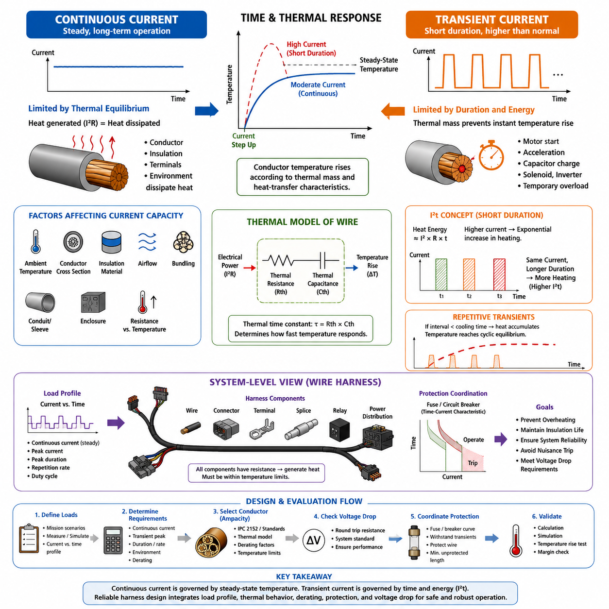
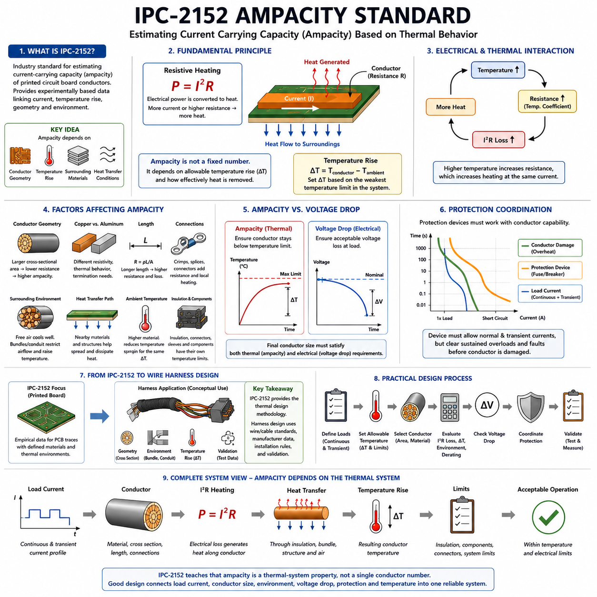
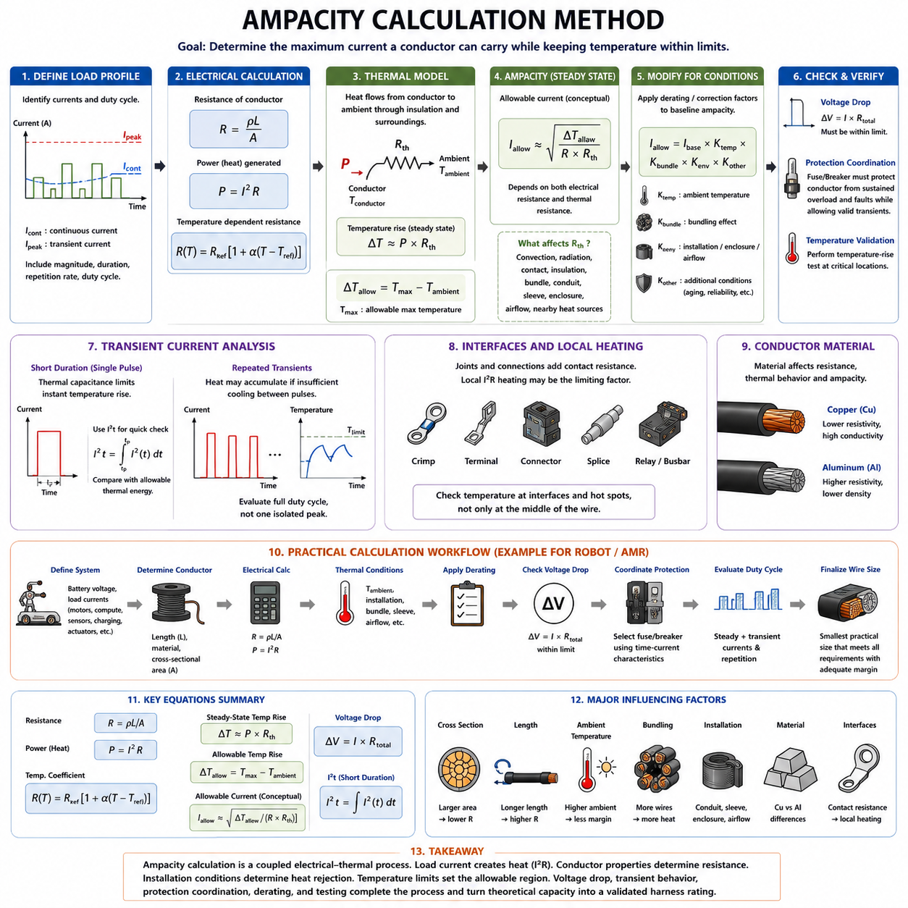
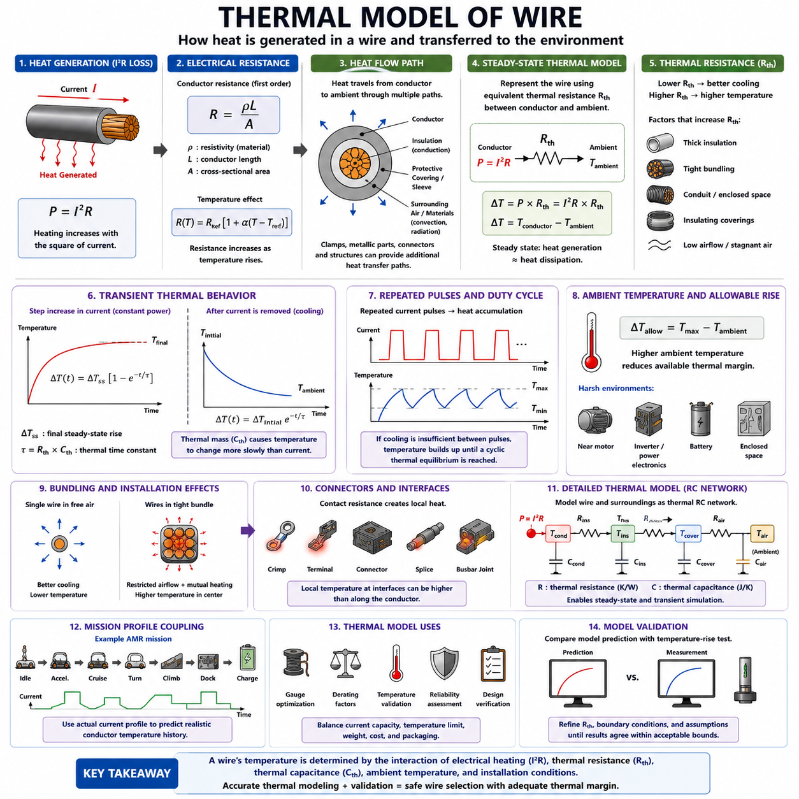
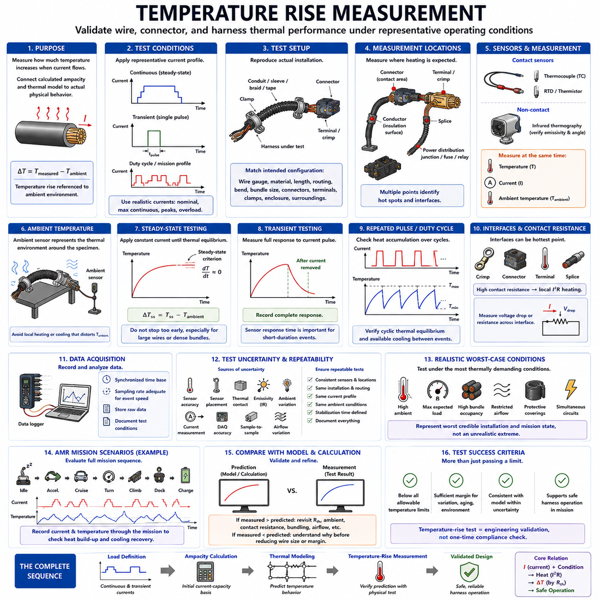

**Volume 02. Wire Harness Engineering**

# Chapter 02. Current Capacity

## 02.01. Continuous vs Transient Current

{width="7.268055555555556in" height="7.268055555555556in"}

연속 전류(Continuous Current)는 시스템이 정상 운전 상태를 유지하는 동안 전선(Wire) 또는 도체(Conductor)가 장시간 지속적으로 전달해야 하는 전류를 의미한다. 와이어 하니스 엔지니어링(Wire Harness Engineering)에서 허용 가능한 연속 전류는 주로 열평형(Thermal Equilibrium)에 의해 제한된다. 전기 저항(Electrical Resistance)은 I²R 손실(I²R Loss)에 따라 열을 발생시키며, 도체, 절연체(Insulation), 단자(Terminal), 주변 환경은 이 열을 지속적으로 방출한다.

전류가 충분한 시간 동안 거의 일정하게 유지되면 도체 온도(Conductor Temperature)는 발생하는 열과 방출되는 열이 균형을 이루는 정상 상태(Steady-State)의 온도에 접근한다. 따라서 허용 연속 전류(Allowable Continuous Current)는 도체와 절연체의 온도가 규정된 온도 한계 이하로 유지되도록 결정해야 한다. 주변 온도(Ambient Temperature), 도체 단면적(Conductor Cross-Sectional Area), 절연 재료(Insulation Material), 공기 흐름(Airflow), 번들링(Bundling), 설치 방식(Installation Method)이 모두 이러한 열평형에 영향을 미친다.

과도 전류(Transient Current)는 제한된 시간 동안 정상적인 연속 운전 수준을 초과하여 흐르는 전류이다. 대표적인 예로 모터 기동 전류(Motor Starting Current), 액추에이터 가속 전류(Actuator Acceleration Current), 커패시터 충전 전류(Capacitor Charging Current), 솔레노이드 여자 전류(Solenoid Energization Current), 인버터 과도 전류(Inverter Transient), 일시적 과부하(Temporary Overload)가 있다. 전선의 열질량(Thermal Mass)으로 인해 도체 온도가 즉시 상승하지 않으므로, 전선은 연속 정격보다 상당히 높은 과도 전류를 견딜 수 있는 경우가 많다.

연속 전류와 과도 전류의 차이는 근본적으로 시간(Time)과 관련되어 있다. 도체는 전기 부하(Electrical Load)의 변화에 대해 열적으로 즉각 반응하지 않는다. 전류가 갑자기 증가하면 저항성 발열(Resistive Heating)은 즉시 증가하지만, 도체 온도는 전선 어셈블리(Wire Assembly)의 열용량(Thermal Capacitance)과 열전달 특성(Heat-Transfer Characteristics)에 따라 상승한다. 따라서 매우 짧은 전류 펄스(Current Pulse)는 피크 전류(Peak Current)가 높더라도 온도를 크게 상승시키지 않을 수 있다.

단순화된 열 해석(Thermal Interpretation)에서는 전선을 열저항(Thermal Resistance)과 열용량(Thermal Capacitance)을 갖는 시스템으로 취급할 수 있다. 열저항은 도체에서 주변 환경으로 열을 전달하기 어려운 정도를 나타내며, 열용량은 도체 온도를 변화시키는 데 필요한 열에너지(Thermal Energy)의 양을 나타낸다. 이 두 특성은 함께 열 시정수(Thermal Time Constant)를 형성하며, 전류가 변화한 이후 전선이 새로운 온도에 얼마나 빠르게 접근하는지를 결정한다.

연속 부하(Continuous Loading)에서는 일반적으로 순간적인 피크 전류보다 장기간의 온도 상승(Long-Term Temperature Rise)이 도체 선정의 주요 기준이 된다. 설계자는 예상되는 정상 전류가 최악의 주변 환경과 설치 조건에서도 안전하게 전달될 수 있는지를 평가해야 한다. 자유 공기(Free Air) 중에 단독으로 설치된 전선은 밀집된 하니스 번들(Harness Bundle), 전선관(Conduit), 보호 슬리브(Protective Sleeve), 밀폐된 공간 내부에 설치된 동일한 전선보다 열을 더욱 효과적으로 방출할 수 있다.

과도 부하(Transient Loading)를 평가할 때는 전류의 크기뿐만 아니라 지속 시간(Duration)도 함께 고려해야 한다. 수 밀리초(Millisecond) 동안 흐르는 매우 높은 전류는 동일한 크기의 전류가 수 초 동안 지속되는 경우와 전혀 다른 열적 영향을 발생시킬 수 있다. 따라서 단순한 피크 전류값만으로는 충분하지 않다. 도체에 축적되는 에너지는 전류 제곱(Current-Squared)의 관계에 크게 영향을 받기 때문에, 높은 전류 펄스는 지속 시간이나 반복률(Repetition Rate)이 증가할수록 더욱 중요한 열적 영향을 발생시킨다.

I²t 개념(I²t Concept)은 단시간 전기적 발열(Short-Duration Electrical Heating)을 이해하는 데 유용한 1차적인 방법을 제공한다. 저항성 전력(Resistive Power)은 전류의 제곱에 비례하기 때문에 저항이 일정한 경우 전류가 두 배로 증가하면 순간적인 저항 발열은 약 네 배로 증가한다. 펄스가 충분히 짧아 펄스 동안의 열 방출이 제한되는 경우, 누적 I²t는 도체와 주변 전도성 요소(Conductive Elements)가 흡수하는 열에너지와 연관하여 평가할 수 있다.

반복적인 과도 전류(Repeated Transient Current)는 개별 전류 펄스가 열적으로 서로 독립적이지 않을 수 있기 때문에 추가적인 검토가 필요하다. 펄스 사이의 간격이 전선의 냉각 시간(Cooling Time)보다 짧으면 다음 전류 이벤트가 시작되기 전에 이전 펄스의 잔류 열(Residual Heat)이 남아 있게 된다. 이에 따라 온도가 점진적으로 상승하여 결국 주기적 열평형(Cyclic Thermal Equilibrium)에 도달할 수 있다. 따라서 단일 펄스로 평가했을 때 안전한 부하도 높은 반복 빈도로 운전되면 허용되지 않을 수 있다.

로봇 시스템(Robotic System)은 일반적으로 이러한 혼합 전류 특성(Mixed Current Behavior)을 나타낸다. 구동 모터(Drive Motor)는 가속 과정에서 높은 전류를 요구할 수 있고, 조향 액추에이터(Steering Actuator)는 빠른 보정 동작에서 짧은 피크 전류를 발생시킬 수 있으며, 매니퓰레이터(Manipulator)는 페이로드(Payload)와 운동 상태에 따라 변화하는 전류를 소비한다. 컴퓨팅 시스템(Computing System) 역시 동적인 전력 요구를 발생시킬 수 있다. 따라서 하니스 설계에서는 연속 전류, 피크 전류, 피크 지속 시간, 반복률, 대표 운전 듀티 사이클(Duty Cycle)을 함께 정의해야 한다.

연속 전류와 과도 전류의 한계는 커넥터(Connector), 단자(Terminal), 스플라이스(Splice), 릴레이(Relay), 퓨즈(Fuse), 전력 분배 장치(Power Distribution Device)와 함께 고려해야 한다. 전선 자체는 짧은 전류 펄스를 견딜 수 있더라도 높은 국부 저항(Localized Resistance)을 갖는 커넥터 접점(Connector Contact)에서는 과도한 온도 상승이 발생할 수 있다. 반대로 반복적인 과도 피크에 지나치게 근접하여 보호 퓨즈를 선정하면 하니스 자체는 열적으로 안전하더라도 퓨즈 내부에 열이 누적되어 불필요한 동작(Nuisance Operation)이 발생할 수 있다.

따라서 전류 용량(Current Capacity)은 특정 전선 굵기(Wire Gauge) 옆에 표시된 하나의 고정된 전류값이 아니라 시스템 수준의 열적 제약(System-Level Thermal Constraint)으로 취급해야 한다. 연속 전류는 장기적인 열 요구조건을 결정하고, 과도 전류는 시간에 따른 에너지와 피크 부하 요구조건을 추가한다. 신뢰성 높은 하니스 엔지니어링에서는 두 관점을 함께 고려하여 정상 운전, 일시적 과부하, 반복 듀티 사이클, 비정상 상태(Abnormal Condition)가 정의된 전기적 및 열적 한계 내에서 유지되도록 해야 한다.

실제적인 전류 프로파일링(Current Profiling)은 단순히 장치의 공칭 정격(Nominal Rating)에 의존하기보다 현실적인 운전 시나리오(Operating Scenario)를 기반으로 수행해야 한다. 측정 또는 시뮬레이션에는 기동, 가속, 제동, 페이로드 변화, 액추에이터 스톨(Actuator Stall), 충전 상태 전환, 컴퓨팅 부하 피크, 여러 부하의 동시 작동이 포함되어야 한다. 이렇게 얻어진 시간에 따른 전류 프로파일(Current-versus-Time Profile)은 하나의 최대 전류 사양보다 도체 크기와 열적 마진(Thermal Margin)을 결정하는 데 더 강력한 근거를 제공한다.

유용한 엔지니어링 접근법은 전기 부하 프로파일(Electrical Load Profile)을 정상 상태(Steady), 주기적 상태(Periodic), 예외적 상태(Exceptional)의 영역으로 구분하는 것이다. 정상 상태 성분은 기본적인 연속 허용 전류(Ampacity) 요구조건을 결정하고, 주기적인 피크는 열 누적(Thermal Accumulation)과 듀티 사이클을 이용하여 평가하며, 예외적인 이벤트는 보호 장치(Protection Device)와 협조되도록 설계한다. 이러한 구분은 과도한 전선 대형화(Oversizing)를 방지하면서도 과열과 절연 열화(Insulation Degradation)에 대한 충분한 마진을 확보할 수 있도록 한다.

주변 환경 조건(Ambient Condition)은 연속 전류와 과도 전류의 허용 능력을 모두 크게 변화시킬 수 있다. 높은 주변 온도는 정상 운전 온도와 도체 또는 절연체의 최대 허용 온도(Maximum Allowable Temperature) 사이의 온도 마진을 감소시킨다. 또한 하니스 번들은 인접한 도체들이 서로 가열하기 때문에 열전달을 제한한다. 따라서 실온의 자유 공기 조건에서 결정된 전류 용량을 적절한 디레이팅(Derating) 없이 밀폐된 로봇 내부 설치 환경에 직접 적용해서는 안 된다.

전선 저항(Wire Resistance)은 도체 온도가 상승함에 따라 증가하며, 특히 일반적으로 사용되는 구리(Copper)와 알루미늄(Aluminum) 도체에서 이러한 특성이 나타난다. 이로 인해 전류가 저항성 열을 발생시키고, 온도 상승이 저항을 증가시키며, 증가된 저항이 동일한 전류에서 추가적인 손실을 발생시키는 결합된 열-전기 효과(Coupled Thermal-Electrical Effect)가 형성된다. 정상적인 설계 조건에서는 안정적인 평형 상태에 도달하지만, 열적 마진이 부족하면 상온 저항만을 사용한 계산보다 훨씬 큰 온도 상승이 발생할 수 있다.

전압 강하(Voltage Drop) 요구조건은 특히 저전압·고전류(Low-Voltage High-Current) 로봇 시스템에서 열적 허용 전류 요구조건보다 더 큰 도체 단면적을 요구할 수 있다. 전선이 과도 모터 전류를 열적 한계를 초과하지 않고 전달할 수 있더라도 순간적인 전압 강하가 컨트롤러(Controller)를 리셋시키거나, 센서(Sensor)를 교란하거나, 액추에이터 토크(Actuator Torque)를 감소시키거나, 저전압 보호(Undervoltage Protection)를 작동시킬 수 있다. 따라서 전류 용량 평가는 전압 강하 해석과 독립적으로 수행하기보다 서로 연계하여 수행해야 한다.

보호 협조(Protection Coordination)는 또 다른 시간 의존적 관계(Time-Dependent Relationship)를 형성한다. 퓨즈와 회로 차단기(Circuit Breaker)는 각각 고유한 전류-시간 특성(Current-Time Characteristic)을 가지며, 일반적으로 짧은 과부하는 허용하면서 지속적인 과전류 또는 심각한 고장 전류(Fault Current)는 차단한다. 도체는 이러한 전체 동작 영역에서 열적으로 보호되어야 한다. 따라서 목표는 단순히 정상 전류보다 높은 정격의 퓨즈를 선정하는 것이 아니라 보호 특성이 도체의 허용 능력과 정상적인 과도 부하 모두에 적합하도록 하는 것이다.

자율이동로봇(AMR, Autonomous Mobile Robot)과 기타 이동형 로봇(Mobile Robot)에서는 임무 프로파일(Mission Profile)에 따라 듀티 사이클이 크게 변화할 수 있다. 평탄한 바닥에서의 연속 주행, 반복적인 정지와 출발, 경사로 등판, 중량 페이로드 운송, 도킹(Docking), 비상 기동은 동일한 하드웨어에서도 서로 다른 열 이력(Thermal History)을 형성할 수 있다. 따라서 전류 용량 검증에서는 평균 임무 전류만으로 하니스의 스트레스를 대표한다고 가정하지 말고, 대표적인 최악 조건 임무(Worst-Case Mission)를 고려해야 한다.

견고한 하니스 사양(Harness Specification)은 최종적으로 하나의 전류값만을 정의해서는 안 된다. 예상 연속 전류, 정상 과도 피크(Normal Transient Peak), 최대 피크 지속 시간, 반복 조건, 비정상 과부하 동작, 주변 온도 범위, 번들링 조건, 적용 가능한 디레이팅 계수(Derating Factor)를 함께 정의해야 한다. 이러한 파라미터는 전기 부하의 동작 특성과 실제 전선 선정 사이에 추적 가능한 연결 관계를 형성하며, 이후 계산, 시뮬레이션, 온도 상승 시험(Temperature-Rise Testing)을 통한 검증을 가능하게 한다.

연속 전류(Continuous Current)와 과도 전류(Transient Current)의 차이를 이해하는 것은 이후의 전류 용량 엔지니어링(Current-Capacity Engineering)을 위한 개념적 기반이 된다. 부하가 전류 크기와 시간의 함수로 표현되면 허용 전류 산정 방법(Ampacity Method), 열 모델(Thermal Model), 디레이팅 규칙(Derating Rule), 온도 측정(Temperature Measurement)을 일관되게 적용할 수 있다. 이러한 시간 기반 관점(Time-Aware Perspective)은 동적인 액추에이터와 지속적으로 전력을 사용하는 컴퓨팅, 센싱(Sensing), 통신(Communication), 안전 시스템(Safety System)이 공존하는 로봇 하니스에서 특히 중요하다.

## 02.02. IPC 2152 Ampacity Standard

{width="7.268055555555556in" height="7.268055555555556in"}

IPC-2152는 인쇄회로기판(Printed Circuit Board)에 사용되는 도전성 트레이스(Conductive Trace)의 전류 전달 용량(Current-Carrying Capacity), 즉 허용 전류(Ampacity)를 산정하기 위해 널리 참조되는 산업 표준(Industry Standard)이다. 와이어 하니스 엔지니어링(Wire Harness Engineering)에서는 이를 직접적인 전선 굵기 선정 규칙으로 사용하기보다 개념적이고 비교적인 기준으로 활용하는 것이 적절하다. 이 표준은 허용 전류가 단순히 도체 단면적만으로 결정되는 것이 아니라 도체 형상(Conductor Geometry), 온도 상승(Temperature Rise), 주변 재료(Surrounding Materials), 열전달 조건(Heat-Transfer Conditions)에 의해 결정된다는 점을 보여준다.

이 표준은 인쇄 도체(Printed Conductor)의 전류와 온도 상승 관계를 보다 실험적인 근거를 바탕으로 제공하기 위해 개발되었다. IPC-2152는 주변의 열적 환경(Thermal Environment)을 충분히 설명하지 못한 채 일반화된 수식으로 전류 용량을 표현하던 기존의 단순화된 관계를 개선한다. IPC-2152는 측정된 열적 거동(Thermal Behavior)을 강조하며, 설계자가 정의된 조건에서 도체의 온도 상승을 추정할 수 있도록 실험적 정보(Empirical Information)를 제공한다.

허용 전류(Ampacity)는 도체가 허용 가능한 온도 한계(Temperature Limit) 내에서 유지되면서 전달할 수 있는 전류의 양을 의미한다. 이 정의가 중요한 이유는 하나의 도체가 보편적으로 적용되는 단일 전류 정격(Current Rating)을 가지는 것이 아니기 때문이다. 허용 가능한 전류는 주변 온도보다 어느 정도의 온도 상승이 허용되는지, 그리고 전기 저항에 의해 발생한 열이 주변 재료와 환경으로 얼마나 효과적으로 전달되고 방출될 수 있는지에 따라 달라진다.

기본적인 물리적 메커니즘(Physical Mechanism)은 저항성 발열(Resistive Heating)이다. 저항 R을 갖는 도체에 전류 I가 흐르면 전력은 대략 P = I²R의 관계에 따라 열로 변환된다. 도체 단면적(Conductor Cross-Sectional Area)을 증가시키면 일반적으로 저항이 감소하고 동일한 전류에서 발생하는 열도 감소한다. 그러나 최종 도체 온도는 발생한 열이 도체 외부로 빠져나가는 열전달 경로(Heat-Transfer Path)에 의해서도 결정되므로 저항만으로 예측할 수 없다.

따라서 IPC-2152는 전기적 용량(Electrical Capacity)과 열적 용량(Thermal Capacity)의 중요한 차이를 강조한다. 전기적 계산은 저항과 I²R 손실(I²R Loss)을 결정하지만, 열적 조건은 그 결과로 발생하는 온도 상승을 결정한다. 유사한 저항을 갖는 두 도체라도 주변 구조가 서로 다른 열전달 경로를 제공하면 서로 다른 운전 온도(Operating Temperature)에 도달할 수 있다. 이러한 원리는 로봇 전기 시스템(Robotic Electrical System)에 설치되는 전선을 분석할 때에도 동일하게 중요하다.

도체 형상(Conductor Geometry)은 허용 전류에 큰 영향을 미친다. 폭이 넓거나 두꺼운 도전 경로(Conductive Path)는 일반적으로 더 낮은 전기 저항과 더 높은 전류 전달 능력을 제공한다. 와이어 하니스에서 이에 대응하는 파라미터는 일반적으로 제곱밀리미터(mm²) 또는 AWG로 표시되는 도체 단면적이다. 도체 면적을 증가시키면 단위 길이당 저항이 감소하고 전압 강하(Voltage Drop)가 줄어들며, 일반적으로 규정된 온도 한계에 도달하기 전에 더 큰 연속 전류(Continuous Current)를 전달할 수 있다.

온도 상승(Temperature Rise)은 일반적으로 도체 온도와 주변 온도의 차이인 ΔT = Tconductor − Tambient로 표현된다. 따라서 전류 용량(Current Capacity)을 결정할 때는 단순히 도체가 특정 암페어(Ampere)를 전달할 수 있다고 표현하기보다 허용 가능한 ΔT를 함께 정의해야 한다. 25°C 환경에서 30°C의 온도 상승을 갖는 도체와 70°C 환경에서 동일한 30°C의 온도 상승을 갖는 도체는 실제 절대 온도(Absolute Temperature)가 크게 다르다.

이러한 차이는 절연 시스템(Insulation System), 커넥터 하우징(Connector Housing), 단자 도금(Terminal Plating), 씰(Seal), 보호 슬리브(Protective Sleeve), 인접 전자 부품(Electronic Component)이 각각 서로 다른 온도 한계를 가질 수 있기 때문에 특히 중요하다. 따라서 허용 가능한 도체 온도는 전체 전기 어셈블리(Electrical Assembly)에서 가장 취약한 관련 열적 제약(Thermal Constraint)을 기준으로 결정해야 한다. 허용 전류는 주변 온도와 최대 운전 온도(Maximum Operating Temperature)가 명확하게 정의되어 있을 때 의미가 있다.

IPC-2152와 관련된 주요 교훈 중 하나는 주변 재료가 중요한 열전달 메커니즘(Heat-Transfer Mechanism)으로 작용할 수 있다는 것이다. 인쇄회로기판에서는 유전체 재료(Dielectric Material)와 인접한 도전 구조가 전류가 흐르는 트레이스에서 발생한 열을 분산시키는 역할을 한다. 이에 대응하는 하니스 원리는 자유 공기(Free Air), 번들 구조(Bundle Construction), 전선관(Conduit), 보호 슬리빙(Protective Sleeving), 클램프(Clamp), 인클로저 표면(Enclosure Surface), 인접 전선과 같은 설치 조건이 열적 성능을 크게 변화시킬 수 있다는 것이다.

자유 공기 중에서 동작하는 도체는 외부 표면의 상당 부분을 통해 대류(Convection)와 복사(Radiation) 방식으로 열을 전달할 수 있다. 동일한 도체를 조밀한 번들(Bundle) 내부에 배치하면 인접 전선이 공기 흐름을 제한하고 동시에 자체적으로 열을 발생시킬 수 있다. 따라서 번들 내부의 전선은 동일한 전류를 전달하는 독립된 전선보다 높은 온도에서 동작할 수 있다. 이러한 이유로 실제 하니스의 허용 전류 계산에는 번들링(Bundling)과 환경 디레이팅(Environmental Derating)을 적용해야 한다.

도체 길이(Conductor Length) 역시 전체 저항이 길이에 따라 증가하기 때문에 전기적 손실에 영향을 미친다. 균일한 도체의 저항은 대략 R = ρL/A로 표현할 수 있으며, 여기서 ρ는 재료의 비저항(Material Resistivity), L은 도체 길이, A는 단면적이다. 이에 따른 I²R 손실은 도체 전체 길이에 걸쳐 분포하지만, 커넥터(Connector), 크림프(Crimp), 스플라이스(Splice), 단자(Terminal)는 추가적인 국부 저항(Localized Resistance)과 집중 발열(Concentrated Heating)을 발생시킬 수 있으므로 별도로 평가해야 한다.

도체 재료(Conductor Material)도 중요한 파라미터이다. 구리(Copper)는 높은 전기 전도도(Electrical Conductivity), 기계적 특성(Mechanical Properties), 확립된 단말 처리 기술(Termination Technology) 때문에 일반적으로 사용된다. 알루미늄(Aluminum)은 질량을 줄일 수 있지만 비저항, 열적 거동, 산화막 특성(Oxide Characteristics), 단말 처리 요구조건이 서로 다르다. 따라서 서로 다른 도체 재료가 동일한 단면적을 갖는다고 해서 동일한 허용 전류 또는 동일한 시스템 성능을 제공한다고 가정해서는 안 된다.

저항의 온도 계수(Temperature Coefficient of Resistance)는 전기적 거동과 열적 거동 사이에 추가적인 결합 관계를 형성한다. 일반적인 금속 도체는 온도가 상승함에 따라 저항도 증가한다. 증가한 저항은 동일한 전류에서 더 큰 I²R 손실을 발생시키고, 이는 다시 온도를 더욱 상승시킬 수 있다. 따라서 허용 전류 평가에서는 상온 근처에서 측정된 공칭 저항(Nominal Resistance)에만 의존하지 말고 실제 운전 온도에서의 도체 저항을 고려해야 한다.

로봇 하니스 설계(Robotic Harness Design)에서 IPC-2152를 전선 전용 표준(Wire-Specific Standard), 제조업체의 허용 전류 데이터(Manufacturer Ampacity Data), 자동차용 도체 요구조건(Automotive Conductor Requirement), 실험적으로 검증된 하니스 설계 규칙을 대체하는 기준으로 해석해서는 안 된다. IPC-2152는 기본적으로 인쇄회로기판 도체를 대상으로 한다. 하니스 엔지니어링에서 가장 중요한 기여는 전류 용량을 도체 형상, 허용 온도 상승, 열적 환경, 실험적 검증(Empirical Validation)과 연결해야 한다는 열 설계 방법론(Thermal Design Methodology)을 제시한다는 점이다.

이러한 구분은 특정 도체 구성에서 얻어진 전류값을 다른 도체 구성에 그대로 적용하는 일반적인 엔지니어링 오류를 방지한다. PCB 구리 트레이스(PCB Copper Trace), 절연 연선(Insulated Stranded Wire), 버스바(Busbar), 플렉시블 회로(Flexible Circuit), 커넥터 접점(Connector Contact), 케이블 어셈블리(Cable Assembly)는 기본적인 형상과 열전달 경계조건(Heat-Transfer Boundary)이 서로 다르다. 따라서 전류 정격은 해당 정격과 관련된 물리적 구성과 시험 조건을 이해할 때만 의미를 갖는다.

자율이동로봇(AMR, Autonomous Mobile Robot) 또는 이동형 로봇(Mobile Robot)에서는 전기 아키텍처(Electrical Architecture)의 위치에 따라 열적 환경이 크게 달라질 수 있다. 배터리 케이블(Battery Cable), 모터 상 도체(Motor-Phase Conductor), 직류 전력 분배 배선(DC Power-Distribution Wiring), 컴퓨팅 전원선(Compute Power Line), 센서 분기선(Sensor Branch), 충전 회로(Charging Circuit)는 서로 다른 전류 프로파일(Current Profile)과 설치 조건을 가질 수 있다. 모터, 인버터(Inverter), 배터리 또는 밀폐된 전력 분배 장치(Power-Distribution Unit) 근처의 하니스는 외부에 배치된 하니스보다 높은 국부 주변 온도(Local Ambient Temperature)를 경험할 수도 있다.

실제적인 설계 과정(Design Process)은 연속 및 과도 부하 전류(Transient Load Current)를 결정하고 허용 가능한 도체 온도를 정의하는 것에서 시작한다. 설계자는 예비 도체 단면적을 선정한 후 저항, I²R 발열, 설치 환경, 주변 온도, 번들링, 적용 가능한 디레이팅 계수(Derating Factor)를 평가한다. 이후 전압 강하와 보호 협조(Protection Coordination)를 검토해야 한다. 도체는 열적 허용 전류뿐만 아니라 전기적 성능과 고장 보호(Fault Protection) 요구조건도 만족해야 하기 때문이다.

허용 전류와 전압 강하의 관계는 특히 12 V, 24 V, 48 V 로봇 전력 시스템(Robotic Power System)에서 중요하다. 도체가 열적 한계(Thermal Limit) 이하에서 동작하더라도 고전류 운전 중 허용할 수 없는 전압 손실(Voltage Loss)을 발생시킬 수 있다. 반대로 엄격한 전압 강하 요구조건을 만족하기 위해 선정된 도체는 상당한 열적 전류 마진(Thermal Current Margin)을 가질 수 있다. 따라서 최종 전선 선정에서는 허용 전류만을 유일한 선정 기준으로 사용하지 말고 두 가지 제약조건을 모두 만족시켜야 한다.

보호 장치(Protection Device) 역시 도체의 허용 능력과 협조되어야 한다. 퓨즈(Fuse) 또는 회로 차단기(Circuit Breaker)는 정상적인 운전 전류와 예상되는 단시간 과도 전류를 허용하면서 지속적인 과부하와 고장 전류로부터 하류 도체(Downstream Conductor)를 보호해야 한다. 따라서 관련 비교는 시간 의존적(Time-Dependent)이다. 부하 전류 프로파일, 도체의 열적 응답(Thermal Response), 보호 장치의 전류-시간 특성(Time-Current Characteristic)이 정상 및 비정상 운전 조건 전체에서 서로 적합해야 한다.

계산 또는 표로 제공되는 허용 전류는 모든 실제 생산 설치 조건을 완벽하게 표현할 수 없기 때문에 엔지니어링 마진(Engineering Margin)이 필요하다. 제조 공차(Manufacturing Tolerance), 도체 저항 편차, 크림프 저항(Crimp Resistance), 번들 밀도(Bundle Density), 공기 흐름 변화, 오염(Contamination), 노화(Aging), 인클로저 온도, 임무 듀티 사이클(Mission Duty Cycle)은 실제 온도를 변화시킬 수 있다. 보수적인 디레이팅과 대표적인 온도 상승 시험(Temperature-Rise Testing)은 이론적 계산에만 의존하지 않고 이러한 불확실성에 대응할 수 있도록 한다.

온도 상승 검증(Temperature-Rise Validation)은 가능한 한 실제 설치 조건을 현실적으로 재현해야 한다. 하니스는 대표적인 도체 길이, 번들, 슬리브, 커넥터, 단자, 주변 온도, 부하 프로파일을 사용하여 시험해야 한다. 도체 영역과 전기적 인터페이스(Electrical Interface)의 온도를 측정하면 단순한 전선 굵기 계산만으로는 확인하기 어려운 열적 핫스폿(Thermal Hot Spot)을 식별할 수 있으며, 특히 크림프, 스플라이스, 커넥터, 전력 분배 접속부(Power-Distribution Junction)에서 이러한 검증이 중요하다.

IPC-2152가 제공하는 보다 넓은 엔지니어링 교훈은 허용 전류가 독립된 하나의 도체 수치가 아니라 열 시스템 특성(Thermal-System Property)이라는 것이다. 전류는 열을 발생시키고, 도체 형상은 전기적 손실을 결정하며, 주변 구조는 열전달을 결정하고, 온도 한계는 허용 가능한 운전 범위를 정의한다. 이러한 프레임워크(Framework)는 이후의 허용 전류 계산(Ampacity Calculation), 전선 열 모델링(Wire Thermal Modeling), 온도 상승 측정, 전선 굵기 선정(Wire Gauge Selection), 환경 디레이팅(Environmental Derating)과 자연스럽게 연결된다.

따라서 신뢰성 높은 로봇 전기 아키텍처(Robotic Electrical Architecture)에서 IPC-2152는 전류 용량 방법론(Current-Capacity Methodology)을 이해하기 위한 참조 기준으로 활용하는 것이 가장 적절하며, 실제 전선 설계는 관련 케이블 표준(Cable Standard), 부품 사양(Component Specification), 설치 규칙(Installation Rule), 검증 데이터(Validation Data)를 기반으로 수행해야 한다. 이러한 체계적인 접근법은 지나치게 단순화된 전류 정격 가정을 방지하고 부하 전류, 도체 크기, 열적 환경, 전압 강하, 보호, 운전 온도 사이에 추적 가능한 관계(Traceable Relationship)를 구축할 수 있도록 한다.

## 02.03. Ampacity Calculation Method

{width="7.268055555555556in" height="7.268055555555556in"}

허용 전류 계산(Ampacity Calculation)은 도체(Conductor)의 온도를 정의된 운전 한계(Operating Limit) 이내로 유지하면서 전달할 수 있는 최대 전류를 결정하는 과정이다. 와이어 하니스 엔지니어링(Wire Harness Engineering)에서는 이 값을 도체 단면적(Conductor Cross-Sectional Area)만으로 결정할 수 없다. 계산에서는 전기 저항(Electrical Resistance), 전류에 의해 발생하는 열(Current-Generated Heat), 주변 온도(Ambient Temperature), 절연 한계(Insulation Limit), 설치 조건(Installation Condition), 그리고 주변 환경이 도체에서 발생한 열을 제거할 수 있는 능력을 서로 연계해야 한다.

계산은 전기 부하 프로파일(Electrical Load Profile)을 정의하는 것에서 시작한다. 연속 전류(Continuous Current)는 주요 정상 상태 열 요구조건(Steady-State Thermal Requirement)을 결정하고, 과도 전류(Transient Current)는 추가적인 시간 의존적 발열(Time-Dependent Heating)을 발생시킨다. 모터 기동(Motor Startup), 가속(Acceleration), 액추에이터 동작(Actuator Operation), 충전(Charging), 일시적인 과부하(Temporary Overload)는 정상 전류보다 훨씬 높은 전류를 발생시킬 수 있다. 따라서 도체의 허용 전류를 평가하기 전에 전류의 크기, 지속 시간(Duration), 반복률(Repetition Rate), 듀티 사이클(Duty Cycle)을 정의해야 한다.

전기 저항(Electrical Resistance)은 부하 전류와 열 발생 사이의 연결 관계를 제공한다. 균일한 도체의 경우 저항은 R = ρL/A로 근사할 수 있으며, 여기서 ρ는 도체의 비저항(Resistivity), L은 도체 길이(Conductor Length), A는 도체 단면적이다. 전기 에너지가 열로 변환되는 전력은 P = I²R로 표현된다. 도체 단면적을 증가시키면 저항이 감소하고 일반적으로 동일한 전류에서 발생하는 열도 감소한다.

저항은 단순히 공칭 상온 조건(Nominal Room-Temperature Condition)에서만 평가하지 말고 예상 운전 온도(Expected Operating Temperature)에서 평가해야 한다. 금속 도체(Metallic Conductor)의 저항은 일반적으로 온도가 상승하면 증가한다. 단순화된 관계는 R(T) = Rref[1 + α(T − Tref)]로 표현할 수 있으며, 여기서 α는 저항 온도 계수(Temperature Coefficient of Resistance)이다. 온도 상승이 저항을 증가시키고 일정한 전류에서 I²R 손실을 다시 증가시키므로 열-전기 결합(Thermal-Electrical Coupling)이 발생한다.

발생한 열은 도체에서 절연체(Insulation)와 주변 구조물을 거쳐 주변 환경으로 전달되어야 한다. 단순화된 정상 상태 열 모델(Steady-State Thermal Model)에서는 온도 상승을 ΔT ≈ P × Rth로 표현할 수 있으며, 여기서 Rth는 도체와 주변 환경 사이의 유효 열저항(Effective Thermal Resistance)이다. 이 관계를 P = I²R과 결합하면 허용 전류가 전기 저항과 열저항 모두에 의존하는 이유를 직접적으로 확인할 수 있다.

단순화된 정상 상태 모델을 사용하면 전류는 개념적으로 I ≈ √[ΔT/(R × Rth)]로 추정할 수 있다. 이 관계는 보편적인 허용 전류 방정식(Universal Ampacity Equation)이 아니라 엔지니어링 모델(Engineering Model)로 이해해야 한다. 실제 하니스 설치 환경에는 분포된 열전달(Distributed Heat Transfer), 온도 의존적 물성(Temperature-Dependent Properties), 대류(Convection), 복사(Radiation), 접촉 인터페이스(Contact Interface), 번들(Bundle), 슬리브(Sleeve), 인클로저(Enclosure), 인접 열원(Heat Source)이 존재하므로 하나의 열저항 값만으로 정확하게 표현하기 어려울 수 있다.

허용 전류를 계산하기 전에 허용 온도 상승(Allowable Temperature Rise)을 정의해야 한다. 이는 ΔTallow = Tmax − Tambient로 표현할 수 있으며, 여기서 Tmax는 선정된 최대 허용 운전 온도(Maximum Permissible Operating Temperature), Tambient는 적용되는 주변 온도이다. Tmax를 자동으로 도체 재료의 온도 한계와 동일하게 설정해서는 안 된다. 절연체, 커넥터(Connector), 단자(Terminal), 씰(Seal), 슬리브, 인접 부품, 신뢰성 요구조건(Reliability Requirement)이 더 낮은 온도 한계를 설정할 수 있기 때문이다.

주변 온도는 사용 가능한 열적 마진(Thermal Margin)의 일부를 직접적으로 감소시키기 때문에 특히 중요하다. 25°C의 주변 환경에서 동작하는 하니스는 모터(Motor), 인버터(Inverter), 배터리(Battery), 밀폐된 전력 분배 장치(Power Distribution Unit) 근처의 70°C 환경에서 동작하는 동일한 하니스보다 훨씬 큰 온도 상승 여유를 갖는다. 따라서 전류 용량은 편리한 실험실 상온이 아니라 실제로 예상 가능한 최악의 국부 주변 온도(Worst Credible Local Ambient Temperature)를 기준으로 계산해야 한다.

설치 구성(Installation Configuration)은 열 방출(Heat Dissipation)을 변화시키므로 열 모델링(Thermal Modeling), 보정 계수(Correction Factor), 또는 실험적 디레이팅(Empirical Derating)을 통해 반영해야 한다. 자유 공기(Free Air) 중의 단일 전선은 일반적으로 밀집된 번들 내부의 전선보다 열을 효과적으로 방출한다. 전선관(Conduit), 주름관(Corrugated Tubing), 브레이드(Braid), 테이프(Tape), 보호 슬리브(Protective Sleeve), 밀폐형 인클로저(Sealed Enclosure), 제한된 공기 흐름(Restricted Airflow)은 열전달을 더욱 감소시켜 실제 허용 전류를 낮출 수 있다.

번들 효과(Bundle Effect)는 인접한 도체가 서로 열을 전달하면서 동시에 공기 흐름을 제한하기 때문에 중요해진다. 대형 번들의 중앙부는 외부 표면과 상당히 다른 열적 환경을 경험할 수 있다. 따라서 각각의 도체를 독립적으로 설치된 전선처럼 계산하면 하니스의 전류 용량을 과대평가할 수 있다. 번들의 크기, 동시에 부하가 인가되는 전선의 수, 전선 간격(Spacing), 라우팅(Routing), 주변 재료를 설계 조건에 포함해야 한다.

실제 엔지니어링 방법에서는 적용 가능한 전선 표준(Wire Standard), 제조업체 데이터(Manufacturer Data), 검증된 시험 데이터(Validated Test Data), 또는 인정된 계산 모델에서 기준 허용 전류(Baseline Ampacity)를 먼저 결정하는 경우가 많다. 이후 주변 온도, 번들링, 인클로저, 설치 방식 및 기타 조건을 고려하기 위한 환경 보정 계수(Environmental Correction Factor)를 적용한다. 개념적으로 허용 설계 전류는 Iallow = Ibase × Ktemp × Kbundle × Kenvironment × Kother로 표현할 수 있다.

디레이팅 계수(Derating Factor)를 임의의 안전 계수(Safety Multiplier)로 취급해서는 안 된다. 각각의 계수는 기준 조건과 비교하여 실제 사용 가능한 전류 용량을 감소시키는 물리적 또는 신뢰성 관련 조건을 나타낸다. 온도 디레이팅(Temperature Derating)은 감소한 열적 마진을 반영하고, 번들 디레이팅(Bundle Derating)은 상호 발열(Mutual Heating)을 반영하며, 설치 디레이팅(Installation Derating)은 제한된 열 방출을 반영한다. 각 계수의 기준 조건을 이해하지 않고 적용하면 위험한 설계 또는 불필요한 도체 대형화(Conductor Oversizing)가 발생할 수 있다.

도체 재료(Conductor Material) 역시 계산에 포함해야 한다. 구리(Copper)와 알루미늄(Aluminum)은 서로 다른 비저항, 밀도(Density), 온도 계수(Temperature Coefficient), 열전도도(Thermal Conductivity), 단말 처리 특성(Termination Behavior)을 갖는다. 동일한 기하학적 단면적을 가진 도체라도 재료가 달라지면 동일한 전기 저항이나 허용 전류를 제공한다고 볼 수 없다. 따라서 재료 선정(Material Selection)은 초기 전기 손실 계산과 이후의 열적 응답(Thermal Response)에 모두 영향을 미친다.

허용 전류 계산에는 전기적 인터페이스(Electrical Interface)도 포함해야 한다. 하니스에서 가장 높은 온도가 항상 전선의 중앙부에서 발생하는 것은 아니다. 크림프(Crimp), 단자, 커넥터, 스플라이스(Splice), 버스바 접합부(Busbar Joint), 릴레이(Relay), 전력 분배 접속부(Power-Distribution Connection)는 접촉 저항(Contact Resistance)을 발생시킨다. 비교적 작은 추가 저항이라도 높은 전류에서는 집중적인 I²R 발열을 발생시킬 수 있으므로 도체 자체가 열적 한계에 도달하기 전에 국부 인터페이스 온도(Local Interface Temperature)가 제한 조건이 될 수 있다.

과도 전류(Transient Current)는 정상 상태 허용 전류 모델만이 아니라 시간 의존적 계산(Time-Dependent Calculation)이 필요하다. 충분히 짧은 이벤트에서는 도체가 발생한 열에너지의 일부를 저장하기 때문에 열용량(Thermal Capacitance)이 즉각적인 온도 상승을 제한한다. I²t는 단시간 발열(Short-Duration Heating)을 평가하는 유용한 1차 지표이며, 보다 상세한 분석에서는 도체의 열질량(Thermal Mass), 비열(Heat Capacity), 열저항, 펄스 지속 시간(Pulse Duration), 초기 온도(Initial Temperature)를 이용하여 과도 응답(Transient Response)을 예측한다.

반복적인 과도 전류(Repeated Transient Current)는 열 누적(Thermal Accumulation)을 고려해야 한다. 전류 펄스 사이에서 도체가 초기 온도에 가까운 수준까지 냉각되지 못하면 다음 펄스는 이미 상승한 온도에서 시작한다. 따라서 하나의 독립적인 피크만 평가하지 말고 전체 듀티 사이클을 평가해야 한다. 구동 모터(Drive Motor)와 로봇 액추에이터(Robotic Actuator)는 가속, 제동(Braking), 조향(Steering), 반복 동작으로 인해 주기적인 온도 거동(Cyclic Temperature Behavior)이 발생할 수 있는 대표적인 사례이다.

도체가 열적 허용 전류 요구조건(Thermal Ampacity Requirement)을 만족한 이후에는 전압 강하(Voltage Drop)를 독립적으로 검토해야 한다. 하나의 정의된 전류 경로에서 대략적인 전압 강하는 ΔV = I × R로 표현할 수 있으며, 필요한 경우 전체 전원 및 귀환 경로(Supply-and-Return Path)의 저항을 포함해야 한다. 저전압 시스템(Low-Voltage System)은 이러한 제약에 특히 민감하다. 열적으로 적합한 도체라도 모터 가속이나 기타 고전류 운전 중 과도한 전압 저하를 발생시킬 수 있다.

보호 협조(Protection Coordination)는 또 다른 필수 검토 항목이다. 퓨즈(Fuse) 또는 회로 차단기(Circuit Breaker)의 특성은 정상적인 운전 과도 전류를 허용하면서 선택된 도체를 지속적인 과부하와 고장 조건(Fault Condition)으로부터 보호해야 한다. 따라서 도체의 열적 내량(Thermal Withstand), 부하 전류 프로파일, 보호 장치의 전류-시간 특성(Time-Current Characteristic)을 시간 영역 전체에서 비교해야 한다. 공칭 연속 전류만을 기준으로 퓨즈를 선정하면 불필요한 동작(Nuisance Operation) 또는 불충분한 전선 보호가 발생할 수 있다.

계산에는 불확실성이 존재하기 때문에 일반적으로 엔지니어링 마진(Engineering Margin)을 추가한다. 실제 도체 저항, 주변 온도, 번들 배열(Bundle Arrangement), 공기 흐름, 크림프 품질(Crimp Quality), 접점 노화(Contact Aging), 제조 공차(Manufacturing Tolerance), 오염(Contamination), 임무 프로파일(Mission Profile), 동시 부하 운전(Simultaneous Load Operation)은 공칭 조건과 달라질 수 있다. 이러한 마진은 기본 모델의 불확실성을 숨기는 임의의 백분율이 아니라 정의된 설계 요구조건과 추적 가능하게 연결되어야 한다.

자율이동로봇(AMR, Autonomous Mobile Robot)의 경우 대표적인 계산은 배터리 전압과 각 주요 부하의 전류 프로파일을 정의하는 것에서 시작할 수 있다. 여기에는 주행 모터(Traction Motor), 조향 장치, 컴퓨팅 시스템(Computing System), 센서(Sensor), 통신 장비(Communication Equipment), 액추에이터, 충전 인터페이스(Charging Interface)가 포함된다. 설계자는 도체 길이와 재료를 결정하고 운전 저항과 열적 조건을 추정한 후 적절한 디레이팅을 적용하며, 전압 강하와 회로 보호를 검토하고 최종적으로 전체 임무 듀티 사이클을 평가한다.

계산만으로 최종 검증(Final Validation)이 완료되었다고 판단해서는 안 된다. 고전류 또는 열적으로 중요한 하니스 구간에는 대표적인 온도 상승 시험(Temperature-Rise Testing)이 필요하다. 시험에서는 실제와 유사한 도체 길이, 커넥터, 크림프, 번들 구성(Bundle Configuration), 보호 피복(Protective Covering), 주변 온도, 공기 흐름, 부하 프로파일을 재현해야 한다. 예상되는 핫스폿(Hot Spot)의 온도를 측정하면 단순화된 해석 모델이 정확하게 예측하기 어려운 국부 열적 거동(Local Thermal Behavior)을 확인할 수 있다.

따라서 최종 도체 크기(Final Conductor Size)는 하나의 방정식으로 결정되는 것이 아니라 반복적인 설계 과정(Iterative Design Process)을 통해 선정된다. 단면적을 증가시키면 저항과 전압 강하가 감소하고 일반적으로 열적 마진이 증가하지만, 동시에 질량(Mass), 비용(Cost), 강성(Stiffness), 커넥터 크기, 라우팅 공간(Routing Space), 최소 굽힘 반경(Minimum Bend Radius)이 증가한다. 최적 전선 굵기(Optimum Wire Gauge)는 충분한 마진을 확보하면서 열적, 전기적, 보호, 기계적, 환경적, 신뢰성 요구조건을 모두 만족하는 가장 작은 실용적인 도체이다.

결과적으로 허용 전류 계산(Ampacity Calculation)은 결합된 전기-열 설계 과정(Coupled Electrical-Thermal Design Process)으로 이해하는 것이 가장 적절하다. 부하 전류는 열 발생을 결정하고, 도체 특성은 저항을 결정하며, 설치 조건은 열 방출을 결정하고, 부품의 온도 한계는 허용 가능한 운전 영역을 설정한다. 이후 전압 강하 분석(Voltage-Drop Analysis), 과도 응답, 보호 협조, 디레이팅, 실제 시험(Physical Testing)을 함께 적용함으로써 이론적인 전류 전달 능력을 검증된 하니스 정격(Validated Harness Rating)으로 완성할 수 있다.

## 02.04. Thermal Model of Wire

{width="7.268055555555556in" height="7.268055555555556in"}

전선 열 모델(Wire Thermal Model)은 전기 에너지(Electrical Energy)가 열로 변환되어 도체 온도(Conductor Temperature)를 어떻게 변화시키는지, 그리고 발생한 열이 주변 환경으로 어떻게 전달되는지를 설명한다. 전류 용량 엔지니어링(Current-Capacity Engineering)에서 열 모델은 도체 전류와 허용 온도(Allowable Temperature)를 연결하는 물리적 기반을 제공한다. 또한 허용 전류(Ampacity)가 단순히 전선 굵기(Wire Gauge)뿐만 아니라 저항, 절연체, 주변 온도, 설치 형상, 공기 흐름, 번들링(Bundling), 운전 시간에 따라 달라지는 이유를 설명한다.

전류가 흐르는 전선에서 발생하는 주요 열원(Heat Source)은 저항 손실(Resistive Loss)이다. 전류 I가 전기 저항 R을 갖는 도체를 통해 흐르면 발생 전력은 P = I²R로 근사할 수 있다. 발열량은 전류의 제곱에 따라 증가하므로 비교적 작은 전류 증가도 훨씬 큰 열 부하(Thermal Load)를 발생시킬 수 있다. 이러한 비선형 관계(Nonlinear Relationship)는 전류 용량을 결정할 때 세밀한 열적 평가가 필요한 근본적인 이유 중 하나이다.

도체 저항(Conductor Resistance)은 재료 특성(Material Properties)과 형상(Geometry)에 의해 결정된다. 균일한 도체에서는 R = ρL/A가 유용한 1차 관계를 제공하며, 여기서 ρ는 전기 비저항(Electrical Resistivity), L은 도체 길이(Conductor Length), A는 단면적(Cross-Sectional Area)이다. 도체 단면적을 증가시키면 저항이 감소하여 동일한 전류에서 I²R 발열이 감소하며, 반대로 도체 길이가 증가하면 전체 저항과 열로 변환되는 전기 에너지가 증가한다.

저항 자체도 온도에 따라 변화하기 때문에 전기 영역(Electrical Domain)과 열 영역(Thermal Domain) 사이에 결합 관계가 형성된다. 단순화된 식은 R(T) = Rref[1 + α(T − Tref)]로 표현할 수 있으며, 여기서 α는 저항 온도 계수(Temperature Coefficient of Resistance)를 의미한다. 도체 온도가 상승하면 일반적으로 저항이 증가하고, 일정한 전류에서 더 큰 전력 손실이 발생한다. 따라서 정확한 열 해석에서는 예측된 운전 온도에 따라 저항을 갱신하는 것이 유용하다.

도체 내부에서 발생한 열은 주변 환경에 도달하기 전에 여러 열전달 경로(Thermal Path)를 통과해야 한다. 열은 절연체(Insulation)를 통해 반경 방향으로 전도되고, 인접 재료 또는 보호 피복(Protective Covering)으로 전달된 후 최종적으로 대류(Convection)와 복사(Radiation)를 통해 방출된다. 클램프(Clamp), 금속 구조물, 커넥터(Connector), 단자(Terminal), 인클로저 표면(Enclosure Surface)은 열 방출을 향상시키거나 국부적으로 변화시키는 추가적인 전도 경로(Conductive Path)를 제공할 수 있다.

단순한 정상 상태 열 모델(Steady-State Thermal Model)에서는 도체와 주변 환경 사이를 등가 열저항(Equivalent Thermal Resistance) Rth로 표현할 수 있다. 이때 온도 상승은 ΔT = P × Rth로 근사할 수 있다. 여기에 전기적 발열 관계를 대입하면 ΔT ≈ I²R × Rth가 된다. 이 식은 전류, 전기 저항(Electrical Resistance), 열저항(Thermal Resistance), 도체 온도가 서로 직접적으로 연결되어 있음을 보여준다.

열저항(Thermal Resistance)은 전기 저항과 유사한 개념이지만 전류가 아니라 열 흐름(Heat Flow)에 대한 저항을 나타낸다. 낮은 열저항은 열이 효율적으로 빠져나갈 수 있음을 의미하므로 동일한 전력 손실에서 더 작은 온도 상승이 발생한다. 높은 열저항은 열전달이 제한됨을 의미한다. 두꺼운 절연체, 밀폐된 전선관(Conduit), 조밀한 번들, 정체된 공기(Stagnant Air), 단열 특성을 갖는 피복은 하니스 설치 환경의 유효 열저항(Effective Thermal Resistance)을 증가시킬 수 있다.

정상 상태 해석(Steady-State Analysis)은 도체 온도가 더 이상 크게 변화하지 않을 정도로 충분한 시간이 경과했다고 가정한다. 이 상태에서는 발생하는 열과 방출되는 열이 대략 균형을 이룬다. 주변 온도가 Tambient이고 정상 상태 도체 온도가 Tconductor이면 온도 상승은 ΔT = Tconductor − Tambient로 표현된다. 연속 허용 전류(Continuous Ampacity)는 근본적으로 이러한 열평형(Thermal Equilibrium)을 허용 온도 한계 이하로 유지하는 것과 관련된다.

실제 로봇 부하(Robotic Load)는 완벽하게 일정한 경우가 거의 없으므로 열 모델은 과도 거동(Transient Behavior)도 설명해야 한다. 전선은 열질량(Thermal Mass)을 가지므로 온도를 변화시키려면 일정한 에너지가 필요하다. 이러한 특성은 열용량(Thermal Capacitance) Cth로 표현할 수 있다. 전류가 갑자기 증가하면 전기적 발열은 즉시 변화하지만 에너지가 도체와 주변 재료에 축적되어야 하므로 도체 온도는 상대적으로 천천히 변화한다.

열저항 Rth와 열용량 Cth를 결합하면 일반적으로 τ = Rth × Cth로 표현되는 1차 열 시정수(Thermal Time Constant)를 얻을 수 있다. 열 시정수는 발열량이 변화한 이후 도체가 얼마나 빠르게 반응하는지를 나타낸다. 작은 시정수는 비교적 빠른 온도 응답을 의미하며, 큰 열질량 또는 강하게 열적으로 결합된 구조(Thermally Coupled Structure)는 온도가 보다 점진적으로 변화하도록 한다.

단순화된 일정 발열 전력의 계단 입력(Step Input)에 대해 도체 온도는 새로운 정상 상태 값에 대략 지수적으로 접근한다. 개념적으로 온도 상승은 ΔT(t) = ΔTss[1 − exp(−t/τ)]로 표현할 수 있으며, 여기서 ΔTss는 최종 정상 상태 온도 상승(Final Steady-State Temperature Rise)이다. 이러한 특성은 도체가 연속 전류보다 상당히 높은 단시간 전류 피크(Current Peak)를 견디면서도 해당 정상 상태 온도에 즉시 도달하지 않는 이유를 설명한다.

전류 펄스(Current Pulse)가 종료되면 도체에 저장되어 있던 열에너지가 외부로 방출되기 시작하고 온도는 주변 조건을 향해 감소한다. 단순한 집중 열 모델(Lumped Thermal Model)에서는 냉각 과정 역시 지수 응답(Exponential Response)으로 근사할 수 있다. 실제 냉각 속도는 도체 질량, 절연체, 주변 재료, 공기 흐름(Airflow), 장착 방식(Mounting), 번들 구조, 하니스와 주변 환경 사이의 온도 차이에 의해 결정된다.

반복적인 전류 펄스(Repeated Current Pulse)는 더욱 복잡한 열 이력(Thermal History)을 형성한다. 각 펄스 사이에서 도체가 충분히 냉각되기 전에 다음 펄스가 발생하면 잔류 열(Residual Heat)이 누적되고 펄스 사이의 최저 온도도 점차 상승한다. 결국 시스템은 주기적 열평형(Cyclic Thermal Equilibrium)에 도달할 수 있다. 구동 모터(Drive Motor), 조향 액추에이터(Steering Actuator), 매니퓰레이터(Manipulator), 펌프(Pump)와 같은 반복 동작 로봇 부하에서는 이러한 주기적 거동이 단일 과도 상태 또는 단순한 연속 전류 가정보다 더 중요할 수 있다.

열 모델에서는 주변 온도(Ambient Temperature) 역시 고려해야 한다. 허용 가능한 온도 상승은 최대 허용 온도(Maximum Permissible Temperature)와 국부 주변 온도의 차이에 의해 결정되기 때문이다. 개념적으로 ΔTallow = Tmax − Tambient로 표현할 수 있다. 주변 온도가 높아지면 전류가 동일하더라도 사용 가능한 열적 마진(Thermal Margin)이 감소한다. 따라서 모터, 배터리, 인버터(Inverter), 브레이크(Brake), 전력 전자 장치(Power Electronics), 밀폐형 인클로저 근처에 배치되는 하니스는 특별한 주의가 필요하다.

절연체(Insulation)는 열 모델에 두 가지 방식으로 영향을 미친다. 절연체의 최대 온도 정격(Maximum Temperature Rating)은 허용 도체 온도 한계를 결정하는 요소이며, 동시에 절연체의 열적 특성은 도체에서 외부로 전달되는 열 흐름에 영향을 미친다. 따라서 절연체의 두께, 열전도도(Thermal Conductivity), 표면 특성(Surface Characteristics), 재료 종류는 전선 어셈블리(Wire Assembly)의 허용 온도와 열저항 모두에 영향을 줄 수 있다.

번들링(Bundling)은 여러 전선 사이에 열적 상호작용(Thermal Interaction)을 발생시킨다. 부하가 인가된 각각의 도체는 열원이 되며, 인접 전선과 피복은 대류를 제한하고 전도성 열전달 경로를 변화시킨다. 번들 중앙부의 전선은 외부 전선보다 더 높은 유효 주변 온도(Effective Ambient Temperature)와 불리한 냉각 조건을 경험할 수 있다. 따라서 번들의 열적 거동을 각각의 도체를 독립적으로 해석하는 방법만으로 항상 정확하게 표현할 수 있는 것은 아니다.

주름관(Corrugated Conduit), 브레이드(Braid), 테이프(Tape), 슬리브(Sleeve), 밀폐형 피복(Sealed Covering)과 같은 보호 부품은 기계적 및 환경적 보호 기능을 제공하지만 열 방출(Heat Rejection)을 변화시킬 수 있다. 이러한 부품의 열적 영향은 재료, 두께, 피복 범위(Coverage), 공기층(Air Gap), 외부 공기 흐름에 따라 달라진다. 따라서 자유 공기에서 안전하게 동작하는 하니스라도 보호 구조 내부에 패키징(Packaging)되면 상당히 높은 온도에서 동작할 수 있다.

커넥터, 단자, 크림프(Crimp), 스플라이스(Splice)는 접촉 저항(Contact Resistance)에 의해 집중적인 열원이 발생할 수 있으므로 국부 열 모델링(Localized Thermal Modeling)이 필요하다. 전력 회로에서 가장 높은 온도가 도체 자체가 아니라 단말부(Termination)에서 발생할 수도 있다. 기계적 이완(Mechanical Relaxation), 산화(Oxidation), 오염(Contamination), 불량 크림핑(Poor Crimping), 노화(Aging)는 접촉 저항을 증가시킬 수 있으므로 고전류 하니스에서 인터페이스 온도(Interface Temperature)는 중요한 신뢰성 지표가 된다.

보다 상세한 열 모델에서는 하니스를 도체, 절연체, 보호 피복, 주변 공기, 커넥터 인터페이스, 인접 구조물을 나타내는 여러 열 노드(Thermal Node)로 분할할 수 있다. 각 노드는 열저항으로 연결되며 열용량은 각 부분에 저장되는 에너지를 나타낸다. 이러한 RC 열 네트워크(RC Thermal Network)를 사용하면 모든 설계 반복 과정에서 완전한 3차원 열 시뮬레이션(Three-Dimensional Thermal Simulation)을 수행하지 않고도 정상 상태와 과도 상태의 온도 거동을 해석할 수 있다.

열적으로 매우 중요한 설계에서는 유한요소해석(Finite-Element Analysis)과 같은 수치 해석 방법(Numerical Method)을 이용하여 공간적인 온도 구배(Spatial Temperature Gradient), 복잡한 형상, 국부 열원, 실제적인 경계조건(Boundary Condition)을 보다 상세하게 표현할 수 있다. 그러나 모델의 복잡성을 높인다고 자동으로 정확도가 향상되는 것은 아니다. 신뢰성 있는 결과를 얻으려면 실제적인 재료 특성, 접촉 조건, 대류 계수(Convection Coefficient), 주변 온도, 전기 손실, 설치 형상을 정확하게 정의해야 한다.

열 모델은 로봇의 실제 임무 전류 프로파일(Mission Current Profile)과 결합되어야 한다. 자율이동로봇(AMR, Autonomous Mobile Robot)은 대기 운전(Idle Operation), 가속, 정속 주행(Constant-Speed Travel), 회전, 경사로 등판(Ramp Climbing), 페이로드 운송(Payload Transport), 도킹(Docking), 충전, 비상 기동(Emergency Maneuver)을 반복할 수 있다. 각 상태는 서로 다른 전기 부하와 발열률(Heating Rate)을 발생시킨다. 이러한 운전 시퀀스를 시뮬레이션하면 공칭 전류 또는 피크 전류만 평가하는 것보다 실제적인 도체 온도 이력을 얻을 수 있다.

열 모델링(Thermal Modeling)은 전선 굵기 최적화(Wire Gauge Optimization)에도 활용할 수 있다. 도체 단면적을 증가시키면 전기 저항이 감소하고 일반적으로 온도 상승도 감소하지만, 더 큰 전선은 질량(Mass), 비용(Cost), 강성(Stiffness), 패키징 체적(Packaging Volume), 커넥터 요구조건, 굽힘 반경(Bend Radius)을 증가시킨다. 열 모델을 이용하면 작은 도체가 동적인 부하 프로파일을 안전하게 지원할 수 있는지 또는 연속 운전에서 열적 마진을 확보하기 위해 더 큰 단면적이 필요한지를 판단할 수 있다.

모델의 예측 결과는 최종적으로 온도 상승 측정(Temperature-Rise Measurement)을 통해 검증해야 한다. 대표적인 하니스 샘플은 실제 전선 길이, 커넥터, 크림프, 번들, 슬리브, 라우팅(Routing), 주변 조건, 부하 프로파일을 재현해야 한다. 도체와 예상 핫스폿(Hot Spot)의 측정 결과를 계산 결과와 비교하면 열저항, 경계조건, 디레이팅 가정(Derating Assumption)을 보정하고 열 모델의 정확도를 향상시킬 수 있다.

따라서 전선 열 모델(Wire Thermal Model)은 전류 용량 엔지니어링에서 연속 전류(Continuous Current), 과도 전류(Transient Current), 허용 전류 계산(Ampacity Calculation), 디레이팅(Derating), 온도 상승 시험(Temperature-Rise Testing)을 연결하는 핵심적인 물리적 프레임워크(Physical Framework)이다. 전기 저항은 열 발생량을 결정하고, 열저항은 열 방출을 지배하며, 열용량은 시간에 따른 온도 응답을 결정하고, 부품의 온도 한계(Component Temperature Limit)는 허용 가능한 온도를 정의한다. 이러한 관계를 통합함으로써 안전한 전선 선정을 위한 추적 가능한 설계 기반(Traceable Design Basis)을 구축할 수 있다.

## 02.05. Temperature Rise Measurement

{width="7.268055555555556in" height="7.268055555555556in"}

온도 상승 측정(Temperature-Rise Measurement)은 전류가 인가될 때 전선(Wire), 단자(Terminal), 커넥터(Connector) 또는 하니스 어셈블리(Harness Assembly)의 온도가 얼마나 상승하는지를 실험적으로 확인하는 과정이다. 와이어 하니스 엔지니어링(Wire-Harness Engineering)의 전류 용량(Current Capacity) 분야에서 이 측정은 계산된 허용 전류(Ampacity)와 열 모델(Thermal Model)을 실제 운전 조건을 대표하는 물리적 거동과 연결하여 검증하는 단계이다.

온도 상승(Temperature Rise)은 일반적으로 측정된 부품 온도와 해당 주변 온도(Ambient Temperature)의 차이로 정의하며, ΔT = Tmeasured − Tambient로 표현할 수 있다. 이러한 구분은 절대적인 부품 온도가 환경 조건에 따라 변화하기 때문에 중요하다. 예를 들어 측정된 도체 온도(Conductor Temperature)가 70°C인 경우 주변 온도가 25°C일 때와 60°C일 때는 서로 완전히 다른 열적 성능(Thermal Performance)을 의미한다.

측정의 주요 목적은 도체와 관련된 모든 부품이 각각의 허용 온도 한계(Allowable Temperature Limit) 이하에서 유지되는지를 검증하는 것이다. 이러한 한계는 전선 절연체(Wire Insulation), 커넥터 하우징(Connector Housing), 단자 도금(Terminal Plating), 씰(Seal), 슬리브(Sleeve), 인접 부품 또는 시스템 신뢰성 요구조건(System Reliability Requirement)에 의해 결정될 수 있다. 따라서 다른 전기적 또는 기계적 인터페이스가 실제 열적 제한 요소가 될 수 있으므로 도체 중앙부의 온도만 측정해서는 충분하지 않다.

대표적인 시험(Representative Test)은 전기 부하 조건(Electrical Load Condition)을 정의하는 것에서 시작한다. 연속 전류 시험(Continuous-Current Testing)은 지속적인 운전 중 도달하는 정상 상태 온도(Steady-State Temperature)를 평가하며, 과도 시험(Transient Testing)은 단시간의 전류 피크(Current Peak)에 대한 응답을 평가한다. 로봇 시스템(Robotic System)에서는 가속, 조향, 조작, 제동, 도킹(Docking), 충전 과정에서 하니스가 반복적으로 가열되고 냉각될 수 있으므로 반복 듀티 사이클 시험(Repeated Duty-Cycle Testing)이 추가로 필요할 수 있다.

시험 전류(Test Current)는 실험실에서 편리하게 사용할 수 있는 임의의 값이 아니라 실제 시스템 운전을 대표해야 한다. 중요한 조건에는 공칭 연속 전류(Nominal Continuous Current), 최대 예상 연속 전류(Maximum Expected Continuous Current), 정상적인 과도 피크(Normal Transient Peak), 피크 지속 시간(Peak Duration), 반복률(Repetition Rate), 필요한 경우 비정상 과부하 조건(Abnormal Overload Condition)이 포함된다. 자율이동로봇(AMR, Autonomous Mobile Robot)에서는 하나의 일정한 전류 시험보다 대표적인 임무 시퀀스(Mission Sequence)를 적용하는 것이 더욱 의미 있는 열적 정보를 제공할 수 있다.

주변 온도는 온도 상승 계산의 기준이 되므로 주의 깊게 측정해야 한다. 주변 온도 센서(Ambient Sensor)는 시험 대상 자체에서 발생한 열의 영향을 지나치게 받거나 관련 없는 공기 흐름에 의해 냉각되지 않으면서 시험 시편(Test Specimen) 주변의 실제 열적 환경을 대표해야 한다. 도체 온도 자체가 정확하게 측정되더라도 주변 온도가 잘못 측정되면 계산된 ΔT가 왜곡될 수 있다.

시험 시편의 물리적 설치(Physical Installation)는 가능한 한 실제 하니스 구성을 재현해야 한다. 전선 굵기(Wire Gauge), 도체 재료(Conductor Material), 절연체 종류(Insulation Type), 도체 길이(Conductor Length), 번들 크기(Bundle Size), 라우팅(Routing), 굽힘 형상(Bend Geometry), 전선관(Conduit), 브레이드(Braid), 테이프(Tape), 슬리브, 클램프(Clamp), 커넥터, 단자, 인클로저 조건(Enclosure Condition)은 모두 열전달에 영향을 줄 수 있다. 자유 공기(Free Air)에 매달아 시험한 전선은 조밀한 로봇 하니스 내부에 설치된 동일한 전선의 온도를 대표하지 못할 수 있다.

측정 위치(Measurement Location)는 측정 편의성이 아니라 예상되는 열적 거동(Thermal Behavior)을 기준으로 선정해야 한다. 일반적인 측정 위치에는 도체, 절연체 표면(Insulation Surface), 크림프 영역(Crimp Region), 단자, 커넥터 접점 영역(Connector Contact Area), 스플라이스(Splice), 퓨즈 인터페이스(Fuse Interface), 릴레이 연결부(Relay Connection), 전력 분배 접속부(Power-Distribution Junction)가 포함된다. 고온 장비 근처 또는 공기 흐름이 제한된 영역도 측정이 필요할 수 있으며, 여러 측정 지점을 사용하면 하나의 센서만으로는 발견하기 어려운 국부 핫스폿(Local Hot Spot)을 확인할 수 있다.

열전대(Thermocouple)는 크기가 작고 가격이 저렴하며 국부적인 지점의 온도를 측정할 수 있기 때문에 일반적으로 사용된다. 그러나 센서와 부착 방법(Attachment Method)이 측정값에 영향을 줄 수 있으므로 설치에 주의해야 한다. 열전대는 측정 대상과 안정적인 열적 접촉(Thermal Contact)을 유지하면서 추가되는 열질량(Thermal Mass)을 최소화해야 하며, 측정 위치 주변의 공기 흐름이나 열전도(Heat Conduction)를 불필요하게 변화시키지 않아야 한다.

저항 온도 검출기(RTD, Resistance Temperature Detector)와 서미스터(Thermistor) 역시 크기, 측정 범위, 응답 시간(Response Time), 장착 방법이 적절한 경우 정확한 온도 측정을 제공할 수 있다. 이러한 센서는 반복적인 실험실 시험이나 내장형 모니터링(Embedded Monitoring)에 유용할 수 있다. 그러나 모든 접촉식 센서(Contact Sensor)는 측정 대상과 일정한 상호작용을 발생시키므로 서로 다른 도체 또는 설계 구성을 비교할 때는 센서 위치와 부착 방법을 일관되게 유지해야 한다.

적외선 열화상(Infrared Thermal Imaging)은 커넥터, 번들, 단자, 주변 구조물의 온도 분포를 관찰할 수 있는 유용한 비접촉 측정 방법(Non-Contact Measurement Method)을 제공한다. 열화상은 점 센서(Point Sensor)가 놓칠 수 있는 예상하지 못한 핫스폿과 온도 구배(Thermal Gradient)를 발견할 수 있다. 그러나 적외선 측정은 표면 방사율(Surface Emissivity), 관찰 각도(Viewing Angle), 반사(Reflection), 접근성(Accessibility), 교정(Calibration)에 크게 영향을 받으므로 이러한 영향을 무시하면 광택이 있는 금속 단자에서 잘못된 겉보기 온도(Apparent Temperature)가 측정될 수 있다.

가능한 경우 전기 전류(Electrical Current)는 온도와 동시에 측정해야 한다. 실제 전류는 공급 전압(Supply Voltage), 부하 변화(Load Variation), 모터 동작, 컨트롤러 거동(Controller Behavior), 시험 장비 공차(Test-Equipment Tolerance)에 의해 명령값 또는 공칭 전류와 달라질 수 있다. 전류와 온도를 동일한 시간 기준(Common Time Base)으로 기록하면 가열 및 냉각 거동을 전기 부하 프로파일(Electrical Load Profile)과 직접 연결할 수 있으며 열 모델 예측과의 비교 정확성도 향상된다.

정상 상태 시험(Steady-State Testing)에서는 온도가 열평형(Thermal Equilibrium)에 접근할 때까지 전류를 인가한다. 시험 전에 일정한 관찰 시간 동안 온도 변화가 충분히 작은 경우와 같은 실용적인 정상 상태 판정 기준(Steady-State Criterion)을 정의해야 한다. 정확한 기준은 적용되는 엔지니어링 절차(Engineering Procedure)에 따라 달라진다. 특히 대형 도체, 조밀한 번들 또는 긴 열 시정수(Thermal Time Constant)를 갖는 어셈블리에서는 너무 일찍 평형 상태를 선언하면 최종 온도를 과소평가할 수 있다.

시간에 따른 온도 곡선(Temperature-versus-Time Curve)은 최종 정상 상태 온도 이상의 정보를 제공한다. 초기 가열 속도(Initial Heating Rate), 곡률(Curvature), 평형 상태에 접근하는 데 필요한 시간, 전류 제거 이후의 냉각 응답(Cooling Response)은 열저항(Thermal Resistance)과 열용량(Thermal Capacitance)에 대한 정보를 제공한다. 이러한 측정 특성을 RC 열 모델(RC Thermal Model)과 비교하면 예측 응답과 실제 하니스 거동이 다를 때 모델 파라미터를 보정할 수 있다.

과도 시험(Transient Testing)은 전류 펄스(Current Pulse)가 인가되는 동안과 이후에 도달하는 최대 온도(Maximum Temperature)에 초점을 맞춘다. 전기적 조건이 변화한 이후에도 짧은 시간 동안 온도가 계속 변화할 수 있으므로 전류가 제거되는 순간의 온도만 측정하지 말고 전체 응답을 기록해야 한다. 작은 도체나 접점 인터페이스(Contact Interface)에서 발생하는 빠른 국부 온도 변화를 응답이 느린 센서가 과소평가할 수 있으므로 짧은 이벤트에서는 센서 응답 시간이 특히 중요하다.

반복 펄스 시험(Repeated-Pulse Testing)은 연속된 사이클에 걸쳐 열이 누적되는지를 판단할 수 있을 만큼 충분한 시간 동안 수행해야 한다. 초기에는 각 사이클마다 온도가 점차 상승하다가 이후 주기적인 정상 상태(Periodic Steady Condition)에 접근할 수 있다. 최대 및 최소 주기 온도(Maximum and Minimum Cyclic Temperature)를 모두 확인하면 각 이벤트 사이에서 얼마나 냉각되는지를 파악할 수 있다. 이는 반복적으로 가속, 정지, 역회전 또는 다양한 기계적 부하에서 동작하는 모터와 액추에이터에 특히 중요하다.

커넥터와 단말부(Termination)의 온도 측정은 국부적인 접촉 저항(Contact Resistance)이 상당한 I²R 발열을 발생시킬 수 있기 때문에 특별한 주의가 필요하다. 도체는 허용 온도보다 충분히 낮은 상태를 유지하면서도 불량 크림프(Poor Crimp) 또는 높은 저항의 접점이 과도하게 가열될 수 있다. 주요 인터페이스의 전압 강하(Voltage Drop) 또는 전기 저항을 온도와 함께 측정하면 도체 자체의 발열과 국부적인 연결부 문제를 구분하는 데 도움이 된다.

설계 대안(Design Alternative)을 의미 있게 비교하려면 시험 반복성(Test Repeatability)이 필요하다. 센서 종류, 센서 위치, 부착 방법, 주변 조건, 전류 프로파일, 시편 준비(Sample Preparation), 공기 흐름, 안정화 시간(Stabilization Time), 데이터 수집 설정(Data-Acquisition Setting)을 제어하고 문서화해야 한다. 시험 조건이 일관되지 않으면 더 큰 전선, 다른 슬리브, 새로운 커넥터 또는 라우팅 변경에 따른 것으로 보이는 개선 효과가 실제로는 측정 편차에서 발생한 것일 수 있다.

측정 불확도(Measurement Uncertainty) 역시 고려해야 한다. 센서 정확도(Sensor Accuracy), 데이터 수집 정확도(Data-Acquisition Accuracy), 전류 측정 오차(Current Measurement Error), 주변 온도 변화, 센서 위치, 열적 접촉, 방사율 가정(Emissivity Assumption), 시편 간 편차(Sample-to-Sample Variation)는 모두 측정 결과에 영향을 줄 수 있다. 측정 온도가 허용 한계에 가까울수록 작은 측정 오차가 설계의 합격 또는 불합격 판단을 좌우할 수 있기 때문에 불확도는 더욱 중요해진다.

온도 상승 시험은 실제로 예상 가능한 최악의 운전 조건(Worst Credible Operating Condition)을 재현할 때 가장 큰 가치가 있다. 높은 주변 온도, 최대 예상 부하(Maximum Expected Load), 높은 번들 점유율(Bundle Occupancy), 제한된 공기 흐름, 보호 피복, 인접 회로의 동시 운전(Simultaneous Operation)을 함께 고려해야 할 수 있다. 목적은 비현실적인 극한 조건을 만드는 것이 아니라 시스템이 합리적으로 경험할 수 있는 가장 열적으로 가혹한 설치 및 임무 상태를 대표하는 것이다.

자율이동로봇 하니스 검증(AMR Harness Validation)의 시험 시나리오는 대기(Idle), 가속(Acceleration), 정속 주행(Cruise), 회전(Turning), 경사로 등판(Ramp Climbing), 페이로드 운송(Payload Transport), 도킹, 충전과 같은 실제 임무 상태에 대응하도록 구성할 수 있다. 전체 시퀀스에서 전류와 온도를 기록하면 임무 중 높은 부하가 발생하는 구간에서 열에너지가 누적되는지, 그리고 다음 고부하 이벤트 전에 사용 가능한 냉각 시간이 충분한 열적 마진을 회복시키는지를 확인할 수 있다.

측정 결과는 허용 전류 계산(Ampacity Calculation)과 열 모델링(Thermal Modeling) 과정에서 생성된 예측값과 비교해야 한다. 측정 온도가 지속적으로 예측값보다 높다면 열저항, 주변 온도, 접촉 저항, 번들링, 공기 흐름에 대한 가정을 수정해야 할 수 있다. 측정 온도가 더 낮다면 모델이 보수적(Conservative)일 수 있지만, 도체 크기나 설계 마진을 감소시키기 전에 그 원인을 이해해야 한다.

성공적인 시험(Successful Test)은 하나의 온도 한계 이하라는 단순한 합격 결과 이상의 내용을 입증해야 한다. 측정된 열적 거동은 제조 편차(Manufacturing Variation), 부품 노화(Component Aging), 환경 변화(Environmental Change), 임무 변동성(Mission Variability), 측정 불확도를 고려하고도 충분한 마진을 제공해야 한다. 이를 통해 온도 상승 시험은 일회성 적합성 확인(Compliance Activity)을 넘어 신뢰성 높은 도체 크기 선정과 하니스 아키텍처(Harness Architecture)를 지원하는 엔지니어링 검증 과정(Engineering Validation Process)이 된다.

따라서 온도 상승 측정(Temperature-Rise Measurement)은 이 장에서 다룬 전류 용량 엔지니어링(Current-Capacity Engineering)의 전체 흐름을 완성한다. 연속 및 과도 전류는 전기 부하를 정의하고, 허용 전류 산정 방법(Ampacity Method)은 초기 전류 용량 기준을 제공하며, 열 모델링은 온도 거동을 예측하고, 물리적 측정(Physical Measurement)은 그 예측을 검증한다. 이러한 방법을 통합함으로써 부하 전류, 설치 조건, 도체 온도, 안전한 하니스 운전(Safe Harness Operation) 사이에 추적 가능한 관계(Traceable Relationship)를 구축할 수 있다.
