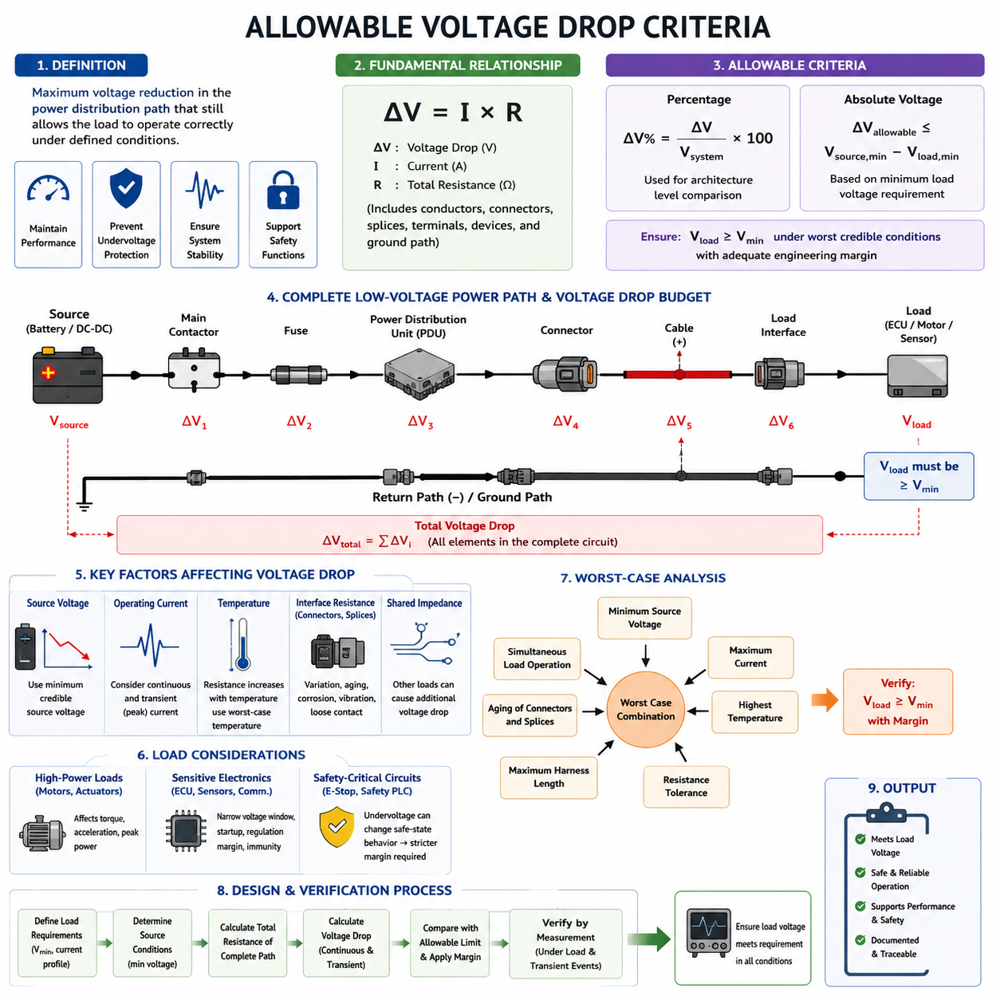
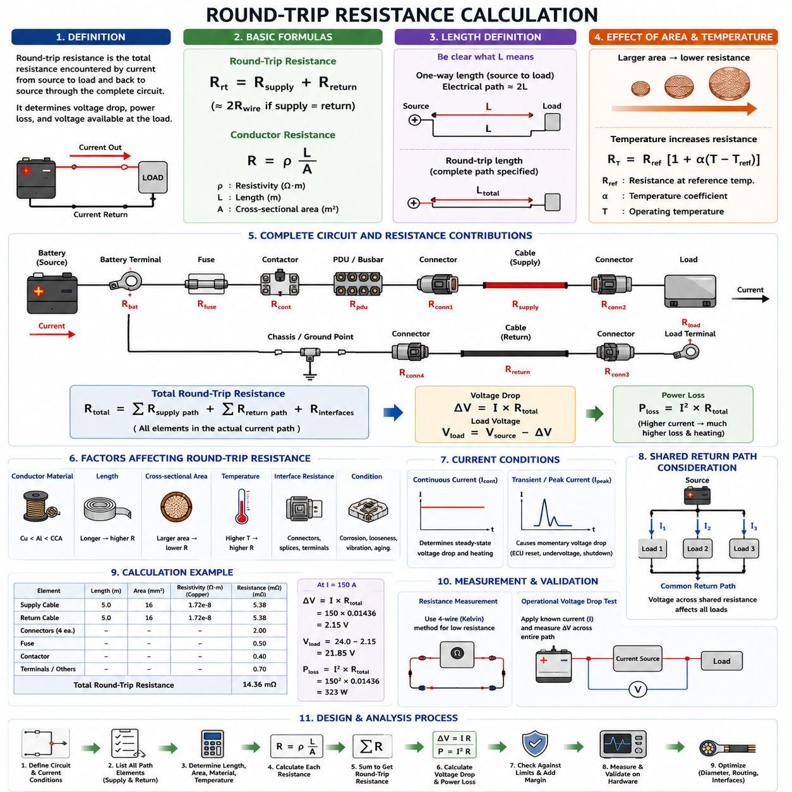
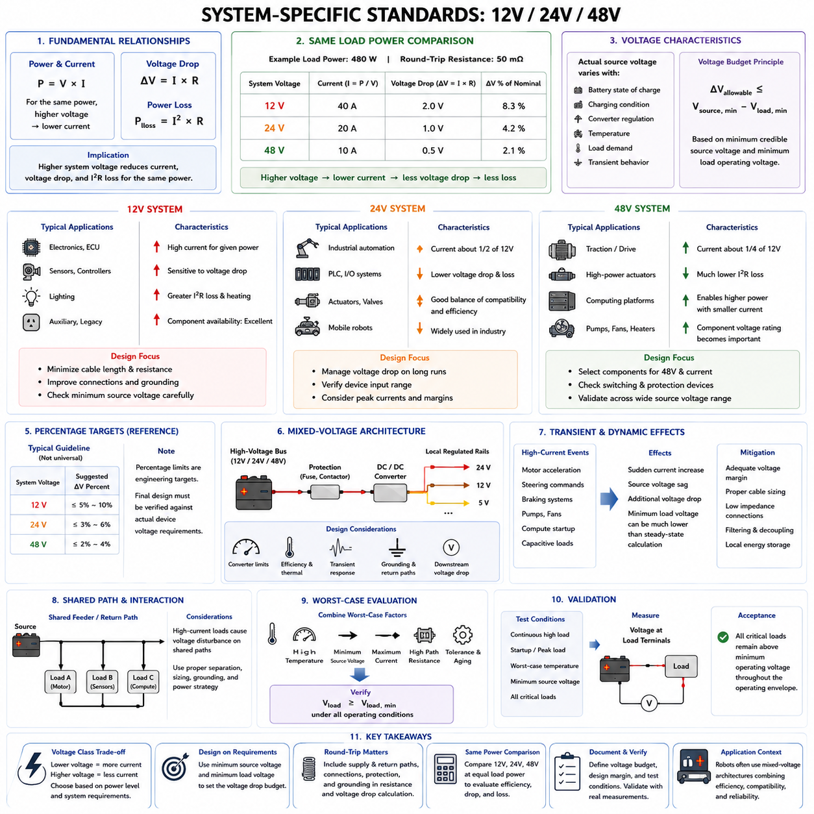
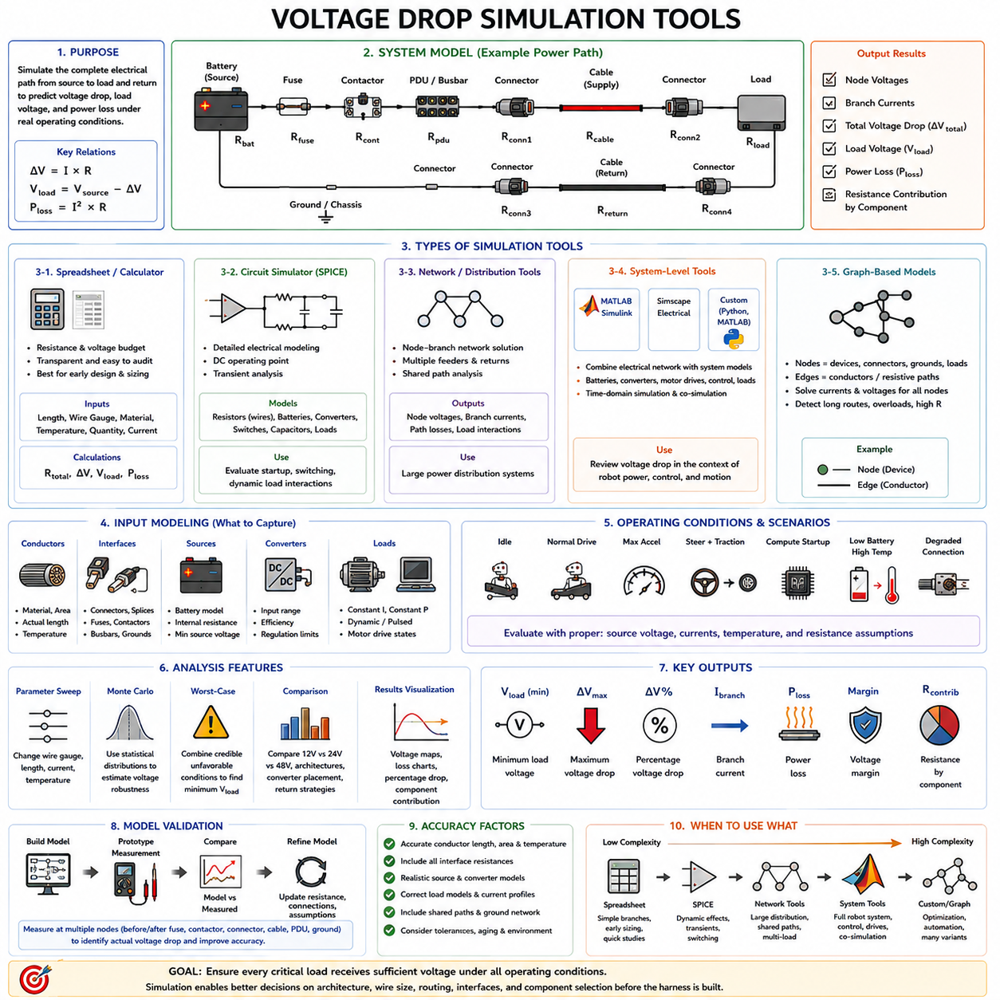
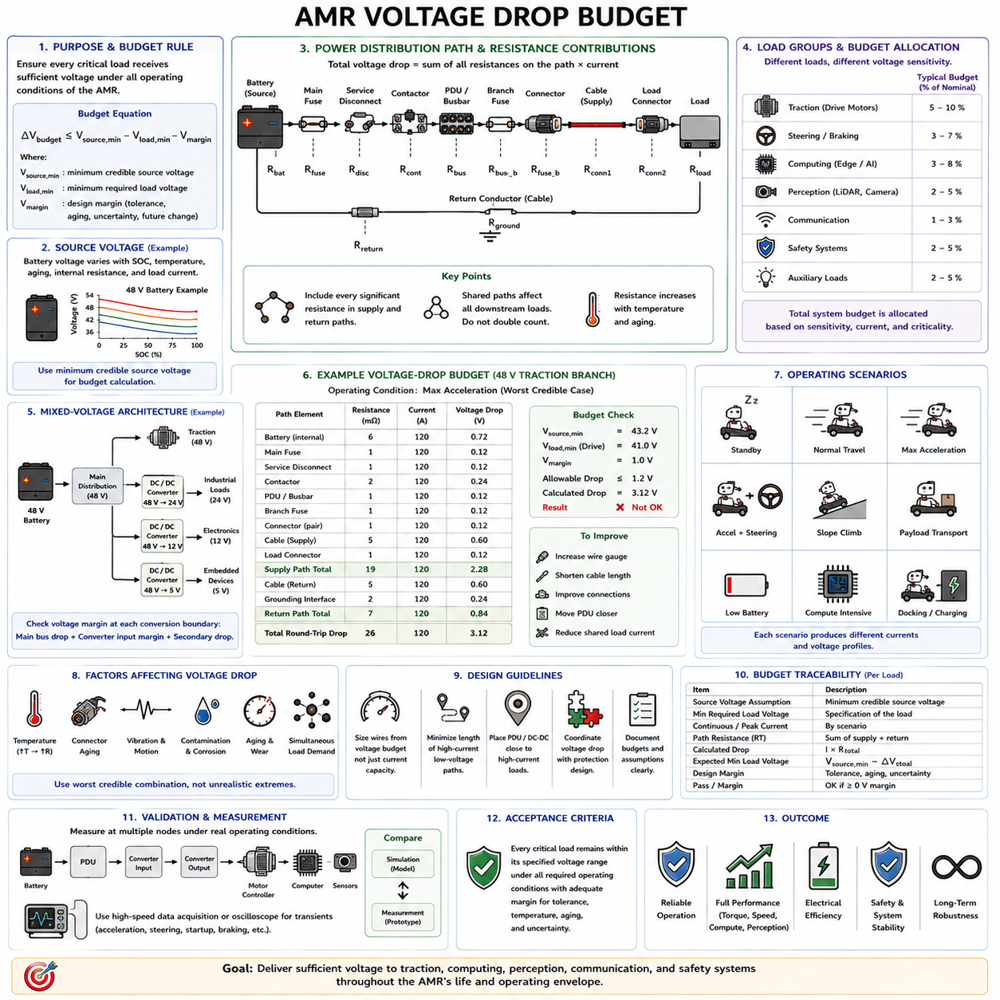

**Volume 02. Wire Harness Engineering**

# Chapter 03. Voltage Drop

## 03.01. Allowable Voltage Drop Criteria

{width="7.268055555555556in" height="7.268055555555556in"}

허용 전압 강하(Allowable Voltage Drop)는 정의된 운전 조건에서 연결된 부하(Load)가 정상적으로 동작할 수 있도록 허용되는 전력 분배 경로(Power Distribution Path)의 최대 전위 감소를 의미한다. 이는 단순히 배선 효율(Wiring Efficiency)을 위한 목표가 아니다. 로봇이나 차량에서 과도한 전압 강하(Voltage Drop)는 액추에이터(Actuator)의 토크를 감소시키고, 전자 제어 장치(Electronic Control Unit, ECU)를 교란하며, 저전압 보호(Undervoltage Protection)를 작동시키고, 고전류 상황에서 시스템의 불안정한 동작을 유발할 수 있다.

따라서 전압 강하 기준(Voltage Drop Criteria)은 전선의 전류 허용 용량(Current Capacity)만을 기준으로 설정하는 것이 아니라 부하 요구사항(Load Requirements)을 기반으로 결정해야 한다. 도체(Conductor)가 과열되지 않고 요구 전류를 안전하게 전달할 수 있더라도 허용할 수 없는 수준의 전압 손실이 발생할 수 있다. 하네스 엔지니어링(Harness Engineering)은 전류 허용 용량(Ampacity), 열 한계(Thermal Limits), 전압 요구사항(Voltage Requirements), 기계적 제약(Mechanical Constraints), 보호 협조(Protection Coordination), 시스템 수준 전력 분배 목표(System-Level Power Distribution Objectives)를 동시에 만족해야 한다.

기본적인 관계식은 ΔV = I × R이며, 여기서 ΔV는 전압 강하(Voltage Drop), I는 회로를 흐르는 전류(Current), R은 해당 전류 경로(Current Path)의 전체 저항(Total Resistance)을 의미한다. 실제 하네스 설계(Harness Design)에서 저항은 도체뿐만 아니라 단자(Terminal), 커넥터(Connector), 스플라이스(Splice), 배전 장치(Distribution Device), 퓨즈 인터페이스(Fuse Interface), 접촉기(Contactor), 접지 경로(Grounding Path), 그리고 전원과 부하 사이에 존재하는 기타 전기적 접속부(Electrical Junction)를 포함한다.

허용 전압 강하(Allowable Voltage Drop)는 일반적으로 절대 전압(Absolute Voltage) 또는 공칭 시스템 전압(Nominal System Voltage)에 대한 백분율(Percentage)로 표현할 수 있다. 백분율 표현식은 ΔV% = (ΔV / Vsystem) × 100이다. 백분율 한계(Percentage Limit)는 아키텍처 수준(Architecture-Level)의 비교에 유용하며, 절대 전압 한계(Absolute Voltage Limit)는 최소 동작 전압(Minimum Operating Voltage)이 명확하게 규정된 특정 ECU, 센서(Sensor), 모터 컨트롤러(Motor Controller), 컨버터(Converter)를 평가할 때 더욱 직접적인 의미를 가진다.

가장 중요한 기준은 부하 단자(Load Terminal)에 필요한 최소 전압(Minimum Voltage)이다. 장치가 보장된 동작을 위해 최소 Vmin을 요구한다면, 전력 분배 네트워크(Power Distribution Network)는 최악의 신뢰 가능한 운전 조건(Worst Credible Operating Condition)에서도 Vload ≥ Vmin을 만족해야 한다. 따라서 사용 가능한 전압 강하 예산(Voltage Drop Budget)은 ΔVallowable ≤ Vsource,min − Vload,min으로 표현할 수 있으며, 불확실성(Uncertainty)이나 과도 상태(Transient Behavior)를 고려해야 하는 경우 추가적인 엔지니어링 마진(Engineering Margin)을 적용한다.

전원 전압(Source Voltage)을 공칭 배터리 전압(Nominal Battery Voltage)과 동일한 값으로 자동 간주해서는 안 된다. 배터리는 충전 상태(State of Charge), 온도(Temperature), 노화(Aging), 내부 저항(Internal Resistance), 순간 전류 요구(Instantaneous Current Demand)에 따라 전압이 변한다. DC/DC 컨버터(DC/DC Converter) 역시 허용 오차(Tolerance)와 전압 조정 특성(Regulation Characteristics)을 가진다. 따라서 전압 강하 평가는 이상적인 12 V, 24 V 또는 48 V 공칭값이 아니라 배전 지점(Distribution Point)에서 예상되는 최소 전원 전압(Minimum Credible Source Voltage)을 기준으로 시작해야 한다.

운전 전류(Operating Current) 역시 실제 시스템 동작을 반영해야 한다. 연속 전류(Continuous Current)는 정상 상태 전압 손실(Steady-State Voltage Loss)을 평가하는 데 중요하지만, 많은 로봇 부하는 훨씬 큰 과도 전류(Transient Current)를 발생시킨다. 모터 가속(Motor Acceleration), 조향 작동(Steering Actuation), 브레이크 해제(Brake Release), 펌프(Pump), 팬(Fan), 히터(Heater), 컴퓨팅 장치 기동(Compute Startup), 용량성 충전(Capacitive Charging), 여러 서브시스템의 동시 작동(Simultaneous Subsystem Activation)은 평균 소비 전류로 예측한 것보다 훨씬 큰 순간 전압 강하를 발생시킬 수 있다.

따라서 설계에서는 연속 허용 전압 강하(Continuous Allowable Voltage Drop)와 과도 허용 전압 강하(Transient Allowable Voltage Drop)를 구분하는 것이 유용하다. 연속 기준(Continuous Criteria)은 정상 운전 성능과 효율을 보호하며, 과도 기준(Transient Criteria)은 짧은 시간 동안 발생하는 전압 교란이 장치의 리셋(Reset), 드롭아웃(Dropout), 보호 임계값(Protection Threshold)보다 높은 전압을 유지하는지를 판단한다. 짧은 전압 변동이 전선의 열적 측면에서는 문제가 없더라도 ECU를 리셋시키거나 안전 관련 센서(Safety-Related Sensor)를 중단시킨다면 기능적으로 허용할 수 없다.

전압 강하 예산(Voltage Drop Budget)은 전체를 케이블(Cable)에 할당하는 것이 아니라 완전한 전기적 경로(Complete Electrical Path)에 걸쳐 배분해야 한다. 전원에서 부하까지의 경로에는 배터리 단자(Battery Terminal), 메인 접촉기(Main Contactor), 퓨즈(Fuse), 전력 분배 장치(Power Distribution Unit, PDU), 커넥터, 스플라이스, 양극 도체(Positive Conductor), 부하 인터페이스(Load Interface), 귀환 도체(Return Conductor), 섀시 또는 접지 연결(Chassis or Ground Connection)이 포함될 수 있다. 각 요소가 사용 가능한 전압 강하 예산의 일부를 소비하므로 인터페이스 저항(Interface Resistance)은 중요한 시스템 수준 설계 파라미터(System-Level Design Parameter)가 된다.

전류가 전용 귀환 도체(Dedicated Return Conductor) 또는 여러 접지 인터페이스(Grounding Interface)를 통해 복귀하는 경우에는 귀환 경로 저항(Return-Path Resistance)을 반드시 포함해야 한다. 양극 전선(Positive Wire)만 평가하면 실제 회로 전압 강하를 과소평가하게 된다. 단순한 2선식 회로(Two-Wire Circuit)에서는 관련 저항을 공급 경로 저항(Supply Resistance)과 귀환 경로 저항(Return Resistance)의 합으로 근사할 수 있으며, 더욱 복잡한 접지 아키텍처(Grounded Architecture)에서는 실제 전류 귀환 토폴로지(Current Return Topology)와 공유 임피던스(Shared Impedance)를 분석해야 한다.

온도(Temperature) 역시 중요한 기준이다. 구리(Copper)의 저항은 온도가 상승함에 따라 증가하기 때문이다. 실온(Room Temperature)에서 전압 강하 목표를 만족하는 하네스도 장시간 고전류 운전이나 고온 환경에 노출된 이후에는 허용 한계를 초과할 수 있다. 따라서 저항 계산(Resistance Calculation)에는 20°C에서의 공칭 저항(Nominal Resistance)만 사용하는 것이 아니라 예상 도체 운전 온도(Expected Conductor Operating Temperature) 또는 정의된 최악 조건 온도(Worst-Case Temperature)를 적용해야 한다.

커넥터 및 스플라이스 저항(Connector and Splice Resistance) 역시 사용 수명(Service Life)에 따라 변화한다. 접점 마모(Contact Wear), 오염(Contamination), 부식(Corrosion), 진동(Vibration), 접촉력 완화(Relaxation of Contact Force), 불완전한 크림핑(Imperfect Crimping), 반복적인 체결 및 분리(Mating Cycles)는 인터페이스 저항을 증가시킬 수 있다. 따라서 견고한 허용 전압 강하 기준은 모든 접속부가 초기 실험실 저항값을 영구적으로 유지한다고 가정하지 않고 제조 편차(Manufacturing Variation)와 노화를 고려할 수 있는 충분한 마진을 포함해야 한다.

모터(Motor) 및 기타 고전력 부하(High-Power Load)의 경우 허용 전압 강하는 사용 가능한 전기적·기계적 성능(Electrical and Mechanical Performance)에 직접적인 영향을 준다. 모터 컨트롤러 입력 전압(Motor-Controller Input Voltage)이 감소하면 구현 가능한 상전압(Phase Voltage), 가속도(Acceleration), 토크(Torque), 피크 전력(Peak Power)이 제한될 수 있다. 따라서 자율이동로봇(Autonomous Mobile Robot, AMR)에서는 구동(Traction)과 조향(Steering)이 동시에 높은 출력을 요구할 때 정지 상태 측정이나 저부하 기능 시험에서는 나타나지 않았던 전압 강하 문제가 드러날 수 있다.

민감한 전자 부하(Sensitive Electronic Load)는 다른 관점에서 평가해야 한다. 카메라(Camera), 라이다(LiDAR), 레이더(Radar), 통신 게이트웨이(Communication Gateway), 임베디드 컴퓨터(Embedded Computer), 안전 컨트롤러(Safety Controller)는 구동 장치보다 작은 전류를 사용할 수 있지만 허용 전압 범위(Allowable Voltage Window)는 더 좁을 수 있다. 따라서 이들 장치의 기준은 연속 동작(Uninterrupted Operation), 전원 공급 조정 마진(Power-Supply Regulation Margin), 기동 특성(Startup Behavior), 다른 전력망 분기에서 발생하는 교란에 대한 내성(Immunity to Disturbances)을 중요하게 고려해야 한다.

안전 관련 회로(Safety-Related Circuit)는 일반적인 하네스 전압 강하 백분율을 일률적으로 적용하기보다 저전압 발생의 결과(Consequence of Undervoltage)를 기준으로 평가해야 한다. 비상 정지 회로(Emergency-Stop Circuit), 제동 컨트롤러(Braking Controller), 안전 PLC(Safety PLC), 안전 센서(Safety Sensor), 전원 차단 장치(Power-Disconnection Device)는 전원 손실이 의도된 안전 상태(Safe-State Behavior)를 변경할 수 있기 때문에 더욱 엄격한 마진을 요구할 수 있다. 따라서 보편적인 전압 강하 백분율보다 기능 요구사항(Functional Requirements)이 우선되어야 한다.

허용 기준(Allowable Criteria)은 공유 배전 임피던스(Shared Distribution Impedance)도 고려해야 한다. 여러 부하가 하나의 피더(Feeder), 커넥터, 퓨즈 블록(Fuse Block), 접지 귀환 경로(Ground Return), PDU 버스(PDU Bus)를 공유하면 하나의 분기에서 요구하는 전류가 다른 분기에 공급되는 전압을 감소시킬 수 있다. 이러한 결합 현상(Coupling)은 모터와 민감한 전자 장치가 공통 상위 전력 경로(Common Upstream Power Path)를 사용할 때 특히 중요하다. 따라서 개별 분기 수준 계산(Branch-Level Calculation)만으로는 중요한 시스템 상호작용(System Interaction)을 놓칠 수 있다.

최악 조건 분석(Worst-Case Analysis)은 각 파라미터를 공칭값으로 독립 평가하는 것이 아니라 현실적으로 동시에 발생할 수 있는 불리한 조건을 조합해야 한다. 대표적으로 최소 전원 전압(Minimum Source Voltage), 최대 예상 전류(Maximum Expected Current), 상승된 도체 온도(Elevated Conductor Temperature), 최대 허용 하네스 길이(Maximum Permitted Harness Length), 저항 허용 오차(Resistance Tolerance), 커넥터 노화(Connector Aging), 동시 부하 운전(Simultaneous Load Operation)을 고려한다. 이러한 조건을 통해 실제 경계 조건에서도 부하에 충분한 전압 마진(Voltage Margin)이 남아 있는지를 확인한다.

엔지니어링 마진(Engineering Margin)은 임의적인 전선 대형화(Wire Oversizing)에 숨겨 적용하기보다 명시적으로 정의해야 한다. 계산된 전압 강하를 정의된 설계 한계(Design Limit)와 비교하고, 불확실성, 노화 또는 향후 부하 증가(Future Load Growth)를 위한 마진을 별도로 확보할 수 있다. 이렇게 하면 설계 추적성(Design Traceability)이 향상되며, 이후 케이블 길이, 커넥터 수, 부하 전력 또는 아키텍처가 변경되더라도 최초의 설계 가정을 처음부터 다시 구성하지 않고 영향을 평가할 수 있다.

전압 강하 허용성(Voltage-Drop Acceptance)은 최종적으로 대표 하드웨어(Representative Hardware)를 이용한 측정을 통해 확인해야 한다. 측정은 의도한 전류가 실제로 흐르는 상태에서 전원 배전 지점(Source Distribution Point)과 부하 단자 사이에서 직접 수행하는 것이 가장 의미가 있다. 시험에는 정상 상태 운전(Steady Operation)과 주요 과도 상태(Transient Event)를 모두 포함해야 하며, 일반적인 휴대용 멀티미터(Handheld Meter)가 포착하지 못할 수 있는 짧은 전압 교란까지 측정할 수 있을 정도로 빠른 계측 장비를 사용하여 최소 부하 전압(Minimum Load Voltage)을 확인해야 한다.

잘 정의된 허용 전압 강하 기준(Allowable Voltage Drop Criteria)은 결국 전기 물리(Electrical Physics)와 기능 성능(Functional Performance)을 연결한다. 이는 온도, 전류, 제조 편차, 노화 및 과도 조건에서 요구되는 부하 전압을 유지하면서 전체 전력 분배 네트워크가 소비할 수 있는 전원 전압의 범위를 정의한다. 이러한 기준은 이후 왕복 저항 계산(Round-Trip Resistance Calculation), 시스템 전압별 기준(System-Voltage Rules), 전압 강하 시뮬레이션(Voltage Drop Simulation), 전선 굵기 선정(Wire-Gauge Selection), AMR 전압 강하 예산(AMR Voltage-Drop Budget)을 수행하기 위한 기본 토대가 된다.

## 03.02. Round Trip Resistance Calculation

{width="7.268055555555556in" height="7.268055555555556in"}

왕복 저항(Round-Trip Resistance)은 전류가 전원(Source)에서 부하(Load)까지 이동한 후 전체 회로(Complete Circuit)를 통해 다시 전원으로 돌아오는 과정에서 만나게 되는 전체 전기 저항(Total Electrical Resistance)을 의미한다. 와이어 하네스 엔지니어링(Wire Harness Engineering)에서는 동일한 전류가 반드시 귀환 경로(Return Path)를 통해 회로를 완성해야 하므로 공급 도체(Supply Conductor)의 저항만 계산하는 것은 충분하지 않다. 공급 및 귀환 경로의 결합 저항(Combined Resistance)이 실제 전압 강하(Voltage Drop), 전력 손실(Power Loss), 그리고 부하에서 사용할 수 있는 전압을 결정한다.

단순한 2선식 직류 회로(Two-Wire DC Circuit)의 경우 왕복 저항은 Rround-trip = Rsupply + Rreturn으로 표현할 수 있다. 공급 도체(Supply Conductor)와 귀환 도체(Return Conductor)가 동일한 재질(Material), 단면적(Cross-Sectional Area), 길이(Length), 온도(Temperature)를 갖는다면 두 저항은 거의 동일하다. 따라서 계산은 Rround-trip ≈ 2Rwire로 단순화할 수 있으며, 이것이 회로의 전압 강하를 계산할 때 도체 길이를 흔히 두 배로 적용하는 이유이다.

개별 도체(Individual Conductor)의 저항은 R = ρL/A 관계식을 따른다. 여기서 R은 저항(Resistance), ρ는 도체 재료의 전기 비저항(Electrical Resistivity), L은 도체 길이(Conductor Length), A는 도체 단면적(Conductor Cross-Sectional Area)을 의미한다. 공급 및 귀환 도체가 동일한 경우 관계식은 Rround-trip = 2ρL/A가 된다. 이 식은 하네스 길이(Harness Length), 도체 크기(Conductor Size), 재료 특성(Material Properties), 전체 회로 저항(Total Circuit Resistance) 사이의 기본적인 물리적 관계를 나타낸다.

길이(Length)는 해석 방법에 따라 계산 결과에 2배의 오류가 발생할 수 있으므로 명확하게 정의해야 한다. L이 전원에서 부하까지의 편도 물리적 거리(One-Way Physical Distance)를 나타낸다면 동일한 2선식 회로의 전체 전기적 경로(Electrical Path)는 약 2L이 된다. 반대로 지정된 길이가 이미 전체 공급 및 귀환 경로(Complete Supply-and-Return Path)를 나타낸다면 다시 두 배로 계산해서는 안 된다. 따라서 하네스 계산에서는 표시된 길이가 편도 길이(One-Way Length)인지 왕복 길이(Round-Trip Length)인지 명확하게 정의해야 한다.

도체 단면적(Conductor Cross-Sectional Area)은 저항과 반비례 관계(Inverse Relationship)를 갖는다. 전선의 단면적을 증가시키면 왕복 저항이 감소하고 이에 따라 전압 강하와 저항성 발열(Resistive Heating)도 감소한다. 이러한 이유로 작은 도체가 열적으로 필요한 전류를 안전하게 전달할 수 있더라도 더 큰 전선 굵기(Wire Gauge)가 요구될 수 있다. 따라서 전선 크기 선정(Wire Sizing)은 전류 허용 용량(Ampacity), 온도, 패키징(Packaging), 질량(Mass), 유연성(Flexibility), 비용(Cost)과 함께 전압 강하 요구사항(Voltage-Drop Requirements)을 고려해야 한다.

도체 재료(Conductor Material) 역시 구리(Copper), 알루미늄(Aluminum), 동피복 알루미늄(Copper-Clad Aluminum) 및 기타 재료의 비저항(Resistivity)이 서로 다르기 때문에 계산에 포함해야 한다. 구리는 상대적으로 낮은 비저항과 우수한 전기적 특성 때문에 널리 사용되지만 질량 또는 비용을 줄이기 위해 대체 도체(Alternative Conductor)를 선택할 수도 있다. 공급 경로와 귀환 경로의 재료가 서로 다른 경우에는 단순히 저항을 두 배로 계산하지 않고 각각의 도체 저항을 독립적으로 계산해야 한다.

온도(Temperature)는 왕복 저항에 상당한 영향을 미친다. 구리와 같은 금속 도체(Metallic Conductor)는 도체 온도가 상승함에 따라 저항도 증가한다. 온도에 따른 저항은 RT = Rref[1 + α(T − Tref)]로 근사할 수 있으며, 여기서 Rref는 기준 온도(Reference Temperature)에서의 저항이고 α는 저항 온도 계수(Temperature Coefficient of Resistance)이다. 따라서 전압 강하 계산은 실온 저항(Room-Temperature Resistance)에만 의존하지 않고 실제 운전 온도(Operating Temperature)를 반영해야 한다.

이러한 온도 효과(Temperature Effect)는 전류 허용 용량(Current Capacity)과 전압 강하 설계(Voltage-Drop Design) 사이에 중요한 상호작용을 만든다. 높은 전류는 더 큰 I²R 발열(I²R Heating)을 발생시키며, 이는 도체 온도와 저항을 증가시킨다. 증가된 저항은 다시 추가적인 전압 강하와 발열을 발생시킨다. 적절하게 설계된 하네스는 무한히 온도가 증가하는 것이 아니라 열평형(Thermal Equilibrium)에 도달하지만, 이러한 결합 효과 때문에 최악 조건 왕복 저항(Worst-Case Round-Trip Resistance)은 적절한 안정화 도체 온도(Stabilized Conductor Temperature)에서 평가해야 한다.

실제 하네스 저항(Harness Resistance)은 전선 자체의 체적 저항(Bulk Resistance)만으로 구성되지 않는다. 전체 경로에는 배터리 단자(Battery Terminal), 퓨즈(Fuse), 접촉기(Contactor), 전력 분배 장치(Power Distribution Unit, PDU), 커넥터 접점(Connector Contact), 크림프 접합부(Crimp Joint), 스플라이스(Splice), 버스바(Busbar), 접지 인터페이스(Grounding Interface), 부하 단자(Load Terminal)가 포함될 수 있다. 따라서 실용적인 관계식은 Rtotal = Rsupply-wire + Rinterfaces + Rreturn-path로 나타낼 수 있으며, Rinterfaces는 전기적 접속부와 배전 부품의 누적 저항(Cumulative Resistance)을 의미한다.

커넥터 및 스플라이스 저항(Connector and Splice Resistance)은 개별적으로는 매우 작아 보일 수 있지만 저전압·고전류 회로(Low-Voltage, High-Current Circuit)에 여러 인터페이스가 존재하면 그 영향이 상당해질 수 있다. 접촉 저항(Contact Resistance)은 제조 편차(Manufacturing Variation), 부적절한 크림핑(Inadequate Crimping), 오염(Contamination), 부식(Corrosion), 프레팅(Fretting), 진동(Vibration), 열 사이클(Thermal Cycling), 노화(Aging) 등에 의해 증가할 수 있다. 따라서 과도한 손실의 실제 물리적 원인을 추적할 수 있도록 도체 저항과 인터페이스 저항을 구분하여 계산해야 한다.

귀환 경로가 전용 음극 도체(Dedicated Negative Conductor)를 사용하는 경우 공급 및 귀환 전선의 형상(Geometry)을 모두 알 수 있으므로 계산이 비교적 간단하다. 그러나 일부 전기 아키텍처(Electrical Architecture)는 섀시(Chassis), 프레임(Frame), 구조 금속(Structural Metal), 분산 접지 네트워크(Distributed Grounding Network)를 귀환 경로의 일부로 사용한다. 이러한 시스템에서는 귀환 저항을 공급 저항과 동일하다고 자동으로 가정할 수 없으며 실제 접지 토폴로지(Grounding Topology)와 연결 인터페이스(Connection Interface)를 기반으로 결정해야 한다.

공유 귀환 경로(Shared Return Path)는 여러 부하의 전류가 공통 도체(Common Conductor) 또는 접지 구간(Grounding Segment)을 통해 흐를 수 있기 때문에 추가적인 주의가 필요하다. 이러한 공유 저항에 발생하는 전압은 결합 전류(Combined Current)에 비례하며 다른 장치가 인식하는 로컬 접지 전위(Local Ground Potential)를 변화시킬 수 있다. 따라서 왕복 저항 모델(Round-Trip Resistance Model)은 각각의 부하를 독립적인 2선식 회로로 취급하기보다 개별 분기(Individual Branch)와 공유 구간(Shared Segment)을 함께 표현해야 할 수 있다.

왕복 저항이 결정되면 해당 전류 조건에서 회로 전압 강하는 ΔV = I × Rround-trip으로 계산한다. 추가적인 인터페이스 저항(Interface Resistance)을 별도로 모델링하는 경우에는 ΔV = I × Rtotal을 사용해야 한다. 이후 부하 전압은 Vload = Vsource − ΔV로 추정할 수 있으며, 계산된 값을 연결된 장비의 최소 동작 전압 요구사항(Minimum Operating Voltage Requirement)과 직접 비교할 수 있다.

저항성 경로(Resistive Path)에서 소모되는 전력은 Ploss = I²Rtotal의 관계를 갖는다. 이 관계는 매우 작은 저항값도 고전류 회로에서는 중요해질 수 있음을 보여준다. 전류가 두 배가 되면 전압 강하는 두 배가 되지만 저항성 전력 손실(Resistive Power Loss)은 네 배로 증가한다. 따라서 구동 모터(Traction Motor), 조향 액추에이터(Steering Actuator), 고전력 컴퓨터(High-Power Computer), 히터(Heater), 펌프(Pump), 충전 회로(Charging Circuit)는 특히 세밀한 저항 예산(Resistance Budget) 관리가 필요하다.

연속 전류(Continuous Current)뿐만 아니라 과도 전류(Transient Current)도 평가해야 한다. 모터 기동(Motor Startup), 급가속(Rapid Acceleration), 조향 보정(Steering Correction), 브레이크 작동(Brake Operation), 용량성 충전(Capacitive Charging), 여러 부하의 동시 활성화(Simultaneous Activation)는 단시간의 피크 전류(Peak Current)를 발생시킬 수 있다. 이러한 현상은 평균 도체 온도를 크게 상승시키지 않을 수도 있지만 순간 전압 강하(Instantaneous Voltage Drop)로 인해 모터 컨트롤러 저전압(Motor-Controller Undervoltage), ECU 리셋(ECU Reset), 센서 중단(Sensor Interruption), DC/DC 컨버터 정지(DC/DC Converter Shutdown)를 발생시킬 수 있다.

따라서 왕복 저항 계산은 하나의 공칭 전류(Nominal Current)에 대해서만 수행하기보다 여러 주요 운전 상태(Operating State)에 대해 수행해야 한다. 연속 운전(Continuous Operation)은 정상 상태 전압 손실(Steady-State Voltage Loss)과 발열을 결정하며, 피크 전류 조건(Peak-Current Condition)은 과도 전압 마진(Transient Voltage Margin)을 확인하는 데 사용된다. 최소 전원 전압, 상승된 도체 온도, 최대 하네스 길이, 커넥터 저항, 동시 부하 운전을 결합하여 현실적인 최악 조건 회로 상태(Worst-Case Circuit Condition)를 설정할 수 있다.

제조 허용 오차(Manufacturing Tolerance) 역시 고려해야 한다. 실제 도체 단면적, 연선 구조(Strand Construction), 케이블 길이, 크림프 저항(Crimp Resistance), 단자 접촉 저항(Terminal Contact Resistance), 커넥터 성능은 생산 허용 범위(Production Limits) 내에서 변동한다. 이상적인 공칭 저항(Nominal Resistance)에서만 전압 요구사항을 만족하는 설계는 조립된 부품이 허용 한계에 접근할 경우 실패할 수 있다. 따라서 허용 전압 강하 예산을 완전히 사용하기 전에 적절한 저항 마진(Resistance Margin)을 확보해야 한다.

유용한 엔지니어링 방법은 전체 전원-부하 루프(Source-to-Load Loop)에 대한 저항 예산(Resistance Budget)을 구성하는 것이다. 각각의 도체 구간(Conductor Segment)과 인터페이스에 예상 또는 측정 저항을 할당하고 실제 전류 경로에 따라 이를 합산한다. 이를 통해 주요 저항 기여 요소(Dominant Resistance Contributor)를 식별하고, 대체 배선 경로 또는 전선 굵기를 비교하며, 커넥터 변경을 평가하고, 개선 대상이 도체, 인터페이스, 접지 또는 배전 아키텍처(Distribution Architecture) 중 어디인지 판단할 수 있다.

예를 들어 저전류 분기(Low-Current Branch)에서는 긴 케이블 구간이 전체 저항을 지배할 수 있지만 짧은 고전류 경로(High-Current Path)에서는 커넥터와 접촉기 저항이 상대적으로 중요한 요소가 될 수 있다. 대부분의 전압 손실이 열화된 접점(Degraded Contact)이나 공유 접지 인터페이스에서 발생한다면 전선 굵기를 증가시키더라도 개선 효과는 제한적이다. 따라서 왕복 저항 분석은 전선 굵기 증가만을 전압 강하 문제의 유일한 해결책으로 취급하는 것을 방지한다.

측정(Measurement)은 계산된 저항을 검증하는 중요한 방법이다. 밀리옴(Milliohm) 수준에서는 시험 리드선(Test Lead)과 접촉 저항이 하네스 자체의 저항과 비슷한 수준일 수 있으므로 직접 저항 측정이 어려울 수 있다. 따라서 정밀한 저저항 특성 평가(Low-Resistance Characterization)에는 4선식 켈빈 측정(Four-Wire Kelvin Measurement)이 유용하며, 알려진 전류 조건에서의 실제 전압 강하 측정(Operational Voltage-Drop Measurement)을 통해 조립된 전체 회로를 시스템 수준에서 효과적으로 검증할 수 있다.

실제 운전 시험(Operational Testing)에서는 대표적인 전류가 흐르는 상태에서 전체 전원-부하 및 귀환 경로에 걸친 전압을 측정하는 것이 바람직하다. 이후 R = ΔV/I를 이용하여 유효 저항(Effective Resistance)을 추정할 수 있다. 중간 노드(Intermediate Node)에서도 추가로 측정하면 케이블, 커넥터, 퓨즈, 접촉기, 스플라이스 또는 접지 지점에서 발생하는 손실을 개별적으로 분리할 수 있으며, 계산된 저항 예산을 실제 하드웨어 동작과 비교할 수 있다.

왕복 저항 계산(Round-Trip Resistance Calculation)은 궁극적으로 전선의 물리적 특성(Wire Properties)과 시스템 수준 전압 성능(System-Level Voltage Performance)을 연결하는 정량적 기반을 제공한다. 공급 및 귀환 도체, 온도, 인터페이스, 공유 경로, 운전 전류, 허용 오차, 노화를 함께 고려함으로써 엔지니어는 각 부하에 실제로 전달되는 전압을 예측할 수 있다. 이렇게 구축된 저항 모델(Resistance Model)은 전압 강하 분석(Voltage-Drop Analysis), 전선 굵기 선정(Wire-Gauge Selection), 보호 협조(Protection Coordination), 자율이동로봇 전력 분배 설계(AMR Power-Distribution Design)의 기본 토대가 된다.

## 03.03. System Specific Standards (12V/24V/48V)

{width="7.268055555555556in" height="7.268055555555556in"}

12 V, 24 V 또는 48 V 전기 시스템(Electrical System)은 공칭 전압(Nominal Voltage)만을 기준으로 평가할 수 없다. 각각의 전압 등급(Voltage Class)은 부하 전력(Load Power), 전류(Current), 도체 저항(Conductor Resistance), 전압 강하(Voltage Drop), 장비 동작 한계(Equipment Operating Limits) 사이에서 서로 다른 관계를 갖는다. 공칭값은 주로 시스템 아키텍처(System Architecture)를 나타내며, 실제 전원 전압은 배터리 상태(Battery State), 충전 조건(Charging Condition), 컨버터 전압 조정(Converter Regulation), 온도(Temperature), 부하 요구(Load Demand), 과도 동작(Transient Behavior)에 따라 변화한다.

부하가 전력 P를 필요로 하는 경우 변환 손실(Conversion Loss)과 동적 효과(Dynamic Effect)를 무시하면 전류는 대략 I = P/V로 계산된다. 따라서 배전 전압(Distribution Voltage)을 높이면 동일한 전력을 전달하는 데 필요한 전류가 감소한다. 예를 들어 480 W 부하는 이론적으로 12 V에서 40 A, 24 V에서 20 A, 48 V에서 10 A가 필요하며, 이는 로봇의 전력 요구량이 증가할수록 고전압 아키텍처(Higher-Voltage Architecture)가 유리해지는 이유를 보여준다.

전압 강하는 ΔV = I × R의 관계를 따르므로 높은 시스템 전압에서 얻어지는 전류 감소는 동일한 저항과 전달 전력 조건에서 도체의 전압 강하를 직접 감소시킨다. 동일한 480 W 부하에 왕복 경로 저항(Round-Trip Path Resistance)이 50 mΩ인 경우 다른 운전 영향을 고려하기 전의 대략적인 전압 강하는 12 V에서 2.0 V, 24 V에서 1.0 V, 48 V에서 0.5 V가 된다.

백분율 관점에서의 영향은 더욱 크게 나타난다. 1 V의 전압 강하는 12 V 공칭 시스템에서는 약 8.3%, 24 V 시스템에서는 약 4.2%, 48 V 시스템에서는 약 2.1%에 해당한다. 이는 저전압 아키텍처(Low-Voltage Architecture)가 케이블 길이(Cable Length)와 접속 저항(Connection Resistance)에 특히 민감하다는 것을 보여준다. 그러나 이러한 백분율 한계(Percentage Limit)는 모든 장치에 보편적으로 적용되는 절대적인 기준이 아니라 엔지니어링 기준(Engineering Criteria)으로 사용해야 한다.

12 V 아키텍처(12 V Architecture)는 비교적 저전력 전자 장치(Low-Power Electronics), 센서(Sensor), 컨트롤러(Controller), 조명(Lighting), 보조 장비(Auxiliary Equipment), 기존 자동차 호환 장치(Legacy Automotive-Compatible Device)에 일반적으로 적합하다. 주요 장점은 다양한 부품과 전원 액세서리(Power Accessory)를 쉽게 확보할 수 있다는 것이다. 반면 주요 전기적 한계는 비교적 작은 전력에서도 높은 전류가 발생하여 도체 저항, 커넥터 저항, 퓨즈 인터페이스(Fuse Interface), 접지 품질(Grounding Quality)의 중요성이 빠르게 증가한다는 것이다.

12 V 시스템에서는 연결된 전자 장치의 최소 동작 전압(Minimum Operating Voltage)에 비해 전원 전압의 변화 폭이 상당히 클 수 있다. 따라서 배터리 방전(Battery Discharge), 기동 전류(Startup Current), 긴 케이블 경로(Long Cable Run), 동시 부하 활성화(Simultaneous Load Activation)가 사용 가능한 전압 마진(Voltage Margin)의 상당 부분을 소비할 수 있다. 민감한 장치는 부하에서 항상 12.0 V를 사용할 수 있다고 가정하지 않고 최소 신뢰 전원 전압(Minimum Credible Source Voltage)과 최대 경로 저항(Maximum Path Resistance)을 기준으로 검토해야 한다.

고전류 12 V 분기(High-Current 12 V Branch)는 저항성 전력 손실(Resistive Power Loss)이 Ploss = I²R의 관계를 따르므로 특별한 주의가 필요하다. 저전압 네트워크를 통해 수백 와트의 전력을 공급하면 초기 계산에서 전압 강하가 관리 가능한 수준으로 보이더라도 상당한 케이블 발열(Cable Heating)과 커넥터 손실(Connector Loss)이 발생할 수 있다. 따라서 도체 단면적 증가, 배선 거리 단축, 인터페이스 개선 또는 고전력 부하를 더 높은 전압 버스(Higher-Voltage Bus)에서 공급하는 방법이 필요할 수 있다.

24 V 아키텍처(24 V Architecture)는 저전압 부품 호환성(Low-Voltage Component Compatibility)과 향상된 전력 분배 효율(Power-Distribution Efficiency) 사이에서 유용한 절충점을 제공한다. 동일한 부하 전력에서 전류는 12 V 시스템의 약 절반이 된다. 이에 따라 전압 강하, I²R 손실(I²R Loss), 일부 응용 분야에서 필요한 도체 단면적, 높은 연속 전류에 의해 커넥터 및 배전 인터페이스(Distribution Interface)에 발생하는 전기적 부담을 줄일 수 있다.

산업 자동화 장비(Industrial Automation Equipment), PLC 기반 시스템(PLC-Based System), 액추에이터(Actuator), 센서, 이동 로봇(Mobile Robot)에서는 24 V 전원을 기반으로 설계된 장비가 자주 사용된다. 그러나 24 V라는 표시가 모든 장치가 동일한 허용 입력 전압 범위(Permissible Input Voltage Range)를 갖는다는 것을 의미하지는 않는다. 각 부하는 지정된 최소 및 최대 동작 전압, 기동 요구사항(Startup Requirement), 과도 상태 허용도(Transient Tolerance), 보호 임계값(Protection Threshold)을 기준으로 개별 평가해야 한다.

이동 로봇에서 24 V 배전 시스템(24 V Distribution System)은 관리 가능한 하네스 크기(Harness Dimension)를 유지하면서 중간 수준의 추진 부하(Propulsion Load)와 보조 부하(Auxiliary Load)를 지원할 수 있다. 그러나 전압 강하 예산(Voltage-Drop Budget)에는 배터리 전압 변화, 접촉기(Contactor), 퓨즈(Fuse), 전력 분배 장치(Power Distribution Unit, PDU) 경로, 커넥터, 공급 도체(Supply Conductor), 귀환 도체(Return Conductor)를 모두 포함해야 한다. 긴 하네스 경로나 높은 모터 피크 전류(Peak Motor Current)는 12 V 시스템보다 일반적으로 유리한 조건에서도 상당한 전압 마진을 소비할 수 있다.

48 V 아키텍처(48 V Architecture)는 12 V 또는 24 V 배전으로는 지나치게 높은 전류가 요구되는 수준까지 전력 수요가 증가할 때 더욱 매력적인 선택이 된다. 구동 시스템(Traction System), 이동 로봇, 고전력 액추에이터(High-Power Actuator), 컴퓨팅 플랫폼(Computing Platform), 펌프 및 기타 고전력 부하는 전류 감소의 이점을 얻을 수 있다. 동일한 전력에서 48 V 버스는 이론적으로 12 V 버스에 필요한 전류의 4분의 1만 사용한다.

48 V 시스템에서 감소된 전류는 전력 손실이 전류의 제곱에 비례하기 때문에 도체 손실(Conductor Loss)을 크게 감소시킬 수 있다. 동일한 전달 전력과 경로 저항에서 전류를 4분의 1로 감소시키면 I²R 손실은 16분의 1로 감소한다. 실제 시스템에서는 이러한 장점을 활용하여 효율(Efficiency)을 높이고, 케이블 질량(Cable Mass)을 줄이며, 사용 가능한 전력을 증가시키거나, 도체 크기와 허용 전압 강하 사이의 균형을 최적화할 수 있다.

높은 배전 전압이 전압 강하 엔지니어링(Voltage-Drop Engineering)의 필요성을 제거하는 것은 아니다. 48 V 시스템은 12 V 시스템보다 훨씬 큰 전체 전력을 전달할 수 있으며 개별 분기에서도 여전히 상당한 전류가 흐를 수 있다. 커넥터, 접촉기, 퓨즈, 케이블, 보호 장치(Protection Device)는 실제 전압 및 전류 조건에 맞게 선정해야 한다. 또한 버스 전압이 높아질수록 부품 전압 정격(Component Voltage Rating)과 스위칭 동작(Switching Behavior)의 중요성도 증가한다.

"48 V 시스템(48 V System)"이라는 표현을 고정된 48.0 V 운전 조건으로 해석해서는 안 된다. 배터리 기반 시스템(Battery-Based System)은 셀 화학(Cell Chemistry), 직렬 셀 수(Series Cell Count), 충전 상태(State of Charge), 충전 전압(Charging Voltage), 부하 전류에 따라 상당히 넓은 전압 범위에서 동작할 수 있다. 정전압 48 V 버스(Regulated 48 V Bus)는 이와 다른 특성을 갖는다. 따라서 하네스 기준은 공칭 아키텍처 명칭이 아니라 실제 전원 전압 범위(Source-Voltage Envelope)를 기반으로 결정해야 한다.

따라서 아키텍처 효율을 평가할 때 12 V, 24 V, 48 V 시스템 간의 비교는 동일한 부하 전력(Equal Load Power)을 기준으로 수행해야 한다. 전압 등급별 시스템이 서로 다른 전력 수준을 담당할 수 있기 때문에 단순히 전류 정격(Current Rating)만 비교하면 잘못된 판단을 내릴 수 있다. 기본적인 아키텍처 관계는 P ≈ VI이며, 하네스에 미치는 영향은 ΔV = IR과 Ploss = I²R 관계를 통해 나타난다.

허용 전압 강하(Allowable Voltage Drop)는 궁극적으로 부하 요구사항(Load Requirements)을 기준으로 정의해야 한다. Vsource,min이 배전 전원에서의 최소 신뢰 전압이고 Vload,min이 장비에 필요한 최소 전압이라면 사용 가능한 경로의 전압 강하 예산은 ΔVallowable ≤ Vsource,min − Vload,min으로 제한된다. 이 원칙은 12 V, 24 V, 48 V 시스템에 동일하게 적용되며 하나의 보편적인 백분율 한계를 적용하는 것보다 신뢰성이 높다.

백분율 기반 목표(Percentage-Based Target)는 피더(Feeder), 분기(Branch), 커넥터, 귀환 경로 사이에 전압 강하 예산을 편리하게 배분할 수 있으므로 초기 아키텍처 설계(Preliminary Architecture Design)에서 여전히 유용하다. 그러나 최종 설계에서는 이러한 목표를 실제 전압값으로 변환하고 장치 사양(Device Specification)과 비교하여 검증해야 한다. 모터에 허용 가능한 전압 강하 백분율이 동일한 공칭 버스에 연결된 ECU 또는 안전 컨트롤러(Safety Controller)에는 허용되지 않을 수 있다.

혼합 전압 아키텍처(Mixed-Voltage Architecture)는 로봇에서 특히 유용할 수 있다. 높은 전압의 버스를 이용하여 구동 장치나 고전력 장비에 효율적으로 에너지를 분배하고, 부하 근처에 배치된 DC/DC 컨버터(DC/DC Converter)를 통해 24 V, 12 V, 5 V 또는 기타 정전압 전원(Regulated Rail)을 생성할 수 있다. 이 방법은 고전류 케이블 길이를 줄일 수 있지만 컨버터 입력 한계, 출력 전압 조정(Output Regulation), 변환 효율(Conversion Efficiency), 과도 응답(Transient Response), 접지(Grounding), 하위 배선의 전압 강하를 모두 고려해야 한다.

이러한 아키텍처에서는 전압 강하 예산이 계층적 구조(Hierarchical Structure)를 갖는다. 엔지니어는 먼저 메인 배터리 또는 배전 버스(Main Battery or Distribution Bus)를 검증하고, 다음으로 각각의 DC/DC 컨버터 입력에 실제로 공급되는 전압을 확인한 후, 마지막으로 컨버터에서 하위 부하까지의 정전압 출력 경로(Regulated Output Path)를 검증해야 한다. 메인 48 V 버스 계산이 만족스럽다고 해서 멀리 떨어진 12 V 센서나 컴퓨터가 변환 및 2차 하네스 손실(Secondary Harness Loss)을 거친 후에도 충분한 전압을 공급받는다는 것을 보장하지는 않는다.

과도 동작(Transient Behavior)은 세 가지 전압 등급 모두에서 특히 중요하다. 모터 가속(Motor Acceleration), 조향 명령(Steering Command), 제동 시스템(Braking System), 펌프, 팬, 컴퓨팅 장치 기동(Compute Startup), 용량성 부하(Capacitive Load)는 갑작스러운 전류 요구를 발생시킬 수 있다. 이때 전원 전압 강하(Source Sag)와 하네스 전압 강하가 동시에 발생하기 때문에 실제 최소 부하 전압(Minimum Load Voltage)은 공칭 전원 전압과 정상 상태 전류만을 사용하여 계산한 값보다 상당히 낮아질 수 있다.

공유 피더(Shared Feeder)와 귀환 경로(Return Path) 역시 평가해야 한다. 공통 배전 경로(Common Distribution Path)에 연결된 구동 모터(Traction Motor)는 센서, 통신 장비(Communication Equipment), 컴퓨팅 장치가 경험하는 전압 교란(Voltage Disturbance)을 발생시킬 수 있다. 높은 버스 전압은 일부 배전 영향을 감소시킬 수 있지만 올바른 아키텍처를 위해서는 적절한 분기 분리(Branch Separation), 도체 크기 선정(Conductor Sizing), 접지, 필터링(Filtering), 로컬 에너지 저장(Local Energy Storage), 전력 변환 전략(Power-Conversion Strategy)이 필요하다.

온도와 노화(Aging)는 전압 등급과 관계없이 중요하다. 도체 온도가 상승하면 저항이 증가하며, 커넥터 마모(Connector Wear), 부식, 진동, 접촉 열화(Contact Degradation)는 시간이 지나면서 인터페이스 저항을 증가시킬 수 있다. 따라서 최악 조건 평가(Worst-Case Evaluation)에서는 최소 신뢰 전원 전압, 최대 예상 전류(Maximum Expected Current), 증가된 경로 저항(Elevated Path Resistance), 제조 허용 오차(Manufacturing Tolerance), 노화 마진(Aging Allowance), 동시 운전 조건(Simultaneous Operating Conditions)을 함께 고려해야 한다.

시스템별 허용 기준(System-Specific Acceptance Criteria)은 단순히 "12 V", "24 V", "48 V"라고 명시하는 대신 엔지니어링 전압 예산(Engineering Voltage Budget)으로 문서화해야 한다. 이 예산에는 전원 전압 범위(Source-Voltage Range), 부하 동작 범위(Load Operating Range), 연속 및 과도 전류 조건(Continuous and Transient Current Conditions), 허용 경로 저항(Allowable Path Resistance), 인터페이스 기여분(Interface Contribution), 요구 설계 마진(Required Design Margin), 검증 조건(Validation Conditions)을 포함해야 한다. 이를 통해 와이어 하네스 설계 결정과 실제 전기 요구사항 사이의 추적성(Traceability)을 확보할 수 있다.

검증(Validation)은 대표적인 실제 운전 조건을 재현하고 배터리나 PDU에서만 전압을 측정하는 것이 아니라 부하 단자(Load Terminal)에서 직접 전압을 측정해야 한다. 연속 고부하 운전(Continuous High-Load Operation)을 통해 정상 상태 성능을 확인하고, 기동 및 피크 부하 시험(Startup and Peak-Load Test)을 통해 과도 동작을 확인한다. 측정 결과를 통해 예상 운전 범위(Expected Operating Envelope) 전체에서 모든 중요 부하(Critical Load)가 요구되는 최소 전압 이상을 유지하는지 확인해야 한다.

따라서 12 V, 24 V 또는 48 V의 선택은 시스템 아키텍처(System Architecture)의 결정인 동시에 와이어 하네스(Wire Harness)의 설계 결정이다. 낮은 전압은 높은 부품 호환성(Component Compatibility)과 단순성을 제공하지만 동일한 전력을 전달하기 위해 더 큰 전류가 필요하며, 높은 전압은 배전 효율을 향상시키고 낮은 전류로 더 큰 전력을 전달할 수 있게 한다. 올바른 설계는 선택된 전압 등급을 왕복 저항(Round-Trip Resistance), 부하 한계(Load Limits), 열적 거동(Thermal Behavior), 과도 조건(Transient Conditions), 명확한 전압 강하 예산(Explicit Voltage-Drop Budget)과 함께 종합적으로 고려해야 한다.

## 03.04. Voltage Drop Simulation Tools

{width="7.268055555555556in" height="7.268055555555556in"}

전압 강하 시뮬레이션 도구(Voltage-Drop Simulation Tools)는 전원(Source)에서 부하(Load)를 거쳐 귀환(Return)하는 전체 전기적 경로(Complete Electrical Path)를 모델링함으로써 기본적인 계산을 시스템 수준 분석(System-Level Analysis)으로 확장한다. 하나의 도체에 대해 ΔV = I × R만 계산하는 대신 배터리(Battery), DC/DC 컨버터(DC/DC Converter), 퓨즈(Fuse), 접촉기(Contactor), PDU 경로, 커넥터(Connector), 스플라이스(Splice), 케이블(Cable), 접지 네트워크(Grounding Network), 그리고 와이어 하네스 아키텍처(Wire-Harness Architecture) 내에서 상호작용하는 여러 부하를 함께 모델링할 수 있다.

가장 단순한 시뮬레이션 방법은 스프레드시트 기반 저항 및 전압 예산(Spreadsheet-Based Resistance and Voltage Budget)이다. 각각의 전기 요소(Electrical Element)를 저항, 전류, 온도 보정(Temperature Correction), 회로 연결 관계로 표현한다. 도구는 누적 저항(Cumulative Resistance), 전압 강하, 부하 단자 전압(Load-Terminal Voltage), 전력 손실(Power Loss)을 계산한다. 이 방식은 투명하고 검토하기 쉬우며 초기 하네스 크기 선정(Harness Sizing)과 아키텍처 개발에 특히 유용하다.

스프레드시트 모델(Spreadsheet Model)은 매개변수화된 방정식(Parameterized Equation)을 통해 전선 굵기(Wire Gauge), 케이블 길이(Cable Length), 도체 재료(Conductor Material), 커넥터 수량(Connector Quantity), 운전 전류(Operating Current)를 비교할 수도 있다. 하나의 설계 변수를 변경하면 전압 마진(Voltage Margin)과 전력 손실에 미치는 영향을 즉시 확인할 수 있다. 이러한 모델은 가정 조건이 명확하게 보이고 계산 결과를 원래 입력 파라미터까지 직접 추적할 수 있기 때문에 설계 트레이드 연구(Design Trade Study)에 유용하다.

SPICE와 같은 회로 시뮬레이터(Circuit Simulator)는 더욱 상세한 전기적 표현(Electrical Representation)을 제공한다. 하네스 도체는 저항(Resistor)으로 모델링할 수 있으며, 배터리, 컨버터, 스위치(Switch), 커패시터(Capacitor), 부하는 적절한 전기 모델을 이용해 표현할 수 있다. 직류 동작점 분석(DC Operating-Point Analysis)은 정상 상태 노드 전압(Steady-State Node Voltage)과 분기 전류(Branch Current)를 계산하고, 과도 해석(Transient Analysis)은 기동, 스위칭 또는 급격한 부하 변화 동안의 전압 거동을 평가한다.

SPICE 기반 분석(SPICE-Based Analysis)은 전압 강하가 전원 임피던스(Source Impedance)와 동적 부하(Dynamic Load)에 상호작용할 때 특히 유용하다. 모터 컨트롤러(Motor Controller)나 컴퓨팅 장치(Computing Device)가 갑자기 큰 전류를 요구하면 배터리 또는 컨버터 전압이 낮아지는 동시에 하네스에서도 I × R 전압 강하가 발생할 수 있다. 과도 시뮬레이션은 이러한 효과를 동시에 표현하여 공칭 정상 상태 계산에서는 나타나지 않는 최소 부하 전압(Minimum Load Voltage)을 확인할 수 있다.

대규모 전력 분배 시스템(Large Electrical Distribution System)에서는 네트워크 지향 도구(Network-Oriented Tool)를 통해 한 단계 높은 수준의 분석을 수행할 수 있다. 전력 아키텍처(Power Architecture)를 저항성 분기(Resistive Branch)로 연결된 노드(Node)의 형태로 표현하고 여러 피더(Feeder)와 귀환 경로에 부하를 분산하여 모델링할 수 있다. 네트워크를 동시에 계산하면 독립적인 분기 계산만으로는 확인하기 어려운 노드 전압, 분기 전류, 공유 경로 손실(Shared-Path Loss), 부하 간 상호작용을 파악할 수 있다.

MATLAB/Simulink 및 Simscape Electrical과 같은 상용 전기 시스템 도구(Commercial Electrical-System Tools)는 전기 네트워크(Electrical Network)와 동적 시스템 모델(Dynamic System Model)을 결합할 수 있다. 배터리 동작, DC/DC 컨버터, 모터 드라이브(Motor Drive), 제어 로직(Control Logic), 스위칭 이벤트(Switching Event), 부하 프로파일(Load Profile)을 하나의 시뮬레이션 환경에 통합할 수 있다. 이는 하네스 전압 강하를 독립적인 배선 계산이 아니라 로봇의 전체 전력, 제어, 운동 거동의 일부로 평가해야 할 때 유용하다.

MATLAB 또는 Python과 같은 범용 수학 환경(General Mathematical Environment)을 사용하여 맞춤형 전압 강하 해석기(Custom Voltage-Drop Solver)를 구축할 수도 있다. 하네스는 저항 행렬(Resistance Matrix), 노드 방정식(Node Equation), 그래프 기반 네트워크 모델(Graph-Based Network Model)을 이용해 표현할 수 있다. 맞춤형 도구는 다양한 하네스 구성, 운전 시나리오, 전선 굵기 대안, 자동 생성된 아키텍처를 설계 최적화 과정에서 반복적으로 평가해야 할 때 특히 유용하다.

그래프 기반 표현(Graph-Based Representation)은 복잡한 로봇 하네스에 적합하다. 전기 노드(Electrical Node)는 배터리, PDU, 커넥터, 스플라이스, 컨버터, 접지 지점(Grounding Point), 부하를 나타내고, 엣지(Edge)는 도체 또는 기타 저항성 경로(Resistive Path)를 나타낼 수 있다. 이후 네트워크 방정식을 통해 모든 노드의 전류 흐름(Current Flow)과 전압을 계산할 수 있으며, 긴 배선 경로, 과부하된 공유 경로 또는 과도한 누적 저항을 자동으로 검사할 수도 있다.

어떤 소프트웨어를 사용하더라도 시뮬레이션 정확도(Simulation Accuracy)는 기본적으로 입력 모델(Input Model)의 품질에 의해 결정된다. 도체 저항은 재료, 단면적(Cross-Sectional Area), 실제 배선 길이(Actual Routed Length), 운전 온도(Operating Temperature)를 반영해야 한다. 커넥터, 스플라이스, 퓨즈, 접촉기, 버스바(Busbar), 접지 저항도 그 영향이 유의미한 경우 모델에 포함해야 한다. 비현실적인 공칭 저항값을 사용하는 복잡한 시뮬레이션보다 신뢰할 수 있는 데이터를 기반으로 한 단순한 모델이 더 유용할 수 있다.

고전류 또는 고온 회로를 평가할 때는 온도 의존 저항(Temperature-Dependent Resistance)을 포함해야 한다. 시뮬레이션에서는 RT = Rref[1 + α(T − Tref)] 관계식을 사용하여 저항을 계산하거나 온도별 저항 데이터(Temperature-Specific Resistance Data)를 사용할 수 있다. 더욱 발전된 전기-열 모델(Electrothermal Model)은 I²R 손실과 열적 거동(Thermal Behavior)을 결합하여 전류 증가가 온도를 높이고, 온도 상승이 저항을 증가시키며, 증가한 저항이 다시 전압 강하와 발열을 변화시키는 과정을 모델링할 수 있다.

전원 모델링(Source Modeling)도 마찬가지로 중요하다. 배터리 단자 전압은 충전 상태(State of Charge), 온도, 내부 저항(Internal Resistance), 부하 전류에 따라 변화하므로 항상 이상적인 고정 전압원(Ideal Fixed-Voltage Source)으로 표현해서는 안 된다. 요구되는 모델 정밀도(Model Fidelity)에 따라 최소 전원 전압(Minimum Source Voltage), 직렬 저항이 포함된 전압원(Voltage Source with Series Resistance), 또는 고전류 상황에서 전압 처짐(Voltage Sag)을 재현하는 동적 배터리 모델(Dynamic Battery Model)을 사용할 수 있다.

DC/DC 컨버터에는 다른 가정이 필요하다. 정전압 컨버터(Regulated Converter)는 정의된 입력 전압과 부하 범위 내에서 출력 전압을 유지할 수 있지만 입력 전압이 컨버터의 동작 임계값(Operating Threshold)보다 낮아지면 정상적인 전압 조정(Regulation)을 유지하지 못할 수 있다. 따라서 시뮬레이션에서는 컨버터 이전의 전압 강하와 변환 이후 하위 회로의 전압 강하를 모두 평가해야 한다. 이는 48 V, 24 V, 12 V, 5 V가 혼합된 로봇 아키텍처에서 특히 중요하다.

부하 모델(Load Model)은 단순한 정전류 모델(Constant-Current Model)에서부터 보다 현실적인 정전력(Constant-Power), 저항성(Resistive), 펄스형(Pulsed), 동적 모델(Dynamic Model)까지 다양하게 구성할 수 있다. 정전력 부하는 공급 전압이 감소하면 전류가 증가하기 때문에 특별한 주의가 필요하다. 이러한 특성은 전압 강하를 증폭시켜 전압 감소가 전류 증가를 일으키고, 증가한 전류가 다시 더 큰 배전 손실(Distribution Loss)을 발생시키는 피드백 상태(Feedback Condition)를 만들 수 있다.

모터 부하(Motor Load)는 운전 상태에 따라 달라지는 모델링이 필요하다. 공회전(Idle), 정상 주행(Steady Motion), 가속(Acceleration), 스톨(Stall), 조향 보정(Steering Correction), 회생 동작(Regenerative Operation)에서 전류는 크게 달라질 수 있다. 따라서 전압 강하 시뮬레이션에서는 하나의 평균 전류에 의존하기보다 대표적인 주행 사이클(Drive Cycle) 또는 전류 프로파일(Current Profile)을 포함해야 한다. 목적은 가장 가혹하면서 현실적으로 발생 가능한 운전 상황에서 충분한 전압이 유지되는지를 판단하는 것이다.

컴퓨팅 및 인지 장비(Computing and Perception Equipment) 역시 동적 부하를 발생시킨다. 엣지 컴퓨터(Edge Computer), GPU, 라이다(LiDAR), 카메라(Camera), 통신 모듈(Communication Module), 기타 전자 장치는 기동 시 돌입 전류(Startup Surge) 또는 빠르게 변화하는 전력 소비를 나타낼 수 있다. 이러한 전류 프로파일은 모터의 전류 요구와 동시에 발생할 수 있으며, 시간 영역 시뮬레이션(Time-Domain Simulation)을 통해 평균 전력 계산에서는 확인할 수 없는 짧은 저전압 상태(Undervoltage Condition)를 발견할 수 있다.

따라서 시나리오 기반 시뮬레이션(Scenario-Based Simulation)은 로봇 시스템에 실용적인 방법이다. 대표적인 시나리오에는 공회전, 정상 주행, 최대 가속(Maximum Acceleration), 조향과 구동의 동시 작동(Simultaneous Steering and Traction), 컴퓨팅 장치 기동, 충전(Charging), 낮은 배터리 상태(Low Battery), 높은 주변 온도(High Ambient Temperature), 열화된 커넥터 저항(Degraded Connector Resistance) 등이 포함될 수 있다. 각 시나리오에는 적절한 전원 전압, 부하 전류, 온도, 저항 조건을 적용하여 최종 전압 마진을 계산한다.

최악 조건 시뮬레이션(Worst-Case Simulation)은 모든 변수에 비현실적인 최대값을 단순히 적용하는 대신 현실적으로 동시에 발생할 수 있는 불리한 파라미터를 결합해야 한다. 주요 조건에는 최소 전원 전압, 최대 하네스 길이(Maximum Harness Length), 상승된 도체 온도(Elevated Conductor Temperature), 피크 전류(Peak Current), 높은 커넥터 저항, 동시 부하(Simultaneous Loads), 노화 마진(Aging Allowance)이 포함될 수 있다. 이렇게 계산된 최소 부하 전압을 장비의 지정된 동작 임계값과 비교할 수 있다.

제조 편차(Manufacturing Variation)와 불확실성(Uncertainty)이 중요한 경우 몬테카를로 분석(Monte Carlo Analysis)을 통해 결정론적 시뮬레이션(Deterministic Simulation)을 확장할 수 있다. 각 부품에 하나의 저항값을 지정하는 대신 케이블 길이, 도체 저항, 단자 저항(Terminal Resistance), 커넥터 접촉 저항(Contact Resistance), 전원 전압, 부하 전류를 통계적 분포(Statistical Distribution)로 표현할 수 있다. 반복 시뮬레이션을 통해 부하 전압 분포를 추정하고 하나의 공칭 결과만 얻는 대신 설계 강건성(Design Robustness)을 정량적으로 평가할 수 있다.

파라미터 스윕(Parameter Sweep)은 전선 굵기 선정(Wire-Gauge Selection)에 유용하다. 시뮬레이션을 통해 길이, 전류, 온도의 다양한 조합에서 여러 도체 단면적을 자동으로 평가할 수 있다. 그 결과 전압 강하, 열적 요구사항(Thermal Requirement), 설계 마진(Design Margin)을 만족하는 가장 작은 실용적 도체를 식별할 수 있다. 이는 각각의 전선 크기를 수작업으로 반복 계산하는 것보다 체계적인 접근 방법을 제공한다.

시뮬레이션은 아키텍처 비교(Architecture Comparison)에도 활용할 수 있다. 설계자는 긴 12 V 피더와 24 V 대안, 중앙집중식 DC/DC 컨버터(Centralized DC/DC Converter)와 분산형 컨버터(Distributed Converter), 전용 귀환 도체(Dedicated Return Conductor)와 공유 접지 경로(Shared Grounding Path)를 비교할 수 있다. 각각의 아키텍처를 동일한 부하와 경계 조건(Boundary Conditions)으로 평가하면 전압 효율(Voltage Efficiency)과 하네스에 미치는 영향을 정량적으로 비교할 수 있다.

시뮬레이션 결과는 설계 의사결정에 직접 활용할 수 있는 엔지니어링 수치(Engineering Quantity)로 표현해야 한다. 유용한 출력에는 최소 부하 전압, 최대 전압 강하(Maximum Voltage Drop), 전압 강하 백분율(Percentage Voltage Drop), 분기 전류, 도체 손실(Conductor Loss), 전체 배전 손실(Total Distribution Loss), 전압 마진, 부품별 저항 기여도(Resistance Contribution by Component)가 포함된다. 노드 전압 맵(Node-Voltage Map)을 이용하면 복잡한 전력 분배 경로에서 전압 손실이 발생하는 위치를 확인할 수도 있다.

시뮬레이션이 실제 물리적 검증(Physical Validation)을 대체해서는 안 된다. 모델 파라미터에는 허용 오차와 가정이 존재하며, 실제 조립체(Assembly)에서는 접촉 특성(Contact Behavior), 배선 편차(Routing Variation), 온도 구배(Temperature Gradient), 노화, 동적 효과 등이 모델에 완벽하게 반영되지 않을 수 있다. 따라서 프로토타입 측정(Prototype Measurement)을 이용하여 모델을 상관 검증(Correlation)하고 측정된 저항 또는 전압 강하 데이터를 이후의 시뮬레이션 수정에 반영해야 한다.

여러 노드에서 측정을 수행하면 상관 검증의 효과가 더욱 높아진다. 퓨즈, 접촉기, 커넥터, 케이블, PDU 또는 접지 지점의 전후에서 전압을 측정하면 각 요소가 실제 전압 강하에 기여하는 정도를 확인할 수 있다. 시뮬레이션과 측정값의 차이를 분석하면 부정확한 저항 가정(Inaccurate Resistance Assumption), 예상하지 못한 공유 전류(Unexpected Shared Current), 불량 접속(Poor Connection), 모델에서 누락된 전기 경로(Omitted Electrical Path)를 발견할 수 있다.

성숙한 전압 강하 워크플로(Voltage-Drop Workflow)는 기본 해석 방정식(Analytical Equation)에서 시작하여 매개변수화된 계산(Parameterized Calculation), 네트워크 또는 과도 시뮬레이션(Network or Transient Simulation), 최악 조건 시나리오 분석(Worst-Case Scenario Analysis), 하드웨어 검증(Hardware Validation)의 순서로 발전한다. 필요한 도구의 복잡성은 전기적 문제의 수준에 맞추어야 한다. 단순한 분기는 스프레드시트만으로 충분할 수 있지만 배터리, 컨버터, 모터, 컴퓨팅 부하, 공유 경로를 포함하는 혼합 전압 로봇 플랫폼은 동적 네트워크 시뮬레이션(Dynamic Network Simulation)이 필요할 수 있다.

전압 강하 시뮬레이션은 궁극적으로 전체 하네스가 제작되기 전에 전력 분배 동작(Power-Distribution Behavior)을 가상으로 표현하는 수단을 제공한다. 현실적인 전원, 도체, 인터페이스, 부하, 온도, 과도 모델을 기반으로 하면 엔지니어는 취약 지점(Weak Point)을 예측하고, 아키텍처를 비교하며, 전선 굵기를 최적화하고, 전압 예산(Voltage Budget)을 할당하며, 로봇의 예상 운전 범위(Expected Operating Envelope) 전체에서 중요 부하가 요구되는 최소 동작 전압 이상을 유지하는지 검증할 수 있다.

## 03.05. AMR Voltage Drop Budget

{width="7.268055555555556in" height="7.268055555555556in"}

AMR 전압 강하 예산(AMR Voltage-Drop Budget)은 로봇의 전체 운전 범위(Operating Envelope)에서 안정적인 동작을 유지하면서 에너지원(Energy Source)과 각 중요 부하(Critical Load) 사이에서 허용할 수 있는 전압 손실의 크기를 정의한다. 이 예산은 일반적인 전압 강하 원리를 배터리(Battery), 보호 장치(Protection Device), 배전 장치(Distribution Unit), 하네스(Harness), 커넥터(Connector), 귀환 경로(Return Path), 컨버터(Converter), 구동 모듈(Drive Module), 컴퓨팅 장비(Computing Equipment), 센서(Sensor)를 포함하는 아키텍처 수준 설계 제약(Architecture-Level Design Constraint)으로 변환한다.

출발점은 공칭 배터리 정격(Nominal Battery Rating)이 아니라 최소 신뢰 전원 전압(Minimum Credible Source Voltage)이다. 배터리 단자 전압(Battery Terminal Voltage)은 충전 상태(State of Charge), 온도(Temperature), 노화(Aging), 내부 저항(Internal Resistance), 순간 전류 요구(Instantaneous Current Demand)에 따라 변화한다. 따라서 24 V 또는 48 V 플랫폼으로 정의된 AMR도 실제로는 일정한 전압 범위에서 동작하며, 최소 신뢰 전원 전압이 사용 가능한 배전 마진(Distribution Margin)을 계산하는 기준이 된다.

각 부하에 대한 기본 요구사항은 정의된 운전 조건에서 Vload ≥ Vload,min을 만족하는 것이다. 따라서 최대 허용 배전 전압 강하는 ΔVbudget ≤ Vsource,min − Vload,min − Vmargin으로 표현할 수 있다. 여기서 Vmargin은 불확실성(Uncertainty), 제조 허용 오차(Manufacturing Tolerance), 노화, 모델링되지 않은 저항(Unmodeled Resistance), 향후 변경 사항(Future Changes)을 고려하기 위한 엔지니어링 예비 마진(Engineering Reserve)을 의미하며, 이론적으로 사용 가능한 전체 전압 차이를 모두 소비하지 않도록 한다.

AMR에서는 일반적으로 모든 전기 분기(Electrical Branch)에 동일한 전압 강하 한계를 적용해서는 안 된다. 구동 모터(Traction Motor), 조향 액추에이터(Steering Actuator), 안전 컨트롤러(Safety Controller), 엣지 컴퓨터(Edge Computer), 라이다(LiDAR), 카메라(Camera), 통신 장치(Communication Device), 보조 부하(Auxiliary Load)는 서로 다른 동작 특성을 갖는다. 따라서 전체 시스템 예산은 전압 민감도(Voltage Sensitivity), 전류 요구(Current Demand), 중요도(Criticality), 과도 동작(Transient Behavior)에 따라 부하별 또는 기능 영역별 예산으로 세분화해야 한다.

구동 영역(Traction Domain)은 일반적으로 가장 큰 전기 부하 중 하나이다. 구동 모터는 가속(Acceleration), 경사로 주행(Slope Climbing), 장애물 통과(Obstacle Traversal), 급격한 방향 변경(Rapid Direction Change), 높은 구름 저항(High Rolling Resistance) 상황에서 상당한 전류를 요구할 수 있다. 모터 컨트롤러(Motor Controller)에서 발생하는 전압 강하는 모터 상전압(Motor Phase Voltage)을 생성하는 데 사용할 수 있는 전압을 감소시키며, 저전압 보호 임계값에 도달하기 전에도 토크(Torque), 가속도, 최대 기계 출력(Peak Mechanical Power)을 제한할 수 있다.

조향 및 제동 부하(Steering and Braking Loads)는 구동과 동시에 작동할 수 있는 경우 함께 고려해야 한다. AMR은 가속하면서 조향하거나 전기적으로 해제되는 브레이크(Electrically Released Brake)를 작동시키거나 주행 중 빠른 보정 동작을 수행할 수 있다. 따라서 전압 강하 예산은 각각의 액추에이터를 독립적으로 계산하고 하나의 고전류 분기만 동작한다고 가정하는 것이 아니라 현실적인 동시 부하 요구(Concurrent Demand)를 반영해야 한다.

컴퓨팅 장비(Computing Equipment)는 이와 다른 요구사항을 가진다. 엣지 컴퓨터, GPU, 산업용 PC(Industrial PC), 임베디드 컨트롤러(Embedded Controller), AI 가속기(AI Accelerator)는 구동 모터보다 피크 전류가 작을 수 있지만 짧은 입력 전압 교란(Input-Voltage Disturbance)에 민감할 수 있다. 기계적 동작에는 거의 영향을 주지 않는 일시적인 전압 감소도 컴퓨터를 리셋시키거나 인지(Perception)를 중단하고, 통신을 방해하거나 자율 시스템을 복구 상태(Recovery State)로 전환시킬 수 있다.

라이다, 카메라, 레이더(Radar), GNSS 수신기(GNSS Receiver), 관성 측정 장치(Inertial Measurement Unit, IMU)와 같은 인지 부하(Perception Load)에도 명확한 전압 예산을 할당해야 한다. 이러한 장치의 전류 소비는 비교적 작을 수 있지만 센서 전원이 중단되면 위치 추정(Localization), 장애물 감지(Obstacle Detection), 지도 작성(Mapping), 내비게이션(Navigation) 성능이 저하될 수 있다. 따라서 센서 분기는 일반적인 전압 강하 백분율보다 최소 동작 전압과 전원 연속성(Continuity Requirement)을 기준으로 평가하는 것이 적절하다.

안전 관련 장비(Safety-Related Equipment)는 특별한 주의가 필요하다. 비상 정지 회로(Emergency-Stop Circuit), 안전 PLC(Safety PLC), 안전 라이다(Safety LiDAR), 브레이크 컨트롤러(Brake Controller), 접촉기 제어 회로(Contactor Control Circuit), 기타 안전 기능은 해당 기능이 요구되는 동안 지정된 전기적 동작 범위 내에서 유지되어야 한다. 따라서 이러한 장비의 전압 강하 할당은 편의성이나 일반적인 하네스 관행이 아니라 의도된 안전 동작(Intended Safe Behavior)과 부품 사양(Component Specification)을 기준으로 결정해야 한다.

전체 전압 예산에는 전원과 부하 사이에 존재하는 모든 주요 저항(Significant Resistance)이 포함되어야 한다. 일반적인 경로에는 배터리 단자(Battery Terminal), 메인 퓨즈(Main Fuse), 서비스 차단 장치(Service Disconnect), 접촉기(Contactor), PDU 버스바(PDU Busbar), 분기 퓨즈(Branch Fuse), 커넥터, 스플라이스(Splice), 공급 케이블(Supply Cable), 부하 커넥터(Load Connector), 귀환 도체(Return Conductor), 접지 인터페이스(Grounding Interface)가 포함될 수 있다. 전체 전압 강하는 실제 전류 경로를 따라 각 요소에서 발생하는 전압 강하의 합으로 결정된다.

이러한 구조는 계층적 예산 구조(Hierarchical Budget Structure)를 형성한다. 사용 가능한 전압 마진의 일부는 공통 상위 배전 경로(Common Upstream Distribution Path)에서 소비되고 나머지 마진이 개별 분기에 할당된다. 여러 부하가 하나의 배터리 연결부, 접촉기, 퓨즈, 버스바 또는 접지 귀환 경로(Ground Return Path)를 공유한다면 해당 공유 구간에서 발생하는 전압 강하는 모든 하위 장치에 영향을 미치므로 각 분기가 독립적인 전원을 갖는 것처럼 중복 계산해서는 안 된다.

따라서 실용적인 AMR 모델은 공통 경로 저항(Common-Path Resistance)과 분기 저항(Branch Resistance)을 구분한다. 공유 경로에는 활성화된 부하들의 결합 전류(Combined Current)가 흐르며, 각각의 분기에는 해당 부하의 개별 전류가 흐른다. 높은 전력 요구 상황에서는 공통 피더(Common Feeder)의 저항이 작더라도 구동, 조향, 컴퓨팅, 센서, 보조 장치의 결합 전류가 흐르기 때문에 상당한 전압 감소가 발생할 수 있다.

혼합 전압 AMR(Mixed-Voltage AMR)은 서로 연결된 여러 개의 전압 예산이 필요하다. 예를 들어 48 V 배터리가 구동 시스템에 직접 전력을 공급하면서 DC/DC 컨버터를 통해 산업 장비용 24 V, 전자 장비용 12 V, 임베디드 장치용 저전압 정전압 전원(Lower Regulated Rail)을 생성할 수 있다. 하위 부하에 공급되는 전압은 메인 버스 전압 강하(Main-Bus Drop), 컨버터 입력 요구사항, 컨버터 전압 조정(Converter Regulation), 2차 하네스 전압 강하(Secondary Harness Drop)에 따라 결정되므로 각각의 전압 변환 경계(Conversion Boundary)를 명확하게 평가해야 한다.

DC/DC 컨버터의 입력 전압(Input Voltage)은 특히 중요하다. 하위 24 V 또는 12 V 전원은 컨버터 입력이 지정된 범위 내에 있는 동안 안정적으로 조정될 수 있지만 상위 전압이 필요한 임계값 이하로 떨어지면 정상적인 전압 조정 기능이 상실될 수 있다. 따라서 메인 버스의 전압 강하 예산은 직접 연결된 부하뿐만 아니라 컨버터 입력 마진(Converter Input Margin)도 보호해야 한다.

연속 전압 예산(Continuous Voltage Budget)과 과도 전압 예산(Transient Voltage Budget)은 구분해야 한다. 연속 운전은 정상 상태 도체 발열(Steady-State Conductor Heating), 배전 효율(Distribution Efficiency), 지속적인 부하 전압을 결정한다. 과도 조건은 짧은 전류 피크가 허용할 수 없는 전압 변동을 발생시키는지를 판단한다. 모터 가속, 조향 보정, 브레이크 작동, 컴퓨팅 장치 기동, 용량성 충전(Capacitive Charging), 펌프, 팬, 접촉기 작동은 별도로 평가해야 하는 과도 부하 조합을 만들 수 있다.

AMR 운전 시나리오(Operating Scenario)는 이러한 예산을 할당하는 유용한 기준을 제공한다. 대표적인 조건에는 대기 상태(Standby), 정상 주행(Normal Travel), 최대 가속(Maximum Acceleration), 가속과 조향의 동시 작동, 경사로 주행, 페이로드 운송(Payload Transport), 낮은 배터리 상태(Low-Battery Operation), 높은 연산 부하의 인지 처리(Compute-Intensive Perception), 도킹(Docking), 충전(Charging)이 포함될 수 있다. 각각의 조건은 서로 다른 전류 분포를 생성하므로 전기 아키텍처 전체의 전압 프로파일(Voltage Profile)도 달라진다.

전기적으로 가장 가혹한 조건(Worst Electrical Condition)이 반드시 전체 전력이 가장 높은 조건과 동일한 것은 아니다. 최소 배터리 전압은 낮은 충전 상태에서 발생할 수 있으며, 최대 도체 저항은 하네스가 가열된 이후 발생할 수 있다. 이러한 상태에서 높은 구동 전류가 증가된 커넥터 저항과 활성화된 컴퓨팅 부하와 동시에 발생할 수 있다. 따라서 이러한 요소의 현실적인 조합(Credible Combination)을 최종 전압 마진 평가에 사용하는 설계 한계 조건(Design Corner)으로 정의해야 한다.

AMR 하네스 저항은 운전 중 변화하기 때문에 온도를 반드시 고려해야 한다. 지속적인 구동 전류는 공급 및 귀환 도체를 가열할 수 있으며, 밀폐된 배선 경로(Enclosed Routing), 보호 슬리브(Protective Sleeve), 주변 전자 장치, 모터 또는 환경 온도(Environmental Temperature)는 도체 온도를 추가로 상승시킬 수 있다. 이로 인해 증가한 저항은 추가적인 전압 예산을 소비하므로 최악 조건 경로 저항(Worst-Case Path Resistance)을 결정할 때 포함해야 한다.

커넥터 및 스플라이스 노화(Connector and Splice Aging) 역시 반영해야 한다. 이동 로봇은 진동(Vibration), 반복 운동(Repetitive Motion), 열 사이클(Thermal Cycling), 오염(Contamination), 반복적인 정비 작업(Service Operation)을 경험하며, 이러한 요소는 접촉 저항(Contact Resistance)을 변화시킬 수 있다. 따라서 신품 부품의 저항만을 기준으로 설정한 전압 강하 예산은 수명 기간 동안 충분한 마진을 제공하지 못할 수 있다. 인터페이스 저항(Interface Resistance)에는 응용 환경과 신뢰성 목표(Reliability Objective)에 적합한 허용 오차 또는 노화 마진을 포함해야 한다.

이후 전선 굵기 선정(Wire-Gauge Selection)은 예산 할당 문제(Budget-Allocation Problem)로 접근할 수 있다. 특정 분기에 허용되는 최대 저항이 결정되면 왕복 케이블 저항(Round-Trip Cable Resistance), 온도 보정(Temperature Correction), 인터페이스 저항이 해당 할당 범위 내에 유지되도록 도체 단면적(Conductor Area)을 선정할 수 있다. 이 방법은 전류 허용 용량(Current Capacity)만으로 전선 굵기를 결정하는 대신 전선 크기 선정과 실제 전기적 요구사항을 직접 연결한다.

배선 경로 결정(Routing Decision)도 도체 저항이 길이에 따라 증가하기 때문에 전압 예산에 영향을 미친다. PDU 또는 DC/DC 컨버터를 고전류 부하 가까이에 배치하면 긴 배선 전체의 전선 굵기를 증가시키는 것보다 효과적으로 케이블 저항을 줄일 수 있다. 분산형 전력 변환(Distributed Power Conversion) 역시 저전압·고전류 케이블 길이를 줄일 수 있지만 추가되는 컨버터, 커넥터, 보호 장치, 열적 제약(Thermal Constraint)을 함께 고려해야 한다.

전압 강하 예산은 퓨즈 및 보호 설계(Fuse and Protection Design)와 연계되어야 한다. 더 큰 도체는 전압 성능을 향상시키고 정상 운전 저항을 감소시킬 수 있지만 보호 장치는 여전히 고장 조건(Fault Condition)에서 하위 전선을 보호해야 한다. 반대로 퓨즈, 차단기(Breaker), 접촉기, PDU의 저항은 정상적인 전압 손실에 기여한다. 따라서 보호 협조(Protection Coordination)와 전압 강하 최적화(Voltage-Drop Optimization)를 완전히 독립적인 설계 활동으로 취급해서는 안 된다.

시뮬레이션(Simulation)을 이용하면 하네스를 제작하기 전에 전체 AMR 전압 예산을 평가할 수 있다. 네트워크 모델(Network Model)은 공통 피더, 분기, 커넥터, 컨버터, 귀환 경로에 저항을 할당하고 다양한 운전 시나리오에 대한 전류 프로파일(Current Profile)을 적용할 수 있다. 파라미터 스윕(Parameter Sweep)을 이용하여 전선 굵기와 배선 대안을 비교할 수 있으며, 과도 해석(Transient Analysis)을 통해 정상 상태 계산에서 놓칠 수 있는 짧은 저전압 이벤트(Undervoltage Event)를 확인할 수 있다.

엔지니어링 예산(Engineering Budget)은 추적성(Traceability)을 유지해야 한다. 각각의 중요 부하에는 전원 전압 가정(Source-Voltage Assumption), 최소 요구 부하 전압(Minimum Required Load Voltage), 연속 전류(Continuous Current), 피크 전류(Peak Current), 경로 저항(Path Resistance), 계산된 전압 강하, 예상 최소 단자 전압(Expected Minimum Terminal Voltage), 잔여 설계 마진(Remaining Design Margin)을 문서화해야 한다. 이후 로봇 설계가 변경되더라도 일관되게 평가할 수 있도록 공유 경로 가정(Shared-Path Assumption)과 동시 부하 조건도 함께 기록해야 한다.

프로토타입 검증(Prototype Validation)은 계산에서 사용한 운전 조건을 실제로 재현해야 한다. 배터리, PDU, 컨버터 입력, 컨버터 출력, 모터 컨트롤러, 컴퓨터, 중요 센서에서 전압을 측정하면 사용 가능한 전압이 실제 시스템에서 어떻게 분배되는지 확인할 수 있다. 여러 노드에서 측정하면 예상하지 못한 손실이 도체, 커넥터, 퓨즈, 접촉기, 접지 지점 또는 공유 배전 경로 중 어디에서 발생하는지도 식별할 수 있다.

일반적인 멀티미터(Multimeter)는 짧은 순간의 최소 전압을 포착하지 못할 수 있으므로 동적 측정(Dynamic Measurement)이 특히 중요하다. 오실로스코프(Oscilloscope) 또는 충분히 빠른 데이터 수집 시스템(Data-Acquisition System)을 사용하면 가속, 조향, 기동 또는 기타 고부하 상황에서 전원 전압, 부하 전압, 전류를 기록할 수 있다. 이러한 측정을 통해 예측된 과도 전압 예산을 실제 AMR 동작과 비교하여 검증할 수 있다.

최종 허용 기준(Final Acceptance Criterion)은 전체 전압 강하 백분율이 임의로 설정된 하나의 숫자보다 작아야 한다는 단순한 조건이 아니다. 모든 중요 부하는 요구되는 모든 운전 조건에서 지정된 전압 범위(Specified Voltage Range)를 유지해야 하며, 허용 오차, 온도, 노화, 불확실성을 위한 적절한 마진을 확보해야 한다. 로봇의 각 분기는 기능 요구사항과 전기적 특성이 서로 다르기 때문에 허용 가능한 전압 강하 백분율도 서로 다를 수 있다.

효과적인 AMR 전압 강하 예산은 결국 배터리 특성(Battery Characteristics), 전력 분배 아키텍처(Power-Distribution Architecture), 왕복 저항(Round-Trip Resistance), 전선 크기 선정(Wire Sizing), 커넥터, 보호 장치, DC/DC 변환(DC/DC Conversion), 부하 거동(Load Behavior), 열적 조건(Thermal Conditions), 검증(Validation)을 하나의 통합된 엔지니어링 프로세스(Engineering Process)로 연결한다. 이를 통해 AMR의 목표 수명(Intended Life)과 전체 운전 범위에서 구동, 컴퓨팅, 인지, 통신, 안전 기능에 충분한 전압 마진을 가진 전력이 안정적으로 공급되도록 보장할 수 있다.
