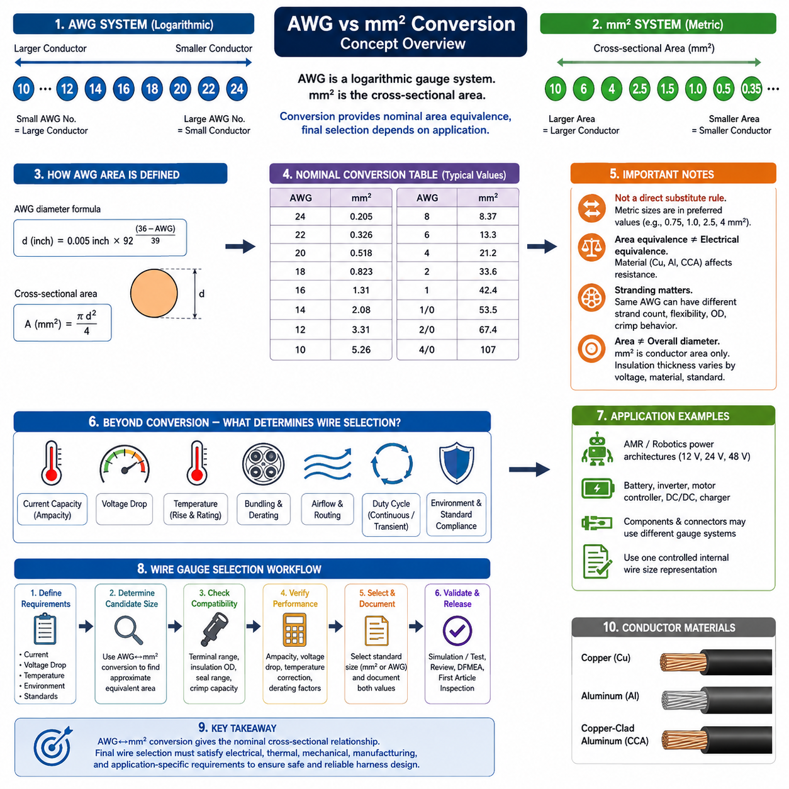
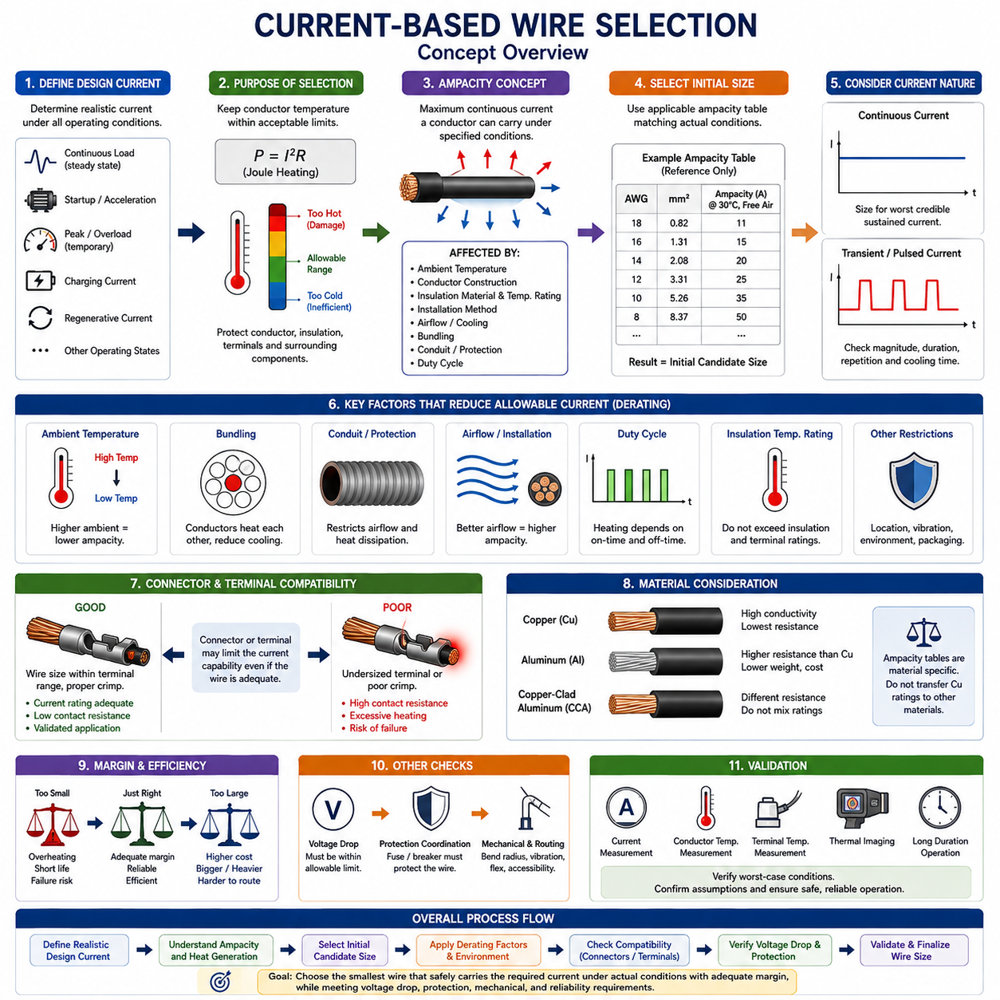
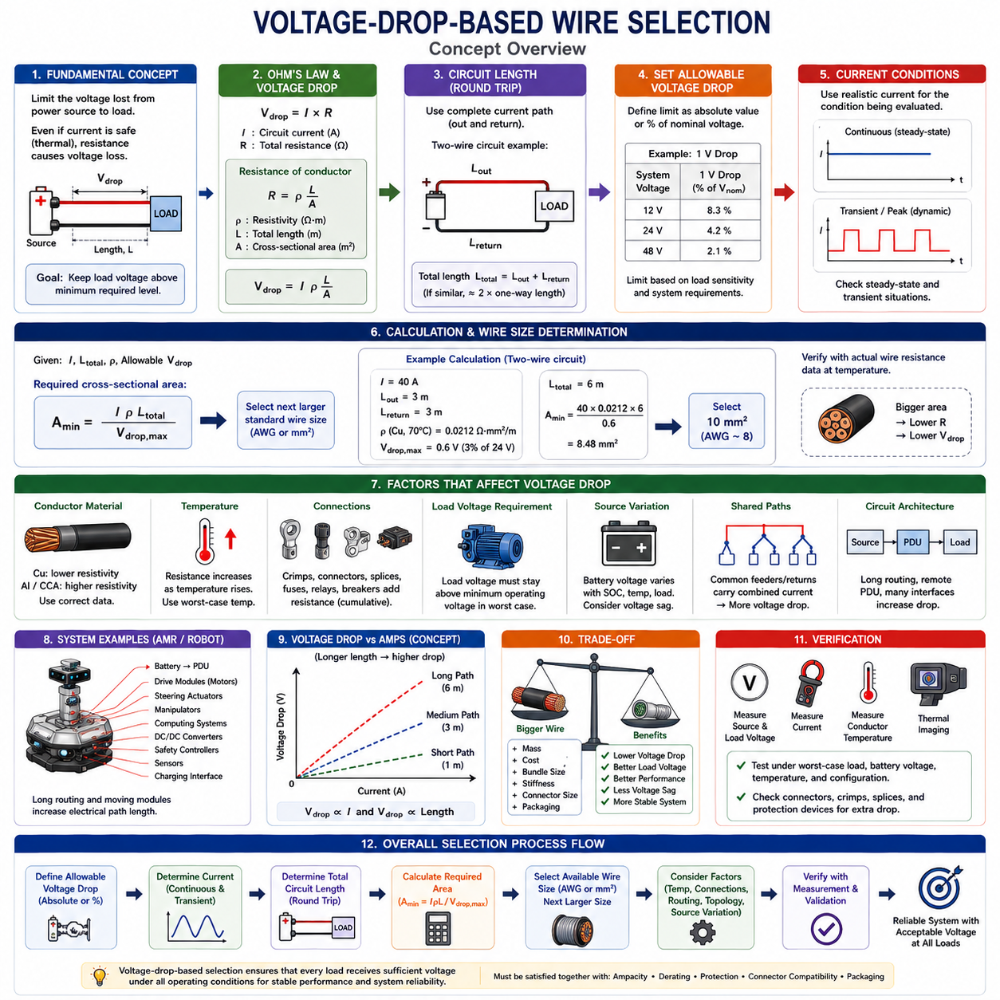
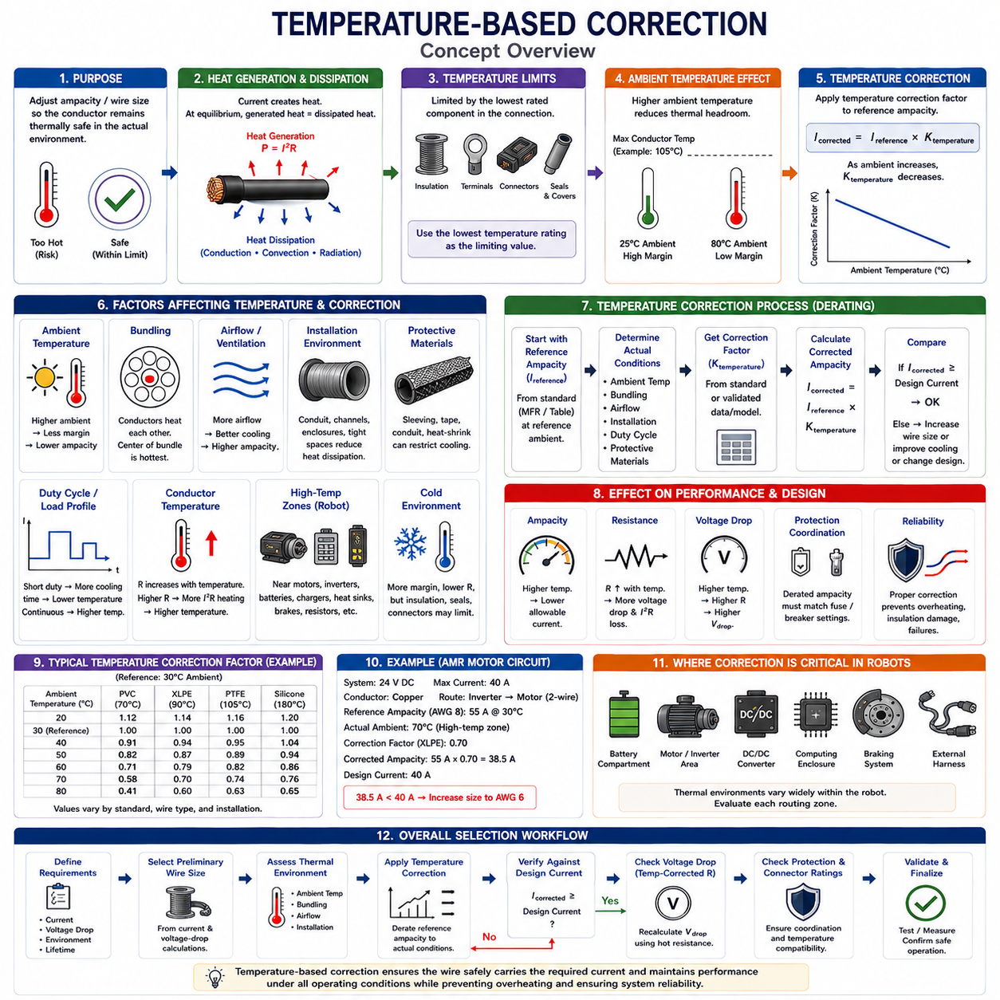
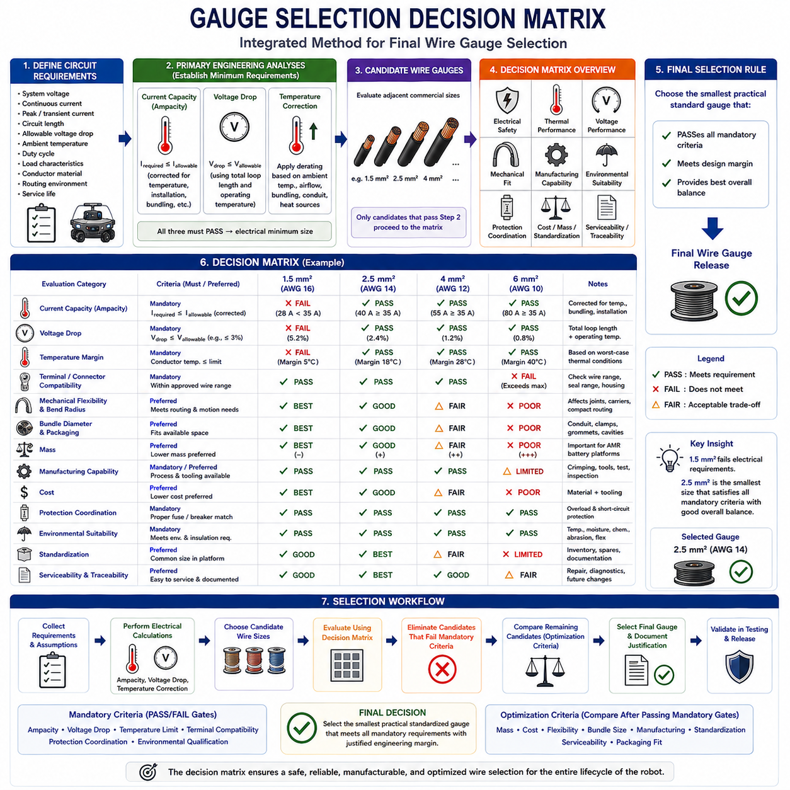

**Volume 02. Wire Harness Engineering**

# Chapter 04. Wire Gauge Selection

## 04.01. AWG vs mm² Conversion

{width="7.268055555555556in" height="7.268055555555556in"}

미국 전선 규격(American Wire Gauge, AWG)과 제곱밀리미터(square millimeters, mm²)는 도체 크기(conductor size)를 나타내는 서로 다른 체계이다. AWG는 북미에서 전통적으로 사용되어 온 로그형 게이지 체계(logarithmic gauge system)이며, mm²는 도체의 단면적(conductor cross-sectional area)을 직접 나타낸다. 와이어 하니스 엔지니어링(wire harness engineering)에서는 부품 데이터시트, 커넥터, 전선 및 설계 표준에서 서로 다른 체계를 사용할 수 있으므로 두 단위 간 변환이 중요하다.

AWG 번호 체계(AWG numbering system)는 도체 크기와 반대 방향으로 변화한다. AWG 번호가 작을수록 도체가 크고, 번호가 클수록 도체가 작다. 예를 들어 10 AWG는 20 AWG보다 상당히 큰 도체이다. 이러한 규칙은 단면적이 증가할수록 도체 크기가 직접 증가하는 미터법 전선 규격(metric wire specification)과 동시에 작업할 경우 처음에는 직관적이지 않게 느껴질 수 있다.

AWG 치수(AWG dimensions)는 선형적인 순서가 아니라 로그형 진행(logarithmic progression)을 따른다. 표준 관계에서는 36 AWG의 공칭 직경(nominal diameter)이 약 0.127 mm이고, 0000 AWG의 직경은 약 11.684 mm이다. 따라서 AWG 번호로부터 도체 직경을 계산할 수 있으며, 계산된 직경을 이용하여 공칭 원형 단면적(nominal circular cross-sectional area)을 구할 수 있다.

원형 단선 도체(solid round conductor)의 단면적은 A = πd²/4로 계산하며, 여기서 A는 면적(area), d는 도체 직경(conductor diameter)을 의미한다. 이 기하학적 관계와 AWG 직경 공식(AWG diameter equation)을 결합하면 AWG를 mm²로 수학적으로 변환할 수 있다. 그러나 실제 엔지니어링에서는 계산 작업을 줄이고 상용 미터법 도체 크기와 빠르게 비교하기 위해 표준 변환표(standardized conversion table)를 주로 사용한다.

일반적인 공칭 변환 관계(nominal conversion relationship)를 살펴보면 크기 변화가 명확하게 나타난다. 24 AWG는 약 0.205 mm², 22 AWG는 약 0.326 mm², 20 AWG는 약 0.518 mm², 18 AWG는 약 0.823 mm², 16 AWG는 약 1.31 mm², 14 AWG는 약 2.08 mm², 12 AWG는 약 3.31 mm², 10 AWG는 약 5.26 mm²이다. 이 값들은 절연체 치수가 아니라 공칭 도체 단면적(nominal conductor area)을 의미한다.

대형 전력 도체(power conductor)에서도 동일한 관계가 계속 적용된다. 8 AWG는 약 8.37 mm², 6 AWG는 13.3 mm², 4 AWG는 21.2 mm², 2 AWG는 33.6 mm², 1 AWG는 42.4 mm², 1/0 AWG는 53.5 mm², 2/0 AWG는 67.4 mm², 4/0 AWG는 약 107 mm²에 해당한다. 이러한 크기는 배터리, 인버터, 충전 및 대전류 전력 분배 회로(high-current distribution circuit)에 중요하게 적용된다.

AWG와 mm² 간 변환(AWG-to-mm² conversion)을 상용 전선의 직접적인 대체 규칙으로 해석해서는 안 된다. 미터법 도체(metric conductor)는 일반적으로 0.35, 0.5, 0.75, 1.0, 1.5, 2.5, 4, 6, 10, 16, 25, 35, 50, 70, 95 mm²와 같은 우선 규격(preferred size)으로 제조된다. 따라서 계산된 AWG 등가값(equivalent value)이 실제 사용 가능한 미터법 규격 사이에 위치하는 경우가 많아 단순한 수치 변환이 아니라 엔지니어링 판단(engineering decision)이 필요하다.

예를 들어 18 AWG의 공칭 단면적은 약 0.823 mm²이지만, 미터법 하니스(metric harness)에서는 정확히 0.823 mm²인 제품 대신 0.75 mm² 또는 1.0 mm² 도체를 제공할 수 있다. 마찬가지로 약 3.31 mm²인 12 AWG는 일반적인 2.5 mm² 또는 4 mm²와 정확하게 대응하지 않는다. 따라서 작은 후보 규격이 요구조건을 충족하는지 또는 다음 단계의 큰 표준 도체가 필요한지를 판단해야 한다.

단면적 등가성(cross-sectional equivalence)만으로 동일한 전기적 성능(electrical performance)이 보장되는 것은 아니다. 구리(copper), 알루미늄(aluminum), 동피복 알루미늄(copper-clad aluminum)은 서로 다른 비저항(resistivity)을 가지므로 도체 재질(conductor material)은 저항에 큰 영향을 준다. 따라서 단면적이 유사한 두 전선도 전압 강하(voltage drop), 손실(loss), 온도 상승(temperature rise)이 서로 다를 수 있으며, 치수 등가성과 실제 전기적 등가성은 구분해야 한다.

연선 도체(stranded conductor)는 추가적인 주의가 필요하다. AWG는 일반적으로 전체 금속 단면적(combined metallic cross-sectional area)에 의해 표현되는 유효 도체 크기를 나타내지만, 개별 소선 직경(strand diameter)과 소선 수(strand count)는 유연성과 구조를 결정한다. 동일한 공칭 게이지를 가진 로봇용 미세 연선 케이블과 일반 자동차용 전선도 유연성, 외경, 단자 체결 특성, 피로 저항 및 호환 가능한 압착 형상(crimp geometry)이 크게 다를 수 있다.

도체 단면적(conductor cross-sectional area)은 전선 전체 외경(overall wire diameter)과도 구분해야 한다. 예를 들어 2.5 mm²라는 규격은 절연 전선의 외경이 아니라 금속 도체의 단면적을 의미한다. 절연체 두께(insulation thickness)는 정격 전압, 재질, 온도 등급, 내마모 요구조건, 환경 보호 및 적용 표준에 따라 달라진다. 따라서 하니스 패키징 계산(harness packaging calculation)에는 전선 제조업체가 제공하는 실제 완성 전선 치수(finished-wire dimensions)를 사용해야 한다.

mm²에서 AWG로의 역변환(reverse conversion)은 미터법 기반 설계가 AWG로 규정된 커넥터, 단자 또는 장비와 인터페이스할 때 유용하다. AWG 값은 불연속적인 규격(discrete gauge)이므로 계산된 등가값은 일반적으로 기준점(reference point)으로 사용해야 한다. 이후 전기적 요구조건을 충족하면서 관련 단자, 실(seal), 스플라이스(splice), 압착 공정(crimping process)의 허용 도체 크기 범위 내에 있는 실제 게이지를 선택해야 한다.

단자 호환성(terminal compatibility)은 변환 과정에서 특히 중요하다. 커넥터 접점(connector contact)이 16\~20 AWG와 같은 특정 범위로 인증되어 있고, 미터법 전선 공급업체는 도체를 mm²로 규정할 수 있다. 선택된 미터법 도체는 단순한 AWG 단면적 등가성뿐만 아니라 도체 직경, 절연 외경, 소선 구조, 실 적용 범위(seal range), 압착 배럴 용량(crimp barrel capacity), 단자 제조업체의 검증된 적용 사양(application specification)을 모두 충족해야 한다.

허용 전류(current capacity)는 AWG/mm² 변환표만으로 결정해서는 안 된다. 허용 전류(ampacity)는 도체 저항, 절연체 온도 등급, 주변 온도, 번들링(bundling), 공기 흐름, 배선 경로, 듀티 사이클(duty cycle), 허용 온도 상승에 따라 달라진다. 전선 크기 변환은 도체의 기하학적 크기를 설정하는 과정이며, 전류 기반 선정(current-based selection)은 전체 전선 게이지 선정 과정(wire gauge selection process)에서 별도로 수행해야 하는 엔지니어링 단계이다.

공칭 등가 규격을 선택한 이후에는 전압 강하 검증(voltage-drop verification)도 수행해야 한다. 저항은 도체 비저항과 회로 길이에 비례하고 단면적에 반비례한다. 따라서 길이가 긴 저전압 전력 회로(low-voltage power circuit)는 열적 허용 전류만으로 결정되는 크기보다 훨씬 큰 도체가 필요할 수 있다. 특히 작은 전압 손실도 부하 성능에 영향을 줄 수 있는 12 V, 24 V, 48 V 로봇 전력 아키텍처(robotic power architecture)에서는 이러한 검증이 중요하다.

자율이동로봇(Autonomous Mobile Robot, AMR)과 로봇 하니스(robotic harness)에서는 북미 규격 부품과 국제전기기술위원회(International Electrotechnical Commission, IEC) 기반 또는 자동차용 미터법 배선을 통합할 때 변환이 자주 필요하다. 모터 컨트롤러, DC/DC 컨버터, 배터리 시스템, 회로 차단기, 커넥터 및 외부 도입 서브시스템은 서로 다른 게이지 표기법을 사용할 수 있다. 따라서 하나의 관리된 내부 전선 크기 표현 체계를 설정하면 설계와 제조 과정의 불일치를 방지할 수 있다.

실용적인 엔지니어링 데이터베이스(engineering database)에서는 반복적으로 비공식 변환을 수행하기보다 지정된 도체 크기와 공칭 등가값(nominal equivalent)을 함께 기록하는 것이 바람직하다. 예를 들어 도체를 2.5 mm²로 지정하면서 대략적인 AWG 참조값을 함께 기록하되, 실제 관리 규격(controlling specification)은 2.5 mm²로 유지할 수 있다. 이를 통해 설계 데이터가 제조 및 서비스 단계로 전달되는 과정에서 근사 변환값이 의도하지 않은 대체 규격으로 변하는 것을 방지할 수 있다.

따라서 가장 안전한 변환 원칙(conversion philosophy)은 AWG와 mm²를 완전히 상호 교환 가능한 표준으로 간주하기보다 서로 연관된 도체 크기 표현 방식으로 이해하는 것이다. 수학적 변환은 공칭 단면적 관계를 제공하지만, 최종 전선 선정(final wire selection)은 실제 적용 요구조건으로 다시 돌아가 검토해야 한다. 허용 전류, 전압 강하, 온도, 도체 재질, 유연성, 단자 호환성, 절연 구조, 환경 조건 및 표준 적합성을 종합적으로 고려해야 실제로 등가한 전선을 결정할 수 있다.

와이어 하니스 엔지니어링 작업 흐름(wire harness engineering workflow)에서 AWG와 mm² 변환은 최종 선정 기준이라기보다 이후 전선 게이지 선정(gauge selection)을 위한 치수적 기반(dimensional foundation)으로 기능한다. 대략적인 등가 도체 단면적을 설정한 후에는 전류 용량, 전압 강하 성능, 온도 보정(temperature correction), 적용 환경별 제약조건을 검증한 뒤 설계를 확정해야 한다. 이러한 순서를 통해 전기적 계산과 실제 하니스 구현(physical harness implementation) 사이의 일관성을 유지할 수 있다.

## 04.02. Current Based Selection

{width="7.268055555555556in" height="7.268055555555556in"}

전류 기반 전선 선정(Current-based wire selection)은 도체(conductor)가 실제 운전 조건에서 전달해야 하는 전류를 결정하는 것에서 시작한다. 설계 전류(design current)는 단순히 장치 명판에 표시된 공칭 전류(nominal current)를 의미하지 않는다. 연속 부하, 일시적 과부하, 기동 전류, 모터 가속, 액추에이터 피크 전류, 충전 전류, 회생 전류 등 도체 발열을 발생시킬 수 있는 다양한 운전 상태를 반영해야 한다.

전류 기반 선정의 기본 목적은 도체 온도(conductor temperature)를 허용 가능한 범위 내로 유지하는 것이다. 도체 저항을 통해 전류가 흐르면 P = I²R 관계에 따라 줄 발열(Joule heating)이 발생한다. 발열량은 전류의 제곱에 비례하므로 전류가 비교적 조금 증가해도 열적 스트레스(thermal stress)는 크게 증가할 수 있다. 따라서 선정된 도체는 도체, 절연체, 단자 또는 주변 부품의 온도 한계를 초과하지 않으면서 발생한 열을 방출할 수 있어야 한다.

허용 전류(Ampacity)는 규정된 조건에서 허용 온도 범위를 유지하면서 도체가 연속적으로 전달할 수 있는 최대 전류이다. 이는 AWG 또는 도체 단면적만으로 결정되는 절대적인 특성이 아니다. 동일한 전선이라도 주변 온도, 절연 재질, 설치 방식, 공기 흐름, 번들링(bundling), 전선관 사용, 듀티 사이클(duty cycle), 연결 단자의 온도 정격 등에 따라 허용 가능한 전류가 크게 달라질 수 있다.

첫 번째 실질적인 단계는 각 회로의 연속 전류(continuous current)를 설정하는 것이다. 연속 부하에는 컨트롤러, 컴퓨터, 센서, 통신 장치, 조명, 펌프, 팬 등 장시간 통전될 수 있는 장비가 포함된다. 이러한 회로의 도체 크기는 단기간의 평균 소비전류가 아니라 지속적으로 발생할 가능성이 있는 최악 조건의 운전 전류를 기준으로 결정해야 한다. 장시간 운전하면 지속적인 전기적 손실에 의해 최종적인 열평형(thermal equilibrium)이 결정되기 때문이다.

과도 전류(transient current)는 많은 로봇 부하가 매우 동적이기 때문에 별도로 고려해야 한다. 모터는 가속, 스톨(stall), 급격한 방향 전환 또는 고토크 운전 과정에서 정상 운전 전류의 몇 배에 해당하는 전류를 소비할 수 있다. 솔레노이드, 컨택터, 용량성 전자 부하, DC/DC 컨버터 및 인버터도 단시간의 피크 전류를 발생시킬 수 있다. 이러한 전류의 지속 시간이 짧아 도체 온도를 허용 한계 이상으로 상승시키지 않는다면 허용될 수 있다.

따라서 전류 크기와 지속 시간의 관계가 중요하다. 도체는 열용량(thermal mass)을 가지므로 최종 온도에 순간적으로 도달하지 않는다. 짧은 펄스 전류는 전선을 손상시키지 않으면서 연속 허용 전류를 초과할 수도 있지만, 반복적인 펄스는 열을 누적시켜 연속 부하와 유사한 상태를 만들 수 있다. 따라서 전류 기반 선정에서는 부하 프로파일(load profile), 펄스 지속 시간, 반복 주기, 열 시정수(thermal time constant), 고전류 운전 사이의 냉각 시간을 고려해야 한다.

모터 및 액추에이터 회로에서는 정상 운전 전류(normal running current), 예상 운전 피크 전류(expected operating peak current), 스톨 전류(stall current), 고장 전류(fault current)를 구분해야 한다. 정상 전류와 반복적인 피크 전류는 도체 크기 선정에 영향을 주지만, 고장 전류는 주로 회로 보호(circuit protection)와 단락 내량 검증(short-circuit withstand verification)을 통해 처리한다. 모터 스톨 전류를 연속 전류처럼 직접 적용하면 하니스 질량, 비용, 커넥터 크기 및 배선 난이도가 불필요하게 증가할 수 있다.

설계 전류가 설정되면 적용 가능한 허용 전류표(ampacity table)를 이용하여 예비 도체 크기를 결정할 수 있다. 사용되는 표는 실제 전선 구조와 적용 환경에 가능한 한 근접해야 한다. 일반적인 표에서 선정한 AWG 또는 mm² 값은 초기 후보(initial candidate)로 간주해야 한다. 실제 하니스 조건은 공개된 전류 정격이 설정된 기준 조건과 상당히 다를 수 있기 때문이다.

주변 온도(ambient temperature)는 가장 중요한 보정 요소 중 하나이다. 냉각된 전자장치 인클로저 내부에서 동작하는 전선은 모터, 인버터, 배터리, 브레이크 또는 다른 열원 주변에 배치된 동일한 전선보다 더 큰 열적 여유(thermal margin)를 가진다. 주변 온도가 절연체의 온도 정격에 가까워질수록 허용 가능한 온도 상승 여유가 감소한다. 따라서 고온 영역에서는 일반적으로 디레이팅(derating), 배선 경로 개선, 고온용 절연체 또는 더 큰 도체가 필요하다.

번들링(bundling)은 인접한 도체가 서로 가열하고 주변 환경으로의 열전달을 제한하기 때문에 허용 전류를 감소시킨다. 자유 공기 중에 배치된 단일 전선은 조밀하게 묶인 하니스 번들 내부의 동일한 전선보다 열을 효과적으로 방출할 수 있다. 여러 고전류 회로가 동일한 번들을 공유하는 경우에는 동시에 부하가 인가되는 조건을 고려해야 한다. 개별적으로 적합한 도체도 열적 상호작용(thermal interaction)에 의해 실제 설치 후에는 부적합해질 수 있기 때문이다.

전선관(conduit), 편조 슬리브(braided sleeve), 테이프, 보호 튜브 및 밀폐형 케이블 채널도 열적 특성을 변화시킬 수 있다. 이러한 보호 요소는 내마모성, 환경 보호, 기계적 정리 및 정비성을 위해 필요한 경우가 많지만 대류와 열 방출을 제한할 수 있다. 따라서 전류 기반 전선 선정에서는 전기적으로 분리된 단일 도체만 평가하는 것이 아니라 최종적인 물리적 하니스 구성(physical harness configuration)을 반영해야 한다.

절연체 온도 정격(insulation temperature rating)은 또 하나의 중요한 한계를 설정한다. PVC, 가교 폴리에틸렌(XLPE), 폴리테트라플루오로에틸렌(PTFE) 등의 절연 시스템은 서로 다른 운전 온도를 지원하지만 높은 절연 온도 정격이 무제한적인 전류 허용을 의미하지는 않는다. 도체 온도의 증가는 단자 인터페이스, 실(seal), 커넥터 하우징, 인접 전선, 기계적 노화 및 시스템 신뢰성에도 영향을 주므로 전체 연결 시스템(interconnection system)이 검증된 열적 한계 내에서 동작해야 한다.

커넥터와 단자의 정격(connector and terminal ratings)은 도체 자체의 허용 전류가 충분하더라도 시스템의 제한 요소가 될 수 있다. 큰 도체를 작은 용량의 단자에 연결한다고 해서 고전류 연결부가 만들어지는 것은 아니다. 압착부(crimp)와 결합 접점(mating interface)의 접촉 저항은 추가적인 국부 발열을 발생시킨다. 따라서 선정된 전선 게이지는 단자의 전류 용량, 도체 적용 범위, 압착 형상, 커넥터 온도 정격 및 검증된 적용 사양과 호환되어야 한다.

구리 도체(copper conductor)는 높은 전도성과 확립된 단자 체결 기술 때문에 일반적으로 사용되지만, 전류표를 적용할 때는 항상 도체 재질(conductor material)을 확인해야 한다. 알루미늄(aluminum) 또는 동피복 알루미늄(copper-clad aluminum) 도체는 동일한 단면적에서도 서로 다른 전기 저항과 열적 특성을 가진다. 따라서 공칭 AWG 또는 mm²가 유사하다는 이유만으로 구리 도체의 전류 정격을 다른 재질의 도체에 그대로 적용해서는 안 된다.

설계 여유(design margin)는 실제 전류의 불확실성, 제조 편차, 주변 환경, 노화 및 향후 시스템 변경 가능성을 고려해야 한다. 그러나 임의적인 과대 설계(oversizing)가 항상 바람직한 것은 아니다. 큰 전선은 질량, 비용, 최소 굽힘 반경, 번들 직경, 커넥터 요구조건, 조립 작업 및 패키징 공간을 증가시킨다. 적절한 전류 기반 선정은 단순히 가장 큰 도체를 선택하는 것이 아니라 효율적인 하니스를 유지하면서 충분한 열적 여유를 확보하는 것을 목표로 한다.

자율이동로봇(Autonomous Mobile Robot, AMR)과 로봇 시스템에서는 구동 모터, 조향 액추에이터, 매니퓰레이터, 배터리 전력 분배, DC/DC 컨버터, 컴퓨팅 시스템, 충전 회로, 펌프 및 보조 전력망에서 전류 기반 크기 선정이 특히 중요하다. 동적인 임무 프로파일(dynamic mission profile)은 평균 전류와 피크 전류 사이에 큰 차이를 만들 수 있으므로 실제 측정 또는 시뮬레이션된 전류 프로파일이 부품 명판의 정격값보다 현실적인 설계 기준을 제공하는 경우가 많다.

전류 기반 선정에서는 동시 운전(simultaneous operation)도 고려해야 한다. 각각의 개별 부하는 적합해 보이더라도 공통 피더(shared feeder)는 여러 하위 분기 회로의 합산 전류를 전달할 수 있다. 따라서 엔지니어는 현실적으로 발생 가능한 최대 동시 운전 조건(maximum credible concurrency)을 파악하고 이에 따라 피더 전류를 계산해야 한다. 이는 특히 배터리-PDU 연결, 공통 리턴 경로, 전력 분배 분기 및 여러 액추에이터나 컴퓨팅 장치를 공급하는 회로에서 중요하다.

전류 요구조건을 기반으로 후보 도체를 선정한 이후에도 설계는 전압 강하(voltage drop)에 대해 검증되어야 한다. 전선은 열적으로 안전하면서도 과도한 저항성 전압 손실을 발생시킬 수 있으며, 특히 긴 12 V, 24 V 또는 48 V 회로에서 이러한 문제가 중요하다. 이런 경우에는 전압 강하 요구조건으로 인해 허용 전류만으로 결정된 크기보다 더 큰 도체를 선택해야 할 수 있다. 따라서 전류 기반 선정은 다중 기준 전선 게이지 선정 과정(multi-criteria gauge-selection process)의 하나의 제약조건이다.

이후 실제 설치 환경을 기준으로 온도 보정(temperature correction)과 디레이팅(derating)을 적용해야 한다. 높은 주변 온도, 조밀한 번들링, 제한된 공기 흐름, 전선관 배선, 동시 부하 및 기타 열적 제한 요소는 사용 가능한 전류 용량을 감소시킨다. 보정된 허용 전류(corrected ampacity)는 적절한 엔지니어링 여유를 포함하여 요구 설계 전류보다 높아야 한다. 이를 만족하지 못하면 도체 크기, 배선 경로, 패키징 또는 운전 전략을 변경해야 한다.

최종 검증(final validation)은 가능한 경우 실제 최악 조건을 대표할 수 있는 환경에서 수행해야 한다. 전류 측정, 도체 온도 측정, 단자 온도 측정, 열화상 측정(thermal imaging), 전압 강하 시험 및 장시간 운전 시험을 통해 조립된 시스템에서 해석적 가정이 유효한지를 확인할 수 있다. 특히 커넥터, 스플라이스(splice), 굽힘부, 밀폐된 번들 등 도체 저항만으로 예측한 값보다 국부적인 발열이 커질 수 있는 위치에 주의를 기울여야 한다.

따라서 전류 기반 전선 선정(Current-based wire selection)은 단순히 전류와 AWG 또는 mm²의 대응표를 조회하는 과정이 아니라 열-전기 설계 과정(thermal-electrical design process)이다. 엔지니어는 현실적인 연속 전류와 과도 전류를 설정하고, 초기 도체를 선정한 후 환경 및 설치 조건에 따른 보정을 적용하며, 커넥터 호환성과 열적 성능을 검증해야 한다. 이후 전압 강하, 보호 협조(protection coordination), 패키징, 기계적 내구성 및 최종 검증을 종합하여 최종 전선 게이지를 결정한다.

## 04.03. Voltage Drop Based Selection

{width="7.268055555555556in" height="7.268055555555556in"}

전압 강하 기반 전선 선정(Voltage-drop-based wire selection)은 전원과 전기 부하 사이에서 손실되는 전압을 제한하는 방식으로 도체 크기를 결정하는 과정이다. 전선이 열적 관점에서 필요한 전류를 안전하게 전달할 수 있더라도 전선의 저항으로 인해 부하에 실제 공급되는 전압이 감소할 수 있다. 이는 작은 절대 전압 손실도 공급 전압의 상당한 비율이 될 수 있는 저전압 로봇 시스템(low-voltage robotic systems)에서 특히 중요하다.

전압 강하(voltage drop)는 기본적으로 옴의 법칙(Ohm's law)인 Vdrop = I × R로 표현되며, 여기서 I는 회로 전류(circuit current), R은 전체 전류 경로의 저항(total resistance)을 의미한다. 도체 저항은 길이가 증가할수록 커지고 단면적이 증가할수록 작아지므로 긴 회로와 고전류 부하에는 일반적으로 더 큰 도체가 필요하다. 따라서 전선 게이지 선정에서는 전류 전달 능력뿐만 아니라 전기적 거리(electrical distance)도 고려해야 한다.

균일한 도체의 저항은 R = ρL/A로 추정할 수 있으며, 여기서 ρ는 도체 비저항(conductor resistivity), L은 도체 길이(conductor length), A는 도체 단면적(conductor cross-sectional area)을 의미한다. 이 관계를 옴의 법칙과 결합하면 Vdrop = IρL/A가 된다. 이 식은 도체 단면적을 증가시키면 전압 강하가 감소하고, 전류, 비저항 또는 회로 길이가 증가하면 도체에서 손실되는 전압이 증가한다는 것을 직접 보여준다.

회로 길이(circuit length)는 단순히 전원에서 부하까지의 물리적 거리만이 아니라 전체 전류 경로를 나타내야 한다. 일반적인 2선식 회로(two-wire circuit)에서 전류는 양극 도체를 통해 부하로 이동한 후 음극 도체를 통해 되돌아온다. 두 도체의 길이와 크기가 유사하다면 유효 저항은 대략 편도 거리의 두 배를 기준으로 계산된다. 리턴 경로(return path)를 무시하면 실제 전압 강하를 상당히 과소평가할 수 있다.

첫 번째 설계 단계는 최대 허용 전압 강하(maximum allowable voltage drop)를 정의하는 것이다. 이 한계는 0.5 V와 같은 절대 전압 또는 공칭 시스템 전압 대비 백분율로 지정할 수 있다. 백분율 기반 한계는 동일한 절대 전압 손실이 12 V, 24 V, 48 V 시스템에서 서로 다른 영향을 미치기 때문에 다양한 전원 아키텍처를 비교할 때 유용하다. 허용 한계는 연결된 부하의 민감도와 운전 요구조건을 반영해야 한다.

예를 들어 1 V의 전압 강하는 12 V 시스템에서는 약 8.3%, 24 V 시스템에서는 약 4.2%, 48 V 시스템에서는 약 2.1%에 해당한다. 이는 낮은 전압의 아키텍처일수록 도체 저항이 특히 중요하다는 것을 보여준다. 배전 전압(distribution voltage)을 높이면 동일한 전달 전력에서 전류를 감소시킬 수 있으므로 I²R 손실과 전압 강하를 모두 줄일 수 있지만, 부하 전압 요구조건과 전력 변환 아키텍처(power conversion architecture)도 함께 고려해야 한다.

부하 전압(load voltage)은 최악 조건에서도 장치가 요구하는 최소 동작 전압(minimum operating voltage)보다 높게 유지되어야 한다. 공급 전압이 동작 범위 아래로 떨어지면 모터의 사용 가능한 토크 또는 속도가 감소하고, 전자 컨트롤러가 리셋되며, 센서가 불안정해지거나 통신 장비가 오동작할 수 있다. 따라서 전압 강하 한계는 일반적인 백분율 지침만으로 결정하기보다 시스템 수준의 기능 요구조건(system-level functional requirements)에서 도출해야 한다.

계산에 사용하는 전류는 평가하려는 운전 조건과 일치해야 한다. 연속 전류(continuous current)는 지속적인 전압 손실을 결정하지만 기동, 가속, 조향, 리프팅 및 기타 피크 부하는 일시적인 전압 강하 또는 전압 처짐(voltage sag)을 발생시킬 수 있다. 로봇 시스템에서 평균 전류만 평가하면 중요한 운전 조건을 놓칠 수 있으므로 부하 동특성이 중요한 경우 정상 상태 전압 강하와 과도 상태 전압 거동(transient voltage behavior)을 모두 검토해야 한다.

모터 회로(motor circuit)는 모터 전류가 기계적 부하와 운전 상태에 따라 변화하기 때문에 특별한 주의가 필요하다. 가속 또는 고토크 운전에서는 전류 증가에 비례하여 하니스의 전압 강하도 커진다. 이에 따라 모터 단자 전압(motor terminal voltage)이 감소하면 토크와 가속 성능에 영향을 줄 수 있다. 심한 경우 경부하에서는 정상적으로 동작하지만 높은 부하가 요구되는 기동이나 주행 조건에서는 성능이 크게 저하되는 시스템이 될 수 있다.

배터리 구동 시스템(battery-powered system)은 충전 상태(state of charge), 온도, 부하 전류 및 배터리 내부 저항(battery internal resistance)에 따라 전원 전압 자체가 변화한다. 따라서 하니스의 전압 강하는 배터리 전압 처짐(battery voltage sag)과 함께 고려해야 한다. 공칭 배터리 전압에서는 문제가 없어 보이는 회로도 배터리가 최소 동작 전압에 가까워지고 동시에 고전류 이벤트가 발생하면 설계 한계에 접근할 수 있다.

도체 재질(conductor material)은 비저항을 통해 전압 강하 성능에 직접적인 영향을 준다. 구리(copper)는 상대적으로 낮은 전기 저항 때문에 일반적으로 사용되지만, 알루미늄(aluminum)과 동피복 알루미늄(copper-clad aluminum)은 서로 다른 단면적 설계가 필요하다. 공칭 AWG 또는 mm² 크기가 동일하다는 이유만으로 서로 다른 재질의 도체를 전기적으로 동등하다고 판단해서는 안 되며, 가능한 경우 실제 도체 구조에 해당하는 저항 데이터를 사용해야 한다.

온도 역시 도체 저항을 변화시킨다. 구리 저항은 도체 온도가 상승할수록 증가하므로 실온 저항만을 이용한 전압 강하 계산은 고온 운전 조건의 손실을 과소평가할 수 있다. 모터, 배터리, 전력 전자장치(power electronics) 또는 기타 열원 근처에서 동작하는 회로는 모든 환경에서 일정한 저항을 가정하기보다 대표적인 최악 조건의 도체 온도에서 저항을 평가해야 한다.

연결부(connection)는 전선 자체의 저항 이외에 추가적인 저항을 발생시킨다. 압착 단자(crimp terminal), 커넥터, 스플라이스(splice), 퓨즈 접점, 릴레이, 컨택터, 회로 차단기, 버스바(busbar), 전력 분배 인터페이스는 각각 전체 회로 저항에 일부 기여한다. 개별 전압 강하는 작더라도 여러 인터페이스가 누적되면 의미 있는 손실이 발생할 수 있으므로 현실적인 전압 예산(voltage budget)에서는 도체 전압 강하와 전체 배전 경로의 종단 간 전압 강하(end-to-end distribution voltage drop)를 구분해야 한다.

예비 도체 크기는 전압 강하 관계식을 변형하여 계산할 수 있다. 단순한 도체 경로에서는 필요한 단면적이 IρL/Vdrop,max에 비례한다. 2선식 회로에서는 나가는 경로와 돌아오는 경로의 전체 길이를 포함해야 한다. 계산 결과로 얻어진 단면적은 일반적으로 비표준 도체 면적을 그대로 지정하기보다 실제 구매 가능한 다음 단계의 적절한 AWG 또는 mm² 규격으로 변환하여 적용한다.

계산된 최소 크기를 가장 가까운 작은 상용 전선 규격으로 자동 반올림해서는 안 된다. 예를 들어 계산된 요구조건이 1.5 mm²와 2.5 mm² 사이에 있다면 수치상 1.5 mm²에 더 가깝더라도 이를 선택하면 전압 강하 목표를 위반할 수 있다. 따라서 설계를 승인하기 전에 후보 도체의 실제 저항 사양(actual resistance specification), 제조 공차, 온도 조건 및 전체 회로 길이를 사용하여 다시 검증해야 한다.

공유 피더(shared feeder)와 공통 리턴 도체(common return conductor)는 특별한 주의가 필요하다. 여러 부하에 전력을 공급하는 피더에는 각 부하의 합산 전류가 흐르며, 공통 리턴 경로에서는 여러 장치에 동시에 영향을 주는 전압 변화가 발생할 수 있다. 고전류 모터 부하가 민감한 센서 또는 컨트롤러와 리턴 경로를 공유하면 바람직하지 않은 전원 변동이 발생할 수 있으므로 배전 토폴로지(distribution topology)와 접지 아키텍처(grounding architecture)도 전압 강하 기반 도체 선정에 영향을 준다.

자율이동로봇(Autonomous Mobile Robot, AMR)에서는 배터리-PDU 피더, 구동 모듈, 조향 액추에이터, 매니퓰레이터, 컴퓨팅 시스템, DC/DC 컨버터, 안전 컨트롤러, 센서 및 충전 인터페이스에서 전압 강하 분석이 특히 중요하다. 물리적으로 작은 로봇이라도 섀시 내부의 긴 배선 경로로 인해 실제 전기적 경로가 상당히 길어질 수 있으며, 이동 모듈과 서비스 루프(service loop)는 부품 간 단순 직선거리보다 도체 길이를 더욱 증가시킬 수 있다.

전압 강하 기반 크기 선정은 전류 기반 크기 선정(current-based sizing)과 별개의 대안으로 취급하기보다 서로 연계하여 수행해야 한다. 도체는 열적 허용 전류와 전압 강하 요구조건을 모두 만족해야 한다. 짧은 고전류 회로에서는 허용 전류가 지배적인 조건이 될 수 있지만, 긴 중전류 회로에서는 전압 강하가 지배적인 조건이 될 수 있다. 최종 도체 크기는 일반적으로 두 요구조건 가운데 더 큰 최소 단면적을 요구하는 조건에 의해 결정된다.

도체 크기를 증가시키면 전압 강하 성능은 향상되지만 질량, 비용, 번들 직경, 유연성, 굽힘 반경, 커넥터 크기 및 패키징 공간 측면에서 불리해진다. 이러한 트레이드오프(tradeoff)는 하니스 질량과 배선 복잡성이 기계 설계에도 영향을 주는 이동 로봇에서 특히 중요하다. 따라서 모든 전압 강하 문제를 단순히 전선 크기 증가로 해결하기 전에 배전 전압, 회로 길이, 커넥터 위치, PDU 위치 및 부하 아키텍처를 최적화해야 한다.

최종 검증(final verification)에서는 대표적인 최악 운전 조건에서 전체 전기 경로를 평가해야 한다. 실제 부하 전류, 배터리 전압, 도체 온도, 커넥터 구성 및 운전 상태를 반영하여 측정해야 한다. 전원 단자와 부하 단자에서 직접 전압을 측정하면 계산된 배전 손실(distribution loss)을 효과적으로 검증할 수 있으며, 압착부, 커넥터, 스플라이스 또는 보호 장치에서 발생하는 예상하지 못한 추가 저항도 확인할 수 있다.

따라서 전압 강하 기반 전선 선정(Voltage-drop-based wire selection)은 시스템 수준의 전기 설계 과정(system-level electrical design process)이다. 엔지니어는 허용 가능한 부하 전압 손실을 설정하고, 현실적인 전류와 전체 회로 길이를 결정하며, 도체 저항을 계산하고, 온도와 연결부의 영향을 포함하여 사용 가능한 AWG 또는 mm² 규격을 선정한 후 성능을 검증해야 한다. 이후 허용 전류, 디레이팅(derating), 회로 보호, 커넥터 호환성, 패키징 및 최종 검증 조건과 종합하여 양산에 적용할 최종 전선 게이지를 결정해야 한다.

## 04.04. Temperature Based Correction

{width="7.268055555555556in" height="7.268055555555556in"}

온도 기반 보정(Temperature-based correction)은 실제 운전 환경에서 도체(conductor)가 열적으로 안전한 상태를 유지하도록 예비 전선 크기 또는 허용 전류 정격(ampacity rating)을 조정하는 과정이다. 기준 주변 온도(reference ambient temperature)에서 설정된 전류 정격을 모든 설치 환경에 그대로 적용할 수는 없다. 주변 온도가 상승하면 도체와 최대 허용 운전 온도 사이의 온도 여유가 감소하므로 보정 또는 디레이팅(derating)이 필요하다.

전선 온도(wire temperature)는 내부에서 발생하는 열과 주변 환경으로 전달되는 열 사이의 균형에 의해 결정된다. 도체 저항을 통해 전류가 흐르면 P = I²R에 따라 줄 발열(Joule heating)이 발생한다. 열평형(thermal equilibrium) 상태에서는 이 열이 전도(conduction), 대류(convection), 복사(radiation)를 통해 주변으로 방출되어야 한다. 충분한 열 방출이 이루어지지 않으면 도체 온도는 새로운 열평형에 도달하거나 허용 온도 한계를 초과할 때까지 상승한다.

허용 도체 온도(allowable conductor temperature)는 일반적으로 절연 시스템(insulation system), 단자 인터페이스, 커넥터 재질, 실(seal), 보호 피복 및 적용 표준에 의해 제한된다. PVC, 가교 폴리에틸렌(XLPE), 폴리테트라플루오로에틸렌(PTFE)과 같은 절연 재료는 서로 다른 열적 성능을 가지지만 절연체 정격만으로 안전한 운전 온도가 결정되는 것은 아니다. 전체 전기 연결 시스템에서 가장 낮은 검증 온도 한계가 일반적으로 설계를 지배해야 한다.

주변 온도(ambient temperature)는 전류에 의한 온도 상승이 시작되는 초기 열적 조건을 결정한다. 도체의 최대 허용 온도가 105°C라면 25°C 환경에서는 80°C 환경보다 훨씬 큰 열적 여유(thermal headroom)를 확보할 수 있다. 따라서 동일한 전류라도 낮은 온도의 환경에서는 허용될 수 있지만, 도체 크기와 절연 구조가 동일하더라도 높은 온도 환경에서는 부적합할 수 있다.

온도 보정은 일반적으로 기준 허용 전류(reference ampacity)에 보정 계수(correction factor)를 적용하는 방식으로 수행한다. 개념적으로 보정된 전류 용량은 Icorrected = Ireference × Ktemperature로 표현할 수 있으며, Ktemperature는 적용 표준, 제조업체 데이터 또는 검증된 열 모델(thermal model)에서 결정되는 온도 보정 계수이다. 주변 온도가 증가할수록 일반적으로 이 계수는 감소하며 도체가 실제로 사용할 수 있는 전류 용량도 감소한다.

보정 계수는 평가 대상 전선 시스템과 기준 조건에 따라 달라지므로 보편적인 상수로 취급해서는 안 된다. 건축용 케이블, 자동차용 전선, 항공우주 배선 또는 특정 제조업체 제품을 위해 작성된 표는 서로 다른 조건을 가정할 수 있다. 따라서 엔지니어는 보정 계수를 적용하기 전에 해당 도체 구조, 절연체 온도 정격, 기준 주변 온도, 설치 조건 및 적용 표준을 확인해야 한다.

도체 저항(conductor resistance) 자체도 온도가 상승하면 증가한다. 구리(copper)의 경우 저항은 R(T) = Rref[1 + α(T − Tref)]로 근사할 수 있으며, 여기서 α는 저항 온도 계수(temperature coefficient of resistance)이다. 도체가 뜨거워지면 저항이 증가하고 동일한 전류에서도 I²R 손실이 증가한다. 이러한 전기-열 상호작용(electrothermal interaction)으로 인해 온도는 허용 가능한 열적 여유뿐만 아니라 발열을 발생시키는 전기적 손실에도 영향을 준다.

로봇 내부의 고온 영역(high-temperature zone)은 국부적인 주변 조건이 전체 인클로저 온도와 크게 다를 수 있기 때문에 특별한 주의가 필요하다. 모터, 모터 드라이버, 인버터, DC/DC 컨버터, 배터리, 제동 부품, 방열판, 충전기 또는 전력 저항 주변에 배선된 전선은 높은 국부 온도에 노출될 수 있다. 따라서 하니스 설계에서는 로봇 전체에 하나의 주변 온도를 적용하기보다 실제 배선 영역의 온도 조건을 사용해야 한다.

공기 흐름(airflow)이 부족하면 측정된 주변 온도가 비교적 낮더라도 온도 영향을 증가시킬 수 있다. 밀폐된 인클로저, 보호 전선관, 조밀한 케이블 채널 또는 섀시 내부 공간의 전선은 움직이는 공기에 노출된 전선보다 열을 효과적으로 방출하지 못할 수 있다. 따라서 주변 온도와 열전달 조건이 함께 최종 도체 온도를 결정하므로 온도 기반 보정은 설치 조건 기반 디레이팅(installation-based derating)과 연계되어야 한다.

하니스 번들링(harness bundling)은 또 다른 복합적인 열적 영향을 발생시킨다. 여러 통전 도체가 함께 배치되면 각각 열을 발생시키는 동시에 냉각에 이용할 수 있는 노출 표면적을 감소시킨다. 조밀한 번들의 중심부는 주변보다 상당히 높은 온도로 동작할 수 있다. 따라서 여러 고전류 회로가 동시에 동작하는 경우 번들 발열을 무시하고 주변 온도 보정만 적용하면 실제 허용 전류를 과대평가할 수 있다.

보호 재료(protective materials)도 열적 거동에 추가적인 영향을 줄 수 있다. 주름관(corrugated conduit), 편조 슬리브(braided sleeving), 테이프, 열수축 튜브(heat-shrink tubing), 방수 피복 및 내마모 보호재는 기계적 또는 환경적 내구성을 위해 필요할 수 있지만 대류를 제한하고 열전달 특성을 변화시킬 수 있다. 따라서 자유 공기 중 단일 전선을 기준으로 설정된 온도 보정을 여러 보호층 내부에 배치된 동일한 전선에 그대로 적용해서는 안 된다.

동적인 로봇 부하에 온도 보정을 적용할 때는 듀티 사이클(duty cycle)도 고려해야 한다. 연속적으로 통전되는 도체는 열평형에 접근하지만 짧은 간헐 전류를 전달하는 도체는 운전 이벤트 사이에서 냉각될 수 있다. 모터와 액추에이터에서는 가속 시 피크 전류가 발생한 이후 낮은 정상 전류로 전환되는 경우가 많다. 따라서 관련 온도 조건은 전류 크기, 지속 시간, 반복 주기, 열 시정수(thermal time constant), 냉각 가능 시간에 따라 결정된다.

저온 환경(cold environment)에서는 다른 유형의 고려사항이 발생한다. 낮은 주변 온도는 일반적으로 전기적 열 여유를 증가시키고 도체 저항을 감소시키지만, 이것이 검증된 정격보다 높은 전류를 자동으로 허용한다는 의미는 아니다. 절연체 유연성, 실의 거동, 커넥터 재질, 기계적 응력, 결로(condensation), 저온 인증이 제한 요소가 될 수 있다. 따라서 열 설계는 도체 허용 전류만 최적화하는 것이 아니라 전체 환경 사양(environmental specification) 내에서 이루어져야 한다.

배터리 구동 자율이동로봇(Autonomous Mobile Robot, AMR)은 충전, 대기, 가속, 연속 주행, 경사로 등판, 화물 운반 및 매니퓰레이션 등 운전 조건이 크게 달라질 수 있으므로 온도 보정이 특히 중요하다. 배터리 구획, 모터 영역, 컴퓨팅 인클로저 및 외부 하니스 구간은 각각 서로 다른 열적 환경을 가질 수 있다. 따라서 동일한 도체 크기라도 회로가 어디에 어떻게 배선되는지에 따라 서로 다른 평가가 필요할 수 있다.

모바일 매니퓰레이터(mobile manipulator)와 기타 고자유도 로봇에서는 움직이는 관절이 전기적 발열과 제한된 배선 공간 및 기계적 제약조건을 동시에 발생시킬 수 있다. 암, 회전 관절, 케이블 캐리어(cable carrier) 또는 소형 액추에이터 어셈블리를 통과하는 하니스는 공기 흐름이 제한되고 도체가 조밀하게 배치될 수 있다. 도체 크기를 증가시키면 전기 저항은 감소하지만 유연성이 저하되고 굽힘 응력이 증가할 수 있으므로 온도 보정은 보다 광범위한 전기-기계 최적화(electromechanical optimization)의 일부가 된다.

실용적인 선정 과정은 전류 기반 및 전압 강하 기반 계산(current-based and voltage-drop-based calculations)에서 얻어진 도체 크기로 시작한다. 이후 예상 주변 온도와 설치 환경을 기준으로 해당 도체의 기준 허용 전류를 보정한다. 보정된 허용 전류가 요구 설계 전류보다 낮다면 엔지니어는 도체 크기를 증가시키거나 배선 경로를 개선하고, 고전류 회로를 분리하거나 공기 흐름을 증가시키며, 절연 기술 또는 전기 아키텍처를 변경할 수 있다.

온도 기반 보정은 커넥터 및 단자 선정(connector and terminal selection)과도 연계해야 한다. 커넥터 접점과 압착 인터페이스(crimp interface)는 접촉 저항으로 인해 국부적인 발열을 발생시킬 수 있으며, 커넥터 하우징은 전선 절연체보다 낮은 온도 한계를 가질 수 있다. 도체 자체가 최대 허용 온도 이하를 유지하더라도 연결부 온도가 허용 범위를 초과할 수 있으므로 열적 검증에서는 전선 구간과 전기적 인터페이스를 모두 포함해야 한다.

예상 도체 온도가 설정된 후에는 전압 강하 계산(voltage-drop calculation)을 다시 검토해야 한다. 온도가 증가하면 저항도 증가하므로 실온 저항을 기준으로 선정된 도체는 고온 운전에서 더 큰 전압 강하를 발생시킬 수 있다. 긴 회로나 고전류 회로에서는 이러한 차이가 상당히 커질 수 있다. 따라서 온도 보정 저항(temperature-corrected resistance)을 사용하는 것이 최악 조건의 전압 강하 검증에 더욱 현실적인 기준을 제공한다.

보호 협조(protection coordination) 역시 열적 조건의 영향을 받는다. 전선은 과부하와 단락 조건에서 보호되어야 하며 퓨즈 또는 회로 차단기는 정상적인 운전 전류를 견딜 수 있어야 한다. 높은 주변 온도로 도체 허용 전류가 감소한다면 기준 온도의 전류 용량만을 기반으로 설정된 보호 전략은 충분한 여유를 제공하지 못할 수 있다. 따라서 전선, 보호 장치, 단자 및 환경적 한계를 하나의 통합된 시스템으로 평가해야 한다.

해석적인 보정 계수는 설계 과정에서 유용하지만 열적 요구조건이 높은 회로에서는 물리적 검증(physical validation)도 중요하다. 열전대(thermocouple), 저항 기반 온도 추정, 열화상 카메라(thermal camera), 전류 측정 및 환경 챔버 시험(environmental chamber testing)을 이용하여 도체와 단자의 온도를 평가할 수 있다. 시험에서는 대표적인 전류 프로파일, 주변 온도, 번들 구성, 보호 피복, 공기 흐름 조건 및 운전 지속 시간을 재현해야 한다.

측정에서는 하니스의 평균 온도만이 아니라 열적 핫스팟(thermal hot spot)에 집중해야 한다. 번들 중심부, 커넥터 접점, 압착부, 스플라이스(splice), 열원 주변의 굽힘부, 밀폐된 통과부 및 보호 전선관으로 진입하는 전환 영역은 접근하기 쉬운 전선 표면보다 높은 온도로 동작할 수 있다. 따라서 온도 센서는 가장 높은 열적 스트레스가 예상되는 위치에 배치하고 느린 열적 거동이 안정화될 수 있도록 충분한 시험 시간을 확보해야 한다.

따라서 온도 기반 보정(Temperature-based correction)은 단순히 수치적인 디레이팅 계수를 적용하는 과정이 아니다. 이는 도체 허용 전류, 주변 온도, 저항 변화, 절연 성능, 설치 방식, 번들링, 공기 흐름, 듀티 사이클, 커넥터 한계 및 환경 조건을 서로 연결하는 과정이다. 최종 전선 게이지는 예상되는 최악 온도 조건에서도 전류 용량과 전압 강하 요구조건을 충족하면서 충분한 신뢰성, 기계적 적합성 및 보호 협조를 유지해야 한다.

## 04.05. Gauge Selection Decision Matrix

{width="7.268055555555556in" height="7.268055555555556in"}

와이어 게이지 선정 의사결정 매트릭스(wire gauge selection decision matrix)는 전류 용량, 전압 강하, 온도 및 설치 제약조건을 평가한 이후 최종 도체 크기를 선택하기 위한 체계적인 방법을 제공한다. 단일 기준만으로 AWG 또는 mm²를 선택하는 대신 전기적, 열적, 기계적, 제조 및 환경 요구조건을 통합하여 선정된 전선이 전체 하니스 운전 범위에서 적합성을 유지하도록 한다.

의사결정 과정(decision process)은 회로 요구조건(circuit requirements)을 정의하는 것에서 시작한다. 주요 입력에는 공칭 시스템 전압, 연속 전류, 과도 또는 피크 전류, 회로 길이, 허용 전압 강하, 주변 온도, 듀티 사이클(duty cycle), 부하 특성, 도체 재질, 배선 환경 및 예상 수명이 포함된다. 이러한 파라미터는 후보 도체 크기를 일관된 방식으로 비교하기 위한 경계 조건(boundary conditions)을 설정한다.

전류 용량(current capacity)은 최소 도체 요구조건 중 하나를 결정한다. 선정된 전선은 허용 온도를 초과하지 않으면서 예상 연속 전류를 전달해야 하며, 과도 전류는 크기, 지속 시간, 반복 주기 및 열적 응답(thermal response)을 기준으로 평가해야 한다. 보정된 허용 전류(corrected ampacity) 요구조건을 만족하지 못하는 도체는 질량, 비용, 유연성 또는 패키징 측면에서 장점이 있더라도 후보에서 제외된다.

전압 강하(voltage drop)는 또 하나의 독립적인 최소 요구조건을 설정한다. 각 후보 전선에 대해 현실적인 도체 길이와 운전 온도를 사용하여 나가는 경로와 돌아오는 경로의 전체 저항을 평가해야 한다. 연속 전류 및 피크 전류 조건에서 부하 전압은 허용 범위 내에 유지되어야 한다. 전압 강하가 정의된 한계를 초과하면 열적 전류 용량이 충분하더라도 해당 후보는 제외된다.

온도 보정(temperature correction)은 매트릭스에서 사용하는 전류 용량과 저항 가정을 수정한다. 주변 온도, 국부 열원, 번들링(bundling), 공기 흐름, 전선관, 슬리브 및 기타 설치 조건은 도체 온도를 증가시키고 실제 사용 가능한 허용 전류를 감소시킬 수 있다. 또한 온도가 상승하면 저항이 증가하여 전압 강하도 커진다. 따라서 후보 규격은 실온의 카탈로그 값만이 아니라 보정된 실제 운전 조건을 기준으로 비교해야 한다.

효과적인 의사결정 매트릭스(decision matrix)는 전류 용량, 전압 강하 및 온도를 선택적인 선호조건이 아니라 필수 합격 또는 불합격 기준(pass-or-fail gate)으로 취급한다. 예를 들어 1.5 mm²가 전류 용량은 만족하지만 전압 강하 기준을 만족하지 못하고 2.5 mm²가 두 조건을 모두 만족한다면 2.5 mm²가 최소한의 전기적 적용 가능 후보가 된다. 마찬가지로 실온에서는 두 계산을 모두 만족하는 도체도 온도 보정 이후 허용 전류가 설계 전류보다 낮아지면 더 큰 규격이 필요할 수 있다.

커넥터 및 단자 호환성(connector and terminal compatibility)은 또 하나의 필수 게이트(mandatory gate)를 구성한다. 각 후보 도체는 선택된 단자의 승인된 전선 적용 범위 내에 있어야 하며 압착 배럴(crimp barrel), 도체 구조, 절연 외경, 실 적용 범위(seal range) 및 커넥터 하우징과 호환되어야 한다. 전압 강하를 개선하기 위해 도체 크기를 증가시키더라도 해당 전선을 기존 커넥터 시스템에 적절하게 체결할 수 없다면 적용할 수 없다.

기계적 특성(mechanical characteristics)은 전기적으로 필요한 최소 크기가 결정된 이후 더욱 중요해진다. 큰 도체는 일반적으로 외경과 질량이 증가하고 최소 굽힘 반경(minimum bend radius)이 커지며 유연성이 감소한다. 이러한 특성은 관절부, 케이블 캐리어(cable carrier), 조향 모듈, 매니퓰레이터, 도어, 이동 센서 어셈블리 또는 소형 전자장치 인클로저에서 문제를 발생시킬 수 있다. 따라서 전기적으로 가장 안전한 선택이 반드시 기계적으로 가장 적합한 선택은 아니다.

하니스 패키징(harness packaging)은 또 다른 의사결정 요소를 제공한다. 도체 크기를 증가시키면 번들 직경이 커지고 더 큰 전선관, 그로밋(grommet), 클램프, 커넥터 캐비티, 서비스 루프(service loop) 및 배선 채널이 필요할 수 있다. 모든 전기적 계산을 만족하는 전선도 과도한 굽힘, 간섭, 압축, 마모 또는 조립 어려움 없이 배선할 수 없다면 적합하지 않다. 따라서 최종 게이지를 확정하기 전에 패키징 가능성(packaging feasibility)을 검증해야 한다.

질량(mass)은 특히 이동 로봇(mobile robotics)에서 중요한 요소이다. 여러 개의 긴 회로를 필요 이상으로 큰 도체로 구성하면 상당한 하니스 중량이 추가될 수 있으며, 특히 대형 자율이동로봇(Autonomous Mobile Robot, AMR), 모바일 매니퓰레이터, 사족보행 로봇(quadruped) 또는 기타 배터리 구동 플랫폼에서 그 영향이 커진다. 추가적인 도체 질량은 에너지 소비, 탑재 용량, 이동 관절의 관성 및 기계적 지지 요구조건에 영향을 줄 수 있으므로 불필요한 전기적 과대 설계는 바람직하지 않다.

제조 능력(manufacturing capability)도 매트릭스에 포함되어야 한다. 선정된 전선은 사용 가능한 절단, 탈피, 압착, 스플라이싱(splicing), 용접, 검사 및 시험 공정과 호환되어야 한다. 기술적으로 적합한 도체라도 새로운 공구, 어플리케이터(applicator), 단자, 실 또는 품질관리 요구조건을 추가할 수 있다. 기존 제조 공정에서 이미 지원하는 표준 전선 크기를 사용하면 생산 복잡성을 낮추면서 반복성과 품질을 향상시킬 수 있다.

따라서 필수 엔지니어링 요구조건을 충족한 이후에는 표준화(standardization)를 선호 기준으로 사용할 수 있다. 예를 들어 2.5 mm²와 4 mm²가 모두 전기적 및 환경적 요구조건을 만족하지만 2.5 mm²가 해당 플랫폼에서 이미 광범위하게 사용되고 있다면 더 작은 표준 규격을 선택하여 재고, 문서화, 공구, 수리 키트 및 서비스 작업을 단순화할 수 있다. 그러나 표준화가 열적 요구조건 또는 전압 강하 요구조건의 불합격을 우선할 수는 없다.

환경 조건(environmental conditions)은 또 하나의 선정 게이트(selection gate)를 제공한다. 수분, 화학물질, 마모, 진동, 반복 굽힘, 오염, 고온, 저온 및 실외 노출은 필요한 전선 구조와 절연 시스템에 영향을 준다. 동일한 공칭 단면적을 가진 두 도체도 절연 두께, 유연성, 소선 구조(strand construction), 환경 내구성 및 완성 외경이 서로 다를 수 있으므로 게이지 선정과 전선 종류를 완전히 분리하여 판단할 수는 없다.

보호 협조(protection coordination)는 모든 최종 후보에 대해 확인해야 한다. 퓨즈 또는 회로 차단기는 정상적인 운전 전류와 과도 이벤트를 허용하면서 허용할 수 없는 과부하 및 고장 발열로부터 도체를 보호해야 한다. 도체 크기를 증가시키면 열적 여유가 증가하고 저항이 감소할 수 있지만 보호 설정은 전체 분기 회로, 단자, 커넥터, 전력 분배 장치 및 예상 고장 조건과 계속 협조되어야 한다.

매트릭스에서는 필수 기준(mandatory criteria)과 최적화 기준(optimization criteria)을 구분할 수 있다. 허용 전류, 전압 강하, 온도 한계, 단자 호환성, 보호 협조 및 요구되는 환경 인증은 일반적으로 필수 제약조건으로 기능한다. 이후 이러한 필수 엔지니어링 게이트를 모두 통과한 후보들에 대해 질량, 비용, 유연성, 번들 크기, 제조 단순성, 표준화 및 정비성(serviceability)을 비교할 수 있다.

실제 비교에서는 하나의 계산 결과만 검토하기보다 서로 인접한 여러 상용 규격을 후보로 설정할 수 있다. 예를 들어 1.5 mm², 2.5 mm², 4 mm² 및 6 mm²를 나란히 평가할 수 있다. 각 규격에 대해 보정된 허용 전류, 최악 조건의 전압 강하, 커넥터 호환성, 열적 여유, 배선 가능성, 질량, 제조 능력 및 비용을 검토한다. 필수 기준을 만족하지 못하는 후보는 최적화 단계에 들어가기 전에 제거한다.

이러한 접근 방식은 하나의 중대한 결함을 여러 개의 사소한 장점으로 보상하는 것을 방지한다. 전압 강하 또는 온도 한계를 만족하지 못하는 도체가 저렴하고 가볍다는 이유만으로 전체 평가에서 허용 가능한 점수를 받아서는 안 된다. 따라서 안전 및 기능 관련 요구조건은 하드 게이트(hard gate)로 적용해야 한다. 가중 점수 평가(weighted scoring)는 모든 필수 한계를 이미 충족한 후보들을 비교할 때에만 유용하다.

AMR 구동 회로(AMR drive circuit)에서는 매트릭스를 통해 서로 경쟁하는 요구조건이 자주 나타난다. 모터 전류는 열적 여유를 확보하기 위해 큰 도체를 요구하고, 긴 배선 경로는 전압 강하를 줄이기 위해 큰 도체를 요구하지만 반복적인 움직임은 더 작고 유연한 케이블을 요구한다. 여기에 커넥터 캐비티 크기, 섀시 배선 공간, 번들 직경 및 질량이 추가적인 제약조건을 제공한다. 따라서 최종 선정은 여러 엔지니어링 영역 사이의 통제된 절충(controlled compromise)을 의미한다.

서로 다른 회로 종류(circuit class)는 서로 다른 의사결정 우선순위를 적용할 수 있다. 배터리 및 PDU 피더는 일반적으로 전류 용량, 전압 강하, 보호 및 열적 성능을 중요하게 평가한다. 모터와 액추에이터 회로에서는 과도 전류와 기계적 유연성도 중요하다. 센서와 통신 전원 회로는 전압 안정성, 전자기 적합성(electromagnetic compatibility), 소형 배선 및 커넥터 제약조건을 우선할 수 있으며, 충전 회로에서는 연속 전류, 온도 상승, 커넥터 발열 및 내구성이 중요하다.

설계 여유(design margin)는 임의적으로 전선 게이지를 증가시키는 방식이 아니라 명확한 기준으로 포함되어야 한다. 설계 여유는 전류 불확실성, 온도 변화, 저항 공차, 노화, 제조 편차 및 향후 부하 증가를 고려할 수 있다. 목적은 현실적인 최악 조건에서도 충분한 강건성(robustness)을 유지하는 것이다. 그러나 과도한 여유는 실질적인 시스템 이점 없이 비용과 질량을 증가시킬 수 있으므로 모든 가정은 문서화되고 기술적으로 정당화되어야 한다.

의사결정 매트릭스는 시스템 요구조건에서 최종 확정된 전선 사양까지의 추적성(traceability)을 유지해야 한다. 엔지니어링 기록에는 설계 전류, 피크 전류 프로파일, 허용 전압 강하, 전체 회로 길이, 온도 가정, 디레이팅 계수(derating factor), 선정된 도체 재질, 단자 적용 범위, 보호 장치 및 최종 AWG 또는 mm² 크기를 기록해야 한다. 이를 통해 향후 설계가 변경될 때 문서화되지 않은 가정에서 전체 선정 과정을 다시 시작하지 않고 변경 영향을 평가할 수 있다.

검증(validation)은 매트릭스 과정을 마무리하는 단계이다. 대표 회로는 최악 조건의 전류, 온도, 배선, 번들링 및 운전 환경에서 시험해야 한다. 부하 전압, 도체 온도, 단자 온도, 전류 및 국부적인 열적 핫스팟(thermal hot spot)을 측정하여 해석적 의사결정이 실제 시스템에서도 유효한지 확인할 수 있다. 검증 결과 충분한 여유가 확보되지 않는다면 최초 선정 게이지를 고정된 값으로 취급하지 말고 매트릭스를 다시 검토해야 한다.

따라서 최종 선정 규칙(final selection rule)은 정당화된 엔지니어링 여유를 확보하면서 모든 필수 전기적, 열적, 환경적, 보호, 커넥터 및 기계적 요구조건을 통과하는 가장 작은 실용적인 표준 도체(smallest practical standardized conductor)를 선택하는 것이다. 전류 기반 선정(current-based selection)은 열적 전류 용량을 설정하고, 전압 강하 기반 선정(voltage-drop-based selection)은 부하에 전달되는 전압을 보호하며, 온도 보정(temperature correction)은 이러한 계산을 실제 운전 조건에 맞게 조정한다. 의사결정 매트릭스는 이 모든 결과를 하나의 추적 가능한 최종 전선 게이지 선정 과정으로 통합한다.
