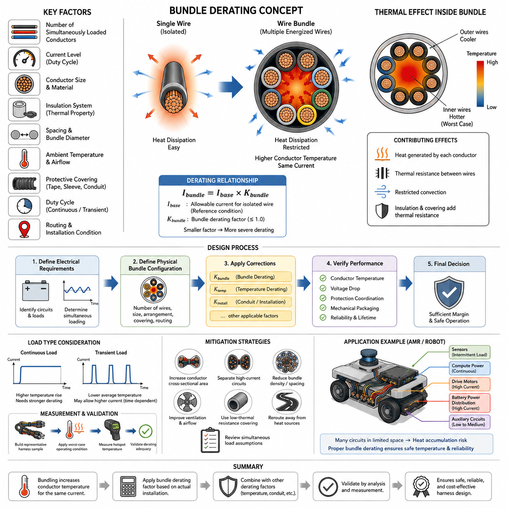
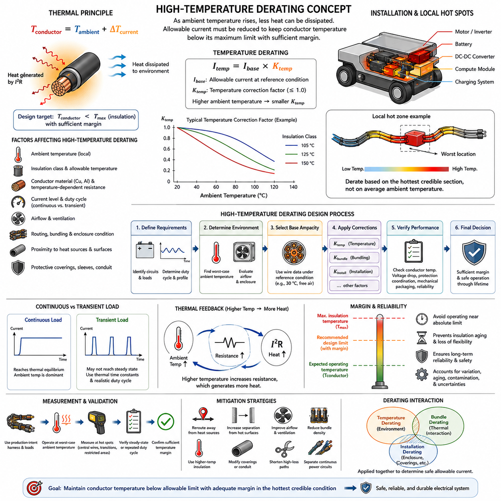
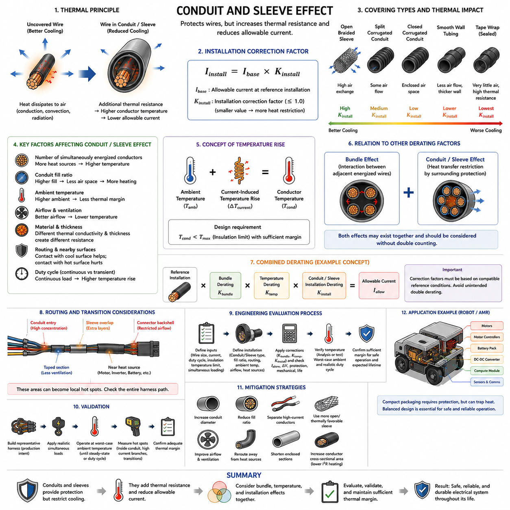
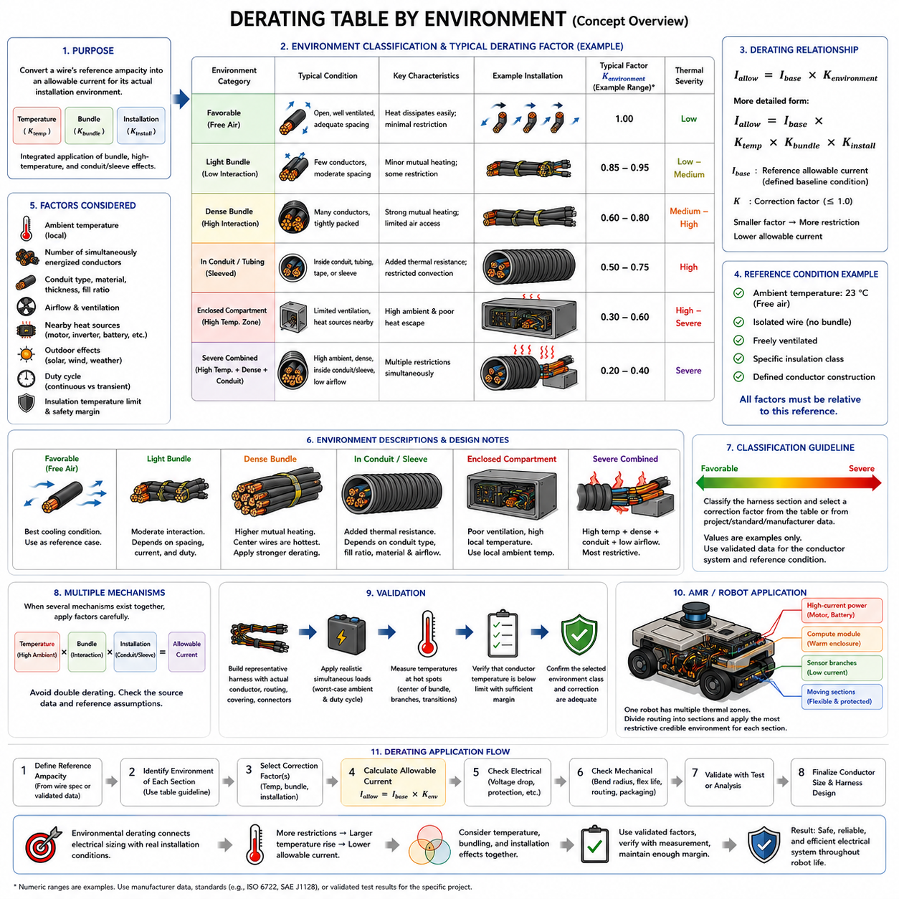
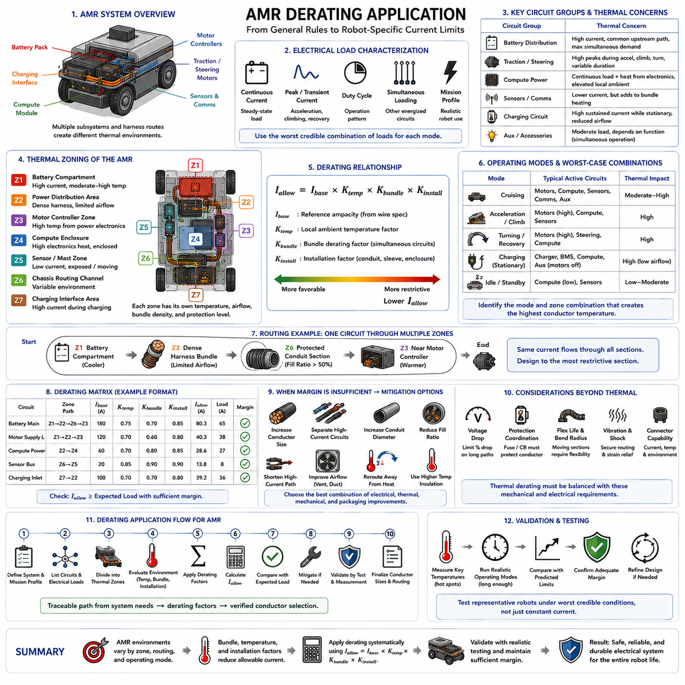

**Volume 02. Wire Harness Engineering**

# Chapter 05. Derating

## 05.01. Bundle Derating Factor

{width="7.268055555555556in" height="7.268055555555556in"}

Bundle derating is the reduction of allowable conductor current when multiple energized wires are grouped closely together in a harness. The chapter structure places this topic at the beginning of the Derating section, following wire-gauge selection and before temperature, conduit, and environment-specific corrections. This sequence reflects the fact that a wire selected individually may require additional current-capacity reduction after its actual installation configuration is defined.

A single conductor dissipates internally generated heat through its insulation and surrounding air. When several conductors are bundled, each conductor becomes a heat source while simultaneously being exposed to heat generated by neighboring wires. The effective thermal path from the inner conductors to the environment therefore becomes more restrictive, increasing conductor temperature for a given electrical current compared with an isolated-wire installation.

The bundle derating factor represents this thermal penalty as a multiplier applied to an otherwise allowable current. Conceptually, if an isolated conductor has an allowable current \\(I_{base}\\), its bundle-adjusted capacity can be expressed as \\(I_{bundle}=I_{base}\\times K_{bundle}\\), where \\(K_{bundle}\\) is normally less than or equal to one. A smaller factor indicates more severe thermal interaction and therefore a greater reduction in permissible current.

Bundle size alone does not determine the appropriate factor. The number of simultaneously loaded conductors, their current levels, conductor sizes, insulation systems, spacing, bundle diameter, ambient temperature, airflow, duty cycles, and surrounding protective materials all influence heat accumulation. Two harnesses containing the same number of wires can consequently have significantly different thermal behavior when their electrical loading or physical installation conditions differ.

Simultaneous loading is particularly important because many harness wires do not continuously carry their maximum design currents. Communication circuits, sensors, intermittent actuators, control signals, and standby power branches may contribute much less heating than continuously energized propulsion or power-distribution conductors. Engineering assessment should therefore distinguish the total number of wires in a bundle from the number of thermally significant conductors operating concurrently.

The thermal position of a conductor within the bundle also matters. Conductors near the outer surface can transfer heat more readily to the surrounding environment, whereas conductors near the center are surrounded by other insulation layers and heated conductors. The central region can consequently become the thermal worst case. Harness evaluation should not assume that every conductor experiences the same temperature merely because all wires share the same external ambient condition.

Wire gauge and insulation construction further affect bundle performance. Larger conductors can generate substantial total heat under high-current operation even when their resistance per unit length is low, while smaller conductors may experience rapid temperature rise because of higher resistance. Insulation thickness and thermal characteristics influence heat transfer from conductor to bundle surface, making conductor construction an integral part of the derating assessment rather than a secondary packaging detail.

Protective coverings can intensify bundle heating by adding thermal resistance between conductors and ambient air. Tape wrapping, braided sleeves, corrugated tubing, conduits, and other harness protection may restrict convection and trap heat within the bundle. The volume structure appropriately treats conduit and sleeve effects separately in 05_03, because bundle interaction and enclosure effects are related but distinct contributors that may need to be considered together in the final thermal design.

Ambient temperature must likewise be separated conceptually from bundle derating. Bundle derating describes the additional thermal interaction created by grouping conductors, whereas high-temperature derating accounts for reduced thermal margin caused by the surrounding environment. A harness located near a motor, inverter, battery, braking component, or enclosed electronics compartment can therefore require both corrections rather than treating one factor as a substitute for the other.

A practical design process begins with the allowable current established from conductor characteristics and applicable temperature limits. Engineers then identify realistic simultaneous loads and define the physical bundle configuration. Bundle correction is applied together with relevant temperature and installation corrections, after which the resulting conductor temperature margin, voltage drop, protection coordination, and mechanical packaging should be checked as an integrated design rather than as independent calculations.

Applying several derating factors by simple multiplication can be useful as a conservative engineering method, but the factors must correspond to compatible assumptions. Excessively conservative combinations can produce unnecessarily large conductors, heavier harnesses, larger connectors, increased bend radius, and higher cost. Conversely, optimistic factors can produce excessive temperature rise and insulation aging. The assumptions behind each factor are therefore as important as the numerical factor itself.

Transient loads require additional consideration because thermal response is time dependent. A motor conductor carrying a short acceleration current may experience a substantially different temperature rise from a conductor carrying the same current continuously. Bundle derating should consequently be interpreted together with duty cycle and conductor thermal time constants. Peak electrical current does not automatically represent the thermal equivalent of continuous current when the loading duration is sufficiently short.

Measurement provides an important means of validating analytical assumptions. Representative harness samples can be assembled using production-intent wire types, bundle dimensions, coverings, clamps, routing, and electrical loads. Temperature sensors should be positioned at expected hot spots, particularly near central conductors and thermally restricted sections. Testing under stabilized worst-case operating conditions can reveal whether calculated derating provides adequate margin.

For robotics and AMR applications, bundle derating becomes especially relevant because high-current drive wiring, battery distribution, compute power, sensor wiring, communication lines, and auxiliary circuits may share limited routing space. Compact chassis packaging can restrict airflow and force long harness sections through narrow passages. The volume therefore progresses from general bundle derating through environmental corrections to a dedicated AMR derating application in 05_05.

Bundle design should ultimately be treated as a system-level thermal problem rather than merely a wire-count rule. Conductor selection determines electrical loss, routing determines heat-transfer conditions, protection devices limit abnormal energy, and packaging determines how effectively generated heat reaches the environment. A robust derating decision combines these elements so that the harness remains within its allowable temperature throughout normal operation and credible worst-case loading.

The final engineering objective is not simply to obtain the lowest possible derating factor, but to establish defensible current capacity for the real installation. When thermal margin is insufficient, designers can increase conductor cross-sectional area, separate high-current circuits, reduce bundle density, improve ventilation, change protective coverings, reroute the harness away from heat sources, or revise simultaneous-load assumptions when supported by system behavior. Bundle derating therefore becomes an iterative design mechanism linking electrical sizing with physical harness architecture.

## 05.02. High Temperature Derating

{width="7.268055555555556in" height="7.268055555555556in"}

High-temperature derating is the reduction of allowable wire current when a conductor operates in an ambient environment hotter than the reference condition used to establish its normal ampacity. As ambient temperature rises, the temperature difference available for transferring internally generated heat to the surroundings decreases. A wire that safely carries a specified current at room temperature may therefore exceed its permissible conductor or insulation temperature when installed in a hot zone.

The thermal limitation of a wire is fundamentally determined by the maximum temperature that its conductor and insulation system can withstand while maintaining the required electrical and mechanical performance. The operating conductor temperature can be viewed conceptually as the combination of ambient temperature and current-induced temperature rise. As ambient temperature approaches the allowable material temperature, progressively less thermal margin remains available for Joule heating generated by conductor resistance.

A simplified thermal relationship can be expressed as \\(T_{conductor}=T_{ambient}+\\Delta T_{current}\\), where \\(T_{ambient}\\) represents the local environmental temperature and \\(\\Delta T_{current}\\) represents the temperature rise produced by electrical loading under the actual installation condition. The design requirement is that the resulting conductor temperature remain below the applicable maximum temperature with sufficient engineering margin throughout expected operation.

High-temperature derating can be represented by a temperature correction factor applied to the reference allowable current. If \\(I_{base}\\) is the allowable current under a specified reference condition, the corrected capacity can be written conceptually as \\(I_{temp}=I_{base}\\times K_{temp}\\). The factor \\(K_{temp}\\) decreases as the ambient temperature increases, reflecting the progressively reduced ability of the conductor to dissipate internally generated heat without exceeding its temperature limit.

The appropriate correction factor cannot be selected from ambient temperature alone. Wire insulation class, conductor material, allowable continuous temperature, current duty cycle, airflow, routing, bundle configuration, enclosure conditions, and nearby heat sources influence the actual thermal state. The reference conditions behind the original ampacity value must therefore be understood before applying a temperature correction, because derating factors are meaningful only relative to the assumptions from which they were derived.

Electrical resistance also increases with conductor temperature. For metallic conductors such as copper, higher temperature produces higher resistance, which increases \\(I\^2R\\) losses for a given current. This creates an important thermal feedback mechanism: increased ambient temperature raises conductor temperature, increased conductor temperature raises resistance, and increased resistance generates additional heat. Thermal analysis should therefore account for temperature-dependent resistance when accuracy is important.

Insulation temperature rating establishes an important upper boundary, but it should not be interpreted as a recommended normal operating temperature. Continuous operation near the maximum material rating can accelerate insulation aging, reduce mechanical flexibility, and decrease long-term reliability. Practical harness design normally maintains margin below the absolute material limit so that manufacturing variation, local hot spots, transient conditions, aging, contamination, and uncertainty do not immediately consume the available thermal capability.

Local temperature is more important than general room or vehicle temperature. A harness may pass through several thermal zones while carrying the same current, and only a short section near a motor, inverter, DC-DC converter, braking component, battery, exhaust-like heat source, or enclosed electronics compartment may experience the worst condition. Current capacity should consequently be evaluated against the hottest credible section of the routing rather than an average environmental temperature.

Heat transfer also depends strongly on airflow and installation geometry. A wire exposed to moving air can dissipate heat more effectively than the same wire installed inside a sealed compartment or tightly constrained channel. Harnesses routed against warm structural surfaces may additionally receive heat through conduction and radiation. High-temperature derating should therefore represent the actual installation environment rather than treating ambient air temperature as the only external thermal input.

High-temperature derating and bundle derating address different physical effects and may occur simultaneously. Temperature derating accounts for reduced thermal margin caused by the external environment, whereas bundle derating accounts for thermal interaction among adjacent energized conductors. A tightly packed harness installed in a hot enclosure may require both corrections, together with additional consideration of sleeves, conduits, or coverings that restrict heat transfer.

When several correction factors are required, a conceptual engineering expression may be written as \\(I_{allow}=I_{base}\\times K_{temp}\\times K_{bundle}\\times K_{install}\\), where the factors represent temperature, bundling, and installation effects. This formulation is useful for design organization, but factors should not be multiplied mechanically without checking their reference assumptions. Some empirical ratings may already include particular installation conditions, creating the possibility of unintended double derating.

Continuous and transient loads must also be distinguished. A continuously energized power conductor may eventually approach thermal equilibrium with its surroundings, making high ambient temperature a dominant constraint. A short-duration actuator or motor current may end before the conductor reaches steady-state temperature. Thermal time constants and realistic duty cycles are therefore important when determining whether peak current, RMS-equivalent loading, or continuous current provides the appropriate basis for thermal evaluation.

Thermal cycling introduces another consideration for robotic harnesses. Repeated transitions between standby, acceleration, high compute load, charging, and normal motion can repeatedly heat and cool conductors, terminals, connectors, and surrounding materials. Even when maximum temperature remains within the nominal limit, repeated cycling can influence mechanical interfaces and long-term durability. Temperature assessment should therefore consider both peak temperature and representative operating profiles.

Validation should reproduce the actual thermal environment as closely as practical. Production-intent wires, bundle arrangements, coverings, connectors, clamps, routing paths, and electrical loads can be operated at representative worst-case ambient temperatures while temperatures are measured at predicted hot spots. Sufficient time should be allowed for continuous circuits to approach thermal equilibrium, while transient circuits should be evaluated using realistic repeated duty cycles.

Temperature measurement locations require careful selection because the hottest conductor may not coincide with the easiest accessible harness surface. Sensors placed only on outer coverings can underestimate internal conductor temperature, particularly in dense bundles or enclosed routing. Measurements near central conductors, high-current branches, connector transitions, restricted airflow regions, and nearby heat sources provide stronger evidence for confirming whether the selected derating strategy maintains adequate margin.

For AMRs and mobile robots, high-temperature derating is relevant even when the overall operating environment appears moderate. Drive motors, motor controllers, battery packs, DC-DC converters, GPU-based compute modules, charging hardware, and compact power-distribution assemblies can create localized hot zones inside the chassis. Limited ventilation and dense packaging can make internal harness temperature substantially higher than the external ambient temperature.

Mitigation does not always require increasing conductor size. Thermal margin may also be improved by rerouting the harness away from heat sources, increasing separation from hot surfaces, improving airflow, reducing bundle density, selecting higher-temperature insulation, modifying protective coverings, shortening high-loss paths, or separating continuously loaded power circuits from other conductors. The preferred solution should balance thermal performance with voltage drop, mass, flexibility, packaging, cost, and serviceability.

High-temperature derating should ultimately be treated as part of an integrated wire-sizing process rather than as an isolated correction applied at the end of design. Current capacity, voltage drop, bundle heating, installation restrictions, protection coordination, insulation capability, and expected lifetime interact with one another. A robust design establishes the worst credible thermal condition, applies appropriate correction assumptions, and verifies that sufficient temperature margin remains throughout the intended operating life.

## 05.03. Conduit and Sleeve Effect

{width="7.268055555555556in" height="7.268055555555556in"}

Conduits and protective sleeves are widely used in wire-harness systems to provide mechanical protection, abrasion resistance, environmental sealing, organization, and routing control. However, these protective layers also modify the thermal environment around conductors. By partially isolating wires from surrounding air, a conduit or sleeve can reduce heat dissipation and therefore decrease the allowable current that conductors can safely carry under continuous operating conditions.

An uncovered wire transfers internally generated heat through its insulation to the surrounding environment by conduction, convection, and radiation. When the same wire is enclosed inside corrugated conduit, braided sleeving, tubing, or another protective covering, additional material is introduced into the heat-transfer path. The resulting thermal resistance can increase conductor temperature even when electrical current and external ambient temperature remain unchanged.

The effect can be represented conceptually through an installation correction factor. If \\(I_{base}\\) represents allowable current under a defined reference installation, the capacity after accounting for enclosure effects may be expressed as \\(I_{install}=I_{base}\\times K_{install}\\). The value of \\(K_{install}\\) is generally less than or equal to one when the conduit or sleeve restricts cooling relative to the reference condition, although the appropriate value depends on the actual construction and installation.

Not all protective coverings create the same thermal penalty. An open braided sleeve may permit greater air exchange than a tightly wrapped tape system or closed polymer conduit. Corrugated tubing can create enclosed air spaces around conductors, while thick-wall tubing can introduce additional thermal resistance. Materials with different thermal conductivity, thickness, surface characteristics, and coverage ratios therefore produce different conductor temperature responses.

Conduit fill ratio is another important parameter. A large conduit containing only a few separated conductors may retain some internal airflow and provide greater effective surface area for heat transfer. A densely filled conduit places conductors closer together, reduces available air volume, and increases thermal interaction between neighboring wires. Consequently, conduit size should not be selected solely from mechanical fit; thermal behavior should also be considered when high-current circuits are enclosed.

The number of simultaneously energized conductors inside the enclosure strongly influences temperature rise. Signal wires and lightly loaded sensor circuits may contribute little heat, whereas battery distribution, motor supply, actuator, heater, or compute-power conductors can produce substantial \\(I\^2R\\) losses. Engineering assessment should therefore distinguish physical conductor count from the number and loading level of thermally significant conductors operating at the same time.

Bundle derating and conduit or sleeve effects are closely related but represent different aspects of the installation. Bundle derating addresses thermal interaction among adjacent energized conductors, while conduit and sleeve correction addresses the additional heat-transfer restriction introduced by surrounding protection. When bundled conductors are enclosed inside a restrictive conduit, both mechanisms may exist simultaneously and should be evaluated without unintentionally counting the same thermal effect twice.

Ambient temperature introduces another interacting condition. A conduit installed in a cool, ventilated region may operate satisfactorily with relatively modest thermal correction, while the same assembly routed through a hot enclosure can experience substantially higher conductor temperatures. The combined design may therefore require consideration of temperature derating, bundle derating, and installation derating, consistent with the progression of the Derating chapter from 05_01 through 05_04.

Routing against structural surfaces can either improve or worsen heat transfer depending on the materials and temperatures involved. Contact with a cool metallic chassis may provide an additional conductive heat path, whereas routing against a warm motor housing, battery enclosure, or power-electronics structure may introduce external heat. The conduit itself can also change the contact area, meaning that the complete routing geometry should be considered rather than evaluating the protective material in isolation.

Protective coverings are often selected primarily for mechanical reasons. Corrugated conduit can protect against abrasion and impact, braided sleeve can improve flexibility and wear resistance, and specialized tubing can provide environmental or chemical protection. Thermal performance therefore represents one requirement within a multi-objective design. Removing protection simply to improve cooling may create unacceptable mechanical, environmental, or service-life risks elsewhere in the harness system.

Continuous and transient loading should be distinguished when evaluating enclosure effects. Continuously loaded conductors have sufficient time to approach thermal equilibrium, allowing restricted heat dissipation to produce significant temperature rise. Short-duration currents may terminate before the conductor and surrounding conduit reach steady-state temperature. Nevertheless, repeated transient loads can accumulate heat when the cooling interval between events is insufficient for the harness to return toward its initial thermal condition.

Connector and branch regions require special attention because conduit geometry frequently changes near these locations. Several wires may converge before entering a connector, a sleeve may overlap another protective layer, or tape may close an otherwise ventilated bundle. These transitions can create localized regions with greater thermal resistance than the main harness section. Thermal assessment should therefore consider changes in covering, bundle diameter, conductor concentration, and airflow along the complete routing path.

A practical engineering evaluation begins by defining conductor sizes, circuit currents, duty cycles, insulation temperature limits, and expected simultaneous loading. The intended conduit, sleeve, tape, or tubing configuration is then added together with fill ratio, routing geometry, ambient temperature, and airflow conditions. The resulting installation should be checked for conductor temperature, voltage drop, protection coordination, mechanical packaging, flexibility, and expected lifetime.

Where several corrections are required, allowable current can be organized conceptually as \\(I_{allow}=I_{base}\\times K_{bundle}\\times K_{temp}\\times K_{install}\\). This expression separates bundling, ambient-temperature, and installation effects for engineering clarity. However, correction factors must be based on compatible reference conditions. If an ampacity specification or test result already represents enclosed or bundled conductors, applying an additional generic factor may produce unnecessary double derating.

Experimental validation is particularly valuable for heavily enclosed harnesses because detailed thermal behavior can be difficult to predict from simple correction factors. A representative harness can be manufactured using production-intent conductors, conduit, sleeves, tape, clamps, connectors, and routing geometry. Applying realistic simultaneous loads at worst-case ambient conditions allows temperatures to be measured until steady state or through representative transient operating cycles.

Temperature measurements should include locations where heat is most likely to accumulate. Central conductors within densely filled conduit, high-current branches, overlapping sleeves, taped transitions, connector backshell regions, and sections near external heat sources are useful candidates. Surface temperature of the conduit alone may not accurately represent the hottest internal conductor, so validation methods should be selected to capture the actual thermal limitation of the assembly.

For AMRs and mobile robots, conduit and sleeve effects can become significant because harnesses are frequently routed through compact chassis spaces containing motors, motor controllers, batteries, DC-DC converters, computers, sensors, and communication equipment. Mechanical protection is often necessary because vibration, repetitive movement, sharp structures, maintenance access, and contamination can damage exposed wiring, yet the same protection can restrict cooling in already dense packaging.

Thermal mitigation can be achieved without abandoning mechanical protection. Designers may increase conduit diameter, reduce fill ratio, separate high-current conductors, use more thermally favorable coverings, improve ventilation, shorten enclosed sections, or reroute the harness away from heat sources. Increasing conductor cross-sectional area is another option because lower resistance reduces \\(I\^2R\\) heating, although the resulting increase in harness diameter, mass, bend radius, connector size, and cost must be considered.

The conduit and sleeve effect should ultimately be treated as an installation-dependent thermal characteristic rather than a fixed property of the wire itself. A conductor does not possess one universally valid current capacity independent of how it is packaged. Safe harness design requires the electrical load, conductor construction, bundle configuration, protective covering, ambient environment, routing, and cooling conditions to be evaluated together so that adequate temperature margin remains throughout the intended operating life.

## 05.04. Derating Table by Environment

{width="7.268055555555556in" height="7.268055555555556in"}

Environmental derating tables provide a structured method for converting a wire's reference ampacity into an allowable current appropriate for its actual installation environment. Within the Derating chapter, this topic integrates the bundle, high-temperature, and conduit or sleeve effects introduced previously and prepares those principles for practical application. The objective is not to assign one universal factor, but to organize repeatable engineering decisions for different harness environments.

A derating table normally begins with a clearly defined reference condition. The base current rating may assume a specified ambient temperature, isolated or freely ventilated wiring, a particular insulation class, and defined conductor construction. Environmental factors are meaningful only relative to that baseline. If the reference assumptions are unknown, applying a correction value can create either unsafe optimism or unnecessary conservatism.

The general relationship can be represented conceptually as \\(I_{allow}=I_{base}\\times K_{environment}\\), where \\(I_{base}\\) is the reference allowable current and \\(K_{environment}\\) represents the correction required for the actual installation. In a more detailed assessment, the environmental factor may be decomposed into temperature, bundling, and installation terms such as \\(K_{temp}\\), \\(K_{bundle}\\), and \\(K_{install}\\).

A free-air installation typically provides one of the most favorable thermal environments because conductor surfaces can exchange heat directly with surrounding air. When adequate spacing and ventilation are maintained, internally generated \\(I\^2R\\) heat can escape relatively efficiently. Such a condition may serve as a reference case, but its current capacity should not automatically be transferred to wires installed inside dense robot chassis compartments.

A lightly bundled harness introduces additional thermal interaction because neighboring energized conductors influence one another. The correction depends not simply on total wire count but on the number of simultaneously loaded circuits, their currents, conductor sizes, spacing, and duty cycles. A harness containing many signal wires may require a different correction from a physically similar bundle dominated by continuous high-current power conductors.

Dense bundles represent a more restrictive environment because internal conductors have limited access to cooling air and are surrounded by additional heat sources. The central portion of the bundle can become the thermal worst case. Environmental tables should therefore distinguish between loosely organized wiring and densely packed harnesses rather than assigning the same factor to every installation described generically as a bundle.

Conduit, tubing, tape wrapping, and protective sleeves introduce another environmental category. These materials provide essential abrasion, contamination, and mechanical protection but can increase thermal resistance and restrict convection. The required correction depends on covering type, material, thickness, conduit fill ratio, airflow, and conductor loading. Open braided protection may behave differently from tightly sealed polymer tubing or heavily taped assemblies.

Enclosed electrical compartments can impose stronger derating because both ventilation and available heat-sink capacity may be limited. Power electronics, computers, converters, batteries, and motor controllers can raise the local air and structural temperatures above the external ambient condition. A derating table for robotics should therefore use the temperature at the harness location rather than assuming that room temperature or outdoor air temperature represents the actual installation.

High-temperature zones require progressively greater correction as the local ambient temperature approaches the conductor or insulation temperature limit. The remaining thermal margin determines how much additional current-induced temperature rise can be tolerated. A wire routed close to a motor or inverter may consequently require a different allowable current from an identical wire carrying the same load in a cooler sensor compartment.

Low-airflow and sealed environments deserve separate consideration even when their initial ambient temperatures are moderate. Heat generated by conductors and neighboring equipment can accumulate over time, causing the local temperature to rise above its starting value. For continuously operating systems, environmental classification should therefore reflect steady-state or credible worst-case temperature rather than only the temperature measured immediately after startup.

Moving harness sections introduce additional constraints that cannot be represented by thermal derating alone. Robot joints, steering modules, suspension interfaces, manipulators, and moving cable chains may require flexible conductors and protective coverings that change heat-transfer characteristics. A suitable environmental table should identify the thermal correction while reminding the designer that bend radius, repetitive flex life, abrasion, and mechanical strain remain independent design requirements.

Outdoor installations add solar radiation, seasonal temperature variation, water exposure, dust, wind, and changing operating conditions. Direct sunlight can raise harness surface temperature above measured air temperature, while airflow may improve cooling in other conditions. Environmental derating for outdoor robots should consequently be based on the credible thermal envelope of the installation rather than a single nominal outdoor temperature.

A practical table can classify environments qualitatively as favorable, moderate, restrictive, or severe before assigning project-specific correction values. Favorable conditions may include ventilated and lightly loaded wiring, while restrictive conditions can include dense bundles, enclosed conduits, or high local temperatures. Severe conditions may combine several mechanisms simultaneously, such as high ambient temperature, dense bundling, limited airflow, and protective enclosure.

Such classifications should not be interpreted as universal numerical standards. Actual factors must come from applicable wire specifications, manufacturer data, validated engineering rules, recognized standards, or representative thermal testing. A generic table is most useful as a decision framework showing which corrections must be considered. Numerical values should remain traceable to the conductor system and reference conditions used by the specific project.

When several environmental mechanisms coexist, correction factors may be organized conceptually as \\(I_{allow}=I_{base}\\times K_{temp}\\times K_{bundle}\\times K_{install}\\). This provides a transparent way to document why the final current capacity differs from the reference value. However, engineers must determine whether the source data treats these mechanisms independently before multiplying factors, because some published ampacity values already incorporate bundling or enclosure assumptions.

Environmental derating tables should also distinguish continuous and transient operation. Continuous power circuits can approach thermal equilibrium and are strongly affected by restrictive environments. Intermittent actuators may tolerate higher short-duration currents because their thermal mass delays temperature rise. Nevertheless, repeated transient operation can accumulate heat, so duty cycle and thermal time constants remain necessary when applying table-based corrections to dynamic robotic loads.

Validation converts the table from an assumption into evidence. Representative harness assemblies should reproduce conductor sizes, simultaneous loads, bundle density, coverings, routing, airflow, and worst-case ambient conditions. Temperatures can then be measured at central conductors, high-current branches, connector transitions, enclosed sections, and other predicted hot spots to verify that the selected environmental category and correction assumptions provide sufficient margin.

For AMRs, a single vehicle can contain several different derating environments simultaneously. Battery and motor wiring may occupy high-current regions, compute modules can create warm enclosed compartments, sensor branches may operate at low current, and moving drive modules may require flexible protected harnesses. Applying one vehicle-wide derating factor would therefore hide important local differences and can result in either oversized wiring or inadequate thermal protection.

An effective AMR harness design can instead divide the routing into thermal zones and assign each section an appropriate environmental classification. The same electrical circuit may pass through free-air, bundled, sleeved, and high-temperature sections along its route. Because current is common through the series path, the most restrictive credible section can determine the required conductor size unless routing or packaging is redesigned to remove that limitation.

The final environmental derating table should function as an engineering decision tool linking electrical sizing with physical installation. It should identify the reference ampacity, relevant environment, applicable corrections, resulting allowable current, and validation basis. Used correctly, the table creates traceability between conductor selection and real harness conditions while supporting the chapter's progression toward AMR-specific derating application in the following section.

## 05.05. AMR Derating Application

{width="7.268055555555556in" height="7.268055555555556in"}

AMR derating application converts general wire ampacity rules into installation-specific current limits for an Autonomous Mobile Robot. Unlike a stationary electrical cabinet, an AMR combines battery power, traction motors, motor controllers, computing hardware, sensors, communication equipment, charging circuits, and moving harness sections within a compact platform. Each region can create a different thermal environment, so conductor sizing should reflect the actual routing condition rather than one vehicle-wide current rating.

The process begins with the electrical load profile of the robot. Each circuit should be characterized by continuous current, expected operating current, transient or peak current, duty cycle, and simultaneous loading with other circuits. Traction motors may demand large acceleration currents, while computers can create relatively stable continuous loads. Sensors and communication devices usually consume less current but can still contribute to bundle heating when numerous circuits share the same routing path.

The battery distribution path is normally one of the most thermally significant sections of an AMR harness. Battery cables can supply propulsion, computing, control, sensing, and auxiliary loads through common upstream conductors. These cables must therefore be evaluated for the maximum credible simultaneous demand rather than the nominal consumption of one subsystem. Fuse coordination, voltage drop, connector current capability, and conductor temperature must remain consistent with the selected wire size.

Traction and steering circuits require special treatment because their electrical loading varies strongly with robot motion. Acceleration, slope climbing, payload transport, turning, obstacle recovery, and braking can produce currents significantly above steady cruising levels. These peaks should not automatically be treated as continuous loads, but their duration and repetition determine whether heat accumulates. A realistic mission profile is therefore more useful for thermal design than a single maximum-current number.

Compute circuits present a different load pattern. Edge computers, GPUs, network switches, storage devices, and perception processors can draw substantial power continuously while generating heat inside the same enclosure through which their supply harnesses are routed. The harness may therefore experience both internal \\(I\^2R\\) heating and elevated local ambient temperature created by electronics. This combination can make compute compartments important thermal zones even when conductor currents are lower than motor currents.

An AMR should consequently be divided into installation-specific thermal zones. Typical regions may include the battery compartment, power-distribution area, motor-controller zone, compute enclosure, sensor mast, chassis routing channels, drive modules, and charging interface. Each zone can be classified according to local temperature, airflow, bundle density, protective covering, nearby heat sources, movement, and expected simultaneous electrical loading.

A single circuit may pass through several of these zones. For example, a motor supply cable can leave a relatively cool battery compartment, enter a dense central harness bundle, pass through protective conduit, and terminate near a warm motor controller. The electrical current remains common through the series path, but the thermal environment changes along the route. The most restrictive credible section can therefore determine the required conductor size for the complete circuit.

The allowable current can be organized conceptually as \\(I_{allow}=I_{base}\\times K_{temp}\\times K_{bundle}\\times K_{install}\\). The temperature factor represents local ambient conditions, the bundle factor represents thermal interaction among simultaneously energized conductors, and the installation factor represents restrictions introduced by conduit, sleeves, coverings, or enclosure geometry. These factors provide a useful engineering structure but must remain compatible with the assumptions behind the reference ampacity.

Bundle composition should be reviewed according to actual robot operating modes. During normal cruising, motor, compute, sensing, and communication circuits may operate simultaneously. During acceleration or slope climbing, propulsion loading can dominate. During charging, traction circuits may be inactive while charging and battery-management circuits carry significant current. Different operating modes can therefore produce different worst-case thermal combinations, and the design should identify which combination governs each harness section.

Moving sections introduce an additional AMR-specific constraint. Harnesses connected to steering assemblies, suspension systems, wheel modules, manipulators, or other articulated components must tolerate repetitive bending and vibration while carrying electrical loads. Increasing conductor size can reduce resistance and temperature rise, but it also increases diameter and bending stiffness. Thermal improvement must therefore be balanced against minimum bend radius, flex life, mechanical strain, packaging space, and connector compatibility.

Protective coverings are frequently necessary in mobile robots because harnesses can be exposed to vibration, abrasion, debris, moisture, sharp structures, and maintenance activity. Corrugated conduit, braided sleeve, tape, and tubing improve mechanical durability but can restrict cooling. A mechanically robust AMR harness can consequently require additional installation derating, particularly where high-current conductors are enclosed within densely filled protective coverings.

Voltage drop must be evaluated together with thermal derating because both requirements influence conductor cross-sectional area. A wire may satisfy its temperature limit after derating but still produce excessive voltage loss over a long battery-to-load path. This is particularly important in low-voltage systems, where relatively small absolute voltage drops can represent a meaningful percentage of the supply voltage and can reduce motor, controller, computer, or sensor performance.

Circuit protection must also remain coordinated with the derated conductor capacity. A fuse or circuit breaker should protect the wire under abnormal overload or short-circuit conditions without interrupting valid transient operation unnecessarily. If environmental derating reduces the safe continuous capacity of a conductor, protection settings cannot be justified solely from the wire's free-air rating. The thermal installation and protection philosophy should therefore be reviewed as one coordinated system.

Charging circuits form another important thermal case because charging can create sustained high current while the robot is stationary. Reduced vehicle motion may also reduce airflow around internal components compared with normal driving. Battery temperature, charger losses, contact resistance, and enclosed charging hardware can further increase local temperatures. The charging state should therefore be treated as a distinct operating mode when identifying the worst thermal condition of an AMR.

Outdoor AMRs require a wider environmental envelope than robots operating exclusively in controlled indoor facilities. Solar heating, high seasonal ambient temperature, cold-start conditions, dust protection, waterproof coverings, and changing airflow can alter harness temperature. Sealed protection needed for water and contamination resistance may reduce heat dissipation, so environmental robustness and electrical current capacity must be considered together rather than independently.

A practical AMR derating matrix can map each harness section against circuit type, base ampacity, local temperature, bundle condition, protective covering, duty cycle, and applicable correction factors. The resulting allowable current can then be compared with the expected electrical load. Such a matrix creates traceability from system-level power requirements to individual conductor decisions and makes it easier to identify sections where thermal margin is insufficient.

When insufficient margin is identified, conductor enlargement is only one possible corrective action. Engineers can separate propulsion cables from other bundles, increase conduit diameter, reduce fill ratio, shorten high-current paths, improve airflow, relocate wiring away from controllers or motors, select higher-temperature insulation, or modify protective coverings. Changing the routing can sometimes provide more effective improvement than increasing wire size throughout the entire circuit.

Thermal validation should reproduce representative robot operating modes rather than testing the harness with arbitrary constant currents alone. Useful cases include prolonged cruising, repeated acceleration and deceleration, maximum payload operation, slope climbing, high compute utilization, charging, and combinations expected to create maximum simultaneous heating. Testing should continue long enough to identify heat accumulation and, for continuous loads, approach representative thermal equilibrium.

Temperature measurements should focus on predicted worst-case locations rather than only easily accessible external surfaces. Important locations include central wires in dense bundles, battery distribution conductors, motor branches, connector transitions, conduit sections, compute compartments, charging interfaces, and regions adjacent to motor controllers or other heat sources. Internal conductor temperature may exceed sleeve or conduit surface temperature, so measurement strategy should account for this difference.

Validation results should feed back into the derating assumptions. If measured temperatures remain well below predicted limits, the design may contain unnecessary conservatism that increases harness mass, cost, and stiffness. If measured temperatures approach the design limit, additional margin or mitigation is required. The objective is not maximum conductor size but a verified balance among electrical capability, thermal safety, mechanical durability, packaging efficiency, and serviceability.

The final AMR harness design should therefore treat derating as a system-level engineering process connecting electrical architecture with physical installation. Bundle effects, high-temperature zones, conduit and sleeve restrictions, and environment-specific corrections introduced throughout Chapter 05 converge at the robot level. This application completes the Derating chapter by translating individual correction mechanisms into a traceable method for achieving safe, reliable, and practical AMR wiring throughout its intended operating life.
