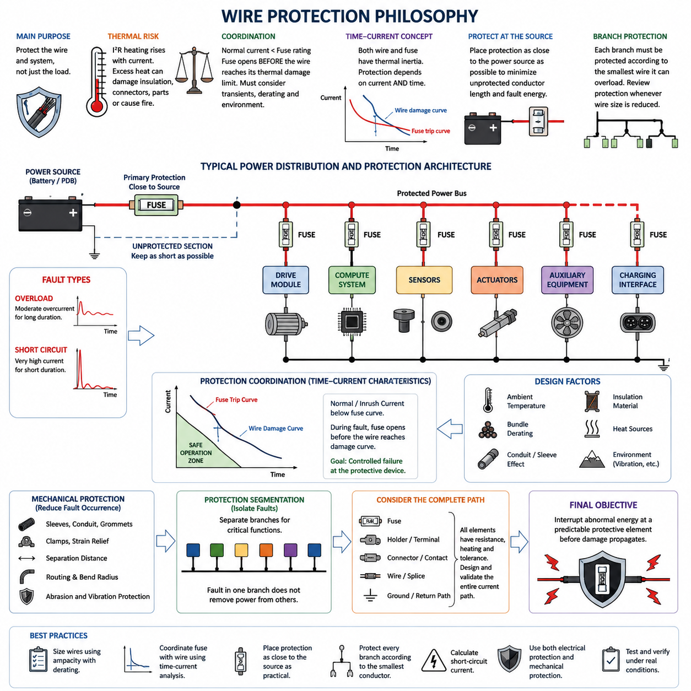
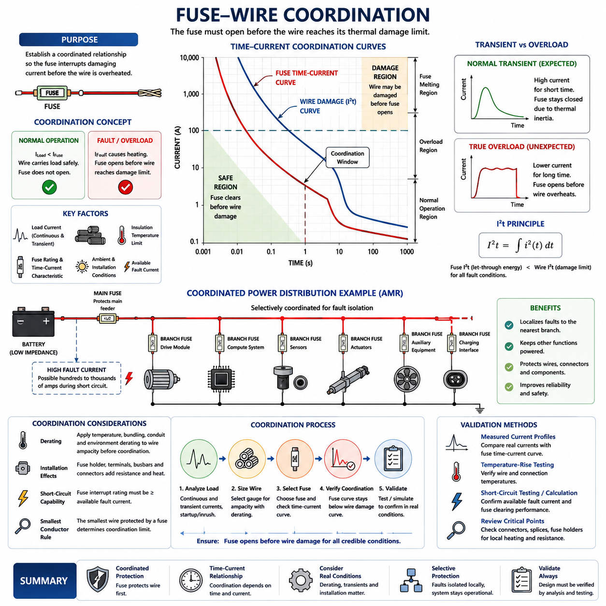
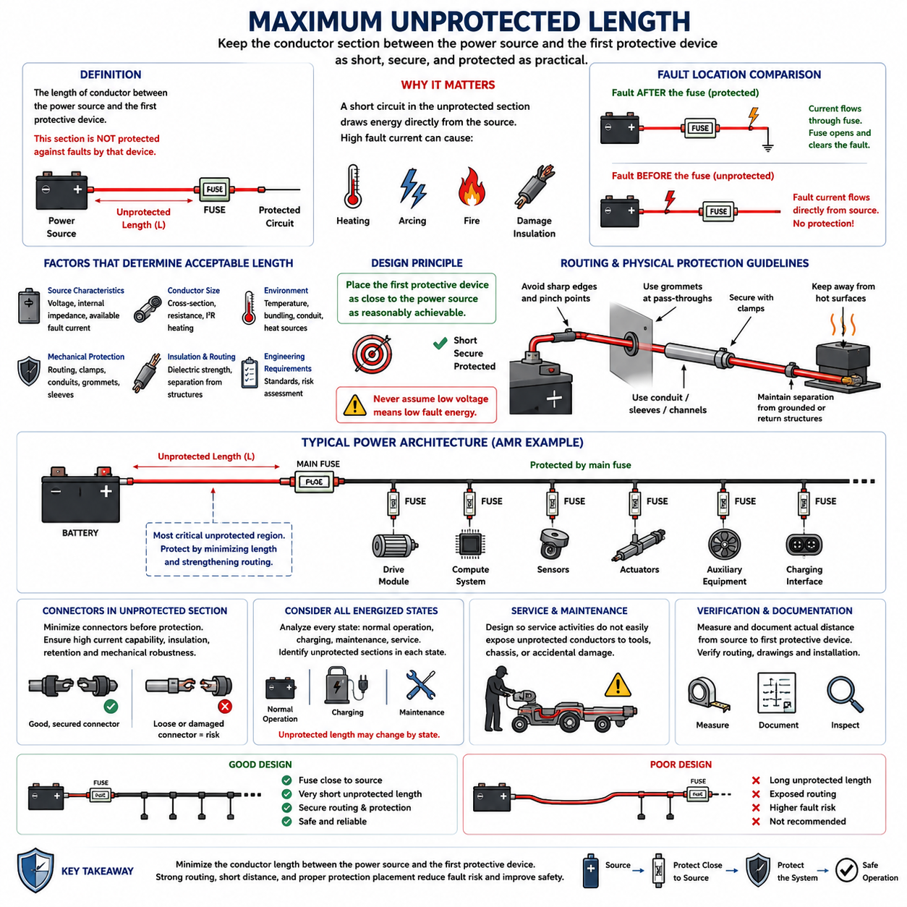
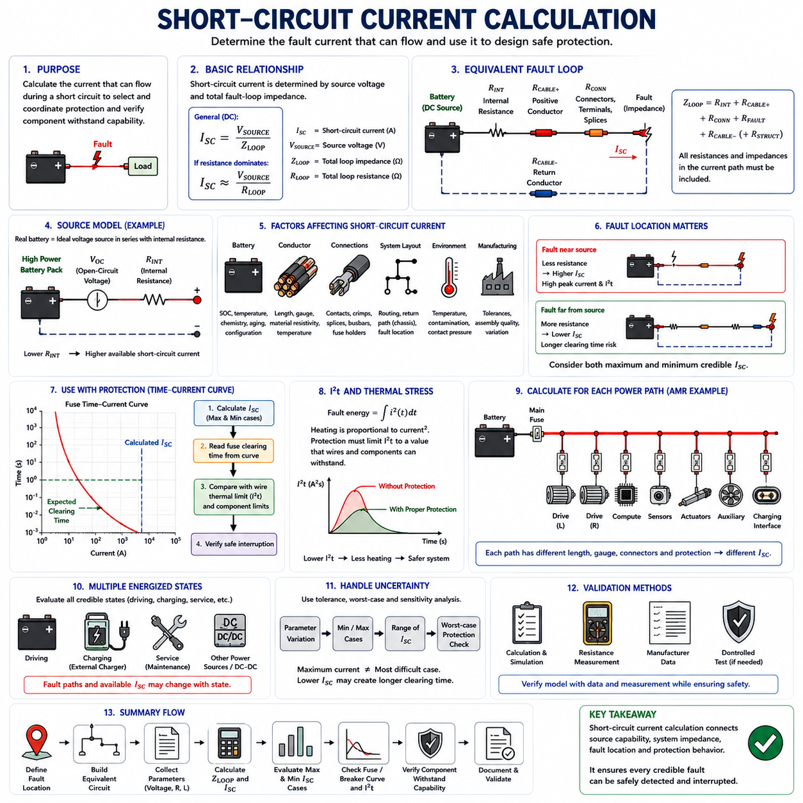
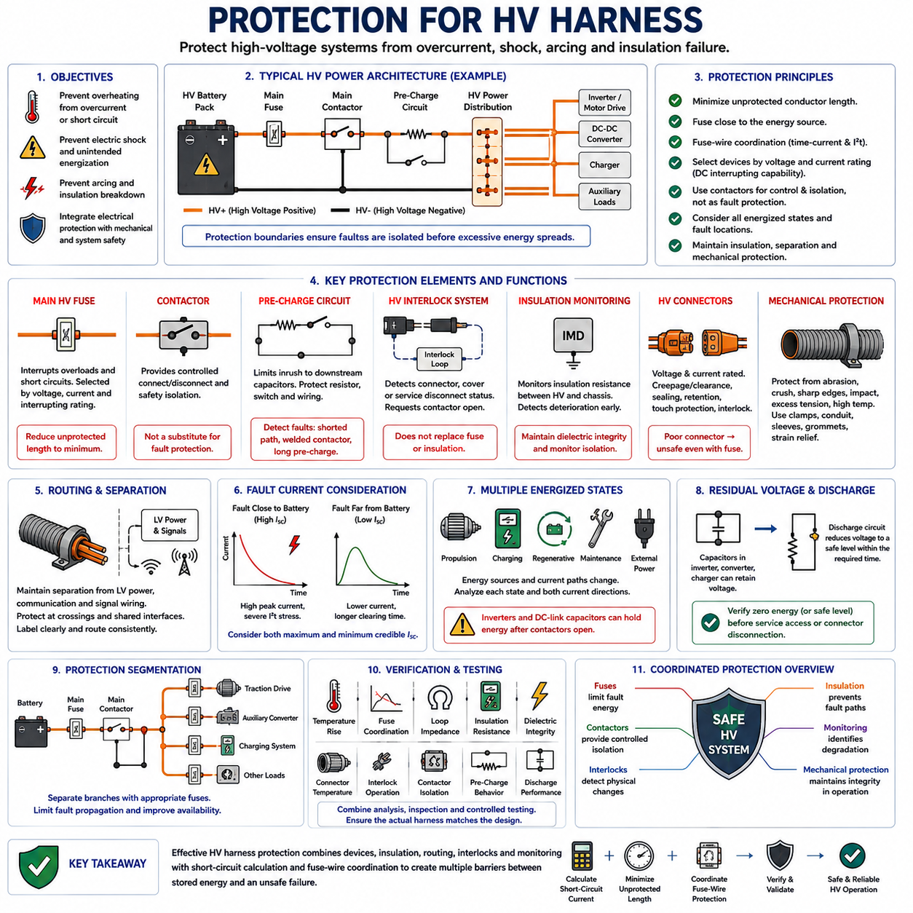

**Volume 02. Wire Harness Engineering**

# Chapter 06. Fuse and Circuit Protection

## 06.01. Wire Protection Philosophy

{width="7.268055555555556in" height="7.268055555555556in"}

Wire protection begins with a simple engineering principle: the protective device is primarily installed to protect the conductor and surrounding system, not merely the electrical load. A fuse or circuit breaker must interrupt abnormal current before conductor temperature reaches a level that can damage insulation, connectors, terminals, nearby components, or structural materials. This philosophy establishes protection as an integral part of harness design rather than an accessory added after wire sizing.

Under normal operation, a wire carries load current while electrical resistance continuously converts part of the transmitted power into heat. The harness is designed so that this heat can be dissipated without exceeding the allowable conductor or insulation temperature. During overload or short-circuit conditions, however, current may rise far beyond the continuous design value. Because resistive heating increases approximately with the square of current, even a relatively short abnormal event can produce severe thermal stress.

The protection strategy therefore requires coordination among expected load current, wire ampacity, environmental derating, and protective-device characteristics. The normal operating current should remain below the conductor\'s allowable current after all applicable derating factors are considered, while the fuse rating must permit legitimate operating conditions such as startup current, motor acceleration, capacitor charging, or temporary actuator peaks. Protection cannot be selected from nominal current alone because transient behavior is often fundamental to robotic electrical systems.

A useful protection hierarchy can be expressed conceptually as normal load current below the protective-device rating, with the protective device operating before the wire reaches its thermal damage limit. The actual relationship is time dependent rather than represented by one current value. Both wires and fuses possess thermal inertia, so protection coordination must compare their current-versus-time behavior. A high current may be acceptable for milliseconds while the same conductor could be damaged if a lower overload persists for many seconds.

This time-current perspective explains why simply selecting a fuse slightly above the nominal load current is insufficient. Motors, pumps, solenoids, DC-DC converters, computers, and capacitive electronic loads may create large but legitimate transient currents. If the fuse reacts too rapidly, nuisance opening can occur during normal operation. If it reacts too slowly or has an excessively high rating, the harness can become the effective fuse during a fault, allowing insulation melting, conductor damage, or ignition before electrical isolation occurs.

Protection must also be located with respect to the energy source. A conductor connected directly to a battery or power distribution bus remains electrically exposed from the source terminal until the first protective device. A short circuit occurring within this unprotected section can draw fault current without being interrupted by the downstream fuse. Consequently, protective devices should generally be placed as close to the source as practical, and unavoidable unprotected conductor length should be minimized through routing, mechanical protection, and packaging design.

Branch circuits introduce another important principle: protection should correspond to the smallest conductor that the upstream energy source can overload. A large feeder may divide into several smaller wires, each supplying a different load. Protection suitable for the feeder may be too large to protect the smaller branches. Each reduction in conductor capacity must therefore trigger a review of protection coordination, ensuring that no downstream wire can experience damaging current while remaining below the trip threshold of its upstream protective device.

Fault protection must consider both overloads and low-impedance short circuits. An overload may produce moderate excess current for an extended period, whereas a direct short between power and return paths can produce extremely high current limited mainly by battery impedance, cable resistance, connector resistance, and distribution components. These two fault classes impose different thermal stresses, making the protective device\'s complete time-current characteristic more meaningful than its printed current rating alone.

The thermal capability of a conductor is strongly influenced by installation conditions. A wire that is adequately protected in free air may behave differently inside a tightly packed bundle, conduit, sleeve, sealed enclosure, or high-temperature robot compartment. Bundle derating, ambient temperature, insulation material, conductor cross-section, routing, and neighboring heat sources all influence allowable current. Protection philosophy must therefore use the derated harness capability established during wire-sizing analysis rather than an idealized catalog ampacity.

Mechanical design and electrical protection must operate together. Fuses cannot prevent every harness failure because abrasion, crushing, repeated flexing, connector damage, water ingress, contamination, or insulation cuts may create localized faults before conventional overcurrent protection responds. Sleeves, conduits, grommets, clamps, strain relief, separation distances, bend-radius control, and protected routing reduce the probability of such faults. Electrical interruption limits fault consequences, while mechanical protection reduces fault occurrence.

In AMRs and mobile robots, protection philosophy becomes especially important because the electrical system combines high-current traction circuits with computers, sensors, communication devices, safety controllers, and auxiliary loads. Drive motors may demand large acceleration peaks, while perception and compute electronics require stable supply voltage. Protection must isolate a faulty branch without unnecessarily removing power from unrelated critical functions, encouraging segmented distribution architectures rather than relying on one oversized protective device for the entire robot.

Protection segmentation also supports fault containment and serviceability. Separate protective branches for drive modules, computing systems, sensors, actuators, auxiliary equipment, and charging-related circuits allow faults to be localized and diagnosed more effectively. The protection architecture should reflect both electrical risk and system function, particularly where loss of one branch could affect braking, steering, emergency-stop behavior, localization, communication, or controlled shutdown. Circuit protection consequently becomes part of overall system architecture.

Protection devices themselves introduce resistance, voltage drop, heating, manufacturing tolerance, and aging effects. Fuse holders, terminals, busbars, connectors, and crimp interfaces around the protection device must therefore be included in the electrical and thermal design. A correctly rated fuse installed in a poor terminal system can still produce excessive local heating. Protection design must evaluate the complete current path rather than treating the fuse element as an isolated component with ideal connections.

The final objective is controlled failure. Electrical faults cannot be assumed to be impossible, so the harness should be designed such that abnormal energy is interrupted at a predictable protective element before irreversible damage propagates through the wiring system. Proper wire protection combines conductor sizing, derating, time-current coordination, source-side placement, branch segmentation, fault-current analysis, mechanical protection, and validation testing into one coherent strategy. This foundation leads directly to detailed fuse-wire coordination, maximum unprotected length, short-circuit calculation, and high-voltage harness protection.

## 06.02. Fuse Wire Coordination

{width="7.268055555555556in" height="7.268055555555556in"}

Fuse-wire coordination establishes a controlled relationship between the electrical conductor and its protective device so that the fuse interrupts damaging current before the wire reaches an unacceptable thermal condition. The objective is not simply to choose a fuse that matches the nominal load. Instead, the fuse rating, wire ampacity, insulation limit, transient load profile, environmental derating, and available fault current must operate together as one protection system.

The fundamental coordination relationship begins with normal operating current. The selected wire must continuously carry the expected load after temperature, bundling, conduit, and other applicable derating factors are applied. The fuse must then carry this legitimate operating current without nuisance opening. At the same time, its rating and operating characteristic must remain low enough that a sustained overload cannot heat the protected conductor beyond its allowable thermal limit.

A simplified design relationship can be expressed as normal load current below the fuse rating, while the fuse protection capability remains within the safe thermal capability of the wire. This relationship should not be interpreted only through nominal current ratings. Wire heating and fuse operation are time-dependent phenomena, so engineering coordination requires comparison over the complete range of relevant currents and durations rather than checking only one steady-state operating point.

Time-current characteristics describe how rapidly a fuse opens as current increases above its rated value. A modest overload may require seconds or minutes before melting occurs, whereas a severe short circuit can cause interruption in milliseconds. The protected wire also has a thermal response governed by conductor mass, resistance, insulation, installation environment, and heat dissipation. Proper coordination ensures that the fuse operating curve provides protection before the corresponding wire damage boundary is reached.

The thermal behavior of both elements can also be evaluated through the concept of I²t, representing the energy-related effect of current over time. During a short-duration fault, the conductor can tolerate a limited amount of thermal energy before its temperature becomes excessive. The fuse must therefore clear the circuit with sufficiently low let-through energy. This consideration becomes particularly important for high-current battery systems where available short-circuit current can rise rapidly to very large values.

Fuse selection must nevertheless accommodate legitimate transient currents. Electric motors may produce several times their normal current during acceleration, DC-DC converters and electronic controllers may exhibit capacitor inrush, and actuators may generate temporary peak demand during mechanical loading. A fuse selected too close to the steady-state current can open during these expected events. Coordination therefore requires knowledge of both the magnitude and duration of normal transient current.

This distinction separates normal transients from true overload conditions. A motor acceleration pulse lasting a fraction of a second may be acceptable even when its instantaneous current exceeds the fuse rating, because the fuse has thermal inertia. A smaller current that persists because of a stalled motor, mechanical obstruction, controller failure, or abnormal load can be more dangerous. The fuse characteristic must tolerate the first condition while reliably interrupting the second before wire damage develops.

Wire gauge directly influences coordination because conductor resistance and thermal capacity change with cross-sectional area. When a harness transitions from a larger feeder to a smaller branch conductor, an upstream fuse sized for the feeder may no longer protect the smaller wire adequately. Protection must therefore be reconsidered whenever conductor size decreases. The smallest conductor exposed to a given protective device generally becomes the limiting element for determining whether the protection scheme is acceptable.

Environmental derating must be incorporated before fuse-wire coordination is finalized. A conductor surrounded by other energized wires in a dense bundle cannot dissipate heat as effectively as an isolated wire in free air. High ambient temperature, protective sleeves, conduits, sealed channels, and nearby heat-generating equipment can further reduce thermal margin. Consequently, the coordination calculation must use the actual derated wire capability rather than the unrestricted nominal ampacity of the conductor.

Fuse behavior is also affected by its installation environment. Elevated ambient temperature can change thermal operating behavior, while fuse holders, terminals, busbars, and connector interfaces generate additional heat through contact resistance. A fuse that appears correctly coordinated from nominal component data may behave differently when installed inside a compact power distribution unit. Thermal verification should therefore consider the fuse and wire as installed components within the complete electrical assembly.

Coordination must cover both overload and short-circuit regions. In the overload region, the primary concern is whether excessive current persists long enough to overheat the conductor. In the short-circuit region, extremely high current may deliver damaging energy almost instantaneously. The fuse must have suitable interruption capability for the available fault current and must clear the fault without allowing excessive thermal energy to pass into the wire, terminals, connectors, or surrounding structure.

Battery-powered AMRs require particular attention because low-voltage systems can still produce very high fault currents. A 24 V or 48 V system may appear less hazardous than a high-voltage architecture, but a low-impedance battery can deliver hundreds or potentially thousands of amperes during a severe short circuit depending on system configuration. Fuse-wire coordination must therefore be based on calculated or validated available fault current rather than assuming that low system voltage implies low electrical fault energy.

Selective coordination becomes important when several protective devices exist in series. A branch fault should preferably open the branch fuse rather than the upstream main fuse, allowing unaffected robot functions to remain powered. Achieving this behavior requires coordination between downstream and upstream fuse characteristics in addition to coordination between each fuse and its associated wire. This creates a hierarchy in which local faults are isolated as close to their origin as practical.

For an AMR, this hierarchy may include a battery main fuse, distribution protection, and individual branch fuses for drive modules, compute systems, sensors, actuators, auxiliary equipment, and charging interfaces. Each protective level must protect the conductor immediately downstream while maintaining sufficient separation from upstream protection. The architecture should prevent a relatively small branch fault from unnecessarily shutting down the entire power distribution system whenever safe functional isolation is possible.

Engineering validation should examine representative normal operation, startup and inrush events, sustained overloads, and credible short-circuit conditions. Measured current profiles can be compared with fuse time-current characteristics and conductor thermal limits, while temperature-rise testing verifies assumptions about installation and derating. Particular attention should be given to connectors, splices, fuse holders, and other resistance concentrations because local heating may establish a practical limit before the bulk wire itself reaches its theoretical thermal boundary.

Effective fuse-wire coordination ultimately creates intentional protection priority: the fuse is designed to become the controlled sacrificial element before the harness becomes the failure element. The process combines load analysis, conductor sizing, environmental derating, transient-current assessment, time-current curves, I²t behavior, fault-current calculation, selective coordination, and physical validation. Within the chapter structure, this coordination principle provides the basis for evaluating maximum unprotected length, short-circuit current, and protection of higher-energy harness systems.

## 06.03. Maximum Unprotected Length

{width="7.268055555555556in" height="7.268055555555556in"}

The maximum unprotected length defines the portion of a conductor between an electrical power source and the first protective device where the wire is not protected against faults by that device. This section deserves special attention because a short circuit occurring before the fuse or circuit breaker can draw energy directly from the battery or power bus. The design objective is therefore to make this unprotected conductor section as short, secure, and physically protected as practical.

A common misunderstanding is to assume that installing a fuse somewhere in a branch automatically protects the entire wire. In reality, protection begins electrically only downstream of the protective device. If a battery cable travels a significant distance before reaching its fuse, every centimeter of conductor between the battery terminal and fuse remains exposed to source fault energy. The physical position of the fuse is therefore as important as its current rating and time-current characteristic.

Consider a battery connected to a fuse through a short feeder and then to a protected distribution circuit. A short circuit occurring downstream of the fuse causes current to pass through the fuse, allowing it to interrupt the fault. A short occurring between the battery and fuse follows a different path because no protective element is present in series with the fault. This distinction establishes the fundamental reason for limiting maximum unprotected length.

The hazard is amplified by the low internal impedance of many battery systems. Even a 24 V or 48 V battery can supply very high short-circuit current when connected through low-resistance conductors. The resulting I²R heating, electrical arcing, conductor temperature rise, and localized energy release can damage insulation or surrounding materials rapidly. Low system voltage therefore does not eliminate the need to control unprotected conductor length.

Maximum unprotected length should not be interpreted as one universal distance applicable to every electrical system. An acceptable length depends on source characteristics, available fault current, conductor size, routing environment, mechanical protection, insulation properties, connector arrangement, and applicable engineering requirements. The practical rule is to position the first protective device as close to the source as reasonably achievable and justify any remaining unprotected section through risk-based design.

Physical routing becomes a primary protection method where electrical protection is not yet available. The unprotected wire should avoid sharp edges, moving mechanisms, high-temperature surfaces, exposed structural interfaces, pinch points, and areas susceptible to impact or abrasion. Secure clamps, grommets, conduits, sleeves, channels, and appropriate strain relief can reduce the probability that insulation damage will create a short circuit before the conductor reaches its protective device.

The routing path should also minimize opportunities for the unprotected positive conductor to contact grounded or return structures. In battery-powered robots, conductive frames, enclosures, mounting brackets, power distribution housings, and other metallic structures may provide potential fault paths depending on the grounding architecture. Mechanical separation and insulation barriers therefore complement short physical length by reducing the probability of a source-side conductor fault.

Protection placement must be considered whenever the conductor cross-section changes. If a large source cable transitions into a smaller conductor before suitable protection is introduced, the smaller wire can become particularly vulnerable. Similarly, a bus or feeder that branches before the first appropriate protective devices may create several unprotected paths. Each branch should be evaluated according to the fault energy that its upstream source can deliver and the thermal capability of its conductor.

Connectors located within an unprotected section require additional consideration because they introduce terminals, contacts, exposed interfaces, and possible mechanical failure points. A loose terminal or damaged connector may produce local resistance heating or unintended contact with adjacent conductive structures. The design should therefore minimize unnecessary interfaces before protection and ensure that unavoidable source-side connectors possess adequate current capability, insulation, retention, and mechanical robustness.

Battery location and power distribution architecture strongly influence achievable protection placement. Mounting the main fuse or battery protection unit directly adjacent to the battery reduces the exposed feeder length before the rest of the harness begins. Where packaging constraints force separation between the battery and protective device, the connecting conductor should receive enhanced mechanical protection and carefully controlled routing because it effectively behaves as a permanently energized unprotected source cable.

An AMR commonly contains a battery, main fuse, power distribution unit, and multiple protected branches supplying drive modules, computers, sensors, actuators, and auxiliary equipment. The battery-to-main-fuse segment represents the most important unprotected region in such an architecture. After the main protection point, additional branch fuses can establish local protection boundaries, reducing the amount of harness exposed to fault energy from higher-capacity upstream conductors.

Charging circuits require similar analysis because energy may originate from more than one source. During charging, a harness can be connected to the onboard battery, charger, charging interface, or intermediate power electronics. Designers should identify every credible energized state and determine which conductor sections remain unprotected in each state. A segment protected during normal robot operation may have a different fault-energy path when external charging equipment is connected.

Service and maintenance conditions should also be included in the assessment. Covers may be removed, connectors disconnected, batteries replaced, or harnesses temporarily repositioned during servicing. An unprotected conductor that is adequately isolated in the assembled robot may become accessible or vulnerable during maintenance. Source-side wiring should therefore be designed so that foreseeable service activity does not easily expose energized conductors to tools, chassis structures, or accidental mechanical damage.

Verification should document the actual distance from the energy source to the first effective protective device and confirm that the installed routing matches the intended design. Harness drawings, electrical schematics, packaging layouts, and physical inspection should identify unprotected sections consistently. Particular attention should be given to routing deviations, optional equipment, production tolerances, service loops, and connector positions that can increase the real conductor length beyond the nominal design value.

Validation should extend beyond measuring distance alone. Engineers should review available short-circuit current, conductor thermal capability, insulation robustness, mechanical containment, potential fault contact points, and the consequences of failure. Inspection and testing can confirm clamp retention, abrasion resistance, routing clearance, connector security, and protection-device placement. The acceptable unprotected length is ultimately the result of combined electrical, thermal, mechanical, and packaging risk assessment.

The engineering objective is not simply to satisfy a dimensional limit but to minimize the amount of conductor capable of receiving uncontrolled source energy. Effective design places protection close to the source, minimizes unprotected branching and connections, strengthens unavoidable source-side wiring, and verifies the installed configuration. Together with fuse-wire coordination and short-circuit current calculation, maximum unprotected length forms a fundamental boundary for safe harness protection architecture.

## 06.04. Short Circuit Current Calculation

{width="7.268055555555556in" height="7.268055555555556in"}

Short-circuit current calculation determines the magnitude of current that can flow when an unintended low-resistance path connects conductors at different electrical potentials. In wire-harness engineering, this calculation establishes the electrical stress that wires, connectors, terminals, fuses, and distribution components may experience during a fault. It provides the quantitative basis for selecting protection capable of interrupting the fault before unacceptable thermal or structural damage develops.

The simplest representation follows Ohm's law, where short-circuit current is approximately the source voltage divided by the total impedance of the fault loop. The important term is total loop impedance rather than wire resistance alone. Battery internal resistance, positive and return conductors, busbars, connectors, terminals, contactors, splices, distribution paths, and the fault itself can all contribute resistance or impedance that limits the resulting current.

For a simplified DC system, the relationship can be written conceptually as I_SC = V_SOURCE / Z_LOOP. When inductive effects are small and resistance dominates, Z_LOOP may be approximated by the total loop resistance R_LOOP. Although the equation appears simple, accurate calculation depends on constructing a realistic equivalent circuit. Omitting only a few milliohms can significantly change predicted current when the source voltage is low and the available fault current is high.

The source model is therefore one of the most important elements. A real battery is not an ideal voltage source because cells, interconnections, busbars, terminals, and electrochemical behavior create internal resistance. A simplified fault model represents the battery as an ideal voltage source in series with internal resistance. Lower source resistance produces higher prospective short-circuit current, which is why high-power battery packs can deliver severe fault current even at 24 V or 48 V.

Battery condition can also influence the calculation. State of charge, temperature, cell chemistry, aging, pack configuration, and manufacturing variation can change open-circuit voltage and internal resistance. Protection design should therefore avoid relying on only one nominal operating point. A conservative maximum-current case may use high source voltage and minimum credible source resistance, while additional cases can examine conditions that produce lower fault current and potentially slower fuse operation.

Conductor resistance is calculated from material resistivity, conductor length, and cross-sectional area, with temperature correction applied where necessary. The complete current path must be considered, including both outgoing and return paths when the fault loop uses dedicated conductors. If the chassis or another conductive structure forms part of the return path, its effective resistance and connection interfaces must be represented. Fault-loop length can therefore be considerably greater than the apparent distance to the fault location.

Connectors, crimps, splices, fuse holders, contactors, and busbar joints contribute small individual resistances, but their combined effect may become significant in low-voltage high-current systems. These values also change with temperature, aging, contamination, contact pressure, and manufacturing quality. A useful short-circuit model therefore distinguishes conductor resistance from interface resistance and identifies uncertain parameters rather than assuming every connection behaves as an ideal zero-resistance junction.

Fault location strongly affects available short-circuit current. A fault close to the battery generally encounters less harness resistance and can therefore produce higher current than a fault near the end of a long branch. This creates different protection challenges. The near-source fault can impose extreme peak current and I²t stress, whereas the remote fault may produce lower current that takes longer to operate the fuse and can therefore create sustained thermal loading in the conductor.

This relationship makes both maximum and minimum credible fault current important. Maximum fault current is required to verify that the fuse, circuit breaker, contactor, connector, and distribution hardware possess sufficient interrupting and withstand capability. Minimum fault current is needed to confirm that the protective device will still recognize and clear a remote or resistive fault quickly enough. A protection system must therefore operate safely across the complete credible fault-current range.

Short-circuit current should be evaluated together with fuse time-current characteristics. Once the calculated fault current is known, the expected fuse clearing time can be estimated from the manufacturer's characteristic curve. That clearing time can then be compared with the conductor thermal limit and other component withstand limits. The calculation is therefore not complete merely when an ampere value is obtained; the result must be translated into expected protection behavior and thermal consequences.

The I²t concept provides another important connection between fault current and thermal stress. Fault energy imposed on a conductor increases rapidly with current because heating is proportional to current squared. The protective device must limit the energy passed during the fault to a value that the wire and connected components can tolerate. For severe faults, fuse pre-arcing and clearing I²t data may therefore be more informative than the nominal fuse current rating alone.

In an AMR, separate calculations may be required for the battery main feeder, left and right drive modules, computing branch, sensors, actuators, auxiliary equipment, and charging circuit. Each path has different conductor gauges, lengths, connectors, and protective devices. A single battery short-circuit value cannot represent all locations because the impedance between the battery and each possible fault point changes throughout the power distribution architecture.

Charging operation can introduce additional fault-current sources and paths. Depending on the architecture, the onboard battery, external charger, DC-DC stage, or charging interface may contribute energy to a fault. The equivalent circuit should therefore be developed for each relevant energized state rather than assuming that the normal driving configuration represents every condition. Bidirectional power electronics and multiple battery domains can require particularly careful definition of fault boundaries.

Calculation uncertainty should be addressed through sensitivity or worst-case analysis. Resistance tolerances, battery impedance variation, conductor temperature, cable length, contact resistance, and source voltage can be varied to identify the range of possible fault currents. This is particularly useful because parameters producing maximum current are not necessarily those producing the most difficult protection condition. A lower fault current may increase clearing time enough to become the dominant wire-heating case.

Practical validation can compare calculated values with controlled measurements, component data, and system-level tests. Direct short-circuit testing involves substantial energy and must only be performed using appropriately engineered facilities and procedures. In many development programs, calculation, simulation, manufacturer data, resistance measurements, and limited controlled verification are combined to validate the protection model without unnecessarily exposing personnel or hardware to uncontrolled fault energy.

A complete short-circuit calculation should ultimately connect source capability, fault-loop impedance, fault location, protective-device behavior, and conductor thermal capability. Its purpose is not simply to predict the largest possible current, but to demonstrate that every credible fault can be safely interrupted. Together with fuse-wire coordination and maximum unprotected length, short-circuit current calculation establishes the quantitative foundation for a robust wire-harness protection architecture.

## 06.05. Protection for HV Harness

{width="7.268055555555556in" height="7.268055555555556in"}

High-voltage harness protection extends conventional wire protection into systems where both electrical energy and voltage-related hazards become significant. The objective is not only to prevent conductor overheating during overload or short-circuit conditions, but also to control electric shock, arcing, insulation breakdown, and unintended energization. Protection must therefore integrate overcurrent devices, insulation, isolation, switching, interlocks, routing, connectors, and mechanical containment.

An HV harness normally operates as part of an energy system containing a battery pack, contactors, pre-charge circuitry, power distribution equipment, inverters, motor drives, DC-DC converters, chargers, and other high-energy loads. Protection must be considered across this complete architecture rather than at individual cables alone. Every energized path should have defined protection boundaries so that a fault can be isolated before excessive electrical or thermal energy propagates through the system.

The main HV fuse is typically positioned close to the high-energy source so that the unprotected conductor length is minimized. This follows the same source-side protection philosophy used for low-voltage wiring, but the consequences of an unprotected HV fault can be considerably more severe. The cable segment between the battery and first protective element therefore requires carefully controlled routing, insulation, mechanical containment, and separation from structures capable of producing a fault path.

Fuse-wire coordination remains fundamental in HV systems. The fuse must tolerate continuous operating current and legitimate transient events while interrupting overloads and severe short circuits before the conductor or connected components exceed their thermal withstand capability. Coordination requires evaluation of time-current characteristics, conductor thermal limits, environmental derating, available fault current, and I²t behavior. The fuse must also possess an interrupting rating suitable for the system voltage and prospective fault current.

Voltage rating becomes particularly important because interrupting current requires extinguishing the electrical arc created when the fuse element opens. A device capable of interrupting a given current at low voltage may not safely interrupt the same current at a higher DC voltage. HV protection devices must therefore be selected according to both current and voltage capability. The applicable DC interrupting rating must match or exceed the maximum credible operating voltage and fault conditions of the protected circuit.

Contactors provide controlled connection and disconnection of the HV energy source, but they should not automatically be treated as substitutes for dedicated fault protection. Contactors perform operational switching and safety isolation functions, whereas fuses provide rapid protection against high fault energy. The protection architecture commonly uses these devices together so that control logic can open contactors during detected abnormal conditions while the fuse remains available to interrupt severe faults beyond the safe switching capability of the contactors.

Pre-charge circuits require their own protection consideration because they temporarily connect the HV source to downstream capacitance through a resistor and switching path. The pre-charge resistor, relay or contactor, wiring, and control sequence must tolerate the expected charging energy without overheating. Failure conditions such as a shorted resistor path, welded switching device, excessive pre-charge duration, or downstream short circuit should be considered so that the pre-charge circuit does not become an uncontrolled energy path.

High-voltage interlock systems provide another layer of protection by detecting whether HV connectors, service disconnects, covers, or access points are correctly assembled. An HV interlock loop can request contactor opening when the integrity of the protected HV path is lost. The interlock does not replace overcurrent protection or insulation; instead, it helps prevent continued energization when physical access or connector separation creates a potentially hazardous condition.

Insulation monitoring becomes important when the HV architecture is intentionally isolated from the chassis or protective structure. An insulation monitoring device can detect deterioration of isolation resistance between the HV conductors and chassis before a second fault creates a more dangerous current path. Harness protection therefore includes maintaining dielectric integrity through appropriate insulation materials, connector sealing, routing clearance, contamination control, and monitoring of insulation condition where required by the system architecture.

HV connectors must support the same protection philosophy as the cables they terminate. Their voltage rating, current capacity, creepage and clearance distances, contact resistance, sealing, mechanical retention, touch protection, and interlock provisions must be compatible with the system. A cable protected against overcurrent can still become unsafe if a connector develops excessive contact resistance, loses sealing integrity, becomes partially disengaged, or permits unintended access to energized conductive parts.

Mechanical protection is especially important because insulation damage can convert a mechanically initiated defect into an electrical fault. HV cables should be protected from abrasion, crushing, repeated bending, sharp edges, impact, excessive tension, and high-temperature surfaces. Clamps, conduits, sleeves, grommets, strain relief, and controlled bend radius help maintain insulation integrity throughout vehicle or robot life. Routing should also consider vibration and movement produced by drive modules, manipulators, and other moving assemblies.

Separation from low-voltage power, communication, and signal wiring supports both safety and system integrity. HV conductors should follow controlled routing paths with suitable physical separation and protection at crossings or shared interfaces. The design should reduce the possibility that an HV insulation failure can energize LV circuits, communication networks, sensor wiring, or accessible structures. Harness identification and consistent routing also support safer manufacturing, inspection, maintenance, and emergency response.

Fault-current calculation must evaluate credible faults at multiple locations throughout the HV distribution network. A fault near the battery may produce extremely high current because loop impedance is small, while a distant fault may produce lower current and longer fuse clearing time. Both maximum and minimum credible fault currents are therefore relevant. Maximum current challenges interrupting and withstand capability, whereas minimum fault current can challenge reliable and sufficiently rapid protective-device operation.

Protection should also account for multiple energized states. During propulsion, charging, regenerative operation, maintenance, or external power connection, energy may originate from different components and flow in different directions. Inverters and DC-link capacitors can retain stored energy even after the battery contactors open. The protection analysis should identify every significant energy source and determine how each section of the HV harness becomes de-energized under normal shutdown, emergency isolation, and fault conditions.

Residual voltage after shutdown requires controlled discharge. Capacitors within inverters, converters, chargers, and other HV electronics may remain charged after the primary source is disconnected. A discharge circuit can reduce this stored voltage to a safer level within the required system-defined time. Harness safety therefore depends not only on opening the main contactors but also on verifying that hazardous stored energy is removed before connectors or serviceable components are considered de-energized.

Protection segmentation can limit fault propagation and improve system availability. Separate HV branches supplying traction drives, auxiliary converters, charging equipment, or other major loads may use dedicated protective devices according to their conductor size and fault exposure. Proper segmentation allows a local fault to be isolated without unnecessarily exposing other branches to excessive energy. Each reduction in conductor capacity or major change in distribution topology should trigger a new protection-coordination review.

Validation of an HV harness protection system combines electrical analysis with physical inspection and controlled testing. Engineers should verify conductor temperature rise, fuse coordination, fault-loop impedance, insulation resistance, dielectric integrity, connector temperature, interlock operation, contactor isolation, pre-charge behavior, and discharge performance. Routing, clamps, protective coverings, separation, and service access should also be inspected because electrical protection assumptions remain valid only when the physical harness matches the intended configuration.

Effective HV harness protection ultimately creates several coordinated barriers between stored electrical energy and an unsafe failure. Fuses limit fault energy, contactors provide controlled isolation, interlocks detect physical integrity changes, insulation prevents unintended current paths, monitoring identifies degradation, and mechanical protection preserves those barriers in operation. Combining these functions with short-circuit calculation, minimum unprotected length, protection coordination, and validation establishes a robust protection architecture for high-energy robotic electrical systems.
