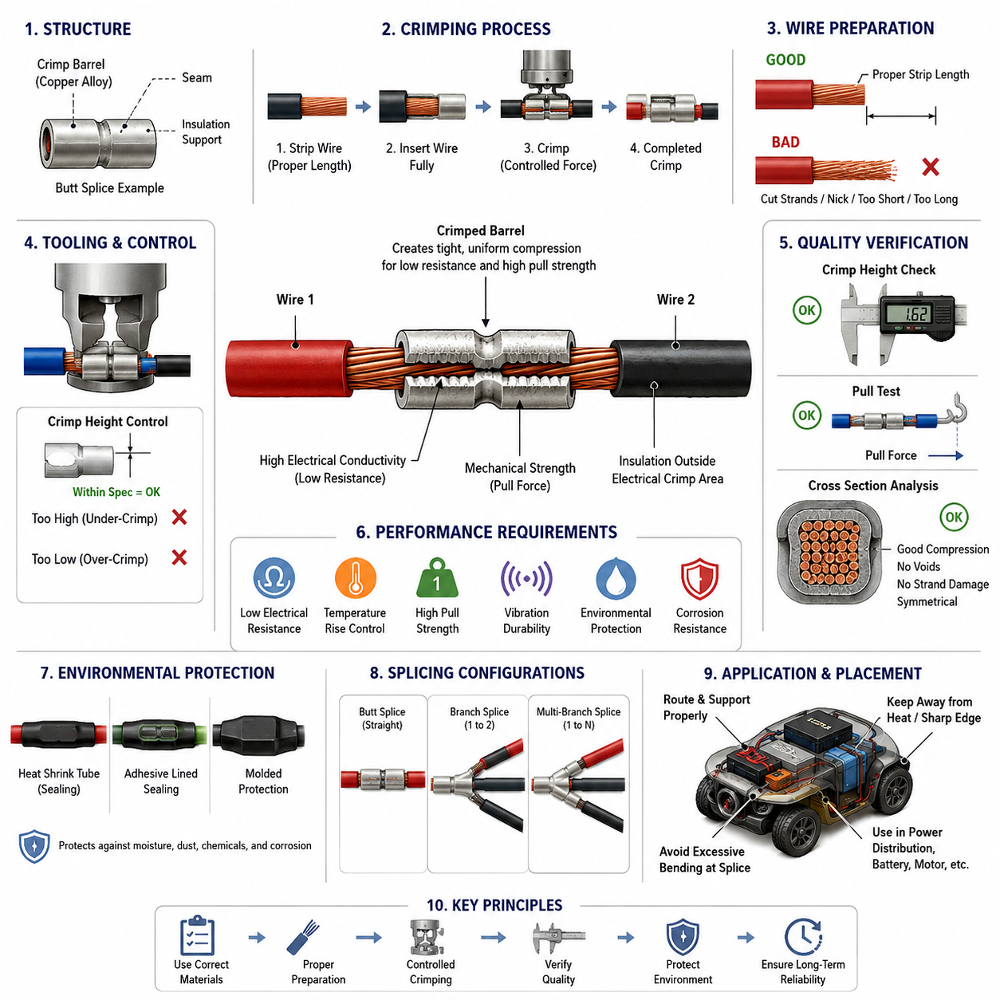
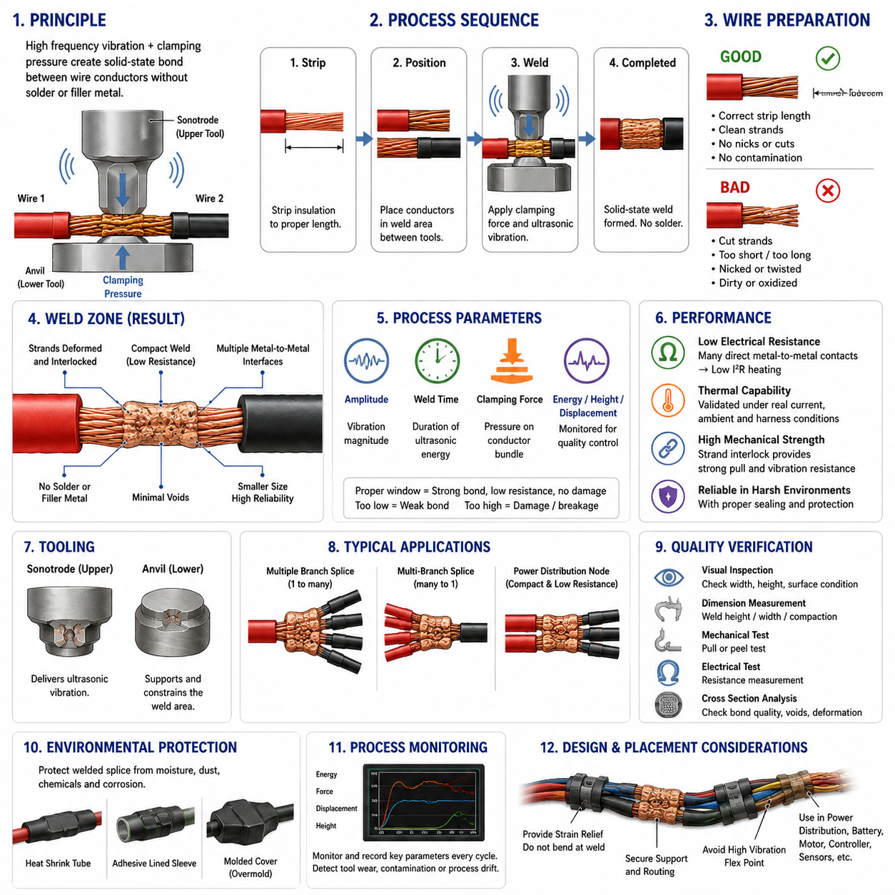
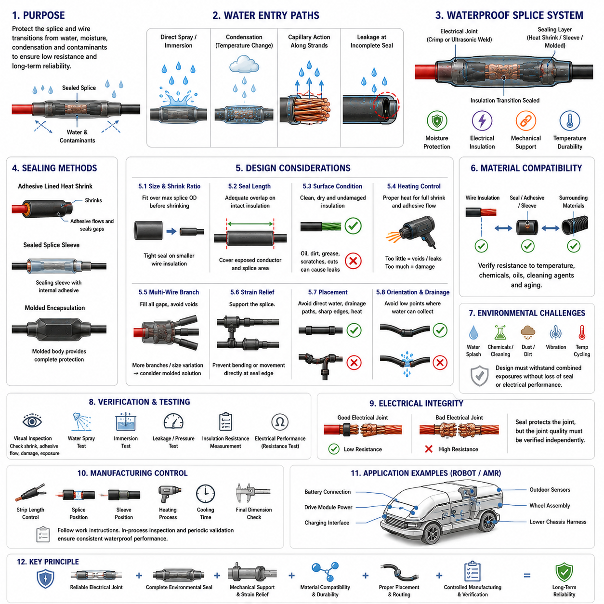
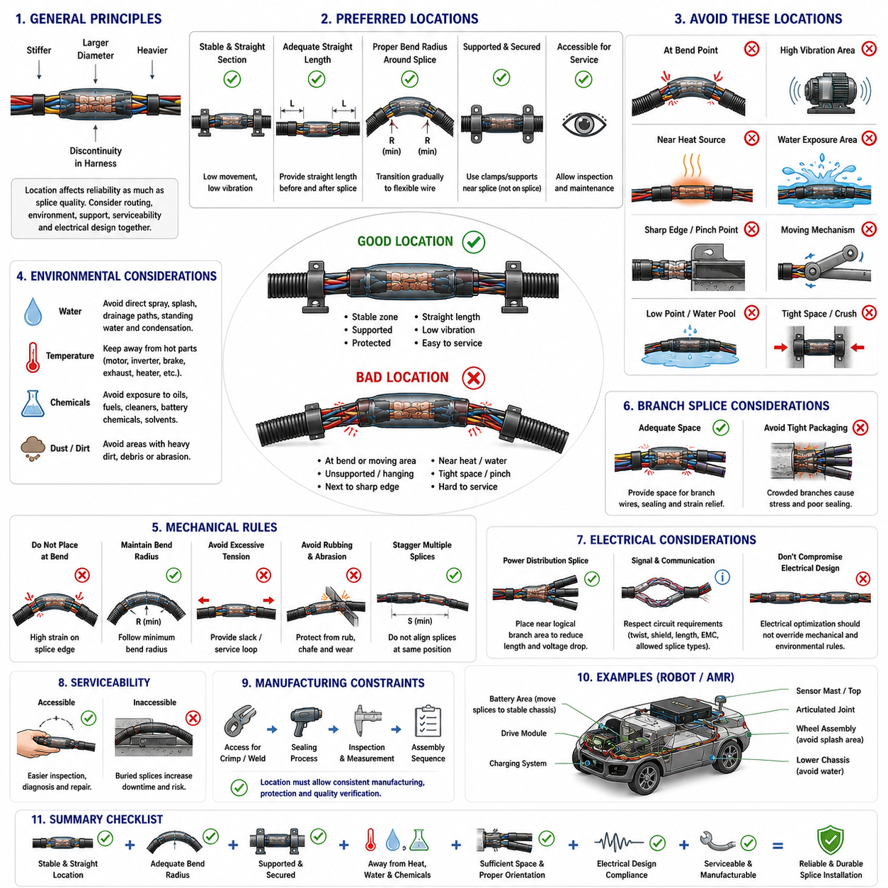
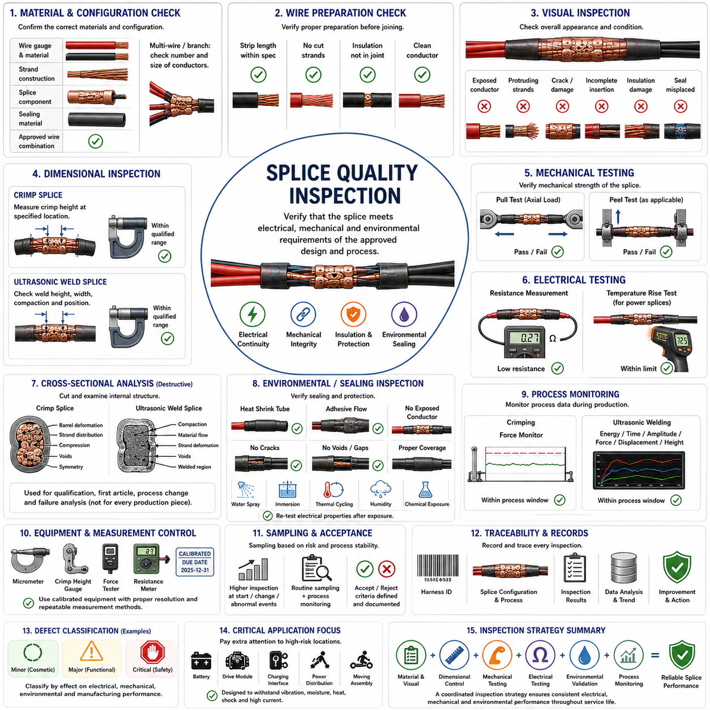

**Volume 02. Wire Harness Engineering**

# Chapter 07. Splice Engineering

## 07.01. Crimp Splice Technology

{width="7.268055555555556in" height="7.268055555555556in"}

압착 스플라이싱(Crimp Splicing)은 피복이 제거된 전선 가닥(Strand) 주위에 금속 스플라이스 배럴(Splice Barrel)을 영구적으로 변형시켜 두 개 이상의 도체(Conductor)를 연결하는 기계적·전기적 접속 방법이다. 와이어 하네스 엔지니어링(Wire Harness Engineering)에서 스플라이스(Splice)는 전류 경로(Current Path)의 일부가 되므로 낮은 전기 저항(Electrical Resistance), 충분한 기계적 유지력(Mechanical Retention), 안정적인 열적 특성(Thermal Behavior), 진동과 환경 노출 조건에서의 장기 신뢰성(Long-Term Reliability)을 확보해야 한다.

일반적인 압착 스플라이스(Crimp Splice)는 전도성 배럴(Conductive Barrel), 적절히 준비된 전선 단부(Wire End), 그리고 필요에 따라 절연 지지 또는 밀봉 시스템(Insulation-Support or Sealing System)으로 구성된다. 구리(Copper) 또는 구리 합금(Copper Alloy) 재질의 스플라이스는 높은 전도성과 구리 도체와의 재료 적합성을 확보하기 위해 널리 사용된다. 압착 과정에서는 납땜(Soldering) 없이 제어된 압축력(Compression Force)을 가하여 도체 가닥들이 서로 그리고 배럴과 밀접하게 접촉하도록 조밀한 금속 접촉 구조를 형성한다.

압착 스플라이스(Crimp Splice)의 전기적 성능(Electrical Performance)은 변형 과정에서 형성되는 접촉 품질(Contact Quality)에 크게 좌우된다. 배럴이 도체 묶음(Conductor Bundle)을 압축하면 표면 피막(Surface Film)이 깨지고 다수의 미세 접촉점(Microscopic Contact Point)이 형성된다. 적절한 압축은 유효 접촉 면적(Effective Contact Area)을 증가시키고 접촉 저항(Interface Resistance)을 감소시키지만, 과도하거나 부족한 압축은 전선 가닥을 손상시키거나 불안정한 접촉 영역을 만들어 시간이 지남에 따라 저항을 증가시킬 수 있다.

따라서 전선 준비(Wire Preparation)는 압착 공정에서 매우 중요한 단계이다. 절연체(Insulation)는 규정된 길이만큼 제거해야 하며, 이 과정에서 도체 가닥이 절단되거나 흠집이 생기거나 긁히거나 지나치게 벌어지지 않아야 한다. 피복이 제거된 도체는 스플라이스 배럴(Splice Barrel) 내부에 완전히 삽입되어야 하며, 스플라이스 설계에서 별도의 절연 지지 구조를 제공하지 않는 한 절연체는 전기적 압착 영역(Electrical Crimp Region) 외부에 위치해야 한다. 잘못된 피복 제거는 유효 도체 단면적을 감소시키고 국부적인 기계적 취약점을 만들 수 있다.

도체 단면적(Conductor Cross-Sectional Area), 스플라이스 배럴 크기(Splice-Barrel Size), 압착 공구 형상(Tooling Geometry)의 관계는 하나의 통합 시스템으로 관리해야 한다. 지나치게 큰 배럴은 충분한 압축을 형성하지 못할 수 있으며, 너무 작은 배럴은 과도한 변형, 전선 가닥 돌출(Strand Extrusion), 기계적 손상을 발생시킬 수 있다. 여러 전선을 하나의 스플라이스로 결합하는 경우에는 승인된 스플라이스 구성(Approved Splice Configuration)을 결정할 때 전체 도체 단면적뿐 아니라 각 전선의 가닥 구조(Strand Construction)도 함께 고려해야 한다.

압착 공구(Crimp Tooling)는 기계적 힘이 배럴 변형으로 어떻게 전달되는지를 결정한다. 생산 규모와 서비스 요구사항에 따라 전용 어플리케이터(Applicator), 프레스(Press), 또는 검증된 수동 공구(Qualified Hand Tool)를 사용할 수 있다. 압착 형상(Crimp Profile), 압착 높이(Crimp Height), 공구 정렬(Tooling Alignment), 인가 압력(Applied Force)은 규정된 범위 안에서 유지되어야 한다. 마모된 공구는 전선과 스플라이스 부품 자체에 변화가 없더라도 압착 결과의 형상을 점진적으로 변화시킬 수 있다.

압착 높이(Crimp Height)는 도체 압축 상태를 간접적으로 나타내기 때문에 가장 유용한 공정 관리 변수(Process-Control Parameter) 중 하나이다. 일반적으로 전선 크기, 스플라이스 배럴, 공구 구성의 각 조합에 대해 규정된 압착 높이 허용 범위(Crimp-Height Window)를 설정한다. 압착 높이가 허용 범위보다 높으면 압축 부족(Under-Compression)을 나타낼 수 있으며, 지나치게 낮으면 과도한 압축(Over-Compression), 전선 가닥 손상(Strand Damage), 또는 비정상적인 재료 변위(Material Displacement)를 의미할 수 있다.

기계적 건전성(Mechanical Integrity)은 일반적으로 인장력 시험(Pull-Force Testing)을 통해 평가한다. 이 시험은 규정된 힘에 도달하거나 접합부가 파손될 때까지 접속된 도체에 축 방향 하중(Axial Load)을 가한다. 인장력은 전기적 성능을 직접 측정하지는 않지만 압축 부족, 불완전한 도체 삽입, 손상된 전선 가닥, 잘못된 부품 사용, 공구 이상 등을 식별하는 데 유용하다. 따라서 전기적 평가(Electrical Evaluation)와 기계적 평가(Mechanical Evaluation)는 상호 보완적인 품질 관리 방법으로 적용해야 한다.

단면 분석(Cross-Sectional Analysis)은 압착부 내부 상태에 대한 보다 상세한 정보를 제공한다. 압착된 배럴의 단면을 가공하여 관찰하면 도체 분포(Conductor Distribution), 압축 균일성(Compression Uniformity), 공극(Void), 전선 가닥 손상, 배럴 변형(Barrel Deformation), 좌우 대칭성(Symmetry)을 확인할 수 있다. 외관 검사(Visual Inspection)만으로 내부 접촉 구조를 확인할 수 없기 때문에 이 방법은 공정 인증(Process Qualification), 공구 설정(Tooling Setup), 엔지니어링 검증(Engineering Validation), 생산 불량 분석에 특히 유용하다.

스플라이스 양단의 전기 저항(Electrical Resistance)은 연결된 전선 구간 자체의 저항에 비해 매우 낮은 수준으로 유지되어야 한다. 과도한 스플라이스 저항은 국부적인 I²R 발열(I²R Heating)을 발생시키며, 이는 산화(Oxidation), 절연체 노화(Insulation Aging), 기계적 열화(Mechanical Degradation)를 가속할 수 있다. 이러한 문제는 배터리 전원선(Battery Feed), 모터 전력 분배(Motor Power Distribution), 충전 회로(Charging Circuit), 히터(Heater)와 같은 고전류 회로에서 특히 중요하며, 매우 작은 추가 저항도 상당한 열을 발생시킬 수 있다.

열적 성능(Thermal Performance)은 전류 용량(Current Capacity)과 함께 고려해야 한다. 실험실 조건에서는 필요한 전류를 전달할 수 있는 스플라이스라도 고밀도 하네스 번들(Harness Bundle), 보호 슬리브(Protective Sleeve), 전선관(Conduit), 또는 환기가 제한된 인클로저(Enclosure) 내부에서는 더 큰 온도 상승(Temperature Rise)이 발생할 수 있다. 따라서 스플라이스 설계는 단순한 정격 도체 용량만이 아니라 실제 사용 환경을 반영한 전류, 주변 온도(Ambient Temperature), 번들링(Bundling), 듀티 사이클(Duty Cycle), 인접 회로 조건에서 평가해야 한다.

분기 스플라이스(Branch Splice)는 하나의 입력 도체가 여러 출력 회로로 전류를 분배하기 때문에 추가적인 설계 고려가 필요하다. 상류 도체(Upstream Conductor)와 스플라이스는 모든 분기 회로의 합산 전류(Combined Current)를 처리할 수 있어야 하며, 각 분기 회로는 해당 전선 크기 및 회로 보호 장치(Circuit Protection)와 적절하게 협조되어야 한다. 또한 스플라이스 내부의 도체 배치는 불균일한 압축이나 특정 전선에 기계적 응력이 집중되는 심각한 불균형을 방지하도록 설계해야 한다.

스플라이스가 수분(Moisture), 응축수(Condensation), 먼지(Dust), 화학물질(Chemicals), 부식성 오염물질(Corrosive Contaminants)에 노출될 가능성이 있는 위치에 설치된다면 환경 보호(Environmental Protection)가 필요하다. 하네스 사용 환경에 따라 압착부에 열수축 튜브(Heat-Shrink Tubing), 접착제 내장형 밀봉재(Adhesive-Lined Sealing Material), 몰드형 보호 구조(Molded Protection), 또는 검증된 다른 밀봉 방법을 적용할 수 있다. 밀봉 시스템은 전기 접합부를 보호하면서 인접한 유연 전선에 과도한 강성이나 응력을 전달하지 않아야 한다.

스플라이스 배치(Splice Placement)는 기계적 신뢰성(Mechanical Reliability)과 밀접하게 관련된다. 제조 품질이 우수한 압착부라도 급격한 굽힘(Severe Bend), 반복 굽힘 위치(Repetitive-Flex Location), 지지되지 않은 하네스 전환부, 고진동 영역(High-Vibration Zone)에 배치되면 고장이 발생할 수 있다. 스플라이스는 국부적으로 강성(Stiffness)과 질량(Mass)을 변화시키므로 배럴 또는 도체 출구에서 반복적인 굽힘이 발생하지 않도록 배선 경로와 지지 구조를 설계해야 한다. 적절한 변형 완화(Strain Relief)는 기계적 하중이 주변 하네스 구조로 분산되도록 한다.

이동 로봇(Mobile Robot)과 자율이동로봇(AMR)에서 압착 스플라이스는 지속적인 진동(Vibration), 가속 및 감속(Acceleration), 충격(Shock), 조향 운동(Steering Motion), 반복적인 열 사이클(Thermal Cycling)에 노출될 수 있다. 따라서 구동 모듈(Drive Module), 배터리(Battery), 전력 분배 장치(Power Distribution Unit), 이동 기구 주변의 스플라이스에는 배선 지지와 경로 설계에 특별한 주의가 필요하다. 고정형 제어반(Stationary Control Cabinet)에 적합한 설계가 지속적으로 움직이는 로봇 플랫폼에서도 동일한 신뢰성을 제공한다고 단순히 가정해서는 안 된다.

궁극적으로 압착 스플라이싱(Crimp Splicing)은 단순한 전선 연결 작업이 아니라 인증되고 관리되는 제조 공정(Qualified Manufacturing Process)으로 취급해야 한다. 신뢰성 높은 생산을 위해서는 규정된 재료, 승인된 전선 조합, 관리된 피복 제거, 검증된 공구, 압착 높이 허용 기준, 기계적 시험, 외관 검사, 주기적인 공정 검증(Process Verification)이 필요하다. 추적 가능한 공정 관리(Traceable Process Control)를 통해 인증 단계에서 입증된 전기적·기계적 특성이 실제 하네스 생산 과정에서도 일관되게 재현되도록 해야 한다.

## 07.02. Ultrasonic Weld Splice

{width="7.268055555555556in" height="7.268055555555556in"}

초음파 용접 스플라이싱(Ultrasonic Weld Splicing)은 납땜(Solder), 용가재(Filler Metal), 별도의 압착 배럴(Crimp Barrel)을 사용하지 않고 여러 전선 도체(Wire Conductor) 사이에 영구적인 전기 접속을 형성하는 고상 접합 공정(Solid-State Joining Process)이다. 와이어 하네스 엔지니어링(Wire Harness Engineering)에서는 여러 구리 도체(Copper Conductor)를 작고 낮은 저항의 접속점으로 통합해야 하며 동시에 높은 전기적·열적·기계적 운전 조건을 만족해야 하는 경우에 특히 유용하다.

이 공정은 제어된 클램핑 압력(Clamping Pressure)과 고주파 기계 진동(High-Frequency Mechanical Vibration)을 함께 사용한다. 피복이 제거된 도체 단부는 초음파 혼(Sonotrode)과 앤빌(Anvil) 사이에 배치되며, 공구가 압력을 가하는 동안 접합 계면과 평행한 방향으로 초음파 진동이 전달된다. 이 과정에서 발생하는 미세한 상대 운동은 표면 산화물과 오염물을 제거하고 인접한 도체 가닥 사이에 직접적인 금속 대 금속 접촉(Metal-to-Metal Contact)이 형성되도록 한다.

융융 용접(Fusion Welding)과 달리 초음파 용접(Ultrasonic Welding)은 도체 재료 전체를 의도적으로 용융시키지 않는다. 접합은 주로 접촉 표면에서 발생하는 마찰 작용(Frictional Interaction), 소성 변형(Plastic Deformation), 국부적인 금속학적 결합(Metallurgical Bonding)을 통해 형성된다. 공정 온도가 도체의 전체 용융 온도보다 낮게 유지되기 때문에 인접한 절연체의 열 손상을 제한하면서도 조밀하고 기계적으로 일체화된 도체 접합부를 만들 수 있다.

전선 준비(Wire Preparation)는 용접 품질(Weld Quality)에 큰 영향을 준다. 절연체(Insulation)는 규정된 길이만큼 제거해야 하며, 노출된 전선 가닥을 절단하거나 흠집을 내거나 지나치게 비틀거나 오염시켜서는 안 된다. 도체 표면의 오일, 수분, 산화물, 공정 잔류물 또는 이물질은 에너지 전달과 접합을 방해할 수 있다. 또한 용접 사이클(Welding Cycle)이 시작되기 전에 피복이 제거된 전선 단부를 규정된 용접 영역에 일관되게 배치해야 한다.

도체 묶음(Conductor Bundle)은 공정 중 압축되어 조밀한 용접 형상(Weld Geometry)을 형성한다. 개별 전선 가닥은 변형되면서 기계적으로 서로 맞물리고 깨끗한 금속 표면들이 밀접하게 접촉한다. 적절하게 제어된 변형은 스플라이스 내부의 공극(Void)을 감소시키고 다수의 병렬 전도 경로(Parallel Conductive Path)를 형성한다. 따라서 형성된 접합부는 기존의 일부 다중 전선 접속 방식보다 작은 체적을 유지하면서 매우 낮은 전기 저항을 제공할 수 있다.

여러 공정 변수(Process Parameter)가 상호작용하여 용접 품질을 결정한다. 초음파 진폭(Ultrasonic Amplitude)은 공구 진동의 크기를 결정하고, 용접 시간(Weld Time)은 초음파 에너지가 인가되는 시간을 결정하며, 클램핑력(Clamping Force)은 도체 묶음에 가해지는 기계적 압력을 제어한다. 용접 장비에 따라 에너지(Energy), 최종 용접 높이(Final Weld Height), 변위(Displacement) 또는 기타 파생 변수를 감시하여 각 생산 사이클이 승인된 공정 윈도(Process Window) 내에서 유지되는지를 판단할 수 있다.

초음파 에너지(Ultrasonic Energy)가 부족하면 도체 가닥이 충분히 접합되지 않아 기계적 유지력(Mechanical Retention)이 약해지고 전기 접촉이 불안정해질 수 있다. 반대로 과도한 에너지는 심한 가닥 변형, 재료 두께 감소, 가닥 파손(Strand Breakage), 또는 용접 영역과 유연한 도체 사이의 전환부 손상을 발생시킬 수 있다. 따라서 공정 개발에서는 원래 전선의 기계적 건전성을 불필요하게 저하시키지 않으면서 충분한 금속학적 결합을 형성하는 조건을 확보해야 한다.

전체 도체 단면적(Total Conductor Cross-Sectional Area)은 초음파 스플라이스(Ultrasonic Splice)를 정의하는 핵심 변수이다. 용접 시스템과 공구는 일반적으로 임의의 전선 조합이 아니라 규정된 합산 도체 단면적 범위를 지원하도록 설계된다. 전선 굵기(Wire Gauge), 가닥 수(Strand Count), 가닥 직경(Strand Diameter), 도체 도금(Conductor Plating), 도체 묶음 배열의 차이는 초음파 에너지가 스플라이스를 통해 전달되는 방식에 영향을 줄 수 있으므로 공정 인증(Process Qualification) 과정에서 고려해야 한다.

공구 형상(Tooling Geometry) 역시 중요하다. 초음파 혼(Sonotrode)은 초음파 진동을 도체 묶음으로 전달하며 앤빌(Anvil)은 반대쪽 표면을 지지하고 구속한다. 공구 표면의 패턴은 기계적 결합을 향상시키고 용접 중 도체의 이동을 방지할 수 있다. 공구의 마모, 오염, 정렬 오차 또는 표면 손상은 에너지 전달과 용접 형상을 변화시킬 수 있으므로 주기적인 공구 검사와 유지보수는 생산 공정 관리의 중요한 요소이다.

적절하게 제조된 초음파 스플라이스의 주요 장점 중 하나는 우수한 전기적 성능(Electrical Performance)이다. 용접된 도체 덩어리에는 다수의 직접적인 금속 대 금속 접촉 계면이 형성되며 별도의 스플라이스 배럴에서 발생하는 추가적인 전기적 접촉 계면이 제거된다. 낮은 접합 저항(Junction Resistance)은 국부적인 I²R 발열(I²R Heating)을 감소시키므로 배터리 전력 분배, 모터 전력 회로, 충전 시스템, 전력 분배 장치(Power Distribution Unit), 기타 고전류 하네스 분기 회로에 특히 유리하다.

그러나 열적 특성(Thermal Behavior)은 실제 하네스 운전 조건에서 검증해야 한다. 스플라이스를 통과하는 전류는 유효 저항에 따라 열을 발생시키며, 주변 전선, 하네스 번들링(Harness Bundling), 슬리브(Sleeve), 전선관(Conduit), 주변 온도(Ambient Temperature), 공기 흐름은 방열 성능에 영향을 준다. 따라서 단순히 공칭 도체 전류 용량에 의존하기보다 실제 연속 전류(Continuous Current)와 과도 전류(Transient Current)를 반영한 조건에서 스플라이스의 온도 상승이 허용 범위에 있는지를 검증해야 한다.

기계적 성능(Mechanical Performance)을 확보하기 위해서는 단단한 용접부와 유연한 전선 사이의 전환 영역에 주의해야 한다. 용접 영역은 상대적으로 강성이 높으므로 바로 인접한 위치에서 반복 굽힘이 발생하면 소수의 도체 가닥에 변형률(Strain)이 집중될 수 있다. 특히 진동, 조향 운동, 가속, 반복적인 기계 운동에 노출되는 로봇 시스템에서는 하네스 경로 설계, 변형 완화(Strain Relief), 클램프(Clamp), 보호 피복을 이용하여 용접부가 반복 굽힘 지점(Flex Point)이 되지 않도록 해야 한다.

분기 접속(Branch Connection)은 초음파 용접의 대표적인 적용 분야로, 여러 도체를 하나의 전기적으로 연속된 노드(Node)로 접합할 수 있다. 하나의 전원 도체를 여러 출력 분기로 연결하거나 여러 도체를 하나의 분배 지점으로 통합할 수 있다. 전기 설계에서는 상류 도체(Upstream Conductor)와 용접 접합부가 전체 합산 전류(Combined Current)를 처리할 수 있도록 해야 하며, 하류의 각 분기는 해당 전선 굵기와 회로 보호 장치(Circuit Protection)에 적절하게 협조되어야 한다.

품질 검증(Quality Verification)에는 외관 검사(Visual Inspection), 치수 측정(Dimensional Measurement), 기계적 시험(Mechanical Testing), 전기적 측정(Electrical Measurement), 파괴 분석(Destructive Analysis)을 조합하여 사용할 수 있다. 용접 폭(Weld Width), 높이, 압축 정도(Compaction), 도체 위치, 표면 상태는 공정 안정성을 판단하는 유용한 지표이다. 인장 시험(Pull Testing)이나 박리 시험(Peel Testing)은 기계적 건전성을 평가하며, 저항 측정은 전기적 연속성을 확인하는 데 사용된다. 단면 분석(Cross-Sectional Analysis)은 내부 접합 상태, 가닥 변형, 공극, 비정상적인 재료 흐름을 확인할 수 있다.

현대적인 초음파 용접 장비(Ultrasonic Welding Equipment)는 각 생산 사이클에 대한 유용한 공정 모니터링 데이터(Process-Monitoring Data)를 제공할 수 있다. 전달 에너지(Delivered Energy), 용접 시간, 변위, 최종 높이, 힘(Force), 장비별 품질 지표를 인증된 허용 기준과 비교할 수 있다. 이러한 값의 통계적 모니터링(Statistical Monitoring)을 통해 공구의 점진적인 마모, 도체 편차, 오염, 공정 드리프트(Process Drift)를 심각한 하네스 품질 문제로 발전하기 전에 탐지할 수 있다.

스플라이스가 수분(Moisture), 응축수(Condensation), 먼지(Dust), 화학물질(Chemicals), 부식성 오염물질(Corrosive Contamination)에 노출되는 경우에는 일반적으로 용접 후 환경 보호(Environmental Protection)를 추가한다. 열수축 튜브(Heat-Shrink Tubing), 접착제 내장형 밀봉 부품(Adhesive-Lined Sealing Component), 몰드형 커버(Molded Cover) 또는 동등한 보호 구조를 이용하여 용접된 도체를 외부 환경으로부터 격리할 수 있다. 보호 구조는 적절한 기계적 지지를 제공하면서도 급격한 강성 변화로 인해 굽힘 응력이 도체 출구에 직접 집중되지 않도록 설계해야 한다.

자율이동로봇(AMR)과 기타 이동 로봇 플랫폼(Mobile Robotic Platform)에서 초음파 용접 스플라이스는 배터리 전력을 구동 모듈(Drive Module), 컴퓨팅 시스템(Computing System), 센서(Sensor), 제어기(Controller), 보조 부하(Auxiliary Load)로 분배해야 하는 소형 전력 분배 노드(Compact Power-Distribution Node)에 특히 유용하다. 낮은 저항과 작은 형상은 하네스 체적과 전압 강하(Voltage Drop)를 줄이는 데 도움이 되지만, 설치 설계에서는 진동, 열 사이클(Thermal Cycling), 정비 접근성(Service Accessibility), 환경 밀봉(Environmental Sealing), 이동 장비의 반복 운동을 함께 고려해야 한다.

따라서 초음파 용접 스플라이싱(Ultrasonic Weld Splicing)은 단순히 압착 접속(Crimping)을 대체하는 방법이 아니라 관리된 제조 기술(Controlled Manufacturing Technology)로 취급해야 한다. 신뢰성 있는 적용을 위해서는 인증된 도체 조합, 관리된 피복 제거와 위치 결정, 검증된 용접 변수, 적절하게 유지관리된 공구, 명확한 합격 기준(Acceptance Limit), 주기적인 공정 검증(Process Verification)이 필요하다. 이러한 요소를 체계적으로 관리하면 초음파 용접은 첨단 로봇 와이어 하네스에서 작고 낮은 저항을 가지며 기계적으로 견고하고 반복 생산성이 높은 다중 전선 접속부를 구현할 수 있다.

## 07.03. Waterproof Splice Design

{width="7.268055555555556in" height="7.268055555555556in"}

방수 스플라이스 설계(Waterproof Splice Design)는 물, 습기, 응축수(Condensation), 오염물질이 노출된 도체 접속 계면에 도달하지 못하도록 방지함으로써 전선 스플라이스의 전기적·기계적 기능을 확장한다. 와이어 하네스 엔지니어링(Wire Harness Engineering)에서 밀봉(Sealing)은 나중에 추가하는 부속 기능이 아니라 스플라이스 시스템의 일부로 취급해야 한다. 수분 침투(Moisture Intrusion)는 저항 증가, 부식 촉진, 절연체 손상을 발생시키며 결국 간헐적 또는 영구적인 회로 고장으로 이어질 수 있기 때문이다.

방수 스플라이스(Waterproof Splice)는 일반적으로 신뢰성 높은 전기 접속부와 전용 환경 차단 구조(Environmental Barrier)를 결합한다. 내부 접속은 압착 스플라이싱(Crimp Splicing)이나 초음파 용접(Ultrasonic Welding)으로 형성할 수 있으며, 외부 보호에는 접착제 내장형 열수축 튜브(Adhesive-Lined Heat-Shrink Tubing), 밀봉 스플라이스 슬리브(Sealed Splice Sleeve), 몰드형 캡슐화(Molded Encapsulation) 또는 동등한 기술을 사용할 수 있다. 밀봉 구조는 도체 접합부뿐 아니라 각각의 절연 전선이 보호 영역으로 진입하는 전환부까지 격리해야 한다.

물은 여러 경로를 통해 스플라이스 내부로 침투할 수 있다. 직접적인 물 분사나 침수(Immersion)는 불완전한 밀봉의 개구부를 통해 침투할 수 있으며, 밀폐된 하네스 영역에서 온도가 변화하면 응축수가 형성될 수 있다. 또한 수분은 모세관 현상(Capillary Action)을 통해 도체 가닥을 따라 이동하여 멀리 떨어진 침투 지점에서 절연체 내부를 통해 스플라이스까지 도달할 수도 있다. 따라서 방수 설계에서는 외부 침투뿐 아니라 전선 길이 방향의 수분 이동(Longitudinal Moisture Migration)도 고려해야 한다.

접착제 내장형 열수축 튜브(Adhesive-Lined Heat-Shrink Tubing)는 비교적 작은 공간에서 전기 절연(Electrical Insulation), 환경 밀봉(Environmental Sealing), 기계적 지지(Mechanical Support)를 동시에 제공할 수 있기 때문에 널리 사용된다. 가열 과정에서 외부 폴리머 튜브(Polymer Tube)는 스플라이스 주위로 수축하고 내부 접착제는 연화되어 전선 절연체 주변의 틈으로 흘러 들어간다. 냉각 후에는 접착제가 연속적인 차단층을 형성하여 스플라이스와 주변 환경 사이에 존재할 수 있는 누설 경로(Leakage Path)를 감소시킨다.

밀봉 부품의 치수는 전체 스플라이스 형상과 일치해야 한다. 수축 전 슬리브(Sleeve)는 스플라이스의 최대 직경을 통과할 수 있을 만큼 충분히 커야 하지만, 수축 후에는 양쪽의 더 작은 전선 절연체에 밀착되어야 한다. 부적절한 수축비(Shrink Ratio)는 작은 전선 주변에 틈을 남기거나 과도한 기계적 압축을 발생시킬 수 있으므로 부품 선정에서는 스플라이스 직경과 개별 전선 크기를 모두 고려해야 한다.

밀봉 길이(Seal Length) 역시 중요하다. 환경 보호 성능은 손상되지 않은 전선 절연체와 충분한 중첩 길이(Overlap)를 확보하는 것에 좌우되기 때문이다. 보호 슬리브는 노출된 도체와 스플라이스 영역을 넘어 연장되어 깨끗하고 손상되지 않은 절연체 표면에서 밀봉이 이루어져야 한다. 밀봉 중첩 길이가 지나치게 짧으면 진동, 굽힘, 치수 공차(Dimensional Tolerance), 접착제 이동 등에 의해 전기 접속부 가까이에 누설 경로가 형성될 수 있다.

표면 상태(Surface Condition)는 밀봉 신뢰성에 큰 영향을 미친다. 밀봉 작업 전에 전선 절연체는 깨끗해야 하며 오일, 그리스, 먼지, 이형제(Release Agent), 공정 잔류물이 없어야 한다. 오염물질은 접착제가 절연체 표면을 충분히 적시고 결합하는 것을 방해할 수 있다. 절연체 자체에도 손상이 없어야 하며, 밀봉 아래에 존재하는 절단부, 긁힘 또는 변형은 물이 침투하는 통로나 기계적 고장 지점이 될 수 있다.

열수축 밀봉(Heat-Shrink Sealing)을 사용하는 경우 가열 공정을 제어해야 한다. 온도나 가열 시간이 부족하면 완전한 수축과 접착제 흐름이 이루어지지 않아 내부 공극(Void)이나 전선 주변의 불완전한 밀봉이 남을 수 있다. 반대로 과도한 가열은 절연체를 손상시키거나 스플라이스 보호 구조를 변형시키고 접착제를 열화시키거나 과도한 재료 흐름을 발생시킬 수 있다. 따라서 인증된 가열 공정(Qualified Heating Process)에서는 온도, 노출 시간, 사용 장비, 완성 상태의 허용 외관을 명확하게 정의해야 한다.

다중 전선 분기 스플라이스(Multi-Wire Branch Splice)는 단순한 일대일 접속보다 방수 처리가 어렵다. 하나의 스플라이스 끝에서 여러 전선이 분기되면 인접한 절연체 사이에 골과 불규칙한 공간이 형성된다. 접착제 또는 밀봉 재료는 공극을 남기지 않고 이러한 형상을 완전히 채워야 한다. 분기 전선의 수가 증가하거나 전선 직경 차이가 커질수록 일반적인 열수축 튜브보다 몰드형 또는 특별히 설계된 밀봉 부품이 더 적합할 수 있다.

기계적 변형 완화(Mechanical Strain Relief)와 방수는 함께 설계해야 한다. 밀봉된 스플라이스는 일반적으로 주변 전선보다 강성이 높고 무거워지므로 전환 영역에 굽힘 응력(Bending Stress)이 집중될 수 있다. 따라서 밀봉 재료의 가장자리에서 반복적인 움직임이 직접 발생하지 않도록 하네스를 지지해야 한다. 클램프(Clamp), 배선 경로 형상(Routing Geometry), 서비스 루프(Service Loop), 보호 피복을 이용하여 기계적 하중을 밀봉된 접속부에서 떨어진 위치로 분산할 수 있다.

환경 밀봉이 적용되었다고 해서 적절한 스플라이스 배치(Splice Placement)의 필요성이 없어지는 것은 아니다. 가능한 경우 스플라이스는 직접적인 물 분사, 배수 경로(Drainage Path), 바퀴에서 발생하는 물 튀김(Wheel Splash), 고인 물, 화학물질 노출, 날카로운 모서리, 심한 열원으로부터 떨어진 위치에 배치해야 한다. 물이 자연스럽게 스플라이스 주변에 모이지 않도록 하네스를 배선하면 밀봉 시스템에 가해지는 부담을 줄이고 장기 신뢰성을 향상시킬 수 있다.

밀봉된 스플라이스의 방향(Orientation)은 물의 축적과 배수에도 영향을 줄 수 있다. 하네스 형상은 액체가 스플라이스 주변에 장시간 머무르는 저점(Low Point)이나 포켓(Pocket)이 형성되지 않도록 설계해야 한다. 불가피하게 물에 노출되는 경우 보호 설계는 접착력 저하나 균열 없이 반복적인 습윤 및 건조 사이클(Wetting and Drying Cycle)을 견딜 수 있어야 한다. 따라서 배수(Drainage)와 하네스 배선은 방수 전기 설계의 상호 보완적인 요소이다.

전선 절연체, 밀봉 접착제(Sealing Adhesive), 열수축 재료, 보호 슬리브, 주변 하네스 부품 사이의 재료 적합성(Material Compatibility)을 검증해야 한다. 서로 다른 폴리머(Polymer)는 온도, 화학물질, 오일, 세정제, 장기 노화에 서로 다르게 반응한다. 한 종류의 절연 재료에는 효과적으로 접착되는 밀봉 재료가 다른 재료에서는 약한 결합력을 나타낼 수 있으므로 재료 조합을 하나의 완전한 시스템으로 인증해야 한다.

온도 사이클링(Temperature Cycling)도 중요한 설계 과제이다. 도체, 절연체, 접착제, 보호용 폴리머는 서로 다른 열팽창 특성(Thermal Expansion Characteristics)을 가지기 때문이다. 반복적인 가열과 냉각은 접착 계면에 내부 응력을 발생시키고 점진적으로 미세한 분리 경로를 만들 수 있다. 따라서 방수 스플라이스 인증(Waterproof Splice Qualification)은 초기 밀봉 성능뿐 아니라 실제 사용 조건을 반영한 온도 사이클과 기계적 노화(Mechanical Aging) 이후의 밀봉 건전성도 평가해야 한다.

자율이동로봇(AMR)과 이동 로봇(Mobile Robot)에서는 배터리, 구동 모듈(Drive Module), 충전 인터페이스(Charging Interface), 실외 센서, 휠 어셈블리(Wheel Assembly), 하부 섀시 하네스(Lower Chassis Harness) 주변에서 방수 스플라이스가 필요할 수 있다. 이러한 위치는 물 튀김, 세정액, 먼지, 진동, 온도 사이클, 기계적 충격에 동시에 노출될 수 있다. 따라서 스플라이스 보호 구조는 하네스의 유연성, 배선, 정비성(Serviceability), 전기적 성능을 저해하지 않으면서 환경 밀봉 성능을 제공해야 한다.

방수 스플라이스의 품질 검증(Quality Verification)은 완성된 밀봉 상태의 검사와 목표 사용 환경에 적합한 시험을 포함해야 한다. 외관 검사(Visual Inspection)를 통해 불완전한 수축, 부족한 접착제 흐름, 손상된 튜브, 노출된 도체, 비정상적인 변형을 확인할 수 있다. 시스템 요구사항에 따라 물 분사 시험(Water Spray Test), 침수 시험(Immersion Test), 압력 관련 누설 시험(Leakage Test), 절연 저항 측정(Insulation Resistance Measurement), 환경 노출 후 전기적 평가를 추가할 수 있다.

전기 저항(Electrical Resistance)은 밀봉 성능과 독립적으로 측정해야 한다. 방수 처리된 외부 구조는 결함이 있는 내부 스플라이스를 보완할 수 없기 때문이다. 도체 접속부가 먼저 전기적·기계적 요구사항을 만족해야 하며, 이후 환경 보호 구조가 사용 수명 동안 이러한 특성을 유지해야 한다. 이러한 기능 분리는 외관상 정상적으로 밀봉된 조립체가 전기적으로 취약한 접속부를 가리는 문제를 방지하는 데 도움이 된다.

제조 관리(Manufacturing Control)는 특히 중요하다. 많은 방수 결함이 부품 설계 자체보다 공정 편차(Process Variation)에서 발생하기 때문이다. 피복 제거 길이(Strip Length), 스플라이스 위치, 슬리브 위치, 가열 조건, 접착제 흐름, 냉각 시간, 최종 치수 등을 작업 지침서(Work Instruction)에 명확하게 정의해야 한다. 생산 검사와 주기적인 검증을 통해 밀봉 공정이 엔지니어링 인증 단계에서 확립된 상태를 일관되게 재현하는지 확인해야 한다.

궁극적으로 방수 스플라이스 설계(Waterproof Splice Design)는 전기적 접속(Electrical Connection), 환경 밀봉(Environmental Sealing), 기계적 지지(Mechanical Support), 재료 적합성(Material Compatibility), 배선 경로(Routing), 제조 관리(Manufacturing Control)를 통합한 시스템으로 접근해야 한다. 견고한 설계는 진동과 온도 사이클 환경에서도 낮은 전기 저항과 기계적 건전성을 유지하면서 수분이 도체에 도달하는 것을 방지한다. 이러한 시스템 수준 접근법(System-Level Approach)은 실외 및 이동 로봇 플랫폼에 사용되는 신뢰성 높은 와이어 하네스를 구현하는 데 필수적이다.

## 07.04. Splice Location Rules

{width="7.268055555555556in" height="7.268055555555556in"}

스플라이스 위치(Splice Location)는 기계적·전기적으로 건전한 스플라이스라도 부적절한 환경에 설치되면 고장이 발생할 수 있기 때문에 하네스 설계(Harness Design)의 핵심적인 결정 요소이다. 스플라이스는 주변 전선과 비교하여 강성(Stiffness), 직경(Diameter), 질량(Mass), 유연성(Flexibility)에 국부적인 불연속을 만든다. 따라서 스플라이스 위치는 배선 경로(Routing), 환경 보호(Environmental Protection), 기계적 지지(Mechanical Support), 정비성(Serviceability), 전기 아키텍처(Electrical Architecture)와 함께 결정해야 한다.

선호되는 스플라이스 위치는 일반적으로 움직임, 굽힘, 진동, 열, 수분, 기계적 하중이 상대적으로 낮은 안정적인 하네스 구간이다. 주변 하네스에는 도체가 급격하게 굽어지지 않으면서 스플라이스와 보호 피복을 지지할 수 있는 충분한 직선 길이(Straight Length)가 확보되어야 한다. 기계적으로 안정된 영역(Mechanically Quiet Region)을 선택하면 도체 접합부와 절연 전환부(Insulation Transition) 모두에 작용하는 응력을 감소시킬 수 있다.

스플라이스는 일반적으로 굽힘 지점(Bend Point)에 직접 배치하지 않아야 한다. 압착, 용접 또는 환경 밀봉된 스플라이스는 일반 전선 구간보다 상당히 높은 강성을 가지며, 가장자리 근처에서 반복적인 굽힘이 발생하면 유연한 도체가 단단한 접합부로 들어가는 영역에 변형률(Strain)이 집중된다. 이러한 국부적인 변형이 장기간 반복되면 전선 가닥 피로(Strand Fatigue), 절연체 균열, 전기 저항 증가 또는 최종적인 도체 파손으로 이어질 수 있다.

따라서 모든 스플라이스 주변에서는 최소 굽힘 반경(Minimum Bend Radius) 요구사항을 고려해야 한다. 하네스는 상대적으로 단단한 스플라이스 영역에서 유연한 전선으로 점진적으로 전환되어야 하며, 접속부 직후에 방향이 급격하게 변해서는 안 된다. 특히 열수축 튜브(Heat-Shrink Tubing), 몰드형 보호 구조(Molded Protection), 여러 분기 전선으로 인해 조립체의 유효 직경과 강성이 증가하는 경우 이러한 형상을 확보하기 위해 추가적인 배선 공간이 필요할 수 있다.

가능하다면 고진동 영역(High-Vibration Zone) 역시 피해야 한다. 모터(Motor), 기어박스(Gearbox), 휠 어셈블리(Wheel Assembly), 펌프(Pump), 컴프레서(Compressor), 액추에이터(Actuator), 구조물 연결부 근처에서는 지속적인 진동이 하네스로 전달될 수 있다. 이러한 영역에 스플라이스를 설치해야 하는 경우에는 스플라이스 자체의 질량이 독립적으로 움직이면서 반복 하중(Cyclic Load)을 도체 출구로 전달하지 않도록 기계적으로 지지해야 한다.

하네스 클램프(Harness Clamp)와 지지 구조도 스플라이스를 고려하여 배치해야 한다. 클램프는 스플라이스 주변의 하네스를 안정화할 수 있지만 전기 접합부 바로 위에 설치하면 과도한 압축을 발생시키거나 환경 보호 구조를 방해할 수 있다. 지지 구조는 하네스의 움직임을 억제하면서도 스플라이스와 밀봉 부품(Sealing Component)이 기계적으로 손상되지 않고 의도하지 않은 집중 하중(Concentrated Load)을 받지 않도록 구성해야 한다.

스플라이스는 날카로운 모서리(Sharp Edge), 끼임 지점(Pinch Point), 이동 기구(Moving Mechanism), 인접 구조물과 하네스가 마찰할 수 있는 위치에서 떨어져 있어야 한다. 스플라이스의 증가된 직경 때문에 기존 전선 묶음에서는 충분했던 간극(Clearance)이 부족해질 수 있다. 따라서 패키징 분석(Packaging Analysis)에서는 공칭 전선 직경만이 아니라 최대 스플라이스 외형, 보호 슬리브, 제조 공차(Manufacturing Tolerance), 하네스 움직임, 주변 부품까지 함께 고려해야 한다.

고온 영역(High-Temperature Region)은 특별한 주의가 필요하다. 추가적인 스플라이스 저항은 국부적인 열을 발생시킬 수 있으며 동시에 외부 열원이 도체 온도를 상승시킬 수 있기 때문이다. 스플라이스는 가능한 한 모터, 인버터(Inverter), 제동 부품(Braking Component), 히터(Heater), 배기 관련 표면, 기타 고온 구조물에서 이격해야 한다. 충분한 이격이 어려운 경우에는 열 차폐(Thermal Shielding), 고온용 재료 또는 스플라이스 위치 변경이 필요할 수 있다.

물 노출(Water Exposure) 역시 중요한 위치 선정 기준이다. 방수 스플라이스 기술(Waterproof Splice Technology)을 적용하더라도 접합부는 가능한 한 직접적인 물 분사, 휠 스플래시(Wheel Splash), 배수 경로(Drainage Path), 고인 물, 응축수가 모이는 지점, 빈번하게 세척되는 영역을 피해야 한다. 환경 밀봉(Environmental Sealing)은 불가피한 노출에 대한 방어 수단으로 사용해야 하며, 가장 심한 수분 침투 위치에 스플라이스를 배치하기 위한 근거로 사용해서는 안 된다.

하네스 방향(Orientation)은 스플라이스가 액체의 자연적인 집수 지점(Collection Point)이 되지 않도록 설계해야 한다. 배선 경로의 낮은 부분에는 물이 남아 있을 수 있으며, 수직 전선 구간에서는 표면 흐름이나 모세관 현상(Capillary Mechanism)을 통해 액체가 스플라이스 방향으로 이동할 수 있다. 가능한 경우 배선은 물이 접속부에서 멀어지는 방향으로 배수되도록 하고, 밀봉 전환부가 반복적으로 축적된 수분에 노출되는 형상을 피해야 한다.

화학물질 노출(Chemical Exposure)도 위치 선정에 영향을 주어야 한다. 세정제(Cleaning Agent), 유압유(Hydraulic Fluid), 윤활유(Lubricant), 배터리 관련 화학물질, 연료(Fuel), 산업 오염물질은 절연체, 접착제, 열수축 재료 또는 몰드형 보호 구조를 열화시킬 수 있다. 이러한 물질의 발생원 근처에 스플라이스를 설치하는 경우 검증된 재료 적합성(Material Compatibility)과 환경 보호가 필요하지만, 오염원으로부터 물리적으로 이격하는 것이 우선적인 설계 대책이다.

분기 스플라이스(Branch Splice)는 여러 출력 전선으로 인해 국부적인 구조가 더 크고 유연성이 낮아지므로 충분한 패키징 공간이 필요하다. 분기 형상은 각각의 도체가 심한 굽힘, 교차 또는 인장 하중(Tensile Load) 없이 스플라이스에서 빠져나갈 수 있도록 해야 한다. 밀봉 재료와 변형 완화(Strain Relief)를 위한 공간도 필요하다. 다중 전선 분기부를 좁은 배선 채널에 강제로 삽입하면 정상적으로 제조된 접합부의 신뢰성도 저하될 수 있다.

스플라이스 위치는 하네스 분기점(Breakout Point)과도 조정되어야 한다. 스플라이스를 분기점 바로 옆에 배치하면 좁은 영역에 강성 변화, 전선 분리, 굽힘, 인장 하중이 동시에 집중될 수 있다. 전기 접합부와 기계적 분기점 사이에 적절한 거리를 확보하면 하중이 점진적으로 분산되며 하네스의 제조, 검사, 보호, 설치도 보다 용이해진다.

전기 아키텍처(Electrical Architecture) 역시 스플라이스 배치에 영향을 줄 수 있다. 전력 분배 스플라이스(Power-Distribution Splice)는 도체 길이, 전압 강하(Voltage Drop), 전류 부하(Current Loading), 퓨즈 협조(Fuse Coordination), 하류 분기 배선이 의도한 회로 설계와 일치하도록 배치해야 한다. 논리적인 분기 영역 가까이에 분배 스플라이스를 배치하면 불필요한 도체 길이를 줄일 수 있지만, 전기적 최적화가 기계적 또는 환경적 제한 조건보다 우선해서는 안 된다.

신호 및 통신 회로(Signal and Communication Circuit)는 스플라이스 형상이 전기적 특성을 변화시킬 수 있으므로 추가적인 고려가 필요하다. 민감한 센서 라인(Sensor Line), 차동 통신 쌍(Differential Communication Pair), 차폐 케이블(Shielded Cable), 고속 네트워크(High-Speed Network)는 허용 가능한 스플라이스 또는 꼬임과 차폐가 중단될 수 있는 길이에 대해 별도의 제한을 가질 수 있다. 따라서 전력선에 적용하는 규칙을 모든 회로에 동일하게 적용하지 말고 해당 회로의 전기적 요구사항을 반영하여 스플라이스 위치를 결정해야 한다.

스플라이스에 접근할 필요가 있는 경우에는 정비성(Serviceability)을 고려해야 한다. 대형 하네스 묶음 내부 깊숙한 곳, 접근하기 어려운 섀시 공간, 영구적으로 밀폐된 구조 내부에 스플라이스를 설치하면 고장 진단(Fault Diagnosis)과 수리가 어려워질 수 있다. 그러나 접근성을 확보하기 위해 스플라이스를 외부에 노출되거나 기계적으로 취약한 영역에 배치해서는 안 된다. 설계에서는 보호, 패키징, 검사, 실제 유지보수 요구사항 사이의 균형을 확보해야 한다.

제조 제약조건(Manufacturing Constraint) 역시 허용 가능한 스플라이스 위치에 영향을 준다. 하네스 조립 공정에서는 압착(Crimping), 초음파 용접(Ultrasonic Welding), 밀봉, 검사, 치수 검증을 수행할 수 있는 충분한 작업 접근성을 확보해야 한다. 로봇이나 차량에서 이론적으로 이상적인 위치라도 스플라이스를 일관되게 제조하거나 보호하기 어렵다면 생산에 적합하지 않을 수 있다. 따라서 하네스 보드 레이아웃(Harness-Board Layout)과 조립 순서를 최종 설치 배선과 함께 검토해야 한다.

여러 개의 스플라이스는 일반적으로 하네스 묶음의 동일한 길이 방향 위치에 집중해서 배치하지 않는 것이 좋다. 여러 접합부를 한 위치에 중첩하면 국부적으로 직경과 강성이 크게 증가하여 배선과 보호 피복 적용이 어려워질 수 있다. 스플라이스 위치를 길이 방향으로 엇갈리게 배치(Staggering)하면 패키징 체적과 기계적 불연속을 하네스 전체에 분산할 수 있으며, 필요한 이격 거리는 하네스 구조와 설치 제약조건에 따라 정의해야 한다.

이동 로봇(Mobile Robot)과 자율이동로봇(AMR)에서는 구동 모듈(Drive Module), 조향 어셈블리(Steering Assembly), 서스펜션 인터페이스(Suspension Interface), 배터리, 충전 시스템(Charging System), 센서 마스트(Sensor Mast), 관절형 기구(Articulated Mechanism) 주변에서 스플라이스 위치 엔지니어링이 특히 중요하다. 이러한 영역에서는 진동, 반복 운동, 물 노출, 열, 제한된 패키징 공간이 동시에 존재할 수 있다. 가능하면 스플라이스를 안정적인 섀시 영역으로 이동시키고 적절하게 지지된 유연한 하네스 구간을 통해 움직이는 장비와 연결하는 것이 바람직하다.

최종 스플라이스 위치는 2차원 배선도(Two-Dimensional Wiring Diagram)만을 기준으로 결정하는 것이 아니라 완전한 하네스 설치 상태에서 검증해야 한다. 엔지니어는 실제 배선 경로, 굽힘 반경, 간극, 진동원(Vibration Source), 온도, 물 노출, 지지 지점(Support Point), 정비 접근성, 조립 순서를 종합적으로 평가해야 한다. 견고한 스플라이스 위치란 로봇의 전체 운용 수명 동안 접합부가 전기적으로 안정되고, 기계적으로 보호되며, 환경적으로 관리되고, 제조 가능하며, 정비 가능한 상태를 유지할 수 있는 위치이다.

## 07.05. Splice Quality Inspection

{width="7.268055555555556in" height="7.268055555555556in"}

스플라이스 품질 검사(Splice Quality Inspection)는 전기 스플라이스(Electrical Splice)가 승인된 설계 및 공정 요구사항에 따라 제조되었는지를 검증하는 체계적인 과정이다. 스플라이스는 와이어 하네스(Wire Harness)의 전류 경로(Current Path)에 영구적으로 포함되므로 외관만 확인해서는 안 되며, 전기적 연속성(Electrical Continuity), 기계적 건전성(Mechanical Integrity), 도체 상태, 형상, 절연 보호, 환경 밀봉(Environmental Sealing)을 종합적으로 평가해야 한다.

검사는 올바른 재료와 구성(Configuration)이 사용되었는지를 확인하는 것에서 시작한다. 전선 굵기(Wire Gauge), 도체 재료(Conductor Material), 가닥 구조(Strand Construction), 스플라이스 부품(Splice Component), 밀봉 재료(Sealing Material), 승인된 전선 조합이 해당 엔지니어링 사양(Engineering Specification)과 일치해야 한다. 다중 전선 및 분기 스플라이스(Branch Splice)의 경우에도 단순히 접합부 내부에 물리적으로 들어가는지만 확인하는 것이 아니라 도체의 개수와 크기가 인증된 구성과 일치하는지 확인해야 한다.

많은 스플라이스 결함이 실제 접합 공정 이전에 발생하기 때문에 전선 준비(Wire Preparation) 상태를 검사해야 한다. 피복 제거 길이(Strip Length)는 규정 범위 내에 있어야 하며, 도체 가닥이 절단되거나 과도하게 손상되어서는 안 되고 절연체가 의도하지 않은 전기적 접합 영역까지 침범해서도 안 된다. 노출된 전선 가닥 역시 오염, 심한 산화, 과도한 벌어짐 또는 변형이 없어야 하며, 이러한 이상은 이후 압착(Crimping)이나 초음파 용접(Ultrasonic Welding)의 품질을 저하시킬 수 있다.

외관 검사(Visual Inspection)는 공정 품질을 확인할 수 있는 첫 번째 실질적인 방법이다. 완성된 스플라이스는 예상된 형상, 정렬 상태, 도체 삽입 위치, 절연체 위치, 보호 범위를 갖추어야 한다. 검사자는 노출된 도체, 돌출된 전선 가닥, 균열된 부품, 비정상적인 변형, 불완전한 삽입, 손상된 절연체, 이동된 밀봉 재료 또는 접합부가 의도된 공구 위치를 벗어나 제조된 흔적 등을 확인해야 한다.

압착 스플라이스(Crimp Splice)에서는 압착 높이(Crimp Height)가 도체 묶음에 가해진 압축 정도를 나타내기 때문에 핵심적인 치수 특성(Dimensional Characteristic)이 된다. 측정은 지정된 위치에서 규정된 방법과 교정된 측정 장비(Calibrated Equipment)를 사용하여 수행해야 한다. 측정값이 인증 범위보다 높으면 압축 부족(Insufficient Compression)을 의미할 수 있으며, 지나치게 낮으면 과도한 압축(Over-Compression), 전선 가닥 손상 또는 비정상적인 배럴 변형(Barrel Deformation)을 의미할 수 있다.

공정 사양에서 요구하는 경우 압착 폭(Crimp Width), 대칭성(Symmetry), 배럴 폐쇄 상태(Barrel Closure), 도체 위치 및 기타 치수 특성도 검사할 수 있다. 치수 검사는 정확한 스플라이스 부품, 도체 크기, 공구 조합에 대해 허용 한계가 설정되어 있을 때 가장 의미가 있다. 일반적인 치수 합격 기준(Generic Dimensional Acceptance Criteria)이 엔지니어링 및 제조 인증 과정에서 확립된 검증된 허용 기준을 대체해서는 안 된다.

초음파 용접 스플라이스(Ultrasonic Weld Splice)는 도체 묶음 주위에 별도의 금속 배럴이 없으므로 다른 형상 지표(Geometric Indicator)가 필요하다. 용접 높이(Weld Height), 폭, 압축 정도(Compaction), 도체 위치, 표면 상태 등을 모니터링하여 초음파 공정이 의도한 접합 형상을 형성했는지 판단할 수 있다. 비정상적인 박육화(Thinning), 과도한 플래시(Flash), 가닥 분리, 불완전한 압축 또는 눈에 보이는 도체 손상은 부적절한 에너지, 힘, 위치 설정 또는 공구 상태를 나타낼 수 있다.

기계적 시험(Mechanical Testing)은 스플라이스가 제조, 설치, 실제 사용 과정에서 예상되는 하중을 견딜 수 있는지를 평가한다. 인장력 시험(Pull-Force Testing)은 전선과 스플라이스에 축 방향 하중(Axial Load)을 가하며, 특정 용접 또는 분기 구성에서는 박리 시험(Peel Testing)을 적용할 수도 있다. 시험 결과는 인증된 합격 기준과 비교해야 하며, 파손 위치와 파손 모드(Failure Mode)도 기록해야 한다. 파손 거동은 단순한 최대 측정 하중 이상의 중요한 정보를 제공할 수 있기 때문이다.

전기 저항 측정(Electrical Resistance Measurement)은 스플라이스가 낮은 저항의 전류 경로를 제공하는지를 검증한다. 기계적으로 강한 접속부라도 불량한 전기 접촉 계면, 오염, 압축 부족 또는 불완전한 접합을 포함할 수 있다. 특히 고전류 배터리, 모터, 충전, 전력 분배 회로에서는 스플라이스 저항의 작은 증가도 운전 중 상당한 국부적 I²R 발열(I²R Heating)을 발생시킬 수 있으므로 저항 측정이 중요하다.

온도 상승 시험(Temperature-Rise Testing)은 전력 스플라이스(Power Splice)에 대한 추가적인 검증 방법이 될 수 있다. 대표적인 전류를 접속부에 흘리면서 스플라이스 온도와 주변 도체 온도를 모니터링한다. 과도한 국부 발열은 비정상적인 전기 저항이나 불충분한 도체 접촉을 나타낼 수 있다. 열적 성능이 중요한 경우 시험에서는 실제 전류, 주변 온도(Ambient Temperature), 번들링(Bundling), 인클로저(Enclosure), 공기 흐름 조건을 가능한 한 현실적으로 재현해야 한다.

단면 분석(Cross-Sectional Analysis)은 가장 많은 정보를 제공하는 파괴 검사(Destructive Inspection) 방법 중 하나이다. 스플라이스 샘플을 절단하고 가공하여 내부 도체 배열과 접합 구조를 관찰한다. 압착 접속에서는 전선 가닥 분포, 배럴 변형, 압축 상태, 공극(Void), 대칭성을 확인할 수 있으며, 초음파 용접에서는 압축 상태, 재료 흐름(Material Flow), 내부 공극, 가닥 변형, 접합 영역의 품질을 확인할 수 있다.

단면 분석 결과는 초기 공정 인증(Initial Process Qualification), 공구 설정(Tooling Setup), 초도품 검사(First-Article Inspection), 공정 변경(Process Change), 고장 분석(Failure Investigation) 과정에서 특히 유용하다. 외부에서는 발견할 수 없는 내부 결함을 확인할 수 있기 때문이다. 그러나 단면 분석은 검사 대상 샘플을 파괴하므로 일반적으로 모든 생산 스플라이스에 적용하는 대신 샘플링 또는 인증 계획(Qualification Plan)에 따라 수행한다.

방수 스플라이스(Waterproof Splice)는 내부 전기 접합부뿐 아니라 환경 보호 구조도 검사해야 한다. 열수축 튜브(Heat-Shrink Tubing)는 완전히 수축되고 정확한 위치에 있어야 하며, 접착제 흐름(Adhesive Flow)을 통해 완전한 밀봉 상태를 확인할 수 있어야 하고 노출된 도체나 명확한 누설 경로가 없어야 한다. 몰드형 또는 슬리브형 보호 구조도 균열, 공극, 불완전한 피복, 변형 또는 전선 진입 전환부의 손상 여부를 검사해야 한다.

스플라이스가 습하거나 오염된 환경에서 사용되는 경우 환경 검증(Environmental Validation)은 외관 검사보다 확장될 수 있다. 인증 계획에 따라 물 분사 시험(Water Spray Test), 침수 시험(Immersion Test), 온도 사이클링(Thermal Cycling), 습도 노출(Humidity Exposure), 화학물질 노출 또는 기타 적용 환경별 시험을 수행할 수 있다. 환경 노출 이후에도 전기 저항과 절연 상태를 평가하여 환경 보호 구조가 단순히 접속부를 덮는 것이 아니라 전기적 특성을 실제로 보존하는지 확인해야 한다.

공정 모니터링(Process Monitoring)은 결함이 있는 스플라이스가 최종 검사 단계에 도달하기 전에 제조 편차를 탐지하는 추가적인 품질 보증 수단이다. 압착 장비는 압착력 또는 관련 공정 특성을 모니터링할 수 있으며, 초음파 용접 장비는 에너지, 용접 시간(Weld Time), 진폭(Amplitude), 변위(Displacement), 힘, 최종 높이를 기록할 수 있다. 이러한 값을 인증된 공정 윈도(Process Window)와 비교하면 도체 누락, 잘못된 위치, 공구 마모, 오염, 점진적인 공정 드리프트(Process Drift)를 식별하는 데 도움이 된다.

검사 장비(Inspection Equipment) 자체도 관리되어야 한다. 마이크로미터(Micrometer), 압착 높이 게이지(Crimp-Height Gauge), 인장력 시험기(Force Tester), 저항 측정 장비 및 기타 계측기는 측정 대상 특성에 적합한 분해능(Resolution)과 교정 상태(Calibration)를 갖추어야 한다. 검사 결과는 측정 방법이 반복 가능하고 추적 가능할 때에만 의미가 있으므로 교정 상태, 측정 위치, 시험 설정, 작업자 측정 방법을 품질 시스템(Quality System) 내에서 명확하게 정의해야 한다.

샘플링 계획(Sampling Plan)은 스플라이스 공정의 위험도와 안정성을 반영해야 한다. 초기 생산, 공구 변경, 새로운 도체 조합, 유지보수 작업, 비정상적인 공정 모니터링 결과가 발생한 경우 검사 빈도를 높일 필요가 있다. 공정 능력(Process Capability)이 입증된 이후에는 적절한 샘플링과 자동 모니터링을 결합하여 생산 검사를 수행할 수 있다. 안전 중요 접속부(Safety-Critical Connection) 또는 고전류 접속부는 위험도가 낮은 보조 회로보다 더 엄격한 검증이 필요할 수 있다.

결함(Defect)은 전기적, 기계적, 환경적, 제조적 성능에 미치는 영향에 따라 분류해야 한다. 기능에 영향을 주지 않는 외관상의 편차를 전선 가닥 손상, 높은 전기 저항, 불충분한 용접 접합, 불완전한 방수 밀봉과 동일하게 취급해서는 안 된다. 명확한 합격 및 불합격 기준(Acceptance and Rejection Criteria)을 설정하면 주관적인 판단을 줄이고 검사자, 제조 엔지니어, 설계 엔지니어가 스플라이스를 일관된 기준으로 평가할 수 있다.

스플라이스 품질이 로봇의 신뢰성이나 안전에 영향을 미치는 경우 추적성(Traceability)은 필수적이다. 검사 기록에는 해당 하네스, 스플라이스 구성, 생산 공정, 필요한 경우 사용된 공구 또는 장비, 검사 결과, 부적합품 처리 결과(Disposition)를 식별할 수 있는 정보가 포함되어야 한다. 이를 통해 공정 데이터를 현장 고장(Field Failure)이나 생산 추세와 연계하여 반복적으로 발생하는 결함과 점진적인 품질 저하를 체계적으로 파악할 수 있다.

이동 로봇(Mobile Robot)과 자율이동로봇(AMR)의 스플라이스 검사는 실제 운용 환경에서 발생할 수 있는 진동, 반복 운동, 온도 사이클, 수분, 충격, 고전류 운전의 복합적인 영향을 반영해야 한다. 배터리, 구동 모듈(Drive Module), 충전 인터페이스(Charging Interface), 전력 분배(Power Distribution), 이동 어셈블리와 관련된 스플라이스는 특히 주의해야 한다. 이러한 위치의 접속부가 열화되면 전압 손실, 간헐적 고장, 과열 또는 완전한 기능 상실이 발생할 수 있다.

따라서 효과적인 스플라이스 품질 검사(Splice Quality Inspection)는 재료 검증(Material Verification), 외관 검사, 치수 관리(Dimensional Control), 기계적 시험, 전기적 측정, 파괴 분석, 환경 검증, 공정 모니터링, 추적성을 통합해야 한다. 하나의 검사 방법만으로는 스플라이스 품질의 모든 측면을 입증할 수 없다. 상호 연계된 검사 전략(Coordinated Inspection Strategy)을 통해 제조된 접합부가 엔지니어링 인증 단계에서 확립된 전기적·기계적·환경적 성능을 일관되게 재현하도록 해야 한다.
