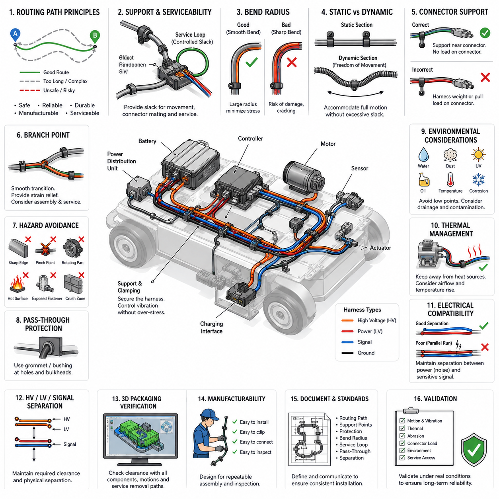
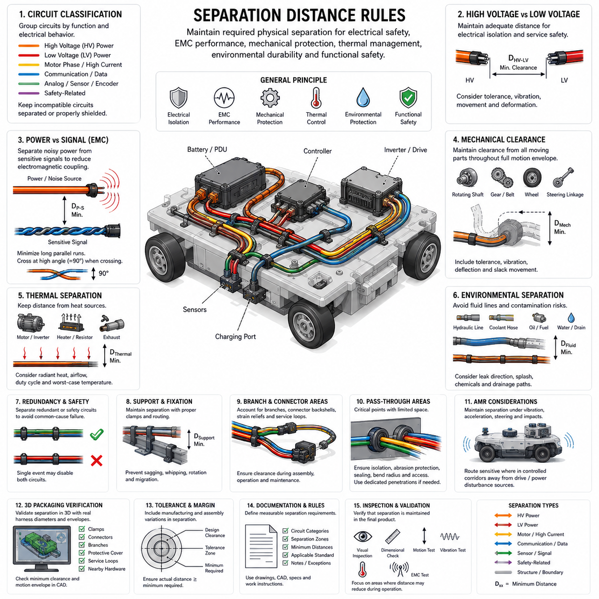
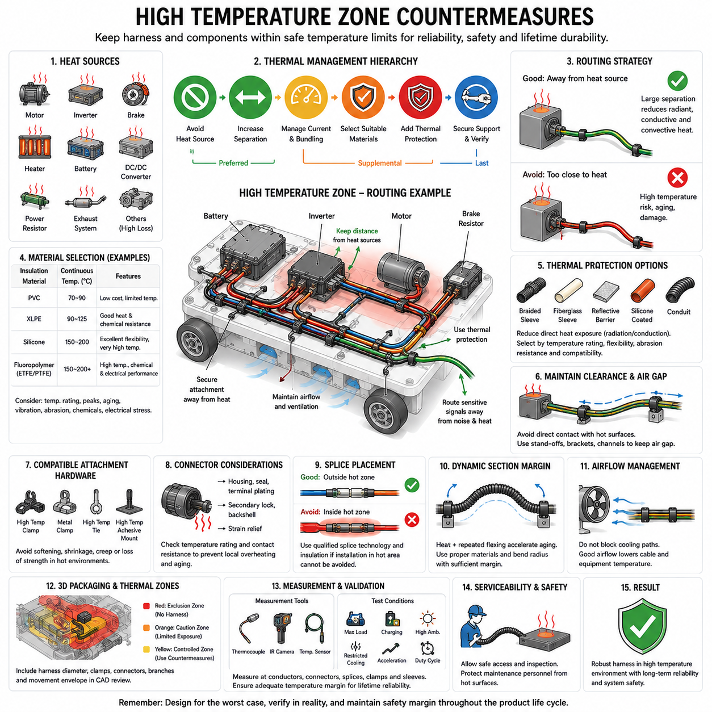
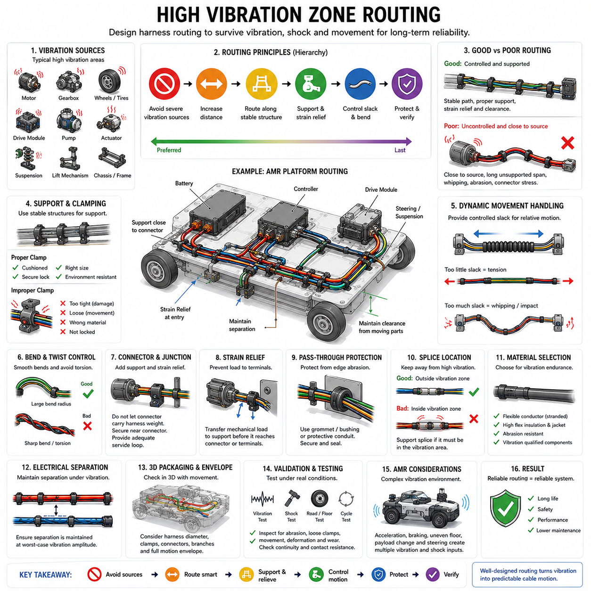
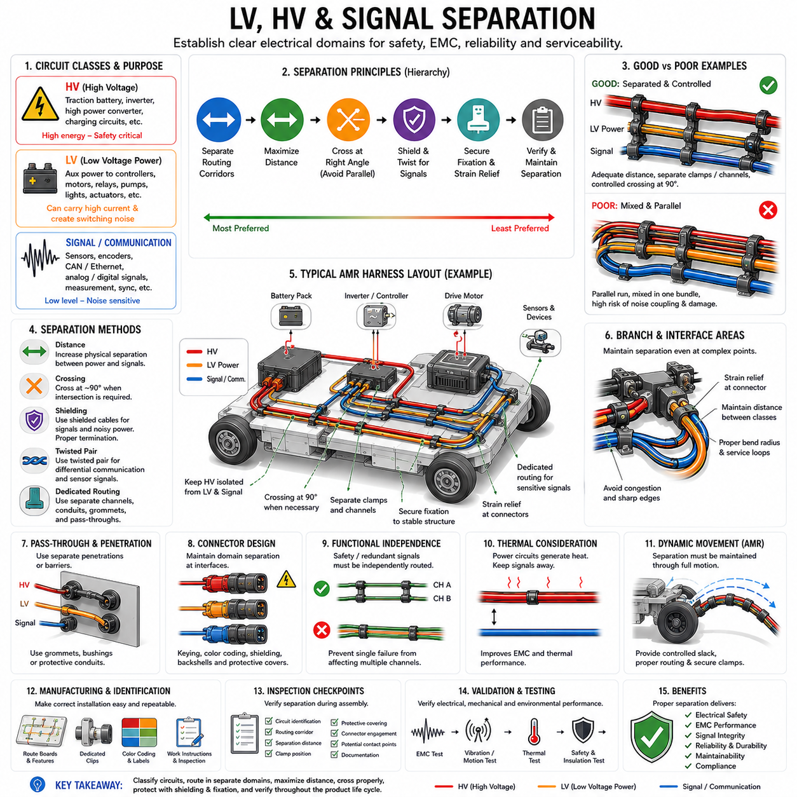

**Volume 02. Wire Harness Engineering**


# Chapter 08. Routing Engineering

##  

## 08.01. Routing Path Principles

{width="7.268055555555556in" height="7.268055555555556in"}

Routing a wire harness begins with defining a path that supports electrical performance, mechanical durability, manufacturability, and serviceability throughout the product life cycle. The shortest geometric route is not automatically the best route. A practical path must avoid hazards, respect packaging constraints, accommodate assembly variation, and maintain sufficient clearance from structures that can damage the harness.

The routing process should begin from fixed electrical interfaces such as batteries, power distribution units, controllers, sensors, actuators, motors, and charging components. These interfaces establish the principal endpoints, while intermediate routing points are selected according to mechanical structure and available packaging corridors. The resulting path should be predictable, mechanically supported, and compatible with installation and removal procedures.

Harness routing should preferably follow stable structural members rather than crossing open spaces without support. Frames, chassis rails, panels, brackets, and dedicated cable channels can provide natural routing references. Using these structures reduces uncontrolled movement and makes clamp placement more systematic. However, contact with structural edges must be controlled because repeated vibration against even a moderately sharp surface can gradually damage insulation.

A fundamental routing principle is to minimize unnecessary changes in direction. Excessive bends increase harness length, installation complexity, friction during assembly, and mechanical stress near attachment points. Smooth transitions with sufficiently large bend radii are preferable to abrupt corners. The minimum allowable bend radius depends on conductor construction, cable diameter, insulation material, shielding, temperature, and whether the cable is static or repeatedly flexed.

Routing must distinguish between static sections and dynamic sections. A harness attached to a rigid frame can normally be constrained relatively firmly, while wiring connected to steering assemblies, suspension elements, articulated joints, movable sensors, or serviceable modules requires controlled freedom of movement. Dynamic sections must provide enough length for the full motion envelope without creating excessive slack that can become trapped or abraded.

Service loops and controlled slack should therefore be introduced intentionally rather than appearing as accidental excess wire. Proper slack accommodates connector mating, manufacturing tolerances, component movement, and maintenance access. Too little slack transfers tensile force directly into terminals and connectors, while excessive slack can create uncontrolled loops that contact rotating parts, hot surfaces, sharp structures, or other harness branches.

Harness support points should control mass and vibration without concentrating stress. Clamps, clips, ties, channels, and brackets maintain the intended route and prevent the cable bundle from developing large vibration amplitudes. Support spacing should reflect harness mass, bundle stiffness, orientation, vibration environment, and local acceleration. Heavy connectors or branch points may require additional support because their concentrated mass increases dynamic loading.

Connectors should not normally be used as mechanical supports for the harness. The routing arrangement should prevent harness weight, vibration, or pulling force from being continuously transferred into connector terminals or mating interfaces. Where practical, a support point should be located near a connector while preserving sufficient free length for mating and service. This approach improves terminal stability and reduces fretting-related electrical problems.

Branch points require particular attention because they change bundle geometry and redistribute mechanical loads. A branch should leave the main trunk through a smooth transition rather than a sharp fold. The routing direction should match the natural destination of the branch, and adequate strain relief should be provided. Branch locations should also remain compatible with harness-board manufacturing, vehicle or robot assembly sequence, inspection, and field replacement.

The route must avoid predictable mechanical hazards such as sharp edges, pinch points, crushing zones, exposed fastener threads, rotating shafts, gears, fans, wheels, belts, chains, and moving linkages. When complete avoidance is impossible, additional protection such as sleeves, conduits, edge guards, grommets, or rigid channels may be required. Protective materials supplement good routing practice but should not be treated as substitutes for eliminating hazards.

Routing through holes, bulkheads, panels, or structural partitions requires protection against edge contact and relative movement. Grommets, bushings, sealed pass-through devices, or suitable conduit interfaces can isolate the harness from the penetration boundary. The design should consider not only the nominal installed position but also manufacturing tolerance, vibration displacement, connector manipulation, and possible movement during maintenance operations.

Environmental exposure must be considered along the entire routing path. Water, dust, mud, oil, hydraulic fluid, cleaning chemicals, salt, ultraviolet radiation, and condensation can affect insulation, protection materials, connectors, and attachment devices. Low points where water can collect should be minimized, and routing near exposed exterior regions should account for splash direction, drainage, pressure washing, and contamination accumulation.

Temperature is another major path-selection constraint. Harnesses should be routed away from motors, inverters, braking components, heaters, exhaust systems, power electronics, and other heat sources whenever practical. Local temperature can be substantially higher than the general ambient temperature. Routing decisions must therefore consider radiant heating, conductive contact, restricted airflow, operating duty cycle, and temporary thermal peaks rather than ambient temperature alone.

Electrical compatibility also influences the physical route. Power conductors, motor phase cables, switching power electronics, communication lines, encoder wiring, and low-level sensor signals can have different electromagnetic characteristics. Routing should create a physical architecture that enables the required separation and shielding strategy. Parallel runs between noisy power circuits and sensitive signal circuits should be controlled, especially when long common routing distances are involved.

High-voltage and low-voltage harnesses should be treated as distinct routing systems where required by the electrical architecture. Their paths must support identification, protection, maintenance safety, and suitable physical separation. High-voltage routing should also consider possible crash, impact, abrasion, and service hazards. The path should avoid locations where ordinary maintenance operations could unintentionally damage or disturb energized high-voltage wiring.

In an AMR, routing must reflect the machine\'s continuous exposure to vibration, repeated acceleration, steering motion, wheel disturbances, and frequent maintenance. Harnesses near drive modules, casters, suspension mechanisms, lift mechanisms, and charging interfaces require particular attention. The route must remain safe across the robot\'s complete operating configuration rather than only when the robot is stationary in its nominal assembly position.

Three-dimensional packaging verification is essential because a harness that appears acceptable in a two-dimensional drawing may interfere with surrounding hardware after installation. Routing should be evaluated against component envelopes, fastener access, tool paths, covers, moving mechanisms, cooling ducts, and service removal trajectories. Digital mock-up can identify many conflicts, but physical prototype inspection remains valuable for detecting installation behavior that CAD geometry does not represent.

Manufacturing feasibility should be incorporated before the route is frozen. Assemblers must be able to position the harness, install clips, mate connectors, verify locking features, and perform inspection without excessive force or complicated manipulation. Routing that requires severe twisting or precise threading through inaccessible spaces increases assembly time and defect probability. Good routing therefore balances packaging efficiency with repeatable human or automated installation.

The routing definition should include sufficient design information to reproduce the intended installation. Important characteristics include routing corridors, attachment locations, branch orientation, protected zones, bend conditions, service loops, pass-through points, and interfaces with moving structures. Critical restrictions should be reflected in drawings, CAD data, harness-board information, work instructions, or engineering standards so that the designed path is preserved during production.

Final validation should examine the harness in realistic operating conditions rather than judging routing only by visual appearance. Inspection should consider full mechanism motion, vibration, thermal expansion, connector loading, abrasion potential, service access, and environmental exposure. Evidence of rubbing, tension, uncontrolled movement, excessive bending, or contact with hazardous components indicates that the route or its supporting protection requires modification.

A robust routing path is ultimately a controlled mechanical system for electrical conductors. It coordinates geometry, support, motion, environment, electrical separation, assembly, and maintenance so that wires remain within their intended operating conditions throughout the machine\'s life. Establishing these principles at the beginning of routing engineering provides the foundation for later detailed rules concerning separation distance, thermal zones, vibration zones, and LV/HV/signal segregation.

와이어 하니스(wire harness)의 라우팅(routing)은 제품의 전체 수명 주기(product life cycle) 동안 전기적 성능(electrical performance), 기계적 내구성(mechanical durability), 제조성(manufacturability), 정비성(serviceability)을 모두 만족하는 경로(path)를 정의하는 것에서 시작한다. 기하학적으로 가장 짧은 경로가 반드시 최적의 경로는 아니다. 실제 경로는 위험 요소를 회피하고 패키징 제약(packaging constraints)을 준수하며 조립 편차를 수용하고 하니스를 손상시킬 수 있는 구조물과 충분한 간격을 유지해야 한다.

라우팅 과정(routing process)은 배터리(battery), 전력 분배 장치(power distribution unit), 제어기(controller), 센서(sensor), 액추에이터(actuator), 모터(motor), 충전 구성품(charging component)과 같은 고정된 전기 인터페이스(electrical interface)에서 시작해야 한다. 이러한 인터페이스가 주요 종단점(endpoint)을 결정하며, 중간 라우팅 지점은 기계 구조와 사용 가능한 패키징 통로(packaging corridor)에 따라 선정된다. 최종 경로는 예측 가능하고 기계적으로 지지되며 설치 및 제거 절차와 호환되어야 한다.

하니스 라우팅(harness routing)은 지지되지 않은 개방 공간을 가로지르기보다 안정적인 구조 부재(structural member)를 따라 배치하는 것이 바람직하다. 프레임(frame), 섀시 레일(chassis rail), 패널(panel), 브래킷(bracket), 전용 케이블 채널(cable channel)은 자연스러운 라우팅 기준을 제공할 수 있다. 이러한 구조물을 이용하면 제어되지 않는 움직임을 줄이고 클램프(clamp) 위치를 체계적으로 설정할 수 있다. 그러나 반복 진동으로 구조물 모서리와 접촉하면 절연체(insulation)가 점진적으로 손상될 수 있으므로 주의해야 한다.

라우팅의 기본 원칙 중 하나는 불필요한 방향 변화를 최소화하는 것이다. 과도한 굴곡은 하니스 길이, 설치 복잡성, 조립 과정의 마찰, 고정 지점 주변의 기계적 응력(mechanical stress)을 증가시킨다. 급격한 모서리보다 충분히 큰 굽힘 반경(bend radius)을 갖는 부드러운 전환이 바람직하다. 최소 허용 굽힘 반경은 도체 구조(conductor construction), 케이블 직경, 절연 재료, 차폐(shielding), 온도 및 케이블의 정적 또는 반복 굽힘 여부에 따라 달라진다.

라우팅은 정적 구간(static section)과 동적 구간(dynamic section)을 구분해야 한다. 강체 프레임(rigid frame)에 부착된 하니스는 비교적 단단하게 고정할 수 있지만, 조향 장치(steering assembly), 서스펜션(suspension), 관절부(articulated joint), 이동형 센서 또는 정비 가능한 모듈에 연결되는 배선은 제어된 움직임의 자유도가 필요하다. 동적 구간은 전체 운동 범위(motion envelope)를 수용할 충분한 길이를 제공하면서도 끼임이나 마모를 유발하는 과도한 여유가 발생하지 않아야 한다.

따라서 서비스 루프(service loop)와 제어된 여유 길이(controlled slack)는 우연히 남는 잉여 배선이 아니라 의도적으로 설계되어야 한다. 적절한 여유는 커넥터 체결(connector mating), 제조 공차(manufacturing tolerance), 구성품 이동, 정비 접근성을 수용한다. 여유가 부족하면 인장력이 단자와 커넥터에 직접 전달되며, 반대로 지나치게 많으면 회전체, 고온 표면, 날카로운 구조물 또는 다른 하니스 분기와 접촉할 수 있는 제어되지 않는 루프가 형성된다.

하니스 지지점(harness support point)은 특정 위치에 응력을 집중시키지 않으면서 질량과 진동을 제어해야 한다. 클램프(clamp), 클립(clip), 타이(tie), 채널(channel), 브래킷(bracket)은 의도한 경로를 유지하고 케이블 번들(cable bundle)의 진동 진폭이 커지는 것을 방지한다. 지지 간격은 하니스 질량, 번들 강성(bundle stiffness), 설치 방향, 진동 환경, 국부 가속도를 고려해야 한다. 무거운 커넥터나 분기점은 집중 질량으로 동적 하중이 증가하므로 추가 지지가 필요할 수 있다.

커넥터(connector)는 일반적으로 하니스의 기계적 지지물(mechanical support)로 사용해서는 안 된다. 라우팅 구조는 하니스의 무게, 진동 또는 당기는 힘이 커넥터 단자나 결합 인터페이스(mating interface)에 지속적으로 전달되지 않도록 해야 한다. 가능한 경우 커넥터 가까이에 지지점을 설치하면서 체결 및 정비에 필요한 자유 길이를 확보해야 한다. 이러한 방식은 단자의 안정성을 높이고 프레팅(fretting)과 관련된 전기적 문제를 감소시킨다.

분기점(branch point)은 번들 형상을 변화시키고 기계적 하중을 재분배하므로 특별한 주의가 필요하다. 분기는 날카롭게 접히는 대신 주 간선(main trunk)에서 부드럽게 전환되어야 한다. 라우팅 방향은 분기의 실제 목적지와 자연스럽게 일치해야 하며 충분한 스트레인 릴리프(strain relief)를 제공해야 한다. 또한 분기 위치는 하니스 보드(harness board) 제조, 차량 또는 로봇 조립 순서, 검사 및 현장 교체 작업과 호환되어야 한다.

경로는 날카로운 모서리, 끼임 지점(pinch point), 압착 영역(crushing zone), 노출된 체결부 나사산, 회전축, 기어(gear), 팬(fan), 휠(wheel), 벨트(belt), 체인(chain), 이동 링크 장치와 같은 예측 가능한 기계적 위험 요소를 피해야 한다. 완전한 회피가 불가능한 경우 슬리브(sleeve), 전선관(conduit), 에지 가드(edge guard), 그로밋(grommet), 강체 채널(rigid channel)과 같은 추가 보호 수단이 필요할 수 있다. 보호 재료는 올바른 라우팅을 보완하는 수단이지 위험 제거를 대신하는 수단이 아니다.

구멍, 벌크헤드(bulkhead), 패널 또는 구조 격벽(structural partition)을 통과하는 라우팅은 모서리 접촉과 상대 운동(relative movement)에 대한 보호가 필요하다. 그로밋(grommet), 부싱(bushing), 밀폐형 관통 장치(sealed pass-through device) 또는 적절한 전선관 인터페이스를 사용하여 하니스를 관통부 경계에서 분리할 수 있다. 설계에서는 정상 설치 위치뿐 아니라 제조 공차, 진동 변위, 커넥터 조작 및 정비 과정에서 발생할 수 있는 움직임까지 고려해야 한다.

환경 노출(environmental exposure)은 전체 라우팅 경로에서 고려되어야 한다. 물, 먼지, 진흙, 오일, 유압유, 세정 화학물질, 염분, 자외선(ultraviolet radiation), 결로(condensation)는 절연체, 보호 재료, 커넥터 및 고정 장치에 영향을 줄 수 있다. 물이 고일 수 있는 저점(low point)은 최소화해야 하며, 외부에 노출되는 영역의 라우팅은 물 튀김 방향, 배수, 고압 세척(pressure washing), 오염물 축적까지 고려해야 한다.

온도 역시 주요한 경로 선정 제약 조건이다. 가능하면 하니스는 모터, 인버터(inverter), 제동 부품, 히터(heater), 배기 시스템, 전력 전자 장치(power electronics)와 같은 열원에서 멀리 배치해야 한다. 국부 온도(local temperature)는 일반적인 주변 온도보다 상당히 높을 수 있다. 따라서 라우팅 결정에서는 주변 온도뿐 아니라 복사열(radiant heating), 전도성 접촉, 제한된 공기 흐름, 운전 듀티 사이클(duty cycle), 일시적인 열 피크(thermal peak)까지 고려해야 한다.

전기적 호환성(electrical compatibility)도 물리적인 경로에 영향을 준다. 전력 도체(power conductor), 모터 상 케이블(motor phase cable), 스위칭 전력 전자 장치, 통신선, 엔코더 배선(encoder wiring), 저레벨 센서 신호는 서로 다른 전자기적 특성을 가질 수 있다. 라우팅은 필요한 이격 및 차폐 전략을 구현할 수 있는 물리적 구조를 제공해야 한다. 특히 잡음이 큰 전력 회로와 민감한 신호 회로가 긴 구간에서 평행하게 배치되는 경우 이를 적절히 제어해야 한다.

고전압(high voltage, HV)과 저전압(low voltage, LV) 하니스는 전기 아키텍처(electrical architecture)의 요구에 따라 서로 구분된 라우팅 시스템으로 취급해야 한다. 각각의 경로는 식별성, 보호성, 정비 안전성 및 적절한 물리적 이격을 지원해야 한다. 고전압 라우팅은 충돌, 충격, 마모 및 정비 위험도 고려해야 하며, 일반적인 유지보수 작업 중 고전압 배선이 의도치 않게 손상되거나 교란될 가능성이 있는 위치를 피해야 한다.

자율이동로봇(Autonomous Mobile Robot, AMR)에서는 지속적인 진동, 반복적인 가감속, 조향 운동, 휠 충격 및 빈번한 유지보수를 고려하여 라우팅해야 한다. 구동 모듈(drive module), 캐스터(caster), 서스펜션 기구, 리프트 메커니즘(lift mechanism), 충전 인터페이스(charging interface) 주변의 하니스는 특히 주의가 필요하다. 경로는 로봇이 정지한 정상 조립 위치뿐 아니라 전체 운전 구성과 운동 범위에서도 안전하게 유지되어야 한다.

3차원 패키징 검증(three-dimensional packaging verification)은 필수적이다. 2차원 도면에서는 적절하게 보이는 하니스도 실제 설치 후 주변 하드웨어와 간섭할 수 있기 때문이다. 라우팅은 구성품 엔벨로프(component envelope), 체결부 접근 공간, 공구 이동 경로(tool path), 커버, 이동 기구, 냉각 덕트(cooling duct), 정비 시 제거 궤적을 기준으로 평가해야 한다. 디지털 목업(digital mock-up)은 많은 간섭을 발견할 수 있지만, CAD 형상만으로 표현하기 어려운 설치 거동은 실제 시제품 검사를 통해 확인하는 것이 중요하다.

제조 가능성(manufacturing feasibility)은 라우팅 경로가 최종 확정되기 전에 반영되어야 한다. 작업자는 과도한 힘이나 복잡한 조작 없이 하니스를 배치하고, 클립을 설치하고, 커넥터를 체결하고, 잠금 기능을 확인하며, 검사를 수행할 수 있어야 한다. 심한 비틀림이나 접근하기 어려운 공간으로 정밀하게 배선을 통과시켜야 하는 라우팅은 조립 시간을 증가시키고 결함 발생 가능성을 높인다. 따라서 좋은 라우팅은 패키징 효율성과 반복 가능한 조립성을 균형 있게 만족해야 한다.

라우팅 정의(routing definition)는 의도한 설치 상태를 반복적으로 재현할 수 있도록 충분한 설계 정보를 포함해야 한다. 주요 특성에는 라우팅 통로, 고정 위치, 분기 방향, 보호 영역, 굽힘 조건, 서비스 루프, 관통 지점, 이동 구조물과의 인터페이스가 포함된다. 중요한 제한 조건은 도면, CAD 데이터, 하니스 보드 정보, 작업 지침(work instruction) 또는 엔지니어링 표준(engineering standard)에 반영하여 생산 과정에서도 설계된 경로가 유지되도록 해야 한다.

최종 검증(final validation)은 라우팅의 외관만 판단하는 것이 아니라 실제 운전 조건에서 하니스를 평가해야 한다. 검사에서는 전체 기구 운동, 진동, 열팽창(thermal expansion), 커넥터 하중, 마모 가능성, 정비 접근성, 환경 노출을 고려해야 한다. 마찰 흔적, 인장 상태, 제어되지 않는 움직임, 과도한 굽힘 또는 위험 구성품과의 접촉이 발견된다면 라우팅 경로나 해당 보호 구조를 수정해야 한다.

견고한 라우팅 경로(robust routing path)는 궁극적으로 전기 도체를 위한 제어된 기계 시스템(controlled mechanical system)이다. 이는 형상, 지지, 운동, 환경, 전기적 이격, 조립 및 유지보수를 통합적으로 조정하여 기계의 전체 수명 동안 배선이 의도된 운전 조건을 유지하도록 한다. 이러한 기본 원칙을 라우팅 엔지니어링(routing engineering)의 초기 단계에서 확립하면 이후의 이격 거리(separation distance), 고온 영역(thermal zone), 고진동 영역(high-vibration zone), 저전압·고전압·신호 분리(LV/HV/signal segregation)에 관한 상세 설계 규칙의 기반이 된다.

##  

## 08.02. Separation Distance Rules

{width="7.268055555555556in" height="7.268055555555556in"}

Separation distance in wire harness routing is the controlled physical spacing maintained between electrical circuits, mechanical structures, heat sources, moving components, and other potential hazards. The required distance is not a single universal value. It depends on voltage level, current, signal sensitivity, electromagnetic environment, insulation system, mechanical motion, temperature, contamination, and the consequences of possible contact or interference.

Electrical separation begins by classifying circuits according to their function and electrical behavior. High-voltage power, low-voltage power, motor phases, switched loads, communication networks, analog sensors, encoders, and safety-related signals can require different routing treatment. Circuits with similar characteristics may share routing corridors, while electrically incompatible circuits should be separated or provided with appropriate shielding and protective measures.

High-voltage (HV) and low-voltage (LV) wiring should normally maintain deliberate physical separation when the system architecture requires electrical isolation and service safety. The distance must account for normal manufacturing tolerance, vibration, harness movement, connector manipulation, and possible deformation during operation. A nominal CAD clearance is insufficient if the actual installed harness can move enough to eliminate that clearance.

Separation between power wiring and sensitive signal wiring is important for electromagnetic compatibility (EMC). Motor phase cables, inverter outputs, switching power supplies, contactor circuits, and other rapidly changing currents can generate electromagnetic fields that couple into nearby sensor or communication wiring. Increasing physical distance reduces coupling and is therefore one of the most fundamental noise-control techniques available to the harness designer.

Long parallel routing between noisy and sensitive circuits should be minimized whenever practical. Electromagnetic coupling generally becomes more significant when conductors remain close and parallel over a long distance. When different circuit classes must cross, a short crossing with a large crossing angle, preferably approaching 90 degrees where packaging allows, can reduce the effective coupling length compared with extended parallel routing.

Distance requirements should be evaluated together with shielding rather than treating the two methods as independent solutions. A shielded cable may tolerate routing conditions that would be unacceptable for an unshielded signal, but shielding does not automatically eliminate the need for separation. Shield termination quality, grounding architecture, cable construction, frequency range, and common-mode current paths determine how effective the shielding actually becomes.

Communication cables such as CAN, CAN FD, Ethernet, encoder links, and other differential interfaces benefit from maintaining their intended cable geometry while being separated from strong noise sources. Twisted-pair construction improves immunity to common electromagnetic disturbances, but routing directly beside inverter outputs or high-current switching conductors can still degrade signal integrity. Physical separation provides an additional layer of robustness.

Mechanical separation is equally important. Harnesses must maintain clearance from rotating shafts, gears, belts, chains, wheels, fans, linkages, steering mechanisms, and other moving components throughout their complete motion envelope. Clearance should be based on worst-case relative position rather than the nominal static condition. Tolerance accumulation, vibration amplitude, structural deflection, wear, and unexpected slack movement should be included in the assessment.

Clearance from sharp edges and abrasive surfaces must prevent insulation contact during both normal operation and foreseeable movement. A harness that appears separated from an edge when stationary may repeatedly strike that edge under vibration. Where adequate distance cannot be maintained, protective measures such as edge guards, sleeves, conduits, grommets, or additional clamps can be introduced to prevent direct mechanical damage.

Thermal separation is required around motors, inverters, braking components, heaters, power resistors, exhaust-related components, and other high-temperature sources. The relevant parameter is the temperature experienced by the harness, not simply the geometric distance from the heat source. Radiant heat, airflow, conductive paths, enclosure temperature, operating duration, and component duty cycle can significantly change the thermal environment.

Increasing distance from a heat source is generally preferable because it reduces thermal exposure without adding material complexity. When packaging limitations prevent sufficient separation, thermal barriers, reflective protection, high-temperature sleeves, or higher-rated insulation may be required. These measures should be validated under realistic worst-case operation because localized temperature peaks may occur only during high-load or abnormal operating conditions.

Harnesses should also be separated from fluid lines and regions where leakage can create electrical or material degradation. Hydraulic lines, coolant hoses, lubrication systems, battery fluids, cleaning chemicals, and water drainage paths can introduce contamination risks. Routing should consider not only normal separation but also the direction in which a leaking or ruptured line could discharge fluid onto nearby electrical components.

Physical separation between redundant or safety-related circuits can prevent a single mechanical event from disabling multiple functions simultaneously. If two redundant power feeds, communication channels, sensor paths, or safety circuits are routed together through the same vulnerable location, one abrasion event, impact, thermal incident, or crushing condition could defeat both channels. Separation can therefore contribute directly to fault independence and system-level reliability.

Attachment points play an important role in preserving designed separation distances. Clamps and clips should maintain the intended relationship between adjacent harnesses and surrounding structures despite vibration and acceleration. A clearance that depends only on the natural stiffness of the cable bundle may disappear during operation. Support locations should therefore be selected to prevent uncontrolled sagging, whipping, rotation, or migration.

Branch points and connector regions require additional consideration because local harness geometry becomes less predictable. Multiple branches may converge near controllers, power distribution units, sensors, or actuators, creating congestion that reduces separation. Connector backshells, strain reliefs, service loops, and mating movements should be included in the packaging envelope so that required clearances remain available during assembly and maintenance.

Pass-through regions can create concentrated separation problems. When several circuit classes pass through a bulkhead, panel opening, cable gland, or conduit, the available routing space may force them closer together. The designer must consider electrical isolation, abrasion protection, environmental sealing, bend radius, and service access simultaneously. Dedicated penetrations may be preferable when incompatible circuits cannot be safely combined.

In an Autonomous Mobile Robot (AMR), separation distances must remain valid under acceleration, braking, steering, wheel impact, chassis vibration, payload changes, and maintenance activity. Drive modules and power electronics create particularly demanding combinations of current, switching noise, heat, and mechanical movement. Sensitive sensor and communication harnesses should therefore be routed through controlled corridors that remain separated from these disturbance sources.

Three-dimensional packaging analysis should verify separation using realistic harness diameters and movement envelopes rather than idealized centerlines. CAD models should include clamps, connectors, branches, protective coverings, service loops, and nearby hardware. Minimum-clearance checks can identify potential interference, but engineering judgment is still necessary because flexible harnesses do not remain perfectly fixed in the geometric position represented by the nominal model.

Manufacturing tolerances must be incorporated into every separation rule. Wire cutting tolerance, branch position tolerance, clip installation variation, connector location variation, structural dimensional variation, and assembly technique can shift the installed harness from its nominal position. The specified design clearance should therefore contain sufficient margin so that production variation does not routinely reduce the actual distance below the acceptable limit.

Separation rules should be documented as measurable engineering requirements rather than subjective instructions such as "keep away" or "route separately." Drawings, CAD models, harness specifications, and work instructions should identify critical separation zones and the applicable circuit categories. Where a numerical minimum is required, the value should come from the relevant product standard, safety requirement, EMC validation, component specification, or approved internal engineering rule.

Inspection and validation should confirm that the intended separation is preserved in the manufactured product. Visual inspection, dimensional checks, motion tests, vibration tests, thermal measurements, and EMC testing can reveal different failure mechanisms. Particular attention should be given to locations where harnesses move toward each other, approach hot components, contact structures, or change position after repeated operation.

Separation distance is therefore a multidimensional design control rather than simply empty space between wires. It provides electrical isolation, reduces electromagnetic coupling, prevents mechanical interference, limits thermal exposure, supports environmental protection, and can preserve redundancy against common-cause failures. Applied together with routing, shielding, clamping, protective covering, and validation, separation rules form a fundamental part of reliable wire harness engineering.

와이어 하니스(wire harness) 라우팅에서 이격 거리(separation distance)는 전기 회로, 기계 구조물, 열원, 이동 부품 및 기타 잠재적 위험 요소 사이에 유지하는 제어된 물리적 간격을 의미한다. 요구되는 거리는 하나의 보편적인 값으로 정의되지 않는다. 전압 수준, 전류, 신호 민감도, 전자기 환경, 절연 시스템, 기계적 움직임, 온도, 오염 조건 및 접촉이나 간섭이 발생했을 때의 결과에 따라 필요한 이격 거리가 달라진다.

전기적 이격(electrical separation)은 회로를 기능과 전기적 특성에 따라 분류하는 것에서 시작한다. 고전압 전력(high-voltage power), 저전압 전력(low-voltage power), 모터 상(motor phase), 스위칭 부하(switched load), 통신 네트워크(communication network), 아날로그 센서(analog sensor), 엔코더(encoder), 안전 관련 신호(safety-related signal)는 서로 다른 라우팅 처리가 필요할 수 있다. 유사한 특성을 가진 회로는 동일한 라우팅 통로를 사용할 수 있지만, 전기적으로 호환되지 않는 회로는 분리하거나 적절한 차폐(shielding) 및 보호 대책을 적용해야 한다.

고전압(high voltage, HV)과 저전압(low voltage, LV) 배선은 시스템 아키텍처(system architecture)에서 전기적 절연과 정비 안전성이 요구되는 경우 의도적인 물리적 이격을 유지해야 한다. 이 거리는 정상적인 제조 공차, 진동, 하니스 움직임, 커넥터 조작 및 운전 중 발생 가능한 변형을 고려해야 한다. 실제 설치된 하니스가 움직여 이격 거리를 상실할 수 있다면 CAD상의 공칭 간격(nominal clearance)만으로는 충분하지 않다.

전력 배선(power wiring)과 민감한 신호 배선(sensitive signal wiring) 사이의 이격은 전자기 적합성(Electromagnetic Compatibility, EMC)을 위해 중요하다. 모터 상 케이블, 인버터 출력(inverter output), 스위칭 전원 공급 장치(switching power supply), 컨택터 회로(contactor circuit) 및 빠르게 변화하는 전류를 전달하는 회로는 주변 센서나 통신 배선에 결합될 수 있는 전자기장을 발생시킨다. 물리적 거리를 증가시키면 이러한 결합을 줄일 수 있으므로 이격은 하니스 설계에서 가장 기본적인 노이즈 제어 기법 중 하나이다.

노이즈 발생 회로(noisy circuit)와 민감한 회로(sensitive circuit)가 긴 구간에서 평행하게 라우팅되는 것은 가능한 한 최소화해야 한다. 도체가 가까운 거리에서 장시간 평행하게 유지될수록 전자기 결합(electromagnetic coupling)이 증가할 수 있다. 서로 다른 회로 등급이 교차해야 하는 경우에는 패키징 조건이 허용하는 범위에서 가능한 한 90도에 가까운 큰 교차각을 사용하여 짧게 교차시키면 장거리 평행 라우팅보다 유효 결합 길이를 줄일 수 있다.

이격 거리 요구사항은 차폐(shielding)와 독립적인 해결책으로 취급하기보다 함께 평가해야 한다. 차폐 케이블(shielded cable)은 비차폐 신호선(unshielded signal)에 적합하지 않은 라우팅 조건을 견딜 수도 있지만, 차폐가 이격의 필요성을 자동으로 제거하는 것은 아니다. 차폐 종단 품질(shield termination quality), 접지 아키텍처(grounding architecture), 케이블 구조, 주파수 범위 및 공통 모드 전류 경로(common-mode current path)가 실제 차폐 효과를 결정한다.

CAN, CAN FD, 이더넷(Ethernet), 엔코더 링크(encoder link) 및 기타 차동 인터페이스(differential interface)와 같은 통신 케이블은 강한 노이즈원에서 이격하면서 원래 의도된 케이블 형상을 유지하는 것이 중요하다. 트위스티드 페어(twisted pair) 구조는 공통 전자기 외란에 대한 내성을 향상시키지만, 인버터 출력이나 대전류 스위칭 도체 바로 옆에 배치하면 신호 무결성(signal integrity)이 저하될 수 있다. 물리적 이격은 추가적인 강건성(robustness)을 제공한다.

기계적 이격(mechanical separation)도 동일하게 중요하다. 하니스는 회전축, 기어, 벨트, 체인, 휠, 팬, 링크 장치, 조향 기구 및 기타 이동 부품으로부터 전체 운동 범위(motion envelope)에 걸쳐 충분한 간격을 유지해야 한다. 이격은 공칭 정지 상태가 아니라 최악 조건의 상대 위치를 기준으로 평가해야 한다. 공차 누적(tolerance accumulation), 진동 진폭, 구조 변형, 마모 및 예상하지 못한 여유 배선의 움직임도 평가에 포함해야 한다.

날카로운 모서리와 마모성 표면(abrasive surface)으로부터의 이격은 정상 운전과 예상 가능한 움직임 모두에서 절연체가 접촉하지 않도록 확보해야 한다. 정지 상태에서는 모서리와 떨어져 있는 하니스도 진동이 발생하면 반복적으로 충돌할 수 있다. 충분한 거리를 확보할 수 없는 경우 에지 가드(edge guard), 슬리브(sleeve), 전선관(conduit), 그로밋(grommet) 또는 추가 클램프를 적용하여 직접적인 기계 손상을 방지할 수 있다.

모터, 인버터, 제동 부품, 히터, 전력 저항기(power resistor), 배기 관련 부품 및 기타 고온 열원 주변에는 열적 이격(thermal separation)이 필요하다. 중요한 기준은 단순히 열원으로부터의 기하학적 거리가 아니라 하니스가 실제로 경험하는 온도이다. 복사열(radiant heat), 공기 흐름, 전도 경로, 인클로저 온도(enclosure temperature), 운전 지속시간 및 구성품 듀티 사이클(duty cycle)은 열 환경을 크게 변화시킬 수 있다.

열원으로부터 거리를 증가시키는 것은 추가적인 재료 복잡성을 발생시키지 않으면서 열 노출을 줄일 수 있기 때문에 일반적으로 가장 바람직하다. 패키징 제한으로 충분한 이격을 확보할 수 없는 경우 열 차단재(thermal barrier), 반사형 보호재(reflective protection), 고온용 슬리브(high-temperature sleeve) 또는 더 높은 온도 등급의 절연체가 필요할 수 있다. 국부적인 온도 피크는 고부하 또는 비정상 운전 조건에서만 발생할 수 있으므로 이러한 대책은 실제 최악 조건에서 검증해야 한다.

하니스는 유체 라인(fluid line)과 누출로 인해 전기적 또는 재료적 열화가 발생할 수 있는 영역으로부터도 이격해야 한다. 유압 라인, 냉각수 호스, 윤활 시스템, 배터리 유체, 세정 화학물질 및 배수 경로는 오염 위험을 유발할 수 있다. 라우팅에서는 정상적인 이격뿐 아니라 라인에서 누출이나 파열이 발생했을 때 유체가 인접한 전기 구성품으로 분사될 수 있는 방향도 고려해야 한다.

이중화 회로(redundant circuit) 또는 안전 관련 회로(safety-related circuit) 사이의 물리적 이격은 하나의 기계적 사고가 여러 기능을 동시에 상실시키는 것을 방지할 수 있다. 두 개의 이중화 전원, 통신 채널, 센서 경로 또는 안전 회로가 동일한 취약 위치를 함께 통과하면 하나의 마모, 충격, 열 사고 또는 압착 조건으로 두 채널 모두가 상실될 수 있다. 따라서 이격은 고장 독립성(fault independence)과 시스템 수준 신뢰성(system-level reliability)에 직접적으로 기여할 수 있다.

고정 지점(attachment point)은 설계된 이격 거리를 유지하는 데 중요한 역할을 한다. 클램프와 클립은 진동과 가속이 발생하더라도 인접 하니스 및 주변 구조물 사이의 의도된 위치 관계를 유지해야 한다. 케이블 번들의 자연적인 강성에만 의존하여 확보한 간격은 운전 중 사라질 수 있다. 따라서 지지 위치는 제어되지 않는 처짐(sagging), 휘날림(whipping), 회전 또는 위치 이동(migration)을 방지하도록 선정해야 한다.

분기점(branch point)과 커넥터 영역은 국부적인 하니스 형상이 불규칙해질 수 있으므로 추가적인 고려가 필요하다. 여러 분기가 제어기(controller), 전력 분배 장치(power distribution unit), 센서 또는 액추에이터 주변에 집중되면 혼잡이 발생하여 이격 거리가 감소할 수 있다. 커넥터 백쉘(connector backshell), 스트레인 릴리프(strain relief), 서비스 루프(service loop) 및 체결 동작까지 패키징 엔벨로프(packaging envelope)에 포함하여 조립과 정비 과정에서도 필요한 간격이 유지되도록 해야 한다.

관통 영역(pass-through region)에서는 이격 문제가 집중적으로 발생할 수 있다. 여러 종류의 회로가 벌크헤드(bulkhead), 패널 개구부(panel opening), 케이블 글랜드(cable gland) 또는 전선관을 함께 통과하면 제한된 라우팅 공간으로 인해 서로 가까워질 수 있다. 설계자는 전기적 절연, 마모 보호, 환경 밀폐(environmental sealing), 굽힘 반경 및 정비 접근성을 동시에 고려해야 한다. 서로 호환되지 않는 회로를 안전하게 결합할 수 없다면 별도의 전용 관통부(dedicated penetration)를 사용하는 것이 바람직할 수 있다.

자율이동로봇(Autonomous Mobile Robot, AMR)에서는 가속, 제동, 조향, 휠 충격, 섀시 진동, 적재 하중 변화 및 유지보수 작업 중에도 이격 거리가 유지되어야 한다. 구동 모듈(drive module)과 전력 전자 장치(power electronics)는 높은 전류, 스위칭 노이즈, 열 및 기계적 움직임이 동시에 발생하는 까다로운 환경을 형성한다. 따라서 민감한 센서 및 통신 하니스는 이러한 외란원으로부터 분리된 제어된 라우팅 통로(controlled routing corridor)를 통해 배치하는 것이 바람직하다.

3차원 패키징 분석(three-dimensional packaging analysis)에서는 이상화된 중심선(centerline)이 아니라 실제 하니스 직경과 움직임 엔벨로프(movement envelope)를 사용하여 이격을 검증해야 한다. CAD 모델에는 클램프, 커넥터, 분기, 보호 피복, 서비스 루프 및 주변 하드웨어를 포함해야 한다. 최소 간격 검사(minimum-clearance check)를 통해 잠재적 간섭을 식별할 수 있지만, 유연한 하니스는 공칭 모델에 표현된 기하학적 위치에 완벽하게 고정되지 않으므로 엔지니어링 판단도 필요하다.

모든 이격 규칙에는 제조 공차(manufacturing tolerance)를 반영해야 한다. 전선 절단 공차, 분기 위치 공차, 클립 설치 편차, 커넥터 위치 편차, 구조 치수 편차 및 조립 방법에 따라 실제 설치된 하니스가 공칭 위치에서 벗어날 수 있다. 따라서 지정된 설계 간격에는 생산 편차가 발생하더라도 실제 거리가 허용 가능한 최소값 이하로 쉽게 감소하지 않도록 충분한 마진을 포함해야 한다.

이격 규칙(separation rule)은 단순히 "멀리 배치한다" 또는 "분리하여 라우팅한다"와 같은 주관적인 지시가 아니라 측정 가능한 엔지니어링 요구사항(measurable engineering requirement)으로 문서화해야 한다. 도면, CAD 모델, 하니스 사양 및 작업 지침에는 중요한 이격 영역과 적용되는 회로 등급을 명확하게 표시해야 한다. 수치화된 최소값이 필요한 경우 관련 제품 표준, 안전 요구사항, EMC 검증 결과, 구성품 사양 또는 승인된 내부 엔지니어링 규칙에서 해당 값을 결정해야 한다.

검사와 검증(inspection and validation)을 통해 제조된 제품에서도 의도된 이격이 유지되는지 확인해야 한다. 육안 검사, 치수 검사, 운동 시험, 진동 시험, 열 측정 및 EMC 시험은 서로 다른 고장 메커니즘을 발견할 수 있다. 특히 하니스가 서로 가까워지는 위치, 고온 구성품에 접근하는 위치, 구조물과 접촉하는 위치 또는 반복 운전 후 위치가 변화하는 영역을 집중적으로 확인해야 한다.

따라서 이격 거리(separation distance)는 단순히 전선 사이에 존재하는 빈 공간이 아니라 다차원적인 설계 제어 요소(multidimensional design control)이다. 이는 전기적 절연을 제공하고, 전자기 결합을 감소시키며, 기계적 간섭을 방지하고, 열 노출을 제한하며, 환경 보호를 지원하고, 공통 원인 고장(common-cause failure)으로부터 이중성을 유지하는 데 기여한다. 라우팅, 차폐, 클램핑(clamping), 보호 피복(protective covering), 검증과 함께 적용되는 이격 규칙은 신뢰성 높은 와이어 하니스 엔지니어링(wire harness engineering)의 핵심 기반을 형성한다.

##  

## 08.03. High Temperature Zone Countermeasures

{width="7.268055555555556in" height="7.268055555555556in"}

High-temperature zones in a wire harness system are locations where conductors, insulation, connectors, protective coverings, and attachment components may experience temperatures significantly above the general ambient condition. Typical sources include motors, inverters, braking components, power resistors, heaters, batteries, DC/DC converters, exhaust-related equipment, and other high-loss electrical or mechanical devices.

The first countermeasure is avoidance. Whenever packaging permits, the harness should be routed away from the heat source rather than relying immediately on heat-resistant materials. Increasing physical separation reduces radiant, conductive, and convective heat transfer simultaneously. A slightly longer routing path can therefore provide greater lifetime reliability than a short path passing directly through a severe thermal environment.

Thermal routing must be based on the actual temperature experienced by the harness rather than only the rated temperature of the nearby component. Surface temperature, radiant heat, enclosure temperature, airflow, operating duration, duty cycle, load condition, and neighboring heat sources can combine to create localized hot spots. Measurements or validated thermal models should therefore represent realistic worst-case operating conditions.

Wire insulation must be selected according to the maximum expected conductor and environmental temperature. PVC, XLPE, fluoropolymer, silicone, and other insulation systems provide different thermal capabilities and mechanical characteristics. The selected material must tolerate continuous operating temperature, temporary thermal peaks, aging, vibration, abrasion, chemical exposure, and the electrical stress associated with the circuit.

Current loading and external temperature must be considered together because conductor self-heating adds to environmental heating. A cable that operates safely at normal ambient temperature may exceed its allowable temperature when routed near a motor or inverter. High-temperature routing can therefore require current derating, increased conductor cross-sectional area, reduced bundle density, or improved heat dissipation in addition to higher-temperature insulation.

Harness bundling can further increase temperature because neighboring conductors heat one another while restricting airflow. A large bundle routed through a hot zone may experience substantially different thermal behavior from an individual cable exposed to the same ambient temperature. Bundle size, conductor loading diversity, protective sleeves, conduits, and local ventilation should therefore be included in the thermal assessment.

Thermal sleeves and protective coverings provide an additional countermeasure where routing distance alone is insufficient. High-temperature braid, fiberglass-based sleeves, silicone-coated materials, reflective coverings, or other suitable protective systems can reduce direct thermal exposure. Their selection should consider continuous temperature capability, flexibility, abrasion resistance, installation method, contamination, and compatibility with the underlying cable insulation.

Reflective thermal barriers are particularly useful when radiant heat is the dominant mechanism. A barrier positioned between the heat source and harness can reduce radiation without requiring major changes to the electrical architecture. However, a reflective surface may become ineffective if it becomes heavily contaminated or physically damaged, so installation environment, maintenance conditions, orientation, and long-term cleanliness should be considered.

Direct contact with hot structures should be prevented even when the cable insulation has a relatively high temperature rating. Contact creates a concentrated conductive heat-transfer path and can produce local temperatures much higher than the surrounding air. Clamps, stand-offs, brackets, channels, and routing guides can maintain a controlled air gap between the harness and motors, heat sinks, housings, pipes, or other heated surfaces.

Attachment hardware within a high-temperature zone must also be thermally suitable. Plastic clips, cable ties, adhesive mounts, tapes, grommets, and corrugated conduits can lose strength, soften, shrink, become brittle, or creep under sustained temperature. A harness protected by high-temperature insulation can still fail mechanically if its attachment system deteriorates and allows the bundle to move toward a heat source or abrasive structure.

Connectors require special attention because their temperature limits can differ from those of the attached wire. Connector housings, seals, terminal plating, secondary locks, backshells, and strain-relief components may age rapidly under elevated temperature. Contact resistance can also generate additional local heating, creating a feedback mechanism in which poor electrical contact increases temperature and elevated temperature accelerates further degradation.

Splices should preferably be positioned outside severe thermal zones whenever practical. A splice introduces additional conductor interfaces, insulation transitions, and protective materials whose thermal behavior may differ from the continuous wire. If a splice must remain in a hot region, the splice technology, insulation system, sealing material, strain relief, and current-carrying capability should all be qualified for the expected temperature profile.

Routing near motors and inverters requires simultaneous thermal and electromagnetic consideration. Moving a signal harness away from an inverter can reduce both temperature exposure and electromagnetic coupling, while relocating a high-current cable may change voltage drop or packaging requirements. Effective routing therefore requires a system-level compromise among thermal management, EMC, electrical performance, mechanical protection, and serviceability.

Dynamic harness sections require additional margin because repeated flexing can accelerate insulation aging at elevated temperature. Steering assemblies, articulated mechanisms, lift systems, movable sensors, and drive modules may expose cables to heat and mechanical cycling simultaneously. Materials and bend radii that are acceptable in a static hot environment may not provide adequate lifetime performance under continuous flexing.

In an Autonomous Mobile Robot (AMR), drive motors, motor controllers, braking resistors, battery systems, charging interfaces, and onboard computing equipment can create distributed high-temperature zones. The thermal condition also changes with payload, acceleration, floor resistance, operating speed, charging state, and mission duration. Harness design should therefore consider the complete robot duty profile rather than a single steady operating point.

Airflow should be treated as part of the routing environment. A harness positioned in a ventilated region can operate at a lower temperature than an identical harness located inside a stagnant enclosure. Conversely, routing that blocks cooling paths can increase both cable and equipment temperature. Harness packaging should preserve intended ventilation around power electronics, motors, batteries, and thermal management components.

Serviceability must remain practical after thermal protection is added. Sleeves, shields, barriers, and conduits should not prevent connector inspection, harness removal, or fault diagnosis. Maintenance personnel must also be protected from hot surfaces. The routing arrangement should allow safe access while ensuring that thermal protection cannot easily be omitted, displaced, or incorrectly reinstalled during service.

Three-dimensional packaging analysis should identify heat sources and define thermal exclusion or caution zones around them. Harness centerlines alone are insufficient because the complete bundle diameter, protective covering, clamps, connectors, branches, and movement envelope occupy additional space. Thermal zones can be incorporated into CAD reviews so that routing violations are detected before prototype construction.

Thermal simulation can support routing decisions when the environment is complex, but simulation assumptions must reflect realistic heat generation, airflow, contact conditions, and operating duty. Analytical calculations and digital models are most useful when correlated with physical measurements. Thermocouples, temperature sensors, thermal imaging, and instrumented prototypes can reveal local hot spots that simplified models may overlook.

Validation should reproduce demanding operating conditions such as maximum continuous load, repeated acceleration, charging, restricted cooling, elevated ambient temperature, or combinations of these conditions. Temperature should be measured at representative conductors, connectors, splices, clamps, and protective coverings. The objective is not merely to remain below an immediate failure temperature but to preserve adequate margin for aging and production variation.

Thermal aging must be considered because insulation and polymeric components can degrade gradually even when no visible damage occurs during initial testing. Long-term exposure can reduce flexibility, mechanical strength, sealing performance, and dielectric integrity. Temperature margin is therefore an important reliability parameter, and designs operating continuously near material limits should be treated cautiously even if short-duration validation is successful.

High-temperature-zone countermeasures ultimately follow a hierarchy: avoid the heat source where possible, increase separation, control current and bundling, select suitable materials, introduce thermal protection, maintain secure mechanical support, and verify the resulting design under realistic conditions. Combining these measures prevents thermal routing from becoming dependent on a single protective component and creates a more robust wire harness throughout the machine lifetime.

와이어 하니스 시스템(wire harness system)의 고온 영역(high-temperature zone)은 도체(conductor), 절연체(insulation), 커넥터(connector), 보호 피복(protective covering), 고정 부품(attachment component)이 일반적인 주변 환경보다 상당히 높은 온도에 노출될 수 있는 위치를 의미한다. 대표적인 열원에는 모터(motor), 인버터(inverter), 제동 부품(braking component), 전력 저항기(power resistor), 히터(heater), 배터리(battery), DC/DC 컨버터(DC/DC converter), 배기 관련 장치 및 기타 손실이 큰 전기·기계 장치가 포함된다.

가장 우선적인 대응책(countermeasure)은 열원을 회피하는 것이다. 패키징(packaging)이 허용하는 경우 처음부터 내열 재료에 의존하기보다 하니스를 열원에서 떨어진 위치로 라우팅해야 한다. 물리적 이격 거리를 증가시키면 복사, 전도, 대류에 의한 열전달을 동시에 감소시킬 수 있다. 따라서 심각한 열 환경을 직접 통과하는 짧은 경로보다 약간 길더라도 열원에서 떨어진 경로가 수명 신뢰성(lifetime reliability) 측면에서 더 유리할 수 있다.

열적 라우팅(thermal routing)은 주변 구성품의 정격 온도만을 기준으로 하지 않고 하니스가 실제로 경험하는 온도를 기준으로 설계해야 한다. 표면 온도, 복사열(radiant heat), 인클로저 온도(enclosure temperature), 공기 흐름(airflow), 운전 시간, 듀티 사이클(duty cycle), 부하 조건 및 인접 열원이 결합되어 국부적인 핫스팟(hot spot)을 형성할 수 있다. 따라서 측정 또는 검증된 열 모델(thermal model)은 현실적인 최악 운전 조건을 반영해야 한다.

전선 절연체(wire insulation)는 예상되는 최대 도체 온도와 환경 온도에 따라 선정해야 한다. PVC, 가교 폴리에틸렌(XLPE), 불소수지(fluoropolymer), 실리콘(silicone) 등의 절연 시스템은 서로 다른 내열 성능과 기계적 특성을 제공한다. 선정된 재료는 연속 운전 온도, 일시적인 열 피크(thermal peak), 노화, 진동, 마모, 화학물질 노출 및 해당 회로의 전기적 스트레스를 견딜 수 있어야 한다.

도체 자체의 발열(self-heating)이 환경 열에 추가되므로 전류 부하(current loading)와 외부 온도를 함께 고려해야 한다. 정상적인 주변 온도에서 안전하게 동작하는 케이블도 모터나 인버터 주변에 라우팅되면 허용 온도를 초과할 수 있다. 따라서 고온 영역의 라우팅에서는 고온 절연체뿐 아니라 전류 디레이팅(current derating), 도체 단면적 증가, 번들 밀도(bundle density) 감소 또는 방열 개선이 필요할 수 있다.

하니스 번들링(harness bundling)은 인접한 도체들이 서로 가열하고 공기 흐름을 제한하기 때문에 온도를 더욱 상승시킬 수 있다. 고온 영역을 통과하는 대형 번들은 동일한 주변 온도에 노출되는 단일 케이블과 상당히 다른 열적 거동을 나타낼 수 있다. 따라서 번들 크기, 도체별 부하 분포, 보호 슬리브(protective sleeve), 전선관(conduit), 국부 환기(local ventilation)를 열 평가에 포함해야 한다.

라우팅 거리만으로 충분한 열적 이격을 확보할 수 없는 경우 열 보호 슬리브(thermal sleeve)와 보호 피복을 추가적인 대응책으로 사용할 수 있다. 고온용 브레이드(high-temperature braid), 유리섬유 기반 슬리브(fiberglass-based sleeve), 실리콘 코팅 재료, 반사형 피복(reflective covering) 등의 적절한 보호 시스템은 직접적인 열 노출을 감소시킬 수 있다. 선정 시에는 연속 사용 온도, 유연성, 내마모성, 설치 방법, 오염 및 내부 케이블 절연체와의 재료 호환성을 고려해야 한다.

복사열이 지배적인 열전달 메커니즘인 경우 반사형 열 차단재(reflective thermal barrier)가 특히 효과적이다. 열원과 하니스 사이에 차단재를 설치하면 전기 아키텍처를 크게 변경하지 않고도 복사열을 감소시킬 수 있다. 그러나 반사 표면이 심하게 오염되거나 물리적으로 손상되면 효과가 저하될 수 있으므로 설치 환경, 유지보수 조건, 설치 방향 및 장기간의 청결 상태를 고려해야 한다.

케이블 절연체가 비교적 높은 온도 등급을 가지고 있더라도 고온 구조물과의 직접 접촉은 방지해야 한다. 직접 접촉은 집중적인 전도 열전달(conductive heat transfer) 경로를 형성하여 주변 공기보다 훨씬 높은 국부 온도를 발생시킬 수 있다. 클램프(clamp), 스탠드오프(stand-off), 브래킷(bracket), 채널(channel), 라우팅 가이드(routing guide)를 이용하면 하니스와 모터, 히트싱크(heat sink), 하우징, 파이프 등의 가열 표면 사이에 제어된 공기 간극(air gap)을 유지할 수 있다.

고온 영역에 설치되는 고정 하드웨어(attachment hardware) 역시 적절한 내열 성능을 가져야 한다. 플라스틱 클립, 케이블 타이(cable tie), 접착식 마운트(adhesive mount), 테이프, 그로밋(grommet), 주름관(corrugated conduit)은 지속적인 고온에서 강도를 잃거나 연화, 수축, 취화 또는 크리프(creep)가 발생할 수 있다. 고온용 절연체로 보호된 하니스라도 고정 시스템이 열화되어 번들이 열원이나 마모 구조물 쪽으로 이동하면 기계적으로 고장날 수 있다.

커넥터(connector)는 허용 온도가 연결된 전선의 허용 온도와 다를 수 있으므로 특별한 주의가 필요하다. 커넥터 하우징, 씰(seal), 단자 도금(terminal plating), 보조 잠금 장치(secondary lock), 백쉘(backshell), 스트레인 릴리프(strain relief)는 높은 온도에서 빠르게 노화될 수 있다. 또한 접촉 저항(contact resistance)은 추가적인 국부 발열을 발생시켜 불량 접촉이 온도를 높이고, 높아진 온도가 다시 열화를 가속하는 피드백 메커니즘을 형성할 수 있다.

가능한 경우 스플라이스(splice)는 심각한 고온 영역 밖에 배치하는 것이 바람직하다. 스플라이스에는 추가적인 도체 인터페이스, 절연 전환부 및 보호 재료가 존재하며, 이들의 열적 거동은 연속된 전선과 다를 수 있다. 스플라이스를 고온 영역에 설치해야 한다면 스플라이스 기술(splice technology), 절연 시스템, 밀봉 재료(sealing material), 스트레인 릴리프 및 전류 전달 능력을 예상 온도 프로파일(temperature profile)에 맞게 검증해야 한다.

모터와 인버터 주변의 라우팅에서는 열적 특성과 전자기적 특성을 동시에 고려해야 한다. 신호 하니스(signal harness)를 인버터에서 멀리 이동시키면 온도 노출과 전자기 결합(electromagnetic coupling)을 동시에 줄일 수 있지만, 대전류 케이블을 이동시키면 전압 강하(voltage drop) 또는 패키징 요구사항이 달라질 수 있다. 따라서 효과적인 라우팅은 열 관리, 전자기 적합성(Electromagnetic Compatibility, EMC), 전기적 성능, 기계적 보호 및 정비성 사이의 시스템 수준 절충(system-level compromise)을 필요로 한다.

동적 하니스 구간(dynamic harness section)은 높은 온도에서 반복 굽힘이 절연체의 노화를 가속할 수 있으므로 추가적인 설계 마진이 필요하다. 조향 장치, 관절 기구, 리프트 시스템(lift system), 이동형 센서 및 구동 모듈(drive module)은 케이블을 열과 기계적 반복 하중에 동시에 노출시킬 수 있다. 정적인 고온 환경에서 적절한 재료와 굽힘 반경(bend radius)이라도 지속적인 반복 굽힘 조건에서는 충분한 수명 성능을 제공하지 못할 수 있다.

자율이동로봇(Autonomous Mobile Robot, AMR)에서는 구동 모터, 모터 제어기(motor controller), 제동 저항기(braking resistor), 배터리 시스템, 충전 인터페이스(charging interface), 온보드 컴퓨팅 장치(onboard computing equipment)가 분산된 고온 영역을 형성할 수 있다. 또한 열 상태는 적재 하중(payload), 가속도, 바닥 저항, 운전 속도, 충전 상태 및 임무 지속시간에 따라 변화한다. 따라서 하니스 설계에서는 하나의 정상상태 운전점이 아니라 로봇의 전체 듀티 프로파일(duty profile)을 고려해야 한다.

공기 흐름(airflow)은 라우팅 환경의 일부로 취급해야 한다. 환기가 이루어지는 영역에 배치된 하니스는 정체된 인클로저 내부에 위치한 동일한 하니스보다 낮은 온도에서 운전될 수 있다. 반대로 하니스 라우팅이 냉각 경로를 차단하면 케이블과 장비의 온도가 모두 상승할 수 있다. 따라서 하니스 패키징은 전력 전자 장치, 모터, 배터리 및 열 관리 구성품 주변의 의도된 환기 흐름을 유지해야 한다.

열 보호 장치를 추가한 이후에도 정비성(serviceability)은 실용적인 수준으로 유지되어야 한다. 슬리브, 실드(shield), 차단재, 전선관이 커넥터 검사, 하니스 제거 또는 고장 진단을 방해해서는 안 된다. 또한 정비 작업자는 고온 표면으로부터 보호되어야 한다. 라우팅 구조는 안전한 접근을 가능하게 하면서 정비 과정에서 열 보호 장치가 쉽게 누락되거나 이동하거나 잘못 재설치되지 않도록 해야 한다.

3차원 패키징 분석(three-dimensional packaging analysis)을 통해 열원을 식별하고 주변에 열적 제외 영역(thermal exclusion zone) 또는 주의 영역(caution zone)을 정의해야 한다. 하니스 중심선만으로는 충분하지 않으며 전체 번들 직경, 보호 피복, 클램프, 커넥터, 분기 및 운동 엔벨로프(movement envelope)가 추가 공간을 차지한다. CAD 검토 과정에 열 영역을 포함하면 시제품 제작 전에 라우팅 위반을 발견할 수 있다.

열 환경이 복잡한 경우 열 시뮬레이션(thermal simulation)을 이용하여 라우팅 결정을 지원할 수 있지만, 시뮬레이션의 가정은 현실적인 발열량, 공기 흐름, 접촉 조건 및 운전 듀티를 반영해야 한다. 해석 계산과 디지털 모델은 실제 측정 결과와 상관관계를 확보할 때 가장 효과적이다. 열전대(thermocouple), 온도 센서, 열화상(thermal imaging), 계측된 시제품(instrumented prototype)을 사용하면 단순화된 모델이 놓칠 수 있는 국부 핫스팟을 확인할 수 있다.

검증(validation)은 최대 연속 부하, 반복 가속, 충전, 제한된 냉각, 높은 주변 온도 또는 이러한 조건의 조합과 같은 가혹한 운전 조건을 재현해야 한다. 대표적인 도체, 커넥터, 스플라이스, 클램프 및 보호 피복에서 온도를 측정해야 한다. 목적은 단순히 즉각적인 고장 온도 이하를 유지하는 것이 아니라 장기 노화와 생산 편차를 고려한 충분한 온도 마진(temperature margin)을 확보하는 것이다.

초기 시험에서 눈에 보이는 손상이 발생하지 않더라도 절연체와 고분자 부품(polymeric component)은 점진적으로 열화될 수 있으므로 열 노화(thermal aging)를 고려해야 한다. 장기간의 고온 노출은 유연성, 기계적 강도, 밀봉 성능 및 유전 건전성(dielectric integrity)을 감소시킬 수 있다. 따라서 온도 마진은 중요한 신뢰성 지표이며, 단시간 검증에 성공했더라도 재료의 한계 온도에 근접하여 지속적으로 운전되는 설계는 신중하게 평가해야 한다.

고온 영역 대응책(high-temperature-zone countermeasure)은 궁극적으로 계층적인 접근 방법을 따른다. 가능한 경우 열원을 회피하고, 이격 거리를 증가시키며, 전류와 번들링을 관리하고, 적절한 재료를 선정하고, 열 보호 장치를 추가하며, 안정적인 기계적 지지를 유지한 후 실제 운전 조건에서 최종 설계를 검증해야 한다. 이러한 대책을 조합하면 열적 라우팅이 하나의 보호 부품에만 의존하는 것을 방지하고 기계의 전체 수명 동안 더욱 견고한 와이어 하니스(wire harness)를 구현할 수 있다.

##  

## 08.04. High Vibration Zone Routing

{width="7.268055555555556in" height="7.268055555555556in"}

High-vibration zones are regions where a wire harness is repeatedly subjected to oscillation, shock, acceleration, structural movement, or vibration transmitted from motors, wheels, gearboxes, pumps, actuators, and other dynamic equipment. In these locations, routing must prevent relative motion from producing conductor fatigue, insulation abrasion, connector damage, terminal fretting, or progressive loosening of attachment hardware.

The first routing principle is to avoid severe vibration sources whenever practical. Increasing the distance between the harness and a vibrating assembly reduces direct mechanical excitation and simplifies protection. A slightly longer path along a stable chassis or structural member is often preferable to a short path across a motor, gearbox, drive module, suspension element, or other component generating continuous vibration.

Vibration severity should be evaluated from the actual operating environment rather than inferred only from the component type. Frequency, amplitude, acceleration, shock level, operating speed, structural resonance, mounting stiffness, payload, and road or floor conditions can significantly change harness loading. Measurements using accelerometers or validated dynamic models can help identify locations where additional routing controls are necessary.

A harness should normally be supported by stable structural members so that vibration does not create uncontrolled movement. Frames, chassis rails, rigid brackets, and dedicated routing channels provide predictable reference points for clamps and clips. Support should constrain the bundle sufficiently to prevent whipping and impact while avoiding excessive restriction that transfers concentrated bending loads into the conductors.

Clamp spacing is an important parameter in vibration-resistant routing. Excessive distance between supports allows the harness to develop larger vibration amplitudes, while supports positioned too closely can create unnecessary stiffness and local stress concentration. Appropriate spacing depends on bundle mass, cable stiffness, routing orientation, vibration spectrum, attachment strength, connector mass, and the presence of branches or protective coverings.

Clamps should secure the harness without crushing insulation or restricting necessary movement. Cushion clamps, appropriately designed clips, and vibration-resistant brackets can distribute mechanical loads over a larger area. The selected attachment device must remain locked under repeated acceleration and should be compatible with temperature, chemicals, moisture, dust, and other environmental conditions encountered during the product lifetime.

Heavy connectors, junctions, splices, and branch points require additional support because concentrated mass increases inertial loading during vibration. A connector should not carry the dynamic weight of an unsupported harness. Where practical, the bundle should be secured close to the connector while retaining sufficient free length for mating, tolerance, and service. This reduces terminal loading and helps prevent fretting at electrical contacts.

Strain relief is essential where the harness enters connectors, enclosures, sensors, motors, and other components. The routing arrangement should transfer mechanical loads into suitable supports before those loads reach terminals or conductor-to-terminal interfaces. Without effective strain relief, repeated small movements can gradually fatigue conductor strands or weaken crimps even when the external insulation appears undamaged.

Bend geometry should remain smooth in high-vibration regions. Sharp bends concentrate cyclic strain in a small section of conductor and insulation, accelerating fatigue. Bend radius should therefore include margin beyond the minimum static installation requirement when repeated motion is expected. The cable should also be prevented from bending repeatedly at exactly the same point immediately adjacent to a rigid clamp or connector.

Controlled slack is required when relative motion exists between two structures. Too little slack places the harness under tension as components move, while excessive slack allows whipping, impact, entanglement, and abrasion. The objective is a defined motion profile in which the cable flexes gradually through an intended region rather than moving unpredictably throughout the installation.

Dynamic sections should be designed differently from static sections. Wiring connected to steering mechanisms, suspension systems, articulated joints, lift mechanisms, movable sensors, or drive modules must accommodate repeated displacement throughout the full motion envelope. The harness should be routed so that bending, twisting, and extension remain controlled under every expected operating position, including mechanical tolerance and structural deflection.

Torsional loading should be minimized because repeated twisting can damage conductors even when the cable maintains an acceptable bend radius. When two connected components rotate relative to each other, the routing geometry should distribute rotation over sufficient cable length or use an appropriate flexible cable-management solution. The design should avoid forcing all angular displacement into a short section near a connector.

Abrasion protection becomes particularly important when vibration can bring the harness close to surrounding structures. Sleeves, braided protection, conduits, edge guards, grommets, and protective channels can provide additional resistance to rubbing. However, protection should complement proper clearance and fixation rather than justify continuous contact between the harness and an abrasive or sharp surface.

Pass-through locations require careful treatment because vibration can cause repeated rubbing against hole edges, bulkheads, and panels. Grommets, bushings, sealed pass-through devices, or suitable protective conduits should isolate the cable from structural edges. The protection itself must remain securely positioned, because a displaced grommet can expose the harness to concentrated abrasion at precisely the location where movement is greatest.

Harness materials should be selected for combined electrical and mechanical endurance. Conductor strand construction, insulation flexibility, jacket material, shielding, braid structure, and protective coverings influence fatigue resistance. A cable suitable for a static installation may not provide adequate life under continuous vibration or flexing, even when its voltage, current, and temperature ratings appear sufficient.

Splices should preferably be located away from the most severe vibration regions. A splice can create a locally stiff section where conductor geometry and protective covering differ from the surrounding cable. If installation in a vibrating area cannot be avoided, the splice should be properly supported and strain relieved so that cyclic bending does not concentrate directly at the electrical joint or insulation transition.

Electrical separation must remain valid under vibration. Power cables, motor phases, communication lines, and sensitive sensor wiring that are properly separated in the nominal installation may move toward one another during operation. Clamp positions and routing corridors should therefore preserve required separation under worst-case vibration amplitude, preventing both electromagnetic compatibility problems and physical contact between adjacent harnesses.

In an Autonomous Mobile Robot (AMR), drive modules, wheels, casters, suspension elements, lift mechanisms, motors, and payload structures can generate complex vibration environments. Floor joints, thresholds, uneven surfaces, rapid acceleration, emergency braking, and payload variation can introduce transient shocks beyond normal steady vibration. Harness routing should therefore consider both repetitive vibration and occasional high-energy mechanical events.

Drive-module harnesses are particularly demanding because they can experience vibration, steering motion, motor-generated heat, electromagnetic noise, and repeated mechanical displacement simultaneously. Power, communication, encoder, and safety wiring must remain mechanically controlled throughout the steering and suspension envelope. Routing should prevent contact with wheels, rotating shafts, gears, and other moving components under all allowable configurations.

Three-dimensional packaging analysis should include realistic movement envelopes rather than evaluating only nominal harness geometry. CAD reviews should represent bundle diameter, clamps, connectors, branches, service loops, surrounding hardware, and expected component motion. Areas where a flexible harness approaches a structural edge or moving component require additional margin because vibration can consume apparently adequate static clearance.

Prototype validation should reproduce realistic vibration and shock conditions while the harness is installed in its production-intent configuration. Inspection should look for abrasion marks, clamp migration, connector movement, insulation deformation, loose attachments, excessive whipping, and localized bending. Electrical continuity and contact resistance can also be monitored because mechanical degradation may develop before obvious external damage becomes visible.

Validation should consider accumulated life rather than only short-duration survival. Repeated low-amplitude vibration can cause fatigue, fretting, and wear over thousands or millions of cycles even when individual events appear harmless. Accelerated vibration testing, motion cycling, road or floor testing, and post-test inspection can help determine whether the routing maintains adequate mechanical and electrical integrity throughout the intended service life.

High-vibration-zone routing therefore depends on controlling where and how the harness is allowed to move. The preferred hierarchy is to avoid severe vibration sources, route along stable structures, provide suitable support and strain relief, control slack and bend geometry, protect against abrasion, and validate the complete installation dynamically. These measures transform uncontrolled vibration into predictable cable motion and improve long-term harness reliability.

고진동 영역(high-vibration zone)은 와이어 하니스(wire harness)가 모터, 휠, 기어박스(gearbox), 펌프, 액추에이터(actuator) 및 기타 동적 장비에서 전달되는 진동, 충격, 가속도, 구조적 움직임 또는 반복적인 진동에 지속적으로 노출되는 영역이다. 이러한 위치에서는 상대 운동(relative motion)으로 인해 도체 피로(conductor fatigue), 절연체 마모, 커넥터 손상, 단자 프레팅(terminal fretting), 고정 하드웨어의 점진적인 풀림이 발생하지 않도록 라우팅해야 한다.

첫 번째 라우팅 원칙은 가능한 경우 심한 진동원(vibration source)을 회피하는 것이다. 하니스와 진동 발생 장치 사이의 거리를 증가시키면 직접적인 기계적 가진(mechanical excitation)을 줄이고 보호 설계를 단순화할 수 있다. 모터, 기어박스, 구동 모듈(drive module), 서스펜션 요소 또는 지속적인 진동을 발생시키는 구성품을 가로지르는 짧은 경로보다 안정적인 섀시나 구조 부재를 따라가는 약간 긴 경로가 더 바람직한 경우가 많다.

진동의 심각도(vibration severity)는 구성품 종류만으로 추정하지 않고 실제 운전 환경을 기준으로 평가해야 한다. 주파수, 진폭, 가속도, 충격 수준, 운전 속도, 구조 공진(structural resonance), 장착 강성(mounting stiffness), 적재 하중(payload), 도로 또는 바닥 상태에 따라 하니스에 작용하는 하중이 크게 달라질 수 있다. 가속도계(accelerometer)를 이용한 측정이나 검증된 동적 모델(dynamic model)을 통해 추가적인 라우팅 제어가 필요한 위치를 식별할 수 있다.

하니스는 일반적으로 안정적인 구조 부재에 지지하여 진동으로 인해 제어되지 않는 움직임이 발생하지 않도록 해야 한다. 프레임(frame), 섀시 레일(chassis rail), 강체 브래킷(rigid bracket), 전용 라우팅 채널(routing channel)은 클램프와 클립을 위한 예측 가능한 기준점을 제공한다. 지지는 번들의 휘날림(whipping)과 충돌을 방지할 만큼 충분히 구속하면서도 도체에 집중적인 굽힘 하중이 전달될 정도로 지나치게 제한해서는 안 된다.

클램프 간격(clamp spacing)은 내진동 라우팅(vibration-resistant routing)의 중요한 설계 변수이다. 지지점 사이의 거리가 지나치게 크면 하니스의 진동 진폭이 증가하고, 반대로 지지점을 너무 가깝게 배치하면 불필요한 강성과 국부적인 응력 집중이 발생할 수 있다. 적절한 간격은 번들 질량, 케이블 강성, 라우팅 방향, 진동 스펙트럼(vibration spectrum), 고정부 강도, 커넥터 질량 및 분기나 보호 피복의 존재 여부에 따라 결정해야 한다.

클램프(clamp)는 절연체를 압착하거나 필요한 움직임을 제한하지 않으면서 하니스를 안정적으로 고정해야 한다. 쿠션 클램프(cushion clamp), 적절하게 설계된 클립 및 내진동 브래킷(vibration-resistant bracket)은 기계적 하중을 더 넓은 영역에 분산할 수 있다. 선정된 고정 장치는 반복적인 가속에서도 잠금 상태를 유지해야 하며 제품 수명 동안 노출되는 온도, 화학물질, 습기, 먼지 및 기타 환경 조건과 호환되어야 한다.

무거운 커넥터, 접속부(junction), 스플라이스(splice), 분기점(branch point)은 집중 질량으로 인해 진동 시 관성 하중(inertial loading)이 증가하므로 추가적인 지지가 필요하다. 커넥터가 지지되지 않은 하니스의 동적 하중을 직접 받아서는 안 된다. 가능한 경우 체결, 공차 및 정비에 필요한 자유 길이를 유지하면서 커넥터 가까이에 번들을 고정해야 한다. 이는 단자 하중을 감소시키고 전기 접점의 프레팅(fretting)을 방지하는 데 도움이 된다.

스트레인 릴리프(strain relief)는 하니스가 커넥터, 인클로저(enclosure), 센서, 모터 및 기타 구성품으로 들어가는 위치에서 필수적이다. 라우팅 구조는 기계적 하중이 단자 또는 도체-단자 인터페이스(conductor-to-terminal interface)에 도달하기 전에 적절한 지지 구조로 전달되도록 해야 한다. 효과적인 스트레인 릴리프가 없으면 외부 절연체에 손상이 보이지 않더라도 반복적인 작은 움직임으로 인해 도체 소선이 점진적으로 피로하거나 크림프(crimp)가 약화될 수 있다.

고진동 영역에서는 굽힘 형상(bend geometry)을 부드럽게 유지해야 한다. 급격한 굽힘은 도체와 절연체의 작은 구간에 반복 변형을 집중시켜 피로를 가속한다. 따라서 반복적인 움직임이 예상되는 경우 굽힘 반경(bend radius)은 최소 정적 설치 요구사항보다 추가적인 마진을 확보해야 한다. 또한 강체 클램프나 커넥터 바로 인접한 동일한 지점에서 케이블이 반복적으로 굽혀지지 않도록 해야 한다.

두 구조물 사이에 상대 운동이 존재하는 경우 제어된 여유 길이(controlled slack)가 필요하다. 여유가 너무 적으면 구성품이 움직일 때 하니스에 인장력이 발생하고, 지나치게 많으면 휘날림, 충돌, 얽힘 및 마모가 발생할 수 있다. 목표는 케이블 전체가 예측할 수 없이 움직이는 것이 아니라 의도된 구간에서 점진적으로 굽혀지는 정의된 운동 프로파일(motion profile)을 만드는 것이다.

동적 구간(dynamic section)은 정적 구간(static section)과 다르게 설계해야 한다. 조향 기구(steering mechanism), 서스펜션 시스템, 관절부(articulated joint), 리프트 기구(lift mechanism), 이동형 센서 또는 구동 모듈에 연결된 배선은 전체 운동 엔벨로프(motion envelope)에 걸친 반복 변위를 수용해야 한다. 기계적 공차와 구조 변형까지 포함한 모든 예상 운전 위치에서 굽힘, 비틀림 및 신장이 제어되도록 하니스를 라우팅해야 한다.

반복적인 비틀림은 케이블이 적절한 굽힘 반경을 유지하더라도 도체를 손상시킬 수 있으므로 비틀림 하중(torsional loading)을 최소화해야 한다. 서로 연결된 두 구성품이 상대적으로 회전하는 경우 라우팅 형상은 충분한 케이블 길이에 걸쳐 회전을 분산하거나 적절한 유연 케이블 관리 솔루션(flexible cable-management solution)을 사용해야 한다. 모든 각변위를 커넥터 인접부의 짧은 구간에 집중시키는 설계는 피해야 한다.

진동으로 인해 하니스가 주변 구조물에 가까워질 수 있는 위치에서는 마모 보호(abrasion protection)가 특히 중요하다. 슬리브(sleeve), 브레이드 보호재(braided protection), 전선관(conduit), 에지 가드(edge guard), 그로밋(grommet), 보호 채널(protective channel)을 적용하면 마찰에 대한 추가적인 저항성을 확보할 수 있다. 그러나 이러한 보호 장치는 적절한 이격과 고정을 보완해야 하며, 하니스가 마모성 또는 날카로운 표면과 지속적으로 접촉하도록 허용하는 수단으로 사용해서는 안 된다.

관통 위치(pass-through location)는 진동으로 인해 하니스가 구멍의 모서리, 벌크헤드(bulkhead), 패널과 반복적으로 마찰할 수 있으므로 세심하게 설계해야 한다. 그로밋, 부싱(bushing), 밀폐형 관통 장치(sealed pass-through device) 또는 적절한 보호 전선관을 사용하여 케이블을 구조물 모서리로부터 분리해야 한다. 보호 장치 자체도 확실하게 고정되어야 하며, 그로밋이 이탈하면 움직임이 가장 큰 위치에서 하니스가 집중적인 마모에 노출될 수 있다.

하니스 재료(harness material)는 전기적 성능과 기계적 내구성을 함께 고려하여 선정해야 한다. 도체 소선 구조(conductor strand construction), 절연체 유연성, 재킷 재료(jacket material), 차폐(shielding), 브레이드 구조 및 보호 피복은 피로 저항성에 영향을 미친다. 전압, 전류 및 온도 정격이 충분하더라도 정적 설치용 케이블은 지속적인 진동이나 반복 굽힘 조건에서 충분한 수명을 제공하지 못할 수 있다.

스플라이스(splice)는 가능한 경우 가장 심한 진동 영역에서 벗어난 위치에 배치하는 것이 바람직하다. 스플라이스는 도체 형상과 보호 피복이 주변 케이블과 달라지는 국부적으로 강성이 높은 구간을 만들 수 있다. 진동 영역에 설치하는 것을 피할 수 없다면 반복 굽힘이 전기적 접합부나 절연 전환부에 직접 집중되지 않도록 스플라이스를 적절하게 지지하고 스트레인 릴리프를 제공해야 한다.

전기적 이격(electrical separation)은 진동 조건에서도 유지되어야 한다. 공칭 설치 상태에서는 적절하게 분리되어 있는 전력 케이블, 모터 상 배선, 통신선 및 민감한 센서 배선이 실제 운전 중에는 서로 가까워질 수 있다. 따라서 클램프 위치와 라우팅 통로는 최악 조건의 진동 진폭에서도 필요한 이격을 유지하여 전자기 적합성(Electromagnetic Compatibility, EMC) 문제와 인접 하니스 사이의 물리적 접촉을 모두 방지해야 한다.

자율이동로봇(Autonomous Mobile Robot, AMR)에서는 구동 모듈, 휠, 캐스터(caster), 서스펜션 요소, 리프트 기구, 모터 및 적재 구조물이 복잡한 진동 환경을 형성할 수 있다. 바닥 이음부, 문턱, 불규칙한 노면, 급가속, 비상 제동 및 적재 하중 변화는 정상적인 정상상태 진동보다 큰 순간 충격(transient shock)을 발생시킬 수 있다. 따라서 하니스 라우팅은 반복적인 진동과 간헐적으로 발생하는 고에너지 기계적 충격을 모두 고려해야 한다.

구동 모듈 하니스(drive-module harness)는 진동, 조향 운동, 모터 발열, 전자기 노이즈 및 반복적인 기계 변위를 동시에 경험할 수 있기 때문에 특히 까다로운 설계 영역이다. 전력, 통신, 엔코더 및 안전 배선은 전체 조향 및 서스펜션 운동 범위에서 기계적으로 제어된 상태를 유지해야 한다. 모든 허용 가능한 구성에서 휠, 회전축, 기어 및 기타 이동 부품과 접촉하지 않도록 라우팅해야 한다.

3차원 패키징 분석(three-dimensional packaging analysis)에서는 공칭 하니스 형상만 평가하지 않고 실제적인 운동 엔벨로프를 포함해야 한다. CAD 검토에는 번들 직경, 클램프, 커넥터, 분기, 서비스 루프(service loop), 주변 하드웨어 및 예상되는 구성품 움직임을 표현해야 한다. 유연한 하니스가 구조물 모서리나 이동 구성품에 접근하는 영역에서는 진동으로 인해 정적 상태의 여유 간격이 감소할 수 있으므로 추가적인 마진이 필요하다.

시제품 검증(prototype validation)은 하니스가 양산 의도 구성(production-intent configuration)으로 설치된 상태에서 실제적인 진동 및 충격 조건을 재현해야 한다. 검사에서는 마모 흔적, 클램프 위치 이동(clamp migration), 커넥터 움직임, 절연체 변형, 느슨해진 고정부, 과도한 휘날림 및 국부적인 굽힘을 확인해야 한다. 기계적 열화가 명확한 외부 손상보다 먼저 발생할 수 있으므로 전기적 연속성(electrical continuity)과 접촉 저항(contact resistance)도 모니터링할 수 있다.

검증은 단시간의 생존 여부만이 아니라 누적 수명(accumulated life)을 고려해야 한다. 개별적인 진동은 문제가 없어 보이더라도 반복되는 낮은 진폭의 진동이 수천 또는 수백만 사이클에 걸쳐 피로, 프레팅 및 마모를 발생시킬 수 있다. 가속 진동 시험(accelerated vibration testing), 운동 반복 시험(motion cycling), 도로 또는 바닥 주행 시험 및 시험 후 검사를 통해 라우팅이 목표 서비스 수명 동안 충분한 기계적·전기적 건전성을 유지하는지 확인할 수 있다.

따라서 고진동 영역 라우팅(high-vibration-zone routing)의 핵심은 하니스가 어디에서 어떤 방식으로 움직일 수 있는지를 제어하는 것이다. 바람직한 대응 순서는 심한 진동원을 가능한 한 회피하고, 안정적인 구조물을 따라 라우팅하며, 적절한 지지와 스트레인 릴리프를 제공하고, 여유 길이와 굽힘 형상을 제어하며, 마모를 방지한 후 전체 설치 상태를 동적으로 검증하는 것이다. 이러한 대책은 제어되지 않는 진동을 예측 가능한 케이블 운동으로 전환하여 장기적인 하니스 신뢰성(harness reliability)을 향상시킨다.

##  

## 08.05. LV/HV Signal Separation

{width="7.268055555555556in" height="7.268055555555556in"}

Low-voltage (LV), high-voltage (HV), and signal circuits should be treated as distinct electrical routing classes because they perform different functions and create different safety, electromagnetic, and reliability requirements. Separation is therefore not merely a packaging preference. It establishes controlled electrical domains within the harness architecture and reduces the probability that one circuit class will adversely affect another.

LV circuits commonly distribute auxiliary power to controllers, sensors, actuators, relays, communication devices, lighting, and other electronic equipment. Although their voltage is relatively low, these circuits can still carry substantial current and generate switching transients. LV power wiring should therefore be distinguished from low-level signal wiring, particularly when supplying motors, solenoids, contactors, pumps, or other rapidly switched loads.

HV circuits require more restrictive routing because their consequences of insulation failure, accidental contact, or mechanical damage can be severe. Battery traction lines, inverter feeds, high-power converters, charging circuits, and similar conductors should follow clearly defined routing corridors. Their placement must support electrical isolation, mechanical protection, identification, inspection, service safety, and prevention of unintended interaction with LV and signal circuits.

Signal circuits include analog sensors, encoders, communication networks, measurement channels, synchronization lines, and other information-carrying conductors. Many operate with relatively small voltage or current levels and can therefore be sensitive to electromagnetic disturbances. Signal integrity depends not only on cable construction and communication protocol but also on the physical relationship between signal wiring and surrounding power circuits.

The basic separation principle is to avoid routing HV, noisy LV power, and sensitive signal wiring as one uncontrolled bundle. When packaging permits, separate routing corridors should be established according to circuit class. Dedicated clamps, channels, conduits, pass-throughs, and branch locations can preserve this separation throughout assembly and operation rather than relying on the natural position of flexible cables.

Physical distance is one of the most effective methods for reducing electromagnetic coupling. High-current conductors and rapidly switched circuits generate electric and magnetic fields that decrease in influence as separation increases. Increasing the distance between power and signal cables can therefore improve electromagnetic compatibility (EMC) without changing the electrical circuit itself, making routing geometry an important part of EMC design.

Motor phase cables and inverter outputs deserve particular attention because rapid voltage and current transitions can create strong electromagnetic disturbances. Sensitive analog signals, encoder wiring, communication cables, and low-level measurement circuits should not normally follow these conductors over long parallel distances. The routing architecture should reduce both proximity and common parallel length whenever packaging permits.

When power and signal cables must cross, a short crossing at a relatively large angle is preferable to a long parallel run. A crossing angle approaching 90 degrees can reduce the length over which electromagnetic coupling occurs. This rule does not eliminate the need for appropriate cable construction or shielding, but it provides a useful geometric countermeasure when different electrical domains must intersect within a constrained packaging region.

Shielding and separation should be designed together. Shielded signal cables can improve immunity to external electromagnetic fields, while shielded power cables can reduce emitted disturbances. However, shielding effectiveness depends on cable construction, shield coverage, grounding strategy, termination quality, connector design, and operating frequency. A shield should therefore not be used as an automatic justification for eliminating physical separation.

Twisted-pair wiring provides another important defense for differential communication and sensing circuits. CAN, CAN FD, Ethernet, encoder interfaces, and similar differential links benefit from controlled conductor geometry that reduces susceptibility to common electromagnetic interference. Even with twisted pairs, however, unnecessary proximity to inverter outputs, motor phases, switching converters, or high-current LV conductors should be avoided.

HV and LV separation also serves electrical safety rather than EMC alone. Mechanical damage that simultaneously affects HV and LV wiring can potentially transfer hazardous voltage into circuits that are not designed to withstand it. Maintaining independent routing paths, suitable barriers, and protected pass-through regions can reduce the probability of cross-domain faults caused by abrasion, crushing, impact, contamination, or connector damage.

Mechanical fixation is essential for preserving separation. A CAD model may show adequate clearance between HV, LV, and signal harnesses, but flexible bundles can sag, rotate, whip, or migrate during operation. Clamps and clips should therefore maintain the intended spatial relationship under vibration, acceleration, thermal expansion, service manipulation, and manufacturing variation rather than allowing separation to depend only on cable stiffness.

Branch points require careful planning because different circuit classes often converge near controllers, power distribution units, inverters, motors, sensors, and charging interfaces. Separation that is easy to maintain along the main routing corridor can disappear near these interfaces. Branch geometry, connector backshells, strain reliefs, bend radii, service loops, and installation access should therefore be included in the local separation design.

Pass-through regions such as bulkheads, panels, cable glands, and structural openings can become critical concentration points. If HV, LV, and signal circuits are forced through the same restricted opening, electrical separation and mechanical protection may be compromised. Separate penetrations, internal barriers, protective conduits, or controlled cable positioning should be considered when the required isolation cannot be reliably maintained.

Connectors should preserve the same electrical-domain philosophy used in the harness routing. HV interfaces should be clearly distinguishable and protected from unintended access or incorrect mating. LV power and signal interfaces should also be arranged to reduce routing congestion and accidental cross-connection. Connector placement can therefore influence separation quality well beyond the immediate mating interface.

Redundant and safety-related signals may require additional independence even from other signal wiring. Two channels intended to provide fault tolerance should not automatically be routed together if one abrasion event, thermal incident, connector failure, or mechanical impact could disable both. Separation strategy should therefore consider functional independence as well as the basic HV, LV, and signal classification.

Thermal effects must be considered together with electrical separation. HV cables and high-current LV conductors can generate heat through conductor resistance, while inverters, converters, motors, and power distribution components create external thermal loads. Sensitive signal wiring routed away from these components can gain both EMC and thermal benefits, demonstrating that a well-designed separation strategy can solve multiple engineering problems simultaneously.

In an Autonomous Mobile Robot (AMR), the drive system creates a particularly demanding separation environment. Battery power, motor phases, motor-controller connections, encoder signals, CAN or Ethernet communication, safety circuits, and sensor wiring may all occupy a compact chassis. Controlled routing corridors are therefore necessary to prevent packaging pressure from gradually collapsing the intended electrical-domain separation.

Moving drive modules add another complication because separation must remain valid throughout steering, suspension, or articulation motion. A signal cable that is adequately separated from motor power wiring in the nominal position may approach it during full steering travel. The complete motion envelope should therefore be evaluated, including controlled slack, bend behavior, vibration, structural tolerance, and worst-case cable displacement.

Three-dimensional packaging analysis should model actual bundle diameters, protective coverings, connectors, branches, clamps, service loops, and surrounding structures. Checking only nominal harness centerlines can overestimate available clearance. Minimum-distance analysis should also account for manufacturing tolerance and expected movement so that the required separation remains available in the physical product rather than only in the CAD definition.

Manufacturing instructions must preserve the intended separation architecture. If assembly operators can install an HV harness on either side of a signal bundle or attach different circuit classes to the same clip without restriction, the design intent may be lost during production. Harness boards, drawings, labels, dedicated clips, keyed routing features, and work instructions should make the correct installation repeatable and easy to inspect.

Inspection should verify circuit identification, routing corridor, clamp location, separation distance, protective covering, connector engagement, and potential contact points. Particular attention should be given to congested regions around batteries, inverters, power distribution units, motor controllers, drive modules, and charging interfaces. Production inspection should confirm that manufacturing variation has not reduced the intended separation below the approved requirement.

Validation should combine electrical and mechanical testing. EMC testing can determine whether power circuits disturb communication or sensing functions, while vibration and motion testing can confirm that separation remains mechanically stable. Thermal testing can identify additional interactions caused by high-current circuits. The complete harness should therefore be evaluated as an integrated physical and electrical system rather than as independent wires.

LV, HV, and signal separation ultimately creates a disciplined electrical architecture inside the physical harness. Effective design combines circuit classification, dedicated routing corridors, physical distance, shielding, controlled crossing geometry, secure fixation, mechanical protection, manufacturing controls, and system-level validation. When these measures are applied together, electrical safety, signal integrity, EMC performance, maintainability, and long-term reliability can be improved simultaneously.

저전압(Low Voltage, LV), 고전압(High Voltage, HV), 신호(signal) 회로는 서로 다른 기능을 수행하며 안전성, 전자기적 특성 및 신뢰성 측면에서 서로 다른 요구사항을 가지므로 각각 독립적인 전기적 라우팅 등급(electrical routing class)으로 취급해야 한다. 따라서 이격(separation)은 단순한 패키징 선호사항이 아니다. 하니스 아키텍처(harness architecture) 내부에 제어된 전기적 영역(electrical domain)을 형성하고 하나의 회로 등급이 다른 회로 등급에 악영향을 미칠 가능성을 줄이는 역할을 한다.

저전압(LV) 회로는 일반적으로 제어기(controller), 센서(sensor), 액추에이터(actuator), 릴레이(relay), 통신 장치, 조명 및 기타 전자 장비에 보조 전력을 공급한다. 전압은 상대적으로 낮지만 이러한 회로도 상당한 전류를 전달하거나 스위칭 과도현상(switching transient)을 발생시킬 수 있다. 특히 모터, 솔레노이드(solenoid), 컨택터(contactor), 펌프 또는 빠르게 스위칭되는 부하에 전력을 공급하는 경우 저전압 전력 배선(LV power wiring)을 저레벨 신호 배선(low-level signal wiring)과 구분해야 한다.

고전압(HV) 회로는 절연 고장, 우발적 접촉 또는 기계적 손상이 발생했을 때 심각한 결과를 초래할 수 있으므로 더욱 엄격한 라우팅이 필요하다. 배터리 구동 전력선(battery traction line), 인버터 공급선(inverter feed), 고출력 컨버터(high-power converter), 충전 회로 및 이와 유사한 도체는 명확하게 정의된 라우팅 통로(routing corridor)를 따라야 한다. 이러한 배치는 전기적 절연, 기계적 보호, 식별성, 검사성, 정비 안전성 및 LV·신호 회로와의 의도하지 않은 상호작용 방지를 지원해야 한다.

신호 회로(signal circuit)에는 아날로그 센서, 엔코더(encoder), 통신 네트워크, 측정 채널, 동기화 라인(synchronization line) 및 기타 정보를 전달하는 도체가 포함된다. 이러한 회로의 상당수는 비교적 작은 전압 또는 전류 수준에서 동작하므로 전자기 외란(electromagnetic disturbance)에 민감할 수 있다. 신호 무결성(signal integrity)은 케이블 구조와 통신 프로토콜뿐 아니라 신호 배선과 주변 전력 회로 사이의 물리적 관계에도 영향을 받는다.

기본적인 이격 원칙은 HV, 노이즈가 큰 LV 전력 회로(noisy LV power), 민감한 신호 배선을 하나의 제어되지 않는 번들로 라우팅하지 않는 것이다. 패키징 조건이 허용하는 경우 회로 등급에 따라 별도의 라우팅 통로를 설정해야 한다. 전용 클램프, 채널, 전선관(conduit), 관통부(pass-through), 분기 위치를 적용하면 유연한 케이블의 자연적인 위치에 의존하지 않고 조립과 운전 전 과정에서 이러한 이격을 유지할 수 있다.

물리적 거리(physical distance)는 전자기 결합(electromagnetic coupling)을 줄이는 가장 효과적인 방법 중 하나이다. 대전류 도체와 빠르게 스위칭되는 회로는 전기장과 자기장을 발생시키며, 이러한 영향은 이격 거리가 증가할수록 감소한다. 따라서 전력 케이블과 신호 케이블 사이의 거리를 증가시키면 전기 회로 자체를 변경하지 않고도 전자기 적합성(Electromagnetic Compatibility, EMC)을 개선할 수 있으므로 라우팅 형상은 EMC 설계의 중요한 요소가 된다.

모터 상 케이블(motor phase cable)과 인버터 출력(inverter output)은 빠른 전압 및 전류 변화로 강한 전자기 외란을 발생시킬 수 있으므로 특별한 주의가 필요하다. 민감한 아날로그 신호, 엔코더 배선, 통신 케이블 및 저레벨 측정 회로는 이러한 도체와 긴 구간에 걸쳐 평행하게 배치하지 않는 것이 바람직하다. 패키징이 허용하는 범위에서 근접 거리와 공통 평행 구간의 길이를 모두 줄이는 방향으로 라우팅 아키텍처를 설계해야 한다.

전력 케이블과 신호 케이블이 교차해야 하는 경우 긴 평행 구간보다 비교적 큰 각도로 짧게 교차하는 것이 바람직하다. 90도에 가까운 교차각(crossing angle)을 사용하면 전자기 결합이 발생하는 유효 길이를 줄일 수 있다. 이 원칙이 적절한 케이블 구조나 차폐(shielding)의 필요성을 제거하는 것은 아니지만 제한된 패키징 영역에서 서로 다른 전기적 영역이 교차해야 할 때 유용한 기하학적 대응책이 된다.

차폐와 이격은 함께 설계해야 한다. 차폐 신호 케이블(shielded signal cable)은 외부 전자기장에 대한 내성을 향상시킬 수 있으며, 차폐 전력 케이블(shielded power cable)은 방출되는 전자기 외란을 줄일 수 있다. 그러나 차폐 효과는 케이블 구조, 차폐 범위(shield coverage), 접지 전략(grounding strategy), 종단 품질(termination quality), 커넥터 설계 및 동작 주파수에 따라 달라진다. 따라서 차폐를 적용했다는 이유만으로 물리적 이격을 제거해서는 안 된다.

트위스티드 페어 배선(twisted-pair wiring)은 차동 통신 및 센싱 회로(differential communication and sensing circuit)를 보호하는 또 하나의 중요한 수단이다. CAN, CAN FD, 이더넷(Ethernet), 엔코더 인터페이스 및 이와 유사한 차동 링크(differential link)는 제어된 도체 형상을 통해 공통 전자기 간섭에 대한 민감도를 낮출 수 있다. 그러나 트위스티드 페어를 사용하더라도 인버터 출력, 모터 상, 스위칭 컨버터 또는 대전류 LV 도체와 불필요하게 가까운 라우팅은 피해야 한다.

HV와 LV 사이의 이격은 EMC뿐 아니라 전기 안전(electrical safety)을 위해서도 필요하다. HV와 LV 배선이 동시에 기계적으로 손상되면 위험한 전압이 이를 견디도록 설계되지 않은 회로로 전달될 가능성이 있다. 독립적인 라우팅 경로, 적절한 배리어(barrier), 보호된 관통 영역을 유지하면 마모, 압착, 충격, 오염 또는 커넥터 손상으로 발생하는 전기적 영역 간 고장(cross-domain fault)의 가능성을 줄일 수 있다.

기계적 고정(mechanical fixation)은 이격을 유지하기 위해 필수적이다. CAD 모델에서는 HV, LV 및 신호 하니스 사이에 충분한 간격이 있는 것으로 보일 수 있지만 유연한 번들은 실제 운전 중 처짐, 회전, 휘날림 또는 위치 이동이 발생할 수 있다. 따라서 클램프와 클립은 케이블 강성에만 의존하지 않고 진동, 가속도, 열팽창, 정비 작업 및 제조 편차가 존재하는 조건에서도 의도된 공간적 관계를 유지하도록 설계해야 한다.

분기점(branch point)은 서로 다른 회로 등급이 제어기, 전력 분배 장치(power distribution unit), 인버터, 모터, 센서 및 충전 인터페이스 주변에서 집중되는 경우가 많으므로 세심한 계획이 필요하다. 주 라우팅 통로에서는 쉽게 유지되던 이격이 이러한 인터페이스 주변에서는 사라질 수 있다. 따라서 분기 형상, 커넥터 백쉘(connector backshell), 스트레인 릴리프(strain relief), 굽힘 반경(bend radius), 서비스 루프(service loop) 및 설치 접근성을 국부적인 이격 설계에 포함해야 한다.

벌크헤드(bulkhead), 패널, 케이블 글랜드(cable gland), 구조물 개구부와 같은 관통 영역(pass-through region)은 중요한 집중 지점이 될 수 있다. HV, LV 및 신호 회로가 동일한 제한된 개구부를 통과하도록 강제되면 전기적 이격과 기계적 보호가 저하될 수 있다. 필요한 절연을 안정적으로 유지하기 어려운 경우 별도의 관통부, 내부 배리어, 보호 전선관 또는 제어된 케이블 위치 구조를 고려해야 한다.

커넥터(connector)는 하니스 라우팅에 적용된 것과 동일한 전기적 영역 설계 원칙을 유지해야 한다. HV 인터페이스는 명확하게 구분할 수 있어야 하며 의도하지 않은 접근이나 오결합(incorrect mating)으로부터 보호되어야 한다. LV 전력 및 신호 인터페이스 역시 라우팅 혼잡과 우발적인 교차 연결을 줄일 수 있도록 배치해야 한다. 따라서 커넥터 위치는 직접적인 체결 인터페이스를 넘어 전체 이격 품질에 영향을 줄 수 있다.

이중화 및 안전 관련 신호(redundant and safety-related signal)는 다른 신호 배선으로부터도 추가적인 독립성이 요구될 수 있다. 고장 허용성(fault tolerance)을 제공하기 위한 두 채널이 하나의 마모 사고, 열 사고, 커넥터 고장 또는 기계적 충격으로 동시에 상실될 수 있다면 두 회로를 항상 함께 라우팅해서는 안 된다. 따라서 이격 전략에서는 기본적인 HV, LV, 신호 분류뿐 아니라 기능적 독립성(functional independence)도 고려해야 한다.

열적 영향(thermal effect) 역시 전기적 이격과 함께 고려해야 한다. HV 케이블과 대전류 LV 도체는 도체 저항으로 열을 발생시킬 수 있으며, 인버터, 컨버터, 모터 및 전력 분배 구성품도 외부 열 부하를 발생시킨다. 민감한 신호 배선을 이러한 구성품에서 멀리 배치하면 EMC와 열적 측면에서 동시에 이점을 얻을 수 있으며, 이는 잘 설계된 이격 전략이 여러 엔지니어링 문제를 동시에 해결할 수 있음을 보여준다.

자율이동로봇(Autonomous Mobile Robot, AMR)에서는 구동 시스템(drive system)이 특히 까다로운 이격 환경을 형성한다. 배터리 전력, 모터 상, 모터 제어기 연결, 엔코더 신호, CAN 또는 이더넷 통신, 안전 회로 및 센서 배선이 모두 제한된 섀시 공간을 공유할 수 있다. 따라서 패키징 압력으로 인해 의도된 전기적 영역의 이격이 점차 축소되지 않도록 제어된 라우팅 통로(controlled routing corridor)를 설정해야 한다.

이동형 구동 모듈(moving drive module)은 조향, 서스펜션 또는 관절 운동 전 범위에서 이격을 유지해야 하므로 추가적인 어려움을 만든다. 공칭 위치에서 모터 전력 배선과 충분히 떨어져 있는 신호 케이블도 최대 조향 위치에서는 가까워질 수 있다. 따라서 제어된 여유 길이(controlled slack), 굽힘 거동, 진동, 구조 공차 및 최악 조건의 케이블 변위를 포함하여 전체 운동 엔벨로프(motion envelope)를 평가해야 한다.

3차원 패키징 분석(three-dimensional packaging analysis)에서는 실제 번들 직경, 보호 피복, 커넥터, 분기, 클램프, 서비스 루프 및 주변 구조물을 모델링해야 한다. 공칭 하니스 중심선만 확인하면 실제 사용 가능한 간격을 과대평가할 수 있다. 최소 거리 분석(minimum-distance analysis)에는 제조 공차와 예상되는 움직임도 포함하여 필요한 이격이 CAD 정의에만 존재하는 것이 아니라 실제 제품에서도 유지되도록 해야 한다.

제조 지침(manufacturing instruction)은 의도된 이격 아키텍처를 유지할 수 있어야 한다. 작업자가 HV 하니스를 신호 번들의 어느 쪽에든 임의로 설치하거나 서로 다른 회로 등급을 제한 없이 동일한 클립에 고정할 수 있다면 생산 과정에서 설계 의도가 상실될 수 있다. 하니스 보드(harness board), 도면, 라벨, 전용 클립, 키 구조가 적용된 라우팅 특징(keyed routing feature), 작업 지침을 통해 올바른 설치를 반복 가능하고 쉽게 검사할 수 있도록 해야 한다.

검사(inspection)에서는 회로 식별, 라우팅 통로, 클램프 위치, 이격 거리, 보호 피복, 커넥터 체결 상태 및 잠재적인 접촉 지점을 확인해야 한다. 특히 배터리, 인버터, 전력 분배 장치, 모터 제어기, 구동 모듈 및 충전 인터페이스 주변의 혼잡한 영역에 주의를 기울여야 한다. 생산 검사에서는 제조 편차로 인해 의도된 이격이 승인된 요구사항 이하로 감소하지 않았는지 확인해야 한다.

검증(validation)은 전기적 시험과 기계적 시험을 함께 수행해야 한다. EMC 시험을 통해 전력 회로가 통신 또는 센싱 기능을 방해하는지 확인할 수 있으며, 진동 및 운동 시험을 통해 이격이 기계적으로 안정적으로 유지되는지 검증할 수 있다. 열 시험(thermal testing)은 대전류 회로로 인해 발생하는 추가적인 상호작용을 확인할 수 있다. 따라서 전체 하니스는 독립적인 전선의 집합이 아니라 통합된 물리적·전기적 시스템으로 평가해야 한다.

LV, HV 및 신호 이격(LV/HV/signal separation)은 궁극적으로 물리적인 하니스 내부에 체계적인 전기 아키텍처를 구현하는 것이다. 효과적인 설계는 회로 분류, 전용 라우팅 통로, 물리적 거리, 차폐, 제어된 교차 형상, 안정적인 고정, 기계적 보호, 제조 관리 및 시스템 수준 검증을 통합한다. 이러한 대책을 함께 적용하면 전기 안전, 신호 무결성, EMC 성능, 정비성 및 장기 신뢰성(long-term reliability)을 동시에 향상시킬 수 있다.
