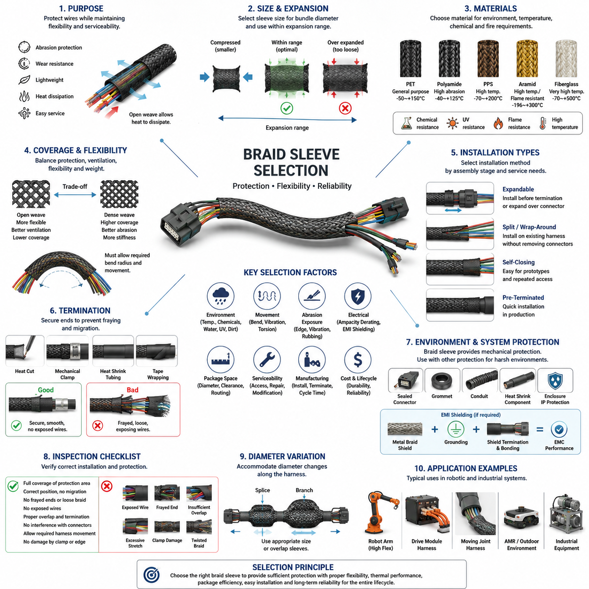
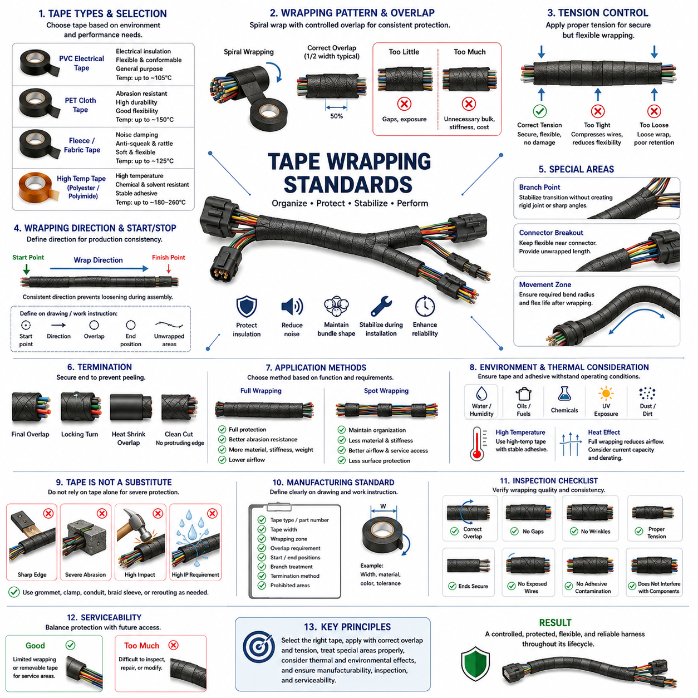
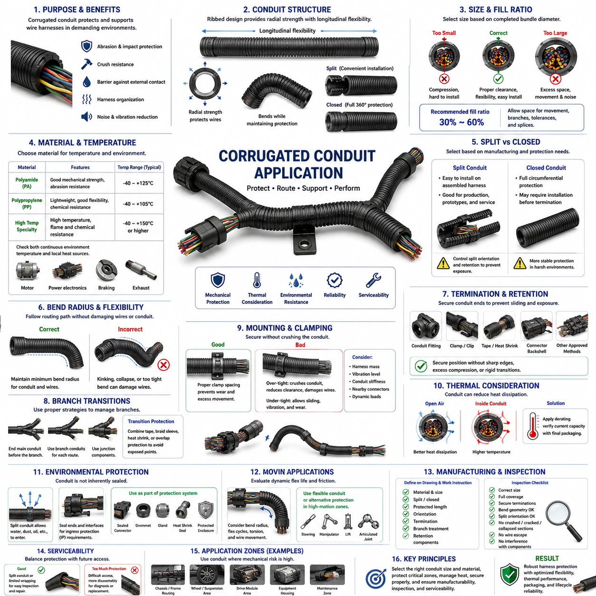
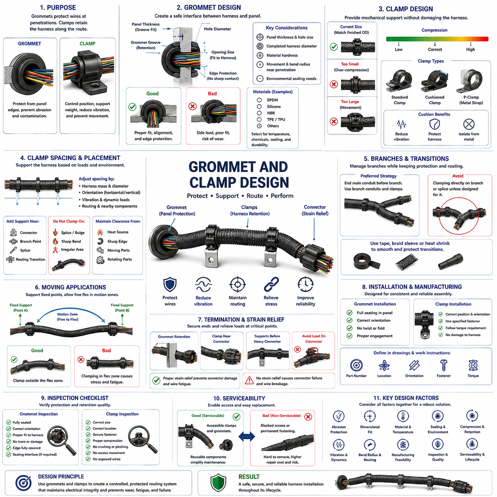
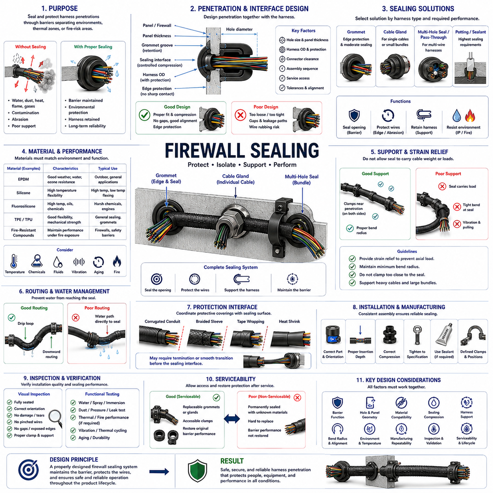

**Volume 02. Wire Harness Engineering**

# Chapter 09. Packaging and Protection

## 09.01. Braid Sleeve Selection

{width="7.268055555555556in" height="7.268055555555556in"}

Braid sleeves are widely used in wire harness engineering to provide mechanical protection while preserving flexibility, low mass, and serviceability. Unlike rigid conduit, a braided sleeve conforms to bundle geometry and permits the harness to bend naturally through routing transitions. Selection should therefore consider not only nominal bundle diameter but also abrasion exposure, movement, temperature, installation method, environmental conditions, and the required level of protection.

The fundamental selection parameter is the relationship between harness bundle diameter and the usable expansion range of the sleeve. Expandable braided sleeving increases in diameter when compressed longitudinally and becomes narrower when stretched. A sleeve should operate comfortably within its specified expansion range rather than at its maximum diameter. Excessive expansion reduces coverage density, while excessive longitudinal tension can make installation difficult and increase local stress around bends, branches, and termination points.

Polyethylene terephthalate, commonly called PET, is one of the most frequently used materials for general-purpose braided sleeving. PET sleeves combine low weight, good abrasion resistance, flexibility, chemical resistance, and relatively economical manufacturing. They are suitable for many low-voltage harnesses, signal cables, sensor wiring, and internal robot wiring where temperatures remain within the material rating. The open braid also allows heat generated inside a bundle to dissipate more readily than many closed protective coverings.

Where temperature, chemical exposure, or fire performance exceeds the capability of conventional PET, alternative fibers and specialized constructions become necessary. Polyamide, PPS, aramid, fiberglass, and other engineered materials can provide increased abrasion resistance, elevated-temperature capability, or improved flame behavior. Material selection must be based on the actual operating environment because a sleeve that performs well against mechanical wear may not necessarily provide adequate resistance to hot surfaces, oils, cleaning chemicals, ultraviolet radiation, or flame.

Abrasion resistance is especially important where a harness passes near chassis structures, brackets, enclosure edges, suspension components, drive modules, or moving mechanisms. The sleeve acts as a sacrificial mechanical interface between the wire insulation and surrounding structure. However, braid protection does not eliminate the need for correct routing. Continuous rubbing against a sharp edge or heavily vibrating surface can eventually wear through both the sleeve and insulation, so adequate clearance, clamps, grommets, and edge protection remain essential.

Flexibility must be evaluated together with abrasion performance. A very robust protective sleeve may increase bundle stiffness and transfer bending loads toward connectors, splices, or unsupported wire sections. For moving robotic harnesses, the protective system should allow the intended bending radius and repetitive motion without producing excessive friction between individual wires. The sleeve should follow the natural motion of the harness rather than forcing the bundle into an artificially rigid mechanical path.

Braid coverage density influences the balance between protection, ventilation, flexibility, and mass. A relatively open braid is lightweight and easily expandable, making installation around connectors and irregular bundle sections convenient. A denser construction provides better surface coverage and generally improves resistance to direct mechanical contact. The designer should avoid assuming that maximum coverage is always preferable because increased material density can reduce flexibility, increase diameter, retain contamination, and influence thermal behavior.

Installation architecture is another major selection factor. Expandable sleeves can often be installed before connector termination or expanded over connectors whose dimensions are larger than the finished cable bundle. Split or wrap-around braided sleeves are useful when the harness is already assembled or when field service requires protection to be added without depinning connectors. Self-closing constructions are particularly useful for prototypes, service modifications, and harnesses requiring repeated access to internal conductors.

Sleeve termination requires deliberate engineering because an unsecured braid can fray, migrate along the bundle, or expose conductors near connectors and branch points. Depending on material and application, ends may be heat-cut, mechanically secured, taped, covered by heat-shrink tubing, or captured beneath dedicated termination features. The termination should prevent unraveling without creating a hard edge or excessive compression that damages wire insulation or concentrates bending stress immediately behind a connector.

Thermal performance must be considered at both the material and harness levels. The sleeve itself requires an adequate continuous operating-temperature rating, including margin for local hot zones and abnormal conditions. At the same time, adding any protective layer can modify heat transfer from bundled conductors. This creates a direct relationship with conduit and sleeve derating considerations elsewhere in wire harness engineering: electrical ampacity should not be evaluated independently from the final physical packaging configuration.

Environmental exposure determines whether an open braided sleeve is sufficient or whether additional protection is required. Conventional braid provides mechanical protection but normally does not create a sealed barrier against water, dust, oils, or conductive contamination. In outdoor robots, industrial equipment, and AMRs operating in dirty environments, braid may therefore form only one layer of a protection system that also includes sealed connectors, grommets, conduit, heat-shrink components, or enclosure-level ingress protection.

Electromagnetic shielding must be distinguished from ordinary mechanical braid protection. Polymer braided sleeves generally protect against abrasion but do not provide meaningful electromagnetic shielding. When shielding is required, conductive metallic braid or specialized shield constructions may be used around sensitive signal or power circuits. Such designs introduce additional requirements for shield coverage, grounding strategy, termination impedance, connector bonding, corrosion resistance, and separation between noisy power circuits and sensitive communication lines.

Harness diameter variation should be evaluated across the entire protected section rather than at a single representative location. Splices, branch transitions, labels, connector backshells, and local wire accumulation can produce significantly larger diameters than the main bundle. The sleeve must accommodate these transitions without excessive expansion or compression. Where diameter changes are large, using multiple sleeve sizes and controlled overlap zones can produce a more reliable result than forcing one sleeve size across the complete harness.

Robot applications place particular emphasis on vibration and repetitive motion. Drive-module harnesses, steering assemblies, manipulators, lift mechanisms, and articulated joints can experience thousands or millions of motion cycles. Sleeve selection should therefore consider not only initial abrasion resistance but also long-term behavior under bending, torsion, sliding contact, and vibration. The protective layer must not migrate into joints, interfere with moving components, or generate debris that could contaminate sensors or mechanical systems.

Packaging efficiency is also important because robotic platforms frequently contain dense combinations of power, communication, sensing, and actuator wiring. A sleeve adds radial thickness and can change the minimum clamp size, passage diameter, connector-access clearance, and required routing space. Designers should include the installed sleeve diameter in the digital harness package rather than applying protection after routing has been finalized. This avoids interference problems and excessive compression during final vehicle or robot assembly.

Manufacturing considerations influence whether a theoretically suitable sleeve is practical in production. Operators must be able to cut, expand, install, position, and terminate the material consistently within the expected cycle time. Sleeve specifications should define material, nominal size, applicable diameter range, protected length, termination method, and any required overlap. Clear drawing information prevents operators from selecting similar-looking materials with different thermal, abrasion, or flame-performance characteristics.

Inspection should verify that the sleeve completely covers the intended protection zone and remains correctly positioned after harness assembly. Inspectors should check for frayed ends, excessive stretching, exposed wires, trapped or folded braid, insufficient overlap, interference with connectors, and restriction of required harness movement. Particular attention is required near clamps and edges because excessive clamp compression can damage both the sleeve and underlying insulation while insufficient retention allows the harness to slide and abrade.

Selection should ultimately be treated as a system-level decision connecting electrical, mechanical, environmental, manufacturing, and service requirements. The preferred braid sleeve is not simply the thickest or highest-rated product, but the construction that provides sufficient protection with acceptable flexibility, thermal behavior, package size, installation effort, and lifecycle durability. This approach aligns braid sleeve engineering with the broader packaging and protection role assigned to Chapter 09 of the wire harness engineering structure.

## 09.02. Tape Wrapping Standards

{width="7.268055555555556in" height="7.268055555555556in"}

Tape wrapping is a fundamental packaging and protection method in wire harness engineering, used to organize conductors, control bundle geometry, protect insulation, reduce noise, and stabilize the harness during installation and operation. Within harness packaging, tape complements braided sleeves, conduits, grommets, and clamps rather than replacing them. The wrapping standard must define material, overlap, tension, direction, termination, and application zones so that production results remain consistent.

Harness tapes are selected according to the mechanical, thermal, electrical, environmental, and manufacturing requirements of each routing zone. Common constructions include PVC electrical tape, PET cloth or fleece tape, fabric tape, and specialized high-temperature materials. Each provides a different balance of abrasion resistance, flexibility, noise suppression, temperature capability, adhesive performance, thickness, and cost, so one tape specification should not automatically be applied throughout an entire robot or vehicle harness.

PVC tape is commonly used where electrical insulation, flexibility, economical processing, and general bundle retention are required. Its conformability allows it to follow irregular harness geometry and branch transitions effectively. However, temperature capability, adhesive aging, chemical exposure, and long-term dimensional stability must be considered. PVC tape intended for ordinary internal wiring should not automatically be used near high-temperature components or in demanding outdoor environments without verifying its specified operating conditions.

PET cloth and textile-based tapes are particularly useful where abrasion resistance and mechanical durability are important. Their woven or nonwoven structures can protect harness surfaces against repeated contact with brackets, panels, and neighboring components while maintaining useful flexibility. Fleece-type tapes may additionally suppress squeak and rattle noise when a harness contacts interior structures. Selection should therefore distinguish between simple bundle retention, abrasion protection, and noise-damping requirements.

High-temperature zones require tapes whose backing and adhesive remain stable throughout the expected thermal exposure. Materials such as polyester, polyimide, fiberglass, or other engineered constructions may be appropriate depending on the required temperature range. Both backing and adhesive ratings must be considered because a heat-resistant carrier provides little benefit if the adhesive softens, migrates, hardens, or loses bonding strength under the same operating conditions.

The wrapping pattern determines how consistently the tape protects and retains the harness. Spiral wrapping is commonly performed with controlled overlap between successive turns so that the underlying wires are not unintentionally exposed. The specified overlap should remain reasonably uniform throughout the wrapped section. Too little overlap can create gaps and inconsistent protection, while excessive overlap increases material consumption, bundle diameter, stiffness, mass, and manufacturing time without necessarily providing proportional improvement.

Wrapping tension must be carefully controlled. Tape should be applied tightly enough to maintain bundle geometry and prevent loose sections, but excessive stretching can compress wires, distort soft insulation, reduce harness flexibility, and place unnecessary stress on branch points or small-gauge conductors. Highly elastic tapes can also attempt to recover after installation, creating long-term contraction forces. Manufacturing instructions should therefore define an appropriate application technique rather than relying entirely on operator judgment.

The direction of wrapping should support manufacturing consistency and prevent the finished tape from loosening during subsequent assembly. A harness drawing or work instruction should define the starting point, wrapping direction, overlap, finishing position, and any regions that must remain unwrapped. Standardized direction becomes particularly important where several operators manufacture the same harness because inconsistent wrapping can change branch orientation, bundle stiffness, dimensions, and installation behavior.

Branch points require special attention because several conductor groups separate from a common trunk and generate irregular geometry. Tape should stabilize the transition without creating an excessively rigid joint that concentrates bending loads immediately beside the branch. Branch wrapping must also avoid forcing wires into sharp angles. Where branches experience movement, the design should preserve sufficient flexibility and strain relief while maintaining adequate bundle retention around the transition.

Connector breakout zones should not be wrapped so rigidly that individual leads cannot naturally align with their connector cavities. Excessive tape close to the connector can transfer harness bending loads directly into terminals, seals, or wire-to-terminal interfaces. A controlled unwrapped length or flexible transition region may therefore be necessary between the main taped bundle and connector rear. This allows connector installation, servicing, and movement without compromising terminal retention or conductor integrity.

Tape termination must prevent peeling and unraveling during handling, vehicle or robot assembly, and long-term operation. The final turns should be firmly secured without creating large adhesive accumulations or protruding edges that can catch on surrounding structures. Depending on the application, termination may use controlled final overlap, additional locking turns, or integration with another protective component. Cutting methods should produce clean ends without damaging the wires beneath the tape.

Full wrapping and spot wrapping serve different engineering purposes. Full wrapping provides continuous bundle retention and surface protection but increases material use, stiffness, mass, and thermal insulation. Spot wrapping applies tape only at selected intervals to maintain conductor organization while leaving much of the bundle exposed. The appropriate method depends on abrasion risk, routing stability, thermal requirements, installation handling, appearance, noise control, and the need for future access to individual wires.

Thermal effects are particularly important when tape completely surrounds conductors carrying significant current. Additional wrapping can restrict airflow and alter heat transfer from the wire bundle, especially when combined with dense packaging or other protective layers. Current-carrying capability and bundle derating should therefore reflect the final harness construction rather than calculations based on isolated wires. Tape wrapping must be considered together with the conduit and sleeve effects addressed elsewhere in wire harness engineering.

Environmental compatibility includes resistance to water, humidity, oils, fuels, cleaning agents, dust, ultraviolet exposure, and other substances expected during the product lifecycle. Adhesive degradation can cause tape lifting, migration, contamination, or loss of bundle retention even when the backing remains mechanically intact. Outdoor AMRs and industrial robots may encounter substantially harsher environments than protected indoor electronics, requiring tape specifications appropriate to the actual installation zone.

Tape should not be treated as a substitute for dedicated protection against severe mechanical hazards. A wrapped harness routed across a sharp metal edge still requires appropriate edge protection, grommets, clamps, or rerouting. Likewise, tape alone is generally insufficient for locations exposed to severe abrasion, repeated sliding contact, substantial impact, or demanding ingress-protection requirements. Braided sleeve, corrugated conduit, heat-shrink components, or other protection may be combined with tape where necessary.

Moving harness sections require special consideration because continuous wrapping can significantly change bending stiffness and friction between conductors. Harnesses serving steering modules, manipulators, lifting mechanisms, and articulated joints must retain the designed bend radius and movement capability after wrapping. Excessive tape thickness or overly tight wrapping can shorten flex life by forcing conductors to move as a rigid bundle instead of distributing motion appropriately through the harness.

Manufacturing drawings and work instructions should identify tape specifications precisely enough to eliminate ambiguity on the production floor. Relevant information includes material or approved part number, tape width, wrapping zone, overlap requirement, start and stop positions, branch treatment, termination method, and any prohibited areas. Where several tape types are used on one harness, each application zone should be clearly distinguishable to prevent substitution based only on similar appearance.

Inspection should verify wrapping consistency rather than merely confirming that tape is present. Typical concerns include gaps, irregular overlap, wrinkles, loose turns, excessive stretching, exposed wires, adhesive contamination, incorrect start or stop positions, excessive bundle compression, and poorly secured ends. Inspectors should also confirm that wrapping does not obstruct connector locking features, labels, clips, mounting points, service interfaces, or required movement of the completed harness.

Serviceability must be included in the wrapping strategy. Completely wrapped harnesses can be difficult to inspect, modify, diagnose, or repair because individual wires and splice locations are hidden. Sections likely to require field access may benefit from removable or limited wrapping strategies, while critical protected sections may justify complete coverage. The design should balance manufacturing robustness and lifecycle protection against the practical need to troubleshoot and service the electrical system.

A robust tape wrapping standard therefore treats tape as an engineered component of the complete harness protection system. Material selection, wrapping pattern, overlap, tension, branch treatment, thermal influence, environmental compatibility, manufacturing repeatability, inspection, and serviceability must be considered together. Properly standardized wrapping produces a controlled bundle that remains flexible, protected, manufacturable, and reliable throughout the operating life of robotic and industrial electrical systems.

## 09.03. Corrugated Conduit Application

{width="7.268055555555556in" height="7.268055555555556in"}

Corrugated conduit is a widely used protective component in wire harness engineering when electrical conductors require stronger mechanical protection than tape wrapping or braided sleeving can provide. Its ribbed tubular structure surrounds the wire bundle and creates a physical barrier against abrasion, impact, crushing, and contact with surrounding components. Within harness packaging, conduit selection must balance protection, flexibility, thermal behavior, package size, manufacturing effort, and serviceability.

The corrugated geometry gives conduit its characteristic combination of radial stiffness and longitudinal flexibility. Repeated ribs allow the tube to bend while maintaining a protective wall around the conductors. This makes corrugated conduit particularly useful where a harness follows curved chassis surfaces or passes through mechanically exposed regions. However, flexibility varies significantly with material, wall thickness, diameter, rib geometry, and whether the conduit uses a split or closed construction.

Conduit size should be selected from the completed wire bundle diameter rather than from the diameter of individual conductors. Sufficient internal clearance is required to install wires without excessive compression and to accommodate normal manufacturing variation. A conduit that is too small can compress insulation, increase insertion difficulty, and produce an unnecessarily stiff assembly, while excessive conduit diameter increases package space and allows the bundle to move or rattle inside the protective tube.

The conduit fill ratio is therefore an important design parameter. Designers should provide enough free internal space for conductor movement, branch transitions, tolerance variation, and practical assembly while avoiding excessive unused volume. Harnesses containing splices or locally enlarged sections require additional consideration because their maximum diameter may be substantially greater than the nominal trunk diameter. Conduit sizing should be verified along the entire protected route rather than at one representative cross-section.

Material selection depends strongly on operating temperature and environmental exposure. Polyamide and polypropylene constructions are commonly associated with general harness protection, while specialized materials can support elevated temperatures, improved chemical resistance, or demanding flame-performance requirements. The specified temperature range must include both continuous environmental temperature and local heat sources because conduit positioned near motors, power electronics, braking components, or other hot equipment may experience significantly higher temperatures.

Abrasion and impact protection are major reasons for selecting corrugated conduit. Harnesses routed near structural frames, metal brackets, equipment housings, wheel assemblies, drive modules, or maintenance areas can experience repeated mechanical contact. The conduit provides a sacrificial protective layer before external forces reach the wire insulation. Nevertheless, it should not be considered permission to route a harness directly against sharp edges or continuously moving surfaces without appropriate clearance and retention.

Split corrugated conduit provides convenient installation because an assembled harness can be inserted through the longitudinal opening without removing connectors or terminals. This construction is useful for production assembly, prototypes, modifications, and field repairs. The split, however, creates a preferential opening through which wires may become exposed if the conduit twists or is poorly retained. Split orientation and local fixation should therefore be controlled where direct abrasion or contamination is possible.

Closed or unsplit conduit provides continuous circumferential protection but generally requires conductors to be inserted before final connector termination, or requires the conduit to pass over connector components. This can increase manufacturing complexity but may provide more stable protection in demanding applications. Selection between split and closed conduit should therefore consider the harness manufacturing sequence, connector dimensions, required protection level, maintenance strategy, and expected installation process.

Bend radius must be considered because corrugated construction does not eliminate the mechanical limitations of the wires inside it. The conduit should follow the required routing path without collapsing, kinking, opening excessively, or forcing the conductors below their allowable bend radius. Tight bends can also cause the internal wire bundle to press strongly against the inner wall of the conduit, increasing local friction and potentially reducing durability during vibration or repeated movement.

Conduit termination is critical because an unsupported tube can slide along the harness and expose the protection zone it was intended to cover. Ends may be retained using dedicated fittings, clips, tape, heat-shrink components, connector backshell features, or other approved methods. The termination should control conduit position without producing sharp edges, excessive compression, or rigid transitions that transfer bending stress directly into connector terminals or adjacent unsupported wires.

Branch points require a transition strategy because a single conduit cannot always follow multiple harness branches efficiently. The main conduit may terminate before the branch, while individual branch conduits continue along separate routes, or specialized junction components may be used. The transition must maintain protection without creating exposed abrasion points. Tape, braided sleeve, heat-shrink material, or overlapping protection may be combined locally to manage irregular branch geometry.

Clamps and mounting features should retain the conduit and harness without crushing the corrugated structure. Excessive clamp force can deform the conduit, reduce internal clearance, damage wires, or create a local stiffness discontinuity. Insufficient retention allows sliding and vibration that can generate wear. Clamp spacing should therefore reflect harness mass, routing direction, vibration environment, conduit stiffness, nearby connectors, and the dynamic loads expected during robot or vehicle operation.

Thermal effects are especially important because conduit surrounds the wire bundle and can reduce convective heat dissipation. Conductors that satisfy ampacity requirements in open air may operate at higher temperatures when enclosed in conduit, particularly in dense bundles or hot environments. Current-capacity calculations should therefore account for the final packaging configuration and applicable derating. This directly connects corrugated conduit application with the conduit and sleeve effect considered in the harness derating structure.

Corrugated conduit should not automatically be interpreted as a sealed environmental barrier. Standard split constructions can readily admit water, dust, oil, and other contaminants, while even closed tubing requires appropriate end sealing and interfaces if ingress protection is necessary. Outdoor AMRs and industrial robots may therefore require conduit to operate as one layer within a broader protection architecture that includes sealed connectors, grommets, glands, heat-shrink seals, and protected enclosures.

Moving robotic applications require additional caution. Although corrugated conduit is flexible, conventional products may not be designed for millions of repetitive bending cycles. Steering systems, manipulators, lift mechanisms, suspension movement, and articulated joints can subject the harness to continuous bending and torsion. In such zones, the designer should evaluate dynamic flex life, conduit friction, minimum bend radius, wire movement, and whether a specialized flexible protection system is more appropriate.

Noise and vibration behavior can also influence conduit application. Relative movement between wires and the corrugated inner surface may generate rattling or wear, while contact between the external ribs and chassis structures can produce noise. Correct bundle sizing, retention, routing clearance, and clamp positioning reduce these effects. Where noise requirements are stringent, textile tape or other damping materials may be applied strategically rather than relying on conduit alone to control movement.

Packaging space is a significant design consideration because conduit increases the overall harness diameter more than many tape or braid solutions. The external rib diameter must be considered when defining routing corridors, holes, brackets, clamp sizes, enclosure passages, and connector access. Digital packaging models should represent the finished protected harness rather than the bare wire bundle so that mechanical interference and assembly restrictions can be detected before hardware production.

Manufacturing requirements should define conduit material, nominal size, split or closed construction, protected length, orientation, termination, branch treatment, and associated retention components. Cutting operations should leave clean ends without sharp projections capable of damaging wires. Work instructions should also define how wires are inserted into split conduit and how the split is oriented after assembly, especially in locations where the opening could otherwise face an abrasion source.

Inspection should verify more than the presence of conduit. The completed harness should be checked for correct conduit size, full coverage of specified protection zones, secure terminations, acceptable bend geometry, correct split orientation, and absence of crushed, cracked, collapsed, or excessively stretched sections. Inspectors should also confirm that wires do not escape through the split and that conduit does not interfere with connectors, clips, moving mechanisms, labels, or service access.

Serviceability should be considered when deciding how extensively conduit is applied. Split conduit provides relatively easy access for inspection and wire replacement, whereas heavily taped or permanently terminated conduit may require significant disassembly. Protection should therefore be concentrated where mechanical risk justifies it while maintaining practical access to connectors, splices, diagnostic points, and replaceable harness sections whenever lifecycle maintenance is expected.

Effective corrugated conduit application is ultimately a system-level packaging decision rather than a simple choice to add a protective tube. Diameter, fill ratio, material, temperature, abrasion, bend radius, termination, clamping, environmental exposure, thermal derating, manufacturing, inspection, and service requirements must be evaluated together. Correct application provides robust mechanical protection without unnecessarily increasing stiffness, heat retention, package volume, or lifecycle maintenance difficulty.

## 09.04. Grommet and Clamp Design

{width="7.268055555555556in" height="7.268055555555556in"}

Grommets and clamps are fundamental mechanical protection and retention components in wire harness engineering. Grommets protect wires where a harness passes through panels, frames, brackets, or enclosure walls, while clamps control harness position along the routing path. Their combined purpose is to prevent abrasion, excessive movement, vibration damage, and load transfer into connectors while maintaining the intended geometry of the electrical installation.

A grommet creates a compliant interface between the harness and the edge of a penetration hole. Without this protection, vibration or relative movement can cause a metal or composite panel edge to progressively cut into wire insulation. The grommet distributes contact forces over a larger surface and isolates the bundle from sharp edges. Proper design must therefore consider panel thickness, hole geometry, bundle diameter, material hardness, retention features, and expected harness movement.

Grommet sizing should be based on both the mounting hole and the completed protected harness diameter. The groove must correctly engage the panel thickness, while the internal opening must accommodate the harness without excessive compression. An undersized opening can squeeze wires and increase local stiffness, whereas an oversized opening permits excessive movement and may provide inadequate edge protection. Manufacturing tolerances for the panel, grommet, and harness should be included in the dimensional analysis.

Grommet materials are selected according to temperature, chemical exposure, flexibility, sealing requirements, and lifecycle durability. Elastomeric materials such as EPDM, silicone, and other engineered rubbers are commonly applicable depending on the environment. Material hardness influences both installation and retention: a very soft material may deform excessively, while an overly hard material may provide poor conformity or transfer greater mechanical loads to the harness.

Where environmental sealing is required, the grommet becomes part of the ingress protection strategy rather than merely an abrasion barrier. Sealing performance depends on controlled compression against the panel and harness interfaces. Water, dust, oils, cleaning fluids, and other contaminants can enter through poorly designed penetrations. A conventional open grommet should not be assumed to provide waterproofing unless its geometry and material are specifically designed and validated for sealing.

The harness should pass through a grommet with a controlled alignment that avoids severe side loading. If the routing path immediately changes direction after the penetration, the bundle can press strongly against one side of the grommet and generate concentrated wear. Providing sufficient straight length and an appropriate bend radius around the penetration reduces this effect. Nearby clamps can be used to stabilize the harness and prevent continuous movement at the grommet interface.

Clamps perform a different but complementary function by establishing mechanical support points along the harness route. They control lateral movement, maintain clearance from hazards, support harness mass, and prevent vibration from being transmitted over long unsupported spans. Correct clamp placement converts an unconstrained wire bundle into a controlled mechanical system while still allowing the flexibility required for assembly tolerances, thermal expansion, and intended component movement.

Clamp size should match the finished outside diameter of the protected harness, including tape, braid, or corrugated conduit. Selecting a clamp from the bare wire diameter can result in excessive compression after protection materials are added. Conversely, an oversized clamp may allow the harness to slide, rotate, or impact surrounding structures. Digital packaging and drawings should therefore represent the final harness construction when defining clamp dimensions.

Clamp compression must be sufficient to retain the harness without damaging insulation or protective coverings. Excessive tightening can flatten conduit, cut into braid, deform tape wrapping, compress wire insulation, or create a severe local stiffness transition. Insufficient compression permits sliding and fretting. The desired condition is controlled retention in which the harness remains positioned under expected loads without destructive radial pressure.

Cushioned clamps, often using an elastomeric or polymer interface, can reduce vibration transmission and protect the harness from direct contact with metallic mounting hardware. These components are especially valuable in high-vibration zones near motors, drive modules, suspension systems, pumps, or mobile machinery. The cushion material must remain mechanically and chemically stable throughout the operating temperature range and should not deteriorate into a source of looseness or contamination.

Clamp spacing cannot be defined by one universal distance because the required support depends on harness mass, diameter, stiffness, routing orientation, vibration spectrum, dynamic acceleration, and nearby components. Horizontal runs may behave differently from vertical runs, and heavy power cables require different support from lightweight signal bundles. Support spacing should therefore be established from the mechanical behavior of the actual harness and validated under representative operating conditions.

Additional retention is normally required near connectors, branch points, splices, and major routing transitions. A connector should not support the mass of a long harness section or absorb repeated bending loads from an unsupported bundle. Properly positioned clamps provide strain relief by reacting these loads through the mechanical structure. However, placing a clamp too close to a connector can create an excessively rigid transition and prevent the harness from naturally accommodating assembly variation.

Branch points require careful clamp placement because multiple harness paths create competing mechanical loads. The main trunk should remain stable while each branch follows its intended direction without being pulled sharply against the branch transition. Clamping directly on an irregular splice or branch enlargement should generally be avoided unless the component is designed for that purpose. Support should instead stabilize the surrounding harness while preserving adequate bend radius and protection.

Clamps should maintain separation between the harness and heat sources, sharp edges, rotating components, suspension elements, and other moving mechanisms. Mechanical retention is therefore directly connected to routing engineering. A theoretically adequate protective sleeve or conduit can still fail if poor clamp placement allows the harness to migrate into a hazardous region. Clamp locations should be considered part of the routing definition rather than added after the routing path has been finalized.

Moving harness sections require a different retention philosophy from static sections. A cable serving a steering mechanism, manipulator, lift, or articulated joint must be supported while retaining sufficient free length for its full motion envelope. Clamps should define controlled fixed points around the dynamic section rather than restraining the portion intended to flex. Incorrect fixation can concentrate repeated bending at one location and dramatically reduce wire fatigue life.

Grommets and clamps can also influence thermal behavior. Tight compression reduces air space around the harness locally, while routing supports determine proximity to hot structures and airflow paths. Metallic clamps may conduct heat from the mounting structure toward the harness, whereas polymer or elastomer interfaces can provide some thermal isolation. These effects should be considered when installations operate near the temperature limits of wires or protective materials.

Manufacturing design should ensure that grommets and clamps can be installed consistently without excessive force or specialized rework. Grommets should seat fully in their panel openings without twisting, folding, or partial engagement. Clamps should have clearly defined mounting positions, orientations, fasteners, and tightening requirements. Harness drawings and work instructions should identify component part numbers and installation details sufficiently to prevent substitution or inconsistent assembly.

Inspection of grommets should verify full seating, correct orientation, proper engagement with the panel, absence of tears or deformation, and appropriate fit around the harness. Inspectors should confirm that no sharp panel edge remains exposed to the wire bundle and that the grommet has not been displaced during harness installation. Where sealing is required, the sealing interface should also be examined according to the applicable validation and assembly requirements.

Clamp inspection should verify correct component size, mounting position, orientation, fastener security, and harness retention. The harness should not show crushing, pinching, exposed conductors, damaged protection, or excessive freedom to slide. Particular attention should be given to clamps near bends and connectors because these locations can unintentionally create concentrated mechanical loads even when the clamp itself appears correctly installed.

Serviceability is important because clamps and grommets often determine how easily a harness can be removed or replaced. Retention components should be accessible where practical and should not require unnecessary removal of unrelated equipment. Reusable clamps can simplify field maintenance, while damaged or hardened grommets should be replaceable without compromising surrounding wiring. Service procedures should restore the original routing, support, and protection configuration after repair.

Effective grommet and clamp design therefore requires coordinated consideration of abrasion protection, dimensional fit, material compatibility, sealing, compression, vibration, bend radius, routing, dynamic movement, manufacturing, inspection, and serviceability. Properly designed components maintain the harness in a controlled mechanical state throughout its lifecycle, protecting electrical integrity while preventing the routing system itself from becoming a source of wear, fatigue, or failure.

## 09.05. Firewall Sealing

{width="7.268055555555556in" height="7.268055555555556in"}

Firewall sealing in wire harness engineering protects electrical penetrations where harnesses pass through structural barriers separating different environmental, thermal, contamination, or fire-risk zones. Within the packaging and protection architecture, the seal must preserve the barrier function while allowing conductors to pass safely through it. A successful design combines mechanical protection, environmental isolation, harness retention, and long-term durability without damaging the wires.

The term firewall can refer to a structural partition intended to restrict the transfer of heat, flame, smoke, fluids, gases, dust, or other environmental effects between adjacent compartments. In robotic and industrial systems, similar sealing principles apply to enclosure walls, battery compartments, power-electronics zones, motor compartments, and outdoor equipment housings. The required sealing performance must therefore be defined from the actual barrier function rather than from the penetration geometry alone.

Every harness penetration creates a potential weakness in the barrier. An unsealed hole can provide a direct path for water, dust, hot gases, contaminants, or flame products, while a poorly supported harness can rub against the panel edge. Firewall sealing must consequently address both the open area around the harness and the mechanical interface between wires and structure. Edge protection alone does not provide sealing, and sealing material alone does not automatically provide adequate mechanical support.

The penetration geometry should be designed together with the harness rather than added after the routing layout is complete. Hole diameter, panel thickness, harness outside diameter, connector dimensions, protective coverings, assembly sequence, and service access all influence the sealing concept. Excessive clearance makes sealing more difficult, while insufficient clearance can compress wires or make assembly impractical. Dimensional tolerances must be included when determining the final interface.

Grommets can provide an effective transition where a harness passes through a panel, particularly when edge protection and moderate environmental isolation are required. A sealing grommet differs from a simple protective grommet because its geometry is designed to maintain controlled contact with both the panel and harness. Material elasticity, groove engagement, compression, surface condition, and harness diameter must remain within the intended range if the interface is expected to resist environmental ingress.

Cable glands provide a more controlled sealing solution when individual cables or compact bundles pass through an enclosure wall. The gland typically combines mechanical retention with radial sealing around the cable and sealing against the mounting surface. Correct cable diameter is essential because the sealing element operates over a specified compression range. An undersized cable may not seal effectively, while an oversized cable can overstress the seal or make assembly impossible.

Multi-wire harnesses present greater sealing difficulty because irregular spaces exist between individual conductors. Compressing an external seal around the bundle may close the outside perimeter while leaving internal leakage paths between wires. Molded pass-through components, multi-hole seals, dedicated cable-entry systems, potting materials, or other engineered interfaces may therefore be required where high sealing performance is necessary. The solution should be selected according to the required environmental and safety function.

Sealing materials must be compatible with the expected temperature, fluids, chemicals, vibration, and service life. Elastomers such as EPDM or silicone may be suitable for many flexible sealing applications, while specialized compounds may be required for elevated temperatures or aggressive environments. Compatibility must include both the seal and surrounding wire insulation because plasticizers, oils, cleaning agents, adhesives, or thermal aging can alter material properties over time.

Fire-resistant sealing requires additional consideration beyond ordinary water or dust protection. Where the structural barrier has a defined fire-containment function, the penetration system should maintain the required performance under thermal exposure rather than merely preventing normal environmental ingress. Seal materials, cable construction, opening geometry, installation method, and supporting structure must operate as an integrated system. Ordinary rubber grommets or general-purpose sealants should not automatically be considered fire barriers.

The harness should be mechanically supported on appropriate sides of the firewall penetration so that the seal does not carry excessive cable weight or dynamic loads. Clamps can establish controlled support points and prevent vibration, pulling, or bending forces from being transferred directly into the sealing interface. This is especially important for heavy power cables and large bundles. A sealing component should primarily maintain the barrier rather than function as the only structural support for the harness.

Strain relief must prevent axial loads from gradually pulling the harness through the seal or changing the compression condition. Relative movement can enlarge openings, damage elastomer surfaces, loosen glands, or create leakage paths. Support locations should therefore account for harness mass, acceleration, vibration, assembly forces, and expected service loads. However, clamps should not be positioned so close to the penetration that they force the harness into an excessively sharp bend.

Bend radius around the firewall interface must remain compatible with both the wires and sealing component. A harness that changes direction immediately after passing through the barrier can apply continuous side pressure to a grommet or gland, producing uneven compression and accelerated wear. Providing an appropriate straight section before the first major bend helps maintain alignment. This also improves installation repeatability and reduces mechanical stress at the penetration.

Water sealing requires attention to the direction from which moisture can approach the penetration. Harness routing should avoid creating a path that naturally guides water toward the seal. Where appropriate, routing geometry can incorporate a drip loop or downward section so that water drains away before reaching the penetration. The sealing interface must still provide the specified protection because routing strategy is a supplementary measure rather than a substitute for a correctly designed seal.

Outdoor AMRs and industrial robots can experience rain, washdown, condensation, dust, mud, oils, and temperature cycling. Repeated heating and cooling can change seal compression because the panel, harness, and elastomeric components have different thermal expansion characteristics. Vibration and contamination can further accelerate degradation. Firewall sealing for these applications should therefore be evaluated as a lifecycle interface rather than only by its condition immediately after assembly.

Battery and power-electronics compartments may require particularly careful penetration management because electrical cables cross boundaries associated with energy, heat, contamination, or safety functions. High-current cables can also have large diameters and substantial stiffness, increasing mechanical loads on the seal. The design should maintain required electrical clearances, cable bend radius, thermal capability, and mechanical support while preserving the environmental or safety function of the compartment boundary.

Protection components surrounding the harness must be coordinated with the sealing interface. Tape, braided sleeve, corrugated conduit, and heat-shrink materials change the external diameter and surface texture presented to the seal. A gland designed to seal directly against a smooth cable jacket may not provide equivalent performance when compressed over corrugated conduit or irregular braid. The sealing surface should therefore be deliberately defined rather than determined accidentally by upstream harness packaging.

Transitions from conduit or braid to a sealed penetration often require a controlled termination before the sealing interface. The protective covering may end before the seal so that the sealing element contacts the cable or a dedicated smooth transition component. Heat-shrink tubing can sometimes provide a controlled external surface or transition, depending on the application. Any such solution must avoid trapping moisture or creating a rigid section that concentrates bending stress.

Manufacturing repeatability is essential because sealing performance depends heavily on assembly quality. Work instructions should define the sealing component, mounting orientation, cable or bundle diameter range, insertion depth, required compression, fastener or gland tightening requirements, and associated clamps. Sealant quantity and application location should also be controlled where sealants are used. Excess material can interfere with assembly, while insufficient or discontinuous application can leave leakage paths.

Inspection should verify that the sealing component is fully seated, correctly oriented, undamaged, and properly engaged with the firewall or enclosure wall. The harness should be centered or positioned according to the design, without pinched wires, folded seals, exposed panel edges, or abnormal side loading. Glands should be properly secured, and sealing materials should show continuous coverage where required. Visual inspection should be supplemented by appropriate functional validation when sealing performance is critical.

Validation methods depend on the intended barrier function. Environmental penetrations may require water-spray, immersion, dust, pressure, or leakage testing, while safety-related barriers may require thermal or fire-performance verification according to the applicable product requirements. Vibration, thermal cycling, and aging tests can reveal failures that are not visible during initial assembly. Validation should therefore represent the combined environmental and mechanical stresses expected throughout the product lifecycle.

Serviceability must be considered because firewall penetrations may need to be opened when a harness, connector, battery, motor, or electronic module is replaced. A serviceable sealing architecture should allow disassembly and restoration without uncontrolled cutting or application of unspecified sealant. Replaceable grommets, glands, seals, or modular pass-through components can improve maintenance consistency. After service, the original barrier performance must be restored and verified where necessary.

Effective firewall sealing is therefore a system-level interface design connecting harness packaging, mechanical retention, environmental protection, thermal management, and safety. Penetration geometry, seal material, cable diameter, compression, strain relief, bend radius, protective coverings, manufacturing, inspection, validation, and serviceability must be considered together. Correct design preserves the intended compartment barrier throughout the equipment lifecycle while allowing the electrical harness to pass through safely and reliably.
