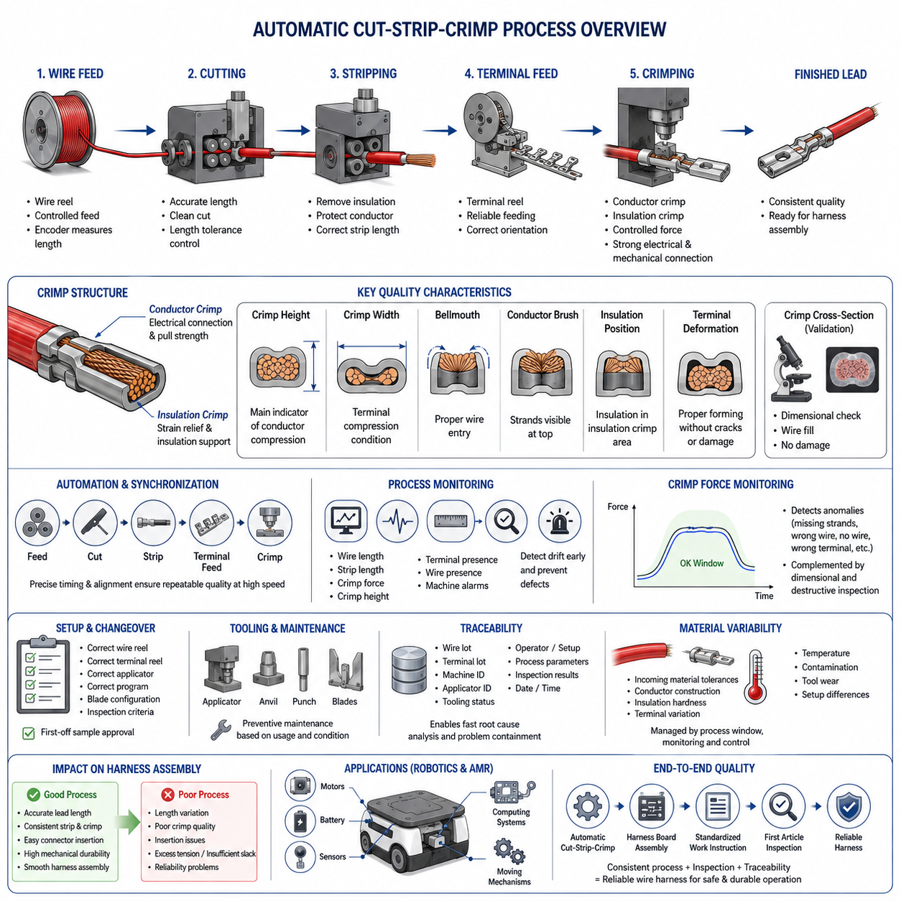
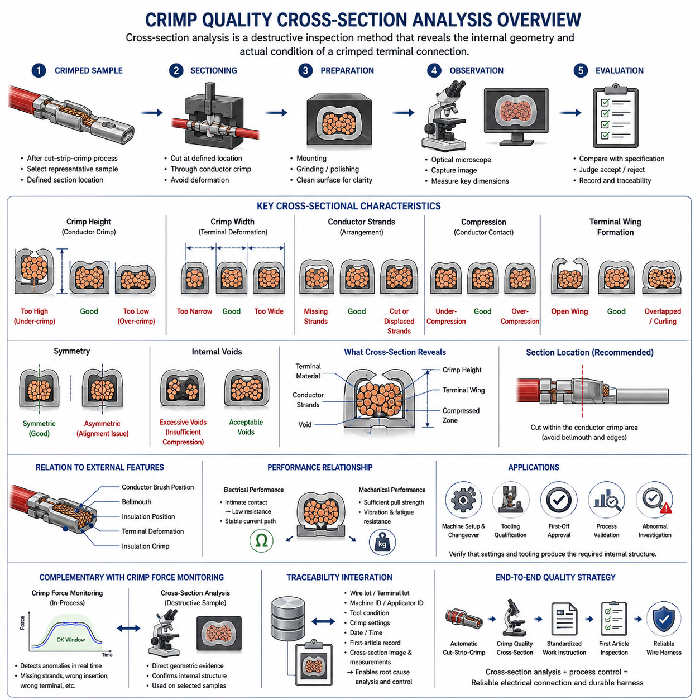
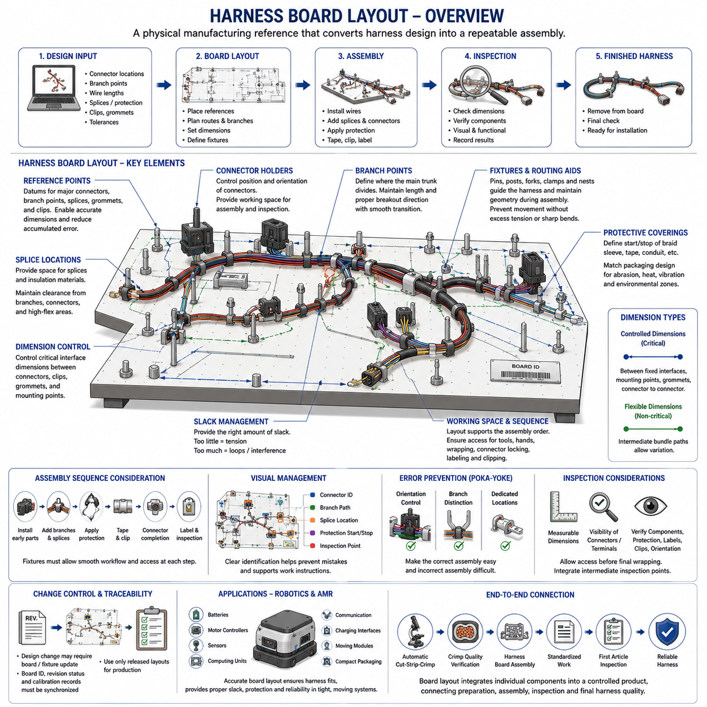
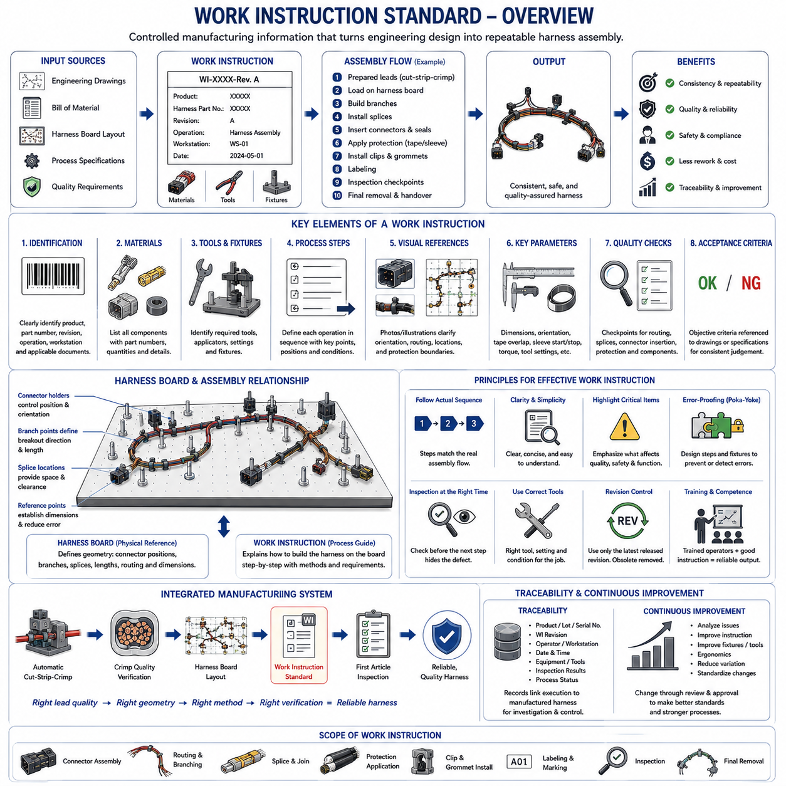
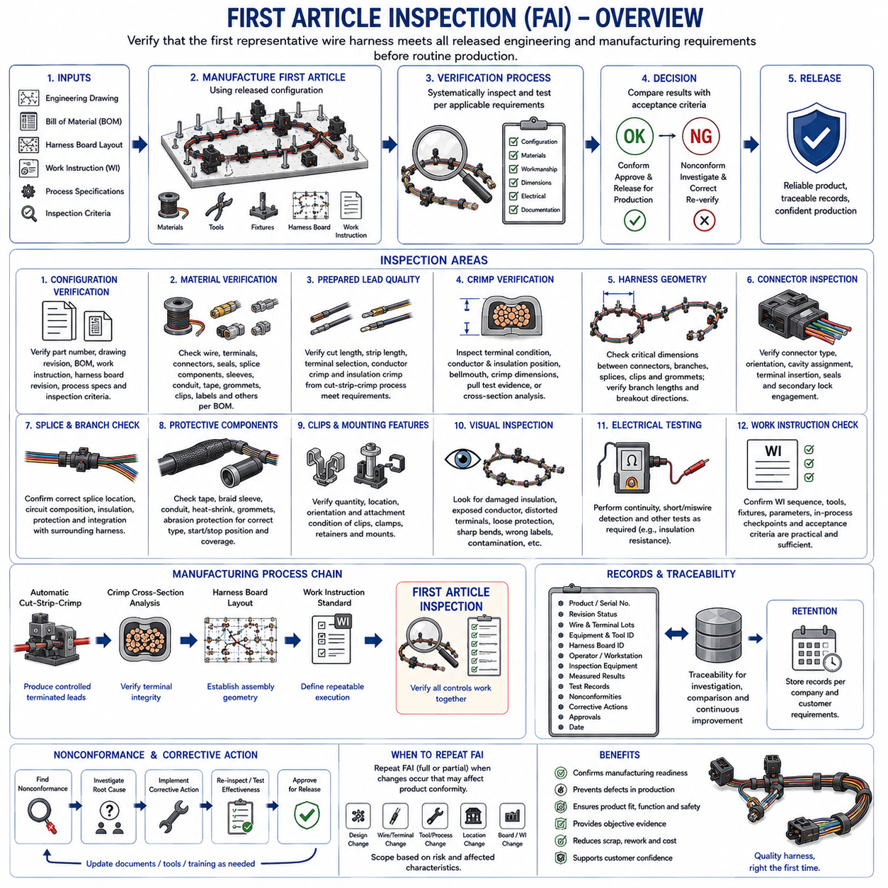

**Volume 02. Wire Harness Engineering**

# Chapter 10. Manufacturing and Process

## 10.01. Automatic Cut Strip Crimp

{width="7.268055555555556in" height="7.268055555555556in"}

Automatic cut-strip-crimp processing integrates three fundamental wire-harness manufacturing operations into a controlled production sequence: cutting wire to a specified length, removing insulation from the conductor ends, and mechanically attaching terminals by crimping. Within wire harness manufacturing, this process provides the transition from bulk wire and loose terminals to repeatable terminated leads that can later be assembled into connectors and complete harnesses.

The process normally begins with production data defining the wire type, conductor cross-sectional area, insulation characteristics, finished wire length, strip length, terminal part number, and required crimp configuration. Automated equipment converts these engineering specifications into machine parameters. Correct data management is essential because even a mechanically stable machine can continuously produce incorrect parts when the selected wire, terminal, applicator, or dimensional program does not match the released harness definition.

Wire cutting establishes the dimensional foundation of the manufactured lead. A feeding mechanism advances wire from a reel through rollers or belts while an encoder or comparable measuring system determines the required length. The cutting mechanism must produce a clean end without excessively deforming the insulation or conductor. Feed accuracy, wire straightness, roller pressure, blade condition, and acceleration characteristics can influence finished length, particularly when flexible or small-gauge wires are processed at high production speeds.

Stripping removes a controlled section of insulation while preserving the conductor strands underneath. The stripping blades must penetrate sufficiently to separate the insulation but must not nick, cut, scrape, or excessively compress the conductor. Strip length must also correspond to the terminal geometry so that the conductor is positioned correctly inside the conductor crimp while the insulation enters the insulation-support region. Incorrect stripping can therefore create defects that become difficult to detect after the terminal has been crimped.

Crimping creates a permanent mechanical and electrical connection by plastically deforming the terminal wings around the conductor. During automatic processing, the stripped wire is positioned relative to a terminal supplied from a reel or carrier strip, and an applicator forms the terminal using a controlled press stroke. The resulting connection depends on the combined behavior of terminal material, conductor strands, tooling geometry, press setup, crimp height, wire position, and the consistency of the preceding stripping operation.

The conductor crimp and insulation crimp perform different functions. The conductor crimp establishes the principal electrical interface and mechanical retention between the terminal and conductor, while the insulation crimp supports the insulated portion of the wire and reduces mechanical stress near the conductor termination. These regions must therefore be evaluated separately. Excessive compression can damage strands or insulation, whereas insufficient compression can produce high resistance, poor pull strength, unstable contact behavior, or premature fatigue.

Crimp height is one of the most important process characteristics because it provides a practical indication of conductor compression. It is typically controlled for a defined combination of wire size, terminal, and tooling rather than treated as a universal value. Crimp width, terminal geometry, conductor brush position, bellmouth formation, insulation position, and terminal deformation provide additional evidence of process quality. These characteristics are subsequently examined more deeply through crimp cross-section analysis.

Automatic equipment requires precise synchronization between wire feeding, cutting, stripping, terminal feeding, positioning, and press operation. A small timing or alignment error can propagate through the sequence and create repeated defects at production speed. For example, inaccurate strip length can change conductor insertion depth, while unstable terminal feeding can shift the crimp position. Process engineering must consequently consider the entire machine sequence as one coupled manufacturing system rather than treating cutting, stripping, and crimping as independent operations.

Tooling condition strongly influences process capability. Cutting and stripping blades gradually wear, terminal applicators accumulate contamination and mechanical wear, and crimp tooling can lose dimensional consistency after extended production. Preventive maintenance should therefore be based on production quantity, measured condition, and historical process behavior. Tool identification and configuration control are equally important because visually similar terminals may require different applicators, anvils, punches, feed adjustments, or crimp settings.

Production monitoring provides a means of detecting process drift before defective leads propagate into harness assembly. Depending on the equipment and quality strategy, monitored variables can include finished wire length, strip dimensions, crimp force signatures, crimp height measurements, terminal presence, wire presence, and machine alarms. Statistical evaluation of measured characteristics can reveal gradual movement toward specification limits and enables corrective action before the process produces a significant quantity of nonconforming material.

Crimp force monitoring evaluates the force behavior generated during terminal deformation and can identify deviations associated with missing strands, incorrect wire insertion, missing wire, incorrect terminals, or abnormal material conditions. It should not be interpreted as a complete substitute for dimensional and destructive inspection. A force signature indicates whether the forming event differs from an established process pattern, while crimp-height measurement, pull testing, visual inspection, and cross-section analysis provide complementary evidence of actual termination quality.

Machine setup and changeover are particularly important when one production system processes multiple wire-terminal combinations. The operator or manufacturing system must verify the correct wire reel, terminal reel, applicator, program, blade configuration, and inspection criteria before production release. First-off samples are commonly used to demonstrate that the configured process produces acceptable dimensions and termination characteristics before continuous production begins, reducing the risk of systematic defects caused by an incorrect setup.

Traceability connects the manufactured lead to the conditions under which it was produced. Production records may associate a batch with wire and terminal lots, machine identification, applicator identification, tooling status, operator or setup information, process parameters, inspection results, and manufacturing time. Such records become valuable when a later harness inspection identifies a defect because engineers can determine whether the issue is isolated or potentially affects other products manufactured under the same conditions.

Automatic processing improves throughput and repeatability, but automation does not eliminate manufacturing variation. Incoming material tolerances, conductor construction, insulation hardness, terminal dimensional variation, reel handling, tooling wear, machine temperature, contamination, and setup differences can all influence the final termination. A capable manufacturing process therefore combines automation with defined process windows, controlled tooling, preventive maintenance, measurement-system discipline, inspection, and systematic response to abnormal trends.

The manufacturing sequence also influences downstream harness operations. Accurate lead lengths simplify harness-board placement, consistent strip and crimp geometry improves connector insertion, and correctly formed insulation crimps improve mechanical durability during routing and service. Conversely, dimensional variation introduced during automatic processing can appear later as connector-position errors, excessive tension, insufficient slack, assembly difficulty, or reliability problems. Manufacturing quality must therefore be evaluated against the complete harness design intent.

For robotics and AMR harnesses, process consistency becomes particularly important because terminated wires may operate near motors, batteries, sensors, computing systems, and moving mechanical assemblies. Electrical resistance, mechanical retention, and strain resistance must remain predictable despite vibration and repeated operating cycles. Automatic cut-strip-crimp manufacturing provides the repeatable production foundation, while subsequent harness-board assembly, standardized work instructions, and first-article inspection extend that control to the completed harness manufacturing process.

## 10.02. Crimp Quality Cross Section

{width="7.268055555555556in" height="7.268055555555556in"}

Crimp quality cross-section analysis is a destructive inspection method used to evaluate the internal geometry of a crimped terminal after the conductor and terminal wings have been mechanically compressed together. While external inspection can identify visible deformation, conductor position, bellmouth, or insulation-related defects, a prepared cross-section reveals how individual conductor strands, terminal wings, and compressed material actually interact inside the crimp. It is therefore an important verification method within wire harness manufacturing.

A cross-section is normally prepared by cutting the crimped terminal at a defined location through the conductor crimp region. The sample must be sectioned without introducing excessive mechanical deformation that could alter the geometry being inspected. After cutting, the exposed surface is typically prepared so that the boundaries of conductor strands, terminal material, voids, and compressed regions can be clearly distinguished. Consistent sample preparation is essential because poor preparation can create artifacts that may be incorrectly interpreted as manufacturing defects.

The inspection plane must represent the region intended for evaluation. A section taken too close to the bellmouth, transition region, or terminal edge may not represent the stable compression geometry of the conductor crimp. For this reason, manufacturing specifications normally define where the terminal should be sectioned. Repeatable section positioning enables measurements from different production samples, machines, applicators, and manufacturing lots to be compared under equivalent geometric conditions.

Crimp height is one of the primary characteristics associated with cross-sectional quality. It represents the final compressed height of the conductor crimp and provides an indirect indication of the degree of compression applied to the wire-terminal combination. A crimp height that is too large may indicate insufficient compression, while an excessively small value can indicate over-compression. The acceptable range must be established for the specific terminal, conductor size, conductor construction, and tooling combination rather than treated as a universal requirement.

Crimp width provides complementary information about terminal deformation. During crimping, the terminal wings move around the conductor and are formed by the punch and anvil geometry. The resulting width, together with crimp height, helps characterize the final shape of the compressed connection. Unexpected width can indicate tooling problems, incorrect terminal selection, positioning errors, or abnormal forming behavior, especially when the measured geometry differs systematically from validated production samples.

The arrangement of conductor strands inside the crimp is another major inspection characteristic. Individual strands should be contained within the intended conductor crimp region and compressed into a stable structure without excessive strand damage. Missing strands reduce the effective conductor area, while displaced or cut strands can reduce mechanical retention and alter electrical performance. Cross-sectional inspection makes these conditions visible even when the external appearance of the terminal appears acceptable.

Compression must be sufficient to create intimate mechanical contact between conductor strands and the terminal while avoiding destructive deformation. Under-compression can leave excessive internal gaps and produce an unstable connection with increased electrical resistance or reduced pull strength. Over-compression can severely deform conductor strands, reduce their effective cross-sectional area, damage the terminal, or introduce stress concentrations. Cross-section analysis therefore evaluates not simply whether compression occurred, but whether an appropriate compressed structure was produced.

Terminal wing formation is particularly important because the wings must wrap and form around the conductor in the geometry intended by the terminal design. Cross-sectional examination can reveal asymmetric wing formation, insufficient closure, excessive overlap, abnormal curling, or contact between regions that should remain separated. Such patterns can indicate applicator alignment problems, incorrect crimp settings, worn tooling, incorrect wire positioning, or a mismatch between the terminal and conductor.

Symmetry provides useful information about the mechanical condition of the crimping process. A correctly aligned punch, anvil, terminal, and conductor generally produces a repeatable cross-sectional pattern appropriate to the terminal design. Significant asymmetry may indicate that the terminal entered the tooling incorrectly, the conductor was displaced before compression, or the tooling alignment has changed. Trending cross-sectional geometry over time can therefore help distinguish isolated material variation from progressive equipment-related process drift.

Internal voids must be interpreted in relation to conductor construction, terminal geometry, and the validated crimp specification. The objective is not necessarily to eliminate every microscopic space between strands, but to achieve the intended degree and distribution of compression. Large or abnormal void regions may indicate insufficient compression, incorrect conductor fill, missing strands, or an unsuitable wire-terminal combination. Evaluation criteria should therefore rely on defined engineering requirements rather than subjective visual expectations.

Cross-section analysis should be considered together with external crimp characteristics such as conductor brush position, bellmouth formation, insulation position, terminal deformation, and the relationship between the conductor crimp and insulation crimp. These features describe different parts of the termination process. A cross-section can confirm the internal conductor connection, while external inspection verifies whether the wire entered and exited the terminal correctly and whether adjacent terminal features were formed without damage.

Electrical and mechanical performance are closely related to the internal structure revealed by the cross-section. Effective compression increases contact between conductor strands and terminal surfaces, supporting a stable low-resistance interface. At the same time, the crimp must provide sufficient mechanical retention to withstand handling, routing, vibration, and service loads. Pull testing provides direct mechanical evidence, while resistance measurement can evaluate electrical behavior; cross-section inspection explains the geometric condition responsible for those measured results.

Cross-sectional inspection is especially valuable during machine setup, tooling qualification, first-off approval, process validation, and investigation of abnormal production results. When an applicator, punch, anvil, terminal, wire type, or crimp setting changes, representative samples can be sectioned to confirm that the resulting internal geometry remains acceptable. This provides evidence that dimensional machine settings translate into the physical terminal-conductor structure required by the manufacturing specification.

Crimp force monitoring and cross-section inspection perform complementary roles. Force monitoring can operate during production and detect changes in the crimping event, such as missing strands, incorrect insertion, abnormal terminal conditions, or other deviations from an established force signature. Cross-section inspection is destructive and therefore normally applied to selected samples rather than every product, but it provides direct geometric evidence. Combining both approaches improves detection of both continuous process drift and internal structural defects.

Inspection results become more valuable when integrated with manufacturing traceability. Cross-section images and measurements can be associated with wire lot, terminal lot, machine identification, applicator identification, tooling condition, crimp settings, production date, and first-article records. When a later defect occurs, these records help determine whether the abnormality originated from material variation, tooling wear, machine setup, operator changeover, or another manufacturing condition affecting a specific production population.

For robotics and AMR harnesses, reliable crimp geometry is important because electrical connections may experience vibration, repeated movement, temperature variation, and long operating cycles near motors, batteries, sensors, and computing systems. Cross-section analysis provides manufacturing evidence that the terminal-conductor interface was formed correctly before the lead enters harness assembly. Together with automatic cut-strip-crimp control, standardized work instructions, and first-article inspection, it forms part of an end-to-end strategy for producing reliable wire harnesses.

## 10.03. Harness Board Layout

{width="7.268055555555556in" height="7.268055555555556in"}

A harness board provides the physical manufacturing reference used to assemble individual wires, branches, connectors, splices, protective coverings, and attachment components into the final wire harness geometry. Within the manufacturing sequence, it converts the electrical and mechanical harness design into a repeatable assembly arrangement. The board allows operators to position components according to controlled dimensions before wrapping, clipping, inspection, and final removal of the completed harness.

Harness board layout begins with the released harness definition rather than with operator interpretation. Engineering information such as connector locations, branch points, wire lengths, splice locations, breakout directions, protective materials, clamps, grommets, and dimensional tolerances must be translated into physical board features. The layout should represent the intended installed geometry sufficiently well that a harness assembled on the board can later be routed into the robot, vehicle, machine, or equipment without excessive tension or dimensional adjustment.

The board normally represents the harness in a flattened manufacturing form rather than reproducing every three-dimensional installed condition. Complex routing paths are transformed into practical two-dimensional assembly geometry while preserving critical lengths, branch relationships, breakout directions, and interface positions. This requires careful consideration because an inappropriate flattening method can produce correct board dimensions but incorrect installed behavior when branches must rotate, bend, or enter connectors from specific directions.

Reference points establish the dimensional framework of the layout. Major connectors, terminals, branch junctions, splices, grommets, clips, and other controlled features are positioned relative to defined datums. These references enable dimensional verification and reduce accumulated error across long harness paths. Critical interface points should receive greater positional control than flexible intermediate sections because connector mating, mounting clips, pass-through features, and service interfaces often have limited installation tolerance.

Fixtures and routing aids physically maintain the harness geometry during assembly. Pins, posts, forks, connector holders, clamps, and dedicated nests can guide main trunks and branches while preventing uncontrolled movement. Their placement should constrain the harness sufficiently for repeatable manufacturing without introducing unrealistic tension or sharp bending. Fixtures must also allow operators to install and remove the harness efficiently without damaging insulation, terminals, connectors, sleeves, or other protective components.

Connector holders are particularly important because connector orientation affects branch direction and downstream installation. A connector positioned at the correct location but rotated incorrectly can create wire twisting or unfavorable breakout geometry when installed in the product. The board should therefore control connector position and, where necessary, orientation. Adequate working space around each connector is also required for wire insertion, secondary-lock operation, inspection, labeling, and other assembly activities.

Branch points define where the main harness trunk divides into smaller routing paths. Their locations and breakout angles influence both dimensional accuracy and installed mechanical stress. Board layout should maintain the specified branch length while providing sufficient transition distance for the wire bundle to change direction naturally. Excessively sharp branch geometry can encourage tight bending, local compression, tape accumulation, or strain near splices and connector exits.

Splice locations require deliberate board positioning because multiple wires may converge into a relatively stiff local structure. The board should provide enough space for the splice and any associated insulation, sealing, heat-shrink material, or protective covering while maintaining the intended distance from branch points, connectors, and high-flex regions. Consistent splice positioning also improves repeatability during downstream inspection and helps ensure that rigid sections do not appear at mechanically unfavorable installation locations.

Harness dimensions must distinguish between controlled interface dimensions and flexible routing dimensions. Not every section requires the same tolerance. Dimensions between fixed connectors, mounting clips, grommets, or other installation interfaces can be functionally critical, whereas intermediate bundle paths may tolerate greater variation. A well-designed board therefore concentrates dimensional control where variation affects installation, electrical connection, serviceability, or mechanical durability rather than attempting to rigidly constrain every millimeter of the harness.

Wire and bundle slack must be intentionally managed. Too little length can generate tensile loading during assembly or installation, while excessive length can produce loops, interference, abrasion, or inconsistent packaging. The board should establish the intended relationship between nominal length and necessary manufacturing or installation allowance. This becomes especially important around moving mechanisms, service loops, connector interfaces, and components where tolerance accumulation can otherwise create unexpected tension.

Protective coverings influence board layout because braid sleeves, tape wrapping, corrugated conduit, grommets, and other protection components require installation space and defined start and stop positions. The preceding packaging and protection design therefore becomes manufacturing information on the harness board. Operators must be able to identify where coverings begin, overlap, terminate, or transition without relying on subjective judgment, particularly where protection boundaries correspond to abrasion, temperature, vibration, or environmental exposure zones.

The assembly sequence should influence fixture placement. Components installed early must remain accessible after additional wires and branches are added, while later operations such as taping, sleeve installation, connector completion, labeling, and clipping require adequate hand and tool access. A geometrically accurate board can still be inefficient if fixtures obstruct the normal assembly sequence. Layout engineering therefore combines dimensional control with manufacturing ergonomics and process flow.

Visual management can reduce assembly errors by making the intended configuration immediately recognizable. Clearly identified connector positions, branch paths, splice locations, component references, protection boundaries, and inspection points help operators distinguish similar features. The board should support the corresponding work instruction rather than become an uncontrolled substitute for it. Production information must remain consistent with released drawings, bills of material, process specifications, and revision-controlled manufacturing documentation.

Error prevention can be incorporated into the physical layout through poka-yoke principles. Connector nests can restrict incorrect orientation, fixture geometry can distinguish similar branches, and dedicated locations can help prevent missing clips or components. Such features are especially valuable when a harness contains repeated connectors, symmetrical branches, or similar wire groups. The objective is to make incorrect assembly difficult while allowing the correct assembly sequence to remain simple and efficient.

Board design must also consider inspection. Critical dimensions should remain measurable, connector and terminal conditions should remain visible where required, and inspectors should be able to verify component presence, branch orientation, protection placement, labels, clips, and other controlled features. Inspection access becomes particularly important before wrapping or coverings hide underlying wires and splices. Intermediate inspection points may therefore be integrated into the assembly sequence rather than relying only on final inspection.

Change control is essential because the harness board represents physical manufacturing information. A design revision that changes a connector, branch length, splice position, protective covering, clip, or routing interface may require corresponding fixture modification. Board identification, revision status, fixture calibration or verification records, and released manufacturing documentation should remain synchronized so that obsolete layouts cannot continue producing harnesses after the engineering definition has changed.

For robotics and AMR applications, harness board accuracy directly supports installation into compact and mechanically active systems. Harnesses may connect batteries, motor controllers, sensors, computing devices, communication networks, charging interfaces, and moving drive modules within limited packaging space. A controlled board layout helps ensure that manufactured harnesses repeatedly fit these interfaces while maintaining the routing, slack, protection, and mechanical relationships established during harness engineering.

Harness board assembly ultimately connects upstream automatic cut-strip-crimp processing and crimp quality verification with downstream standardized work and first-article inspection. Accurate terminated leads alone do not guarantee a correct harness if their spatial relationships are assembled incorrectly. The harness board provides the manufacturing geometry that integrates those individual components into a controlled product, forming a central link between wire preparation, assembly process control, inspection, and reliable final harness production.

## 10.04. Work Instruction Standard

{width="7.268055555555556in" height="7.268055555555556in"}

A work instruction standard defines the controlled manufacturing information required for operators to assemble a wire harness consistently, safely, and according to the released engineering definition. Within the manufacturing process, it translates drawings, bills of material, harness-board layouts, process specifications, and quality requirements into practical production steps. It provides a common reference so that assembly results depend on an approved process rather than individual operator interpretation.

A work instruction should identify the product, harness part number, applicable revision, manufacturing operation, required materials, tools, fixtures, and inspection requirements. This information establishes exactly which configuration is being manufactured. Clear document identification is especially important when visually similar harness variants exist because an operator may otherwise assemble the correct components according to an obsolete or incorrect product configuration.

The instruction must correspond to the current released engineering data. Wire types, connector part numbers, terminals, seals, splices, sleeves, tapes, conduits, clips, labels, and other components referenced during assembly should remain consistent with the approved bill of material and drawings. When engineering changes occur, the work instruction must be reviewed and updated so that manufacturing documentation does not continue directing production according to superseded design information.

Manufacturing steps should follow the actual assembly sequence. The instruction may begin with prepared leads from the automatic cut-strip-crimp process and proceed through harness-board loading, branch formation, splice integration, connector insertion, protection installation, taping, clipping, labeling, inspection, and final removal. Presenting operations in their intended sequence reduces unnecessary handling and prevents later operations from obstructing components that should have been installed or inspected earlier.

Each operation should describe what must be performed and the conditions necessary for acceptable execution. Instructions should define relevant positions, dimensions, orientations, tool settings, material application boundaries, or other controlled parameters rather than relying on vague expressions such as "assemble correctly." The level of detail should be sufficient for trained operators to reproduce the process while avoiding unnecessary information that obscures critical manufacturing requirements.

Visual references can support work instructions when complex connector orientations, branch directions, routing paths, protection boundaries, or component locations are difficult to communicate using text alone. However, visual information should remain consistent with the released configuration and revision. A photograph or illustration that clearly shows an obsolete connector, clip position, or routing direction can create manufacturing errors even when the accompanying written instruction has been updated.

Harness-board information and work instructions perform complementary functions. The board physically establishes connector positions, branches, dimensions, splice locations, and routing geometry, while the work instruction explains the sequence and method used to build the harness on that board. Operators should not be required to infer assembly requirements solely from fixture positions. Likewise, written instructions cannot compensate for a board whose physical configuration does not match the released harness geometry.

Critical process parameters should be clearly distinguishable from general explanatory information. These parameters can include specified dimensions, component orientation, insertion condition, tape overlap, sleeve start and stop positions, tightening requirements, tool settings, or inspection criteria. Highlighting process-critical information helps operators recognize characteristics that directly influence electrical performance, mechanical durability, packaging, installation, or subsequent quality acceptance.

Connector assembly requires particularly clear instructions because terminals, seals, cavity positions, secondary locks, and connector orientation can create hidden errors. The instruction should provide sufficient information to place each circuit into its intended location and confirm completion of the required locking condition. When connectors contain similar cavities or repeated wire colors, manufacturing controls should reduce dependence on memory and prevent incorrect circuit insertion or incomplete terminal engagement.

Protection installation also requires controlled instructions. Tape wrapping, braid sleeves, corrugated conduit, heat-shrink material, grommets, and other protective elements should be applied according to defined locations and process requirements. Start and stop positions, overlap regions, transitions, and interface conditions may influence abrasion resistance, flexibility, sealing, thermal protection, or packaging. The work instruction translates these engineering requirements into repeatable shop-floor operations.

Quality checkpoints should be positioned where defects can be detected before subsequent operations conceal them. For example, wire routing, splice condition, connector insertion, or component presence may be easier to verify before tape or sleeve covers the assembly. Integrating intermediate inspection into the work sequence reduces the need for destructive rework and improves defect containment. Final inspection then verifies characteristics that remain applicable to the completed harness.

Acceptance criteria must be sufficiently objective that different trained operators or inspectors reach consistent conclusions. Where dimensional limits, visual conditions, or process requirements are defined by another controlled specification, the work instruction should reference the appropriate requirement rather than creating an independent conflicting criterion. This approach maintains a clear relationship between engineering requirements, manufacturing execution, and quality verification.

Tools and equipment referenced by the instruction must correspond to the intended manufacturing process. Where special applicators, torque tools, insertion tools, fixtures, test equipment, or inspection devices are required, their identification and applicable settings should be controlled. Using the correct component with an incorrect tool can still create an unacceptable harness, making tooling configuration part of the manufacturing definition rather than merely an operator preference.

Error-proofing, or poka-yoke, should be incorporated wherever practical. Instructions can reinforce physical error-prevention features by showing correct connector orientation, distinguishing similar branches, identifying mandatory clips, or defining verification steps before irreversible operations. Effective error prevention combines clear documentation with fixture design, component identification, tool control, and process sequencing so that incorrect assembly becomes difficult to perform or easy to detect.

Revision control is fundamental to the work instruction standard. Every production location should use the currently released revision, while obsolete versions must be removed from active use or clearly prevented from being selected. Revision history should allow manufacturing personnel to understand when relevant process information changed. Synchronization among engineering drawings, bills of material, harness boards, work instructions, inspection documents, and production systems prevents configuration mismatch.

Operator training is connected to work instructions but should not be treated as a substitute for them. Training develops the skills required to perform crimp-related handling, connector assembly, routing, wrapping, inspection, and other manufacturing operations, while the instruction defines the specific process for the product being manufactured. A robust system therefore combines qualified personnel with controlled documentation instead of relying on undocumented experience or individual memory.

Traceability can link execution of the work instruction to the manufactured harness. Depending on production requirements, records may identify the product serial or lot, instruction revision, operator, workstation, date, equipment, inspection results, and relevant process status. When a defect is later discovered, these records help determine which manufacturing definition was used and whether other harnesses produced under the same conditions may require investigation.

Work instructions should also support continuous manufacturing improvement without allowing uncontrolled process changes. Repeated assembly difficulty, excessive rework, ambiguous steps, ergonomic problems, or recurring defects can indicate that the instruction, fixture, product design, or process requires improvement. Proposed changes should be reviewed and released through the established change-control process so that improvements become standardized rather than remaining informal operator practices.

For robotics and AMR harnesses, standardized work is particularly important because compact packaging can combine power, motor, sensor, communication, computing, charging, and moving-module circuits within one assembly. Incorrect routing or component placement can affect mechanical clearance, serviceability, electromagnetic behavior, or durability. Clear work instructions help preserve the relationships established by electrical architecture, routing engineering, packaging design, and harness-board layout during physical production.

The work instruction standard therefore connects upstream automatic cut-strip-crimp processing, crimp quality verification, and harness-board layout with downstream first article inspection. Each stage controls a different aspect of manufacturing: prepared lead quality, terminal integrity, assembly geometry, standardized execution, and final verification. Together they create a controlled manufacturing chain in which engineering intent can be repeatedly transformed into reliable wire harnesses for robotics and other electrical systems.

## 10.05. First Article Inspection

{width="7.268055555555556in" height="7.268055555555556in"}

First Article Inspection is a structured verification activity used to confirm that the first representative wire harness produced from a defined manufacturing configuration satisfies the released engineering and manufacturing requirements. It provides objective evidence that materials, tooling, harness-board geometry, work instructions, assembly processes, and inspection methods collectively produce an acceptable product before routine production proceeds.

The first article should represent the intended production process rather than a specially prepared engineering sample. It should be manufactured using the released wire, terminals, connectors, seals, splices, protective materials, clips, labels, tools, fixtures, harness board, and approved work instruction. This principle is important because inspection results are meaningful only when the inspected harness reflects the same conditions expected during normal manufacturing.

First Article Inspection begins with configuration verification. The harness part number, drawing revision, bill of material, work instruction revision, harness-board revision, applicable process specifications, and inspection criteria should correspond to the same released product definition. A dimensional or functional inspection cannot establish manufacturing conformity when the product has been built using mismatched revisions or obsolete documentation.

Material verification confirms that the components incorporated into the harness correspond to the released bill of material. Wire type and gauge, insulation characteristics, terminals, connectors, cavity seals, splice components, sleeves, conduit, tape, grommets, clips, labels, and other specified materials should be checked as applicable. Material identification and lot information may also be recorded when traceability requirements apply to critical components or production batches.

Prepared lead quality provides an important upstream input to the first article. Wire length, strip length, terminal selection, conductor crimp, insulation crimp, and other characteristics generated during automatic cut-strip-crimp processing should already satisfy their applicable process requirements. First Article Inspection verifies that these prepared components remain correct when integrated into the complete harness rather than treating final assembly as a substitute for proper control of earlier manufacturing processes.

Crimp-related verification may include external terminal condition, conductor position, insulation position, bellmouth formation, crimp dimensions, pull-test evidence, or cross-sectional inspection according to the applicable quality plan. Cross-section analysis is particularly useful when validating a new terminal-wire-tooling combination or confirming a significant process change. The objective is to demonstrate that terminal connections provide the intended mechanical and electrical structure before production quantities increase.

Harness geometry is evaluated against the released dimensional definition and the physical relationships established by the harness board. Critical dimensions can include distances between connectors, branch points, splices, clips, grommets, and other installation interfaces. Branch lengths and breakout directions should also correspond to the intended configuration. Dimensional verification should concentrate on characteristics that influence installation, packaging, mating, serviceability, or mechanical loading.

Connector inspection verifies both component identity and assembly condition. Correct connector type, orientation, cavity assignment, terminal insertion, seal installation, and secondary locking features should be checked where applicable. Particular attention is required when connectors contain repeated cavity patterns, similar wire colors, or visually similar terminal systems because an apparently complete connector can still contain hidden circuit-placement or locking errors.

Splices and branch structures should be examined for correct location, circuit composition, insulation, protection, and integration into the surrounding harness. Their position relative to connectors, branch points, and flex regions can affect both packaging and durability. Where a splice becomes hidden by tape, sleeve, or conduit, the inspection process should include verification before covering so that internal assembly conditions do not become inaccessible during final inspection.

Protective components are inspected for correct type, location, coverage, and installation condition. Tape wrapping, braid sleeves, corrugated conduit, heat-shrink material, grommets, abrasion protection, and similar features should begin and terminate at the intended positions. Incorrect protection boundaries can expose wires to abrasion, heat, vibration, contamination, or excessive bending even when the electrical connectivity of the harness is otherwise correct.

Clips, clamps, retainers, and mounting features should be verified because they determine how the harness interfaces mechanically with the final product. Their quantity, location, orientation, and attachment condition influence routing accuracy and load transfer after installation. A missing or incorrectly positioned clip can cause interference, excessive movement, connector loading, or abrasion even though the harness passes electrical continuity testing.

Visual inspection evaluates workmanship characteristics that may not be adequately represented by dimensional measurements alone. Inspectors can examine damaged insulation, exposed conductor, distorted terminals, loose protection, sharp bends, twisted branches, incorrect labels, contamination, or other abnormal conditions. Visual acceptance criteria should be defined sufficiently clearly that inspection does not depend solely on individual preference or undocumented workmanship expectations.

Electrical testing verifies that the assembled harness implements the intended circuit connectivity. Continuity testing can confirm that each circuit connects the correct endpoints, while short-circuit or miswire detection can identify unintended connections between circuits. Depending on the product and applicable requirements, additional tests may evaluate insulation resistance or other electrical characteristics. Electrical testing complements physical inspection because correct appearance does not guarantee correct circuit assignment.

The work instruction itself becomes part of First Article Inspection because the objective is to validate the manufacturing process as well as the resulting product. Inspectors should confirm that the released sequence, specified tools, fixture arrangement, controlled parameters, intermediate checkpoints, and acceptance requirements are practical and sufficient. Difficult or ambiguous operations discovered during first-article production may indicate that manufacturing documentation requires correction before routine production.

Inspection results should distinguish objective measurements from acceptance decisions. Measured dimensions, test results, component verification, observations, and nonconformities should be recorded against their applicable requirements. A characteristic should not be accepted simply because the deviation appears small or because the harness can still be installed. Deviations from released requirements should follow the established engineering or quality disposition process rather than informal production judgment.

Nonconformities identified during First Article Inspection provide valuable information about the manufacturing system. A dimensional error may originate from wire preparation, board layout, fixture position, or assembly technique, while an incorrect connector circuit may indicate documentation, labeling, or process-sequencing problems. Root-cause investigation should therefore consider the complete manufacturing chain rather than correcting only the visible defect on the inspected harness.

Corrective action should address the source of the problem and then verify that the modified process produces conforming results. Depending on the issue, this may require changes to tooling, harness-board fixtures, work instructions, material controls, inspection criteria, operator training, or engineering documentation. The affected characteristics should be reinspected after correction so that production release is supported by evidence rather than by assumption that the corrective action was effective.

Traceability provides the historical record of the first article and its manufacturing conditions. Records may include product identification, revision status, wire and terminal lots, equipment and applicator identification, harness-board identification, operator information, inspection equipment, measured results, electrical test records, nonconformities, corrective actions, approvals, and production date. These records provide a baseline for later investigation and comparison with subsequent production.

First Article Inspection may also be required again when significant changes invalidate the assumptions established by the original inspection. Changes to product design, wire or terminal configuration, tooling, manufacturing location, harness board, critical process parameters, or other controlled production conditions can require partial or complete revalidation according to the applicable quality system. The scope should correspond to the characteristics potentially affected by the change.

For robotics and AMR harnesses, first-article verification is particularly valuable because a single harness may integrate battery power, motor control, sensors, communication networks, computing equipment, charging interfaces, and moving modules. Dimensional, electrical, and workmanship errors can therefore affect multiple subsystems. Verification before repetitive production reduces the probability that a systematic manufacturing error will be reproduced across multiple robots or assemblies.

First Article Inspection completes the manufacturing chain established within the manufacturing and process chapter: automatic cut-strip-crimp creates controlled terminated leads, crimp cross-section analysis verifies terminal integrity, harness-board layout establishes assembly geometry, and standardized work instructions define repeatable execution. First Article Inspection then verifies that these controls operate together successfully, providing the evidence required to release a reliable wire harness into normal production.
