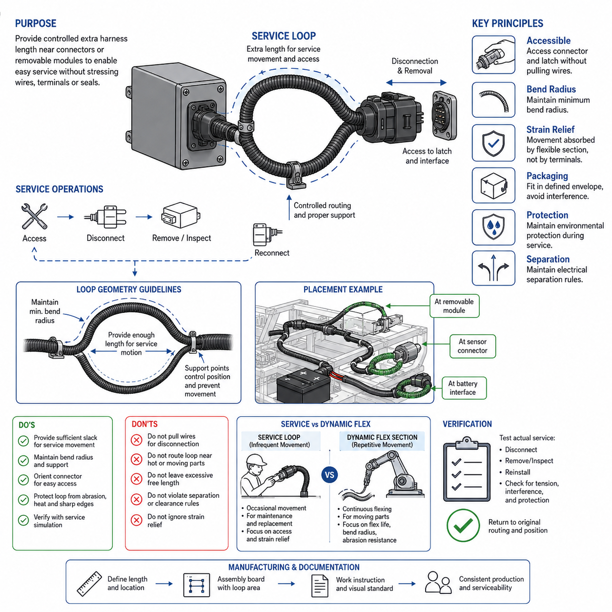
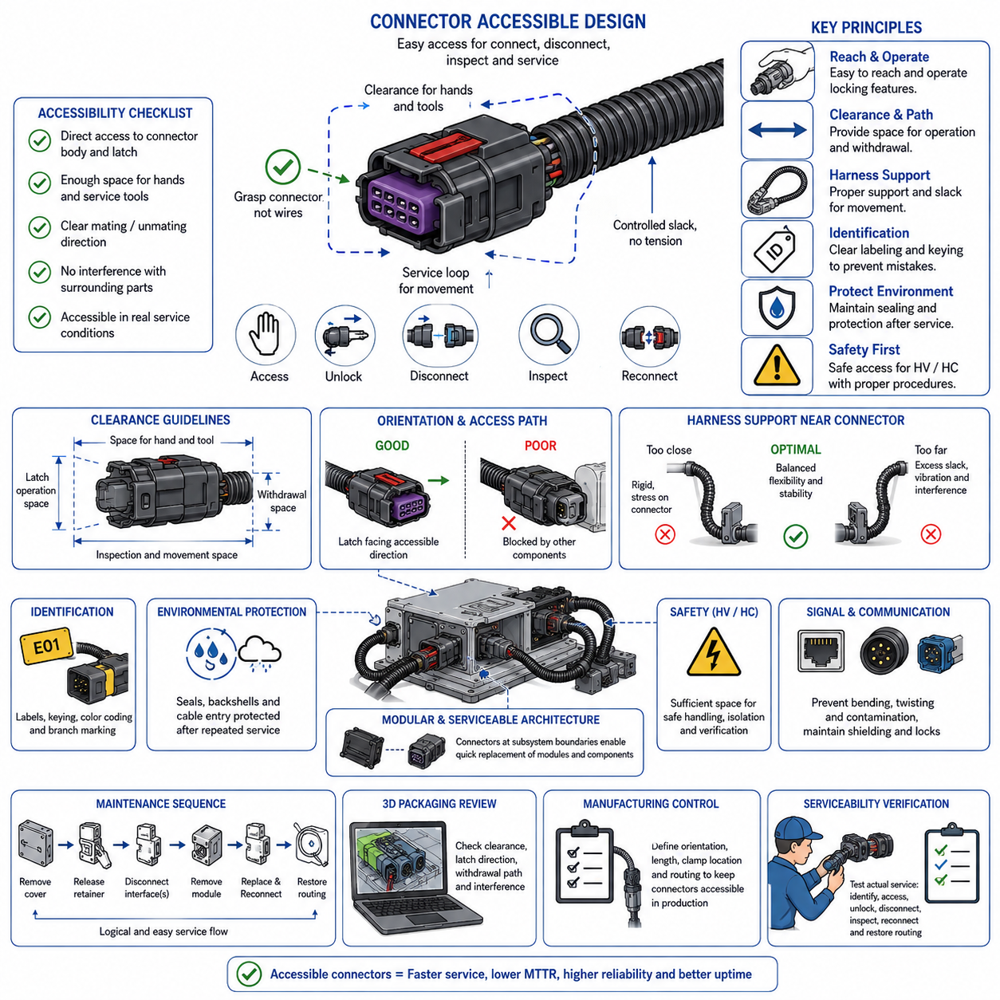
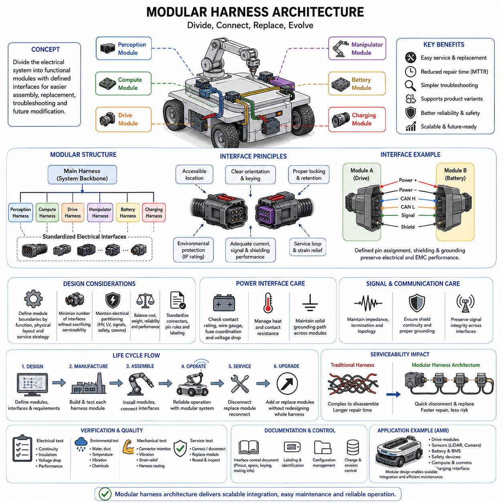
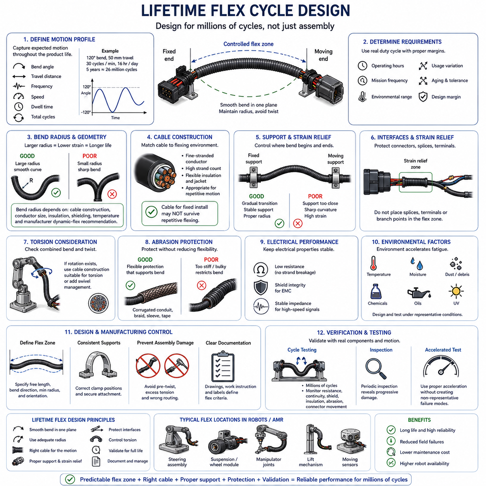
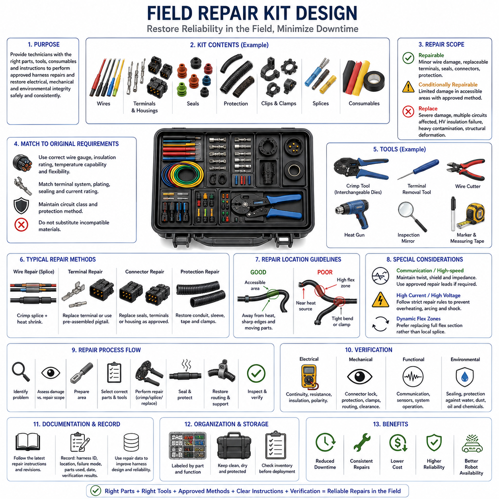

**Volume 02. Wire Harness Engineering**


# Chapter 11. Serviceability Design

##  

## 11.01. Service Loop Design

{width="7.268055555555556in" height="7.268055555555556in"}

Service loop design provides intentional extra harness length near connectors, removable modules, or service points so technicians can disconnect, inspect, reposition, and reconnect electrical interfaces without placing excessive tensile load on wires or terminals. The loop is not simply unused wire. It is a controlled geometric feature that preserves accessibility while maintaining electrical, mechanical, and packaging requirements throughout the product lifetime.

The required loop length should be derived from the expected service motion rather than selected as an arbitrary allowance. Engineers should consider the distance needed to withdraw a component, expose a connector locking mechanism, rotate a module for inspection, or reach the interface with normal service tools. The available length must support these operations without pulling the harness tight or transferring service loads into terminals, seals, splices, or connector backshells.

A properly designed service loop must remain controlled during normal operation. Excessive free length can move under vibration, contact neighboring structures, become trapped between covers, or create abrasion against sharp edges. The loop should therefore be positioned within a defined envelope and supported by suitable clamps, clips, guides, sleeves, or tie points while retaining enough freedom for the intended service movement. Routing must remain predictable after repeated maintenance operations.

Bend radius is a fundamental constraint because additional harness length is useful only when the conductors can move without excessive bending stress. The loop geometry should maintain the minimum allowable bend radius for the wire, cable, shielding system, conduit, and outer protection. Tight folding near connector exits should be avoided because it concentrates strain where conductor strands, insulation, crimp interfaces, and environmental seals may be particularly vulnerable to mechanical damage.

Connector orientation strongly influences service-loop effectiveness. A technician should be able to release the connector position assurance feature, latch, threaded coupling, or secondary lock without using the wires as a pulling handle. Sufficient slack should permit the connector body to be grasped directly. After reconnection, the loop should naturally return to its intended routing region rather than forcing the connector sideways or producing persistent bending at the wire-entry point.

Service loops must also account for strain relief. Harness movement during maintenance should be absorbed progressively by the flexible wire section instead of being concentrated at a crimped terminal or splice. A nearby support point can isolate the fixed harness from service movement, but its location must not make the remaining free section too short. The relationship among connector position, free length, first clamp location, and allowable movement should therefore be evaluated as one mechanical system.

Packaging space places practical limits on service-loop size. In compact robots, AMRs, battery compartments, control cabinets, and actuator modules, additional wire can interfere with cooling paths, moving mechanisms, covers, sensors, or other harness branches. Serviceability must therefore be considered during packaging development rather than added after routing is finalized. Three-dimensional CAD reviews can verify both the normal stored position and the temporary extended position required during maintenance.

Service-loop geometry should reflect the mechanical characteristics of the circuit. Small signal wires can usually tolerate compact routing more easily than large power cables, shielded communication cables, or high-current battery conductors. Large conductors require greater bend radii and can transmit significant restoring force to connectors. Shielded cables may additionally require controlled geometry to prevent shield damage, impedance disturbance, or excessive stress at shield termination points during servicing.

Environmental protection must remain effective throughout service movement. A loop located near water, dust, chemicals, hot surfaces, or exposed chassis areas should use suitable insulation, conduit, braid, tape, or other protective covering. Its extended service position should also be evaluated because a harness that is protected when stored may temporarily approach hazardous edges or surfaces when a module is removed. Protection strategy should therefore consider both operational and maintenance configurations.

The loop should not compromise electrical separation rules established elsewhere in the harness architecture. Additional length must not allow low-voltage power, high-voltage circuits, communication cables, or sensitive signal lines to migrate into prohibited routing zones. When multiple harnesses occupy the same service region, clips or dedicated routing features can preserve separation even after maintenance personnel have disconnected and repositioned components during troubleshooting or replacement activities.

Service loops become particularly important where replaceable modules are expected during field operation. Controllers, sensors, motor drives, batteries, communication devices, and charging components may require replacement without removing the complete harness assembly. Providing controlled local slack can reduce disassembly time and prevent technicians from disturbing unrelated branches. This supports the broader serviceability architecture in which accessible connectors and modular harness sections enable efficient component-level maintenance.

The design should distinguish a service loop from a dynamic flex section. A service loop normally experiences occasional movement during inspection or replacement, whereas a dynamic harness may flex continuously during steering, suspension travel, manipulator motion, or other repetitive operation. If the same section performs both functions, its conductor construction, bend radius, support arrangement, abrasion protection, and expected flex life must satisfy the more demanding repetitive-motion requirements.

Manufacturing controls are necessary to ensure that the designed service allowance is actually produced. Harness drawings and assembly boards should define branch length, loop location, clamp position, orientation, and acceptable routing envelope sufficiently clearly that operators do not remove intentional slack during installation. Visual standards or reference dimensions can help distinguish the required service loop from accidental excess length and maintain consistent serviceability across production units.

Verification should include physical service simulations using production-representative harnesses and components. Technicians should demonstrate connector disconnection, module removal, inspection access, and reinstallation without abnormal wire tension, excessive bending, interference, or damage to protective coverings. The harness should then return to its intended installed condition with appropriate clearance and support. Repeating representative service operations can reveal progressive twisting, clamp migration, abrasion, or strain that may not appear during a single trial.

For AMRs and other mobile robotic platforms, service-loop design contributes directly to maintainability and operational availability. Frequently replaced sensors, wheel-drive modules, batteries, computing units, safety devices, and charging interfaces should be serviceable without extensive harness removal. A controlled service loop combines adequate access, bend-radius management, strain relief, environmental protection, routing discipline, and repeatable installation so that maintenance can be performed efficiently without sacrificing long-term electrical reliability.

서비스 루프 설계(Service Loop Design)는 커넥터(Connector), 탈착식 모듈(Removable Module) 또는 정비 지점(Service Point) 주변에 의도적으로 추가 와이어 하니스(Wire Harness) 길이를 확보하여, 정비 작업자가 와이어(Wire)나 터미널(Terminal)에 과도한 인장 하중(Tensile Load)을 가하지 않고 전기 인터페이스(Electrical Interface)를 분리하고 점검하며 위치를 변경한 후 다시 연결할 수 있도록 하는 설계이다. 서비스 루프(Service Loop)는 단순히 남는 와이어가 아니라 제품 수명 동안 전기적, 기계적, 패키징(Packaging) 요구사항을 유지하면서 정비 접근성을 확보하기 위한 제어된 기하학적 설계 요소이다.

필요한 서비스 루프 길이(Service Loop Length)는 임의의 여유 길이로 결정하는 것이 아니라 예상되는 정비 동작(Service Motion)을 기준으로 산정해야 한다. 엔지니어는 부품을 인출하는 데 필요한 거리, 커넥터 잠금 장치(Connector Locking Mechanism)를 노출하는 데 필요한 이동량, 점검을 위해 모듈(Module)을 회전시키는 동작, 일반적인 정비 공구(Service Tool)로 인터페이스에 접근하기 위한 거리 등을 고려해야 한다. 확보된 길이는 하니스가 팽팽하게 당겨지거나 정비 하중이 터미널, 실(Seal), 스플라이스(Splice), 커넥터 백셸(Connector Backshell)에 전달되지 않도록 충분해야 한다.

적절하게 설계된 서비스 루프(Service Loop)는 정상 운전 중에도 제어된 상태를 유지해야 한다. 지나치게 긴 자유 길이(Free Length)는 진동으로 움직이거나 주변 구조물과 접촉하고, 커버(Cover) 사이에 끼이거나 날카로운 모서리와 마찰하여 마모될 수 있다. 따라서 서비스 루프는 정의된 공간 영역(Envelope) 안에 배치하고 적절한 클램프(Clamp), 클립(Clip), 가이드(Guide), 슬리브(Sleeve) 또는 고정 지점(Tie Point)을 이용하여 지지하면서도 의도된 정비 동작에 필요한 자유도는 유지해야 한다. 반복적인 정비 작업 이후에도 배선 경로(Routing)는 예측 가능한 상태로 유지되어야 한다.

굽힘 반경(Bend Radius)은 추가된 하니스 길이가 도체(Conductor)에 과도한 굽힘 응력(Bending Stress)을 발생시키지 않고 움직일 수 있어야 하기 때문에 기본적인 설계 제약조건이다. 서비스 루프 형상은 와이어, 케이블(Cable), 차폐 시스템(Shielding System), 전선관(Conduit), 외부 보호재(Outer Protection)에 규정된 최소 허용 굽힘 반경(Minimum Allowable Bend Radius)을 유지해야 한다. 커넥터 출구(Connector Exit) 주변에서 급격하게 접히는 형상은 도체 소선(Conductor Strand), 절연체(Insulation), 크림프 인터페이스(Crimp Interface), 환경 실(Environmental Seal) 등에 응력을 집중시킬 수 있으므로 피해야 한다.

커넥터 방향(Connector Orientation)은 서비스 루프의 효과에 큰 영향을 준다. 정비 작업자는 와이어를 당김 손잡이처럼 사용하지 않고 커넥터 위치 보증 장치(Connector Position Assurance), 래치(Latch), 나사식 결합부(Threaded Coupling) 또는 이차 잠금 장치(Secondary Lock)를 해제할 수 있어야 한다. 충분한 여유 길이(Slack)를 확보하여 커넥터 본체(Connector Body)를 직접 잡을 수 있도록 해야 한다. 재연결 이후에는 서비스 루프가 커넥터를 측면으로 밀거나 와이어 인입부(Wire Entry Point)에 지속적인 굽힘을 발생시키지 않고 자연스럽게 원래의 배선 영역으로 복귀해야 한다.

서비스 루프 설계에서는 변형 방지(Strain Relief)도 고려해야 한다. 정비 과정에서 발생하는 하니스 이동은 크림프 터미널(Crimped Terminal)이나 스플라이스에 집중되지 않고 유연한 와이어 구간(Flexible Wire Section)을 통해 점진적으로 흡수되어야 한다. 인접한 지지점(Support Point)은 고정된 하니스 구간을 정비 동작으로부터 분리할 수 있지만, 지지점 위치 때문에 남아 있는 자유 구간이 지나치게 짧아져서는 안 된다. 따라서 커넥터 위치, 자유 길이, 첫 번째 클램프 위치(First Clamp Location), 허용 이동량(Allowable Movement)의 관계를 하나의 기계 시스템(Mechanical System)으로 평가해야 한다.

패키징 공간(Packaging Space)은 서비스 루프 크기에 실질적인 제한을 준다. 소형 로봇(Robot), 자율이동로봇(AMR), 배터리 구획(Battery Compartment), 제어 캐비닛(Control Cabinet), 액추에이터 모듈(Actuator Module)에서는 추가 와이어가 냉각 경로(Cooling Path), 이동 기구(Moving Mechanism), 커버, 센서(Sensor) 또는 다른 하니스 분기와 간섭할 수 있다. 따라서 정비성(Serviceability)은 배선 설계가 완료된 후 추가하는 것이 아니라 패키징 개발 단계부터 고려해야 한다. 3차원 캐드 검토(3D CAD Review)를 통해 정상 보관 위치뿐 아니라 정비 과정에서 필요한 일시적인 확장 위치까지 검증할 수 있다.

서비스 루프 형상(Service Loop Geometry)은 회로(Circuit)의 기계적 특성을 반영해야 한다. 소형 신호선(Signal Wire)은 일반적으로 대형 전력 케이블(Power Cable), 차폐 통신 케이블(Shielded Communication Cable), 대전류 배터리 도체(High-Current Battery Conductor)보다 좁은 공간에서 배치하기 쉽다. 대형 도체는 더 큰 굽힘 반경을 요구하며 상당한 복원력(Restoring Force)을 커넥터에 전달할 수 있다. 차폐 케이블은 정비 과정에서 차폐 손상(Shield Damage), 임피던스 변화(Impedance Disturbance), 차폐 종단부(Shield Termination Point)의 과도한 응력을 방지하기 위해 추가적인 형상 관리가 필요할 수 있다.

환경 보호(Environmental Protection)는 서비스 동작 전체에서 유지되어야 한다. 물, 먼지, 화학물질, 고온 표면(Hot Surface) 또는 외부에 노출된 섀시(Chassis) 주변에 서비스 루프가 배치되는 경우 적절한 절연재(Insulation), 전선관, 브레이드(Braid), 테이프(Tape) 또는 기타 보호재를 사용해야 한다. 또한 보관 상태에서는 보호되던 하니스가 모듈 제거 과정에서 일시적으로 위험한 모서리나 표면에 접근할 수 있으므로 확장된 정비 위치(Extended Service Position)도 평가해야 한다. 따라서 보호 전략(Protection Strategy)은 정상 운전 상태와 정비 상태를 모두 고려해야 한다.

서비스 루프는 전체 하니스 아키텍처(Harness Architecture)에 정의된 전기적 분리 규칙(Electrical Separation Rule)을 훼손해서는 안 된다. 추가된 길이 때문에 저전압 전원(Low-Voltage Power), 고전압 회로(High-Voltage Circuit), 통신 케이블(Communication Cable), 민감 신호선(Sensitive Signal Line)이 금지된 배선 영역으로 이동해서는 안 된다. 여러 하니스가 동일한 정비 영역을 사용하는 경우 클립 또는 전용 배선 구조(Dedicated Routing Feature)를 적용하면 정비 작업자가 문제 진단이나 부품 교체를 위해 하니스를 분리하고 위치를 변경한 이후에도 필요한 분리 거리를 유지할 수 있다.

서비스 루프는 현장에서 교체 가능한 모듈(Field-Replaceable Module)이 사용되는 위치에서 특히 중요하다. 컨트롤러(Controller), 센서, 모터 드라이브(Motor Drive), 배터리(Battery), 통신 장치(Communication Device), 충전 부품(Charging Component) 등은 전체 하니스 어셈블리(Harness Assembly)를 제거하지 않고 교체해야 할 수 있다. 국부적으로 제어된 여유 길이를 확보하면 분해 시간을 줄이고 정비 작업자가 관련 없는 다른 하니스 분기를 건드리는 것을 방지할 수 있다. 이는 접근 가능한 커넥터(Accessible Connector)와 모듈형 하니스 구간(Modular Harness Section)을 통해 효율적인 부품 단위 정비(Component-Level Maintenance)를 가능하게 하는 전체 정비성 아키텍처(Serviceability Architecture)를 지원한다.

설계에서는 서비스 루프(Service Loop)와 동적 굽힘 구간(Dynamic Flex Section)을 구분해야 한다. 서비스 루프는 일반적으로 점검이나 교체 과정에서 간헐적으로 움직이는 반면, 동적 하니스(Dynamic Harness)는 조향(Steering), 서스펜션 이동(Suspension Travel), 매니퓰레이터 동작(Manipulator Motion) 또는 기타 반복적인 작동 과정에서 지속적으로 굽힘 운동을 수행할 수 있다. 동일한 구간이 두 기능을 모두 수행한다면 도체 구조(Conductor Construction), 굽힘 반경, 지지 구조, 마모 보호(Abrasion Protection), 예상 굽힘 수명(Flex Life)은 보다 가혹한 반복 운동 조건을 만족해야 한다.

설계된 정비 여유 길이가 실제 제품에 정확하게 구현되도록 제조 관리(Manufacturing Control)가 필요하다. 하니스 도면(Harness Drawing)과 조립 보드(Assembly Board)에는 분기 길이(Branch Length), 서비스 루프 위치, 클램프 위치, 방향, 허용 배선 영역(Acceptable Routing Envelope)을 충분히 명확하게 정의하여 조립 작업자가 설치 과정에서 의도된 여유 길이를 제거하지 않도록 해야 한다. 시각적 표준(Visual Standard)이나 기준 치수(Reference Dimension)를 사용하면 필요한 서비스 루프와 단순한 과잉 와이어 길이를 구별하고 생산되는 제품 전체에서 일관된 정비성을 유지하는 데 도움이 된다.

검증(Verification) 과정에는 양산 대표성을 갖는 하니스와 부품을 이용한 실제 정비 시뮬레이션(Physical Service Simulation)이 포함되어야 한다. 정비 작업자는 비정상적인 와이어 장력, 과도한 굽힘, 간섭 또는 보호재 손상 없이 커넥터 분리, 모듈 제거, 점검 접근, 재설치를 수행할 수 있음을 입증해야 한다. 이후 하니스는 적절한 간격(Clearance)과 지지 상태를 유지하면서 의도된 설치 상태로 복귀해야 한다. 대표적인 정비 동작을 반복하면 단일 시험에서는 나타나지 않을 수 있는 점진적인 비틀림(Twisting), 클램프 이동(Clamp Migration), 마모(Abrasion), 변형(Strain) 등을 확인할 수 있다.

자율이동로봇(AMR) 및 기타 이동형 로봇 플랫폼(Mobile Robotic Platform)에서 서비스 루프 설계는 정비성(Maintainability)과 운용 가용성(Operational Availability)에 직접적으로 기여한다. 빈번하게 교체되는 센서, 휠 구동 모듈(Wheel-Drive Module), 배터리, 컴퓨팅 유닛(Computing Unit), 안전 장치(Safety Device), 충전 인터페이스(Charging Interface)는 광범위한 하니스 제거 작업 없이 정비할 수 있어야 한다. 제어된 서비스 루프는 충분한 접근성, 굽힘 반경 관리, 변형 방지, 환경 보호, 배선 규율(Routing Discipline), 반복 가능한 설치성을 결합하여 장기적인 전기적 신뢰성(Electrical Reliability)을 저하시키지 않으면서 효율적인 유지보수를 가능하게 한다.

##  

##  

## 11.02. Connector Accessible Design

{width="7.268055555555556in" height="7.268055555555556in"}

Connector accessible design ensures that electrical connectors can be reached, identified, disconnected, inspected, and reconnected during assembly and field maintenance without unnecessary removal of surrounding components. Accessibility must be treated as a design requirement rather than a convenience added after packaging. Connector location, orientation, surrounding clearance, harness slack, locking mechanism, and tool access should be considered together as part of the overall serviceability strategy.

A connector should be positioned so that a technician can directly grasp its housing rather than pulling on the attached wires. The surrounding package must provide enough space for fingers, gloves, or appropriate service tools to operate the latch, coupling ring, secondary lock, or connector position assurance feature. Access should remain practical under realistic maintenance conditions, including restricted visibility and confined equipment compartments.

Connector orientation has a major influence on service efficiency. Locking features should face an accessible direction whenever packaging permits, while connector mating and unmating motion should not be blocked by frames, covers, brackets, batteries, controllers, or neighboring harnesses. An apparently accessible connector may become difficult to remove if its required withdrawal direction intersects another component, so both access and extraction paths must be evaluated.

Clearance around the connector should accommodate more than the physical connector dimensions. Space is required for hand movement, latch displacement, coupling rotation, inspection, and the initial movement needed to separate mating halves. Large power connectors and sealed industrial connectors may require considerably more operating space than small signal connectors because their locking mechanisms, sealing forces, and cable stiffness can increase the force and motion needed for disconnection.

Harness routing must support connector accessibility rather than restrict it. The branch approaching the connector should provide sufficient controlled slack to allow normal mating and unmating while avoiding excessive free wire that can interfere with nearby structures. Service loops may be introduced where necessary to permit a module or connector to move into a convenient maintenance position without transmitting tensile load into terminals, seals, splices, or upstream harness branches.

The first harness support point near a connector requires careful placement. If the clamp is too close, the harness may become too rigid to disconnect comfortably or may impose bending stress on the connector exit. If it is too far away, excessive unsupported length can vibrate, abrade, or interfere with neighboring components. The support arrangement should therefore provide both operational stability and sufficient flexibility for the expected service movement.

Connector accessibility must also consider the complete maintenance sequence rather than only the disconnected state. A technician may need to remove a cover, release a retaining clip, disconnect several interfaces, withdraw a module, perform replacement, and then restore the harness to its original routing. The connector architecture should support this sequence logically so that unrelated electrical interfaces do not need to be disturbed simply to access one serviceable component.

Identification is an important part of accessible design, particularly where multiple similar connectors are located close together. Labels, connector identifiers, keying, color coding where appropriate, branch markings, and clear physical differentiation can reduce incorrect reconnection. Identification should remain visible or discoverable during servicing and should correspond consistently with electrical drawings, wiring diagrams, diagnostic documentation, and work instructions.

Accessibility must not compromise environmental protection. Waterproof or dust-resistant connectors require seals, locking mechanisms, backshells, and cable-entry regions to remain correctly positioned after repeated maintenance. Connector placement should allow technicians to inspect sealing surfaces and confirm complete engagement. Designs that force connectors against surrounding structures can make proper locking difficult and may hide partially seated conditions that later cause intermittent electrical faults.

High-current and high-voltage connectors require additional consideration because cable stiffness, connector mass, touch protection, and required safety procedures can significantly affect service access. The technician must have enough room to manipulate the connector without sharply bending the cable or placing side loads on terminals. Where hazardous voltage is present, accessibility should be coordinated with isolation, interlock, discharge, verification, and protection requirements defined by the electrical safety architecture.

Signal and communication connectors may have different accessibility concerns. Ethernet, camera, LiDAR, encoder, and other data interfaces can use relatively delicate contacts, shielding arrangements, or locking features. Service access should prevent twisting, excessive bending, contamination, and repeated loading of cable terminations. Where connectors are densely packaged around computing or perception modules, clear routing and identification are especially important for preventing incorrect connections during replacement.

Modular harness architecture benefits directly from accessible connector placement. When subsystem boundaries are located at practical service interfaces, a sensor module, drive unit, controller, battery assembly, or other replaceable component can be removed without dismantling large portions of the main harness. Accessible connectors therefore support modularity by creating defined electrical separation points between serviceable assemblies and the fixed vehicle or robot infrastructure.

Packaging reviews should evaluate connector accessibility using realistic three-dimensional geometry. CAD models can identify blocked latch directions, insufficient withdrawal distance, collisions with covers, and interference between the connector and surrounding harnesses. However, geometric clearance alone does not guarantee practical serviceability. Physical mockups or representative hardware should be used when necessary to confirm that a technician can actually reach and operate the interface.

Manufacturing requirements should preserve the intended accessibility established during design. Harness drawings, installation instructions, clamp locations, branch lengths, connector orientations, and routing references should prevent production variation from moving connectors into inaccessible positions. A connector that is serviceable in the nominal CAD model may become difficult to reach if harness slack, clip orientation, or mounting position varies significantly between assembled units.

Serviceability verification should reproduce representative maintenance tasks using production-intent components. Technicians should demonstrate identification, access, unlocking, disconnection, inspection, reconnection, and routing restoration without pulling wires, damaging seals, applying abnormal bending, or removing unrelated assemblies unnecessarily. Repeated service trials can reveal problems such as difficult latch operation, hidden connectors, insufficient hand clearance, excessive insertion force, or gradual harness displacement.

For AMRs and mobile robotic platforms, connector accessible design can significantly reduce mean time to repair and improve operational availability. Drive modules, sensors, safety devices, batteries, computing units, communication equipment, and charging interfaces are common service points. Designing their connectors for direct access, controlled harness movement, reliable identification, environmental protection, and repeatable reconnection allows field maintenance to be performed efficiently while preserving electrical and mechanical integrity throughout the robot lifecycle.

커넥터 접근성 설계(Connector Accessible Design)는 조립 및 현장 정비 과정에서 주변 부품을 불필요하게 제거하지 않고 전기 커넥터(Electrical Connector)에 접근하여 식별하고, 분리하고, 점검한 후 다시 연결할 수 있도록 하는 설계이다. 접근성(Accessibility)은 패키징(Packaging)이 완료된 후 추가되는 편의 기능이 아니라 설계 요구사항으로 다루어야 한다. 커넥터 위치, 방향, 주변 여유 공간(Clearance), 하니스 여유 길이(Harness Slack), 잠금 메커니즘(Locking Mechanism), 공구 접근성(Tool Access)을 전체 정비성 전략(Serviceability Strategy)의 일부로 함께 고려해야 한다.

커넥터는 정비 작업자가 연결된 와이어(Wire)를 잡아당기는 대신 커넥터 하우징(Connector Housing)을 직접 잡을 수 있는 위치에 배치해야 한다. 주변 패키지(Package)는 손가락, 장갑 또는 적절한 정비 공구(Service Tool)를 이용하여 래치(Latch), 커플링 링(Coupling Ring), 이차 잠금 장치(Secondary Lock), 커넥터 위치 보증 장치(Connector Position Assurance)를 조작할 수 있는 충분한 공간을 제공해야 한다. 제한된 시야와 좁은 장비 내부 공간을 포함한 실제 정비 조건에서도 접근이 가능해야 한다.

커넥터 방향(Connector Orientation)은 정비 효율에 큰 영향을 미친다. 패키징 조건이 허용하는 경우 잠금 장치(Locking Feature)는 접근하기 쉬운 방향을 향해야 하며, 커넥터의 체결 및 분리 동작(Mating and Unmating Motion)이 프레임(Frame), 커버(Cover), 브래킷(Bracket), 배터리(Battery), 컨트롤러(Controller) 또는 인접 하니스(Neighboring Harness)에 의해 방해받지 않아야 한다. 외관상 접근 가능한 커넥터라도 필요한 인출 방향(Withdrawal Direction)이 다른 부품과 간섭한다면 분리가 어려울 수 있으므로 접근 경로와 인출 경로를 모두 평가해야 한다.

커넥터 주변 여유 공간(Clearance)은 단순히 커넥터 자체의 물리적 치수보다 넓게 고려해야 한다. 손의 움직임, 래치 변위(Latch Displacement), 커플링 회전(Coupling Rotation), 점검, 그리고 결합된 커넥터를 처음 분리하는 데 필요한 이동 공간이 확보되어야 한다. 대형 전력 커넥터(Power Connector)와 밀봉형 산업용 커넥터(Sealed Industrial Connector)는 잠금 구조, 밀봉력(Sealing Force), 케이블 강성(Cable Stiffness) 때문에 소형 신호 커넥터(Signal Connector)보다 분리 시 더 큰 힘과 이동량을 요구할 수 있다.

하니스 배선(Harness Routing)은 커넥터 접근성을 제한하는 것이 아니라 지원해야 한다. 커넥터로 연결되는 분기(Branch)는 정상적인 체결 및 분리 작업에 필요한 충분하고 제어된 여유 길이(Controlled Slack)를 제공하면서 주변 구조물과 간섭할 정도의 과도한 자유 와이어(Free Wire)는 방지해야 한다. 필요한 경우 서비스 루프(Service Loop)를 적용하여 모듈(Module)이나 커넥터를 편리한 정비 위치로 이동시키면서 터미널(Terminal), 실(Seal), 스플라이스(Splice), 상위 하니스 분기(Upstream Harness Branch)에 인장 하중(Tensile Load)이 전달되지 않도록 할 수 있다.

커넥터 주변의 첫 번째 하니스 지지점(First Harness Support Point)은 신중하게 배치해야 한다. 클램프(Clamp)가 지나치게 가까우면 하니스가 너무 강직해져 커넥터를 편리하게 분리하기 어렵거나 커넥터 출구(Connector Exit)에 굽힘 응력(Bending Stress)이 발생할 수 있다. 반대로 너무 멀리 배치하면 지지되지 않는 길이가 증가하여 진동, 마모(Abrasion), 주변 부품과의 간섭이 발생할 수 있다. 따라서 지지 구조(Support Arrangement)는 운전 중 안정성과 예상되는 정비 동작에 필요한 유연성을 모두 제공해야 한다.

커넥터 접근성은 단순히 커넥터가 분리된 상태만이 아니라 전체 정비 절차(Maintenance Sequence)를 고려해야 한다. 정비 작업자는 커버를 제거하고, 고정 클립(Retaining Clip)을 해제하며, 여러 인터페이스(Interface)를 분리하고, 모듈을 인출한 후 교체 작업을 수행하고, 최종적으로 하니스를 원래의 배선 상태로 복원해야 할 수 있다. 커넥터 아키텍처(Connector Architecture)는 이러한 절차를 논리적으로 지원하여 하나의 정비 대상 부품에 접근하기 위해 관련 없는 전기 인터페이스까지 불필요하게 분리하지 않도록 해야 한다.

식별성(Identification)은 특히 유사한 여러 커넥터가 서로 가까이 배치된 경우 접근성 설계의 중요한 요소이다. 라벨(Label), 커넥터 식별자(Connector Identifier), 키잉(Keying), 필요한 경우 색상 구분(Color Coding), 분기 표시(Branch Marking), 명확한 물리적 차별화를 통해 잘못된 재연결을 줄일 수 있다. 식별 정보는 정비 중에도 확인할 수 있어야 하며 전기 도면(Electrical Drawing), 배선도(Wiring Diagram), 진단 문서(Diagnostic Documentation), 작업 지침(Work Instruction)과 일관되게 대응해야 한다.

접근성을 확보하면서 환경 보호(Environmental Protection)를 저해해서는 안 된다. 방수 또는 방진 커넥터(Waterproof or Dust-Resistant Connector)는 반복적인 정비 이후에도 실, 잠금 메커니즘, 백셸(Backshell), 케이블 인입부(Cable-Entry Region)가 올바른 위치를 유지해야 한다. 커넥터 배치는 정비 작업자가 밀봉면(Sealing Surface)을 점검하고 완전한 체결 상태를 확인할 수 있도록 해야 한다. 주변 구조물에 커넥터가 강제로 밀착되는 설계는 정상적인 잠금을 어렵게 하고 부분 체결(Partially Seated Condition)을 확인하기 어렵게 만들어 이후 간헐적인 전기 고장(Intermittent Electrical Fault)을 발생시킬 수 있다.

대전류 및 고전압 커넥터(High-Current and High-Voltage Connector)는 케이블 강성, 커넥터 질량, 접촉 보호(Touch Protection), 필수 안전 절차(Safety Procedure)가 정비 접근성에 상당한 영향을 줄 수 있으므로 추가적인 고려가 필요하다. 작업자는 케이블을 급격하게 굽히거나 터미널에 측면 하중(Side Load)을 가하지 않고 커넥터를 조작할 수 있는 충분한 공간을 확보해야 한다. 위험 전압(Hazardous Voltage)이 존재하는 경우 접근성은 전기 안전 아키텍처(Electrical Safety Architecture)에 정의된 절연(Isolation), 인터록(Interlock), 방전(Discharge), 검증(Verification), 보호 요구사항과 연계되어야 한다.

신호 및 통신 커넥터(Signal and Communication Connector)는 다른 접근성 요구사항을 가질 수 있다. 이더넷(Ethernet), 카메라(Camera), 라이다(LiDAR), 엔코더(Encoder) 및 기타 데이터 인터페이스(Data Interface)는 상대적으로 민감한 접점(Contact), 차폐 구조(Shielding Arrangement), 잠금 장치를 사용할 수 있다. 정비 과정에서 비틀림, 과도한 굽힘, 오염, 케이블 종단부(Cable Termination)에 대한 반복적인 하중을 방지해야 한다. 특히 컴퓨팅 모듈(Computing Module)이나 인지 모듈(Perception Module) 주변에 커넥터가 밀집되어 있는 경우 명확한 배선과 식별이 잘못된 연결을 방지하는 데 중요하다.

모듈형 하니스 아키텍처(Modular Harness Architecture)는 접근 가능한 커넥터 배치로부터 직접적인 이점을 얻는다. 서브시스템 경계(Subsystem Boundary)가 실질적인 정비 인터페이스(Service Interface)에 위치하면 센서 모듈(Sensor Module), 구동 유닛(Drive Unit), 컨트롤러, 배터리 어셈블리(Battery Assembly) 또는 기타 교체 가능한 부품을 메인 하니스(Main Harness)의 상당 부분을 분해하지 않고 제거할 수 있다. 따라서 접근 가능한 커넥터는 정비 가능한 어셈블리(Serviceable Assembly)와 고정된 차량 또는 로봇 인프라(Robot Infrastructure) 사이에 명확한 전기적 분리 지점(Electrical Separation Point)을 형성하여 모듈성을 지원한다.

패키징 검토(Packaging Review)에서는 실제적인 3차원 형상(Three-Dimensional Geometry)을 사용하여 커넥터 접근성을 평가해야 한다. 캐드 모델(CAD Model)을 통해 차단된 래치 방향, 부족한 인출 거리, 커버와의 충돌, 커넥터와 주변 하니스 사이의 간섭 등을 확인할 수 있다. 그러나 기하학적인 여유 공간만으로 실제 정비성을 보장할 수는 없다. 필요한 경우 물리적 목업(Physical Mockup) 또는 대표 하드웨어(Representative Hardware)를 이용하여 작업자가 실제로 인터페이스에 접근하고 조작할 수 있는지 확인해야 한다.

제조 요구사항(Manufacturing Requirement)은 설계 단계에서 확보한 접근성이 실제 생산에서도 유지되도록 해야 한다. 하니스 도면(Harness Drawing), 설치 지침(Installation Instruction), 클램프 위치, 분기 길이, 커넥터 방향, 배선 기준(Routing Reference)을 명확히 정의하여 생산 편차(Production Variation)로 인해 커넥터가 접근하기 어려운 위치로 이동하는 것을 방지해야 한다. 기준 캐드 모델에서는 정비 가능한 커넥터라도 하니스 여유 길이, 클립 방향(Clip Orientation), 장착 위치(Mounting Position)가 조립 제품마다 크게 달라지면 실제 접근성이 저하될 수 있다.

정비성 검증(Serviceability Verification)은 양산 의도를 반영한 부품(Production-Intent Component)을 사용하여 대표적인 정비 작업을 재현해야 한다. 작업자는 와이어를 잡아당기거나 실을 손상시키고 비정상적인 굽힘을 가하거나 관련 없는 어셈블리를 불필요하게 제거하지 않으면서 식별, 접근, 잠금 해제, 분리, 점검, 재연결, 배선 복원을 수행할 수 있어야 한다. 반복 정비 시험(Repeated Service Trial)을 통해 어려운 래치 조작, 숨겨진 커넥터, 부족한 손 작업 공간, 과도한 삽입력(Insertion Force), 점진적인 하니스 위치 이동 등의 문제를 발견할 수 있다.

자율이동로봇(AMR) 및 이동형 로봇 플랫폼(Mobile Robotic Platform)에서 커넥터 접근성 설계는 평균 수리 시간(Mean Time to Repair, MTTR)을 크게 줄이고 운용 가용성(Operational Availability)을 향상시킬 수 있다. 구동 모듈(Drive Module), 센서, 안전 장치(Safety Device), 배터리, 컴퓨팅 유닛(Computing Unit), 통신 장비(Communication Equipment), 충전 인터페이스(Charging Interface)는 대표적인 정비 지점이다. 이러한 커넥터를 직접 접근, 제어된 하니스 이동, 신뢰성 있는 식별, 환경 보호, 반복 가능한 재연결이 가능하도록 설계하면 로봇 수명주기(Robot Lifecycle) 전체에서 전기적·기계적 건전성(Electrical and Mechanical Integrity)을 유지하면서 효율적인 현장 정비(Field Maintenance)를 수행할 수 있다.

##  

## 11.03. Modular Harness Architecture

{width="7.268055555555556in" height="7.268055555555556in"}

Modular harness architecture divides a large electrical wiring system into clearly defined harness modules that correspond to functional, physical, or serviceable subsystems. Instead of constructing one continuous harness across the entire robot or machine, the architecture establishes controlled electrical interfaces between modules. This approach supports easier assembly, replacement, troubleshooting, configuration management, and future system modification while preserving electrical integrity.

The boundaries of each harness module should reflect meaningful subsystem divisions. Typical boundaries may correspond to drive modules, sensor assemblies, battery systems, computing units, manipulators, safety devices, charging interfaces, or removable body structures. A good boundary allows one subsystem to be disconnected without disturbing unrelated wiring, while avoiding unnecessary intermediate connectors that increase resistance, cost, weight, packaging complexity, and potential failure points.

Connector placement is fundamental to modular architecture because connectors form the electrical interfaces between harness sections. Interface connectors should be located where technicians can reach, identify, disconnect, and reconnect them during assembly or service. Their orientation, locking method, environmental rating, current capability, signal integrity, pin allocation, and mechanical retention must satisfy the requirements of all circuits crossing the modular boundary.

The architecture should distinguish between a main harness and local subsystem harnesses where appropriate. The main harness can provide common power distribution, communication networks, grounding paths, and system-level interfaces, while local harnesses distribute these resources within individual modules. This hierarchical arrangement can reduce routing complexity and allows local harness designs to evolve without requiring complete redesign of the system-level wiring architecture.

Electrical partitioning must be coordinated with physical partitioning. A mechanically removable module provides limited service benefit if its harness remains permanently integrated with distant components. Conversely, excessive electrical segmentation can introduce many connectors and discontinuities. Mechanical assembly boundaries, maintenance strategy, electrical functions, packaging constraints, and expected replacement frequency should therefore be evaluated together when selecting modular harness interfaces.

Power circuits require careful treatment at module boundaries. Connector contacts, wire gauges, fuse coordination, voltage drop, transient current capability, thermal limits, and grounding paths must remain suitable after the circuit is divided into multiple harness sections. High-current interfaces can add significant contact resistance and heat, so modularity should not be introduced simply for convenience when a continuous connection provides substantially better electrical or reliability performance.

Communication and signal circuits also require interface discipline. CAN, CAN FD, Ethernet, sensor signals, encoder lines, and other communication channels may depend on controlled impedance, shielding, termination, topology, or pair geometry. Modular connectors and intermediate harness sections must preserve these characteristics. Shield continuity and grounding strategy should be explicitly defined so that serviceable interfaces do not unintentionally create electromagnetic compatibility or communication reliability problems.

Modular architecture should maintain separation among circuits with different electrical and safety characteristics. High-voltage, low-voltage power, safety-related circuits, communication networks, and sensitive sensor signals may require different connectors, routing regions, shielding, or physical separation. A modular interface should preserve these design rules rather than combining unrelated circuits solely to reduce connector count or simplify packaging.

Standardization can significantly increase the value of modular harness design. Reusing defined connector families, interface conventions, pin-assignment rules, labeling methods, mounting features, and branch construction practices reduces engineering variation and simplifies manufacturing and field support. However, standardization should not permit incompatible modules to be accidentally connected, so mechanical keying, coding, polarization, and clear identification remain essential.

Modularity also supports product variants and configurable robotic platforms. Different sensors, computing devices, drive systems, payload modules, or optional equipment can be connected through predefined electrical interfaces without redesigning the complete harness. A common base harness can therefore support multiple product configurations while variant-specific harness modules provide the required local connections. This can reduce design duplication and improve configuration control across a product family.

Serviceability is one of the strongest reasons for adopting modular harness architecture. A failed subsystem should ideally be replaceable by disconnecting a limited number of accessible interfaces and removing only the associated local harness or module. Service loops, accessible connectors, logical interface locations, and clear identification work together with modular architecture to reduce unnecessary disassembly and prevent maintenance activities from disturbing healthy portions of the electrical system.

Fault isolation can also improve when electrical boundaries correspond to functional subsystems. Technicians can inspect connectors, measure power and signals at defined interfaces, substitute known-good modules, or isolate sections of the harness during diagnosis. Clearly documented interface points make electrical troubleshooting more systematic because measurements can progress from the system-level distribution network toward the suspected local subsystem without opening the entire harness.

Environmental protection must be maintained at every modular interface. Connectors located in exposed robot structures may require protection against water, dust, chemicals, vibration, temperature variation, and mechanical impact. Frequent service interfaces must retain their sealing performance after repeated mating cycles. Connector location should also prevent contamination during module removal and allow technicians to inspect seals, contacts, locking features, and protective components before reconnection.

Mechanical loads at modular interfaces should be controlled through appropriate harness support and strain relief. Connector bodies should not carry the weight of long cable sections or experience continuous side loads caused by poor routing. Clamps and supports should stabilize each harness module while preserving enough controlled movement for connection and service. The interface should return to a repeatable installed geometry after a module has been removed and replaced.

Manufacturing can benefit from modular harnesses because individual sections may be fabricated, inspected, and electrically tested before final system assembly. Subsystem harnesses can be installed with their associated mechanical modules and later connected through defined interfaces during final integration. Harness drawings, connector tables, labels, interface definitions, and configuration records must clearly identify each module so that manufacturing variations do not create incompatible or incorrectly routed assemblies.

Verification should evaluate both individual harness modules and the integrated architecture. Tests should confirm continuity, insulation, voltage drop, communication performance, grounding, shielding, connector engagement, environmental protection, and mechanical routing as applicable. Service trials should additionally demonstrate that modules can be disconnected, replaced, and reconnected without damaging terminals, seals, wires, adjacent harnesses, or surrounding components.

For AMRs and other robotic platforms, modular harness architecture provides a practical foundation for scalable electrical integration. Drive units, batteries, perception sensors, safety devices, computing systems, communication equipment, manipulators, and charging systems can be organized as serviceable electrical modules connected through controlled interfaces. When electrical partitioning, connector accessibility, protection, standardization, diagnostics, and configuration management are designed together, modularity can reduce maintenance effort and support efficient platform evolution.

모듈형 하니스 아키텍처(Modular Harness Architecture)는 대규모 전기 배선 시스템(Electrical Wiring System)을 기능적, 물리적 또는 정비 가능한 서브시스템(Serviceable Subsystem)에 대응하는 명확하게 정의된 하니스 모듈(Harness Module)로 분할하는 구조이다. 전체 로봇이나 장비를 하나의 연속적인 하니스로 구성하는 대신, 모듈 사이에 제어된 전기 인터페이스(Electrical Interface)를 설정한다. 이를 통해 전기적 건전성(Electrical Integrity)을 유지하면서 조립, 교체, 고장 진단, 형상 관리(Configuration Management), 향후 시스템 변경을 보다 효율적으로 수행할 수 있다.

각 하니스 모듈의 경계(Module Boundary)는 의미 있는 서브시스템 구분을 반영해야 한다. 일반적인 경계는 구동 모듈(Drive Module), 센서 어셈블리(Sensor Assembly), 배터리 시스템(Battery System), 컴퓨팅 유닛(Computing Unit), 매니퓰레이터(Manipulator), 안전 장치(Safety Device), 충전 인터페이스(Charging Interface), 탈착식 차체 구조(Removable Body Structure) 등에 대응할 수 있다. 적절한 경계는 불필요한 중간 커넥터로 인한 저항, 비용, 중량, 패키징 복잡성, 잠재적 고장 지점 증가를 최소화하면서 다른 배선을 건드리지 않고 하나의 서브시스템을 분리할 수 있도록 해야 한다.

커넥터 배치(Connector Placement)는 하니스 구간 사이의 전기 인터페이스를 형성하기 때문에 모듈형 아키텍처의 핵심 요소이다. 인터페이스 커넥터(Interface Connector)는 조립이나 정비 과정에서 작업자가 쉽게 접근하고 식별하며 분리하고 다시 연결할 수 있는 위치에 배치해야 한다. 커넥터의 방향, 잠금 방식(Locking Method), 환경 등급(Environmental Rating), 전류 용량(Current Capability), 신호 무결성(Signal Integrity), 핀 할당(Pin Allocation), 기계적 고정(Mechanical Retention)은 모듈 경계를 통과하는 모든 회로의 요구사항을 만족해야 한다.

필요한 경우 아키텍처는 메인 하니스(Main Harness)와 로컬 서브시스템 하니스(Local Subsystem Harness)를 구분해야 한다. 메인 하니스는 공통 전력 분배(Power Distribution), 통신 네트워크(Communication Network), 접지 경로(Grounding Path), 시스템 수준 인터페이스(System-Level Interface)를 제공하고, 로컬 하니스는 이러한 자원을 개별 모듈 내부에 분배할 수 있다. 이러한 계층적 구조(Hierarchical Arrangement)는 배선 복잡성을 줄이고 시스템 수준 배선 아키텍처 전체를 재설계하지 않고도 로컬 하니스 설계를 변경할 수 있도록 한다.

전기적 분할(Electrical Partitioning)은 물리적 분할(Physical Partitioning)과 연계되어야 한다. 기계적으로 탈착 가능한 모듈이라도 하니스가 멀리 떨어진 다른 부품과 영구적으로 연결되어 있다면 정비상의 이점이 제한된다. 반대로 과도한 전기적 분할은 많은 커넥터와 전기적 불연속 지점(Discontinuity)을 증가시킬 수 있다. 따라서 모듈형 하니스 인터페이스를 결정할 때 기계적 조립 경계(Mechanical Assembly Boundary), 정비 전략(Maintenance Strategy), 전기 기능, 패키징 제약조건(Packaging Constraint), 예상 교체 빈도(Expected Replacement Frequency)를 함께 평가해야 한다.

전력 회로(Power Circuit)는 모듈 경계에서 특히 신중하게 다루어야 한다. 회로가 여러 하니스 구간으로 분할된 이후에도 커넥터 접점(Connector Contact), 와이어 게이지(Wire Gauge), 퓨즈 협조(Fuse Coordination), 전압 강하(Voltage Drop), 과도 전류 용량(Transient Current Capability), 열적 한계(Thermal Limit), 접지 경로가 적절한 상태를 유지해야 한다. 대전류 인터페이스(High-Current Interface)는 상당한 접촉 저항(Contact Resistance)과 발열을 추가할 수 있으므로 연속 연결이 전기적 성능이나 신뢰성 측면에서 훨씬 유리한 경우 단순한 편의성을 위해 모듈화를 적용해서는 안 된다.

통신 및 신호 회로(Communication and Signal Circuit)에도 엄격한 인터페이스 관리가 필요하다. CAN, CAN FD, 이더넷(Ethernet), 센서 신호(Sensor Signal), 엔코더 라인(Encoder Line) 및 기타 통신 채널은 제어 임피던스(Controlled Impedance), 차폐(Shielding), 종단(Termination), 토폴로지(Topology), 페어 형상(Pair Geometry)에 영향을 받을 수 있다. 모듈형 커넥터와 중간 하니스 구간은 이러한 특성을 유지해야 한다. 정비 가능한 인터페이스가 의도하지 않은 전자기 적합성(Electromagnetic Compatibility) 또는 통신 신뢰성 문제를 발생시키지 않도록 차폐 연속성(Shield Continuity)과 접지 전략(Grounding Strategy)을 명확하게 정의해야 한다.

모듈형 아키텍처는 서로 다른 전기적 및 안전 특성을 갖는 회로 사이의 분리(Separation)를 유지해야 한다. 고전압(High Voltage), 저전압 전원(Low-Voltage Power), 안전 관련 회로(Safety-Related Circuit), 통신 네트워크, 민감한 센서 신호(Sensitive Sensor Signal)는 서로 다른 커넥터, 배선 영역(Routing Region), 차폐 또는 물리적 분리(Physical Separation)가 필요할 수 있다. 따라서 단순히 커넥터 수를 줄이거나 패키징을 단순화하기 위해 서로 관련 없는 회로를 하나의 모듈 인터페이스에 결합해서는 안 되며 기존의 설계 분리 규칙을 유지해야 한다.

표준화(Standardization)는 모듈형 하니스 설계의 가치를 크게 높일 수 있다. 정의된 커넥터 제품군(Connector Family), 인터페이스 규칙(Interface Convention), 핀 할당 규칙(Pin-Assignment Rule), 라벨링 방식(Labeling Method), 장착 구조(Mounting Feature), 분기 제작 방식(Branch Construction Practice)을 재사용하면 엔지니어링 변동을 줄이고 제조 및 현장 지원을 단순화할 수 있다. 그러나 표준화로 인해 호환되지 않는 모듈이 잘못 연결되어서는 안 되므로 기계적 키잉(Mechanical Keying), 코딩(Coding), 극성 구조(Polarization), 명확한 식별(Identification)이 필수적이다.

모듈화(Modularity)는 제품 변형(Product Variant)과 구성 가능한 로봇 플랫폼(Configurable Robotic Platform)도 지원한다. 서로 다른 센서, 컴퓨팅 장치, 구동 시스템(Drive System), 페이로드 모듈(Payload Module), 선택 사양 장비(Optional Equipment)를 전체 하니스를 다시 설계하지 않고 사전에 정의된 전기 인터페이스를 통해 연결할 수 있다. 따라서 공통 베이스 하니스(Common Base Harness)는 여러 제품 구성을 지원하고, 변형별 하니스 모듈(Variant-Specific Harness Module)은 필요한 로컬 연결을 제공하여 제품군 전체의 설계 중복을 줄이고 형상 관리를 향상시킬 수 있다.

정비성(Serviceability)은 모듈형 하니스 아키텍처를 적용하는 가장 중요한 이유 중 하나이다. 고장 난 서브시스템은 이상적으로 제한된 수의 접근 가능한 인터페이스만 분리하고 해당 로컬 하니스 또는 모듈만 제거하여 교체할 수 있어야 한다. 서비스 루프(Service Loop), 접근 가능한 커넥터(Accessible Connector), 논리적인 인터페이스 위치(Logical Interface Location), 명확한 식별은 모듈형 아키텍처와 함께 작용하여 불필요한 분해를 줄이고 정상적인 전기 시스템 영역이 정비 작업으로 인해 영향을 받는 것을 방지한다.

전기적 경계(Electrical Boundary)가 기능적 서브시스템과 일치하면 고장 분리(Fault Isolation) 성능도 향상될 수 있다. 정비 작업자는 정의된 인터페이스에서 커넥터를 점검하고 전원과 신호를 측정하며 정상으로 확인된 모듈(Known-Good Module)을 대체 연결하거나 진단 과정에서 특정 하니스 구간을 분리할 수 있다. 명확하게 문서화된 인터페이스 지점(Interface Point)을 사용하면 전체 하니스를 개방하지 않고 시스템 수준 배전 네트워크(System-Level Distribution Network)에서 의심되는 로컬 서브시스템 방향으로 단계적으로 측정할 수 있어 전기적 고장 진단이 체계화된다.

모든 모듈형 인터페이스에서는 환경 보호(Environmental Protection)가 유지되어야 한다. 외부에 노출된 로봇 구조에 위치하는 커넥터는 물, 먼지, 화학물질, 진동, 온도 변화, 기계적 충격에 대한 보호가 필요할 수 있다. 빈번하게 정비되는 인터페이스는 반복적인 체결 사이클(Mating Cycle) 이후에도 밀봉 성능(Sealing Performance)을 유지해야 한다. 또한 모듈 제거 중 오염을 방지하고 재연결 전에 작업자가 실(Seal), 접점, 잠금 장치, 보호 부품을 점검할 수 있도록 커넥터 위치를 결정해야 한다.

모듈형 인터페이스에 작용하는 기계적 하중(Mechanical Load)은 적절한 하니스 지지(Harness Support)와 변형 방지(Strain Relief)를 통해 제어해야 한다. 커넥터 본체가 긴 케이블 구간의 중량을 지지하거나 잘못된 배선으로 인해 지속적인 측면 하중(Side Load)을 받아서는 안 된다. 클램프(Clamp)와 지지 구조는 각 하니스 모듈을 안정적으로 유지하면서 연결 및 정비에 필요한 제어된 움직임을 허용해야 한다. 모듈을 제거하고 다시 장착한 이후에도 인터페이스는 반복 가능한 설치 형상(Repeatable Installed Geometry)으로 복귀해야 한다.

모듈형 하니스는 개별 구간을 최종 시스템 조립 전에 제작하고 검사하며 전기적으로 시험할 수 있기 때문에 제조(Manufacturing) 측면에서도 이점을 제공한다. 서브시스템 하니스는 관련 기계 모듈과 함께 설치한 후 최종 통합(Final Integration) 과정에서 정의된 인터페이스를 통해 연결할 수 있다. 하니스 도면(Harness Drawing), 커넥터 표(Connector Table), 라벨, 인터페이스 정의(Interface Definition), 형상 기록(Configuration Record)은 각 모듈을 명확히 식별하여 제조 편차가 호환되지 않거나 잘못 배선된 어셈블리를 발생시키지 않도록 해야 한다.

검증(Verification)은 개별 하니스 모듈과 통합된 아키텍처(Integrated Architecture)를 모두 평가해야 한다. 해당되는 경우 도통(Continuity), 절연(Insulation), 전압 강하, 통신 성능(Communication Performance), 접지, 차폐, 커넥터 체결(Connector Engagement), 환경 보호, 기계적 배선 상태를 시험해야 한다. 추가적인 정비 시험(Service Trial)을 통해 터미널, 실, 와이어, 인접 하니스 또는 주변 부품을 손상시키지 않고 모듈을 분리하고 교체한 후 다시 연결할 수 있는지도 입증해야 한다.

자율이동로봇(AMR) 및 기타 로봇 플랫폼(Robotic Platform)에서 모듈형 하니스 아키텍처는 확장 가능한 전기 시스템 통합(Scalable Electrical Integration)을 위한 실용적인 기반을 제공한다. 구동 유닛, 배터리, 인지 센서(Perception Sensor), 안전 장치, 컴퓨팅 시스템(Computing System), 통신 장비, 매니퓰레이터, 충전 시스템을 제어된 인터페이스로 연결된 정비 가능한 전기 모듈(Serviceable Electrical Module)로 구성할 수 있다. 전기적 분할, 커넥터 접근성, 보호, 표준화, 진단(Diagnostics), 형상 관리를 통합적으로 설계하면 유지보수 작업을 줄이는 동시에 효율적인 플랫폼 발전과 확장을 지원할 수 있다.

##  

## 11.04. Lifetime Flex Cycle Design

{width="7.268055555555556in" height="7.268055555555556in"}

Lifetime flex cycle design ensures that harness sections exposed to repeated motion can survive the required operational life without conductor fatigue, insulation cracking, shielding degradation, or terminal damage. Unlike a service loop that moves occasionally during maintenance, a lifetime flex section experiences repetitive bending during normal operation. Its geometry, materials, support, and expected motion must therefore be engineered as a fatigue-critical system.

The design process begins by defining the expected motion profile over the complete product lifetime. Engineers should identify bending angle, travel distance, motion frequency, operating speed, dwell conditions, and the number of expected cycles. A harness moving once per minute for several years may accumulate millions of cycles, so seemingly moderate movement can become a major durability requirement when evaluated over the full operating life.

Flex cycle requirements should be derived from realistic duty cycles rather than arbitrary laboratory targets. Robot operating hours, mission frequency, steering activity, manipulator movements, suspension travel, door or cover operation, and maintenance actions may contribute differently to harness motion. Appropriate design margins should account for usage variation, accelerated aging, manufacturing tolerances, and operating conditions that may exceed the nominal mission profile.

Bend radius is one of the most important parameters affecting flex life. Repeated bending over a small radius produces high strain in conductor strands and insulation, accelerating fatigue damage. Increasing the dynamic bend radius generally reduces mechanical strain and improves durability. The required radius should reflect cable construction, conductor size, insulation material, shielding, temperature range, and the manufacturer\'s dynamic-flex recommendations rather than only static routing limits.

The conductor construction should match the expected flexing environment. Fine-stranded conductors generally distribute bending strain more effectively than conductors with fewer, larger strands and are therefore often preferred for repetitive-motion applications. Strand count, strand diameter, lay construction, conductor material, and overall cable geometry influence fatigue performance. A wire suitable for fixed installation may not provide acceptable life when continuously flexed.

Insulation and jacket materials also influence lifetime performance because they must repeatedly deform without cracking, hardening, tearing, or separating from the conductor system. Material flexibility can change significantly with temperature, chemical exposure, ultraviolet radiation, oils, cleaning agents, and aging. The selected material should retain sufficient mechanical flexibility throughout the environmental range expected during the complete service life of the robot or machine.

Dynamic harness routing should create controlled bending rather than random deformation. The moving section should preferably bend in a predictable plane and over a defined radius instead of twisting, folding, or forming sharp localized bends. Routing geometry should guide motion naturally so that the same region does not experience uncontrolled stress concentration. Adequate free length must be provided without creating excessive slack that can whip, snag, or contact surrounding structures.

Support points determine where bending begins and ends and therefore strongly influence fatigue life. Clamps located too close to a moving joint can create abrupt curvature and concentrate strain near the restraint. Supports located too far away can permit uncontrolled movement and abrasion. The fixed and moving ends should be positioned so that the harness transitions gradually between stationary and dynamic regions while maintaining the intended bend geometry throughout motion.

Strain relief is especially important near connectors, splices, terminals, and branch transitions. These interfaces should not become the primary flex points because repeated bending can transfer loads directly into crimps, seals, solder joints, shield terminations, or connector backshells. The dynamic section should absorb motion within a designated flexible region while nearby interfaces remain mechanically stabilized and protected from repetitive tensile, torsional, and bending loads.

Torsion should be evaluated separately from bending because many robotic mechanisms generate combined motion. Steering modules, rotating sensors, articulated joints, manipulators, and cable routing around pivots may twist the harness while simultaneously bending it. Cables intended primarily for linear flexing may perform poorly under repeated torsion. Where rotational motion cannot be eliminated, cable construction and routing should be selected specifically for the required torsional cycle.

Abrasion protection must not unintentionally reduce flexibility. Corrugated conduit, braid, tape, sleeves, and protective jackets can prevent contact damage, but they also change stiffness and bend behavior. A protection system that is appropriate for a static harness may restrict a dynamic section and move the bending stress toward an unprotected boundary. Protective materials should therefore be selected and terminated so that they support rather than interfere with controlled flexing.

Electrical performance must remain stable throughout flex life. Progressive strand breakage can increase conductor resistance before complete open-circuit failure occurs, while shield damage can degrade electromagnetic compatibility. Twisted pairs or high-speed communication cables may experience geometry changes that affect impedance and signal quality. Flex validation should therefore monitor relevant electrical characteristics in addition to visible mechanical damage.

Environmental conditions can substantially accelerate flex fatigue. Low temperatures may increase insulation stiffness, high temperatures can accelerate material aging, and contamination can change friction between the harness and surrounding guides. Water, dust, oils, chemicals, and debris may also enter moving interfaces. Flex cycle qualification should reproduce representative environmental conditions when these factors can interact with repetitive mechanical movement during actual operation.

Manufacturing consistency is critical because small differences in branch length, clamp position, cable orientation, or installed twist can significantly change dynamic behavior. Harness drawings and work instructions should define the flexible zone, support locations, free length, bend direction, minimum radius, and installation orientation. Assembly processes should prevent technicians from introducing pre-twist, excessive tension, or routing variations that invalidate the intended fatigue design.

Lifetime verification should use representative production cables, connectors, protection materials, supports, and installation geometry. Cycle testing should reproduce the required movement while monitoring for conductor resistance change, intermittent continuity, insulation damage, shield degradation, connector movement, abrasion, and abnormal heating. Periodic inspection during testing can reveal progressive failure mechanisms and help determine whether the design margin is adequate.

Accelerated flex testing can reduce validation time, but acceleration must preserve the relevant failure mechanisms. Simply increasing motion speed may introduce heating, inertia, or dynamic effects that do not represent actual operation. Test frequency, displacement, bend radius, environmental conditions, and load should therefore be selected carefully. The objective is to accumulate representative fatigue damage without creating artificial failure modes unrelated to field operation.

For AMRs and robotic platforms, lifetime flex cycle design is particularly important around steering assemblies, suspension systems, wheel modules, manipulators, moving sensors, lift mechanisms, and other articulated structures. These locations can accumulate very large numbers of cycles during normal missions. Designing predictable flex zones with appropriate cable construction, bend radius, strain relief, protection, and validated cycle life prevents harness fatigue from becoming a hidden limitation on robot durability and availability.

수명 굽힘 사이클 설계(Lifetime Flex Cycle Design)는 반복적인 움직임에 노출되는 하니스 구간(Harness Section)이 요구되는 운용 수명 동안 도체 피로(Conductor Fatigue), 절연체 균열(Insulation Cracking), 차폐 성능 저하(Shielding Degradation), 터미널 손상(Terminal Damage) 없이 견딜 수 있도록 하는 설계이다. 정비 과정에서 간헐적으로 움직이는 서비스 루프(Service Loop)와 달리 수명 굽힘 구간(Lifetime Flex Section)은 정상 운전 중 반복적인 굽힘을 경험한다. 따라서 형상, 재료, 지지 구조, 예상 운동을 피로 수명에 중요한 시스템(Fatigue-Critical System)으로 설계해야 한다.

설계 과정은 제품 전체 수명 동안 예상되는 운동 프로파일(Motion Profile)을 정의하는 것에서 시작한다. 엔지니어는 굽힘 각도(Bending Angle), 이동 거리(Travel Distance), 운동 빈도(Motion Frequency), 작동 속도(Operating Speed), 정지 조건(Dwell Condition), 예상 사이클 수(Expected Cycle Count)를 파악해야 한다. 수년 동안 분당 한 번 움직이는 하니스도 수백만 회의 사이클이 누적될 수 있으므로 비교적 작은 움직임도 전체 운용 수명으로 평가하면 중요한 내구성 요구사항이 될 수 있다.

굽힘 사이클 요구사항(Flex Cycle Requirement)은 임의의 실험실 목표가 아니라 실제적인 듀티 사이클(Duty Cycle)을 기반으로 설정해야 한다. 로봇 운용 시간, 임무 빈도(Mission Frequency), 조향 동작(Steering Activity), 매니퓰레이터 움직임(Manipulator Movement), 서스펜션 이동(Suspension Travel), 도어 또는 커버 작동, 정비 작업 등이 서로 다른 방식으로 하니스 움직임에 영향을 줄 수 있다. 적절한 설계 마진(Design Margin)을 적용하여 사용 조건의 편차, 가속 노화(Accelerated Aging), 제조 공차(Manufacturing Tolerance), 정상 임무 프로파일을 초과하는 운용 조건을 고려해야 한다.

굽힘 반경(Bend Radius)은 굽힘 수명(Flex Life)에 영향을 미치는 가장 중요한 매개변수 중 하나이다. 작은 반경에서 반복적으로 굽히면 도체 소선(Conductor Strand)과 절연체에 높은 변형률(Strain)이 발생하여 피로 손상이 가속된다. 동적 굽힘 반경(Dynamic Bend Radius)을 증가시키면 일반적으로 기계적 변형을 줄이고 내구성을 향상시킬 수 있다. 필요한 반경은 단순한 정적 배선 한계(Static Routing Limit)가 아니라 케이블 구조, 도체 크기, 절연 재료, 차폐, 온도 범위, 제조업체의 동적 굽힘 권장사항(Dynamic-Flex Recommendation)을 반영해야 한다.

도체 구조(Conductor Construction)는 예상되는 굽힘 환경에 적합해야 한다. 세선 연선 도체(Fine-Stranded Conductor)는 일반적으로 적은 수의 굵은 소선으로 구성된 도체보다 굽힘 변형을 효과적으로 분산시키므로 반복 운동이 발생하는 응용 분야에서 선호된다. 소선 수(Strand Count), 소선 직경(Strand Diameter), 꼬임 구조(Lay Construction), 도체 재료, 전체 케이블 형상은 피로 성능에 영향을 준다. 고정 설치에 적합한 와이어라도 지속적인 굽힘 환경에서는 충분한 수명을 제공하지 못할 수 있다.

절연체 및 재킷 재료(Insulation and Jacket Material) 역시 균열, 경화(Hardening), 찢어짐(Tearing), 도체 시스템으로부터의 분리 없이 반복적으로 변형되어야 하므로 수명 성능에 영향을 준다. 재료의 유연성(Material Flexibility)은 온도, 화학물질 노출, 자외선(Ultraviolet Radiation), 오일, 세정제(Cleaning Agent), 노화에 따라 크게 변화할 수 있다. 선택된 재료는 로봇 또는 장비의 전체 사용 수명 동안 예상되는 환경 범위에서 충분한 기계적 유연성을 유지해야 한다.

동적 하니스 배선(Dynamic Harness Routing)은 무작위적인 변형이 아니라 제어된 굽힘(Controlled Bending)을 형성해야 한다. 이동 구간은 비틀리거나 접히고 국부적으로 급격한 굽힘을 형성하는 대신, 가능하면 예측 가능한 평면(Predictable Plane)에서 정의된 반경으로 굽혀져야 한다. 배선 형상은 특정 영역에 제어되지 않은 응력 집중(Stress Concentration)이 발생하지 않도록 자연스럽게 움직임을 유도해야 한다. 또한 주변 구조물과 충돌하거나 걸릴 수 있는 과도한 여유 길이를 만들지 않으면서 충분한 자유 길이(Free Length)를 확보해야 한다.

지지점(Support Point)은 굽힘이 시작되고 끝나는 위치를 결정하므로 피로 수명에 큰 영향을 미친다. 움직이는 조인트(Moving Joint)에 지나치게 가까운 클램프(Clamp)는 급격한 곡률을 만들고 고정부 주변에 변형을 집중시킬 수 있다. 반대로 지지점이 너무 멀리 떨어져 있으면 제어되지 않은 움직임과 마모(Abrasion)가 발생할 수 있다. 고정단과 이동단은 전체 동작 범위에서 의도된 굽힘 형상을 유지하면서 하니스가 정적 영역에서 동적 영역으로 점진적으로 전환되도록 배치해야 한다.

변형 방지(Strain Relief)는 커넥터(Connector), 스플라이스(Splice), 터미널(Terminal), 분기 전환부(Branch Transition) 주변에서 특히 중요하다. 반복적인 굽힘 하중이 크림프(Crimp), 실(Seal), 납땜 접합부(Solder Joint), 차폐 종단부(Shield Termination), 커넥터 백셸(Connector Backshell)로 직접 전달될 수 있으므로 이러한 인터페이스가 주요 굽힘 지점이 되어서는 안 된다. 지정된 유연 구간(Flexible Region)이 움직임을 흡수하고 주변 인터페이스는 반복적인 인장, 비틀림, 굽힘 하중으로부터 기계적으로 안정되고 보호되어야 한다.

많은 로봇 메커니즘(Robotic Mechanism)이 복합 운동을 발생시키므로 비틀림(Torsion)은 굽힘과 별도로 평가해야 한다. 조향 모듈(Steering Module), 회전 센서(Rotating Sensor), 관절 조인트(Articulated Joint), 매니퓰레이터, 피벗(Pivot) 주변의 케이블 배선에서는 하니스가 굽힘과 동시에 비틀릴 수 있다. 주로 선형 굽힘(Linear Flexing)을 목적으로 설계된 케이블은 반복적인 비틀림 환경에서 성능이 크게 저하될 수 있다. 회전 운동을 제거할 수 없다면 필요한 비틀림 사이클(Torsional Cycle)에 적합한 케이블 구조와 배선 방식을 선택해야 한다.

마모 보호(Abrasion Protection)는 의도하지 않게 유연성을 저하시켜서는 안 된다. 주름관(Corrugated Conduit), 브레이드(Braid), 테이프(Tape), 슬리브(Sleeve), 보호 재킷(Protective Jacket)은 접촉에 의한 손상을 방지할 수 있지만 하니스의 강성과 굽힘 거동도 변화시킨다. 정적 하니스에 적합한 보호 시스템이 동적 구간의 움직임을 제한하여 굽힘 응력을 보호되지 않은 경계 영역으로 이동시킬 수 있다. 따라서 보호 재료는 제어된 굽힘을 방해하지 않고 지원하도록 선정하고 종단 처리해야 한다.

전기적 성능(Electrical Performance)은 전체 굽힘 수명 동안 안정적으로 유지되어야 한다. 도체 소선이 점진적으로 파손되면 완전한 개방 회로(Open-Circuit Failure)가 발생하기 전에 도체 저항(Conductor Resistance)이 증가할 수 있으며, 차폐 손상은 전자기 적합성(Electromagnetic Compatibility)을 저하시킬 수 있다. 연선 페어(Twisted Pair) 또는 고속 통신 케이블(High-Speed Communication Cable)은 형상 변화로 인해 임피던스(Impedance)와 신호 품질(Signal Quality)이 영향을 받을 수 있다. 따라서 굽힘 검증에서는 눈에 보이는 기계적 손상뿐 아니라 관련 전기적 특성도 함께 모니터링해야 한다.

환경 조건(Environmental Condition)은 굽힘 피로(Flex Fatigue)를 크게 가속할 수 있다. 저온에서는 절연체 강성이 증가할 수 있고, 고온에서는 재료 노화가 가속될 수 있으며, 오염물질은 하니스와 주변 가이드(Guide) 사이의 마찰 특성을 변화시킬 수 있다. 물, 먼지, 오일, 화학물질, 이물질(Debris)도 움직이는 인터페이스 내부로 침투할 수 있다. 이러한 요소가 실제 운전 중 반복적인 기계 운동과 상호작용할 수 있다면 굽힘 사이클 적격성 시험(Flex Cycle Qualification)에서도 대표적인 환경 조건을 재현해야 한다.

제조 일관성(Manufacturing Consistency)은 매우 중요하다. 분기 길이(Branch Length), 클램프 위치, 케이블 방향, 설치 시 비틀림(Installed Twist)의 작은 차이도 동적 거동을 크게 변화시킬 수 있기 때문이다. 하니스 도면(Harness Drawing)과 작업 지침(Work Instruction)에는 유연 구간(Flexible Zone), 지지 위치, 자유 길이, 굽힘 방향, 최소 반경(Minimum Radius), 설치 방향(Installation Orientation)을 명확하게 정의해야 한다. 조립 과정에서 의도된 피로 수명 설계를 무효화할 수 있는 사전 비틀림(Pre-Twist), 과도한 장력, 배선 편차가 발생하지 않도록 관리해야 한다.

수명 검증(Lifetime Verification)은 실제 생산에 사용되는 대표 케이블, 커넥터, 보호 재료, 지지 구조, 설치 형상을 사용하여 수행해야 한다. 사이클 시험(Cycle Testing)은 요구되는 움직임을 재현하면서 도체 저항 변화, 간헐적 도통(Intermittent Continuity), 절연체 손상, 차폐 성능 저하, 커넥터 이동, 마모, 비정상 발열(Abnormal Heating)을 모니터링해야 한다. 시험 중 주기적인 검사를 수행하면 점진적으로 진행되는 고장 메커니즘(Failure Mechanism)을 확인하고 설계 마진이 충분한지 판단하는 데 도움이 된다.

가속 굽힘 시험(Accelerated Flex Testing)은 검증 시간을 단축할 수 있지만 가속 조건에서도 실제와 관련된 고장 메커니즘을 유지해야 한다. 단순히 운동 속도를 증가시키면 실제 운전에서는 발생하지 않는 발열, 관성(Inertia), 동적 효과가 발생할 수 있다. 따라서 시험 주파수(Test Frequency), 변위(Displacement), 굽힘 반경, 환경 조건, 하중을 신중하게 선정해야 한다. 목적은 현장 운용과 관련 없는 인위적인 고장 모드(Artificial Failure Mode)를 생성하지 않으면서 실제적인 피로 손상을 누적시키는 것이다.

자율이동로봇(AMR) 및 로봇 플랫폼(Robotic Platform)에서는 조향 어셈블리(Steering Assembly), 서스펜션 시스템(Suspension System), 휠 모듈(Wheel Module), 매니퓰레이터, 이동 센서(Moving Sensor), 리프트 메커니즘(Lift Mechanism), 기타 관절 구조(Articulated Structure) 주변에서 수명 굽힘 사이클 설계가 특히 중요하다. 이러한 위치는 정상 임무 수행 중 매우 많은 사이클이 누적될 수 있다. 적절한 케이블 구조, 굽힘 반경, 변형 방지, 보호, 검증된 사이클 수명(Validated Cycle Life)을 갖춘 예측 가능한 굽힘 영역을 설계함으로써 하니스 피로가 로봇의 내구성과 가용성을 제한하는 숨겨진 요인이 되는 것을 방지할 수 있다.

##  

## 11.05. Field Repair Kit Design

{width="7.268055555555556in" height="7.268055555555556in"}

Field repair kit design provides technicians with a controlled set of parts, tools, consumables, and instructions required to restore damaged wire harnesses under field conditions. The objective is not to reproduce every factory manufacturing process outside the plant, but to enable approved repairs that recover electrical continuity, mechanical integrity, environmental protection, and serviceability while minimizing robot downtime and uncontrolled repair practices.

The kit contents should be derived from the actual harness architecture and expected field failure modes. Typical repair needs include damaged wires, terminals, connector housings, seals, protective sleeves, clips, clamps, and localized branch sections. Components should correspond to the connector families, wire gauges, insulation types, circuit classes, and protection methods used on the platform so technicians are not forced to substitute electrically or mechanically incompatible materials.

Repair scope must be clearly defined because not every harness defect should be repaired in the field. Minor conductor damage or replaceable connector components may be suitable for controlled repair, while extensive thermal damage, multiple damaged circuits, high-voltage insulation failure, severe contamination, or structural harness deformation may require complete harness replacement. Repair instructions should establish clear limits between repairable, conditionally repairable, and replacement-required conditions.

Wire repair materials should match the original electrical and environmental requirements as closely as practical. Replacement wire must have appropriate conductor cross-section, current capacity, insulation rating, temperature capability, flexibility, and environmental resistance. Using an incorrect wire simply because it fits physically can alter voltage drop, thermal performance, mechanical durability, or circuit protection coordination and may create a latent reliability problem.

Terminal and connector repair requires compatible service components and controlled installation methods. Replacement terminals should match the connector system, conductor range, plating, sealing configuration, and current requirement. Where individual terminals or seals are not approved for field replacement, the repair strategy may instead use a preassembled connector pigtail or replaceable harness module. This reduces dependence on complex terminal extraction and precision crimping in uncontrolled environments.

Crimp repair tools should be selected according to the terminals and splice systems included in the kit. Proper crimp geometry depends on conductor size, terminal construction, tooling profile, and applied compression, so generic pliers are not an acceptable substitute for controlled crimp tooling. Where several terminal families are used, interchangeable dies or dedicated service tools should be clearly identified to prevent technicians from using an incorrect combination.

Splice repair should use predefined and validated methods. Depending on the harness architecture and environmental requirements, an approved repair may use crimp splices, sealed splice systems, heat-shrink components, or preconfigured repair leads. The repaired section should restore conductor capacity while avoiding excessive stiffness, large local diameter changes, or stress concentrations that can create new fatigue points near the repaired area.

Environmental sealing is particularly important when field repairs occur on AMRs or robots operating around water, dust, oils, chemicals, or outdoor contamination. Repair kits should include the specified seals, heat-shrink materials, sleeves, tapes, or other protection components required by the approved repair process. A repair that restores electrical continuity but leaves the conductor exposed to moisture or contamination should not be considered complete.

Mechanical protection must also be restored after electrical repair. Corrugated conduit, braid, protective sleeve, tape wrapping, grommets, clamps, and clips may need replacement if they were damaged during the original failure or during access to the repair location. The completed harness should return to its intended routing and support condition so that the repaired area is not exposed to abrasion, excessive vibration, sharp edges, heat, or uncontrolled movement.

Repair location influences the appropriate repair method. Repairs should generally avoid regions experiencing severe vibration, repetitive flexing, tight bending, high temperature, or direct environmental exposure when a safer location can be selected. Splices should not be positioned where they become primary bending points or interfere with clamps and connectors. In dynamic harness sections, replacement of the complete flexible segment may provide better durability than a localized splice repair.

Communication and sensitive signal circuits require additional caution. Twisted pairs, shielded cables, Ethernet lines, sensor interfaces, and other high-speed circuits depend on cable geometry and shielding characteristics that may be difficult to restore with a simple conductor splice. Repair procedures should specify whether such circuits can be repaired, require specialized components, or must be replaced as complete cable or harness sections to preserve signal integrity and electromagnetic compatibility.

High-current and high-voltage circuits should have more restrictive field repair rules because an inadequate repair can create overheating, arcing, insulation breakdown, or electric shock hazards. Approved repair procedures must preserve conductor capacity, insulation coordination, sealing, touch protection, and mechanical retention. Where these characteristics cannot be reliably reproduced with field equipment, replacement of the affected cable or modular harness assembly should be the required service action.

Organization of the field repair kit is as important as its contents. Parts should be separated by connector family, wire size, seal type, or repair function and clearly labeled with service part numbers. Visual identification can reduce selection errors when repairs are performed under time pressure. Consumables should have controlled quantities and storage requirements, while tools should have dedicated positions so missing equipment can be detected before deployment.

Documentation should provide concise but technically controlled repair instructions. Each procedure should identify the applicable circuit or harness type, permitted damage, required components, tooling, preparation dimensions, crimp or splice method, sealing process, routing restoration, and final inspection criteria. Photographs or diagrams may be used in the actual service documentation, while revision control should ensure that field kits remain aligned with the current production harness configuration.

Post-repair verification is necessary before the robot returns to operation. Depending on the circuit, technicians may need to confirm continuity, resistance, insulation, polarity, connector engagement, sealing, communication performance, or functional operation. Visual inspection should confirm that no conductor is exposed, protection is restored, clamps are correctly positioned, and the repaired harness maintains appropriate clearance from moving parts, hot surfaces, and sharp structures.

Repair records should be integrated with maintenance and configuration management. The technician should identify the affected harness, circuit, repair location, failure mode, parts used, date, and verification result. Repeated repairs at similar locations can reveal systematic problems in routing, protection, flex design, connector selection, or manufacturing. Field repair data therefore provides valuable feedback for improving future harness designs rather than serving only as a maintenance record.

For AMRs and robotic platforms, a well-designed field repair kit can significantly reduce mean time to repair and prevent minor harness damage from causing extended system downtime. Standardized wires, connectors, splices, protection materials, controlled tooling, documented repair limits, and verification procedures allow technicians to restore approved faults consistently. Combined with modular harness architecture, accessible connectors, and serviceable routing, the repair kit becomes part of a complete lifecycle serviceability strategy.

현장 수리 키트 설계(Field Repair Kit Design)는 현장 조건에서 손상된 와이어 하니스(Wire Harness)를 복구하는 데 필요한 부품, 공구, 소모품, 작업 지침을 통제된 형태로 정비 작업자에게 제공하는 것이다. 목적은 공장 제조 공정(Factory Manufacturing Process)을 현장에서 그대로 재현하는 것이 아니라, 로봇의 가동 중단 시간을 최소화하면서 전기적 연속성(Electrical Continuity), 기계적 건전성(Mechanical Integrity), 환경 보호(Environmental Protection), 정비성(Serviceability)을 복원하는 승인된 수리(Approved Repair)를 가능하게 하고 비통제 수리 작업을 방지하는 데 있다.

키트 구성품(Kit Contents)은 실제 하니스 아키텍처(Harness Architecture)와 예상되는 현장 고장 모드(Field Failure Mode)를 기반으로 결정해야 한다. 일반적인 수리 대상에는 손상된 와이어, 터미널(Terminal), 커넥터 하우징(Connector Housing), 실(Seal), 보호 슬리브(Protective Sleeve), 클립(Clip), 클램프(Clamp), 국부적인 분기 구간(Branch Section) 등이 포함된다. 작업자가 전기적 또는 기계적으로 호환되지 않는 재료를 임의로 대체하지 않도록 플랫폼에 적용된 커넥터 제품군(Connector Family), 와이어 게이지(Wire Gauge), 절연체 종류(Insulation Type), 회로 등급(Circuit Class), 보호 방식에 대응하는 부품을 준비해야 한다.

모든 하니스 결함을 현장에서 수리할 수 있는 것은 아니므로 수리 범위(Repair Scope)를 명확하게 정의해야 한다. 경미한 도체 손상(Conductor Damage)이나 교체 가능한 커넥터 부품은 통제된 수리가 가능할 수 있지만, 광범위한 열 손상(Thermal Damage), 다수 회로 손상, 고전압 절연 고장(High-Voltage Insulation Failure), 심각한 오염, 구조적인 하니스 변형(Harness Deformation)은 전체 하니스 교체가 필요할 수 있다. 수리 지침에서는 수리 가능(Repairable), 조건부 수리 가능(Conditionally Repairable), 교체 필요(Replacement Required) 조건의 경계를 명확하게 규정해야 한다.

와이어 수리 재료(Wire Repair Material)는 가능한 한 원래의 전기적·환경적 요구사항과 일치해야 한다. 교체 와이어는 적절한 도체 단면적(Conductor Cross-Section), 전류 용량(Current Capacity), 절연 등급(Insulation Rating), 온도 성능(Temperature Capability), 유연성(Flexibility), 환경 내성(Environmental Resistance)을 가져야 한다. 물리적으로 장착할 수 있다는 이유만으로 잘못된 와이어를 사용하면 전압 강하(Voltage Drop), 열적 성능(Thermal Performance), 기계적 내구성(Mechanical Durability), 회로 보호 협조(Circuit Protection Coordination)가 변경되어 잠재적인 신뢰성 문제를 발생시킬 수 있다.

터미널 및 커넥터 수리(Terminal and Connector Repair)에는 호환 가능한 서비스 부품(Service Component)과 통제된 설치 방법이 필요하다. 교체 터미널은 커넥터 시스템, 적용 도체 범위(Conductor Range), 도금(Plating), 밀봉 구조(Sealing Configuration), 전류 요구사항과 일치해야 한다. 개별 터미널이나 실의 현장 교체가 승인되지 않은 경우에는 사전 조립된 커넥터 피그테일(Preassembled Connector Pigtail)이나 교체 가능한 하니스 모듈(Replaceable Harness Module)을 사용하는 수리 전략을 적용할 수 있다. 이를 통해 통제되지 않은 환경에서 복잡한 터미널 탈거와 정밀 크림핑(Precision Crimping)에 대한 의존성을 줄일 수 있다.

크림프 수리 공구(Crimp Repair Tool)는 키트에 포함된 터미널과 스플라이스 시스템(Splice System)에 맞추어 선정해야 한다. 적절한 크림프 형상(Crimp Geometry)은 도체 크기, 터미널 구조, 공구 프로파일(Tooling Profile), 적용 압축력(Applied Compression)에 따라 결정되므로 일반 플라이어(Generic Pliers)를 통제된 크림프 공구의 대체품으로 사용해서는 안 된다. 여러 종류의 터미널 제품군이 사용되는 경우 교체형 다이(Interchangeable Die) 또는 전용 서비스 공구(Dedicated Service Tool)를 명확하게 식별하여 잘못된 조합의 사용을 방지해야 한다.

스플라이스 수리(Splice Repair)는 사전에 정의되고 검증된 방법을 사용해야 한다. 하니스 아키텍처와 환경 요구사항에 따라 승인된 수리에는 크림프 스플라이스(Crimp Splice), 밀봉형 스플라이스 시스템(Sealed Splice System), 열수축 부품(Heat-Shrink Component), 사전 구성된 수리 리드(Preconfigured Repair Lead) 등을 사용할 수 있다. 수리된 구간은 도체 용량을 복원하면서 과도한 강성, 큰 국부 직경 변화(Local Diameter Change), 응력 집중(Stress Concentration)을 방지하여 수리 부위 주변에 새로운 피로 지점(Fatigue Point)이 발생하지 않도록 해야 한다.

자율이동로봇(AMR)이나 로봇이 물, 먼지, 오일, 화학물질 또는 실외 오염 환경에서 운용되는 경우 현장 수리의 환경 밀봉(Environmental Sealing)이 특히 중요하다. 수리 키트에는 승인된 수리 공정에서 요구하는 지정 실, 열수축 재료(Heat-Shrink Material), 슬리브, 테이프(Tape), 기타 보호 부품을 포함해야 한다. 전기적 연속성만 복구하고 도체가 습기나 오염에 노출된 상태로 남아 있다면 해당 작업을 완전한 수리로 간주해서는 안 된다.

전기적 수리 이후에는 기계적 보호(Mechanical Protection)도 복원해야 한다. 주름관(Corrugated Conduit), 브레이드(Braid), 보호 슬리브, 테이프 래핑(Tape Wrapping), 그로밋(Grommet), 클램프, 클립 등이 최초 고장이나 수리 위치에 접근하는 과정에서 손상되었다면 교체해야 할 수 있다. 수리가 완료된 하니스는 원래 의도된 배선(Routing)과 지지 상태로 복원하여 수리 영역이 마모, 과도한 진동, 날카로운 모서리, 열 또는 제어되지 않은 움직임에 노출되지 않도록 해야 한다.

수리 위치(Repair Location)는 적절한 수리 방법을 결정하는 데 영향을 준다. 가능한 경우 심한 진동, 반복적인 굽힘(Repetitive Flexing), 작은 굽힘 반경, 고온 또는 직접적인 환경 노출이 발생하는 영역에서 수리하는 것을 피해야 한다. 스플라이스는 주요 굽힘 지점이 되거나 클램프와 커넥터를 방해하는 위치에 배치해서는 안 된다. 동적 하니스 구간(Dynamic Harness Section)에서는 국부적인 스플라이스 수리보다 전체 유연 구간(Flexible Segment)을 교체하는 것이 더 높은 내구성을 제공할 수 있다.

통신 및 민감 신호 회로(Communication and Sensitive Signal Circuit)는 추가적인 주의가 필요하다. 연선 페어(Twisted Pair), 차폐 케이블(Shielded Cable), 이더넷 라인(Ethernet Line), 센서 인터페이스(Sensor Interface), 기타 고속 회로(High-Speed Circuit)는 케이블 형상과 차폐 특성에 의존하기 때문에 단순한 도체 스플라이스만으로 원래 성능을 복원하기 어려울 수 있다. 수리 절차에서는 이러한 회로의 수리 허용 여부, 특수 부품의 필요 여부 또는 신호 무결성(Signal Integrity)과 전자기 적합성(Electromagnetic Compatibility)을 유지하기 위해 전체 케이블이나 하니스 구간을 교체해야 하는지를 명확히 규정해야 한다.

대전류 및 고전압 회로(High-Current and High-Voltage Circuit)는 부적절한 수리가 과열, 아크(Arcing), 절연 파괴(Insulation Breakdown), 감전 위험(Electric Shock Hazard)을 발생시킬 수 있으므로 더욱 엄격한 현장 수리 규칙이 필요하다. 승인된 수리 절차는 도체 용량, 절연 협조(Insulation Coordination), 밀봉, 접촉 보호(Touch Protection), 기계적 고정(Mechanical Retention)을 유지해야 한다. 현장 장비로 이러한 특성을 신뢰성 있게 복원할 수 없다면 영향을 받은 케이블 또는 모듈형 하니스 어셈블리(Modular Harness Assembly)의 교체를 필수 정비 조치로 규정해야 한다.

현장 수리 키트의 구성 및 정리(Organization)는 포함된 부품 자체만큼 중요하다. 부품은 커넥터 제품군, 와이어 크기, 실 종류 또는 수리 기능별로 구분하고 서비스 부품 번호(Service Part Number)를 명확하게 표시해야 한다. 시각적 식별(Visual Identification)을 적용하면 시간적 압박이 있는 상황에서도 부품 선택 오류를 줄일 수 있다. 소모품(Consumable)은 수량과 보관 요구사항을 관리해야 하며, 공구는 지정된 위치에 보관하여 현장 투입 전에 누락된 장비를 쉽게 확인할 수 있도록 해야 한다.

문서화(Documentation)는 간결하면서도 기술적으로 통제된 수리 지침을 제공해야 한다. 각 절차에는 적용 가능한 회로 또는 하니스 유형, 허용되는 손상, 필요한 부품, 공구, 준비 치수(Preparation Dimension), 크림프 또는 스플라이스 방법, 밀봉 공정(Sealing Process), 배선 복원, 최종 검사 기준(Final Inspection Criteria)을 명시해야 한다. 실제 정비 문서에는 필요에 따라 사진이나 다이어그램을 사용할 수 있으며, 개정 관리(Revision Control)를 통해 현장 수리 키트가 최신 양산 하니스 형상(Current Production Harness Configuration)과 일치하도록 유지해야 한다.

로봇을 다시 운용하기 전에 수리 후 검증(Post-Repair Verification)이 필요하다. 회로 특성에 따라 작업자는 도통(Continuity), 저항(Resistance), 절연(Insulation), 극성(Polarity), 커넥터 체결(Connector Engagement), 밀봉, 통신 성능(Communication Performance), 기능 작동(Functional Operation)을 확인해야 할 수 있다. 육안 검사(Visual Inspection)를 통해 노출된 도체가 없고 보호 구조가 복원되었으며 클램프가 올바르게 배치되고 수리된 하니스가 이동 부품, 고온 표면, 날카로운 구조물로부터 적절한 간격(Clearance)을 유지하는지도 확인해야 한다.

수리 기록(Repair Record)은 유지보수 및 형상 관리(Configuration Management)와 통합해야 한다. 정비 작업자는 영향을 받은 하니스, 회로, 수리 위치, 고장 모드, 사용된 부품, 수리 일자, 검증 결과를 기록해야 한다. 유사한 위치에서 반복적으로 발생하는 수리는 배선, 보호, 굽힘 설계(Flex Design), 커넥터 선정(Connector Selection), 제조 공정에 구조적인 문제가 있음을 나타낼 수 있다. 따라서 현장 수리 데이터(Field Repair Data)는 단순한 정비 기록을 넘어 향후 하니스 설계를 개선하기 위한 중요한 피드백을 제공한다.

자율이동로봇(AMR) 및 로봇 플랫폼(Robotic Platform)에서 적절하게 설계된 현장 수리 키트는 평균 수리 시간(Mean Time to Repair, MTTR)을 크게 줄이고 경미한 하니스 손상이 장기간의 시스템 가동 중단(System Downtime)으로 이어지는 것을 방지할 수 있다. 표준화된 와이어, 커넥터, 스플라이스, 보호 재료, 통제된 공구, 문서화된 수리 한계(Repair Limit), 검증 절차를 통해 작업자는 승인된 고장을 일관된 방식으로 복구할 수 있다. 모듈형 하니스 아키텍처(Modular Harness Architecture), 접근 가능한 커넥터(Accessible Connector), 정비 가능한 배선(Serviceable Routing)과 결합하면 현장 수리 키트는 전체 수명주기 정비성 전략(Lifecycle Serviceability Strategy)의 중요한 구성 요소가 된다.
