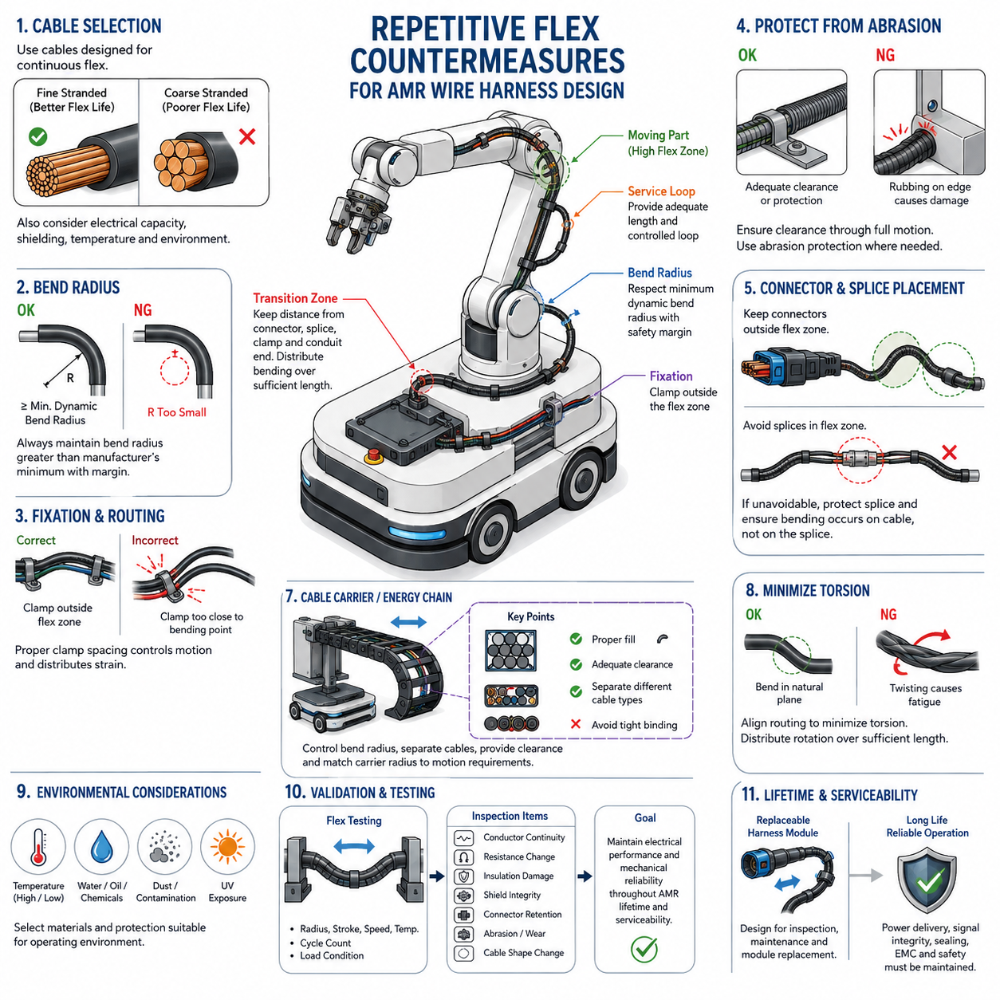
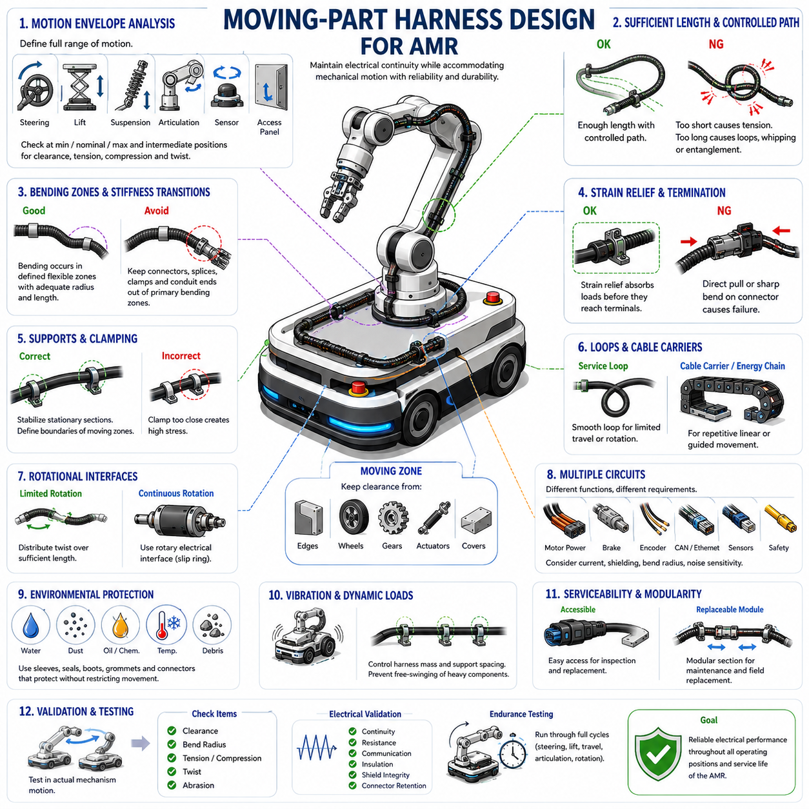
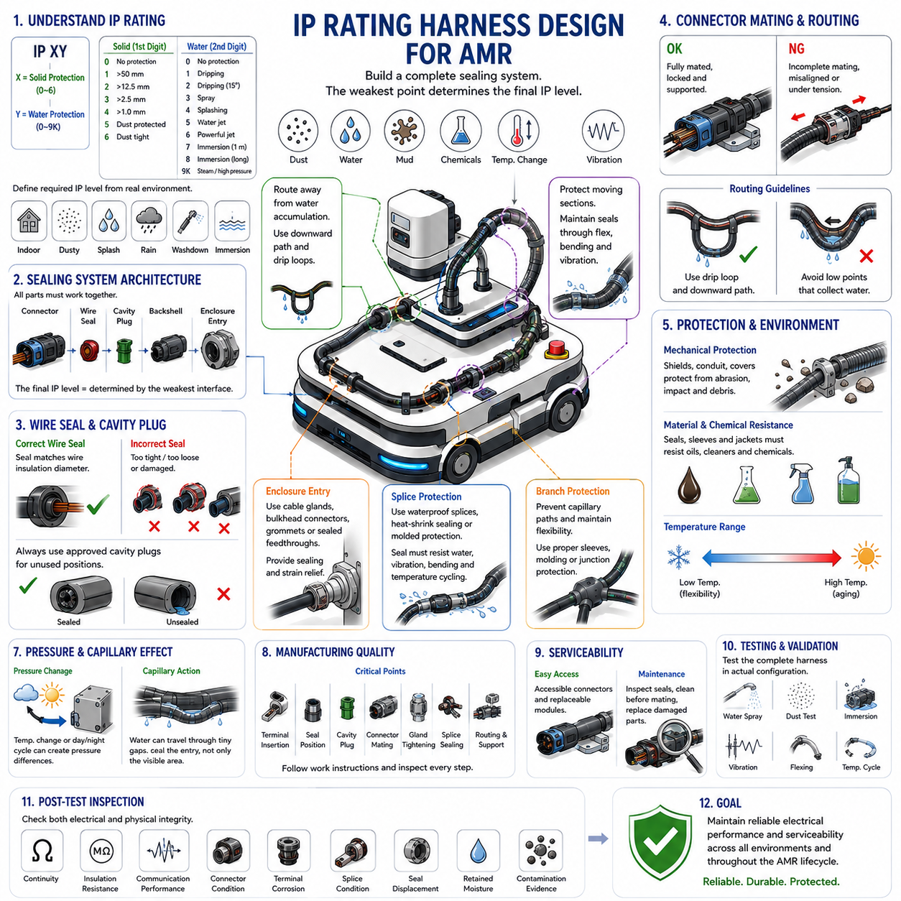
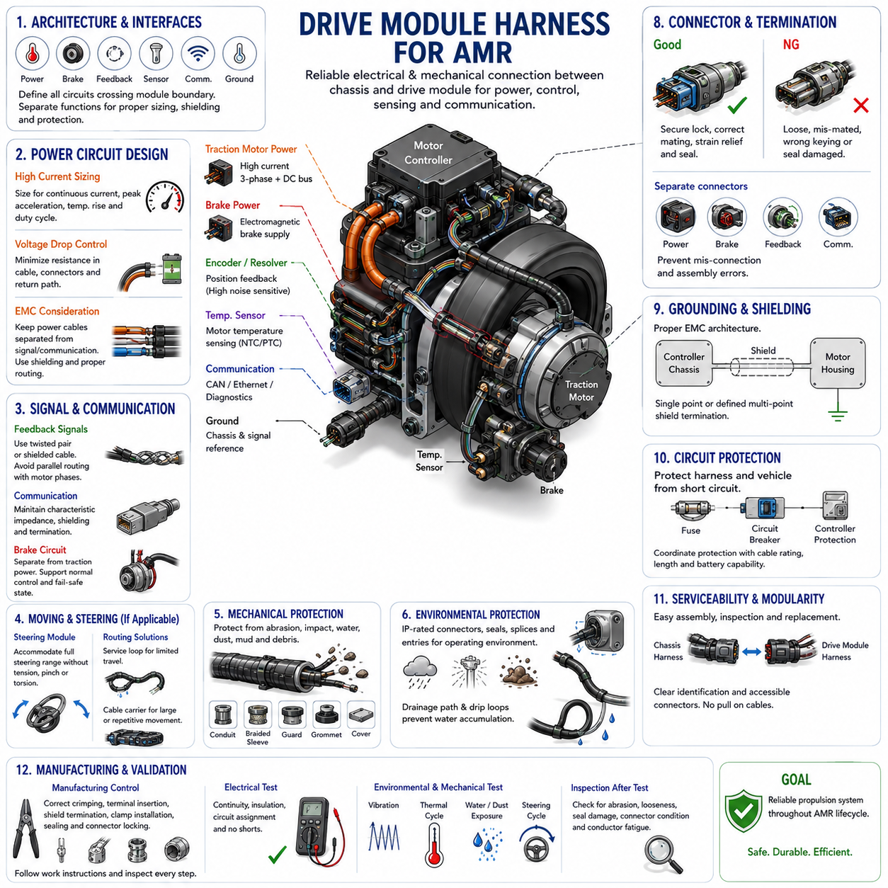
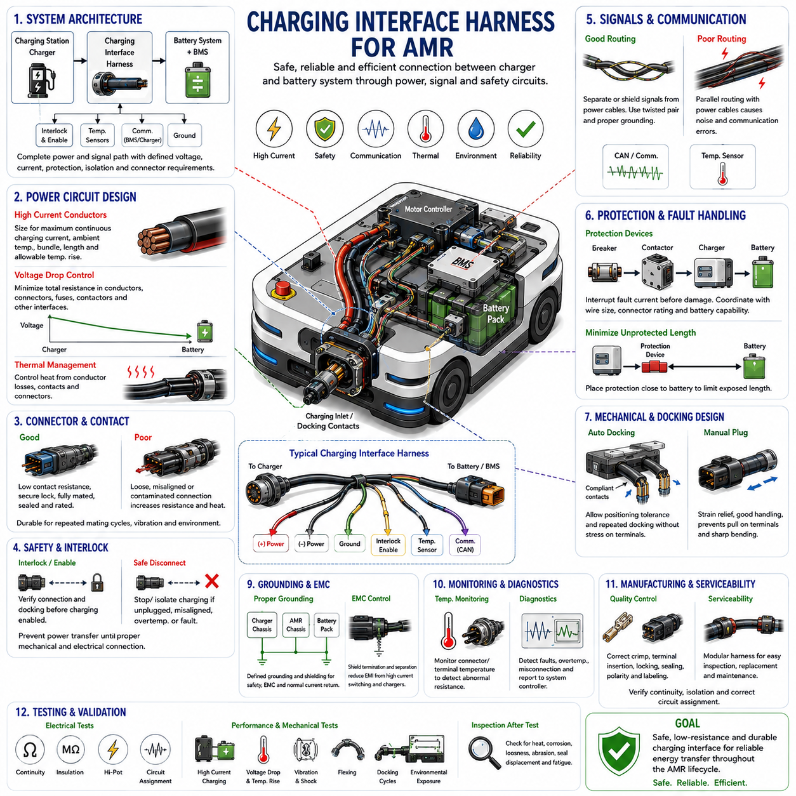

**Volume 02. Wire Harness Engineering**


# Chapter 12. AMR Harness Design

##  

## 12.01. Repetitive Flex Countermeasures

{width="7.268055555555556in" height="7.268055555555556in"}

Repetitive flexing is one of the most demanding mechanical conditions for an AMR wire harness because conductors, insulation, shielding, and protective coverings experience thousands or millions of bending cycles during steering, suspension motion, lift operation, sensor movement, or service articulation. The harness must therefore be designed as a dynamic mechanical component rather than as a stationary electrical connection.

The first countermeasure is to identify every region where relative movement occurs between connected components. Typical locations include steering modules, independently moving drive units, articulated sensor mounts, suspension interfaces, lifting mechanisms, rotating assemblies, and movable access panels. The expected displacement, bending direction, angular range, cycle frequency, and required service life should be defined before the routing geometry is finalized.

Conductor construction strongly influences flex life. Fine-stranded conductors generally tolerate repeated bending better than conductors made from fewer, larger strands because deformation is distributed among many small elements. The selected cable should be explicitly suitable for dynamic or continuous-flex applications when high cycle counts are expected. Electrical current capacity alone is therefore insufficient as a selection criterion for moving AMR harnesses.

Bend radius is a fundamental design parameter because excessive curvature concentrates mechanical strain in the conductor and insulation. A harness should never be forced around a sharp edge or constrained into a radius below the cable manufacturer\'s specified dynamic bending limit. Where repeated motion occurs, the design radius should normally provide additional margin beyond the minimum value so manufacturing variation and vehicle motion do not create localized overstress.

The location of the bending zone is as important as the bend radius itself. Motion should be distributed over a controlled length rather than concentrated immediately behind a connector, splice, clamp, or rigid conduit termination. These transition points create stiffness discontinuities where conductor fatigue can accelerate. Adequate free length and gradual stiffness transitions allow the cable to form a predictable bending shape during each operating cycle.

Harness fixation must distinguish between stationary support points and dynamic flex regions. Clamps should stabilize the harness outside the moving zone while allowing the intended flexible section to move freely. Installing a clamp too close to the bending center can transfer strain into a short cable segment, whereas insufficient fixation may permit uncontrolled whipping, rubbing, or entanglement. Clamp spacing must therefore support both motion control and strain distribution.

A service loop can provide additional movement capacity when properly designed, but excessive slack is not automatically beneficial. Uncontrolled loops can strike surrounding structures, become trapped between moving components, or create reverse bending during motion. The loop geometry should guide the harness through a repeatable trajectory while maintaining clearance throughout the full mechanical envelope. Its shape should be verified at both motion extremes and intermediate positions.

Torsional loading should be minimized because a cable designed primarily for bending may not tolerate repeated twisting with equal durability. Routing should align the natural bending plane of the harness with the dominant mechanism motion whenever possible. If rotation cannot be avoided, the required angular displacement should be distributed over sufficient cable length, or a cable specifically rated for combined torsional and flexing service should be selected.

Protective sleeves and conduits require special consideration in repetitive-flex zones. A protective layer that is appropriate for stationary routing may become excessively stiff during continuous movement and transfer bending stress to its termination points. Flexible braid, dynamic cable protection, or appropriately selected moving conduits can provide abrasion resistance while preserving mobility. Protection should not significantly reduce the intended dynamic bend radius.

Cable carriers or energy chains are effective where the motion path is linear, repetitive, and sufficiently predictable. The carrier controls bending radius, separates cables, and prevents uncontrolled loops while guiding power, communication, and sensor wiring through repeated travel. Cable fill, internal clearance, cable arrangement, carrier radius, acceleration, travel distance, and relative cable movement must all be considered rather than treating the carrier merely as mechanical protection.

Internal cable arrangement inside a moving carrier also affects lifetime. Cables should have enough space to move naturally without being tightly compressed against neighboring cables or carrier surfaces. Different cable diameters and stiffness levels may produce unequal motion, so separators can be useful where necessary. Cables should not be tied together so rigidly that they behave as one inflexible bundle throughout a region intended for continuous movement.

Connectors should normally be positioned outside the principal repetitive-flex zone. When this is impossible, strain relief must prevent cyclic bending loads from being transmitted directly into terminals, seals, backshells, or conductor crimp interfaces. Connector orientation should also avoid forcing the cable into an immediate sharp bend. The mechanical load path should pass through suitable harness support features rather than through electrically critical termination interfaces.

Splices require similar protection. A splice changes local diameter, stiffness, and mass and can therefore become a fatigue initiation point when located inside a dynamic bending region. Whenever practical, splices should be moved into mechanically stable harness sections. If a splice must remain near a moving interface, routing and support should ensure that the repetitive curvature occurs in flexible conductor sections rather than directly across the splice transition.

Abrasion becomes increasingly important as cycle count increases. Even small contact forces can eventually damage insulation when a cable repeatedly slides against brackets, frame members, fasteners, covers, or other harnesses. Dynamic clearance should therefore be evaluated over the complete motion envelope. Where contact cannot be eliminated, suitable abrasion-resistant protection and controlled contact surfaces should be introduced without creating new stiffness concentrations.

Environmental conditions can accelerate flex-related degradation. Low temperatures may increase insulation stiffness, elevated temperatures can reduce material strength, and water, oils, cleaning chemicals, or outdoor contamination may alter protective materials. An AMR intended for warehouses, outdoor operation, inspection, or industrial environments should therefore evaluate repetitive-flex durability under representative temperature and contamination conditions rather than only under room-temperature laboratory conditions.

Electrical characteristics can also change as mechanical damage accumulates. Broken conductor strands increase local resistance, while shield degradation can reduce EMC performance and intermittent contact can create communication faults that appear only during motion. Power, signal, Ethernet, CAN, encoder, sensor, and safety circuits should consequently be assessed according to their electrical sensitivity as well as their mechanical flex requirements when selecting cable and routing strategies.

Shielded cables need particular attention because shields, drain wires, and foil structures may have different fatigue behavior from the main conductors. A cable that remains electrically continuous may still suffer progressive shielding deterioration under repeated bending. For high-flex communication or sensor interfaces, shield construction should therefore be compatible with the required dynamic duty, and shield termination should not create an excessively rigid boundary at the beginning of the flex zone.

Design verification should reproduce the actual motion profile as closely as practical. Flex testing should consider representative bend radius, stroke, speed, acceleration, temperature, cable loading, and number of cycles. Inspection should monitor conductor continuity, resistance variation, insulation damage, shield integrity, connector retention, protective sleeve wear, and changes in cable geometry. Testing only a few manual bending cycles cannot demonstrate long-term AMR durability.

Accelerated testing can be useful, but increasing speed or reducing bend radius indiscriminately may introduce failure mechanisms that do not represent field operation. Test acceleration should preserve the dominant mechanical stresses of the real application. The required cycle count should be related to expected AMR operating frequency and design lifetime so that qualification represents actual accumulated movement rather than an arbitrary laboratory endurance target.

Repetitive-flex countermeasures should ultimately be integrated with serviceability and lifetime design. The volume structure places lifetime flex-cycle design within serviceability engineering and repetitive-flex countermeasures within AMR harness design, emphasizing that dynamic durability must be considered across both lifecycle and vehicle-level architecture. Replaceable moving harness modules can reduce maintenance cost when flexing components have predictable wear limits.

A robust AMR harness therefore combines suitable continuous-flex cable, generous controlled bend radius, carefully located fixation, protected transitions, adequate moving length, abrasion prevention, and realistic lifecycle validation. The objective is not simply to prevent immediate wire breakage, but to maintain power delivery, signal integrity, sealing, EMC performance, and connector reliability throughout repeated robot motion while keeping eventual inspection and replacement practical.

반복 굽힘(Repetitive Flex)은 조향(Steering), 서스펜션 운동(Suspension Motion), 리프트 작동(Lift Operation), 센서 이동(Sensor Movement), 정비 시 관절 운동(Service Articulation) 과정에서 도체(Conductor), 절연체(Insulation), 차폐(Shielding), 보호재(Protective Covering)가 수천에서 수백만 회의 굽힘 주기(Bending Cycle)를 받기 때문에 AMR 와이어 하니스(Wire Harness)에서 가장 가혹한 기계적 조건 중 하나이다. 따라서 하니스(Harness)는 고정된 전기 연결부가 아니라 동적인 기계 부품(Dynamic Mechanical Component)으로 설계해야 한다.

첫 번째 대응책(Countermeasure)은 연결된 부품 사이에서 상대 운동(Relative Movement)이 발생하는 모든 영역을 식별하는 것이다. 대표적인 위치에는 조향 모듈(Steering Module), 독립적으로 움직이는 구동 유닛(Drive Unit), 관절형 센서 마운트(Articulated Sensor Mount), 서스펜션 인터페이스(Suspension Interface), 리프팅 메커니즘(Lifting Mechanism), 회전 어셈블리(Rotating Assembly), 이동식 액세스 패널(Movable Access Panel)이 포함된다. 예상 변위, 굽힘 방향, 각도 범위, 주기 빈도 및 요구 수명을 라우팅 형상(Routing Geometry) 확정 전에 정의해야 한다.

도체 구조(Conductor Construction)는 굽힘 수명(Flex Life)에 큰 영향을 미친다. 미세 연선 도체(Fine-Stranded Conductor)는 변형이 여러 개의 작은 소선(Strand)에 분산되기 때문에 적은 수의 굵은 소선으로 구성된 도체보다 반복 굽힘에 일반적으로 더 잘 견딘다. 높은 반복 주기(Cycle Count)가 예상되는 경우 동적 또는 연속 굽힘 용도(Dynamic or Continuous-Flex Application)에 명확하게 적합한 케이블을 선정해야 한다. 따라서 이동형 AMR 하니스에서는 전류 용량(Current Capacity)만으로 케이블을 선정해서는 충분하지 않다.

굽힘 반경(Bend Radius)은 과도한 곡률(Curvature)이 도체와 절연체에 기계적 변형을 집중시키기 때문에 기본적인 설계 파라미터(Design Parameter)이다. 하니스를 날카로운 모서리 주변으로 강제로 굽히거나 케이블 제조업체가 규정한 동적 최소 굽힘 반경(Dynamic Minimum Bend Radius)보다 작게 배치해서는 안 된다. 반복 운동이 발생하는 곳에서는 제조 편차와 차량 운동으로 인한 국부적 과응력(Localized Overstress)을 방지할 수 있도록 최소값 이상의 추가 설계 여유(Design Margin)를 확보하는 것이 바람직하다.

굽힘 영역(Bending Zone)의 위치는 굽힘 반경만큼 중요하다. 운동은 커넥터(Connector), 스플라이스(Splice), 클램프(Clamp), 강성 전선관(Rigid Conduit) 끝단 바로 뒤에 집중되지 않고 제어된 길이에 걸쳐 분산되어야 한다. 이러한 전이 지점(Transition Point)은 강성 불연속(Stiffness Discontinuity)을 형성하여 도체 피로(Conductor Fatigue)를 가속할 수 있다. 충분한 자유 길이(Free Length)와 점진적인 강성 전이(Gradual Stiffness Transition)를 확보하면 케이블이 각 작동 주기마다 예측 가능한 굽힘 형상을 형성할 수 있다.

하니스 고정(Harness Fixation)은 고정 지지점(Stationary Support Point)과 동적 굽힘 영역(Dynamic Flex Region)을 구분하여 설계해야 한다. 클램프는 움직이는 영역 외부에서 하니스를 안정적으로 지지하면서 의도된 유연 구간(Flexible Section)이 자유롭게 움직일 수 있도록 해야 한다. 클램프가 굽힘 중심에 지나치게 가까우면 변형이 짧은 케이블 구간에 집중될 수 있으며, 고정이 부족하면 제어되지 않은 흔들림, 마찰 또는 얽힘이 발생할 수 있다. 따라서 클램프 간격(Clamp Spacing)은 운동 제어(Motion Control)와 변형 분산(Strain Distribution)을 동시에 고려해야 한다.

서비스 루프(Service Loop)는 적절하게 설계될 경우 추가적인 이동 여유를 제공할 수 있지만, 단순히 여유 길이를 많이 확보하는 것이 항상 좋은 것은 아니다. 제어되지 않은 루프는 주변 구조물과 충돌하거나 이동 부품 사이에 끼이거나 운동 과정에서 역방향 굽힘(Reverse Bending)을 발생시킬 수 있다. 루프 형상(Loop Geometry)은 전체 기계적 운동 범위(Mechanical Envelope)에서 간섭 없이 하니스가 반복 가능한 궤적을 따라 움직이도록 설계해야 하며, 양쪽 운동 극한 위치와 중간 위치 모두에서 검증해야 한다.

비틀림 하중(Torsional Loading)은 최소화해야 한다. 굽힘을 중심으로 설계된 케이블이 반복적인 비틀림까지 동일한 수준으로 견디는 것은 아니기 때문이다. 가능하면 하니스의 자연스러운 굽힘 평면(Natural Bending Plane)을 메커니즘의 주 운동 방향과 일치시키도록 라우팅해야 한다. 회전을 피할 수 없는 경우 필요한 각 변위(Angular Displacement)를 충분한 케이블 길이에 분산하거나 비틀림과 굽힘의 복합 운동(Combined Torsional and Flexing Service)에 적합한 케이블을 선정해야 한다.

보호 슬리브(Protective Sleeve)와 전선관(Conduit)은 반복 굽힘 영역에서 특별히 고려해야 한다. 고정 배선에 적합한 보호층이 연속 운동에서는 지나치게 강성이 높아져 굽힘 응력을 끝단으로 전달할 수 있다. 유연 브레이드(Flexible Braid), 동적 케이블 보호재(Dynamic Cable Protection), 적절하게 선정된 이동형 전선관을 사용하면 이동성을 유지하면서 내마모성(Abrasion Resistance)을 확보할 수 있다. 보호 구조가 설계된 동적 굽힘 반경을 크게 제한해서는 안 된다.

케이블 캐리어(Cable Carrier) 또는 에너지 체인(Energy Chain)은 운동 경로가 선형이고 반복적이며 충분히 예측 가능한 경우 효과적이다. 캐리어는 굽힘 반경을 제어하고 케이블을 분리하며 제어되지 않은 루프를 방지하면서 전원, 통신 및 센서 배선을 반복 이동 구간에서 안내한다. 단순한 기계적 보호 장치로 취급하지 말고 케이블 충전율(Cable Fill), 내부 간격, 케이블 배열, 캐리어 반경, 가속도, 이동 거리 및 케이블 간 상대 운동을 함께 고려해야 한다.

이동형 캐리어 내부의 케이블 배열(Internal Cable Arrangement) 역시 수명에 영향을 준다. 케이블은 인접 케이블이나 캐리어 표면에 지나치게 압착되지 않으면서 자연스럽게 움직일 수 있는 충분한 공간을 확보해야 한다. 서로 다른 케이블 직경과 강성은 불균일한 운동을 발생시킬 수 있으므로 필요한 경우 분리대(Separator)를 적용할 수 있다. 연속 운동이 필요한 영역 전체에서 케이블들을 지나치게 단단하게 묶어 하나의 강성 번들(Rigid Bundle)처럼 거동하게 해서는 안 된다.

커넥터(Connector)는 원칙적으로 주요 반복 굽힘 영역 외부에 배치해야 한다. 이것이 불가능한 경우 스트레인 릴리프(Strain Relief)를 적용하여 반복 굽힘 하중이 단자(Terminal), 씰(Seal), 백쉘(Backshell), 도체 크림프 인터페이스(Conductor Crimp Interface)로 직접 전달되지 않도록 해야 한다. 또한 커넥터 방향은 케이블이 연결 직후 급격하게 굽어지는 형상을 피해야 한다. 기계적 하중 경로(Mechanical Load Path)는 전기적으로 중요한 종단부가 아니라 적절한 하니스 지지 구조를 통하여 전달되어야 한다.

스플라이스(Splice)에도 동일한 보호 원칙이 적용된다. 스플라이스는 국부적인 직경, 강성 및 질량을 변화시키기 때문에 동적 굽힘 영역에 위치하면 피로 시작점(Fatigue Initiation Point)이 될 수 있다. 가능하면 스플라이스를 기계적으로 안정적인 하니스 구간으로 이동해야 한다. 이동 인터페이스 근처에 스플라이스를 배치해야 한다면 반복 곡률(Repetitive Curvature)이 스플라이스 전이부가 아니라 유연한 도체 구간에서 발생하도록 라우팅과 지지 구조를 설계해야 한다.

마모(Abrasion)는 반복 횟수가 증가할수록 더욱 중요해진다. 작은 접촉력이라도 케이블이 브래킷(Bracket), 프레임 부재(Frame Member), 체결부품(Fastener), 커버 또는 다른 하니스와 반복적으로 미끄러지면 결국 절연 손상을 일으킬 수 있다. 따라서 전체 운동 범위에 걸쳐 동적 간극(Dynamic Clearance)을 평가해야 한다. 접촉을 제거할 수 없는 경우 새로운 강성 집중을 만들지 않는 범위에서 적절한 내마모 보호재와 제어된 접촉면(Controlled Contact Surface)을 적용해야 한다.

환경 조건(Environmental Condition)은 굽힘에 의한 열화를 가속할 수 있다. 저온에서는 절연체의 강성이 증가하고, 고온에서는 재료 강도가 감소할 수 있으며, 물, 오일, 세척용 화학물질 또는 실외 오염물질은 보호재의 특성을 변화시킬 수 있다. 따라서 창고, 실외, 검사 또는 산업 환경에서 운용되는 AMR은 상온 실험실 조건만이 아니라 실제 운용을 대표하는 온도와 오염 조건에서 반복 굽힘 내구성(Repetitive-Flex Durability)을 평가해야 한다.

기계적 손상이 누적되면서 전기적 특성(Electrical Characteristics)도 변화할 수 있다. 도체 소선의 단선은 국부 저항을 증가시키고, 차폐 손상은 EMC 성능을 저하시킬 수 있으며, 간헐 접촉(Intermittent Contact)은 움직이는 동안에만 나타나는 통신 오류를 발생시킬 수 있다. 따라서 전원, 신호, 이더넷(Ethernet), CAN, 엔코더(Encoder), 센서 및 안전 회로(Safety Circuit)는 케이블과 라우팅 전략을 선정할 때 기계적 굽힘 요구사항뿐 아니라 전기적 민감도(Electrical Sensitivity)까지 함께 평가해야 한다.

차폐 케이블(Shielded Cable)은 차폐층(Shield), 드레인 와이어(Drain Wire), 포일 구조(Foil Structure)의 피로 특성이 주 도체와 다를 수 있기 때문에 특별한 주의가 필요하다. 케이블의 전기적 연속성이 유지되더라도 반복 굽힘에 의해 차폐 성능이 점진적으로 저하될 수 있다. 따라서 고유연 통신 또는 센서 인터페이스에는 요구되는 동적 사용 조건에 적합한 차폐 구조를 적용하고, 차폐 종단부(Shield Termination)가 굽힘 영역 시작점에서 지나치게 강한 경계를 형성하지 않도록 해야 한다.

설계 검증(Design Verification)은 가능한 한 실제 운동 프로파일(Motion Profile)을 충실하게 재현해야 한다. 굽힘 시험(Flex Testing)은 대표적인 굽힘 반경, 스트로크(Stroke), 속도, 가속도, 온도, 케이블 하중 및 반복 횟수를 고려해야 한다. 검사 과정에서는 도체 연속성, 저항 변화, 절연 손상, 차폐 무결성(Shield Integrity), 커넥터 유지력, 보호 슬리브 마모 및 케이블 형상 변화를 확인해야 한다. 몇 차례의 수동 굽힘 시험만으로 장기적인 AMR 내구성을 입증할 수는 없다.

가속 시험(Accelerated Testing)은 유용할 수 있지만 속도를 무조건 높이거나 굽힘 반경을 과도하게 줄이면 실제 현장 운용과 다른 고장 메커니즘(Failure Mechanism)이 발생할 수 있다. 시험 가속은 실제 적용 환경에서 지배적인 기계적 응력(Mechanical Stress)을 유지하도록 설계해야 한다. 요구 반복 횟수는 예상되는 AMR 작동 빈도와 설계 수명(Design Lifetime)에 연계하여 임의적인 실험실 내구 목표가 아니라 실제 누적 운동을 대표하도록 설정해야 한다.

반복 굽힘 대응책은 궁극적으로 정비성(Serviceability)과 수명 설계(Lifetime Design)에 통합되어야 한다. 본 구성에서는 수명 굽힘 주기 설계(Lifetime Flex Cycle Design)를 정비성 설계(Serviceability Design)에 포함하고, 반복 굽힘 대응책(Repetitive Flex Countermeasures)을 AMR 하니스 설계(AMR Harness Design)에 포함하고 있다. 이는 동적 내구성을 수명주기와 차량 수준 아키텍처(Vehicle-Level Architecture) 양쪽에서 고려해야 함을 의미한다. 예상 마모 한계를 가진 이동 하니스는 교체 가능한 모듈(Replaceable Harness Module)로 구성하면 유지보수 비용을 줄일 수 있다.

견고한 AMR 하니스 설계는 결국 적절한 연속 굽힘 케이블(Continuous-Flex Cable), 충분하고 제어된 굽힘 반경, 신중하게 배치된 고정점, 보호된 전이부, 충분한 이동 길이, 마모 방지 및 현실적인 수명주기 검증(Lifecycle Validation)을 결합해야 한다. 목표는 단순히 와이어의 즉각적인 단선을 방지하는 것이 아니라 반복적인 로봇 운동 전체에서 전력 전달, 신호 무결성(Signal Integrity), 밀봉(Sealing), EMC 성능 및 커넥터 신뢰성을 유지하면서 향후 검사와 교체까지 실용적으로 수행할 수 있도록 하는 것이다.

##  

## 12.02. Moving Part Harness Design

{width="7.268055555555556in" height="7.268055555555556in"}

Moving-part harness design addresses electrical wiring that crosses interfaces where components translate, rotate, steer, articulate, lift, or otherwise change position during AMR operation. Unlike stationary routing, these harness sections must preserve electrical continuity while accommodating predictable mechanical motion. Their design must therefore integrate cable flexibility, routing geometry, strain control, clearance, protection, and lifecycle durability as one coordinated system.

The design process begins by defining the complete mechanical motion envelope of every moving interface. Steering angle, suspension displacement, wheel-module movement, lift stroke, actuator travel, sensor rotation, access-panel motion, and service positions can all alter harness geometry. Routing should be evaluated at minimum, nominal, and maximum positions, including intermediate configurations where unexpected interference, tension, compression, or reverse bending may occur.

A moving harness requires sufficient effective length to accommodate displacement without transferring tensile loads into connectors or terminals. However, excessive cable length can produce uncontrolled loops, whipping, entanglement, or contact with nearby structures. The required length should therefore be determined from actual kinematics rather than arbitrary slack allowance, providing enough freedom for motion while maintaining a controlled and repeatable cable trajectory throughout the operating range.

Bending should occur within intentionally defined flexible zones rather than randomly along the harness. These zones should provide adequate bend radius and sufficient free cable length to distribute strain over a broad region. Connectors, splices, clamps, branch points, conduit ends, and other stiffness transitions should normally remain outside the primary bending area because repeated curvature around these discontinuities can accelerate conductor, insulation, or termination fatigue.

Routing geometry should follow the natural motion of the mechanism. A harness crossing a rotating joint should approach the joint in a direction that minimizes unnecessary twisting, while wiring attached to a translating assembly should follow a path compatible with its travel direction. Poor alignment can convert simple mechanical displacement into combined bending, torsion, and tension, significantly increasing cable stress even when the total movement appears relatively small.

Strain relief is essential wherever a flexible harness transitions into a connector, enclosure, motor, sensor, controller, or other rigid component. Mechanical loads generated by motion should be absorbed by dedicated support features before reaching terminals and conductor crimps. The strain-relief arrangement should prevent both direct pulling and concentrated bending immediately behind the termination while remaining compatible with required sealing, service access, and connector disengagement.

Clamps and supports define how mechanical motion is distributed through the harness. Fixed points should stabilize stationary sections and establish clear boundaries around moving zones without restricting the intended cable movement. A clamp positioned too close to a joint can create a short, highly stressed bending section, while excessive spacing can allow uncontrolled movement. Support positions should therefore be determined together with mechanism geometry and cable flexibility.

Service loops can accommodate limited translation or rotation where cable carriers are unnecessary or impractical. A properly designed loop changes shape smoothly as the mechanism moves and returns without folding, twisting, or contacting surrounding components. Loop orientation, diameter, free length, and attachment points should be chosen according to the actual direction of motion, and the loop should remain controlled during acceleration, braking, vibration, and emergency movement.

Cable carriers or energy chains provide a more controlled solution for mechanisms with repetitive linear or guided movement. They establish a predictable bending radius and protect cables from uncontrolled motion while allowing power and communication lines to travel together. Carrier selection should consider travel length, acceleration, bending radius, internal dimensions, cable quantity, cable diameter, separation requirements, and the space available around the moving mechanism.

Cables installed inside an energy chain should retain enough internal freedom to move without being tightly compressed or bound together. Different cable types may have different diameters, stiffness, and dynamic characteristics, making separators useful where relative movement could cause rubbing or interference. Harness ties intended for stationary bundles should not be applied in ways that prevent cables from naturally repositioning as the carrier bends and straightens.

Rotational interfaces require particular attention because continuous or large-angle rotation can accumulate torsion that ordinary harness slack cannot safely absorb. Limited rotation may be accommodated by distributing twist over sufficient cable length, but the resulting torsional strain must remain within cable capability. Mechanisms requiring repeated unlimited rotation may require a dedicated rotary electrical interface rather than attempting to solve the problem solely through conventional flexible harness routing.

Abrasion protection must be coordinated with dynamic movement. A moving harness should maintain clearance from sharp edges, fasteners, frame members, wheels, gears, actuators, covers, and other moving assemblies over its complete trajectory. Where occasional contact cannot be eliminated, flexible abrasion-resistant protection can be applied. Protective sleeves or conduits must not introduce excessive stiffness that shifts bending stress to their ends and creates new fatigue locations.

Moving-part harnesses often contain several electrical functions with different mechanical requirements. Motor power cables, brake wiring, encoder signals, CAN communication, Ethernet, safety circuits, and sensor cables may share the same moving mechanism but should not automatically follow identical routing. Cable diameter, shielding, minimum bend radius, noise sensitivity, current level, and flex rating should be considered when deciding whether circuits can be bundled or require separate controlled paths.

Shielded communication and sensor cables require particular care because dynamic motion can affect both conductor continuity and electromagnetic compatibility. Shield braid, foil, drain conductors, and shield terminations may experience repeated mechanical stress even when the main conductors remain functional. Cable construction should therefore support the intended moving application, and rigid shield terminations should be positioned so that they do not become concentrated fatigue boundaries.

Environmental protection remains necessary even within moving sections. Outdoor or industrial AMRs may expose articulated harnesses to water, dust, oils, cleaning chemicals, temperature extremes, and debris while the cables are continuously moving. Sleeves, seals, boots, grommets, and connectors should maintain the required protection without restricting movement. Material flexibility at the lowest expected operating temperature is particularly important because otherwise acceptable routing can become excessively stiff.

Moving harness design must also account for vibration and dynamic acceleration. Rapid steering changes, wheel impacts, lift operation, emergency braking, or travel over uneven surfaces can produce inertial forces that cause unsupported cable sections to oscillate. Harness mass should therefore be controlled through appropriate support spacing and routing. Heavy connectors, splice packages, or protective components should not be allowed to move freely where their inertia can repeatedly load nearby conductors.

Installation tolerances must be included because production harnesses rarely reproduce nominal CAD geometry exactly. Cable length tolerance, clamp position, connector orientation, bundle diameter, protective covering thickness, and assembly variation can reduce intended clearances or bend-radius margins. Moving-part designs should therefore include sufficient mechanical margin so that acceptable manufacturing variation does not transform a nominally safe routing path into an interference or fatigue condition.

Serviceability should be considered from the beginning because moving harness sections can experience greater wear than stationary wiring. Connectors and attachment points should remain accessible where practical, and replacement should not require unnecessary disassembly of unrelated AMR systems. Where a moving harness has a predictable finite service life, a modular replaceable section can provide a practical method for scheduled inspection, maintenance, and field replacement.

Validation should reproduce the actual mechanism motion rather than testing the cable independently under unrelated conditions. The assembled harness should be exercised through representative steering, lifting, translation, articulation, or rotation cycles while monitoring clearance, bend radius, tension, twisting, abrasion, and support behavior. Electrical continuity, resistance, communication stability, insulation condition, shield integrity, connector retention, and visible mechanical wear should be evaluated throughout endurance testing.

The final moving-part harness should behave predictably through every operational and service position of the AMR. Successful design does not merely provide enough cable for a component to move; it deliberately controls where and how the cable bends, twists, translates, and transfers mechanical load. Integrating motion-envelope analysis, flexible routing, strain relief, abrasion protection, environmental durability, validation, and replaceability produces a harness capable of maintaining reliable electrical performance throughout robot operation.

이동부 하니스 설계(Moving-Part Harness Design)는 AMR 운용 중 부품이 병진(Translation), 회전(Rotation), 조향(Steering), 관절 운동(Articulation), 승강(Lifting) 또는 기타 방식으로 위치를 변경하는 인터페이스를 통과하는 전기 배선을 다룬다. 고정 배선과 달리 이러한 하니스 구간은 예측 가능한 기계적 운동을 수용하면서 전기적 연속성(Electrical Continuity)을 유지해야 한다. 따라서 케이블 유연성, 라우팅 형상, 변형 제어, 간극, 보호 및 수명주기 내구성을 하나의 통합 시스템으로 설계해야 한다.

설계 과정은 모든 이동 인터페이스의 전체 기계적 운동 범위(Mechanical Motion Envelope)를 정의하는 것에서 시작한다. 조향각(Steering Angle), 서스펜션 변위(Suspension Displacement), 휠 모듈 이동, 리프트 스트로크(Lift Stroke), 액추에이터 이동, 센서 회전, 액세스 패널 운동 및 정비 위치에 따라 하니스 형상이 달라질 수 있다. 라우팅은 최소, 공칭 및 최대 위치뿐 아니라 예상하지 못한 간섭, 장력, 압축 또는 역방향 굽힘이 발생할 수 있는 중간 위치에서도 평가해야 한다.

이동 하니스(Moving Harness)는 커넥터 또는 단자에 인장 하중(Tensile Load)을 전달하지 않으면서 변위를 수용할 수 있는 충분한 유효 길이(Effective Length)를 확보해야 한다. 그러나 케이블 길이가 지나치게 길면 제어되지 않은 루프, 흔들림, 얽힘 또는 주변 구조물과의 접촉이 발생할 수 있다. 따라서 필요한 길이는 임의적인 여유 길이가 아니라 실제 운동학(Kinematics)을 기반으로 결정하여 전체 작동 범위에서 제어되고 반복 가능한 케이블 궤적을 유지해야 한다.

굽힘은 하니스 전체에서 임의로 발생하는 것이 아니라 의도적으로 정의된 유연 영역(Flexible Zone)에서 발생하도록 해야 한다. 이러한 영역은 충분한 굽힘 반경(Bend Radius)과 자유 케이블 길이를 확보하여 변형을 넓은 구간에 분산해야 한다. 커넥터, 스플라이스(Splice), 클램프(Clamp), 분기점, 전선관 끝단 및 기타 강성 전이부(Stiffness Transition)는 반복적인 곡률로 인한 도체, 절연체 또는 종단부의 피로를 방지하기 위해 주요 굽힘 영역 외부에 배치하는 것이 원칙이다.

라우팅 형상(Routing Geometry)은 메커니즘의 자연스러운 운동을 따라야 한다. 회전 조인트(Rotating Joint)를 통과하는 하니스는 불필요한 비틀림을 최소화하는 방향으로 조인트에 접근해야 하며, 병진 운동하는 어셈블리에 연결된 배선은 이동 방향에 적합한 경로를 따라야 한다. 잘못된 정렬은 단순한 기계적 변위를 굽힘, 비틀림 및 인장이 결합된 운동으로 변화시켜 전체 이동량이 작더라도 케이블 응력을 크게 증가시킬 수 있다.

스트레인 릴리프(Strain Relief)는 유연한 하니스가 커넥터, 인클로저(Enclosure), 모터, 센서, 컨트롤러 또는 기타 강성 부품으로 전환되는 모든 위치에서 중요하다. 운동으로 발생하는 기계적 하중은 단자와 도체 크림프(Conductor Crimp)에 도달하기 전에 전용 지지 구조에서 흡수되어야 한다. 스트레인 릴리프 구조는 종단부 바로 뒤에서 직접적인 당김과 집중 굽힘을 방지하면서 요구되는 밀봉, 정비 접근성 및 커넥터 분리 작업과도 호환되어야 한다.

클램프와 지지부(Clamp and Support)는 기계적 운동이 하니스 전체에 어떻게 분산되는지를 결정한다. 고정점(Fixed Point)은 고정 구간을 안정화하고 이동 영역 주변에 명확한 경계를 형성하면서 의도된 케이블 운동을 제한하지 않아야 한다. 클램프가 조인트에 지나치게 가까우면 짧은 구간에 높은 굽힘 응력이 집중될 수 있고, 간격이 너무 넓으면 제어되지 않은 운동이 발생할 수 있다. 따라서 지지 위치는 메커니즘 형상과 케이블 유연성을 함께 고려하여 결정해야 한다.

서비스 루프(Service Loop)는 케이블 캐리어(Cable Carrier)가 불필요하거나 적용하기 어려운 곳에서 제한적인 병진 또는 회전 운동을 수용할 수 있다. 적절하게 설계된 루프는 메커니즘의 운동에 따라 부드럽게 형상을 변경하고 접힘, 비틀림 또는 주변 부품과의 접촉 없이 원래 위치로 복귀해야 한다. 루프 방향, 직경, 자유 길이 및 고정점은 실제 운동 방향에 따라 선정해야 하며 가속, 제동, 진동 및 비상 운동에서도 제어된 상태를 유지해야 한다.

케이블 캐리어(Cable Carrier) 또는 에너지 체인(Energy Chain)은 반복적인 선형 또는 안내 운동(Guided Movement)을 수행하는 메커니즘에 더욱 제어된 해결책을 제공한다. 이들은 예측 가능한 굽힘 반경을 형성하고 케이블의 비제어 운동을 방지하면서 전원선과 통신선을 함께 이동시킬 수 있다. 캐리어 선정 시 이동 거리, 가속도, 굽힘 반경, 내부 치수, 케이블 수량과 직경, 분리 요구사항 및 이동 메커니즘 주변의 가용 공간을 고려해야 한다.

에너지 체인 내부에 설치된 케이블은 지나치게 압착되거나 단단하게 묶이지 않고 움직일 수 있도록 충분한 내부 자유도(Internal Freedom)를 확보해야 한다. 서로 다른 종류의 케이블은 직경, 강성 및 동적 특성이 다를 수 있으므로 상대 운동으로 인한 마찰이나 간섭이 예상되는 경우 분리대(Separator)를 사용하는 것이 효과적이다. 고정형 번들에 사용하는 하니스 타이(Harness Tie)를 적용하여 캐리어가 굽혀지고 펴질 때 케이블의 자연스러운 위치 변화를 방해해서는 안 된다.

회전 인터페이스(Rotational Interface)는 연속 회전 또는 큰 각도의 회전으로 일반적인 하니스 여유 길이가 안전하게 흡수할 수 없는 비틀림이 누적될 수 있으므로 특별한 주의가 필요하다. 제한적인 회전은 충분한 케이블 길이에 비틀림을 분산하여 수용할 수 있지만 발생하는 비틀림 변형(Torsional Strain)이 케이블 허용 범위 이내여야 한다. 반복적인 무제한 회전이 필요한 메커니즘에서는 일반적인 유연 하니스 라우팅만으로 해결하기보다 전용 회전형 전기 인터페이스(Rotary Electrical Interface)가 필요할 수 있다.

마모 보호(Abrasion Protection)는 동적 운동과 함께 고려해야 한다. 이동 하니스는 전체 운동 궤적에서 날카로운 모서리, 체결부품, 프레임 부재, 휠, 기어, 액추에이터, 커버 및 기타 이동 어셈블리와 충분한 간극을 유지해야 한다. 간헐적인 접촉을 제거할 수 없는 경우 유연한 내마모 보호재를 적용할 수 있다. 보호 슬리브 또는 전선관은 과도한 강성을 발생시켜 굽힘 응력을 끝단으로 이동시키고 새로운 피로 지점을 만들지 않아야 한다.

이동부 하니스에는 서로 다른 기계적 요구조건을 가진 여러 전기 기능이 포함되는 경우가 많다. 모터 전원 케이블, 브레이크 배선, 엔코더 신호, CAN 통신, 이더넷(Ethernet), 안전 회로 및 센서 케이블이 동일한 이동 메커니즘을 통과하더라도 반드시 동일한 라우팅을 적용할 필요는 없다. 회로를 하나의 번들로 구성할지 또는 별도의 제어 경로로 분리할지는 케이블 직경, 차폐, 최소 굽힘 반경, 노이즈 민감도, 전류 수준 및 굽힘 등급(Flex Rating)을 고려하여 결정해야 한다.

차폐 통신 및 센서 케이블(Shielded Communication and Sensor Cable)은 동적 운동이 도체 연속성과 전자기 적합성(Electromagnetic Compatibility) 모두에 영향을 줄 수 있기 때문에 특별한 주의가 필요하다. 차폐 브레이드(Shield Braid), 포일(Foil), 드레인 도체(Drain Conductor) 및 차폐 종단부(Shield Termination)는 주 도체가 정상적으로 작동하는 동안에도 반복적인 기계적 응력을 받을 수 있다. 따라서 케이블 구조는 이동 용도에 적합해야 하며 강성 차폐 종단부가 집중적인 피로 경계(Fatigue Boundary)가 되지 않도록 배치해야 한다.

환경 보호(Environmental Protection)는 이동 구간에서도 유지되어야 한다. 실외 또는 산업용 AMR에서는 케이블이 지속적으로 움직이는 동안 관절형 하니스가 물, 먼지, 오일, 세척 화학물질, 극한 온도 및 이물질에 노출될 수 있다. 슬리브, 씰(Seal), 부트(Boot), 그로밋(Grommet) 및 커넥터는 움직임을 제한하지 않으면서 필요한 보호 성능을 유지해야 한다. 특히 최저 예상 운용 온도에서의 재료 유연성이 중요하며, 그렇지 않으면 정상적인 라우팅도 저온에서 지나치게 강성이 높아질 수 있다.

이동 하니스 설계에서는 진동(Vibration)과 동적 가속도(Dynamic Acceleration)도 고려해야 한다. 급격한 조향 변화, 휠 충격, 리프트 작동, 비상 제동 또는 불규칙한 노면 주행은 관성력을 발생시켜 지지되지 않은 케이블 구간을 진동시킬 수 있다. 따라서 적절한 지지 간격과 라우팅을 통해 하니스 질량의 운동을 제어해야 한다. 무거운 커넥터, 스플라이스 패키지 또는 보호 부품이 자유롭게 움직이면서 주변 도체에 반복적인 관성 하중을 가하지 않도록 해야 한다.

생산 하니스는 공칭 CAD 형상을 완벽하게 재현하기 어렵기 때문에 설치 공차(Installation Tolerance)를 설계에 포함해야 한다. 케이블 길이 공차, 클램프 위치, 커넥터 방향, 번들 직경, 보호재 두께 및 조립 편차는 설계된 간극이나 굽힘 반경 여유를 감소시킬 수 있다. 따라서 허용 가능한 제조 편차로 인해 명목상 안전한 라우팅 경로가 간섭 또는 피로 위험 상태로 변화하지 않도록 충분한 기계적 설계 여유(Mechanical Design Margin)를 확보해야 한다.

이동 하니스 구간은 고정 배선보다 높은 마모 가능성을 가지므로 초기 설계부터 정비성(Serviceability)을 고려해야 한다. 가능한 경우 커넥터와 고정점에 쉽게 접근할 수 있어야 하며, 교체 작업을 위해 관련 없는 AMR 시스템까지 불필요하게 분해하지 않도록 해야 한다. 이동 하니스가 예측 가능한 유한 수명(Finite Service Life)을 갖는 경우 모듈식 교체 구간(Modular Replaceable Section)을 적용하면 정기 검사, 유지보수 및 현장 교체를 효과적으로 수행할 수 있다.

검증(Validation)은 케이블을 실제 조건과 무관하게 독립적으로 시험하는 것이 아니라 실제 메커니즘 운동을 재현해야 한다. 조립된 하니스를 대표적인 조향, 승강, 병진, 관절 또는 회전 주기에 따라 반복 작동시키면서 간극, 굽힘 반경, 장력, 비틀림, 마모 및 지지 상태를 확인해야 한다. 내구 시험(Endurance Testing) 전 과정에서 전기적 연속성, 저항, 통신 안정성, 절연 상태, 차폐 무결성, 커넥터 유지력 및 가시적인 기계적 마모를 평가해야 한다.

최종적으로 이동부 하니스는 AMR의 모든 운용 및 정비 위치에서 예측 가능한 방식으로 거동해야 한다. 성공적인 설계는 단순히 부품이 움직일 수 있도록 충분한 케이블 길이를 제공하는 것이 아니라 케이블이 어디에서 어떻게 굽혀지고, 비틀리고, 이동하며, 기계적 하중을 전달하는지를 의도적으로 제어하는 것이다. 운동 범위 분석(Motion-Envelope Analysis), 유연 라우팅, 스트레인 릴리프, 마모 보호, 환경 내구성, 검증 및 교체성을 통합함으로써 로봇의 전체 운용 수명 동안 신뢰할 수 있는 전기적 성능을 유지하는 하니스를 구현할 수 있다.

##  

## 12.03. IP Rating Harness Design

{width="7.268055555555556in" height="7.268055555555556in"}

IP rating harness design for an AMR ensures that electrical conductors, connectors, splices, branch points, and enclosure interfaces remain protected against solid particles and water throughout the robot's operating life. Because AMRs may operate near dust, rain, splashing water, cleaning processes, or outdoor contamination, environmental sealing must be treated as a system-level harness requirement rather than only a connector specification.

The required ingress protection level should be defined from the actual operating environment before selecting harness components. The first IP digit represents protection against solid-particle ingress, while the second represents protection against water. A design intended for a controlled indoor warehouse may require different protection from an outdoor inspection AMR exposed to rain, mud, washdown, standing water, or repeated transitions between wet and dry environments.

Selecting an IP-rated connector does not automatically make the complete harness assembly compliant with the same rating. Connector housings, terminals, wire seals, cavity plugs, backshells, cable glands, mating interfaces, and enclosure penetrations must function together as a sealing system. The final protection level is determined by the weakest interface, so every potential ingress path should be identified during harness architecture and packaging design.

Wire seals must match the actual conductor insulation diameter rather than only the nominal wire gauge. A seal designed for an incorrect cable diameter may be excessively compressed, insufficiently compressed, or mechanically damaged during terminal insertion. Wire insulation surface condition is also important because cuts, scratches, contamination, or deformation near the sealing region can create small leakage paths that become significant during prolonged exposure to water or pressure.

Unused connector cavities require dedicated sealing because an empty terminal position can provide a direct path for moisture and contamination. Approved cavity plugs or sealing pins should be installed according to the connector system specification. Improvised fillers, adhesives, or uncontrolled sealants should not replace designed sealing components because their performance can vary with temperature, vibration, chemical exposure, aging, and maintenance activity.

Connector mating must achieve the intended mechanical lock and seal compression. Partial engagement may provide electrical contact while leaving the sealing interface insufficiently compressed. Connector position assurance and secondary locking features should therefore be verified during assembly and inspection. Harness routing should also avoid mechanical loads that pull on the connector and gradually reduce engagement or distort the sealing geometry during vehicle operation.

Cable entry into an electrical enclosure requires particular attention because the enclosure may have a high IP rating while an improperly designed harness penetration compromises the entire assembly. Cable glands, bulkhead connectors, grommets, or sealed feedthroughs should be selected according to cable diameter, environmental exposure, and enclosure requirements. The penetration must provide sealing while also controlling cable strain and preventing movement from damaging the sealing interface.

Harness routing should prevent water from being naturally guided toward connectors and enclosure entries. Where possible, cable paths should include suitable downward routing or drip-loop geometry so water drains away from sensitive interfaces instead of accumulating at them. Vertical cable runs entering an enclosure from above deserve particular attention because water can travel along the cable surface and reach the sealing interface repeatedly during rain or wash exposure.

Low points in harness routing can collect water, mud, or cleaning fluid if protective sleeves and conduits are not appropriately designed. Corrugated conduit can protect wiring mechanically but may also retain moisture when water enters through an opening. Drainage strategy should therefore be considered together with sealing strategy. A partially sealed conduit that traps water can create a more severe long-term environment than an intentionally drained protective system.

Splices located in wet or contaminated zones require waterproof construction appropriate to the expected exposure. The conductor joint must provide electrical integrity while the external sealing system prevents water from reaching exposed conductor strands. Heat-shrink sealing, molded protection, waterproof splice systems, or other qualified methods may be used according to the harness architecture, but the sealed region must also tolerate vibration, bending, temperature cycling, and installation variation.

Branch points are another potential ingress location because multiple wires or conduits converge and create irregular geometries that are difficult to seal consistently. Branch protection should prevent capillary water paths while maintaining mechanical support and appropriate flexibility. Tape alone should not automatically be assumed to provide waterproofing unless the complete wrapping process and material system have been validated for the intended environmental exposure.

Capillary action can transport moisture through very small gaps between conductor strands, insulation interfaces, braided shields, or poorly sealed transitions. Water entering at one point may therefore migrate beyond the visibly wet region. Harness sealing should prevent initial ingress rather than relying only on local external protection. Particular attention is required where stripped conductors, shield terminations, splices, or cable transitions expose internal pathways.

Pressure differences can also drive moisture through small sealing defects. Temperature changes between daytime and nighttime operation, movement between indoor and outdoor environments, or heating and cooling of electrical equipment can change internal air pressure. Repeated pressure cycling may gradually draw humid air or water through marginal seals, making long-term sealing performance dependent on both environmental exposure and thermal behavior.

Dynamic harness sections create additional challenges because repeated bending can degrade seals, boots, glands, and protective coverings even when their initial IP performance is satisfactory. A sealing system near steering, lifting, suspension, or articulated mechanisms must maintain compression and geometry throughout movement. Flexing should not repeatedly pull on sealed interfaces, and rigid sealing components should normally remain outside primary repetitive-flex zones whenever practical.

Abrasion and impact can indirectly reduce IP performance by damaging cable insulation, protective sleeves, connector housings, or sealing surfaces. Outdoor AMRs may encounter gravel, vegetation, debris, tools, pallet edges, or other objects capable of striking exposed harnesses. Environmental protection therefore depends on mechanical packaging as well as sealing, and vulnerable harness sections may require guards, conduits, covers, or relocation to protected structural zones.

Temperature influences sealing materials and should be included in component selection. Elastomeric seals may harden at low temperature, soften at elevated temperature, or lose compression after long-term aging. Cable insulation and connector materials also expand and contract differently during thermal cycling. The required IP performance should therefore be maintained across the AMR's specified temperature range rather than demonstrated only under nominal room-temperature conditions.

Chemical compatibility is particularly important for industrial AMRs exposed to oils, greases, coolants, detergents, disinfectants, or cleaning agents. A sealing material that performs well against water may swell, crack, soften, or lose elasticity after chemical exposure. Connector seals, boots, grommets, glands, sleeves, and cable jackets should consequently be selected according to both the required ingress protection and the substances expected in the operating environment.

Serviceability must be balanced with sealing performance. Connectors that are frequently disconnected for maintenance can accumulate dirt, damage seals, or lose lubrication required by the connector system. Service procedures should protect open interfaces from contamination and require inspection of seals before reconnection. Damaged seals, cavity plugs, locking features, or backshell components should be replaced rather than reused when their environmental performance can no longer be assured.

Manufacturing quality has a direct effect on final IP performance. Correct terminal insertion, seal position, cavity plugging, connector mating, gland tightening, boot installation, splice sealing, and routing must be controlled through work instructions and inspection. Even a well-designed sealing architecture can fail when assembly variation leaves a seal folded, a terminal incompletely seated, a gland incorrectly tightened, or a cable surface contaminated.

Validation should evaluate the completed harness in a configuration representative of the installed AMR. Water spray, dust exposure, immersion where applicable, temperature cycling, vibration, flexing, and mechanical loading may need to be combined because field failures often result from interactions between environmental and mechanical stresses. Testing individual components alone cannot fully demonstrate the protection provided by the assembled routing and sealing system.

Post-test inspection should examine both electrical and physical integrity. Continuity, insulation resistance, communication performance, connector condition, terminal corrosion, splice condition, seal displacement, retained moisture, and evidence of contamination should be checked after environmental exposure. Where safety-related or high-current circuits are involved, small amounts of moisture that do not immediately cause failure should still be treated as significant evidence of sealing weakness.

A robust AMR IP-rated harness therefore combines appropriate component ratings with controlled routing, waterproof transitions, drainage, strain relief, mechanical protection, manufacturing discipline, and representative environmental validation. The objective is not simply to attach an IP-rated connector to a cable, but to create a complete environmental protection system that maintains electrical reliability and serviceability across stationary and moving sections throughout the robot lifecycle.

AMR의 IP 등급 하니스 설계(IP Rating Harness Design)는 로봇의 전체 운용 수명 동안 전기 도체, 커넥터(Connector), 스플라이스(Splice), 분기점(Branch Point) 및 인클로저 인터페이스(Enclosure Interface)를 고형 이물질과 물의 침입으로부터 보호하는 것을 목적으로 한다. AMR은 먼지, 비, 비산수, 세척 작업 또는 실외 오염에 노출될 수 있으므로 환경 밀봉(Environmental Sealing)은 단순한 커넥터 사양이 아니라 시스템 수준의 하니스 요구사항(System-Level Harness Requirement)으로 다루어야 한다.

요구되는 침입 보호 등급(Ingress Protection Level)은 하니스 부품을 선정하기 전에 실제 운용 환경을 기반으로 정의해야 한다. IP 등급의 첫 번째 숫자는 고형 입자 침입에 대한 보호 수준을 나타내며 두 번째 숫자는 물에 대한 보호 수준을 나타낸다. 관리된 실내 창고에서 사용하는 설계와 비, 진흙, 세척수, 고인 물 또는 반복적인 습식·건식 환경 변화에 노출되는 실외 검사용 AMR은 서로 다른 보호 수준을 요구할 수 있다.

IP 등급 커넥터(IP-Rated Connector)를 선정했다고 해서 전체 하니스 어셈블리(Harness Assembly)가 자동으로 동일한 등급을 만족하는 것은 아니다. 커넥터 하우징, 단자, 와이어 씰(Wire Seal), 캐비티 플러그(Cavity Plug), 백쉘(Backshell), 케이블 글랜드(Cable Gland), 결합 인터페이스(Mating Interface) 및 인클로저 관통부가 하나의 밀봉 시스템(Sealing System)으로 함께 작동해야 한다. 최종 보호 수준은 가장 취약한 인터페이스에 의해 결정되므로 하니스 아키텍처와 패키징 설계 단계에서 가능한 모든 침입 경로를 식별해야 한다.

와이어 씰(Wire Seal)은 공칭 와이어 게이지만이 아니라 실제 도체 절연 외경에 맞아야 한다. 잘못된 케이블 직경에 적용된 씰은 지나치게 압축되거나 충분히 압축되지 않을 수 있으며 단자 삽입 과정에서 기계적으로 손상될 수도 있다. 밀봉 영역 주변의 와이어 절연 표면 상태 역시 중요하며 절단, 긁힘, 오염 또는 변형은 장기간 물이나 압력에 노출될 때 심각한 누설 경로를 형성할 수 있다.

사용하지 않는 커넥터 캐비티(Unused Connector Cavity)는 빈 단자 위치가 수분과 오염물질의 직접적인 침입 경로가 될 수 있으므로 별도의 밀봉이 필요하다. 승인된 캐비티 플러그 또는 실링 핀(Sealing Pin)을 커넥터 시스템 사양에 따라 설치해야 한다. 임의의 충전재, 접착제 또는 관리되지 않은 실란트(Sealant)는 온도, 진동, 화학물질 노출, 노화 및 정비 작업에 따라 성능이 달라질 수 있으므로 설계된 밀봉 부품을 대신해서는 안 된다.

커넥터 체결(Connector Mating)은 의도된 기계적 잠금과 씰 압축(Seal Compression)이 모두 확보되어야 한다. 불완전한 체결 상태에서도 전기적 접촉은 이루어질 수 있지만 밀봉 인터페이스는 충분히 압축되지 않을 수 있다. 따라서 조립 및 검사 과정에서 커넥터 위치 보증(Connector Position Assurance)과 보조 잠금 기능(Secondary Locking Feature)을 확인해야 한다. 또한 하니스 라우팅은 커넥터를 당겨 체결력을 점진적으로 감소시키거나 운용 중 밀봉 형상을 변형시키는 기계적 하중을 방지해야 한다.

전기 인클로저로 케이블이 진입하는 부분은 특히 주의해야 한다. 인클로저 자체가 높은 IP 등급을 갖더라도 부적절하게 설계된 하니스 관통부(Harness Penetration)가 전체 어셈블리의 보호 성능을 저하시킬 수 있기 때문이다. 케이블 글랜드, 벌크헤드 커넥터(Bulkhead Connector), 그로밋(Grommet) 또는 밀봉형 피드스루(Sealed Feedthrough)는 케이블 직경, 환경 노출 및 인클로저 요구조건에 따라 선정해야 한다. 관통부는 밀봉 기능과 함께 케이블 변형을 제어하고 움직임에 의한 밀봉 인터페이스 손상을 방지해야 한다.

하니스 라우팅은 물이 자연스럽게 커넥터와 인클로저 진입부 방향으로 흐르지 않도록 설계해야 한다. 가능하면 케이블 경로에 적절한 하향 라우팅 또는 드립 루프(Drip Loop) 형상을 적용하여 물이 민감한 인터페이스에 축적되지 않고 배수되도록 해야 한다. 특히 위쪽에서 인클로저로 진입하는 수직 케이블은 비나 세척수 노출 시 케이블 표면을 따라 물이 반복적으로 밀봉 인터페이스까지 이동할 수 있으므로 특별한 주의가 필요하다.

보호 슬리브와 전선관(Conduit)을 적절하게 설계하지 않으면 하니스 라우팅의 낮은 지점에 물, 진흙 또는 세척액이 축적될 수 있다. 코루게이트 전선관(Corrugated Conduit)은 배선을 기계적으로 보호할 수 있지만 개구부를 통해 물이 들어오면 내부에 수분을 유지할 수도 있다. 따라서 배수 전략(Drainage Strategy)은 밀봉 전략(Sealing Strategy)과 함께 고려해야 한다. 물이 유입된 후 내부에 가두는 부분 밀봉 구조는 의도적으로 배수되는 보호 시스템보다 장기적으로 더 가혹한 환경을 만들 수 있다.

습윤 또는 오염 영역에 위치하는 스플라이스(Splice)는 예상되는 환경 노출에 적합한 방수 구조(Waterproof Construction)를 적용해야 한다. 도체 접합부는 전기적 건전성을 확보하는 동시에 외부 밀봉 시스템이 노출된 도체 소선까지 물이 도달하지 못하도록 해야 한다. 하니스 아키텍처에 따라 열수축 밀봉(Heat-Shrink Sealing), 몰드형 보호(Molded Protection), 방수 스플라이스 시스템 등을 적용할 수 있으며 밀봉 영역은 진동, 굽힘, 온도 사이클 및 설치 편차에도 견딜 수 있어야 한다.

분기점(Branch Point) 역시 여러 와이어 또는 전선관이 모여 일관되게 밀봉하기 어려운 불규칙한 형상을 만들기 때문에 잠재적인 침입 위치가 된다. 분기부 보호 구조는 모세관 수분 경로(Capillary Water Path)를 방지하면서 기계적 지지와 적절한 유연성을 유지해야 한다. 전체 래핑 공정과 재료 시스템이 실제 환경 노출 조건에 대해 검증되지 않았다면 테이프만으로 자동적으로 방수 성능을 확보할 수 있다고 가정해서는 안 된다.

모세관 작용(Capillary Action)은 도체 소선 사이, 절연 인터페이스, 브레이드 차폐층(Braided Shield) 또는 밀봉이 불충분한 전이부의 매우 작은 틈을 통해 수분을 이동시킬 수 있다. 따라서 한 지점에서 유입된 물이 눈으로 확인되는 젖은 영역보다 더 멀리 이동할 수 있다. 하니스 밀봉은 단순한 국부 외부 보호에 의존하기보다 초기 침입 자체를 방지해야 하며 피복이 제거된 도체, 차폐 종단부, 스플라이스 및 케이블 전이부에서 특히 주의해야 한다.

압력 차이(Pressure Difference) 역시 작은 밀봉 결함을 통해 수분을 이동시킬 수 있다. 주간과 야간의 온도 변화, 실내와 실외 환경 사이의 이동 또는 전기 장비의 가열과 냉각은 내부 공기 압력을 변화시킬 수 있다. 반복적인 압력 사이클(Pressure Cycling)은 불완전한 씰을 통해 습한 공기나 물을 점진적으로 유입시킬 수 있으므로 장기적인 밀봉 성능은 환경 노출뿐 아니라 열적 거동(Thermal Behavior)에도 영향을 받는다.

동적 하니스 구간(Dynamic Harness Section)은 초기 IP 성능이 충분하더라도 반복적인 굽힘으로 씰, 부트, 글랜드 및 보호재가 열화될 수 있기 때문에 추가적인 설계 과제를 가진다. 조향, 승강, 서스펜션 또는 관절 메커니즘 주변의 밀봉 시스템은 움직임 전체에서 압축 상태와 형상을 유지해야 한다. 반복 운동이 밀봉 인터페이스를 지속적으로 당겨서는 안 되며 가능하면 강성 밀봉 부품은 주요 반복 굽힘 영역(Repetitive-Flex Zone) 외부에 배치해야 한다.

마모(Abrasion)와 충격(Impact)은 케이블 절연, 보호 슬리브, 커넥터 하우징 또는 밀봉 표면을 손상시켜 간접적으로 IP 성능을 저하시킬 수 있다. 실외 AMR은 자갈, 식생, 이물질, 공구, 팔레트 모서리 또는 기타 물체와 충돌할 수 있다. 따라서 환경 보호는 밀봉뿐 아니라 기계적 패키징(Mechanical Packaging)에도 의존하며 취약한 하니스 구간에는 가드(Guard), 전선관, 커버 또는 보호된 구조 영역으로의 재배치가 필요할 수 있다.

온도는 밀봉 재료(Sealing Material)의 특성에 영향을 주므로 부품 선정 과정에 포함해야 한다. 엘라스토머 씰(Elastomeric Seal)은 저온에서 경화되고 고온에서 연화될 수 있으며 장기 노화 후 압축력을 잃을 수도 있다. 케이블 절연체와 커넥터 재료 역시 열 사이클 동안 서로 다른 정도로 팽창하고 수축한다. 따라서 요구되는 IP 성능은 공칭 실온에서만 입증하는 것이 아니라 AMR에 규정된 전체 온도 범위에서 유지되어야 한다.

화학적 호환성(Chemical Compatibility)은 오일, 그리스, 냉각수, 세제, 소독제 또는 세척제에 노출되는 산업용 AMR에서 특히 중요하다. 물에 대해서는 우수한 성능을 갖는 밀봉 재료라도 화학물질에 노출되면 팽창, 균열, 연화 또는 탄성 손실이 발생할 수 있다. 따라서 커넥터 씰, 부트, 그로밋, 글랜드, 슬리브 및 케이블 재킷은 요구되는 침입 보호 성능과 실제 운용 환경에서 예상되는 물질을 함께 고려하여 선정해야 한다.

정비성(Serviceability)은 밀봉 성능과 균형을 이루어야 한다. 정비를 위해 자주 분리되는 커넥터에는 오염물질이 축적되거나 씰이 손상될 수 있으며 커넥터 시스템에 필요한 윤활 상태가 저하될 수도 있다. 정비 절차에서는 개방된 인터페이스를 오염으로부터 보호하고 재결합 전에 씰 상태를 검사하도록 해야 한다. 손상된 씰, 캐비티 플러그, 잠금 기능 또는 백쉘 부품의 환경 성능을 보장할 수 없다면 재사용하지 않고 교체해야 한다.

제조 품질(Manufacturing Quality)은 최종 IP 성능에 직접적인 영향을 준다. 정확한 단자 삽입, 씰 위치, 캐비티 플러그 설치, 커넥터 체결, 글랜드 조임, 부트 설치, 스플라이스 밀봉 및 라우팅은 작업 지침(Work Instruction)과 검사를 통해 관리해야 한다. 우수하게 설계된 밀봉 아키텍처라도 씰이 접히거나 단자가 완전히 체결되지 않거나 글랜드가 잘못 조여지거나 케이블 표면이 오염되는 조립 편차가 발생하면 실패할 수 있다.

검증(Validation)은 설치된 AMR 상태를 대표하는 구성으로 완성된 하니스를 평가해야 한다. 실제 적용 조건에 따라 물 분사, 먼지 노출, 침수(Immersion), 온도 사이클, 진동, 굽힘 및 기계적 하중을 조합하여 시험할 필요가 있다. 실제 현장의 고장은 환경적 응력과 기계적 응력의 상호작용으로 발생하는 경우가 많기 때문에 개별 부품 시험만으로 조립된 라우팅 및 밀봉 시스템이 제공하는 전체 보호 성능을 충분히 입증할 수 없다.

시험 후 검사(Post-Test Inspection)에서는 전기적 건전성과 물리적 건전성을 모두 확인해야 한다. 환경 노출 후 전기적 연속성, 절연 저항(Insulation Resistance), 통신 성능, 커넥터 상태, 단자 부식, 스플라이스 상태, 씰 변위, 잔류 수분 및 오염 흔적을 검사해야 한다. 안전 관련 회로나 대전류 회로에서는 즉각적인 고장을 발생시키지 않는 소량의 수분이라도 밀봉 취약성을 나타내는 중요한 증거로 판단해야 한다.

견고한 AMR IP 등급 하니스는 적절한 부품 등급뿐 아니라 제어된 라우팅, 방수 전이부(Waterproof Transition), 배수, 스트레인 릴리프(Strain Relief), 기계적 보호, 제조 공정 관리 및 실제 환경을 대표하는 검증을 통합해야 한다. 목표는 단순히 IP 등급 커넥터를 케이블에 장착하는 것이 아니라 로봇의 전체 수명주기 동안 고정 구간과 이동 구간 모두에서 전기적 신뢰성과 정비성을 유지할 수 있는 완전한 환경 보호 시스템(Environmental Protection System)을 구현하는 것이다.

##  

## 12.04. Drive Module Harness

{width="7.268055555555556in" height="7.268055555555556in"}

The drive module harness forms the electrical interface between the AMR power distribution system, motor controller, traction motor, brake, encoder, temperature sensors, and local communication devices. Because the drive module combines high current, vibration, repetitive motion, electromagnetic noise, and safety-critical functions in a compact area, its harness must be engineered as an integrated electromechanical subsystem rather than a simple collection of cables.

Drive module architecture should begin with a clear definition of every electrical interface crossing the module boundary. Typical circuits include traction-motor power, electromagnetic brake supply, encoder or resolver feedback, motor-temperature sensing, controller communication, grounding, and diagnostic signals. Separating these functions at the architecture stage helps establish appropriate wire gauge, shielding, connector type, routing, protection, and service requirements.

Traction-motor conductors normally represent the highest-current circuits within the drive harness and should be sized according to continuous current, transient acceleration current, allowable voltage drop, ambient temperature, bundle conditions, and protective-device coordination. Motor startup, acceleration, hill climbing, and wheel obstruction can produce current substantially above normal cruising demand, so conductor selection should reflect the complete electrical and thermal duty cycle.

Voltage drop is particularly important because the drive harness lies directly in the energy path between the battery or power distribution unit and the traction system. Excessive resistance reduces voltage available to the motor controller and converts useful electrical energy into harness heat. Conductor cross-section, route length, connector resistance, terminal interfaces, and return-path resistance should therefore be included when establishing the drive-module voltage-drop budget.

Motor power cables should be routed with attention to electromagnetic compatibility because switching motor controllers generate high-frequency voltage and current transitions. Power conductors should be kept appropriately separated from encoder, communication, sensor, and other noise-sensitive circuits wherever packaging permits. Where separation cannot be maintained, shielding, controlled cable geometry, filtering, grounding strategy, or localized protective routing may be required to preserve signal integrity.

Motor phase wiring requires consistent routing and termination because phase conductors carry rapidly changing currents generated by the inverter or motor drive. The conductors should normally follow similar paths and lengths so that unnecessary loop area and electromagnetic imbalance are minimized. Mechanical separation between phase cables should not create excessive loop geometry, while bundling should still respect thermal derating and cable manufacturer requirements.

Encoder, resolver, Hall sensor, and other motor-position feedback circuits require greater protection from electrical noise than ordinary power wiring. These signals directly influence commutation, velocity estimation, position control, and fault detection. Appropriate twisted-pair or shielded cable construction should be selected according to the sensor interface, and routing should avoid prolonged parallel exposure to motor phases, brake switching lines, or other high-noise conductors.

Communication wiring such as CAN or industrial network connections may connect the drive controller to the AMR control architecture. These cables should maintain the characteristic wiring geometry, shielding, termination, and connector practices required by the communication system. Mechanical routing should also prevent repetitive deformation from altering conductor spacing or shield integrity, particularly where communication cables cross the boundary between the chassis and a moving drive assembly.

The electromagnetic brake circuit should be treated separately from the traction power circuit even when both terminate within the same drive module. Brake coils can generate inductive transients during switching, while safety architecture may require defined brake behavior following power loss or emergency stop. Wire sizing, suppression devices, connector allocation, routing, and circuit protection should therefore support both normal brake control and the required fail-safe operating state.

Drive modules commonly experience substantial vibration and shock from wheel-road interaction, acceleration, braking, floor joints, obstacles, and structural resonance. Harness mass must be adequately supported so these loads are not transferred directly into connector terminals or motor interfaces. Clamp locations, strain relief, connector orientation, bundle mass, and unsupported cable length should be designed to prevent fretting, conductor fatigue, terminal movement, and progressive loosening.

Steering drive modules introduce an additional moving-harness requirement because the wheel assembly may rotate relative to the main chassis. Harness length and routing must accommodate the complete steering range without tension, pinching, excessive bending, or accumulated torsion. Flexible zones should be intentionally defined, while connectors, splices, rigid conduits, and heavy branch points should remain outside the dominant bending region whenever packaging allows.

For limited steering angles, a controlled service loop can absorb movement when sufficient space is available. The loop should change geometry predictably through the full steering range and should not contact the tire, suspension, frame, steering linkage, or nearby harnesses. For larger or highly repetitive movement, cable carriers or other guided-routing methods may provide better control of bend radius and cable trajectory.

Drive harnesses located close to wheels are particularly vulnerable to abrasion, impact, water, dust, mud, and debris. Routing should maximize separation from tires, rotating shafts, gears, sharp structural edges, and exposed fasteners. Corrugated conduit, braided protection, guards, grommets, or local covers can provide additional mechanical protection, but these components should not create rigid transitions that concentrate vibration or bending stress.

Environmental sealing should reflect the actual AMR operating environment. Outdoor or washdown-capable platforms may require sealed motor connectors, waterproof splices, protected branch points, sealed enclosure entries, and suitable cable jackets. Water should not be allowed to collect at connectors or inside protective conduits, and routing should promote drainage through downward paths or appropriate drip geometry while preserving the required ingress-protection performance.

Thermal exposure must be evaluated because the drive module combines conductor heating with heat generated by motors, brakes, bearings, and motor controllers. Harness sections routed close to these components may experience temperatures significantly above the general AMR ambient condition. Wire insulation, connector materials, protective sleeves, seals, and clamp components should therefore be selected for the actual local temperature while conductor ampacity is appropriately derated.

Connector selection should reflect both electrical load and mechanical environment. High-current motor connections require suitable current capability, contact resistance, temperature performance, retention, and protection against incorrect mating. Signal connectors require reliable low-level contact performance and shielding where applicable. Where practical, power, brake, feedback, and communication interfaces should be arranged so assembly errors and cross-connection during manufacturing or service are minimized.

Grounding and shielding within the drive module should follow a defined EMC architecture rather than being added after interference problems appear. Motor housings, controller chassis, cable shields, protective earth or chassis references, and signal grounds can serve different functions. Shield termination should provide the intended high-frequency path while avoiding mechanically fragile arrangements, and grounding conductors should be protected against loosening, corrosion, and vibration.

Circuit protection must coordinate with the drive-harness conductor capability and expected fault current. A short circuit in a traction circuit can release substantial energy from the AMR battery, so fuses or other protective devices should interrupt faults before the wire insulation or terminals reach damaging conditions. Protection strategy should consider conductor size, cable length, connector ratings, controller behavior, battery capability, and the maximum unprotected section of wiring.

Packaging should allow the drive module to be assembled and removed without damaging the harness. Connectors should remain accessible, identification should be clear, and disconnect procedures should not require pulling directly on cables. A modular interface between the chassis harness and drive-module harness can simplify production, diagnostics, and field replacement while reducing the amount of vehicle wiring disturbed when a motor, controller, brake, or complete wheel module requires service.

Manufacturing controls are essential because incorrect crimping, terminal insertion, phase connection, shield termination, clamp installation, or connector locking can produce failures that appear only after the AMR enters service. Work instructions should define routing, fixation, connector mating, torque where applicable, sealing, identification, and inspection requirements. Electrical testing should verify continuity, isolation, circuit assignment, and absence of unintended shorts before vehicle operation.

Validation should combine electrical loading with representative mechanical and environmental conditions. The assembled drive harness should be evaluated during acceleration, regenerative braking where applicable, steering, repeated start-stop operation, vibration, thermal cycling, and exposure to expected contaminants. Measurements can include voltage drop, conductor temperature, connector temperature, communication stability, insulation condition, resistance changes, and mechanical movement of the installed harness.

Inspection after endurance testing should focus on areas where electrical and mechanical stresses interact. Connector backshells, strain-relief points, steering loops, clamps, conduit ends, motor terminals, shield terminations, and chassis transitions should be examined for abrasion, fretting, looseness, cracking, seal displacement, or conductor fatigue. Stable electrical measurements alone should not be considered sufficient if physical deterioration indicates that reliability margin is being consumed.

A robust drive module harness ultimately provides a controlled electrical and mechanical bridge between the AMR chassis and its propulsion hardware. Successful design combines current capacity, voltage-drop control, EMC separation, feedback-signal integrity, braking requirements, vibration resistance, moving-part routing, environmental sealing, circuit protection, manufacturing quality, and serviceability so that propulsion remains reliable throughout the expected robot operating lifecycle.

구동 모듈 하니스(Drive Module Harness)는 AMR의 전력 분배 시스템(Power Distribution System), 모터 컨트롤러(Motor Controller), 견인 모터(Traction Motor), 브레이크(Brake), 엔코더(Encoder), 온도 센서(Temperature Sensor) 및 로컬 통신 장치(Local Communication Device) 사이의 전기적 인터페이스를 구성한다. 구동 모듈은 좁은 공간에서 대전류, 진동, 반복 운동, 전자기 노이즈 및 안전 필수 기능을 함께 처리하므로 하니스를 단순한 케이블 집합이 아니라 통합 전기기계 서브시스템(Integrated Electromechanical Subsystem)으로 설계해야 한다.

구동 모듈 아키텍처(Drive Module Architecture)는 모듈 경계를 통과하는 모든 전기 인터페이스를 명확하게 정의하는 것에서 시작해야 한다. 대표적인 회로에는 견인 모터 전원, 전자기 브레이크 전원, 엔코더 또는 리졸버 피드백(Resolver Feedback), 모터 온도 감지, 컨트롤러 통신, 접지 및 진단 신호가 포함된다. 아키텍처 단계에서 이러한 기능을 분리하면 적절한 와이어 게이지, 차폐, 커넥터 유형, 라우팅, 보호 및 정비 요구사항을 설정할 수 있다.

견인 모터 도체(Traction-Motor Conductor)는 일반적으로 구동 하니스에서 가장 높은 전류를 전달하므로 연속 전류, 일시적 가속 전류, 허용 전압 강하, 주변 온도, 번들 조건 및 보호 장치 협조(Protective-Device Coordination)를 기준으로 크기를 선정해야 한다. 모터 기동, 가속, 경사로 등판 및 휠 구속 상황에서는 정상 순항 상태보다 훨씬 높은 전류가 발생할 수 있으므로 도체 선정 시 전체 전기적·열적 듀티 사이클(Duty Cycle)을 반영해야 한다.

전압 강하(Voltage Drop)는 구동 하니스가 배터리 또는 전력 분배 장치(Power Distribution Unit)와 견인 시스템 사이의 에너지 전달 경로에 직접 위치하므로 특히 중요하다. 과도한 저항은 모터 컨트롤러에 공급되는 전압을 감소시키고 유용한 전기 에너지를 하니스 열로 변환한다. 따라서 도체 단면적, 라우팅 길이, 커넥터 저항, 단자 인터페이스 및 귀환 경로 저항(Return-Path Resistance)을 구동 모듈의 전압 강하 예산(Voltage-Drop Budget)에 포함해야 한다.

모터 전원 케이블은 스위칭 모터 컨트롤러가 고주파 전압 및 전류 변화를 발생시키므로 전자기 적합성(Electromagnetic Compatibility)을 고려하여 라우팅해야 한다. 패키징이 허용하는 범위에서 전력 도체는 엔코더, 통신, 센서 및 기타 노이즈 민감 회로와 적절하게 분리해야 한다. 충분한 분리가 어려운 경우 신호 무결성(Signal Integrity)을 유지하기 위해 차폐, 제어된 케이블 형상, 필터링, 접지 전략 또는 국부적인 보호 라우팅이 필요할 수 있다.

모터 상 배선(Motor Phase Wiring)은 인버터(Inverter) 또는 모터 드라이브가 생성하는 급격하게 변화하는 전류를 전달하므로 일관된 라우팅과 종단 처리가 필요하다. 불필요한 루프 면적(Loop Area)과 전자기적 불균형을 최소화하기 위해 각 상 도체는 일반적으로 유사한 경로와 길이를 유지해야 한다. 상 케이블 간 기계적 분리가 과도한 루프 형상을 만들지 않아야 하며, 번들 구성에서도 열적 디레이팅(Thermal Derating)과 케이블 제조업체의 요구사항을 준수해야 한다.

엔코더, 리졸버(Resolver), 홀 센서(Hall Sensor) 및 기타 모터 위치 피드백 회로는 일반적인 전력 배선보다 전기적 노이즈에 대한 높은 보호가 필요하다. 이러한 신호는 정류(Commutation), 속도 추정, 위치 제어 및 고장 감지에 직접 영향을 준다. 센서 인터페이스에 따라 적절한 트위스트 페어(Twisted Pair) 또는 차폐 케이블을 선정하고, 모터 상 배선, 브레이크 스위칭 라인 및 기타 고노이즈 도체와 장거리 병렬 배치되지 않도록 해야 한다.

CAN 또는 산업용 네트워크 연결과 같은 통신 배선(Communication Wiring)은 구동 컨트롤러와 AMR 제어 아키텍처를 연결할 수 있다. 이러한 케이블은 해당 통신 시스템에서 요구하는 배선 형상, 차폐, 종단(Termination) 및 커넥터 적용 방법을 유지해야 한다. 특히 통신 케이블이 섀시와 이동하는 구동 어셈블리 사이의 경계를 통과하는 경우 반복 변형으로 도체 간격이나 차폐 무결성(Shield Integrity)이 변화하지 않도록 기계적 라우팅을 설계해야 한다.

전자기 브레이크 회로(Electromagnetic Brake Circuit)는 동일한 구동 모듈 내부에서 종단되더라도 견인 전력 회로와 별도로 취급해야 한다. 브레이크 코일은 스위칭 과정에서 유도성 과도현상(Inductive Transient)을 발생시킬 수 있으며, 안전 아키텍처에서는 전원 상실이나 비상 정지(Emergency Stop) 이후의 브레이크 동작을 명확하게 규정할 수 있다. 따라서 와이어 크기, 억제 장치(Suppression Device), 커넥터 할당, 라우팅 및 회로 보호는 정상 브레이크 제어와 요구되는 고장 안전 상태(Fail-Safe State)를 모두 지원해야 한다.

구동 모듈은 휠과 노면의 상호작용, 가속, 제동, 바닥 이음부, 장애물 및 구조적 공진으로 인해 상당한 진동(Vibration)과 충격(Shock)을 받는다. 이러한 하중이 커넥터 단자나 모터 인터페이스에 직접 전달되지 않도록 하니스 질량을 적절히 지지해야 한다. 클램프 위치, 스트레인 릴리프(Strain Relief), 커넥터 방향, 번들 질량 및 비지지 케이블 길이를 설계하여 프레팅(Fretting), 도체 피로, 단자 이동 및 점진적인 풀림을 방지해야 한다.

조향 구동 모듈(Steering Drive Module)은 휠 어셈블리가 메인 섀시에 대해 회전할 수 있기 때문에 추가적인 이동 하니스 요구사항을 가진다. 하니스 길이와 라우팅은 장력, 끼임, 과도한 굽힘 또는 비틀림 누적 없이 전체 조향 범위를 수용해야 한다. 유연 영역(Flexible Zone)은 의도적으로 정의하고, 패키징이 허용하는 경우 커넥터, 스플라이스, 강성 전선관 및 무거운 분기점은 주요 굽힘 영역 외부에 배치해야 한다.

제한된 조향각에서는 충분한 공간이 확보될 경우 제어된 서비스 루프(Service Loop)를 이용하여 움직임을 흡수할 수 있다. 루프는 전체 조향 범위에서 예측 가능한 형태로 변화해야 하며 타이어, 서스펜션, 프레임, 조향 링크 또는 주변 하니스와 접촉해서는 안 된다. 더 큰 범위 또는 높은 빈도의 반복 운동에서는 케이블 캐리어(Cable Carrier)나 기타 가이드 라우팅(Guided Routing) 방식이 굽힘 반경과 케이블 이동 궤적을 보다 안정적으로 제어할 수 있다.

휠 가까이에 배치된 구동 하니스는 마모, 충격, 물, 먼지, 진흙 및 이물질에 특히 취약하다. 라우팅은 타이어, 회전축, 기어, 날카로운 구조물 모서리 및 노출된 체결부품과 최대한 분리해야 한다. 코루게이트 전선관(Corrugated Conduit), 브레이드 보호재(Braided Protection), 가드(Guard), 그로밋(Grommet) 또는 국부 커버를 적용할 수 있지만, 이러한 부품이 진동이나 굽힘 응력을 집중시키는 강성 전이부를 만들지 않도록 해야 한다.

환경 밀봉(Environmental Sealing)은 실제 AMR 운용 환경을 반영해야 한다. 실외 또는 세척이 가능한 플랫폼에서는 밀봉형 모터 커넥터, 방수 스플라이스, 보호된 분기점, 밀봉형 인클로저 진입부 및 적합한 케이블 재킷이 필요할 수 있다. 커넥터 또는 보호 전선관 내부에 물이 축적되지 않도록 하고 요구되는 침입 보호(Ingress Protection) 성능을 유지하면서 하향 경로나 적절한 드립 형상(Drip Geometry)을 통해 배수가 이루어지도록 해야 한다.

구동 모듈에는 도체 발열뿐 아니라 모터, 브레이크, 베어링 및 모터 컨트롤러에서 발생하는 열이 함께 존재하므로 열 노출(Thermal Exposure)을 평가해야 한다. 이러한 부품에 가까이 라우팅되는 하니스는 일반적인 AMR 주변 온도보다 상당히 높은 온도에 노출될 수 있다. 따라서 실제 국부 온도에 적합한 와이어 절연체, 커넥터 재료, 보호 슬리브, 씰 및 클램프 부품을 선정하고 도체 허용 전류(Ampacity)에 적절한 디레이팅을 적용해야 한다.

커넥터 선정(Connector Selection)은 전기적 부하와 기계적 환경을 모두 반영해야 한다. 대전류 모터 연결부는 적절한 전류 용량, 접촉 저항, 온도 성능, 유지력 및 오결합 방지 기능을 갖추어야 한다. 신호 커넥터는 안정적인 저레벨 접촉 성능과 필요한 경우 차폐 성능을 제공해야 한다. 가능하면 전원, 브레이크, 피드백 및 통신 인터페이스를 제조나 정비 과정에서 오결선 또는 교차 연결이 최소화되도록 구성해야 한다.

구동 모듈 내부의 접지(Grounding)와 차폐(Shielding)는 간섭 문제가 발생한 이후 추가하는 것이 아니라 명확하게 정의된 EMC 아키텍처에 따라 설계해야 한다. 모터 하우징, 컨트롤러 섀시, 케이블 차폐, 보호 접지 또는 섀시 기준점, 신호 접지는 서로 다른 기능을 수행할 수 있다. 차폐 종단부는 의도된 고주파 경로를 제공하면서 기계적으로 취약하지 않아야 하며 접지 도체는 풀림, 부식 및 진동으로부터 보호되어야 한다.

회로 보호(Circuit Protection)는 구동 하니스 도체의 허용 능력 및 예상 고장 전류와 협조되어야 한다. 견인 회로에서 단락이 발생하면 AMR 배터리로부터 상당한 에너지가 방출될 수 있으므로 퓨즈 또는 기타 보호 장치는 와이어 절연이나 단자가 손상되는 조건에 도달하기 전에 고장 전류를 차단해야 한다. 보호 전략은 도체 크기, 케이블 길이, 커넥터 정격, 컨트롤러 동작, 배터리 공급 능력 및 최대 비보호 배선 길이(Maximum Unprotected Length)를 고려해야 한다.

패키징(Packaging)은 하니스를 손상시키지 않고 구동 모듈을 조립하고 탈거할 수 있도록 설계해야 한다. 커넥터에 쉽게 접근할 수 있고 식별이 명확해야 하며 분리 과정에서 케이블 자체를 직접 잡아당길 필요가 없어야 한다. 섀시 하니스와 구동 모듈 하니스 사이에 모듈식 인터페이스(Modular Interface)를 적용하면 생산, 진단 및 현장 교체가 단순해지고 모터, 컨트롤러, 브레이크 또는 전체 휠 모듈 정비 시 영향을 받는 차량 배선 범위를 줄일 수 있다.

부적절한 크림핑(Crimping), 단자 삽입, 상 연결, 차폐 종단, 클램프 설치 또는 커넥터 잠금은 AMR이 실제 운용된 이후에만 나타나는 고장을 발생시킬 수 있으므로 제조 공정 관리(Manufacturing Control)가 중요하다. 작업 지침(Work Instruction)에는 라우팅, 고정, 커넥터 체결, 필요한 경우 체결 토크, 밀봉, 식별 및 검사 요구사항을 정의해야 한다. 차량 운용 전 전기 시험을 통해 연속성, 절연, 회로 할당 및 의도하지 않은 단락이 없음을 확인해야 한다.

검증(Validation)은 대표적인 기계적·환경적 조건과 전기적 부하를 결합하여 수행해야 한다. 조립된 구동 하니스는 가속, 적용되는 경우 회생 제동(Regenerative Braking), 조향, 반복적인 기동·정지, 진동, 온도 사이클 및 예상 오염물질 노출 조건에서 평가해야 한다. 측정 항목에는 전압 강하, 도체 온도, 커넥터 온도, 통신 안정성, 절연 상태, 저항 변화 및 설치된 하니스의 기계적 움직임이 포함될 수 있다.

내구 시험(Endurance Testing) 이후 검사는 전기적 응력과 기계적 응력이 상호작용하는 영역에 집중해야 한다. 커넥터 백쉘, 스트레인 릴리프 지점, 조향 루프, 클램프, 전선관 끝단, 모터 단자, 차폐 종단부 및 섀시 전이부에서 마모, 프레팅, 풀림, 균열, 씰 변위 또는 도체 피로를 확인해야 한다. 전기적 측정값이 안정적이더라도 물리적 열화가 신뢰성 여유(Reliability Margin)의 감소를 나타낸다면 충분한 상태로 판단해서는 안 된다.

견고한 구동 모듈 하니스는 궁극적으로 AMR 섀시와 추진 하드웨어(Propulsion Hardware) 사이에 제어된 전기적·기계적 연결을 제공한다. 성공적인 설계는 전류 용량, 전압 강하 제어, EMC 분리, 피드백 신호 무결성, 브레이크 요구사항, 진동 내구성, 이동부 라우팅, 환경 밀봉, 회로 보호, 제조 품질 및 정비성을 통합함으로써 예상되는 로봇 운용 수명주기 전체에서 추진 시스템의 신뢰성을 유지해야 한다.

##  

## 12.05. Charging Interface Harness

{width="7.268055555555556in" height="7.268055555555556in"}

The charging interface harness forms the electrical connection between the AMR battery system, charging inlet or contact assembly, charger, battery management system, and associated control and safety circuits. Unlike ordinary power wiring, this interface experiences repeated charging cycles, connector engagement, high current, environmental exposure, and possible operator interaction, so electrical, thermal, mechanical, and safety requirements must be considered together.

Charging architecture should begin by defining the complete power and signal path from the external charging source to the battery. Depending on the AMR design, the interface may include positive and negative charging conductors, protective grounding, charger-enable signals, interlock circuits, temperature sensing, communication with the charger, and battery-management communication. Each circuit should have clearly defined voltage, current, protection, isolation, and connector requirements.

The charging conductors must be sized for the maximum continuous charging current rather than only the normal operating value. Conductor resistance generates heat during charging, and this heat is added to losses at terminals, connectors, contactors, and other interfaces. Wire gauge selection should therefore consider charging current, charging duration, ambient temperature, bundle conditions, allowable temperature rise, cable length, and the thermal limits of surrounding components.

Voltage drop should be controlled because excessive resistance between the charger and battery reduces charging efficiency and increases thermal stress. The complete charging path should include conductor resistance, connector contact resistance, fuse or protection-device resistance, contactor resistance, and other series interfaces. Voltage-drop limits should be established so that the charger and battery management system can operate correctly across the intended battery voltage and charging-current range.

Charging connectors and contacts require sufficient current capability with low and stable contact resistance. Repeated mating cycles, contamination, mechanical wear, oxidation, and reduced contact force can progressively increase resistance and generate localized heating. Connector selection should therefore consider rated current, temperature rise, mating-cycle durability, retention, environmental sealing, terminal construction, touch protection, and resistance to incorrect or incomplete engagement.

The charging interface should prevent power transfer before proper mechanical and electrical connection has been established. Interlock or charger-enable circuits can be used to confirm connector engagement, docking condition, or other required states before charging current is applied. Similarly, the system should stop or isolate charging when the interface is disconnected, misaligned, overheated, or otherwise outside its permitted operating conditions.

Battery management system integration is essential because charging must remain within battery voltage, current, temperature, and state-of-charge limits. The charging harness may therefore carry communication or control signals between the battery management system and charger in addition to the main charging current. These low-level circuits should be routed and protected so switching noise and high charging currents do not compromise communication or sensing accuracy.

Where communication wiring shares the charging interface, power and signal circuits should be separated or appropriately shielded according to their electrical characteristics. High-current switching, contactor operation, charger power electronics, and DC/DC conversion can introduce electromagnetic disturbances. Twisted pairs, shielded cables, controlled grounding, suitable connector pin allocation, and physical separation can help maintain communication integrity throughout the charging process.

Charging circuit protection must coordinate with conductor size, connector capability, battery fault current, and charger characteristics. A short circuit in the charging path can release substantial energy, particularly when the battery remains connected to the affected conductors. Fuses, circuit breakers, contactors, or other protective devices should interrupt abnormal current before cables, terminals, or connectors reach damaging thermal conditions.

The length of unprotected charging wiring should be minimized, particularly near the battery connection. Protection devices should be positioned so that a short circuit along the charging harness does not leave a long conductor segment directly exposed to battery fault energy. Routing and packaging should also protect these high-energy conductors from crushing, sharp edges, moving mechanisms, and service activities that could damage insulation.

Automatic charging introduces different mechanical requirements from manually connected charging. An AMR using docking contacts must repeatedly align with a charging station, making contact geometry, compliance, positioning tolerance, contact force, and surface contamination important. The harness behind the charging contacts should accommodate any permitted movement without transferring docking impact or repetitive displacement directly into electrical terminals.

Spring-loaded contacts or compliant charging assemblies can compensate for small docking errors, but their wiring requires controlled flexible routing. Sufficient cable length should permit the contact assembly to move through its complete compliance range without tension, sharp bending, or interference. Flexible sections should be separated from rigid connector or splice transitions so repeated docking cycles do not create concentrated conductor fatigue.

For manually connected charging, the inlet and cable interface should withstand repeated insertion, removal, pulling, and handling. Strain relief should prevent external cable forces from being transmitted directly to terminals or enclosure penetrations. Connector orientation and mounting should support natural handling while minimizing the possibility of sharp cable bending, accidental disconnection, incomplete mating, or damage caused by vehicle movement during charging.

Charging interfaces are often located near the exterior of the AMR and can therefore be exposed to water, dust, cleaning agents, debris, and accidental impact. Appropriate ingress protection should be selected for the actual operating environment. Sealed connectors, boots, grommets, cable glands, protective covers, and drainage features may be required to prevent contamination from degrading insulation or increasing contact resistance.

Water accumulation around charging contacts requires particular attention because conductive contamination can reduce insulation performance and promote corrosion. The interface should be oriented or protected so water drains away rather than remaining inside the connector or contact cavity. Protective covers may be used when the interface is not engaged, while drainage paths should avoid directing water toward battery enclosures, electronics, or other sensitive components.

Temperature monitoring can provide additional protection for high-current charging interfaces. Abnormal connector resistance can produce localized heating that may not be detected from battery temperature alone. Where charging power or environmental conditions justify it, temperature sensing near critical contacts, terminals, or cable interfaces can support current reduction, charging interruption, diagnostics, and preventive maintenance before severe degradation occurs.

Harness routing should separate charging cables from sensitive communication and sensor wiring where practical while also maintaining adequate clearance from hot components and moving mechanisms. High-current cables should be securely supported to prevent their mass from loading connectors during vibration. Clamp spacing and strain relief should control movement without creating sharp stiffness transitions that concentrate bending stress near the charging inlet or battery interface.

Grounding and bonding requirements depend on charger architecture, vehicle voltage, enclosure construction, and charging method. Protective grounding, chassis bonding, cable shielding, and DC return conductors should not be treated as interchangeable functions. Their connections should follow a defined electrical architecture so fault-current paths, EMC behavior, personnel protection, and normal charging-current return paths remain controlled and predictable.

Connector keying, polarity control, and identification are important because reverse connection or incorrect mating can cause severe electrical damage. Positive, negative, communication, interlock, and grounding interfaces should be clearly differentiated through connector design, pin assignment, physical keying, labeling, or other controlled methods. Manufacturing and service procedures should verify polarity before energizing the charging system.

Serviceability should allow charging components to be inspected and replaced without disturbing unnecessary portions of the AMR harness. Charging contacts, connectors, protective covers, and flexible docking sections can experience higher wear than stationary wiring and may require periodic maintenance. A modular charging-interface harness can simplify replacement while preserving the integrity of the battery and main vehicle harness.

Manufacturing quality directly affects charging reliability because high-current interfaces are sensitive to crimp resistance and terminal installation. Crimp geometry, conductor insertion, terminal seating, connector locking, seal installation, cable support, polarity, and fastening torque where applicable should be controlled. Electrical inspection should verify continuity, isolation, correct circuit assignment, and absence of unintended shorts before charging power is applied.

Validation should represent the actual charging method and expected lifecycle. Testing can include repeated docking or connector mating, continuous high-current charging, temperature measurement, voltage-drop monitoring, vibration, flexing, environmental exposure, and fault-condition evaluation. Automatic docking systems should additionally be tested across realistic positional tolerances so charging remains reliable without excessive mechanical loading of contacts or harnesses.

Post-test inspection should examine terminals, connector bodies, docking contacts, strain-relief points, flexible sections, seals, protective covers, clamps, and battery-side connections. Evidence of discoloration, corrosion, abrasion, looseness, seal movement, insulation damage, increased contact resistance, or conductor fatigue should be treated as degradation even when charging remains functional at the end of the test.

A robust charging interface harness ultimately provides a safe, low-resistance, mechanically controlled, and environmentally protected energy-transfer path between the AMR and its charging infrastructure. Integrating conductor sizing, voltage-drop control, connector durability, BMS coordination, interlocks, protection, EMC, docking mechanics, sealing, thermal monitoring, manufacturing control, serviceability, and lifecycle validation enables reliable charging throughout the robot's intended operating life.

충전 인터페이스 하니스(Charging Interface Harness)는 AMR 배터리 시스템(Battery System), 충전 인렛 또는 접점 어셈블리(Charging Inlet or Contact Assembly), 충전기(Charger), 배터리 관리 시스템(Battery Management System) 및 관련 제어·안전 회로 사이의 전기적 연결을 구성한다. 일반적인 전력 배선과 달리 이 인터페이스는 반복적인 충전 주기, 커넥터 체결, 대전류, 환경 노출 및 작업자 접촉 가능성을 경험하므로 전기적, 열적, 기계적 및 안전 요구사항을 통합하여 고려해야 한다.

충전 아키텍처(Charging Architecture)는 외부 충전 전원에서 배터리까지 이어지는 전체 전력 및 신호 경로를 정의하는 것에서 시작해야 한다. AMR 설계에 따라 양극 및 음극 충전 도체, 보호 접지(Protective Grounding), 충전기 활성화 신호(Charger-Enable Signal), 인터록 회로(Interlock Circuit), 온도 감지, 충전기 통신 및 배터리 관리 통신이 포함될 수 있다. 각 회로에는 전압, 전류, 보호, 절연 및 커넥터 요구사항을 명확하게 정의해야 한다.

충전 도체(Charging Conductor)는 일반적인 운용 전류만이 아니라 최대 연속 충전 전류(Maximum Continuous Charging Current)를 기준으로 크기를 선정해야 한다. 도체 저항은 충전 중 열을 발생시키며, 여기에 단자, 커넥터, 컨택터 및 기타 인터페이스에서 발생하는 손실이 추가된다. 따라서 와이어 게이지 선정 시 충전 전류, 충전 시간, 주변 온도, 번들 조건, 허용 온도 상승, 케이블 길이 및 주변 부품의 열적 한계를 고려해야 한다.

전압 강하(Voltage Drop)는 충전기와 배터리 사이의 과도한 저항이 충전 효율을 감소시키고 열적 스트레스를 증가시키므로 적절하게 제어해야 한다. 전체 충전 경로에는 도체 저항, 커넥터 접촉 저항, 퓨즈 또는 보호 장치 저항, 컨택터 저항 및 기타 직렬 인터페이스가 포함된다. 충전기와 배터리 관리 시스템이 의도된 배터리 전압 및 충전 전류 범위 전체에서 정상적으로 작동할 수 있도록 전압 강하 한계를 설정해야 한다.

충전 커넥터와 접점(Charging Connector and Contact)은 낮고 안정적인 접촉 저항(Contact Resistance)을 유지하면서 충분한 전류 용량을 제공해야 한다. 반복적인 체결 주기, 오염, 기계적 마모, 산화 및 접촉력 저하는 점진적으로 저항을 증가시켜 국부적인 발열을 발생시킬 수 있다. 따라서 커넥터 선정 시 정격 전류, 온도 상승, 체결 주기 내구성, 유지력, 환경 밀봉, 단자 구조, 접촉 보호(Touch Protection) 및 오체결이나 불완전 체결에 대한 방지 성능을 고려해야 한다.

충전 인터페이스는 적절한 기계적·전기적 연결이 확립되기 전에 전력이 전달되지 않도록 설계해야 한다. 인터록(Interlock) 또는 충전기 활성화 회로를 사용하여 충전 전류가 인가되기 전에 커넥터 체결, 도킹 상태 또는 기타 필요한 조건을 확인할 수 있다. 마찬가지로 인터페이스가 분리되거나 정렬 불량, 과열 또는 허용 운용 조건을 벗어난 상태가 발생하면 충전을 중지하거나 전기적으로 절리(Isolation)해야 한다.

배터리 관리 시스템(Battery Management System)과의 통합은 충전 과정이 배터리 전압, 전류, 온도 및 충전 상태(State of Charge)의 허용 범위 내에서 유지되어야 하므로 필수적이다. 따라서 충전 하니스에는 주 충전 전류뿐 아니라 배터리 관리 시스템과 충전기 사이의 통신 또는 제어 신호가 포함될 수 있다. 이러한 저레벨 회로(Low-Level Circuit)는 스위칭 노이즈와 높은 충전 전류가 통신 또는 센싱 정확도를 저하시키지 않도록 라우팅하고 보호해야 한다.

통신 배선(Communication Wiring)이 충전 인터페이스를 공유하는 경우 전력 회로와 신호 회로를 각각의 전기적 특성에 따라 분리하거나 적절하게 차폐해야 한다. 대전류 스위칭, 컨택터 동작, 충전기 전력 전자회로 및 DC/DC 변환은 전자기적 교란(Electromagnetic Disturbance)을 발생시킬 수 있다. 트위스트 페어(Twisted Pair), 차폐 케이블, 제어된 접지, 적절한 커넥터 핀 배치 및 물리적 분리를 통해 충전 과정 전체에서 통신 무결성(Communication Integrity)을 유지할 수 있다.

충전 회로 보호(Charging Circuit Protection)는 도체 크기, 커넥터 용량, 배터리 고장 전류 및 충전기 특성과 협조되어야 한다. 충전 경로에서 단락이 발생하면 특히 배터리가 해당 도체와 연결된 상태에서 상당한 에너지가 방출될 수 있다. 퓨즈, 회로 차단기(Circuit Breaker), 컨택터(Contactor) 또는 기타 보호 장치는 케이블, 단자 또는 커넥터가 손상되는 열적 조건에 도달하기 전에 비정상 전류를 차단해야 한다.

보호되지 않은 충전 배선(Unprotected Charging Wiring)의 길이는 특히 배터리 연결부 주변에서 최소화해야 한다. 충전 하니스에서 단락이 발생했을 때 긴 도체 구간이 배터리 고장 에너지에 직접 노출되지 않도록 보호 장치를 배치해야 한다. 또한 라우팅과 패키징은 절연을 손상시킬 수 있는 압착, 날카로운 모서리, 이동 메커니즘 및 정비 작업으로부터 이러한 고에너지 도체를 보호해야 한다.

자동 충전(Automatic Charging)은 수동 연결 충전과 다른 기계적 요구사항을 가진다. 도킹 접점(Docking Contact)을 사용하는 AMR은 충전 스테이션과 반복적으로 정렬해야 하므로 접점 형상, 컴플라이언스(Compliance), 위치 공차, 접촉력 및 표면 오염 상태가 중요하다. 충전 접점 뒤쪽의 하니스는 도킹 충격이나 반복적인 변위가 전기 단자에 직접 전달되지 않도록 허용되는 움직임을 충분히 수용해야 한다.

스프링 접점(Spring-Loaded Contact) 또는 컴플라이언트 충전 어셈블리(Compliant Charging Assembly)는 작은 도킹 오차를 보상할 수 있지만 연결 배선에는 제어된 유연 라우팅이 필요하다. 충분한 케이블 길이를 확보하여 접점 어셈블리가 장력, 급격한 굽힘 또는 간섭 없이 전체 컴플라이언스 범위에서 움직일 수 있도록 해야 한다. 반복적인 도킹 주기로 도체 피로가 집중되지 않도록 유연 구간을 강성 커넥터 또는 스플라이스 전이부와 분리해야 한다.

수동 연결 충전(Manually Connected Charging)의 경우 인렛과 케이블 인터페이스는 반복적인 삽입, 제거, 당김 및 취급을 견딜 수 있어야 한다. 스트레인 릴리프(Strain Relief)는 외부 케이블 하중이 단자 또는 인클로저 관통부에 직접 전달되는 것을 방지해야 한다. 커넥터 방향과 장착 방식은 자연스러운 취급을 지원하면서 케이블의 급격한 굽힘, 우발적인 분리, 불완전 체결 또는 충전 중 차량 움직임으로 인한 손상 가능성을 최소화해야 한다.

충전 인터페이스는 AMR 외부에 가까운 위치에 설치되는 경우가 많으므로 물, 먼지, 세척제, 이물질 및 우발적인 충격에 노출될 수 있다. 실제 운용 환경에 적합한 침입 보호(Ingress Protection)를 선정해야 한다. 오염으로 인해 절연 성능이 저하되거나 접촉 저항이 증가하지 않도록 밀봉형 커넥터, 부트(Boot), 그로밋(Grommet), 케이블 글랜드(Cable Gland), 보호 커버 및 배수 구조가 필요할 수 있다.

충전 접점 주변의 수분 축적은 전도성 오염물이 절연 성능을 저하시키고 부식을 촉진할 수 있으므로 특별한 주의가 필요하다. 인터페이스는 커넥터 또는 접점 캐비티 내부에 물이 머무르지 않고 배수되도록 방향을 설정하거나 보호해야 한다. 인터페이스가 체결되지 않은 상태에서는 보호 커버를 사용할 수 있으며, 배수 경로가 배터리 인클로저, 전자장치 또는 기타 민감한 부품 방향으로 물을 유도하지 않도록 해야 한다.

온도 모니터링(Temperature Monitoring)은 대전류 충전 인터페이스에 추가적인 보호 기능을 제공할 수 있다. 비정상적인 커넥터 저항은 배터리 온도만으로 감지하기 어려운 국부적인 발열을 발생시킬 수 있다. 충전 전력이나 환경 조건상 필요한 경우 주요 접점, 단자 또는 케이블 인터페이스 주변의 온도 감지를 이용하여 심각한 열화가 발생하기 전에 전류 감소, 충전 중단, 진단 및 예방 정비(Preventive Maintenance)를 수행할 수 있다.

하니스 라우팅은 가능한 경우 충전 케이블을 민감한 통신 및 센서 배선과 분리하면서 고온 부품 및 이동 메커니즘과도 충분한 간격을 유지해야 한다. 대전류 케이블은 진동 시 케이블 질량이 커넥터에 하중을 전달하지 않도록 견고하게 지지해야 한다. 클램프 간격과 스트레인 릴리프는 움직임을 제어하면서 충전 인렛이나 배터리 인터페이스 주변에 굽힘 응력을 집중시키는 급격한 강성 전이(Stiffness Transition)를 만들지 않아야 한다.

접지 및 본딩(Grounding and Bonding) 요구사항은 충전기 아키텍처, 차량 전압, 인클로저 구조 및 충전 방식에 따라 달라진다. 보호 접지, 섀시 본딩(Chassis Bonding), 케이블 차폐 및 DC 귀환 도체(DC Return Conductor)는 서로 대체 가능한 기능으로 취급해서는 안 된다. 고장 전류 경로, EMC 특성, 인체 보호 및 정상 충전 전류의 귀환 경로가 제어되고 예측 가능한 상태를 유지하도록 명확하게 정의된 전기 아키텍처를 따라 연결해야 한다.

커넥터 키잉(Connector Keying), 극성 제어(Polarity Control) 및 식별은 역접속이나 잘못된 체결이 심각한 전기적 손상을 발생시킬 수 있으므로 중요하다. 양극, 음극, 통신, 인터록 및 접지 인터페이스는 커넥터 설계, 핀 할당, 물리적 키잉, 라벨링 또는 기타 관리된 방법을 통해 명확하게 구분해야 한다. 제조 및 정비 절차에서는 충전 시스템에 전원을 인가하기 전에 극성을 확인해야 한다.

정비성(Serviceability)은 AMR 하니스의 불필요한 부분을 분해하지 않고 충전 부품을 검사하고 교체할 수 있도록 설계해야 한다. 충전 접점, 커넥터, 보호 커버 및 유연한 도킹 구간은 고정 배선보다 높은 마모를 경험할 수 있어 주기적인 유지보수가 필요할 수 있다. 모듈식 충전 인터페이스 하니스(Modular Charging-Interface Harness)를 적용하면 배터리와 메인 차량 하니스의 건전성을 유지하면서 교체 작업을 단순화할 수 있다.

대전류 인터페이스는 크림프 저항(Crimp Resistance)과 단자 설치 상태에 민감하기 때문에 제조 품질(Manufacturing Quality)이 충전 신뢰성에 직접적인 영향을 준다. 크림프 형상, 도체 삽입, 단자 체결, 커넥터 잠금, 씰 설치, 케이블 지지, 극성 및 필요한 경우 체결 토크를 관리해야 한다. 충전 전원을 인가하기 전에 전기 검사를 통해 연속성, 절연, 정확한 회로 할당 및 의도하지 않은 단락이 없음을 확인해야 한다.

검증(Validation)은 실제 충전 방식과 예상 수명주기를 대표해야 한다. 시험에는 반복적인 도킹 또는 커넥터 체결, 연속 대전류 충전, 온도 측정, 전압 강하 모니터링, 진동, 굽힘, 환경 노출 및 고장 조건 평가가 포함될 수 있다. 자동 도킹 시스템(Automatic Docking System)은 실제적인 위치 공차 범위에서도 접점이나 하니스에 과도한 기계적 하중을 가하지 않으면서 안정적인 충전이 이루어지는지 추가적으로 검증해야 한다.

시험 후 검사(Post-Test Inspection)에서는 단자, 커넥터 바디, 도킹 접점, 스트레인 릴리프 지점, 유연 구간, 씰, 보호 커버, 클램프 및 배터리 측 연결부를 확인해야 한다. 변색, 부식, 마모, 풀림, 씰 이동, 절연 손상, 접촉 저항 증가 또는 도체 피로의 흔적은 시험 종료 시 충전 기능이 정상적으로 유지되더라도 열화(Degradation)의 증거로 판단해야 한다.

견고한 충전 인터페이스 하니스는 궁극적으로 AMR과 충전 인프라(Charging Infrastructure) 사이에 안전하고 저저항이며 기계적으로 제어되고 환경적으로 보호된 에너지 전달 경로(Energy-Transfer Path)를 제공한다. 도체 크기 선정, 전압 강하 제어, 커넥터 내구성, BMS 협조, 인터록, 회로 보호, EMC, 도킹 메커니즘, 밀봉, 열 모니터링, 제조 관리, 정비성 및 수명주기 검증을 통합함으로써 로봇의 의도된 전체 운용 수명 동안 신뢰할 수 있는 충전을 구현할 수 있다.
